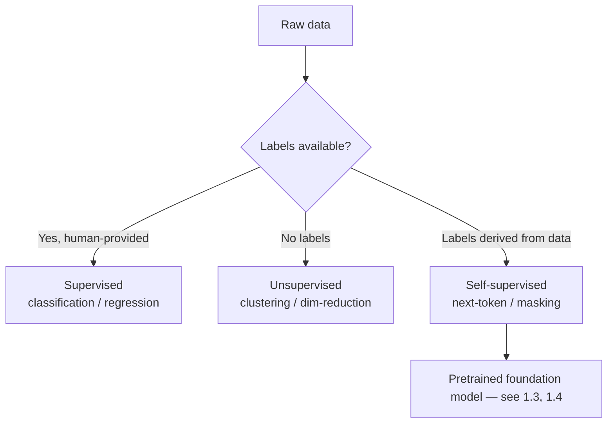

# 0.1 Machine Learning Foundations

### Study Notes — Book Style · Generative AI Learning Plan · Foundations

> **How to read this file.** This is the ground floor of the whole book. Everything that comes later — the loss curves you will watch in *1.3 Training & Inference Lifecycle*, the way *1.4 Model Landscape* compares model families, and the retrieval quality metrics in *4.1 Embeddings & Vector Search* — rests on the vocabulary defined here: what learning *is*, how we split data honestly, and how we measure "good." Read this before the probability (*0.2*) and optimization (*0.4*) chapters, because those tell you *how* the learning happens while this chapter tells you *what* we are trying to learn and *whether we succeeded*. If you already train models daily, skim to the metric-selection table and pitfalls.
>
> **Sources synthesized:** Hastie, Tibshirani & Friedman, *Elements of Statistical Learning*; Goodfellow, Bengio & Courville, *Deep Learning* (ch. 5); scikit-learn user guide (model selection, metrics); Google ML Crash Course; and standard 2024–2026 ML-interview canon.

---

## 1. What "learning" means: the three paradigms

**Definition.** Machine learning is the practice of fitting a function `f(x) → y` from data rather than hand-writing the rules. The paradigms differ in what supervision the data carries.

- **Supervised learning** — every training example is a pair `(x, y)`: features and a known label. The model learns to predict `y`. Examples: spam/not-spam (classification), house price (regression).
- **Unsupervised learning** — only `x`, no labels. The model finds structure: clusters (k-means), density, or low-dimensional representations (PCA, see *0.3*).
- **Self-supervised learning** — labels are *manufactured from the data itself*. You hide part of the input and ask the model to predict it. This is the engine behind modern LLMs: "predict the next token" turns an unlabeled corpus into a supervised problem with billions of free labels. This is exactly the pretraining objective discussed in *1.3*.

**Intuition.** Supervised learning is studying with an answer key. Unsupervised is walking into a library with no catalog and grouping books by feel. Self-supervised is covering a word in a sentence you already know and quizzing yourself — the "answer" was there all along.

**Example.** Given customer reviews: predicting a 1–5 star rating attached to each review is supervised; grouping reviews into themes with no ratings is unsupervised; masking random words and predicting them (BERT-style) is self-supervised.



---

## 2. The bias–variance tradeoff

**Definition.** Expected test error decomposes into three parts: **bias²** (error from wrong assumptions / too-simple model), **variance** (error from sensitivity to the particular training sample), and **irreducible noise**.

`Error ≈ Bias² + Variance + σ²`

**Intuition.** Bias is being *consistently wrong*; variance is being *inconsistently right*. A straight line fit to a curve has high bias (underfits). A degree-15 polynomial threads every point but swings wildly on new data (high variance, overfits). The art is the sweet spot in between.

**Example.** Predicting exam scores from hours studied: a constant "everyone gets 70" has huge bias. A model memorizing each student has huge variance. A gentle linear-plus-diminishing-returns curve balances both.

Interestingly, very large neural networks (LLMs) partly escape the classic U-curve via the **double descent** phenomenon — test error can *fall again* past the interpolation threshold. Worth knowing for 2026 interviews.

---

## 3. Overfitting, underfitting, and regularization

**Definition.** **Overfitting** = low training error, high validation error (memorized noise). **Underfitting** = high training error too (model too weak or under-trained). **Regularization** is any technique that constrains the model to reduce variance.

**Techniques.**

- **L2 (Ridge)** — add `λ Σ wᵢ²` to the loss. Shrinks weights smoothly toward zero; discourages any single large weight.
- **L1 (Lasso)** — add `λ Σ |wᵢ|`. Drives some weights to *exactly* zero → feature selection / sparsity.
- **Dropout** — randomly zero a fraction of activations each step; forces redundancy. Ubiquitous in deep nets (see *0.5*).
- **Early stopping** — halt training when validation loss stops improving. Cheap and effective; directly relevant to the training loop in *1.3*.

**Intuition.** L2 says "keep everyone small"; L1 says "fire the useless features." Dropout is like a team that trains with random members benched, so no one becomes a single point of failure.

**Example.** A logistic regression with 500 correlated features overfits. Adding L1 zeroes ~450 of them, leaving an interpretable, generalizable subset.

```python
import numpy as np
from sklearn.linear_model import LogisticRegression
from sklearn.datasets import make_classification
from sklearn.model_selection import train_test_split

X, y = make_classification(n_samples=2000, n_features=50, n_informative=8, random_state=0)
Xtr, Xte, ytr, yte = train_test_split(X, y, test_size=0.3, random_state=0)

for C in [100, 1.0, 0.05]:          # C = 1/λ ; smaller C = stronger regularization
    clf = LogisticRegression(penalty="l1", C=C, solver="liblinear").fit(Xtr, ytr)
    nonzero = np.sum(clf.coef_ != 0)
    print(f"C={C:>5}: train={clf.score(Xtr,ytr):.3f} "
          f"test={clf.score(Xte,yte):.3f} nonzero_features={nonzero}")
```

---

## 4. Honest evaluation: splits, cross-validation, leakage

**Definition.** Split data into **train** (fit parameters), **validation** (tune hyperparameters / choose models), and **test** (touched *once*, final estimate). **k-fold cross-validation** rotates the validation role across k slices to use data efficiently and reduce estimate variance.

**Data leakage** is when information unavailable at prediction time sneaks into training, inflating scores that then collapse in production. Classic causes: scaling/imputing *before* splitting (test statistics leak in), using future data to predict the past, or target-derived features.

**Intuition.** The test set is a sealed exam. If you peek at it while tuning, your grade is fiction. Cross-validation is re-taking practice exams with different question sets to see how stable you are.

**Example (correct pipeline avoiding leakage).**

```python
from sklearn.pipeline import Pipeline
from sklearn.preprocessing import StandardScaler
from sklearn.model_selection import cross_val_score
from sklearn.ensemble import RandomForestClassifier

# Scaling lives INSIDE the pipeline, so each CV fold scales using only its own train rows.
pipe = Pipeline([("scale", StandardScaler()),
                 ("clf", RandomForestClassifier(n_estimators=200, random_state=0))])
scores = cross_val_score(pipe, X, y, cv=5, scoring="roc_auc")
print(f"5-fold ROC-AUC: {scores.mean():.3f} ± {scores.std():.3f}")
```

For time series, use **forward-chaining** (`TimeSeriesSplit`) — never shuffle time.

---

## 5. Class imbalance

**Definition.** When one class dominates (e.g., 0.2% fraud), accuracy becomes useless — "predict never-fraud" scores 99.8%.

**Fixes.** Resampling (SMOTE oversampling, or undersampling the majority), **class weights** in the loss, threshold tuning, and — most importantly — choosing imbalance-aware metrics (PR-AUC, recall, F1) over accuracy.

**Intuition.** A metric that rewards ignoring the rare class will train a model that ignores the rare class. Match the metric to what you actually care about (catching fraud).

---

## 6. Evaluation metrics

**Classification.** From the **confusion matrix** (TP, FP, TN, FN):

- **Accuracy** = (TP+TN)/all — misleading under imbalance.
- **Precision** = TP/(TP+FP) — "when I say positive, how often right?" Cost of false alarms.
- **Recall (sensitivity)** = TP/(TP+FN) — "of all real positives, how many caught?" Cost of misses.
- **F1** = harmonic mean of precision & recall — one number when both matter.
- **ROC-AUC** — ranking quality across all thresholds; robust but *optimistic* under heavy imbalance.
- **PR-AUC** — precision-recall area; the better choice when positives are rare.

**Regression.** **MSE** (penalizes large errors quadratically), **RMSE** (same units as target), **MAE** (robust to outliers, linear penalty), **R²** (fraction of variance explained; can be negative).

```python
from sklearn.metrics import (confusion_matrix, precision_score, recall_score,
                             f1_score, roc_auc_score, average_precision_score)
clf = LogisticRegression(max_iter=1000).fit(Xtr, ytr)
p = clf.predict(Xte); proba = clf.predict_proba(Xte)[:, 1]
print("confusion:\n", confusion_matrix(yte, p))
print(f"precision={precision_score(yte,p):.3f} recall={recall_score(yte,p):.3f} "
      f"F1={f1_score(yte,p):.3f}")
print(f"ROC-AUC={roc_auc_score(yte,proba):.3f} PR-AUC={average_precision_score(yte,proba):.3f}")
```

### 6.1 Choosing the metric by problem

| Situation | Prefer | Why |
|---|---|---|
| Balanced classes, equal costs | Accuracy / F1 | Simple, interpretable |
| Rare positive (fraud, disease) | PR-AUC, Recall | Accuracy/ROC-AUC over-optimistic |
| False alarms expensive (spam→inbox) | Precision | Minimize wrongful positives |
| Misses expensive (cancer screen) | Recall | Minimize missed positives |
| Need threshold-free ranking | ROC-AUC / PR-AUC | Evaluate the score, not one cutoff |
| Regression, outliers present | MAE | Linear, robust penalty |
| Regression, big errors intolerable | RMSE / MSE | Quadratic penalty |
| Explaining variance to stakeholders | R² | Intuitive 0–1 (usually) |

---

## 7. Real-world industry use cases

**Finance — credit default / fraud.** Extreme imbalance (fraud ≈ 0.1–1%). Teams optimize **PR-AUC** and set the decision threshold from a cost matrix (a missed fraud costs far more than a reviewed false alarm). Regularization (L2) stabilizes logistic scorecards that regulators must inspect. Leakage is a firing offense here: using post-transaction fields (e.g., "chargeback flag") as a feature secretly encodes the label.

**E-commerce — churn & recommendation.** Churn prediction is imbalanced (most users stay), so **recall at fixed precision** drives retention-offer budgets. Recommendation quality uses ranking metrics (precision@k, NDCG) built on embeddings from *4.1*. Cross-validation must respect user boundaries so the same user's sessions do not straddle train and test (a subtle leakage).

Both industries live or die by the **train/serve skew** check: the features computed offline must be reproducible in production at request time.

---

## 8. Common pitfalls

- **Tuning on the test set.** Any decision informed by test performance corrupts it. Use validation / CV.
- **Preprocessing before splitting.** Fit scalers/imputers on train only; wrap them in a pipeline.
- **Accuracy on imbalanced data.** Report precision/recall/PR-AUC instead.
- **Target leakage.** Audit each feature: "Would this value exist *before* the outcome?"
- **Random splits on time series.** Use forward-chaining.
- **Comparing models on different splits.** Fix the random seed / folds.
- **Optimizing a metric no one cares about.** Confirm the business cost before choosing F1 vs recall.
- **Ignoring the irreducible-noise floor.** Chasing 100% accuracy on inherently noisy labels wastes effort.

---

## Wrap-Up

**Through-line.** This chapter set the contract for the rest of the book: we fit functions from data, we fight the bias–variance war with regularization, we judge ourselves with metrics matched to the problem, and we protect that judgment with clean splits. Next, *0.2 Probability & Statistics* formalizes the uncertainty underneath every prediction; *0.4 Optimization* explains the machinery that actually minimizes the losses named here; and *0.5 Deep Learning Foundations* scales these ideas into the networks that *1.1–1.4* turn into modern generative models. Self-supervised learning, introduced above, is the conceptual seed of LLM pretraining in *1.3*.

**Quick reference.**

| Concept | One-liner |
|---|---|
| Supervised / Unsupervised / Self-supervised | Labels given / none / derived from data |
| Bias–variance | Too simple vs too sensitive |
| Overfit / Underfit | Memorized noise vs too weak |
| L1 / L2 / Dropout / Early stop | Sparsity / shrinkage / redundancy / halt in time |
| Train/Val/Test | Fit / tune / final one-shot estimate |
| Leakage | Future/target info in features |
| PR-AUC vs ROC-AUC | Prefer PR-AUC when positives rare |

### Interview Questions & Answers

1. **Q: Define bias and variance.** A: Bias is error from oversimplified assumptions (underfitting); variance is error from over-sensitivity to the training sample (overfitting). Total error = bias² + variance + irreducible noise.
2. **Q: How do L1 and L2 differ?** A: L1 (Lasso) adds absolute-value penalty, yielding sparse/zeroed weights (feature selection); L2 (Ridge) adds squared penalty, shrinking weights smoothly without zeroing.
3. **Q: Why not use accuracy for fraud detection?** A: With 0.1% positives, predicting "never fraud" scores 99.9% yet catches nothing. Use PR-AUC / recall.
4. **Q: What is data leakage? Give an example.** A: Information unavailable at prediction time entering training — e.g., scaling on the full dataset before splitting, or using a post-outcome field as a feature.
5. **Q: Precision vs recall — when do you favor each?** A: Precision when false positives are costly (spam filter); recall when false negatives are costly (cancer screening).
6. **Q: Why validation *and* test sets?** A: Validation guides tuning (repeatedly); test gives an unbiased final estimate touched once, uncorrupted by tuning.
7. **Q: What is cross-validation good for?** A: Efficient use of limited data and a lower-variance performance estimate by rotating the validation fold.
8. **Q: What is self-supervised learning and why does it matter for LLMs?** A: Labels are generated from the data (e.g., next-token prediction), enabling training on massive unlabeled corpora — the basis of foundation-model pretraining (*1.3*).
9. **Q: RMSE vs MAE?** A: RMSE penalizes large errors quadratically (sensitive to outliers); MAE is linear and outlier-robust.
10. **Q: Can R² be negative?** A: Yes — when the model predicts worse than the mean baseline.
11. **Q: What is double descent?** A: For very over-parameterized models, test error can decrease again beyond the interpolation threshold, complicating the classic bias–variance U-curve.
12. **Q: Three ways to handle class imbalance?** A: Resampling (SMOTE/undersampling), class weights in the loss, and threshold tuning with imbalance-aware metrics.

### Mini-glossary

- **Confusion matrix** — table of TP/FP/TN/FN counts.
- **Hyperparameter** — a setting chosen before training (e.g., λ, tree depth).
- **Generalization** — performance on unseen data.
- **SMOTE** — synthetic oversampling of the minority class.
- **Irreducible error** — noise no model can remove.

### Further reading

- Hastie et al., *Elements of Statistical Learning*, ch. 2 & 7.
- scikit-learn docs: *Model selection* and *Metrics*.
- Belkin et al. (2019), "Reconciling modern ML and the bias–variance trade-off" (double descent).
