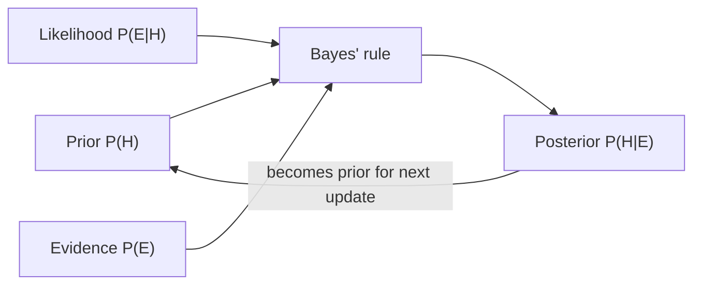

# 0.2 Probability and Statistics

### Study Notes — Book Style · Generative AI Learning Plan · Foundations

> **How to read this file.** Probability is the native language of generative AI: a language model is literally a conditional probability distribution `P(next token | context)`, the sampling temperature in *1.3 Training & Inference Lifecycle* is a probability knob, and the "confidence" of a retrieval score in *4.1 Embeddings & Vector Search* is only meaningful once you understand distributions. This chapter builds that vocabulary from Bayes' theorem through hypothesis testing. It pairs with *0.1 ML Foundations* (which used these ideas for metrics) and feeds *0.4 Optimization* (MLE *is* the objective most losses minimize). If you are prepping interviews, the brain-teaser section at the end is the highest-yield part.
>
> **Sources synthesized:** Wasserman, *All of Statistics*; Blitzstein & Hwang, *Introduction to Probability*; Bishop, *Pattern Recognition and Machine Learning* (ch. 1–2); Ron Kohavi et al. on online A/B testing; standard quant/ML interview canon 2024–2026.

---

## 1. Probability basics

**Definition.** A probability is a number in [0, 1] assigned to an event in a sample space Ω. Axioms: `P(Ω)=1`, `P(A) ≥ 0`, and for disjoint events `P(A∪B)=P(A)+P(B)`. Two events are **independent** iff `P(A∩B)=P(A)P(B)`.

**Intuition.** Probability is bookkeeping for uncertainty. Two views coexist: the **frequentist** ("long-run fraction over many trials") and the **Bayesian** ("degree of belief, updated by evidence"). Modern ML uses both — cross-validation is frequentist; MAP estimation is Bayesian.

**Example.** Two fair dice. `P(sum = 7)` = 6 favorable outcomes / 36 = 1/6. The events "die A is even" and "die B is 5" are independent: `P = 1/2 · 1/6 = 1/12`.

---

## 2. Conditional probability and Bayes' theorem

**Definition.** `P(A|B) = P(A∩B)/P(B)`. Rearranging gives **Bayes' theorem**:

`P(H|E) = P(E|H) · P(H) / P(E)`

where H is a hypothesis, E is evidence: posterior = likelihood × prior / evidence.

**Intuition.** Bayes tells you how to *update* belief when data arrives. The prior encodes what you thought before; the likelihood is how well the hypothesis explains the data; the posterior is the revised belief. This is the exact logic behind a Naive Bayes spam filter and, philosophically, behind any model that learns from data.

**Example — the classic false-positive trap.** A disease affects 1 in 1,000. A test is 99% sensitive and 95% specific. You test positive. What is `P(disease | positive)`?

`P(+|D)=0.99, P(D)=0.001, P(+|¬D)=0.05`
`P(+) = 0.99·0.001 + 0.05·0.999 = 0.0509`
`P(D|+) = 0.99·0.001 / 0.0509 ≈ 0.019` → only **~1.9%**.

The base rate dominates. This "base-rate neglect" is a favorite interview trap.



---

## 3. Common distributions

**Definition & when they appear.**

- **Bernoulli(p)** — a single yes/no trial. Mean `p`, variance `p(1-p)`. Models one click / one conversion.
- **Binomial(n, p)** — count of successes in n independent Bernoulli trials. Mean `np`. Models "conversions out of n visitors."
- **Normal(μ, σ²)** — the bell curve; arises whenever many small effects add up (see CLT). Foundation of z-scores, confidence intervals, weight initialization (*0.5*).
- **Poisson(λ)** — count of rare events per interval. Mean = variance = λ. Models arrivals: fraud attempts per hour, purchases per minute.

**Intuition.** Bernoulli is one coin flip; Binomial is many flips summed; Poisson is the limit of Binomial when n→∞, p→0 with np fixed (rare events); Normal is the limit of almost any sum (CLT).

```python
import numpy as np
rng = np.random.default_rng(0)
bern = rng.binomial(1, 0.3, 10000)       # Bernoulli(0.3)
binom = rng.binomial(20, 0.3, 10000)     # Binomial(20, 0.3), mean 6
pois = rng.poisson(4.0, 10000)           # Poisson(4)
norm = rng.normal(0, 1, 10000)           # standard Normal
for name, s in [("Bernoulli", bern), ("Binomial", binom),
                ("Poisson", pois), ("Normal", norm)]:
    print(f"{name:10s} mean={s.mean():.3f} var={s.var():.3f}")
```

---

## 4. Expectation and variance

**Definition.** Expectation `E[X] = Σ x·P(x)` (or ∫ x f(x) dx) is the long-run average. Variance `Var(X) = E[(X−E[X])²] = E[X²] − E[X]²` measures spread; standard deviation is its square root.

Key rules: `E[aX+b] = aE[X]+b`; `Var(aX+b) = a²Var(X)`; for independent X, Y, `Var(X+Y)=Var(X)+Var(Y)`; **linearity of expectation holds even for dependent variables** — a frequent interview lever.

**Intuition.** Expectation is the center of mass; variance is how far things scatter from it. In ML, the bias–variance decomposition of *0.1* is literally these operators applied to prediction error.

**Example.** A bet pays +\$10 with p=0.1, −\$1 with p=0.9. `E = 0.1·10 + 0.9·(−1) = 0.1`. Positive expectation, but high variance — one payout dominates.

---

## 5. MLE vs MAP

**Definition.** **Maximum Likelihood Estimation (MLE)** picks parameters θ that maximize `P(data | θ)`. **Maximum A Posteriori (MAP)** maximizes `P(θ | data) ∝ P(data|θ)·P(θ)` — MLE plus a prior.

**Intuition.** MLE asks "which θ makes what I saw most probable?" MAP adds a prior belief. Crucially, **a Gaussian prior on weights → L2 regularization, and a Laplace prior → L1** (link to *0.1*). So regularization is secretly Bayesian.

**Example.** Flip 10 coins, 7 heads. MLE says `p̂ = 0.7`. With a prior belief the coin is fair, MAP pulls the estimate back toward 0.5, more so with fewer observations. The likelihoods LLMs maximize in *1.3* (cross-entropy of the next token) are exactly negative log-likelihood — MLE at scale.

```python
import numpy as np
heads, n = 7, 10
p_grid = np.linspace(0.01, 0.99, 99)
loglik = heads*np.log(p_grid) + (n-heads)*np.log(1-p_grid)
print("MLE p:", round(p_grid[np.argmax(loglik)], 3))          # ~0.70
# MAP with Beta(5,5) prior (belief coin ~ fair)
logpost = loglik + 4*np.log(p_grid) + 4*np.log(1-p_grid)
print("MAP p:", round(p_grid[np.argmax(logpost)], 3))          # pulled toward 0.5
```

---

## 6. Sampling and the Central Limit Theorem

**Definition.** The **CLT** states that the distribution of the sample mean of n i.i.d. variables (finite variance) approaches Normal(μ, σ²/n) as n grows, *regardless of the original distribution*. Standard error of the mean = `σ/√n`.

**Intuition.** Averages are Gaussian even when individuals are not. This is why confidence intervals and t-tests work on almost any data given enough samples, and why the `1/√n` rate governs how fast estimates tighten — quadrupling data halves the error bar.

**Example.** Roll a (very non-normal) die many times; the distribution of the *average roll* over 30 dice is nearly a bell curve centered at 3.5.

---

## 7. Hypothesis testing and A/B basics

**Definition.** Set a **null hypothesis** H₀ (no effect) and alternative H₁. A **p-value** is `P(observing data this extreme or more | H₀ true)`. If p < α (commonly 0.05), reject H₀. A **t-test** compares means when variance is estimated from the sample.

- **Type I error (α)** — false positive (reject a true null).
- **Type II error (β)** — false negative (miss a real effect); **power = 1 − β**.

**Intuition.** A p-value is *not* "probability the null is true." It answers: "if nothing were going on, how surprising is this result?" Small p = surprising under H₀.

**A/B testing** is a controlled hypothesis test: randomize users to control vs treatment, measure a metric, test whether the difference is statistically significant *and* practically meaningful. Watch for **peeking** (checking significance repeatedly inflates false positives) and **multiple comparisons** (testing many metrics needs correction, e.g., Bonferroni).

**Example.**

```python
from scipy import stats
import numpy as np
rng = np.random.default_rng(1)
control  = rng.normal(100, 15, 500)      # baseline revenue
treat    = rng.normal(103, 15, 500)      # +3 lift
t, p = stats.ttest_ind(control, treat, equal_var=False)
print(f"t={t:.2f} p={p:.4f} -> {'significant' if p<0.05 else 'not significant'}")
```

---

## 8. Confidence intervals; correlation vs causation

**Confidence interval.** A 95% CI is `estimate ± 1.96 · SE`. Interpretation: over many repeated samples, 95% of such intervals contain the true parameter. It quantifies estimate precision — always report it beside a metric (recall *0.1*'s CV ± std).

**Correlation vs causation.** Correlation measures linear co-movement (Pearson r ∈ [−1, 1]); it does *not* imply one causes the other. Confounders (ice-cream sales and drownings both driven by summer) produce spurious correlation. Only randomized experiments (A/B) or careful causal inference license causal claims. This is the single most repeated caution in analytics interviews.

---

## 9. Real-world industry use cases

**Finance — risk and detection.** Poisson models fraud-attempt arrival rates; Bayesian updating powers real-time risk scores that revise as a transaction unfolds. Value-at-Risk relies on distributional assumptions (and famously fails when tails are fatter than Normal — a 2008 lesson). Hypothesis testing validates whether a new trading signal's edge is real or noise, with strict multiple-comparison control because thousands of signals are screened.

**E-commerce — experimentation engine.** A/B testing is the beating heart of product optimization: checkout-button color, recommendation ranking, pricing. Teams pre-compute required sample size from desired power and minimum detectable effect, forbid peeking (or use sequential/Bayesian tests that permit it), and separate statistical significance from business significance (a 0.1% lift can be significant yet not worth shipping). Conversion counts are Bernoulli/Binomial; the CLT justifies the Normal-approximation confidence intervals shown on dashboards.

---

## 10. Common pitfalls (and brain-teasers)

- **Base-rate neglect** — ignoring the prior, as in the disease-test example.
- **p-value misreading** — it is not P(H₀ true) nor P(you're wrong).
- **Peeking / p-hacking** — repeated looks or many metrics inflate false positives.
- **Confusing correlation with causation.**
- **Assuming Normality** for heavy-tailed data (finance returns).
- **Ignoring variance / sample size** — a flashy mean with n=5 is noise.

**Interview brain-teasers.**

- *Monty Hall:* Switching wins 2/3 — the host's choice injects information.
- *Two children, one is a boy:* `P(both boys) = 1/3` (not 1/2) under the "at least one boy" phrasing.
- *Birthday paradox:* Just 23 people → >50% chance of a shared birthday.
- *Expected coin flips to see HH:* 6 (use state/recursion). To see HT: 4. They differ — a great intuition check.

---

## Wrap-Up

**Through-line.** Probability turned the vague word "uncertainty" into arithmetic we can optimize. MLE — maximizing likelihood — is the objective that *0.4 Optimization* will minimize (as negative log-likelihood) and that *1.3* scales to trillions of tokens; Bayesian priors are the hidden identity of the regularizers in *0.1*; and the Normal distribution justifies both the confidence intervals here and the weight-initialization schemes in *0.5*. Every generative model you meet later is, at heart, a probability distribution you sample from.

**Quick reference.**

| Concept | One-liner |
|---|---|
| Bayes' theorem | posterior ∝ likelihood × prior |
| Bernoulli / Binomial | one trial / sum of n trials |
| Poisson | rare-event counts, mean = variance = λ |
| Normal | sum-of-many limit (CLT) |
| MLE / MAP | maximize likelihood / likelihood × prior |
| CLT | sample means → Normal, SE = σ/√n |
| p-value | P(data this extreme \| H₀) |
| CI | estimate ± 1.96·SE (95%) |

### Interview Questions & Answers

1. **Q: State Bayes' theorem.** A: `P(H|E) = P(E|H)P(H)/P(E)`; posterior = likelihood × prior / evidence.
2. **Q: What does a p-value mean?** A: The probability of data at least this extreme assuming the null is true — not the probability the null is true.
3. **Q: MLE vs MAP?** A: MLE maximizes P(data|θ); MAP adds a prior and maximizes P(θ|data). MAP with a Gaussian prior equals L2-regularized MLE.
4. **Q: State the CLT and its practical consequence.** A: Sample means of i.i.d. finite-variance variables tend to Normal(μ, σ²/n); error shrinks as 1/√n.
5. **Q: Type I vs Type II error?** A: Type I = false positive (reject true null, rate α); Type II = false negative (miss real effect, rate β); power = 1−β.
6. **Q: Why is correlation not causation?** A: Confounders or reverse causation can produce co-movement without a causal link; only controlled experiments establish causation.
7. **Q: Mean and variance of Bernoulli(p)?** A: Mean p, variance p(1−p).
8. **Q: Why is base rate crucial in a positive test?** A: With a rare condition, false positives from the large negative population swamp true positives, so posterior can stay low despite high sensitivity.
9. **Q: What breaks A/B tests?** A: Peeking, insufficient power, multiple comparisons, and confusing statistical with practical significance.
10. **Q: Monty Hall — switch or stay?** A: Switch; it wins 2/3 of the time.
11. **Q: Does linearity of expectation need independence?** A: No — `E[X+Y]=E[X]+E[Y]` always; variance additivity needs independence.
12. **Q: When use Poisson over Binomial?** A: For counts of rare events over a continuum with large n and small p (np ≈ λ fixed).

### Mini-glossary

- **Prior / Posterior** — belief before / after seeing data.
- **Likelihood** — P(data | parameters).
- **Standard error** — standard deviation of an estimator, σ/√n.
- **Confounder** — a variable driving two others, faking a correlation.
- **Power** — probability of detecting a true effect.

### Further reading

- Blitzstein & Hwang, *Introduction to Probability* (excellent intuition).
- Wasserman, *All of Statistics*, ch. 6–10.
- Kohavi, Tang & Xu, *Trustworthy Online Controlled Experiments*.
