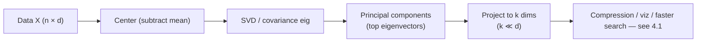

# 0.3 Linear Algebra Essentials

### Study Notes — Book Style · Generative AI Learning Plan · Foundations

> **How to read this file.** Linear algebra is the arithmetic of deep learning: every layer is a matrix multiply, every embedding in *4.1 Embeddings & Vector Search* is a vector in a high-dimensional space, and the attention mechanism in *1.1 Transformer Architecture* is nothing but dot products between query and key vectors scaled and softmaxed. This chapter gives you exactly the operations you will see again — dot products, matmul, norms, rank, eigen-decomposition, SVD, and PCA — with the geometric intuition that makes them stick. Read alongside *0.4 Optimization* (gradients are vectors of partial derivatives) and *0.5 Deep Learning Foundations* (where these matmuls become the forward pass).
>
> **Sources synthesized:** Strang, *Introduction to Linear Algebra* & MIT 18.06; Goodfellow et al., *Deep Learning* (ch. 2); Deisenroth, Faisal & Ong, *Mathematics for Machine Learning*; 3Blue1Brown *Essence of Linear Algebra*.

---

## 1. Scalars, vectors, matrices, tensors

**Definition.** A **scalar** is a single number (rank-0). A **vector** is an ordered list (rank-1), living in ℝⁿ. A **matrix** is a 2-D grid (rank-2), ℝ^{m×n}. A **tensor** generalizes to any number of dimensions (rank-k).

**Intuition.** Think of dimensionality as "how many indices to address one number." A word embedding is a vector; a weight layer is a matrix; a batch of RGB images is a rank-4 tensor `[batch, channel, height, width]`. Deep-learning frameworks (PyTorch) are "tensor calculators with autograd."

**Example.** A minibatch of 32 sentences, each 128 tokens, each token a 768-dim embedding is a tensor of shape `[32, 128, 768]` — precisely the input shape flowing into a Transformer block in *1.1*.

```python
import numpy as np
scalar = np.array(3.0)
vector = np.array([1.0, 2.0, 3.0])          # shape (3,)
matrix = np.array([[1., 2.], [3., 4.]])     # shape (2,2)
tensor = np.zeros((32, 128, 768))           # a batch of token embeddings
print(scalar.ndim, vector.ndim, matrix.ndim, tensor.ndim)   # 0 1 2 3
```

---

## 2. Dot product

**Definition.** For vectors a, b ∈ ℝⁿ: `a·b = Σ aᵢbᵢ = ‖a‖‖b‖cos θ`.

**Intuition.** The dot product measures *alignment*. It is large and positive when vectors point the same way, zero when orthogonal, negative when opposed. This single fact powers **cosine similarity** — the core of semantic search in *4.1* — and the query–key scores in attention (*1.1*).

**Example.** `a=[1,0], b=[1,1]`: `a·b = 1`, `‖a‖=1, ‖b‖=√2`, so `cos θ = 1/√2 → θ = 45°`. Two embeddings with high dot product are "about the same thing."

```python
a = np.array([1.0, 0.0]); b = np.array([1.0, 1.0])
cos = a @ b / (np.linalg.norm(a) * np.linalg.norm(b))
print("dot:", a @ b, "cosine:", round(cos, 3))   # 1.0, 0.707
```

---

## 3. Matrix multiplication

**Definition.** For A ∈ ℝ^{m×k}, B ∈ ℝ^{k×n}, product C = AB ∈ ℝ^{m×n} with `Cᵢⱼ = Σ_l Aᵢₗ Bₗⱼ`. Inner dimensions must match. **Not commutative:** AB ≠ BA in general.

**Intuition.** A matrix is a *linear transformation* — it rotates, scales, and shears space. Multiplying by A sends every input vector to a new location; matrix multiplication *composes* two transformations. A neural network layer `y = Wx + b` is exactly "apply linear map W, then shift by b."

**Example.** Rotating a 2-D point 90° uses `[[0,−1],[1,0]]`. Applying it to `[1,0]` gives `[0,1]`.

```python
W = np.array([[0., -1.], [1., 0.]])   # 90-degree rotation
x = np.array([1.0, 0.0])
print(W @ x)   # [0. 1.]
# Batched layer: (batch=4, in=3) @ (in=3, out=2) -> (4, 2)
X = np.random.randn(4, 3); Wl = np.random.randn(3, 2)
print((X @ Wl).shape)   # (4, 2)
```

Matmul dominates the FLOPs of every LLM; GPUs exist largely to do it fast.

---

## 4. Norms

**Definition.** A norm measures vector length. **L2 (Euclidean)** `‖x‖₂ = √Σxᵢ²`; **L1 (Manhattan)** `‖x‖₁ = Σ|xᵢ|`; **L∞** = max|xᵢ|. A matrix has the **Frobenius norm** = √(sum of squared entries).

**Intuition.** Norms quantify "how big." L2 penalizes large components heavily (round contours); L1 spreads penalty linearly (diamond contours) and favors sparsity — the geometric reason L1 regularization zeroes weights (*0.1*, *0.4*). Normalizing a vector (dividing by its L2 norm) is what makes cosine similarity scale-free in *4.1*.

**Example.** For `x=[3,4]`: L2 = 5, L1 = 7, L∞ = 4.

---

## 5. Transpose, inverse, rank

**Definition.**

- **Transpose** Aᵀ flips rows and columns: `(Aᵀ)ᵢⱼ = Aⱼᵢ`. Appears everywhere (e.g., `QKᵀ` in attention).
- **Inverse** A⁻¹ satisfies `A A⁻¹ = I`; exists only for square, **full-rank** matrices. Solves `Ax = b` as `x = A⁻¹b`.
- **Rank** = number of linearly independent rows/columns = dimension of the space the matrix spans. **Full rank** means no redundancy; **rank-deficient** means information is lost (the map collapses dimensions).

**Intuition.** Rank is the "true dimensionality" of a transformation. A rank-1 matrix squashes all inputs onto a single line — irreversible, hence no inverse. In ML we often *want* low rank: it means data really lives in fewer dimensions than it appears (the premise of PCA and LoRA fine-tuning).

**Example.** `[[1,2],[2,4]]` has rank 1 (row 2 = 2× row 1); it is singular, no inverse, determinant 0.

```python
A = np.array([[1., 2.], [2., 4.]])
print("rank:", np.linalg.matrix_rank(A))          # 1
B = np.array([[2., 1.], [1., 3.]])
print("inverse exists, det:", round(np.linalg.det(B), 3))
print(np.linalg.inv(B) @ B)                        # ~ identity
```

---

## 6. Eigenvalues and eigenvectors

**Definition.** For square A, a nonzero vector v with `A v = λ v` is an **eigenvector**; λ is its **eigenvalue**. The eigenvector's direction is unchanged by A; only its length scales by λ.

**Intuition.** Eigenvectors are the "natural axes" of a transformation — the directions the matrix merely stretches. Eigenvalues say by how much. They diagnose stability (do repeated applications explode or vanish? — echoing the vanishing/exploding-gradient theme of *0.4*/*0.5*) and reveal the principal directions of variation in data.

**Example.** For a diagonal `[[3,0],[0,0.5]]`, eigenvectors are the axes with eigenvalues 3 and 0.5: it triples along x and halves along y.

```python
A = np.array([[2., 0.], [0., 3.]])
vals, vecs = np.linalg.eig(A)
print("eigenvalues:", vals)     # [2. 3.]
```

---

## 7. Singular Value Decomposition (SVD)

**Definition.** *Any* matrix factors as `A = U Σ Vᵀ`, where U and V are orthogonal (rotations) and Σ is diagonal with non-negative **singular values** σ₁ ≥ σ₂ ≥ … The largest singular values carry the most of the matrix's "energy."

**Intuition.** SVD says every linear map is "rotate → scale along axes → rotate." Keeping only the top-k singular values gives the **best rank-k approximation** (Eckart–Young theorem) — the mathematical basis of compression, denoising, latent-semantic analysis, and modern **low-rank adapters (LoRA)** used to fine-tune LLMs efficiently (*1.3*, *1.4*).

**Example — image/data compression.**

```python
A = np.random.default_rng(0).standard_normal((50, 40))
U, S, Vt = np.linalg.svd(A, full_matrices=False)
k = 5
A_k = U[:, :k] @ np.diag(S[:k]) @ Vt[:k, :]      # rank-5 approximation
energy = (S[:k]**2).sum() / (S**2).sum()
print(f"top-{k} singular values retain {energy:.1%} of energy")
```

---

## 8. PCA — link to embeddings (4.1)

**Definition.** **Principal Component Analysis** finds orthogonal directions (principal components) that capture maximum variance. It is the eigen-decomposition of the covariance matrix — equivalently, the SVD of the mean-centered data. Projecting onto the top-k components reduces dimensionality while preserving most variance.

**Intuition.** PCA rotates the data so the first axis points along the direction of greatest spread. High-dimensional embeddings (768-d, 1536-d) from *4.1* often live near a much lower-dimensional manifold; PCA (or UMAP/t-SNE for visualization) reveals and compresses that structure — useful for speeding up vector search and for plotting embeddings in 2-D.



```python
from sklearn.decomposition import PCA
emb = np.random.default_rng(1).standard_normal((1000, 128))   # pretend embeddings
pca = PCA(n_components=2).fit(emb)
print("variance explained by 2 comps:", pca.explained_variance_ratio_.sum().round(3))
```

---

## 9. Why linear algebra underpins deep learning and attention

Every operation in a Transformer (*1.1*) is linear algebra plus a nonlinearity:

- Token embeddings = rows of an embedding **matrix** (*1.2 Tokenization* maps tokens to indices; the embedding matrix maps indices to vectors).
- **Self-attention** computes `softmax(QKᵀ/√d) V` — Q, K, V are linear projections (matmuls) of the input; `QKᵀ` is a matrix of dot products (alignment scores from §2); the `√d` scaling controls variance (a probability/norm concern from *0.2*/§4).
- Feed-forward layers, output projection, and even the final vocabulary logits are matrix multiplies.

So attention "attends" by measuring dot-product similarity between query and key vectors — the same geometry as cosine similarity in vector search (*4.1*). Master §2 and §3 and you understand the load-bearing math of the entire architecture.

---

## 10. Real-world industry use cases

**Finance — covariance and PCA.** Portfolio risk is a covariance **matrix**; its eigen-decomposition (PCA) extracts a handful of factors (market, sector, rates) explaining most co-movement, shrinking a 500-asset problem to ~10 factors. SVD denoises correlation matrices before optimization, and eigenvalue spectra flag near-singular (unstable) portfolios.

**E-commerce — recommendations and search.** Classic collaborative filtering factorizes the sparse user–item **matrix** via truncated SVD into low-dimensional user and item vectors whose dot products predict preference — the direct ancestor of the embedding dot-products in *4.1*. Product-image and text embeddings are compressed with PCA to make billion-scale approximate-nearest-neighbor search affordable.

---

## 11. Common pitfalls

- **Shape mismatches.** Inner dimensions must align for matmul; broadcasting errors are the #1 debugging cost in deep learning.
- **Confusing element-wise (`*`) with matmul (`@`).** They are different operations.
- **Assuming AB = BA.** Matrix multiplication is not commutative.
- **Inverting when you should solve.** Use `np.linalg.solve(A,b)`, not `inv(A)@b` — faster and more numerically stable.
- **Ignoring rank deficiency / near-singularity.** Tiny singular values cause blow-ups; regularize or use pseudo-inverse.
- **Forgetting to center data before PCA** — components will chase the mean, not the variance.
- **Numerical precision.** float32 vs float64 matters at scale; accumulate carefully.

---

## Wrap-Up

**Through-line.** Linear algebra is the substrate: vectors carry meaning (embeddings, *4.1*), matrices transform it (layers, *0.5*), dot products measure alignment (attention, *1.1*), and eigen/SVD reveal the low-dimensional truth inside high-dimensional data (PCA, LoRA). The next chapter, *0.4 Optimization*, adds calculus on top — gradients are just vectors, and updating weights is vector arithmetic — turning these static operations into *learning*.

**Quick reference.**

| Concept | One-liner |
|---|---|
| Dot product | alignment; basis of cosine similarity & attention scores |
| Matmul | composition of linear maps; the FLOPs of LLMs |
| Norm (L1/L2) | vector length; L1 → sparsity |
| Rank | true dimensionality of a transformation |
| Eigenvector | direction unchanged (only scaled) by a matrix |
| SVD | A = UΣVᵀ; best low-rank approximation |
| PCA | max-variance directions; dimensionality reduction |

### Interview Questions & Answers

1. **Q: Geometric meaning of the dot product?** A: `‖a‖‖b‖cos θ` — measures alignment; zero means orthogonal. Basis of cosine similarity and attention scores.
2. **Q: Is matrix multiplication commutative?** A: No; AB ≠ BA in general, and shapes may not even permit both.
3. **Q: What is matrix rank?** A: Number of linearly independent rows/columns; the dimension of the space the matrix spans.
4. **Q: When does a matrix have no inverse?** A: When it is not square or is rank-deficient (determinant 0 / a zero singular value).
5. **Q: Define eigenvector and eigenvalue.** A: v with Av = λv; direction unchanged, scaled by λ.
6. **Q: What does SVD give you?** A: Factorization UΣVᵀ; truncating to top-k singular values yields the optimal rank-k approximation.
7. **Q: How does PCA relate to SVD?** A: PCA is the SVD of mean-centered data (or eig of the covariance matrix); top components maximize variance.
8. **Q: Why is attention linear algebra?** A: It computes softmax(QKᵀ/√d)V — projections (matmuls) and dot-product similarities between queries and keys.
9. **Q: L1 vs L2 norm effect?** A: L2 penalizes large values smoothly; L1 induces sparsity due to its diamond-shaped contours.
10. **Q: Why prefer solve over inverse?** A: `solve` is faster and numerically more stable than forming the explicit inverse.
11. **Q: What is a tensor in DL?** A: A multi-dimensional array; e.g., a batch of token embeddings shaped [batch, seq, dim].
12. **Q: Why do we scale attention scores by √d?** A: To keep the dot-product variance bounded so softmax gradients do not saturate.

### Mini-glossary

- **Orthogonal matrix** — rotation/reflection; columns are orthonormal, Qᵀ = Q⁻¹.
- **Singular value** — non-negative scaling factor in SVD.
- **Frobenius norm** — √(sum of squared entries) of a matrix.
- **Covariance matrix** — pairwise feature co-variation; symmetric.
- **Low-rank approximation** — compressing a matrix using top singular values (basis of LoRA).

### Further reading

- Strang, *Introduction to Linear Algebra*; MIT 18.06 lectures.
- 3Blue1Brown, *Essence of Linear Algebra* (visual intuition).
- Deisenroth et al., *Mathematics for Machine Learning*, ch. 2–4.
