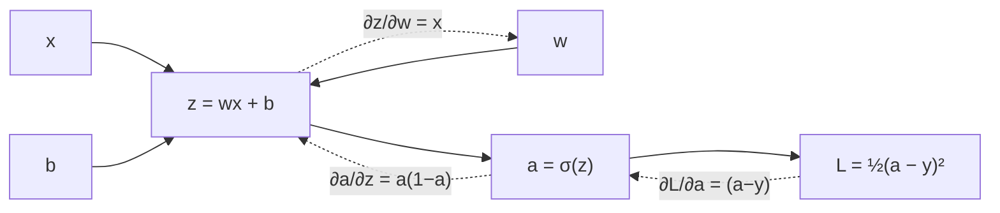
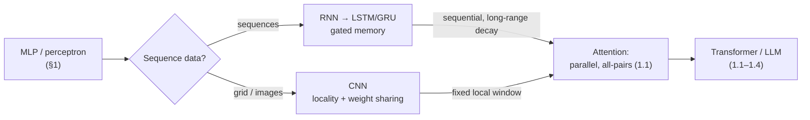

# 0.5 Deep Learning Foundations

### Study Notes — Book Style · Generative AI Learning Plan · Foundations

> **How to read this file.** This chapter is the bridge from classical ML to the Transformer era. It assembles the pieces the previous foundations built — linear algebra (*0.3*) for the matmuls, optimization (*0.4*) for the gradient steps, probability (*0.2*) for softmax and likelihood — into neural networks: the perceptron, the MLP, backpropagation, and the two architectures that dominated before Transformers (CNNs and RNNs/LSTMs). It ends by showing *exactly why* the field moved to attention, handing you off to *1.1 Transformer Architecture*. Read *0.3* and *0.4* first; this is where they come alive as a trainable model, and it sets up *1.1–1.4* and the embeddings of *4.1*.
>
> **Sources synthesized:** Goodfellow, Bengio & Courville, *Deep Learning* (ch. 6, 9, 10); Nielsen, *Neural Networks and Deep Learning*; Hochreiter & Schmidhuber (1997) *LSTM*; Vaswani et al. (2017) *Attention Is All You Need*; Karpathy's neural-net lectures; PyTorch docs.

---

## 1. Perceptron and the multilayer perceptron (MLP)

**Definition.** A **perceptron** computes `y = f(w·x + b)` — a weighted sum (dot product, *0.3*) passed through an activation `f`. Stacking layers of these, each fully connected to the next, gives a **multilayer perceptron (MLP)**: `h₁ = f(W₁x + b₁)`, `h₂ = f(W₂h₁ + b₂)`, … The hidden layers let the network learn nonlinear functions.

**Intuition.** A single perceptron draws one straight decision boundary — it famously cannot solve XOR. Add a hidden layer with a nonlinearity and the network bends space until the problem becomes linearly separable. The **universal approximation theorem** says a wide-enough one-hidden-layer MLP can approximate any continuous function; depth makes this efficient.

**Example.** XOR needs 2 hidden units. Below, an MLP learns it from scratch.

```python
import torch, torch.nn as nn
X = torch.tensor([[0.,0.],[0.,1.],[1.,0.],[1.,1.]])
y = torch.tensor([[0.],[1.],[1.],[0.]])              # XOR
net = nn.Sequential(nn.Linear(2,8), nn.ReLU(), nn.Linear(8,1), nn.Sigmoid())
opt = torch.optim.Adam(net.parameters(), lr=0.05); loss_fn = nn.BCELoss()
for _ in range(2000):
    opt.zero_grad(); L = loss_fn(net(X), y); L.backward(); opt.step()
print(net(X).round().squeeze().tolist())   # [0, 1, 1, 0]
```

---

## 2. Activation functions

**Definition.** The nonlinearity applied after each linear layer. Without it, stacked linear layers collapse into one linear map (*0.3*).

- **Sigmoid** `σ(x)=1/(1+e⁻ˣ)` — squashes to (0,1); used for probabilities/gates. Saturates → vanishing gradients (*0.4*).
- **Tanh** — squashes to (−1,1); zero-centered, better than sigmoid for hidden layers, still saturates.
- **ReLU** `max(0,x)` — cheap, non-saturating for positives; the workhorse of CNNs/MLPs. Can "die" (stuck at 0).
- **GELU** — smooth, probabilistic ReLU variant; the default in Transformers (*1.1*) and modern LLMs.
- **Softmax** — turns a vector of logits into a probability distribution; used at the output for multi-class and *inside attention* to weight tokens (*1.1*). Pairs with cross-entropy (*0.4*, *0.2*).

**Intuition.** ReLU won because it keeps gradients healthy and is trivially cheap; GELU refines it with a smooth curve that empirically trains Transformers better. Softmax is how a network expresses "how much of each option."

**Example.** `softmax([2.0, 1.0, 0.1]) ≈ [0.66, 0.24, 0.10]` — a peaked but soft distribution.

---

## 3. Forward pass and backpropagation (the chain rule)

**Definition.** The **forward pass** runs input through the layers to produce a prediction and a loss. **Backpropagation** applies the chain rule of calculus to compute `∂L/∂θ` for every parameter, propagating error from output back to input; the optimizer (*0.4*) then steps.

**Intuition.** Backprop answers "how much did each weight contribute to the error?" by reusing already-computed downstream gradients — it is dynamic programming on the chain rule. The gradient at layer ℓ is the gradient at layer ℓ+1 times the local derivative. This long product is exactly why vanishing/exploding gradients (*0.4*) arise.

**Worked example.** One neuron: `z = wx + b`, `a = σ(z)`, loss `L = ½(a − y)²`. By the chain rule:

`∂L/∂w = (a − y) · σ'(z) · x`, where `σ'(z) = a(1−a)`.

So for x=1, w=0.5, b=0, y=1: `z=0.5, a≈0.622`, `∂L/∂w = (0.622−1)·0.622·0.378·1 ≈ −0.089`. Gradient is negative → increase w to reduce loss.



```python
import torch
x = torch.tensor(1.0); w = torch.tensor(0.5, requires_grad=True); b = torch.tensor(0.0, requires_grad=True)
y = torch.tensor(1.0)
a = torch.sigmoid(w*x + b); L = 0.5*(a - y)**2
L.backward()
print("dL/dw:", round(w.grad.item(), 4))   # ~ -0.0889  (matches hand calc)
```

---

## 4. Weight initialization

**Definition.** How weights are set before training. **Xavier/Glorot** scales variance by fan-in+fan-out (good for tanh/sigmoid); **He/Kaiming** scales by fan-in (good for ReLU). Biases usually start at 0.

**Intuition.** Bad init breaks training before it begins: too large → exploding activations/gradients; too small → signal vanishes across depth (*0.4*). Proper init keeps activation variance roughly constant layer to layer, so gradients flow. This concern — variance control across a deep stack — recurs as the `√d` scaling in attention (*1.1*, *0.3*).

---

## 5. Normalization: batch norm and layer norm

**Definition.** **Batch normalization** normalizes each feature across the *batch* to zero mean / unit variance, then rescales with learned parameters. **Layer normalization** normalizes across the *features* of each individual example.

**Intuition.** Normalization keeps activations in a stable range, smoothing the loss landscape so higher learning rates are safe and training converges faster. BatchNorm shines in CNNs but depends on batch statistics (awkward for variable-length sequences and small batches). **LayerNorm is batch-independent**, which is why Transformers use it (*1.1*) — every token is normalized on its own. Modern LLMs favor RMSNorm, a LayerNorm simplification.

```python
import torch, torch.nn as nn
x = torch.randn(4, 16)                 # batch=4, features=16
print("LayerNorm out mean≈0:", nn.LayerNorm(16)(x).mean().abs().item() < 1e-5)
```

---

## 6. Convolutional neural networks (CNNs)

**Definition.** A **CNN** slides small learnable **filters (kernels)** across a grid input (image), computing local dot products to produce **feature maps** (**convolution**). **Pooling** (e.g., max-pool) downsamples, adding translation tolerance and shrinking spatial size. Stacked conv layers build a hierarchy: edges → textures → parts → objects.

**Intuition.** CNNs exploit two priors: **locality** (nearby pixels relate) and **weight sharing** (an edge detector is useful everywhere), giving huge parameter efficiency versus a dense MLP on pixels. This inductive bias is why CNNs dominated vision for a decade.

**Use cases.** Image classification, object detection, medical imaging, OCR feeding document pipelines; convolutional stems still appear in some vision-language models.

```python
import torch, torch.nn as nn
cnn = nn.Sequential(nn.Conv2d(3, 16, 3, padding=1), nn.ReLU(), nn.MaxPool2d(2))
img = torch.randn(1, 3, 32, 32)
print("feature map:", cnn(img).shape)   # [1, 16, 16, 16]
```

---

## 7. RNNs, LSTMs, GRUs

**Definition.** A **recurrent neural network (RNN)** processes a sequence one step at a time, carrying a **hidden state** `hₜ = f(W hₜ₋₁ + U xₜ)` that summarizes the past. **LSTMs** add a **cell state** and three **gates** (input, forget, output) that regulate what to remember, forget, and expose. **GRUs** are a lighter two-gate variant.

**Intuition.** Vanilla RNNs struggle with long-range dependencies because backprop-through-time multiplies many Jacobians → vanishing/exploding gradients (*0.4*). LSTM gates create a near-linear path for the cell state (the "gradient highway"), letting information persist over hundreds of steps. Gates are learned sigmoids deciding, per step, how much to keep.

**Use cases.** Language modeling and machine translation (pre-2017), speech recognition, time-series forecasting, and still-common streaming/low-latency sequence tasks.

```python
import torch, torch.nn as nn
lstm = nn.LSTM(input_size=8, hidden_size=16, batch_first=True)
seq = torch.randn(2, 10, 8)               # batch=2, timesteps=10, features=8
out, (h, c) = lstm(seq)
print("outputs:", out.shape, "final hidden:", h.shape)   # [2,10,16] [1,2,16]
```

---

## 8. How this leads to attention and Transformers (bridge to 1.1)

RNNs have two fatal limits at scale: they are **sequential** (step t waits for t−1, so they cannot parallelize across a sequence on GPUs), and despite LSTM gating, information still degrades over long distances. CNNs parallelize but only see a fixed local window per layer.

**Attention** (*1.1*) fixes both. Instead of passing state step by step, every token directly attends to every other token in one parallel operation: `softmax(QKᵀ/√d)V`. Recognize the pieces you now own:

- Q, K, V are linear projections — matmuls (*0.3*).
- `QKᵀ` is a matrix of dot products — the alignment/similarity of §2 in *0.3* and the cosine-similarity intuition reused in *4.1*.
- `softmax` (§2 above) turns scores into weights; `/√d` is the variance control of §4.
- The whole block trains by backprop (§3) with AdamW and cross-entropy (*0.4*), on tokenized text (*1.2*).

So a Transformer is an MLP-and-attention stack with LayerNorm (§5), GELU (§2), and residual connections — every ingredient assembled in this chapter. That is the hand-off to *1.1 Transformer Architecture* and the model families of *1.4*.



---

## 9. Real-world industry use cases

**Finance — sequences and images.** LSTMs/GRUs model transaction sequences and time-series (volatility, demand), where order matters and streaming latency favors recurrence; CNNs read scanned checks, IDs, and documents in KYC pipelines. Increasingly, Transformer encoders replace RNNs for fraud-sequence modeling because they capture long-range patterns and parallelize over history — the direct payoff of §8.

**E-commerce — vision and sequence.** CNNs power visual search and product-image tagging (find-similar-item), while RNNs/Transformers model click and session sequences for next-action and recommendation. The learned embeddings from these networks feed the vector search of *4.1*; catalog images and product text are encoded once and retrieved by dot-product similarity at serve time.

---

## 10. Common pitfalls

- **Forgetting the nonlinearity** — stacked linear layers are just one linear layer.
- **Dead ReLUs** — a large negative bias/learning rate zeroes units permanently; try LeakyReLU/GELU or lower η.
- **Bad initialization** — use He for ReLU, Xavier for tanh; random large weights explode.
- **BatchNorm with tiny batches** — statistics get noisy; prefer LayerNorm/GroupNorm.
- **Vanishing gradients in deep/recurrent nets** — use residuals, LayerNorm, LSTM gates, gradient clipping (*0.4*).
- **Softmax numerical overflow** — subtract the max logit before exponentiating (frameworks do this internally).
- **Train/eval mode confusion** in PyTorch — dropout/BatchNorm behave differently; call `model.eval()` at inference.
- **Applying an RNN where a Transformer is cheaper and better** for long, parallelizable sequences.

---

## Wrap-Up

**Through-line.** This chapter fused the foundations into working neural networks: linear algebra supplies the matmuls (*0.3*), calculus/backprop computes the gradients (§3), optimization descends them (*0.4*), and probability shapes the softmax outputs and likelihood loss (*0.2*). We traced the architectural arc — perceptron → MLP → CNN/RNN → attention — and showed that a Transformer is nothing exotic, just these familiar parts arranged for parallel all-pairs interaction. That is the exact starting line for *1.1 Transformer Architecture*, *1.2 Tokenization*, and the training lifecycle of *1.3*; the embeddings such networks produce are the subject of *4.1*.

**Quick reference.**

| Concept | One-liner |
|---|---|
| Perceptron / MLP | weighted sum + nonlinearity; stack for nonlinear functions |
| ReLU / GELU / softmax | default hidden / Transformer hidden / probability output |
| Backprop | chain rule computing ∂L/∂θ back through layers |
| He / Xavier init | variance-preserving weight init (ReLU / tanh) |
| BatchNorm / LayerNorm | normalize over batch / over features (LN for Transformers) |
| CNN | local filters + weight sharing for grids |
| RNN / LSTM / GRU | sequential hidden state; gates fight vanishing gradients |
| Attention | parallel all-pairs replacement for recurrence (→ 1.1) |

### Interview Questions & Answers

1. **Q: Why does an MLP need nonlinear activations?** A: Without them, composed linear layers reduce to a single linear map, unable to model nonlinear relations (e.g., XOR).
2. **Q: What is backpropagation?** A: Efficient application of the chain rule to compute loss gradients w.r.t. every parameter, reusing downstream gradients.
3. **Q: ReLU vs sigmoid for hidden layers?** A: ReLU avoids saturation and vanishing gradients and is cheap; sigmoid saturates and is not zero-centered.
4. **Q: Why GELU in Transformers?** A: Smooth, probabilistically motivated ReLU variant that empirically trains Transformers better.
5. **Q: BatchNorm vs LayerNorm — why do Transformers use LayerNorm?** A: LayerNorm normalizes per example over features, independent of batch size and sequence length, unlike batch-statistic-dependent BatchNorm.
6. **Q: What problem do LSTM gates solve?** A: Vanishing/exploding gradients over long sequences, by maintaining a gated near-linear cell-state path.
7. **Q: Two inductive biases of CNNs?** A: Locality (nearby pixels relate) and weight sharing (same filter across the image), yielding parameter efficiency.
8. **Q: Why did attention replace RNNs?** A: RNNs are sequential (unparallelizable) and degrade over long ranges; attention is parallel and connects all token pairs directly.
9. **Q: How do He and Xavier init differ?** A: He scales by fan-in (for ReLU); Xavier by fan-in+fan-out (for tanh/sigmoid).
10. **Q: What does softmax do and where is it in a Transformer?** A: Converts logits to a probability distribution; used at the output and inside attention to weight tokens.
11. **Q: Why subtract the max before softmax?** A: Numerical stability — prevents overflow when exponentiating large logits.
12. **Q: Show the gradient of a sigmoid neuron's MSE loss.** A: `∂L/∂w = (a−y)·a(1−a)·x`, from chaining loss, sigmoid, and linear derivatives.

### Mini-glossary

- **Activation** — nonlinearity applied after a linear layer.
- **Hidden state** — an RNN's running summary of past inputs.
- **Feature map** — output of a convolution filter.
- **Gate** — a learned sigmoid controlling information flow in an LSTM/GRU.
- **Residual connection** — `x + f(x)` shortcut that eases gradient flow (central to Transformers).

### Further reading

- Nielsen, *Neural Networks and Deep Learning* (free, backprop intuition).
- Goodfellow et al., *Deep Learning*, ch. 6, 9, 10.
- Vaswani et al. (2017), *Attention Is All You Need* — the bridge to *1.1*.
