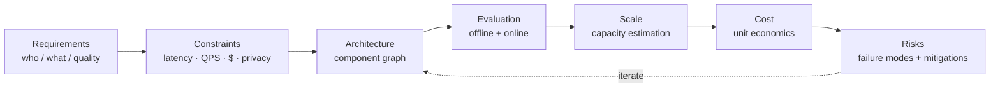
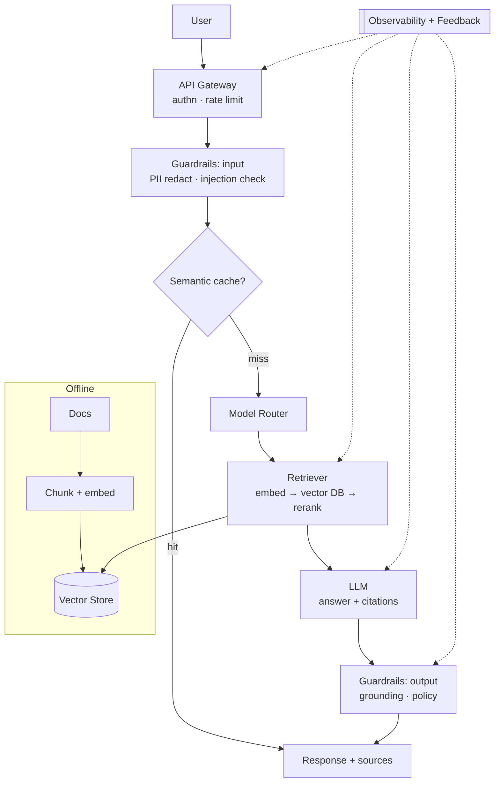
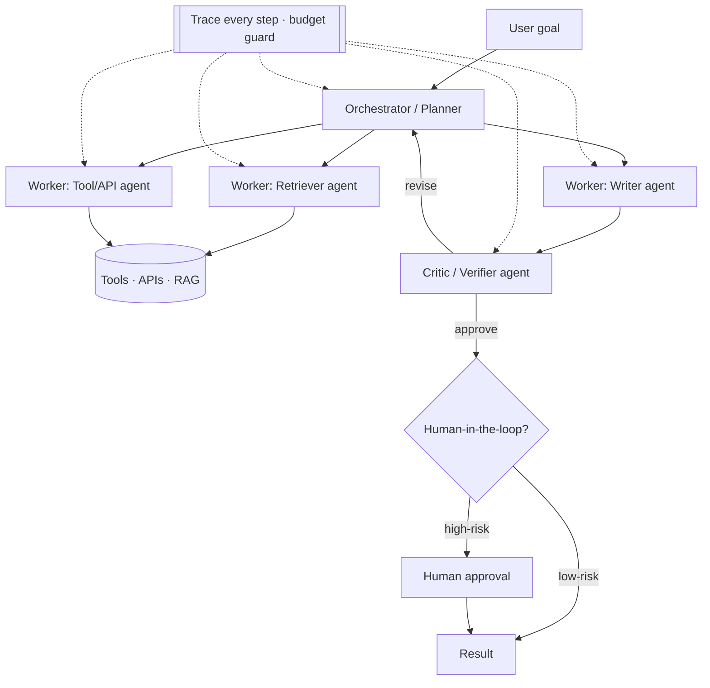
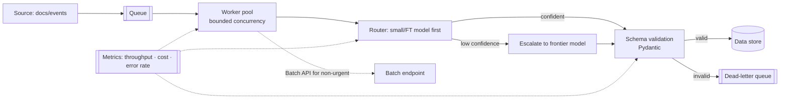

# 10.1 GenAI System Design (Interviews & Reference Architectures)
### Study Notes — Book Style · Generative AI Learning Plan · Phase 10 (Industry Practice & System Design)

> **How to read this file.** This chapter is the *assembly stage* of the whole book: everything you learned as isolated skills — model selection (1.4), prompting and cost mechanics (2.3.3), RAG (4.x), agents (5.x), fine-tuning (6.x), safety/privacy (8.x), and serving/MLOps (9.x) — now gets composed into systems and defended in a design interview. We deliberately do **not** re-derive those topics; we reference them by ID and focus on the *glue*: how to reason from requirements to an architecture, how to size it, and how to talk about tradeoffs. Read it right before an interview or a design review. Its sibling, **10.2**, drills into the money-and-people side (cost at product level, build-vs-buy, privacy, stakeholders).
>
> **Sources synthesized:** classic system-design interview frameworks (functional/non-functional split, capacity estimation, back-of-envelope math); production LLM reference architectures from OpenAI, Anthropic, AWS, and Azure well-architected guidance; LLM gateway/router patterns (LiteLLM, Portkey); RAG and agent patterns from Phases 4–5; SRE reliability patterns from Nygard, *Release It!*; and the operational groundwork in 2.3.3 and 9.x.

---

## 10.1.0 Where this fits (the bridge from Phases 1–9)

Up to now you built *components*. A GenAI system-design interview asks a different question: *given a fuzzy business goal and hard constraints, can you compose those components into something that is correct, fast enough, affordable, safe, and operable — and can you justify every choice?* Interviewers are not testing whether you can recite the transformer (1.1); they are testing judgment under ambiguity. The single biggest failure mode is diving into a diagram before you understand what you are building.

> **One-line thesis:** *Drive every GenAI design from requirements → constraints → architecture → evaluation → scale → cost → risks, in that order. The components (gateway, router, retrieval, cache, guardrails, observability, feedback) are a stable kit; the skill is picking and wiring them to the numbers.*

---

## 10.1.a The interview framework (requirements → constraints → architecture → eval → scale → cost → risks)

**Definition.** A **GenAI design framework** is a repeatable ordering of the questions you answer out loud so that architecture emerges from need rather than fashion. The seven stages are: **(1) Requirements** — what does it do, for whom, at what quality bar; **(2) Constraints** — latency budget, throughput, budget/$-per-request, data residency and privacy (8.x), accuracy/hallucination tolerance; **(3) Architecture** — the component graph; **(4) Evaluation** — how you know it works and stays working; **(5) Scale** — capacity estimation and bottlenecks; **(6) Cost** — unit economics and levers; **(7) Risks** — failure modes and mitigations.

**Intuition — build the fence before the house.** Requirements and constraints are the fence. If you skip them, you will happily design a beautiful frontier-model system for a use case whose latency budget or budget-per-call makes it impossible. Every senior signal in the interview comes from constraints shaping the architecture, e.g. "a 300 ms P95 rules out chained frontier calls, so I'll cache and route."

**Example — turning a one-line prompt into a spec.** Prompt: *"Design a support assistant for our bank."* You respond with a clarifying volley: *Who are the users (customers vs agents)? Read-only answers or can it take actions (5.x)? Latency target? Expected QPS and peak? Accuracy/compliance bar — is a wrong answer a regulatory event? Data sources and their sensitivity (8.x)? Budget per conversation?* Only after those do you draw anything. Stating assumptions explicitly ("I'll assume 50 QPS average, 200 peak, P95 ≤ 2 s, answers must cite a source") is itself the graded behavior.

---

## 10.1.b The component kit (the stable building blocks)

**Definition.** Most production GenAI systems are assembled from the same recurring parts. Knowing the kit lets you draw any architecture in minutes:

- **API gateway / BFF** — authentication, request validation, rate limiting per tenant, and a stable contract for clients. Entry point for everything.
- **Model router** — chooses which model serves each request (frontier vs mini vs fine-tuned vs self-hosted), based on task class, cost, and load. Ties to model selection (1.4) and cost routing (2.3.3.b). Tools: LiteLLM, Portkey, or a home-grown classifier.
- **Retrieval** — embeddings + vector store + reranker for grounding answers in your data (4.x). The primary hallucination and freshness lever.
- **Cache** — three flavors: **provider prompt cache** (stable prefixes, 2.3.3.b), **semantic response cache** (embedding-keyed near-duplicate answers), and **exact-match cache** (identical requests). Biggest lever for both latency and cost.
- **Guardrails** — input and output filtering: PII redaction, prompt-injection defense, toxicity/policy checks, schema validation (2.2.3, 8.x).
- **Observability** — tracing, token/cost metrics, quality metrics, alerting (3.3, 9.x). You cannot operate what you cannot see.
- **Feedback loop** — thumbs up/down, edits, and outcome signals captured and routed back into evals, prompt tuning, and fine-tuning datasets (6.x).

**Intuition — a request's journey.** A request flows gateway → guardrails (in) → cache check → router → (retrieval) → model → guardrails (out) → response, with observability wrapping every hop and feedback siphoning off signal. Memorize that spine; every architecture below is a specialization of it.

**Common industry note.** The **LLM gateway** (router + cache + guardrails + observability bundled) is now a standard org-level platform team deliverable — one paved road so every product team does not re-solve keys, cost tracking, and failover.

---

## 10.1.c Reference architecture (a): RAG chatbot over enterprise docs

**When.** Grounded Q&A over private corpora (policies, tickets, manuals). The default enterprise GenAI system. See 4.x for retrieval internals.

**Key decisions.** Chunking strategy and reranking quality dominate answer accuracy (4.x); **citations** are mandatory for trust and let you measure grounding; the **semantic cache** absorbs repeated FAQs cheaply; and an **eval set** of question→expected-source pairs guards regressions when you change the index or model.

---

## 10.1.d Reference architecture (b): multi-agent workflow

**When.** Tasks needing planning, tool use, and multiple specialized roles — e.g. a research-and-draft agent, or an ops-automation agent (5.x). Orchestrated with LangGraph or similar.

**Key decisions.** Multi-agent buys capability but pays in **latency, cost, and non-determinism** — every step is another LLM call. Guardrails you must add: a **step/token budget** to prevent runaway loops, **tool idempotency** (2.3.3.d) for side-effecting actions, a **critic/verifier** to catch errors, and **human-in-the-loop** gates for high-risk actions (moving money, sending emails). Prefer the simplest topology that works; a single agent with tools often beats an elaborate swarm.

---

## 10.1.e Reference architecture (c): high-throughput classification/extraction pipeline

**When.** Batch or streaming labeling/extraction at scale — classify tickets, extract fields from invoices, tag catalog items. Throughput and cost dominate; latency per item is relaxed.

**Key decisions.** Use the **Batch API** (2.3.3.b, ~50% cheaper) whenever same-day results suffice; use a **cheap/fine-tuned model first and escalate only on low confidence** (cascade); enforce **structured output + validation** (2.2.1, 2.2.3) with a **dead-letter queue** for failures; and bound concurrency to respect rate limits (2.3.3.c). This is where fine-tuning (6.x) pays off most — a small tuned model at high volume beats frontier per-call pricing.

---

## 10.1.f Latency, cost, and scale tradeoffs

**Definition.** Every GenAI design trades among three axes: **latency** (time to response, usually measured at P95/P99), **cost** (per request and per month), and **quality/capability**. You rarely optimize all three; you pick a point for the use case.

**The main levers and what they trade.**

| Lever | Improves | Costs you |
|---|---|---|
| Smaller/routed model (1.4) | latency, $ | some quality |
| Semantic/prompt cache (2.3.3.b) | latency, $ | staleness risk, infra |
| Streaming (2.3.2) | *perceived* latency | none material |
| RAG (4.x) | quality, freshness | latency, retrieval infra |
| Multi-agent (5.x) | capability | latency, $, complexity |
| Batch API | $ | not real-time |
| Self-hosting (9.x) | $ at scale, data control | ops burden, GPU capex |

**Intuition — latency is a budget you spend.** If P95 must be 1 s, a retrieval hop (~100 ms), a rerank (~50 ms), and a frontier call (~800 ms streaming first token) already spends it. Chaining two frontier calls blows it. So the latency budget *forces* caching, routing to faster models, and parallelizing independent steps.

---

## 10.1.g Capacity estimation (back-of-envelope)

**Definition.** **Capacity estimation** is the quick arithmetic that turns "users" into "QPS, tokens/minute, GPUs, and dollars," so your architecture is sized to reality.

**Worked estimate.** Suppose 1,000,000 daily active users, each making 5 assistant requests/day = 5M requests/day. Averaged over a day that is ~58 QPS; assume peak is 4× average ≈ **230 QPS**. Each request ~1,500 input + 400 output tokens ⇒ per-minute peak token load ≈ 230 × 1,900 × 60 ≈ **26M tokens/min**, which far exceeds a single API tier's TPM (2.3.3.c) — so you *need* caching, routing, and possibly a higher tier or multiple keys/regions. On cost: 5M/day × 1,900 tokens, at a blended ~$3/1M tokens ≈ **$28.5k/day** *before* optimization; a 40% cache hit rate + routing 70% to a mini model can cut that by ~60–70% (see 10.2 for the full model).

**Rule of thumb.** Always compute: peak QPS, tokens/min at peak (vs TPM limits), and $/day. If any number is implausible, the architecture is wrong — iterate back to 10.1.a.

---

## 10.1.h Worked system-design questions (sample answers)

**Q1 — "Design a customer-support assistant for an e-commerce marketplace."** *Requirements:* shoppers ask about orders, returns, and products; must be able to look up order status (action) and answer policy questions (RAG). *Constraints:* P95 ≤ 2 s, ~150 peak QPS, must never expose another user's data (8.x), budget ~$0.02/conversation. *Architecture:* gateway → input guardrail (PII, injection) → semantic cache (huge win on repetitive "where is my order") → router (mini model for FAQ, frontier for complex) → RAG over policy docs + an order-lookup tool scoped to the authenticated user → output guardrail → citations. *Eval:* golden set of Q→source pairs + tool-call accuracy; online CSAT and deflection rate. *Scale/cost:* cache + routing keep blended cost down; Batch API not applicable (real-time). *Risks:* cross-user data leakage → strict per-user auth on the tool; hallucinated policy → require citation and abstain if unsupported.

**Q2 — "Design an invoice-field extraction pipeline for a bank, 2M docs/night."** This is architecture (c). *Constraints:* accuracy is regulatory-grade, latency relaxed (overnight), residency in-region (8.x). *Architecture:* queue → worker pool → fine-tuned small model (6.x) with schema-constrained output → confidence-based escalation to frontier → Pydantic validation → dead-letter queue for human review. Use the **Batch API** for cost. *Eval:* field-level precision/recall on a labeled holdout; drift monitoring. *Cost:* fine-tuned small model + batch pricing is dramatically cheaper than per-call frontier at 2M/night. *Risks:* silent extraction errors → sample audits + DLQ; data residency → self-host or in-region endpoint.

**Q3 — "Design a research agent that drafts market reports."** This is architecture (b). *Constraints:* quality > latency (minutes acceptable), must cite sources, bounded cost per report. *Architecture:* planner → retriever agent (RAG + web tools) → writer → critic/verifier → human review before publish. *Guards:* per-report token/step budget, tool idempotency, HITL gate. *Eval:* rubric-scored draft quality + factuality/citation checks. *Risks:* runaway loops → budget cap + max steps; fabricated citations → verifier cross-checks every cited claim against retrieved text.

---

## 10.1.i Common pitfalls

- **Drawing before scoping.** Jumping to boxes without pinning latency/QPS/$ constraints — the top interview failure.
- **Over-engineering with agents.** Reaching for multi-agent when a single RAG call would do; complexity you can't operate is a liability.
- **Ignoring the cache.** Forgetting that caching is usually the single biggest latency *and* cost win.
- **No eval story.** Proposing a system with no way to measure quality or catch regressions when the model/index changes.
- **Hand-waving scale.** Not doing the capacity arithmetic, so proposals silently exceed TPM limits or blow the budget.
- **No failure/guardrail plan.** Omitting timeouts, fallbacks (2.3.3.d), injection defense, and PII handling (8.x).
- **Treating the LLM as deterministic.** Designing as if outputs are stable; production needs validation, retries, and abstention paths.

---

# Wrap-Up: 10.1 GenAI System Design

## The through-line (backward and forward)
This chapter fused the whole book into a design method. You drive every problem through **requirements → constraints → architecture → eval → scale → cost → risks**, assemble it from a stable **component kit** (gateway, router, retrieval, cache, guardrails, observability, feedback), and specialize that spine into the three archetypes — **RAG chatbot**, **multi-agent workflow**, and **high-throughput extraction pipeline**. The senior signal is always the same: constraints (latency budget, QPS, $/request, privacy) *shaping* the architecture, backed by **capacity arithmetic**. It reaches back to model selection (1.4), cost/limits (2.3.3), RAG (4.x), agents (5.x), fine-tuning (6.x), safety (8.x), and serving (9.x) — and forward to **10.2**, which turns the cost and risk stages into product economics, build-vs-buy, privacy, and stakeholder management.

## Quick reference

| Stage | Question | Key artifact |
|---|---|---|
| Requirements | who/what/quality bar | user stories, quality target |
| Constraints | latency/QPS/$/privacy | numeric budgets |
| Architecture | component graph | the diagram |
| Evaluation | how do we know it works | golden set + online metrics |
| Scale | can it handle peak | capacity estimate |
| Cost | is it affordable | unit economics (→10.2) |
| Risks | how does it fail safely | mitigations table |

## Interview Questions & Answers

1. **What's the first thing you do in a GenAI design interview?** Clarify requirements and pin numeric constraints (latency, QPS, $, privacy) before drawing anything.
2. **Name the standard component kit.** Gateway, model router, retrieval, cache, guardrails, observability, feedback loop.
3. **What's an LLM gateway?** A shared platform bundling routing, caching, guardrails, and cost/observability so product teams don't re-solve them.
4. **Biggest single lever for latency and cost?** Caching — semantic response cache plus provider prompt caching.
5. **When choose a cascade (small-model-first, escalate)?** High-volume classification/extraction where most items are easy; escalate only low-confidence cases.
6. **What extra guards do multi-agent systems need?** Step/token budgets, tool idempotency, a critic/verifier, and human-in-the-loop for high-risk actions.
7. **How do you size a system?** Compute peak QPS, tokens/minute vs TPM limits, and $/day; iterate if any number is implausible.
8. **How does latency budgeting force design?** A tight P95 rules out chained frontier calls, forcing caching, faster/routed models, and parallel steps.
9. **Why require citations in a RAG chatbot?** Trust plus measurability — they let you evaluate grounding and detect hallucination.
10. **What belongs in the risks section?** Timeouts/fallbacks, injection and PII defense, data-leakage prevention, abstention on low grounding, and runaway-loop caps.
11. **When is the Batch API the right call?** Non-real-time, high-volume workloads — roughly half cost and it sidesteps synchronous rate limits.
12. **How do you avoid over-engineering?** Start from the simplest topology that meets constraints; add agents/complexity only when a simpler design provably fails.

## Mini glossary

**Model router** — logic choosing which model serves each request.
**Semantic cache** — embedding-keyed cache returning near-duplicate answers.
**Guardrails** — input/output filters (PII, injection, policy, schema).
**Cascade / escalation** — cheap model first, escalate low-confidence cases.
**HITL** — human-in-the-loop approval gate.
**Capacity estimation** — arithmetic from users to QPS/tokens/$.
**P95/P99** — 95th/99th percentile latency.
**Dead-letter queue** — holding area for failed items needing review.
**Critic/verifier** — an agent that checks another's output.

## Further reading

- OpenAI, Anthropic, AWS, and Azure production LLM architecture and well-architected guidance.
- LiteLLM / Portkey gateway-and-router docs; LangGraph multi-agent patterns.
- Revisit 1.4 (model selection), 2.3.3 (cost/limits/errors), 4.x (RAG), 5.x (agents), 9.x (serving).
- Nygard, *Release It!* 2nd ed. — timeouts, bulkheads, circuit breakers.

---

*Previous phase ← **Phase 9 (MLOps & Serving)**.*
*Next → **10.2 Cost, Build-vs-Buy, Privacy & Stakeholders** — the economics and organizational side of shipping GenAI.*
