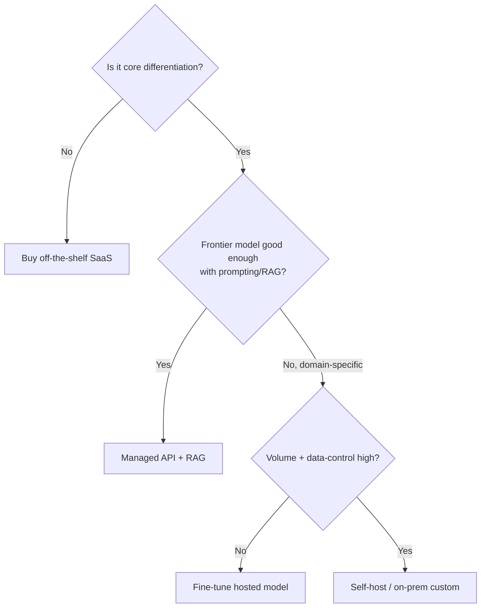

# 10.2 Cost, Build-vs-Buy, Privacy & Stakeholders
### Study Notes — Book Style · Generative AI Learning Plan · Phase 10 (Industry Practice & System Design)

> **How to read this file.** If **10.1** taught you to *architect* a GenAI system, this chapter teaches you to *justify shipping it* — the economics, the make-or-buy call, the compliance obligations, and the humans who fund and depend on it. It is the layer that turns a working prototype into a funded, compliant, adopted product. We build directly on the per-call cost mechanics from **2.3.3** (tokens, caching, batch, routing) and lift them to *product-level* unit economics; on the privacy/safety foundations in **8.x** and the guardrails in **2.2.3**; and on the deployment realities of **9.x**. Read it when scoping a project, writing a business case, or preparing for a PM/architect conversation.
>
> **Sources synthesized:** cloud TCO and FinOps frameworks; OpenAI/Anthropic/Azure/AWS pricing, zero-retention, and enterprise-tier terms; GDPR, PCI-DSS, SOC 2, and data-residency regulatory texts and vendor compliance docs; build-vs-buy decision literature; product-management POC-to-production and ROI practice; and the token-economics groundwork in 2.3.3.

---

## 10.2.0 Where this fits (from architecture to business case)

A technically excellent system that costs more than it earns, leaks PII, or that no stakeholder trusts will never reach production. This chapter covers the four questions every real GenAI project must answer beyond "does it work": *what does it cost per unit and in total? should we build or buy? is it legal and safe with this data? and how do we get the organization to fund, trust, and adopt it?*

> **One-line thesis:** *Ship GenAI on unit economics, not vibes — know your $/transaction and TCO; choose build-vs-buy from volume, differentiation, and control; treat privacy/compliance as a design constraint from day one (8.x); and manage stakeholders by scoping tightly, setting expectations, and measuring ROI.*

---

## 10.2.a Unit economics and product-level cost

**Definition.** **Unit economics** is the cost and value of *one* unit of product activity — a conversation, a generated description, an extracted document — rolled up to margin. Where 2.3.3 gave you $/call, here you compute **$/business-transaction** (which may span several calls) and compare it to the **value** that transaction produces.

**Intuition — the burger, not the ingredient.** 2.3.3 priced the beef; unit economics prices the assembled burger *and* checks you sell it for more than it costs. A support conversation might use 3 LLM calls + a retrieval + a cache miss; its unit cost is the sum, and it is "profitable" only if it deflects a human ticket costing more.

**Worked example (e-commerce support).** Per conversation: 3 calls averaging 1,800 in / 400 out tokens. At blended $3/1M input, $12/1M output ⇒ input 3×1,800×$3/1M = $0.0162; output 3×400×$12/1M = $0.0144; total ≈ **$0.031/conversation** before optimization. Apply a 45% semantic-cache hit rate and route 70% of calls to a mini model (2.3.3.b): effective cost drops to roughly **$0.011/conversation**. If each deflected conversation saves ~$6 of human handling, the ROI is overwhelming — the cost story is about *scale headroom*, not survival.

**Cost-optimization levers at product level (extending 2.3.3):**

- **Cache aggressively** — prompt cache stable prefixes; semantic cache repeat questions.
- **Route by task** — mini/fine-tuned models for the 80% easy cases; frontier only when needed (1.4).
- **Batch the non-urgent** — Batch API for overnight/bulk (~50% off).
- **Trim context** — RAG instead of stuffing (4.x); cap `max_tokens`.
- **Fine-tune to shrink prompts** — a tuned small model removes few-shot overhead (6.x).
- **Set budgets and alerts** — per-tenant spend caps and anomaly alerts (observability, 9.x).

**Python — a product-level cost model:**

```python
def conversation_cost(calls, in_tok, out_tok, in_price, out_price,
                      cache_hit_rate=0.0, mini_share=0.0, mini_discount=0.8):
    """Estimate $ per conversation. Prices are $ per 1M tokens."""
    base = calls * (in_tok * in_price + out_tok * out_price) / 1_000_000
    effective_calls = base * (1 - cache_hit_rate)          # cache removes calls
    blended = effective_calls * (1 - mini_share) + \
              effective_calls * mini_share * (1 - mini_discount)
    return round(blended, 4)

raw = conversation_cost(3, 1800, 400, 3.0, 12.0)
opt = conversation_cost(3, 1800, 400, 3.0, 12.0, cache_hit_rate=0.45, mini_share=0.70)
print(f"raw=${raw}/conv  optimized=${opt}/conv  monthly@5M={opt*5_000_000:,.0f}")
```

---

## 10.2.b Total Cost of Ownership: API vs self-host

**Definition.** **TCO** is *all* costs of a choice over its life — not just tokens or GPUs, but engineering, ops, monitoring, security, and opportunity cost.

**The two profiles.**

- **Managed API:** cost ≈ tokens × price. Zero infra, instant scaling, latest models. Scales *linearly* with volume — cheap to start, expensive at massive scale. Ops burden near zero.
- **Self-hosted open model (9.x):** GPU rental/capex + MLOps engineers + monitoring + on-call, largely *fixed*. High fixed cost, low marginal cost — cheap only above a break-even volume, and only if you can keep the GPUs busy.

**Intuition — taxi vs owning a car.** The API is a taxi: pay per ride, no maintenance, perfect for variable/low mileage. Self-hosting is owning a car: big upfront and fixed costs that only pay off at high, steady mileage — and *you* fix it when it breaks.

**Worked break-even.** A self-hosted setup costing ~$25k/month (2 GPU nodes + ~0.5 FTE ops amortized) breaks even against an API only once your API bill would exceed ~$25k/month *and* you sustain enough utilization. Below that, API wins on TCO despite the higher per-token price. Add the hidden costs of self-hosting: model updates, security patching, scaling for peaks, and evaluation infra.

| Factor | Managed API | Self-hosted open model |
|---|---|---|
| Cost shape | linear (marginal) | mostly fixed |
| Time to first value | hours | weeks–months |
| Ops burden | ~none | high (MLOps, on-call) |
| Data control | vendor terms | full (on-prem possible) |
| Best when | variable/low-mid volume, fast iteration | very high steady volume, strict data control |

---

## 10.2.c Build vs Buy (API vs open model vs fine-tune vs off-the-shelf product)

**Definition.** **Build-vs-buy** is choosing how much of the stack you own. The GenAI spectrum, from least to most owned: **off-the-shelf product** (SaaS, e.g. a vendor support-bot) → **managed API + prompting** → **API + RAG** → **fine-tuned model** (6.x) → **self-hosted/custom model** (9.x).

**Decision drivers.**

- **Differentiation** — if the capability *is* your product, own more of it; if it's a commodity feature, buy.
- **Volume** — high steady volume shifts economics toward fine-tune/self-host (10.2.b).
- **Data sensitivity/control** — strict residency or zero-retention needs push toward self-host/on-prem (10.2.d).
- **Time-to-market** — buy/API for speed; build when you have runway.
- **Team capability** — self-hosting demands MLOps maturity you may not have.

**Intuition — the ladder.** Climb only as high as the value justifies. Most teams should *start* at API+prompting, add RAG for grounding, and only fine-tune or self-host when a concrete metric (cost at scale, latency, accuracy on your domain, or a compliance mandate) forces the next rung. Prematurely building a custom model is the most common expensive mistake.



---

## 10.2.d Data privacy and compliance

**Definition.** **Privacy & compliance** is meeting the legal and contractual obligations attached to the data your system touches. It is a *design constraint*, not an afterthought — it shapes architecture, vendor choice, and deployment (build on 8.x safety/privacy and the input/output guardrails in 2.2.3).

**The obligations you must know (2026 landscape).**

- **PII handling** — identify and minimize personal data; **redact or tokenize** before it hits the model where possible (input guardrail, 2.2.3/8.x).
- **GDPR** — lawful basis, data-subject rights (access, erasure), purpose limitation, and cross-border transfer rules for EU personal data.
- **Data residency** — some data must physically stay in a region/country; forces in-region API endpoints or on-prem.
- **PCI-DSS** — payment card data has strict handling rules; usually you *never* send raw card data to an LLM — tokenize first.
- **SOC 2** — the attestation enterprise buyers demand of your controls (security, availability, confidentiality).
- **Zero-retention** — enterprise API tiers where the vendor does **not** store prompts/outputs or train on them; often contractual (a DPA) and a prerequisite for sensitive use.
- **On-prem / VPC deployment** — the strongest control: the model runs inside your boundary, data never leaves.

**Intuition — data has a passport and a clearance level.** Every field has a sensitivity (clearance) and a jurisdiction (passport). The architecture must honor both: redact what the model doesn't need, keep regulated data in-region, and prove — via zero-retention terms or on-prem — that it isn't stored or trained on. Compliance failures are existential (fines, lost enterprise deals), unlike a latency regression.

**Practical pattern.** Put a **PII-redaction guardrail** at the gateway (2.2.3): detect names, emails, card numbers, national IDs; replace with placeholders; run the model; re-hydrate only in your trusted boundary. Choose a **zero-retention endpoint** for anything sensitive, and **on-prem/VPC** when residency or PCI scope demands it.

---

## 10.2.e Working with stakeholders

**Definition.** **Stakeholder management** is aligning the people who fund, use, approve, and depend on the system — execs, product, legal/compliance, end users, and ops — around scope, expectations, and value.

**The playbook.**

- **Scope tightly.** Pick one high-value, low-risk use case; resist the "AI for everything" mandate. A narrow win funds the next step.
- **Manage expectations.** Set the accuracy bar honestly — LLMs are probabilistic, not perfect. Agree upfront on what "good enough" means and where a human stays in the loop (5.x HITL).
- **POC → production is a chasm, not a step.** A demo that wows in 2 days needs months of evals, guardrails, observability, cost control, and compliance to ship. Communicate this early so timelines are realistic.
- **Measure ROI.** Define the metric *before* building — deflection rate, hours saved, conversion lift, cost avoided — and instrument it. Tie spend to that number.

**Intuition — the demo is the down payment, not the house.** Stakeholders anchor on the flashy POC and assume production is imminent. Your job is to make the invisible 80% (eval, safety, ops, compliance) visible and funded, and to keep everyone pointed at one measurable outcome.

---

## 10.2.f Case study — Finance (end to end)

**Context.** A retail bank wants to automate extraction of fields from 2M mortgage documents/night and answer customer statement questions.

**Cost & TCO.** At 2M docs/night, per-call frontier pricing is prohibitive; a **fine-tuned small model on the Batch API** (6.x, 2.3.3.b) cuts cost ~80%. Extraction volume is high and steady, so a partial **self-host in-region** is evaluated against the API TCO — chosen for the statement chatbot only if residency demands it.

**Build-vs-buy.** Extraction is core and domain-specific → **fine-tune**. The statement Q&A is well served by **API + RAG** → don't over-build.

**Privacy.** Documents contain PII and account numbers → **PII redaction at ingest**, **PCI tokenization** for any card data, **zero-retention** contractual terms, and **data residency** satisfied via an in-region endpoint or VPC deployment; SOC 2 controls documented for the auditors.

**Stakeholders & ROI.** Scoped to *extraction first* (clear, measurable). ROI = analyst-hours saved + error-rate reduction; a human reviews the dead-letter queue (10.1.e). Compliance is a co-owner from day one, not a late gate.

## 10.2.g Case study — E-commerce (end to end)

**Context.** A marketplace wants (1) auto-generated product descriptions for 500k SKUs and (2) a shopper support assistant.

**Cost & unit economics.** Descriptions are bulk and non-urgent → **Batch API + a routed mini model** (~$0.002/SKU). Support conversations use **semantic caching + routing** → ~$0.011/conversation (10.2.a), trivially profitable against human-handling cost.

**Build-vs-buy.** Descriptions and support are *not* the company's core differentiation → start **API + RAG**; consider a **light fine-tune** only to lock in brand voice at scale (removes long few-shot prompts, cutting cost).

**Privacy.** Support touches customer PII and order data → **redaction guardrail**, **per-user auth** on order-lookup tools (no cross-customer leakage, 8.x), **zero-retention** endpoint. Payment data never reaches the model.

**Stakeholders & ROI.** Scoped to descriptions first (low risk, fast win), then support. ROI = conversion lift + content-team hours saved for descriptions; deflection rate + CSAT for support. Expectations set that the assistant abstains/escalates rather than guessing.

---

## 10.2.h Common pitfalls

- **No unit-economics model.** Shipping without knowing $/transaction, then getting a surprise bill at scale.
- **Premature self-hosting.** Building GPU infra below the break-even volume — high TCO for no gain.
- **Building what you should buy.** Custom-modeling a commodity feature instead of using an API/SaaS.
- **Privacy as an afterthought.** Bolting on compliance late, forcing costly rework or blocking launch.
- **Sending PII/PCI raw to the model.** Skipping redaction/tokenization — a direct compliance breach.
- **Demo-to-production naïveté.** Promising a timeline based on the POC, ignoring the eval/safety/ops chasm.
- **No agreed success metric.** No ROI number defined up front, so the project can't prove its worth and loses funding.

---

# Wrap-Up: 10.2 Cost, Build-vs-Buy, Privacy & Stakeholders

## The through-line (backward and forward)
This chapter lifted the per-call mechanics of **2.3.3** to **product-level unit economics** and **TCO**, gave a **build-vs-buy ladder** (off-the-shelf → API → RAG → fine-tune → self-host) driven by differentiation, volume, and control, made **privacy/compliance** (PII, GDPR, PCI, SOC 2, zero-retention, residency, on-prem — building on **8.x** and **2.2.3**) a first-class design constraint, and closed with **stakeholder management** (scope tight, set expectations, cross the POC→production chasm, measure ROI). The finance and e-commerce case studies wired all four together end to end. Together with **10.1's** architecture method, this completes the industry-practice phase: you can now design a GenAI system *and* make the business, compliance, and organizational case to ship it. It loops back to every earlier phase and forward into your own real projects.

## Quick reference

| Decision | Ask | Default |
|---|---|---|
| Cost | what's $/transaction at scale? | model it; cache + route + batch |
| API vs self-host | above break-even volume? | API until proven otherwise |
| Build vs buy | is it core differentiation? | buy/API commodity; build the core |
| Privacy | what's the data's sensitivity + jurisdiction? | redact, zero-retention, residency-aware |
| Stakeholders | what's the ROI metric? | define before building; scope narrow |

## Interview Questions & Answers

1. **Unit economics vs per-call cost?** Per-call is one API request; unit economics is the cost (and value) of a whole business transaction, often several calls, rolled to margin.
2. **Top product-level cost levers?** Caching, task-based routing to small models, Batch API, context trimming/RAG, and fine-tuning to shrink prompts.
3. **What is TCO and why does it matter?** All lifetime costs — infra, engineering, ops, security — not just tokens/GPUs; it decides API vs self-host.
4. **When does self-hosting beat an API?** Only above a break-even volume with sustained utilization, or when data control/residency mandates it.
5. **Sketch the build-vs-buy ladder.** Off-the-shelf → API+prompting → API+RAG → fine-tune → self-host/custom; climb only as far as value justifies.
6. **Most common expensive build mistake?** Prematurely building a custom/self-hosted model for a commodity feature.
7. **What is zero-retention and why care?** Vendor terms where prompts/outputs aren't stored or trained on — a prerequisite for sensitive data.
8. **How do you handle PII before the model?** Redact or tokenize at an input guardrail; re-hydrate only inside your trusted boundary.
9. **What is data residency?** A requirement that data physically stay in a region/country, forcing in-region endpoints or on-prem.
10. **Why never send raw card data to an LLM?** PCI-DSS — tokenize first; raw PAN in a prompt is a compliance breach.
11. **What is the POC-to-production chasm?** The demo is ~20%; evals, guardrails, observability, cost control, and compliance are the rest.
12. **How do you prove GenAI ROI?** Define the metric first (deflection, hours saved, conversion lift, cost avoided), instrument it, and tie spend to it.

## Mini glossary

**Unit economics** — cost/value of one business transaction.
**TCO** — total lifetime cost of a choice.
**Break-even volume** — volume where self-host TCO ≤ API cost.
**Build-vs-buy** — how much of the stack you own.
**Zero-retention** — vendor doesn't store or train on your data.
**Data residency** — data must stay in a jurisdiction.
**PCI-DSS** — payment-card data security standard.
**SOC 2** — controls attestation enterprises require.
**DPA** — data processing agreement with a vendor.
**POC-to-production chasm** — gap between demo and shippable system.

## Further reading

- Cloud FinOps / TCO frameworks; OpenAI/Anthropic/Azure/AWS pricing, zero-retention, and enterprise/DPA terms.
- GDPR, PCI-DSS, and SOC 2 primary texts plus vendor compliance/trust-center docs.
- Revisit 2.3.3 (per-call cost/limits), 8.x (safety/privacy), 2.2.3 (guardrails), 9.x (serving/self-host), 6.x (fine-tuning), 1.4 (model selection).

---

*Previous topic ← **10.1 GenAI System Design**.*
*End of **Phase 10 — Industry Practice & System Design**. You can now architect, cost, and champion GenAI systems end to end.*
