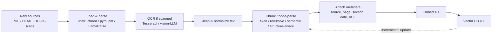

# 4.2 Ingestion Pipeline
### Study Notes — Book Style · Generative AI Learning Plan · Phase 4 (RAG)

> **How to read this file.** This section is the *supply chain* of RAG. In **4.1** you built the retrieval substrate — an embedding model plus a vector database that maps meaning to geometry and finds nearest neighbours fast. But that substrate can only retrieve what you *put into it*, and it can only be as good as the text and metadata you embed. This section covers everything upstream of the embedding call: **loading and parsing** heterogeneous documents (PDFs, HTML, tables, scans), **chunking** them into the passages that become your retrieval unit, **designing and extracting metadata**, handling **images and tables**, and keeping the index fresh with **incremental updates**. The governing law here is *garbage in, garbage out* — most RAG failures diagnosed in **4.5** trace back to a decision made in this file. It continues **3.2.1** (Documents/Nodes/Indexes) and feeds directly into **4.3** (retrieval quality) and **4.4** (advanced patterns like parent-document and sentence-window, which are chunking strategies elevated to architectures).
>
> **Sources synthesized:** LlamaIndex node-parser & ingestion-pipeline docs; LangChain document-loaders and text-splitter docs; the `unstructured`, `pymupdf`/`PyMuPDF`, and LlamaParse documentation; OCR literature (Tesseract, cloud OCR, vision-LLM parsing); 2026 chunking-strategy guides (semantic, structure-aware, parent-document/small-to-big); the "garbage in, garbage out" principle from 3.2.1 and the retrieval ceiling from 4.1.

---

## 4.2.0 Where this fits (the bridge from 4.1)

**4.1** ended on a hard ceiling: *if the right chunk's embedding isn't close to the query's, nothing downstream can recover it.* This section decides **what those chunks are**. Two upstream decisions dominate everything: (1) **parsing** — did the raw bytes become clean, faithful text (or did a table turn into scrambled numbers)?; and (2) **chunking** — did you cut the document into passages that each carry one coherent idea, sized to embed well and to fit the LLM's context (1.2.5)? Get these wrong and no embedding model, re-ranker, or prompt saves you.

> **One-line thesis:** *Ingestion turns messy source documents into clean, well-sized, richly-labelled chunks. Parsing controls fidelity, chunking controls the retrieval unit, and metadata controls filtering and attribution — and all three are decided before a single vector is created, which is why they cap retrieval quality.*



---

## 4.2.a Document Loaders & Parsing — Fidelity First

**Definition.** A **loader/parser** reads a source file (PDF, HTML, DOCX, PPTX, CSV, image) and produces text plus structural metadata (page numbers, headings, table cells). **Parsing fidelity** is how faithfully that extraction preserves the original meaning and structure — especially for tables, multi-column layouts, and scanned pages.

**Intuition.** Parsing is transcribing a book by hand. A careless transcriber merges the two newspaper columns into one gibberish paragraph and turns a financial table into a run-on number soup; a careful one preserves reading order, keeps the table as a table, and notes which page each line came from. The embedding model faithfully embeds *whatever text you hand it* — so a parsing error is silently baked into the vector and can never be queried correctly.

**The tool landscape (2026), and when each fits.**

- **`pymupdf` (PyMuPDF/fitz)** — fast, lightweight text + layout extraction from digital PDFs. Great default when PDFs are born-digital (not scanned) and layout is simple.
- **`unstructured`** — a general-purpose parser that partitions many formats (PDF, HTML, DOCX, PPTX, email) into typed elements (`Title`, `NarrativeText`, `Table`, `ListItem`). Strong for mixed corpora and for preserving element structure.
- **LlamaParse** — a managed, LLM/vision-assisted parser tuned for *hard* documents: complex tables, forms, multi-column financial reports, and scanned pages. Higher fidelity on tables at the cost of an API call.
- **OCR (Tesseract, cloud OCR, or vision-LLM parsing)** — required when the "PDF" is really an image (a scan or photo). Without OCR a scanned page yields *zero* text and silently disappears from the index.

**How to decide.** Match the parser to the *hardest* document type in your corpus, not the average. A clean digital report is fine with `pymupdf`; a corpus of scanned contracts needs OCR; a set of dense financial tables needs LlamaParse or `unstructured` with table extraction. Always **spot-check parsed output** against the source — this is the single cheapest, highest-value QA step in RAG.

**Example.** A 10-K's liquidity table has columns "FY2024 | FY2025". A naive text extractor emits `Cash 1,200 3,400 Debt 5,000 4,100` — the row/column structure is gone, so "What was FY2025 cash?" can retrieve this chunk yet the model can't tell which number is which. A structure-aware parser emits a Markdown table (or HTML) that preserves the mapping, and the answer becomes reliable.

**Python — parsing with fallbacks:**

```python
# Digital PDF: fast path with PyMuPDF
import fitz  # pymupdf
doc = fitz.open("filing.pdf")
pages = [{"text": p.get_text("text"), "page": i + 1} for i, p in enumerate(doc)]

# Mixed / structured corpus: unstructured preserves element types
from unstructured.partition.auto import partition
elements = partition(filename="report.pdf", strategy="hi_res")  # hi_res -> tables + OCR
tables = [e for e in elements if e.category == "Table"]

# Hard tables / scans: LlamaParse (managed, Markdown output keeps table structure)
from llama_parse import LlamaParse
docs = LlamaParse(result_type="markdown").load_data("dense_financials.pdf")
```

---

## 4.2.b Chunking Strategies — The Central Quality Lever

**Definition.** **Chunking** (a.k.a. splitting or node parsing) divides parsed text into passages ("nodes") that are each embedded and stored as one retrievable unit. **Chunk size** (how long) and **overlap** (how much adjacent chunks share) are the two headline knobs.

**Intuition.** A chunk is one index card in a card catalogue. Too big (a whole chapter per card) and the card mixes many topics — its embedding becomes a blurry average that matches everything weakly and nothing strongly, and it wastes context (1.2.5) when retrieved. Too small (one sentence per card) and each card lacks the surrounding context needed to be meaningful, and answers get fragmented across many cards. Good chunking puts *one coherent idea* on each card.

**The strategies, from crude to smart.**

- **Fixed-size** — split every N characters/tokens. Simple and fast, but blindly cuts through sentences and tables. A baseline, rarely optimal.
- **Recursive character splitting** — split on a priority list of separators (paragraphs → sentences → words) so cuts fall at natural boundaries where possible. The pragmatic default in LangChain.
- **Sentence splitting** — respect sentence boundaries; good for prose, packs whole sentences per chunk (LlamaIndex `SentenceSplitter`).
- **Semantic chunking** — embed sentences and cut where meaning *shifts* (large embedding-distance between adjacent sentences), so each chunk is topically coherent. Higher quality, higher cost (embeds during ingestion).
- **Structure-aware / Markdown** — split on the document's own structure: headings, sections, Markdown/HTML elements, table rows. Keeps a table or a "Risk Factors" section intact. Ideal for well-structured docs.
- **Parent-document / small-to-big** — embed *small* chunks for precise matching but return their *larger parent* to the LLM for context. A retrieval pattern important enough that **4.4** treats it as its own architecture.

**Chunk size & overlap tuning.** There is no universal number — it depends on document type, embedding-model input length (4.1), and query style. Practical starting points: **256–512 tokens** with **10–20% overlap** for prose; larger, structure-aligned chunks for tables/sections. **Overlap** exists so a sentence split across a boundary still appears whole in at least one chunk. Tune empirically against your eval set (4.5): change chunk size, re-measure context recall, keep what wins.

**Example.** A product spec sheet chunked by fixed 500 chars splits the "Battery" spec so "18-hour" lands in one chunk and "battery life" in the next — a query for battery life retrieves neither well. Structure-aware chunking keeps each spec (label + value) together, and retrieval becomes crisp.

**Python — three splitters:**

```python
from langchain_text_splitters import (
    RecursiveCharacterTextSplitter, MarkdownHeaderTextSplitter)
# Recursive: natural-boundary default
rec = RecursiveCharacterTextSplitter(chunk_size=512, chunk_overlap=64)
chunks = rec.split_text(long_text)

# Structure-aware: split on Markdown headings, keep section as metadata
md = MarkdownHeaderTextSplitter(headers_to_split_on=[("#", "h1"), ("##", "h2")])
sections = md.split_text(markdown_doc)  # each chunk tagged with its heading

# Semantic chunking (LlamaIndex): cut where meaning shifts
from llama_index.core.node_parser import SemanticSplitterNodeParser
from llama_index.embeddings.openai import OpenAIEmbedding
sem = SemanticSplitterNodeParser(embed_model=OpenAIEmbedding(), breakpoint_percentile_threshold=95)
nodes = sem.get_nodes_from_documents(docs)
```

---

## 4.2.c Metadata Design & Extraction

**Definition.** **Metadata** is the structured attributes attached to each chunk — source filename, page, section/heading, document date, author, document type, and **access-control tags**. It rides alongside the vector in the store (4.1) and powers **filtered retrieval** (4.3) and **citations** (4.5).

**Intuition.** Metadata is the label on the index card. Without it, retrieval is "find similar text anywhere"; with it, you can say "similar text, but only from 2025 filings, only documents this user may see." It converts a semantic search into a *scoped, governed, citable* one.

**What to design in.** At minimum: **`source`** (for citations), **`page`/`section`** (for pinpoint attribution and small-to-big), **`date`/`fiscal_year`** (for recency and time-scoped queries), **`doc_type`/`category`** (for routing — 4.4), and **access-control / tenant tags** (for security — enforced as a filter at query time). Extraction can be *structural* (page/section from the parser) or *LLM-based* (extract entities, summaries, or keywords per chunk to enrich matching).

**Example — finance.** Tagging each chunk with `{company: Acme, fiscal_year: 2025, doc_type: 10-K}` lets "Acme's FY2025 liquidity risk" filter to exactly the right documents before similarity ranking, preventing a FY2024 passage from contaminating the answer.

**Python — metadata + LLM extraction (LlamaIndex ingestion pipeline):**

```python
from llama_index.core.ingestion import IngestionPipeline
from llama_index.core.node_parser import SentenceSplitter
from llama_index.core.extractors import TitleExtractor, KeywordExtractor

pipeline = IngestionPipeline(transformations=[
    SentenceSplitter(chunk_size=512, chunk_overlap=64),
    TitleExtractor(nodes=5),      # LLM-derived section title -> metadata
    KeywordExtractor(keywords=5), # LLM-derived keywords -> metadata
])
nodes = pipeline.run(documents=docs)
for n in nodes:                    # attach domain metadata for filtering/citation
    n.metadata.update({"fiscal_year": 2025, "doc_type": "10-K", "acl": "finance-team"})
```

---

## 4.2.d Images, Tables & Incremental Updates

**Tables.** Tables are the #1 fidelity trap. Preserve them as Markdown/HTML so structure survives, or extract each table separately and (optionally) generate a text summary of it to embed alongside. Never let a table degrade into unlabelled numbers.

**Images.** Two options: (1) **multimodal embeddings** (embed the image directly for multimodal retrieval), or (2) **caption/describe** the image with a vision LLM and embed the caption as text. For diagrams, charts, and product photos, a good caption often makes the content retrievable by ordinary text queries.

**Incremental indexing & updates.** Corpora change — filings are added, prices update, docs are deleted. Re-embedding everything nightly is wasteful and, for large corpora, infeasible. Use **document hashing / upserts**: track a content hash per document, re-process only changed docs, and **upsert/delete** the affected chunks in the vector store (4.1's CRUD). LlamaIndex's `IngestionPipeline` supports a **docstore** with dedup so unchanged docs are skipped automatically.

```python
from llama_index.core.ingestion import IngestionPipeline, DocstoreStrategy
from llama_index.core.storage.docstore import SimpleDocumentStore

pipeline = IngestionPipeline(
    transformations=[SentenceSplitter(chunk_size=512)],
    docstore=SimpleDocumentStore(),          # remembers seen docs by hash
    docstore_strategy=DocstoreStrategy.UPSERTS,  # only re-embed changed docs
)
nodes = pipeline.run(documents=todays_docs)  # unchanged docs skipped; changed ones upserted
```

---

## 4.2.e Real-world industry use cases

**Finance.**
1. **10-K/10-Q ingestion with table fidelity:** A bank parses filings with LlamaParse to keep liquidity and debt-maturity tables intact, chunks structure-aware by section (MD&A, Risk Factors), and tags each chunk with `company/fiscal_year/doc_type`. This makes time- and entity-scoped, table-accurate Q&A possible — impossible if tables scrambled at parse time.
2. **Incremental filing updates:** As new quarterly filings arrive, an upsert pipeline re-embeds only the new documents and tags them by period, so the index stays current without a full rebuild and old periods aren't disturbed.

**E-commerce.**
1. **Catalog + spec-sheet ingestion:** Product spec tables are parsed structure-aware so each spec (label+value) stays together; product images are captioned by a vision LLM and embedded as text, enabling "18-hour battery earbuds" to retrieve the right SKU. Metadata (`category`, `brand`, `in_stock`) powers filtered search (4.3).
2. **Freshness via incremental indexing:** New products and price/policy changes upsert into the index continuously, so post-cutoff information is answerable (the freshness promise from the Phase 4 overview) without re-embedding the whole catalog.

---

## 4.2.f Common pitfalls

- **Trusting the parser blindly.** Scrambled tables and merged columns are silent — always spot-check parsed text against the source.
- **Ignoring scans.** A scanned PDF without OCR contributes *zero* text and vanishes from the index; nobody notices until a query fails.
- **One chunk size for everything.** Prose, tables, and code want different chunking; a single fixed size underperforms — tune per document type against an eval set (4.5).
- **Chunks too big or too small.** Too big blurs the embedding and wastes context; too small fragments answers. Both hurt retrieval.
- **No overlap.** Zero overlap orphans sentences split at boundaries; excessive overlap bloats the index and duplicates hits.
- **Thin metadata.** No `source`/`page` means no citations (4.5); no ACL tags means no access control (a compliance failure).
- **Full re-index on every change.** Wasteful and slow — use hashing/upserts for incremental updates.
- **Changing the chunking or embedding model without re-indexing.** Old and new chunks become inconsistent; changing the embedding model requires re-embedding the whole corpus (4.1's same-model rule).

---

# Wrap-Up: 4.2 Ingestion Pipeline

## The through-line (backward and forward)
**4.1** built the retrieval substrate and warned that its quality caps the system; **4.2** is where that quality is *actually decided*, upstream of the first embedding call. **Parsing** (4.2.a) sets fidelity — match the tool (`pymupdf`/`unstructured`/LlamaParse/OCR) to your hardest document, and always spot-check. **Chunking** (4.2.b) sets the retrieval unit — from fixed and recursive up to semantic and structure-aware — with chunk size and overlap tuned empirically. **Metadata** (4.2.c) enables filtering (4.3), routing (4.4), and citations (4.5). **Images/tables and incremental updates** (4.2.d) keep the index faithful and fresh. The single law: *garbage in, garbage out* — most failures you'll diagnose in **4.5** originate here. Next, **4.3** takes these well-formed chunks and makes retrieval *precise* (hybrid search, re-ranking, query transforms); **4.4** elevates two chunking ideas from this file — parent-document/small-to-big and sentence-window — into full architectures.

## Quick reference

| Concept | Key point | Tools / knobs |
|---|---|---|
| Parsing | Fidelity first; match hardest doc | pymupdf, unstructured, LlamaParse, OCR |
| OCR | Scans yield zero text without it | Tesseract, cloud OCR, vision-LLM |
| Chunking | The central quality lever | fixed, recursive, sentence, semantic, structure-aware |
| Size & overlap | ~256–512 tok, 10–20% overlap (tune) | per doc type; measure on eval set |
| Metadata | Filtering + routing + citations | source, page, date, doc_type, ACL |
| Tables/images | Preserve structure; caption images | Markdown tables, vision captions, multimodal |
| Incremental update | Re-embed only changed docs | hashing, upserts, docstore dedup |

## Interview Questions & Answers
1. **What does "garbage in, garbage out" mean for RAG?** Retrieval quality is capped by parsing and chunking; bad ingestion can't be fixed downstream.
2. **When do you need OCR?** When documents are scanned/image-based — otherwise they contribute no text.
3. **`pymupdf` vs `unstructured` vs LlamaParse?** Fast digital-PDF text vs typed multi-format elements vs LLM/vision parsing for hard tables/scans.
4. **Name chunking strategies.** Fixed, recursive, sentence, semantic, structure-aware/Markdown, parent-document/small-to-big.
5. **Why not just use huge chunks?** They blur the embedding (mixed topics), match weakly, and waste context when retrieved.
6. **Why not tiny chunks?** They lose surrounding context and fragment answers across many hits.
7. **Why chunk overlap?** So sentences split at a boundary still appear whole in at least one chunk.
8. **What's semantic chunking?** Cutting where adjacent-sentence embedding distance spikes, so each chunk is topically coherent.
9. **Why design metadata at ingestion?** It enables filtered retrieval, routing, access control, and citations later.
10. **How do you keep an index fresh efficiently?** Hash documents and upsert/delete only changed chunks rather than re-embedding everything.
11. **How do you handle tables?** Preserve as Markdown/HTML (structure) and optionally embed a table summary; never leave unlabelled numbers.
12. **How do you make images retrievable?** Multimodal embeddings or vision-LLM captions embedded as text.

## Mini glossary
**Loader/parser** — extracts text + structure from a file.
**OCR** — optical character recognition for scanned images.
**Chunk / node** — a passage that is embedded and retrieved as a unit.
**Chunk size / overlap** — length of a chunk and shared span between neighbours.
**Recursive splitting** — split on prioritized natural separators.
**Semantic chunking** — split where meaning shifts.
**Structure-aware chunking** — split on headings/sections/tables.
**Metadata** — attributes attached to a chunk (source, page, date, ACL).
**Upsert** — insert-or-update a record; basis of incremental indexing.
**Docstore dedup** — skip re-processing unchanged documents by hash.

## Further reading
- LlamaIndex: node parsers, `IngestionPipeline`, metadata extractors, docstore strategies.
- LangChain: document loaders, `RecursiveCharacterTextSplitter`, `MarkdownHeaderTextSplitter`.
- `unstructured`, PyMuPDF, and LlamaParse documentation; OCR guides (Tesseract, cloud/vision-LLM).
- 2026 chunking-strategy guides (semantic, structure-aware, parent-document).
- Revisit 3.2.1 (Documents/Nodes/Indexes), 4.1 (embeddings/vector search); preview 4.3 (retrieval quality), 4.4 (small-to-big & sentence-window), 4.5 (evaluation).

---

*Previous section ← **4.1 Embeddings & Vector Search** — the substrate this pipeline feeds.*
*Next section → **4.3 Retrieval Quality** — making retrieval over these chunks precise.*
