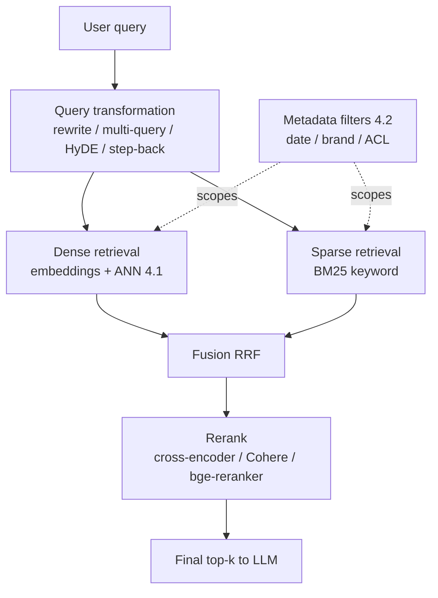

# 4.3 Retrieval Quality
### Study Notes — Book Style · Generative AI Learning Plan · Phase 4 (RAG)

> **How to read this file.** This is the *heart* of RAG tuning. **4.1** built the substrate (embeddings + vector DB) and **4.2** filled it with clean, well-chunked, well-labelled data. Both established the same ceiling: retrieval can only surface what's embedded, and semantic similarity alone often returns *relevant-but-not-best* passages. This section is how you close the gap between "found something similar" and "found the right thing, ranked first." It covers **top-k selection**, **MMR** (diversity), **hybrid search** (dense + sparse/BM25 fused with **RRF**), **reranking** (cross-encoders, Cohere Rerank, bge-reranker) and the pivotal *bi-encoder retrieve → cross-encoder rerank* pattern, **query transformation** (rewriting, multi-query, HyDE, step-back), **metadata filtering**, and the **recall-vs-precision** tuning that ties it all together. It builds directly on 4.1's ANN/recall dial and 4.2's metadata, and everything here is measured with the metrics in **4.5**.
>
> **Sources synthesized:** LangChain & LlamaIndex retriever/reranker/query-transform docs; BM25 and lexical-search literature; Reciprocal Rank Fusion (Cormack et al.); cross-encoder reranking (sentence-transformers), Cohere Rerank, and BGE-reranker docs; HyDE (Gao et al.) and step-back/multi-query prompting papers; MMR (Carbonell & Goldstein); the retrieval-ceiling and recall-dial concepts from 4.1.

---

## 4.3.0 Where this fits (the bridge from 4.1–4.2)

**4.1** noted that ANN retrieval is *approximate* and that pure vector similarity is a blunt instrument — it ranks by semantic closeness, which is necessary but not sufficient. Two systematic gaps remain: **(1) dense embeddings miss exact terms** (a product code, a ticker, a rare acronym) that keyword search would nail; and **(2) the top vector hits are similar to each other and to the query, but the *most useful* passage may sit at rank 8, not rank 1.** Retrieval quality work exists to fix both — first cast a wider, more diverse net (hybrid + MMR + query transforms), then re-order it precisely (reranking), all scoped by metadata filters.

> **One-line thesis:** *Great retrieval is a two-stage move: retrieve broadly and cheaply for high recall (dense + sparse, expanded queries, filters), then rerank narrowly and expensively for high precision (cross-encoder). Vector similarity gets you close; hybrid search, query transformation, and reranking get you the right passage ranked first.*



---

## 4.3.a Top-k and MMR (Diversity)

**Definition.** **Top-k** is how many chunks you retrieve and pass to the LLM. **MMR (Maximal Marginal Relevance)** is a re-selection method that picks results balancing *relevance to the query* against *novelty relative to already-picked results*, controlled by a parameter λ.

**Intuition — top-k.** Too small a `k` (say 1) risks missing the passage that actually holds the answer; too large a `k` stuffs the prompt with marginally-relevant text that dilutes attention and wastes context (1.2.5), sometimes *lowering* answer quality. `k` trades recall (more chunks → higher chance the answer is present) against precision and cost.

**Intuition — MMR.** Plain top-k often returns five near-duplicate chunks (the same paragraph phrased slightly differently across documents), covering one facet while ignoring others. MMR is a committee that, having picked one expert on a topic, prefers the next pick to add a *new* perspective — improving coverage for multi-faceted questions. λ near 1 = pure relevance; lower λ = more diversity.

**Example.** "Compare Acme's FY2024 and FY2025 liquidity" needs *both* years. Plain top-k might return five FY2025 passages (all highly similar to the query); MMR spreads picks so a FY2024 passage also surfaces, letting the model actually compare.

**Python:**

```python
retriever = vectorstore.as_retriever(
    search_type="mmr",
    search_kwargs={"k": 5, "fetch_k": 20, "lambda_mult": 0.5},  # diversity vs relevance
)
docs = retriever.invoke("Compare Acme FY2024 vs FY2025 liquidity")
```

---

## 4.3.b Hybrid Search — Dense + Sparse, Fused with RRF

**Definition.** **Hybrid search** runs a **dense** retriever (embeddings/ANN — 4.1) and a **sparse** retriever (**BM25**, a classic keyword/lexical ranking) in parallel, then **fuses** their result lists. The dominant fusion method is **Reciprocal Rank Fusion (RRF)**, which combines lists by summing `1/(k + rank)` per document across retrievers — using *ranks*, not raw scores, so incomparable score scales don't matter.

**Intuition.** Dense retrieval understands *meaning* ("liquidity stress" ≈ "cash shortfall") but can whiff on *exact tokens* — a SKU like `A1-B7`, a ticker `ACME`, a regulation `IFRS 9`. BM25 nails exact terms but misses paraphrase. Hybrid gives you both: semantic recall *and* exact-match precision. RRF is the fair referee that merges the two rankings without needing their scores to be on the same scale.

**Example — e-commerce.** Query "waterproof A1-B7 hiking boots": dense retrieval finds waterproof hiking boots by meaning; BM25 guarantees the exact model code `A1-B7` surfaces. RRF fuses them so the exact model, if it exists, ranks at the top while semantically-similar alternatives fill the rest.

**Python — hybrid with RRF (LangChain EnsembleRetriever):**

```python
from langchain_community.retrievers import BM25Retriever
from langchain.retrievers import EnsembleRetriever

bm25 = BM25Retriever.from_documents(docs); bm25.k = 10       # sparse / keyword
dense = vectorstore.as_retriever(search_kwargs={"k": 10})    # dense / semantic
hybrid = EnsembleRetriever(retrievers=[bm25, dense], weights=[0.5, 0.5])  # RRF-style fusion
results = hybrid.invoke("waterproof A1-B7 hiking boots")
```

---

## 4.3.c Reranking — Bi-encoder Retrieve, Cross-encoder Rerank

**Definition.** A **reranker** takes the candidate list from retrieval and re-scores each candidate against the query with a more accurate (and more expensive) model, then re-orders. The key architectural distinction: **bi-encoders** embed query and document *separately* (fast, precomputable — this is your 4.1 retriever); **cross-encoders** feed query+document *together* through a Transformer and output a single relevance score (far more accurate, but must run per candidate at query time).

**Why this two-stage pattern.** You cannot cross-encode millions of documents per query — it's too slow. So you use the cheap bi-encoder to retrieve a broad candidate set (say top-50, favoring *recall*), then the expensive cross-encoder to rerank just those 50 down to the best 5 (favoring *precision*). This "**retrieve wide, rerank narrow**" pattern is one of the highest-ROI upgrades in RAG: it directly fixes the "right passage sat at rank 8" problem.

**Intuition.** Bi-encoder retrieval is a librarian who, from memory, grabs 50 plausibly-relevant books off the shelves fast. The cross-encoder is an expert who actually *reads each of those 50 against your question* and ranks them precisely. You'd never have the expert read the whole library — but reading 50 is cheap and dramatically sharpens the top results.

**The tools (2026).** **Cohere Rerank** (managed API, strong multilingual), **bge-reranker** (open, self-hostable, pairs naturally with BGE-M3 embeddings from 4.1), and general **cross-encoders** from sentence-transformers. Choose on the same axes as any model: quality on your data, cost, managed vs self-hosted, latency budget.

**Example — finance.** For "what covenant thresholds apply to the revolving credit facility," bi-encoder retrieval returns 30 passages about credit facilities and covenants generally; the cross-encoder reads each against the specific question and floats the exact clause stating the threshold to rank 1, where a plain vector search had it at rank 6.

**Python:**

```python
from langchain.retrievers import ContextualCompressionRetriever
from langchain_cohere import CohereRerank
base = vectorstore.as_retriever(search_kwargs={"k": 50})     # retrieve WIDE (recall)
reranker = CohereRerank(model="rerank-v3.5", top_n=5)        # rerank NARROW (precision)
retriever = ContextualCompressionRetriever(base_retriever=base, base_compressor=reranker)
best5 = retriever.invoke("covenant thresholds on the revolving credit facility")
```

---

## 4.3.d Query Transformation

**Definition.** **Query transformation** rewrites or expands the user's query *before* retrieval so it better matches how answers are phrased in the corpus. Four common forms:

- **Rewriting** — clean up a messy/conversational query into a standalone search query (essential in chat, where "and what about last year?" must be rewritten with context).
- **Multi-query** — generate several paraphrases of the query, retrieve for each, and union the results — increasing recall for questions that can be phrased many ways.
- **HyDE (Hypothetical Document Embeddings)** — have the LLM *write a hypothetical answer* to the query, then embed *that* and retrieve. The hypothetical answer is lexically/semantically closer to real answer passages than the short question is, improving matches.
- **Step-back prompting** — generate a more general "step-back" question first (e.g., from "what was Acme's FY2025 current ratio" to "what liquidity metrics does Acme report") to retrieve broader grounding context, then answer the specific question.

**Intuition.** A short question and a long answer passage are written differently, so their embeddings can be surprisingly far apart. Query transformation reshapes the *query side* to look more like the *answer side* — HyDE literally fabricates an answer-shaped decoy to search with; multi-query hedges across phrasings; step-back widens the aperture for context.

**Example.** Question: "Do the earbuds work in the rain?" HyDE generates a hypothetical spec sentence ("The earbuds have an IPX4 rating and resist splashes and rain."), embeds it, and retrieves the real IPX4 spec chunk — which the terse question alone matched weakly.

**Python — multi-query (LangChain):**

```python
from langchain.retrievers.multi_query import MultiQueryRetriever
from langchain_openai import ChatOpenAI
mqr = MultiQueryRetriever.from_llm(
    retriever=vectorstore.as_retriever(search_kwargs={"k": 5}),
    llm=ChatOpenAI(model="gpt-5.5", temperature=0))  # LLM paraphrases, unions results
docs = mqr.invoke("Do the earbuds work in the rain?")
```

---

## 4.3.e Metadata Filtering and Recall-vs-Precision Tuning

**Metadata filtering.** Using the metadata designed in **4.2**, constrain retrieval to a scope *before or during* similarity search: `fiscal_year=2025`, `brand=Acme`, `in_stock=true`, or the crucial `acl ∈ user_permissions` for access control. Filtering raises **precision** (fewer irrelevant candidates) and enforces **security**; it's often the single biggest precision win and is essentially free.

**The governing trade-off — recall vs precision.** Everything in this section is a point on the recall↔precision curve. **Recall** = did we retrieve the passage that contains the answer at all? **Precision** = of what we retrieved, how much is actually on-point? The winning recipe separates the two stages: **maximize recall cheaply first** (hybrid search, higher `fetch_k`/wide candidate set, query expansion, generous ANN recall dial from 4.1), then **maximize precision expensively second** (reranking, MMR, tight final top-k, metadata filters). You tune each knob against the metrics in **4.5** (context recall for stage 1, context precision for stage 2) — never by vibes.

**Example.** A support bot with low answer quality is diagnosed (4.5) as low *context recall* — the answer chunk often isn't retrieved. Fix: add BM25 hybrid + multi-query (widen recall). A second measurement shows recall fixed but *precision* now low (too much noise); fix: add a cross-encoder reranker and cut final top-k from 10 to 4. Two targeted moves, each measured.

---

## 4.3.f Real-world industry use cases

**Finance.**
1. **Covenant/clause lookup:** Hybrid search guarantees exact defined-terms (e.g., "EBITDA," a facility name) surface via BM25 while semantic retrieval catches paraphrase; a cross-encoder reranker then floats the precise clause to rank 1 — and a `fiscal_year`/`entity` metadata filter prevents cross-period contamination and enforces which documents an analyst may see.
2. **Analyst chat over research:** Query rewriting turns follow-ups ("and the prior year?") into standalone queries; step-back retrieval pulls broader context so multi-part questions are grounded.

**E-commerce.**
1. **Product search with exact codes:** Hybrid (dense + BM25) fuses semantic intent ("waterproof running shoes") with exact model codes/SKUs; MMR diversifies results across brands/variants; metadata filters (`category`, `in_stock`) keep results relevant and purchasable.
2. **Support KB with HyDE:** Terse user questions ("does it work in the rain?") are expanded via HyDE to answer-shaped queries that reliably retrieve the relevant spec/policy passage, cutting failed answers and support escalations.

---

## 4.3.g Common pitfalls

- **Top-k too high "to be safe."** Extra marginal chunks dilute the prompt and can *lower* answer quality while raising cost — rerank instead of over-retrieving into the final context.
- **Dense-only retrieval.** Misses exact identifiers (SKUs, tickers, codes); add BM25/hybrid whenever exact terms matter.
- **Fusing by raw score.** Dense and BM25 scores aren't comparable — fuse by *rank* (RRF), not raw scores.
- **Skipping reranking.** Leaving the "right passage at rank 8" unfixed is the most common avoidable RAG error; a cross-encoder rerank is cheap and high-impact.
- **Cross-encoding everything.** Cross-encoders are too slow to run over the whole corpus — use them only to rerank a bi-encoder candidate set.
- **Query transforms without measurement.** HyDE/multi-query add latency and cost and don't always help; A/B them on your eval set (4.5).
- **Ignoring metadata filters.** Missing an ACL filter is a security incident; missing a date filter contaminates time-scoped answers.
- **Tuning by vibes.** Recall and precision pull opposite ways; without 4.5 metrics you can't tell which one you just broke.

---

# Wrap-Up: 4.3 Retrieval Quality

## The through-line (backward and forward)
**4.1** gave approximate semantic retrieval with a recall dial; **4.2** gave clean chunks and metadata. **4.3** turns "found something similar" into "found the right passage, ranked first," via a **two-stage discipline**: **retrieve wide for recall** — top-k/`fetch_k`, **MMR** for diversity, **hybrid** dense+BM25 fused by **RRF**, and **query transformation** (rewrite, multi-query, HyDE, step-back) — then **rerank narrow for precision** with a **cross-encoder** (Cohere Rerank / bge-reranker), all **scoped by metadata filters** (4.2) that also enforce access control. The mental model is the **bi-encoder retrieve → cross-encoder rerank** split: cheap-and-broad first, expensive-and-precise second, each knob tuned against **recall vs precision** metrics. This is the highest-leverage tuning phase, but only because it's *measurable* — which is why it hands off to **4.5** (context precision/recall, hit rate, MRR/NDCG). When basic retrieve-then-rerank hits its limits on multi-hop, linked, or very large corpora, **4.4** introduces advanced patterns (agentic/multi-hop, GraphRAG, small-to-big, contextual retrieval).

## Quick reference

| Technique | Optimizes | Note |
|---|---|---|
| Top-k | recall vs cost/precision | too high dilutes the prompt |
| MMR (λ) | diversity/coverage | balances relevance vs novelty |
| Hybrid (dense+BM25) | recall + exact-match | fuse by rank (RRF), not score |
| RRF | fair list fusion | `Σ 1/(k+rank)` |
| Reranking (cross-encoder) | precision | retrieve wide, rerank narrow |
| Cohere Rerank / bge-reranker | precision | managed vs self-hosted |
| Query rewrite | chat/standalone queries | resolves follow-ups |
| Multi-query | recall | union over paraphrases |
| HyDE | matching | search with a hypothetical answer |
| Step-back | grounding | retrieve broader context first |
| Metadata filter | precision + security | scope by date/brand/ACL |

## Interview Questions & Answers
1. **What's the effect of top-k?** Higher k raises recall but adds noise/cost and can lower answer quality; balance against precision.
2. **What is MMR for?** Diversifying results so retrieved chunks cover multiple facets, not near-duplicates.
3. **What is hybrid search?** Combining dense (semantic) and sparse (BM25 keyword) retrieval to get both meaning and exact-term matching.
4. **What is RRF and why use ranks?** Reciprocal Rank Fusion merges lists via `1/(k+rank)`; ranks avoid the incomparable-score problem across retrievers.
5. **Bi-encoder vs cross-encoder?** Bi-encoder embeds query and doc separately (fast, precomputed retrieval); cross-encoder scores them jointly (accurate, per-candidate rerank).
6. **Why retrieve wide then rerank narrow?** Cross-encoding the whole corpus is too slow; retrieve broadly for recall, then rerank a small candidate set for precision.
7. **Name rerankers.** Cohere Rerank, bge-reranker, sentence-transformers cross-encoders.
8. **What is HyDE?** Generate a hypothetical answer, embed it, and retrieve with it — answer-shaped queries match answer passages better.
9. **What is multi-query retrieval?** Generate several paraphrases, retrieve for each, and union — raises recall.
10. **What is step-back prompting?** Ask a more general question first to retrieve broader grounding context, then answer the specific one.
11. **Why metadata filtering?** Boosts precision by scoping candidates and enforces access control/recency.
12. **Recall vs precision — how do you tune both?** Maximize recall cheaply (hybrid/expansion/wide candidates), then precision expensively (rerank/MMR/tight top-k), measuring each with 4.5 metrics.

## Mini glossary
**Top-k** — number of chunks retrieved/passed to the LLM.
**MMR** — Maximal Marginal Relevance; relevance-vs-diversity selection.
**Dense retrieval** — embedding/ANN similarity search.
**Sparse retrieval / BM25** — lexical keyword ranking.
**Hybrid search** — combining dense + sparse.
**RRF** — Reciprocal Rank Fusion of ranked lists.
**Bi-encoder** — separate query/doc encoders (fast retrieval).
**Cross-encoder** — joint query+doc scorer (accurate rerank).
**Reranker** — re-scores/re-orders candidates for precision.
**HyDE** — retrieve using an embedded hypothetical answer.
**Multi-query** — retrieve over LLM-generated paraphrases.
**Step-back** — retrieve on a generalized question first.
**Recall / precision** — did we find the answer / how on-point are results.

## Further reading
- LangChain retrievers: `EnsembleRetriever` (hybrid), `MultiQueryRetriever`, `ContextualCompressionRetriever`; LlamaIndex node postprocessors/rerankers.
- BM25 and RRF (Cormack et al.); MMR (Carbonell & Goldstein).
- Cross-encoder reranking (sentence-transformers), Cohere Rerank, BGE-reranker docs.
- HyDE (Gao et al.) and step-back prompting papers.
- Revisit 4.1 (ANN/recall dial), 4.2 (metadata for filtering); preview 4.4 (advanced patterns), 4.5 (retrieval metrics that drive this tuning).

---

*Previous section ← **4.2 Ingestion Pipeline** — the chunks this section retrieves over.*
*Next section → **4.4 Advanced RAG Patterns** — for multi-hop, linked, and very large corpora.*
