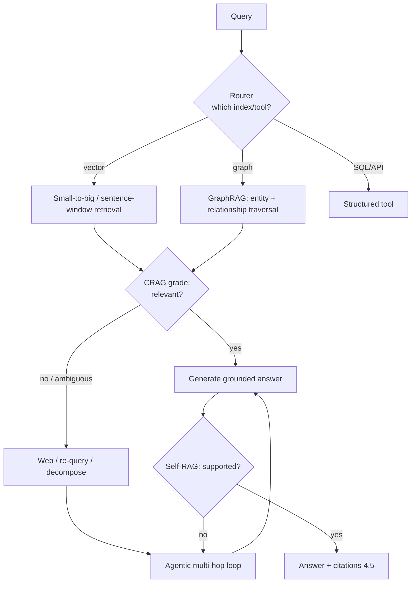

# 4.4 Advanced RAG Patterns
### Study Notes — Book Style · Generative AI Learning Plan · Phase 4 (RAG)

> **How to read this file.** This section is what you reach for *after* basic retrieve-then-read (4.1–4.3) hits a wall. Naive RAG — embed query, fetch top-k, stuff into the prompt — works well for single-fact lookups over well-chunked corpora. It struggles with (a) the *chunk-size dilemma* (small chunks match precisely but lack context; big chunks give context but match poorly), (b) *multi-hop* questions that need several linked facts, (c) *low-quality or missing retrieval* the system doesn't notice, (d) *relationships* between entities that live across documents, and (e) *very large or heterogeneous* corpora spanning many sources. Each advanced pattern here targets one of those failures: **parent-document/small-to-big** and **sentence-window** resolve the chunk-size dilemma; **agentic/multi-hop** and **self-RAG/CRAG** add reasoning and self-correction; **GraphRAG** adds relationship retrieval; **contextual retrieval** fixes chunk-in-isolation ambiguity; **routing** directs queries across indexes; and the **long-context-vs-RAG** discussion frames when to use which. These build on 4.2's chunking and 4.3's retrieval, are orchestrated with Phase 3 frameworks, and are all validated with **4.5**.
>
> **Sources synthesized:** LlamaIndex advanced-retrieval docs (parent/auto-merging, sentence-window, recursive/agentic retrieval, routers); LangGraph self-RAG & CRAG tutorials (Asai et al. Self-RAG; Yan et al. Corrective RAG); Microsoft GraphRAG and knowledge-graph RAG literature; Anthropic's *Contextual Retrieval* (2024); long-context model reports and 2026 long-context-vs-RAG analyses; the chunk-size lever from 4.2 and retrieval tuning from 4.3.

---

## 4.4.0 Where this fits (the bridge from 4.3)

**4.3** made a single retrieval pass as precise as possible. But some problems are not a ranking problem — they're an *architecture* problem. If the answer requires combining a fact from document A with a fact from document B, no reranking of a single query's results will assemble it; you need **multiple retrieval steps** (multi-hop/agentic). If retrieval quietly returns nothing relevant, you need the system to **notice and correct** (self-RAG/CRAG). If the question is about *how entities relate*, you need a **graph**, not a flat vector list. Advanced RAG is the set of architectures that go beyond "one query → top-k → answer."

> **One-line thesis:** *Advanced RAG replaces the single retrieve-then-read pass with architectures that decouple match-size from context (small-to-big, sentence-window), reason across multiple retrievals (agentic/multi-hop), check and correct their own retrieval (self-RAG/CRAG), traverse relationships (GraphRAG), disambiguate chunks (contextual retrieval), and route across sources — each targeting a specific failure of naive RAG.*



---

## 4.4.a Parent-Document / Small-to-Big and Sentence-Window

**Definition.** **Small-to-big (parent-document)** retrieval embeds *small* chunks for precise matching but, on a hit, returns the *larger parent* passage to the LLM. **Sentence-window** retrieval embeds individual sentences and, on a hit, returns that sentence *plus a window of neighbouring sentences*. Both **decouple the retrieval unit from the generation unit**.

**Intuition — the chunk-size dilemma resolved.** In 4.2 we saw small chunks match precisely but starve the LLM of context, while big chunks give context but blur the embedding. These patterns refuse the trade-off: match on something small and sharp, then hand the model something large and complete. It's like finding a book by its most distinctive sentence, then handing over the whole page it's on.

**Example.** A query matches the sentence "the ratio fell to 0.9x." Alone, that sentence is uninterpretable. Sentence-window returns the surrounding sentences ("...current ratio... in Q4 FY2025... the ratio fell to 0.9x, below the covenant floor..."), giving the model enough to answer correctly and cite precisely.

**Python (LlamaIndex):**

```python
from llama_index.core.node_parser import SentenceWindowNodeParser
from llama_index.core.postprocessor import MetadataReplacementPostProcessor

parser = SentenceWindowNodeParser.from_defaults(
    window_size=3, window_metadata_key="window", original_text_metadata_key="original")
nodes = parser.get_nodes_from_documents(docs)     # embed single sentences...
# at query time, replace the matched sentence with its window before generation:
engine = index.as_query_engine(
    node_postprocessors=[MetadataReplacementPostProcessor(target_metadata_key="window")])
```

---

## 4.4.b Agentic RAG and Multi-hop Retrieval

**Definition.** **Agentic RAG** lets an LLM agent (Phase 5) *decide* when, what, and how many times to retrieve — treating retrieval as a **tool** it can call repeatedly, decompose queries, and reason over intermediate results. **Multi-hop** retrieval chains several dependent retrievals: fetch fact A, use it to formulate the query for fact B, then combine.

**Intuition.** Naive RAG is one library trip with a fixed grocery list. Agentic RAG is a researcher who reads what they found, realizes they need one more thing, goes back, and only then writes the answer — looping until they have enough. This is essential when the answer isn't in any single passage.

**Example — finance.** "Which of Acme's subsidiaries had the largest revenue decline, and what reason did management give?" Hop 1: retrieve subsidiary revenues and identify the largest decline. Hop 2: retrieve *that subsidiary's* MD&A commentary for the stated reason. Combine. A single query can't do this; an agent decomposes and chains it.

**Python (sketch — LlamaIndex agent with a retriever tool):**

```python
from llama_index.core.tools import QueryEngineTool
from llama_index.core.agent import ReActAgent
from llama_index.llms.openai import OpenAI

tool = QueryEngineTool.from_defaults(
    query_engine=index.as_query_engine(similarity_top_k=5),
    name="filings", description="Search Acme financial filings")
agent = ReActAgent.from_tools([tool], llm=OpenAI(model="gpt-5.5"))  # decides how many hops
print(agent.chat("Which subsidiary declined most, and management's stated reason?"))
```

---

## 4.4.c Self-RAG and Corrective RAG (CRAG)

**Definition.** **Self-RAG** trains/prompts the model to *reflect*: decide whether retrieval is even needed, and after generating, judge whether each claim is **supported** by the retrieved context — regenerating or re-retrieving if not. **Corrective RAG (CRAG)** adds a lightweight **retrieval grader**: it scores retrieved docs as *correct / ambiguous / incorrect*, and on low confidence triggers a corrective action (e.g., a web search or query rewrite) before generating.

**Intuition.** Naive RAG blindly trusts whatever it retrieved. Self-RAG/CRAG add a *quality gate*: "Is this context actually good enough to answer from? If not, get better context or say I don't know." This directly attacks the failure mode where retrieval silently returns junk and the model answers confidently anyway (the hallucination problem from the Phase 4 overview).

**Example — e-commerce.** A support bot is asked about a brand-new product. CRAG grades the retrieved chunks as *incorrect* (nothing on this SKU in the KB), so instead of hallucinating specs it triggers a fallback (search the live product feed) or responds "I don't have information on that product yet" — a grounded refusal (links to 4.5 grounding and 2.2.3 guardrails).

**Note.** These are typically implemented as **LangGraph** state machines with conditional edges: retrieve → grade → (generate | correct) → check support → (finish | loop).

---

## 4.4.d GraphRAG — Retrieval over Knowledge Graphs

**Definition.** **GraphRAG** builds a **knowledge graph** (entities as nodes, relationships as edges) from the corpus — often LLM-extracted — and retrieves by **traversing relationships** and/or by querying **community summaries**, rather than (or in addition to) flat vector similarity. It excels at **multi-hop** and **global/"connect-the-dots"** questions.

**Intuition.** Vector RAG answers "find passages *about* X." GraphRAG answers "how are X and Y *connected*, and what does the whole set of documents say collectively about a theme." Because relationships are explicit edges, multi-hop traversal (A→B→C) is a graph walk, not a hopeful sequence of similarity searches. Community summaries also let it answer *corpus-level* questions ("what are the main risk themes across all filings") that no single chunk contains.

**Example — finance.** "Trace Acme's exposure to Supplier Z through its subsidiaries." A vector search returns scattered mentions; a graph traversal walks Acme → subsidiaries → contracts → Supplier Z and returns the connected path with its supporting passages — a genuinely multi-hop, relationship answer.

**Trade-offs.** GraphRAG has higher **build cost** (LLM extraction of entities/relations, graph construction) and complexity. Use it when relationships and multi-hop/global questions dominate; plain vector or hybrid RAG (4.3) is cheaper and sufficient for lookup-style questions. Hybrids (graph + vector) are common.

---

## 4.4.e Contextual Retrieval (Anthropic-style)

**Definition.** **Contextual retrieval** prepends a short, LLM-generated **context blurb** to each chunk *before embedding* (and before BM25 indexing), situating the chunk within its document ("This chunk is from Acme's FY2025 10-K, MD&A section, discussing liquidity..."). Anthropic reported it substantially reduces failed retrievals, especially combined with hybrid search and reranking (4.3).

**Intuition.** A raw chunk like "It fell 12% year-over-year" is ambiguous in isolation — *what* fell, *whose*, *when*? Its embedding can't match a specific query well. Adding one context sentence disambiguates the chunk so both dense and sparse retrieval find it correctly. It's the ingestion-time cousin of sentence-window: instead of returning context at query time, you *bake* context into the chunk at index time.

**Example.** Chunk "revenue declined 12%" → contextualized to "In Acme's FY2025 10-K, the Cloud segment revenue declined 12% year-over-year." Now "Acme Cloud revenue FY2025" retrieves it reliably.

**Python (sketch):**

```python
def contextualize(chunk, doc_summary, llm):
    prompt = (f"Document summary: {doc_summary}\nChunk: {chunk}\n"
              "Write one sentence situating this chunk within the document.")
    return llm.complete(prompt).text + "\n" + chunk   # embed & BM25-index this
```

---

## 4.4.f Long-context vs RAG, and Routing

**Long-context vs RAG.** 2026 models offer very large context windows (1.2.5), tempting a "just paste everything" approach. Trade-offs: long-context is **simpler** (no retrieval stack) and strong for *reasoning over one bounded document*, but it is **costly per token**, **slower**, degrades on "lost-in-the-middle" recall, and doesn't scale to corpora larger than the window or update cheaply. RAG stays superior for **large, changing, multi-document, access-controlled, citable** knowledge. The mature answer is **hybrid**: RAG to *select* the relevant few documents, long-context to *reason deeply* over them.

**Routing.** **Query routing** sends each query to the right index/tool: a vector index for prose, a SQL/API tool for structured metrics, a GraphRAG index for relationship questions, or a summary index for "what is this doc about." A **router** (an LLM classifier or a selector) picks the destination.

**Example — e-commerce.** "How many blue size-9 shoes are in stock?" → routed to a SQL tool (structured). "Are these shoes good for flat feet?" → routed to the vector KB (semantic). One system, right backend per query.

```python
from llama_index.core.query_engine import RouterQueryEngine
from llama_index.core.tools import QueryEngineTool
router = RouterQueryEngine.from_defaults(query_engine_tools=[
    QueryEngineTool.from_defaults(vector_engine, description="product descriptions & reviews"),
    QueryEngineTool.from_defaults(sql_engine, description="inventory counts & prices"),
])
```

---

## 4.4.g Real-world industry use cases

**Finance.**
1. **Exposure & relationship analysis (GraphRAG + agentic):** Tracing a bank's counterparty exposure across subsidiaries and contracts is a multi-hop, relationship query — GraphRAG traversal plus an agent that chains retrievals answers it with a supporting path, where flat RAG returns disconnected fragments.
2. **Covenant Q&A with sentence-window + CRAG:** Sentence-window returns the full clause context around a matched threshold; CRAG refuses to answer when the relevant covenant isn't retrieved, protecting against confident wrong compliance answers.

**E-commerce.**
1. **Routed hybrid assistant:** A shopping assistant routes structured questions (stock, price) to SQL and semantic questions (fit, reviews) to a contextual-retrieval vector index; small-to-big returns full spec context for accurate answers, cutting returns from wrong specs.
2. **New-product grounding (CRAG):** For unlaunched SKUs, CRAG grades retrieval as insufficient and falls back to the live feed or a grounded "not available yet," avoiding hallucinated features (2.2.3).

---

## 4.4.h Common pitfalls

- **Reaching for advanced patterns too early.** Most workloads are fine with 4.3; add complexity only when measurement (4.5) shows naive RAG failing on multi-hop/relationship/context problems.
- **Agentic loops without limits.** Unbounded retrieval loops burn tokens and latency and can loop forever — cap hops and add stopping conditions.
- **GraphRAG build cost surprise.** LLM entity/relation extraction over a big corpus is expensive and slow; scope it to where relationships matter, or hybridize with vector.
- **Contextual retrieval cost.** Contextualizing every chunk costs LLM calls at ingestion — mitigate with prompt caching and batch processing; measure the retrieval lift before rolling out corpus-wide.
- **Long-context as a silver bullet.** Big windows still suffer lost-in-the-middle, high cost, and can't handle changing/large/access-controlled corpora — don't retire retrieval by default.
- **Small-to-big misconfigured.** If parents are huge you reintroduce the context-bloat problem; size parents deliberately.
- **Skipping self-correction where stakes are high.** In compliance/medical/finance, a CRAG/self-RAG quality gate (and grounded refusals) is worth the extra hop.
- **No routing in heterogeneous systems.** Sending structured questions to a vector index (or vice versa) yields wrong answers a router would have prevented.

---

# Wrap-Up: 4.4 Advanced RAG Patterns

## The through-line (backward and forward)
Naive RAG (4.1–4.3) is one query → top-k → answer, and it fails on specific, diagnosable problems. **4.4** supplies an architecture per failure: **small-to-big and sentence-window** decouple the (small, precise) match unit from the (large, complete) generation unit, resolving 4.2's chunk-size dilemma; **agentic/multi-hop** RAG reasons across several dependent retrievals; **self-RAG/CRAG** add a quality gate that grades retrieval and self-corrects (attacking silent-junk hallucination); **GraphRAG** makes relationships first-class for multi-hop and global questions; **contextual retrieval** disambiguates chunks at index time so both dense and sparse retrieval (4.3) find them; **routing** sends each query to the right index/tool; and the **long-context-vs-RAG** trade-off resolves to *hybrid* — RAG selects, long-context reasons. These lean on Phase 3 orchestration (LangGraph/agents) and Phase 5 (agents-with-tools), and — critically — you only know a pattern *helped* by measuring it with **4.5**. The governing caution: added power is added cost and complexity; adopt each pattern when, and only when, evaluation shows the simpler stack failing.

## Quick reference

| Pattern | Fixes | Cost/trade-off |
|---|---|---|
| Small-to-big / parent-doc | precise match vs full context | size parents deliberately |
| Sentence-window | isolated-sentence ambiguity | returns neighbour window |
| Agentic / multi-hop | answers spanning many docs | bound loops (tokens/latency) |
| Self-RAG | unsupported claims | extra reflection hops |
| CRAG | silent bad retrieval | needs a grader + fallback |
| GraphRAG | relationships / global Qs | high build cost |
| Contextual retrieval | ambiguous chunks | LLM cost at ingestion |
| Routing | heterogeneous sources | router accuracy |
| Long-context (hybrid) | deep reasoning over few docs | token cost, lost-in-middle |

## Interview Questions & Answers
1. **What problem do small-to-big and sentence-window solve?** The chunk-size dilemma — match on small/precise units but generate from large/complete context.
2. **What is agentic RAG?** An agent decides when/what/how often to retrieve, treating retrieval as a tool and reasoning over results.
3. **What is multi-hop retrieval?** Chaining dependent retrievals where each hop's query depends on the previous hop's result.
4. **What is Self-RAG?** The model reflects on whether to retrieve and whether its output is supported, re-retrieving/regenerating if not.
5. **What is CRAG?** Corrective RAG grades retrieved docs (correct/ambiguous/incorrect) and triggers correction (e.g., web search) on low confidence.
6. **What is GraphRAG and when use it?** Retrieval over an entity-relationship graph; use it for multi-hop and global relationship questions.
7. **What is contextual retrieval?** Prepending an LLM context blurb to each chunk before embedding/indexing to disambiguate it.
8. **How does contextual retrieval differ from sentence-window?** Contextual bakes context in at index time; sentence-window adds context at query time.
9. **Long-context vs RAG — when each?** Long-context for deep reasoning over a few bounded docs; RAG for large, changing, multi-doc, access-controlled, citable corpora; hybrid is common.
10. **What is query routing?** Directing each query to the appropriate index/tool (vector, SQL, graph, summary) via a router.
11. **What's the main risk of advanced patterns?** Added cost/complexity/latency; adopt only when evaluation shows simpler RAG failing.
12. **How do these reduce hallucination?** Self-RAG/CRAG gate on support/relevance and enable grounded refusals when retrieval is insufficient.

## Mini glossary
**Small-to-big / parent-document** — match small chunks, return larger parents.
**Sentence-window** — embed sentences, return neighbouring window.
**Agentic RAG** — agent controls retrieval as a tool.
**Multi-hop** — chained dependent retrievals.
**Self-RAG** — reflection on retrieval need and answer support.
**CRAG** — retrieval grading + corrective action.
**Knowledge graph** — entities (nodes) + relationships (edges).
**GraphRAG** — retrieval via graph traversal/community summaries.
**Contextual retrieval** — context prepended to chunks before indexing.
**Router** — selects the index/tool for a query.
**Long-context** — reasoning over a large prompt window instead of retrieval.

## Further reading
- LlamaIndex: auto-merging/parent retriever, sentence-window, recursive/agentic retrieval, `RouterQueryEngine`.
- LangGraph tutorials: Self-RAG (Asai et al.) and Corrective RAG (Yan et al.).
- Microsoft GraphRAG; knowledge-graph RAG literature.
- Anthropic, *Contextual Retrieval* (2024); 2026 long-context-vs-RAG analyses.
- Revisit 4.2 (chunking), 4.3 (hybrid/rerank), 2.2.3 (guardrails/refusals); preview Phase 5 (agents), 4.5 (evaluating these patterns).

---

*Previous section ← **4.3 Retrieval Quality** — the single-pass tuning these patterns extend.*
*Next section → **4.5 Evaluation & Grounding** — proving any of these patterns actually helped.*
