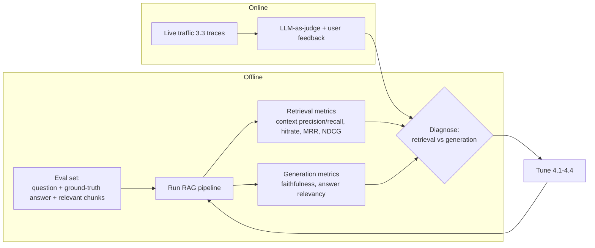

# 4.5 Evaluation & Grounding
### Study Notes — Book Style · Generative AI Learning Plan · Phase 4 (RAG)

> **How to read this file.** This is the section that makes all of Phase 4 *improvable* rather than guesswork. Every choice in 4.1 (embedding model, top-k), 4.2 (chunking, metadata), 4.3 (hybrid, rerank, query transforms), and 4.4 (advanced patterns) was accompanied by the same instruction: *measure it on your eval set.* This is that eval set — and the metrics, tooling, and grounding practices behind it. It covers the **RAG-specific metrics** (faithfulness/groundedness, context precision, context recall, answer relevancy), the **RAGAS** framework with code, classic **retrieval metrics** (hit rate, MRR, NDCG), **LLM-as-judge**, **citations/attribution**, **hallucination reduction**, how to **build an eval set**, and the **online-vs-offline** split. It closes the loop with the observability of **3.3** (tracing/LangSmith/Langfuse) and the grounding guardrails of **2.2.3**. Because RAG quality is dominated by retrieval (Phase 4 overview), the decisive skill is *decomposing* a bad answer into "retrieval failed" vs "generation failed" — which these metrics do directly.
>
> **Sources synthesized:** the RAGAS framework docs & paper (Es et al.); LangSmith / Langfuse RAG-evaluation docs (revisiting 3.3); IR metric literature (hit rate, MRR, NDCG); LLM-as-judge work (e.g., G-Eval, "LLM-as-a-judge" studies); Anthropic/OpenAI citation & grounding guidance; the hallucination framing from 1.3.7 and grounding guardrails from 2.2.3.

---

## 4.5.0 Where this fits (the bridge from 4.1–4.4 and 3.3)

The Phase 4 overview's principle was *RAG quality is dominated by retrieval* — so the central diagnostic question is always: **when an answer is wrong, was the right context not retrieved (a retrieval failure), or was it retrieved but the model ignored/misused it (a generation failure)?** The two failures need opposite fixes (better retrieval vs better prompting/grounding), so a metric suite that *separates* them is the whole point. RAG evaluation splits neatly along that seam: **retrieval metrics** (context precision/recall, hit rate, MRR, NDCG) judge stage 1; **generation metrics** (faithfulness, answer relevancy) judge stage 2. This is the applied form of the 3.3 loop: **trace → measure → change → re-measure.**

> **One-line thesis:** *You can't improve what you don't measure. RAG evaluation decomposes answer quality into retrieval metrics (did we fetch the right context?) and generation metrics (did we answer faithfully and relevantly from it?), scored offline on a curated eval set and online in production — turning RAG from vibes into an engineering feedback loop.*



---

## 4.5.a The Core RAG Metrics

**Definition.** Four metrics form the RAG "quad," two per stage:

- **Faithfulness / groundedness** *(generation)* — is every claim in the answer *supported by the retrieved context*? Penalizes hallucination even when the answer sounds right.
- **Answer relevancy** *(generation)* — does the answer actually address the *question* (not verbose, not off-topic)?
- **Context precision** *(retrieval)* — of the retrieved chunks, how many are actually relevant, and are the relevant ones ranked high? Measures *signal-to-noise* in retrieval.
- **Context recall** *(retrieval)* — of the information needed to answer (the ground truth), how much was actually present in the retrieved chunks? Measures whether retrieval *found everything needed*.

**Intuition.** Think of a student's open-book answer. **Context recall** = did the assistant fetch all the needed pages? **Context precision** = did it fetch *only* useful pages (not bury them in junk)? **Faithfulness** = did the student answer *from the pages* rather than making things up? **Answer relevancy** = did they answer the actual question? A low score in each points to a different fix: recall→retrieval breadth (4.3 hybrid/top-k), precision→reranking/filters (4.3), faithfulness→prompt/grounding/guardrails (2.2.3), relevancy→query understanding/prompt.

**Example.** An answer is fluent and correct-sounding but *faithfulness* is low → the model is drawing on parametric memory, not the context; the fix is a stricter grounding prompt and refusal-when-unsupported, not more retrieval. Conversely, faithfulness is high but the answer is wrong → *context recall* is low; the needed passage was never retrieved — fix stage 1.

---

## 4.5.b RAGAS — Metrics as Code

**Definition.** **RAGAS** is an open-source framework that computes the RAG metrics above (and more) largely **without human-labelled ground truth**, using an LLM to judge faithfulness/relevancy and comparing retrieved context to references. It turns the quad into a runnable test suite over a dataset of `{question, answer, contexts, ground_truth}`.

**Intuition.** RAGAS is a graded rubric run automatically over your eval set. It reads each answer against its retrieved context and its reference, scoring the four dimensions so you get a dashboard rather than a hunch — and, crucially, per-stage scores that localize the fix.

**Python:**

```python
from datasets import Dataset
from ragas import evaluate
from ragas.metrics import (faithfulness, answer_relevancy,
                           context_precision, context_recall)

data = Dataset.from_dict({
    "question":     ["What FY2025 liquidity risks did Acme disclose?"],
    "answer":       [rag_answer],                 # your pipeline's output
    "contexts":     [[c.page_content for c in retrieved_chunks]],  # what retrieval returned
    "ground_truth": ["Acme disclosed refinancing risk on its 2026 notes..."],  # reference
})
result = evaluate(data, metrics=[faithfulness, answer_relevancy,
                                 context_precision, context_recall])
print(result)   # per-metric scores -> which stage to fix
```

---

## 4.5.c Retrieval Metrics — Hit Rate, MRR, NDCG

**Definition.** Classic information-retrieval metrics evaluate the *ranked retrieval list* against known-relevant chunks:

- **Hit rate @k** — fraction of queries where at least one relevant chunk appears in the top-k. "Did we find it at all?"
- **MRR (Mean Reciprocal Rank)** — average of `1/rank` of the *first* relevant chunk. Rewards putting the right chunk *near the top* — directly measures the value of reranking (4.3).
- **NDCG (Normalized Discounted Cumulative Gain)** — rewards placing *all* relevant chunks high, with graded relevance and rank discounting. The most complete ranking metric.

**Intuition.** Hit rate asks *did the answer appear somewhere in the top-k*; MRR asks *how high was the first right one*; NDCG asks *how good is the whole ordering*. These are the cleanest way to prove a reranker or hybrid search helped: rerank should lift MRR/NDCG even if hit rate is unchanged (it reorders what's already retrieved).

**Example.** Adding a cross-encoder reranker (4.3) leaves hit rate@10 at 0.9 but lifts MRR from 0.45 to 0.72 — proof the reranker floated the right chunk from ~rank 4 to ~rank 1, exactly its job.

---

## 4.5.d LLM-as-Judge

**Definition.** **LLM-as-judge** uses a capable LLM to score outputs against a rubric (faithfulness, relevancy, correctness) — either *reference-free* (judge answer vs context) or *reference-based* (judge answer vs a gold answer), and sometimes *pairwise* (which of two answers is better). It underlies RAGAS's faithfulness/relevancy scoring.

**Intuition.** Human labelling doesn't scale to thousands of eval cases; a strong LLM approximates a human grader cheaply and consistently. It's not perfect — judges have biases (verbosity, position, self-preference) — so calibrate against a small human-labelled sample and use structured rubrics with explanations.

**Best practices.** Use a strong judge model (ideally different from the generator to reduce self-bias), demand a *reason + score* (chain-of-thought grading), fix the rubric, and spot-check against human labels. Combine with deterministic checks where possible (e.g., does the cited chunk actually contain the number?).

---

## 4.5.e Citations, Attribution, and Hallucination Reduction

**Citations/attribution.** Grounded RAG should return *which chunk supports each claim* (the `source_nodes` from the Phase 4 overview's example). Citations do double duty: they let *users* verify, and they let *evaluation* check faithfulness mechanically (does the cited source contain the claim?). Enforce citations via the prompt/structured output (2.2.1) and validate them.

**Hallucination reduction — the concrete levers.** Combining Phase 4's tools: (1) improve *retrieval* so the answer is actually present (4.2/4.3/4.4 — most hallucinations are missing-context in disguise); (2) prompt for **grounded answering with refusal** — "answer only from the context; if it's not there, say you don't know" (2.2.3 guardrails); (3) require **citations** and validate them; (4) add **CRAG/self-RAG** gates (4.4) to catch bad retrieval; (5) measure **faithfulness** continuously and alert on regressions.

**Example — finance.** A compliance bot must never fabricate a covenant figure. Grounding prompt + mandatory citation + faithfulness monitoring means an unsupported claim is caught (low faithfulness / missing citation) rather than shipped — and when the figure isn't retrievable, the system refuses instead of guessing.

---

## 4.5.f Building an Eval Set; Online vs Offline

**Building an eval set.** Start small and real: 30–100 representative `{question, ground_truth_answer, relevant_chunk_ids}` triples covering common queries, edge cases, and *unanswerable* questions (to test refusals). Sources: real user queries (from 3.3 traces), SME-authored questions, and **LLM-synthesized** Q&A from your documents (RAGAS can generate a testset) — then curate. This set is the yardstick for *every* change in 4.1–4.4; without it, "improvements" are guesses.

**Offline vs online evaluation.**

- **Offline** — run the eval set in CI on every change: catches regressions before deploy, enables A/B of chunking/embedding/rerank choices, fully reproducible.
- **Online** — evaluate *live traffic*: user feedback (thumbs, edits), LLM-as-judge on sampled real queries, and business metrics (deflection, task success). Catches distribution shift and real-world failures the eval set missed; feeds new cases back into the offline set.

Both plug into **3.3** tracing (LangSmith/Langfuse): traces provide the raw data for online eval and the real queries that grow the offline set — the see→change→re-measure loop, closed.

**Python — LLM-as-judge scoring in LangSmith (sketch):**

```python
from langsmith.evaluation import evaluate, LangChainStringEvaluator
faith = LangChainStringEvaluator("labeled_score_string", config={
    "criteria": {"faithfulness": "Is every claim supported by the retrieved context?"}})
evaluate(rag_app, data="acme-rag-evalset",
         evaluators=[faith])   # runs offline over the curated dataset, logs scores
```

---

## 4.5.g Real-world industry use cases

**Finance.**
1. **Regression-gated compliance bot:** An offline RAGAS suite (faithfulness + context recall) runs in CI; a chunking change that drops context recall on covenant questions fails the build before it ships. Online, faithfulness on sampled real queries is monitored and alerts on drift — hallucinated figures are caught, not deployed.
2. **Auditable citations:** Every answer cites the exact filing/page; evaluation validates that cited chunks contain the claim, giving auditors a verifiable trail and giving the team a mechanical faithfulness check.

**E-commerce.**
1. **A/B-ing retrieval upgrades:** Before rolling out a reranker, the team measures MRR/NDCG and answer relevancy on an eval set of real shopping questions; the reranker's MRR lift justifies the added latency/cost — a data-driven decision, not a hunch.
2. **Online feedback loop:** Thumbs-down on support answers surface low-faithfulness or low-recall cases from 3.3 traces; these become new offline eval cases, continuously hardening the system against real failures.

---

## 4.5.h Common pitfalls

- **No eval set.** "It seems better" is not evidence — without a curated set, every 4.1–4.4 change is a guess and regressions ship silently.
- **Only measuring end-to-end accuracy.** A single score can't tell you *where* it broke; always split retrieval vs generation metrics.
- **Confusing faithfulness with correctness.** An answer can be faithful to *wrong retrieved context* (garbage-in) or correct-but-unfaithful (from memory) — you need both faithfulness and context recall.
- **Trusting LLM-judge scores blindly.** Judges have verbosity/position/self bias — calibrate against human labels and use a different judge model than the generator.
- **No unanswerable questions in the eval set.** You won't catch over-confident answering / failure to refuse without them.
- **Offline only.** The eval set drifts from real usage; add online evaluation and feed real failures back.
- **Citations that aren't validated.** A citation the source doesn't actually support is worse than none — validate mechanically.
- **Evaluating without tracing.** Without 3.3 traces you can't see the retrieved chunks/prompt, so you can't diagnose *why* a metric is low.

---

# Wrap-Up: 4.5 Evaluation & Grounding

## The through-line (backward and forward)
Every earlier Phase 4 section ended with "measure it on your eval set" — **4.5** is that measurement, and it's what converts RAG from vibes into an engineering discipline. The decisive move is **decomposing answer quality along the retrieval/generation seam**: **context recall & precision, hit rate, MRR, NDCG** judge whether the right context was fetched and ranked (fix in 4.2/4.3/4.4); **faithfulness & answer relevancy** judge whether the model answered faithfully and on-topic from that context (fix with grounding prompts, citations, and guardrails from 2.2.3). **RAGAS** runs the quad as code (often reference-free via **LLM-as-judge**), **citations** make grounding verifiable both to users and to the evaluator, and **hallucination reduction** is the stack of levers — better retrieval, grounded-refusal prompting, validated citations, CRAG/self-RAG gates, faithfulness monitoring. You run this **offline** in CI to gate every change and **online** over live traffic (feeding new cases back), all riding on **3.3** tracing — closing the see→change→re-measure loop that began in Phase 3. This ends Phase 4: you now have the full RAG discipline — substrate (4.1), ingestion (4.2), retrieval tuning (4.3), advanced patterns (4.4), and the evaluation loop (4.5) that makes all of it improvable — and it feeds forward to Phase 5 (RAG-as-a-tool for agents) and production serving/monitoring later.

## Quick reference

| Metric | Stage | Answers |
|---|---|---|
| Context recall | retrieval | Was all needed info retrieved? |
| Context precision | retrieval | Is retrieval high signal-to-noise / well-ranked? |
| Hit rate @k | retrieval | Did a relevant chunk appear in top-k? |
| MRR | retrieval | How high was the first relevant chunk? |
| NDCG | retrieval | How good is the whole ranking? |
| Faithfulness | generation | Is every claim supported by context? |
| Answer relevancy | generation | Does it address the question? |
| RAGAS | both (framework) | Runs the quad as code |
| LLM-as-judge | both (method) | Rubric-based automatic scoring |

## Interview Questions & Answers
1. **Name the four core RAG metrics.** Faithfulness, answer relevancy (generation); context precision, context recall (retrieval).
2. **Faithfulness vs answer relevancy?** Faithfulness = supported by context (anti-hallucination); relevancy = actually answers the question.
3. **Context precision vs recall?** Precision = signal-to-noise/ranking of retrieved chunks; recall = whether all needed info was retrieved.
4. **How do metrics localize a fix?** Retrieval metrics point to 4.2/4.3/4.4; generation metrics point to prompting/grounding/guardrails.
5. **What is RAGAS?** A framework that scores RAG metrics, often reference-free, via LLM-as-judge over a `{question, answer, contexts, ground_truth}` dataset.
6. **What do hit rate, MRR, NDCG measure?** Found-in-top-k; rank of first relevant; quality of the full ranking.
7. **How do you prove a reranker helped?** MRR/NDCG rise (better ordering) even if hit rate is flat.
8. **What is LLM-as-judge and its risks?** An LLM scores outputs by rubric; risks are verbosity/position/self bias — calibrate against humans, use a different judge model.
9. **Why require and validate citations?** Users can verify; evaluation can mechanically check faithfulness (does the source contain the claim?).
10. **Levers to reduce hallucination?** Better retrieval, grounded-refusal prompting (2.2.3), validated citations, CRAG/self-RAG gates, faithfulness monitoring.
11. **How do you build an eval set?** 30–100 curated `{question, gold answer, relevant chunks}` incl. unanswerable cases, from real traces + SMEs + LLM synthesis.
12. **Offline vs online eval?** Offline gates changes in CI (reproducible); online watches live traffic (feedback/judge/business metrics) and feeds new cases back.

## Mini glossary
**Faithfulness / groundedness** — answer claims supported by context.
**Answer relevancy** — answer addresses the question.
**Context precision** — relevance/ranking of retrieved chunks.
**Context recall** — coverage of needed info in retrieval.
**Hit rate @k** — relevant chunk present in top-k.
**MRR** — mean reciprocal rank of first relevant chunk.
**NDCG** — rank-discounted, graded ranking quality.
**RAGAS** — framework computing RAG metrics as code.
**LLM-as-judge** — LLM scoring outputs by rubric.
**Citation/attribution** — linking a claim to its source chunk.
**Offline / online eval** — pre-deploy dataset vs live-traffic evaluation.

## Further reading
- RAGAS docs & paper (Es et al.); LangSmith and Langfuse RAG-evaluation guides (revisit 3.3).
- IR metrics: hit rate, MRR, NDCG references.
- LLM-as-judge literature (G-Eval and related studies); judge-bias analyses.
- Citation/grounding guidance (Anthropic/OpenAI) and 2.2.3 guardrails.
- Revisit 1.3.7 (hallucination), 3.3 (tracing/eval), 4.1–4.4 (the stages these metrics diagnose); preview Phase 5 (RAG-as-tool for agents).

---

*Previous section ← **4.4 Advanced RAG Patterns** — the patterns this section validates.*
*Next phase → **Phase 5: Agents & Tools** — where RAG becomes one tool an agent can call.*
