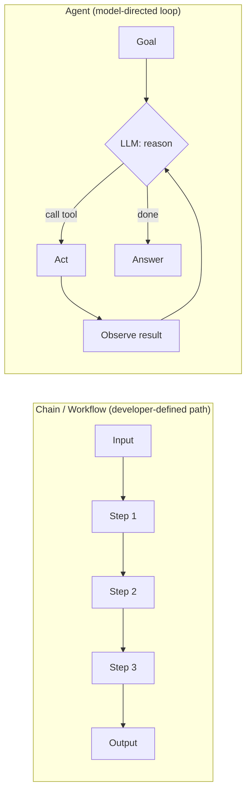
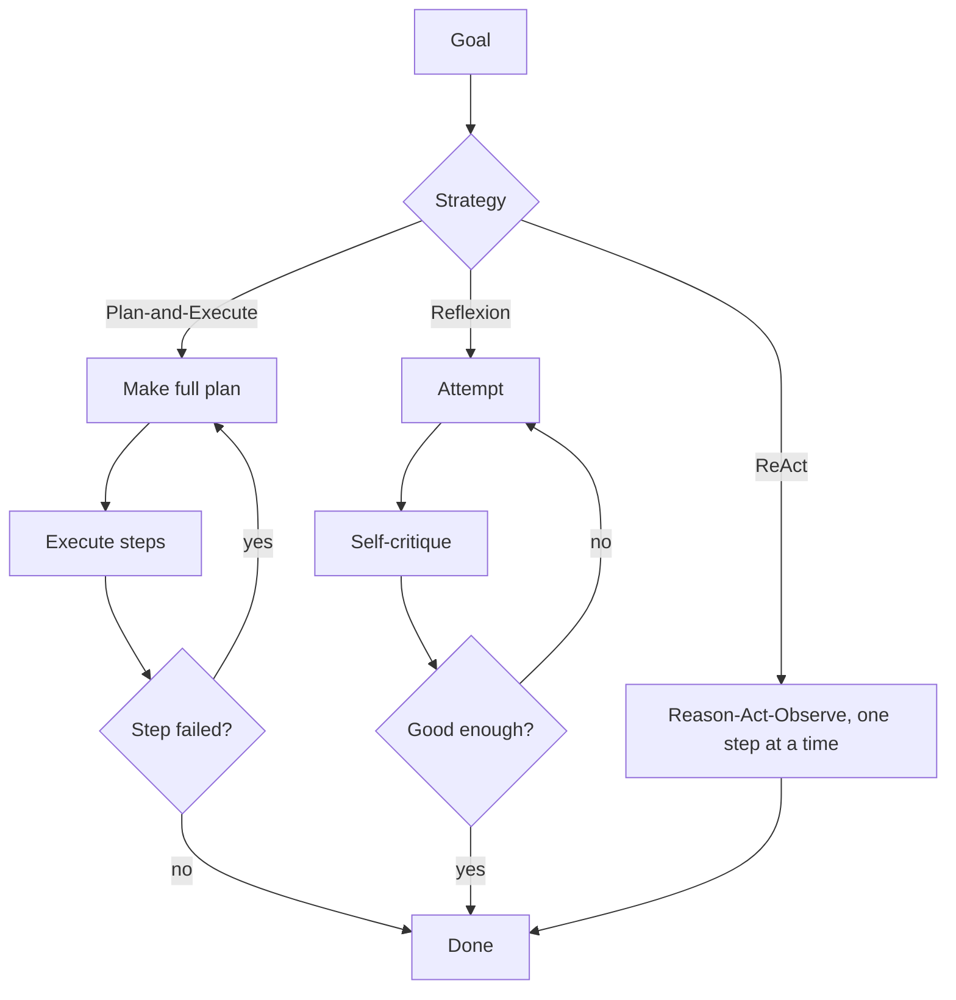

# 5.1 Agent Fundamentals
### Study Notes — Book Style · Generative AI Learning Plan · Phase 5 (Agents & MCP)

> **How to read this file.** This opens Phase 5. Everything here is the *payoff* of earlier phases: an agent is a **ReAct loop (2.1.2)** made durable, driven by **native tool/function calling (2.2.2)**, fenced by **output validation and action gating (2.2.3)**, and — in later sections — wired to memory (**3.1.2**), retrieval (**4.x**, RAG-as-a-tool), and standardized tool access (**5.3 MCP**). This chapter defines what an agent *is* versus a fixed chain/pipeline, formalizes the **reason → act → observe** loop, surveys planning strategies (ReAct, Plan-and-Execute, Reflexion), and — the part that separates demos from production — covers **reliability**: loop limits, timeouts, and cost control. Explanation-forward, current to 2026. Structure: **Definition · Intuition · Example · Mermaid · Python · Finance + E-commerce · Pitfalls · Wrap-Up**.
>
> **Sources synthesized:** Yao et al., *ReAct* (2022); Shinn et al., *Reflexion* (2023); Wang et al. *Plan-and-Solve* (2023); Anthropic *Building Effective Agents* (2024–2025); LangGraph, CrewAI, and OpenAI Agents SDK docs (2025–2026); the tool-calling groundwork in 2.2.2 and guardrail patterns in 2.2.3.

---

## 5.1.0 Where this fits (the bridge from Phase 2)

In **2.1.2.c** we built "an agent in 20 lines" — a hand-written ReAct loop. In **2.2.2** we replaced brittle JSON-in-a-string with **native tool calling**, and in **2.2.3** we wrapped outputs in validation, retries, and action gating. An **agent** is what you get when you combine those three and add one crucial ingredient: **the model, not your code, decides the control flow.** A chain runs the steps *you* wrote, in the order *you* wrote them. An agent runs a loop where the *model* chooses the next step until it decides it is done.

That single shift — control flow moving from developer to model — is the whole subject of Phase 5. It buys enormous flexibility (the agent handles inputs you never explicitly coded for) and imposes a new burden (the loop can run forever, cost unboundedly, or take unsafe actions). This chapter is the conceptual core; 5.2 gives you frameworks that implement it robustly, 5.3 standardizes how tools are exposed, and 5.4 scales it to many agents with memory and planning.

> **One-line thesis:** *An agent is an LLM running a reason → act → observe loop where the model decides what to do next; the engineering job is to give it good tools and to fence the loop so it terminates, stays cheap, and never takes an ungated dangerous action.*

---

## 5.1.a What Is an Agent (vs a Chain / Pipeline)

**Definition.** An **agent** is a system in which an LLM **dynamically directs its own process and tool usage**, deciding at each step whether to call a tool, which tool, with what arguments, and when to stop — looping over model calls until a goal is met. A **chain (or pipeline / workflow)** is a system where the LLM and tools are orchestrated through **predefined code paths** — the sequence of steps is fixed by the developer, even if individual steps call an LLM.

**Intuition.** Think of a **recipe** versus a **cook**. A chain is a recipe: step 1 chop, step 2 sauté, step 3 plate — the same steps every time, whatever the ingredients. An agent is a cook handed a fridge and a goal ("make dinner"): they look, decide, taste, adjust, and stop when the dish is right. The recipe is predictable, cheap, and easy to test. The cook is flexible and handles surprises, but you can't fully predict what they'll do — so you give them a budget, a timer, and rules about which knives they may use.

The two are a **spectrum**, not a binary. Anthropic's influential 2024 framing distinguishes **workflows** (LLMs orchestrated through fixed code — e.g., prompt chaining, routing, parallelization) from **agents** (LLMs directing their own actions). Most production "agentic" systems are actually structured workflows with one agentic step, because that is easier to make reliable.

**Example.** A support task: "Refund the customer's last order if it arrived damaged."

- *Chain:* `classify_intent → fetch_last_order → check_damage_report → if damaged: issue_refund → draft_reply`. You wrote every branch.
- *Agent:* Give the model tools (`get_orders`, `get_tickets`, `issue_refund`) and the instruction. It decides to look up the order, notices there is no damage report, asks a clarifying question or checks the ticket, then issues the refund — handling cases you never explicitly branched for.



---

## 5.1.b The Reason → Act → Observe Loop (building on ReAct 2.1.2)

**Definition.** The **agent loop** is the repeated cycle: the model **reasons** about the current state, **acts** by emitting a tool call (via native function calling, 2.2.2), the runtime **executes** that tool and returns an **observation**, which is appended to the conversation; the loop repeats until the model emits a final answer instead of a tool call (or a limit is hit). This is **ReAct** (2.1.2.c) operationalized with real tool-calling instead of hand-parsed JSON.

**Intuition.** Each observation is *new grounded context* the model didn't have before. The loop is how an LLM — a stateless next-token predictor (1.3) — incrementally gathers facts it lacks (live data, computation results, database rows) and corrects course. The conversation history *is* the agent's working memory within a single run; every tool result becomes part of the prompt for the next model call.

**Example (trace).**

```
User: How many units of SKU-42 can we ship today, and what's the revenue at list price?
Thought: I need current inventory and the list price.
Action: get_inventory(sku="SKU-42")        → Observation: {available: 120}
Thought: Now the price.
Action: get_price(sku="SKU-42")             → Observation: {list: 49.99}
Thought: Revenue = 120 * 49.99. Use the calculator for exact math.
Action: calculator("120 * 49.99")           → Observation: 5998.80
Final: 120 units available; $5,998.80 at list price.
```

**Python — a minimal but production-shaped loop with native tool calling (build on 2.2.2):**

```python
import json, time
from openai import OpenAI
client = OpenAI()

def get_inventory(sku): return {"available": 120}
def get_price(sku):     return {"list": 49.99}
def calculator(expr):   return eval(expr, {"__builtins__": {}})   # sandbox in prod
TOOLS = {"get_inventory": get_inventory, "get_price": get_price, "calculator": calculator}

schema = [
    {"type": "function", "function": {"name": "get_inventory",
        "parameters": {"type": "object", "properties": {"sku": {"type": "string"}}, "required": ["sku"]}}},
    {"type": "function", "function": {"name": "get_price",
        "parameters": {"type": "object", "properties": {"sku": {"type": "string"}}, "required": ["sku"]}}},
    {"type": "function", "function": {"name": "calculator",
        "parameters": {"type": "object", "properties": {"expr": {"type": "string"}}, "required": ["expr"]}}},
]

def run_agent(goal, max_steps=8, deadline_s=30, budget_tokens=20000):
    msgs = [{"role": "user", "content": goal}]
    start, used = time.time(), 0
    for step in range(max_steps):                          # LOOP LIMIT
        if time.time() - start > deadline_s:               # TIMEOUT
            return "stopped: timeout"
        r = client.chat.completions.create(model="gpt-5.5", messages=msgs,
                                           tools=schema, temperature=0)
        used += r.usage.total_tokens                       # COST TRACKING
        if used > budget_tokens:                           # COST CAP
            return "stopped: token budget exceeded"
        m = r.choices[0].message
        if not m.tool_calls:                               # model chose to answer
            return m.content
        msgs.append(m)
        for call in m.tool_calls:                          # ACT
            args = json.loads(call.function.arguments)
            try:
                obs = TOOLS[call.function.name](**args)
            except Exception as e:                         # TOOL-ERROR HANDLING
                obs = {"error": str(e)}
            msgs.append({"role": "tool", "tool_call_id": call.id,
                         "content": json.dumps(obs)})      # OBSERVE
    return "stopped: step limit"
```

Note the four reliability fences baked in from the start — step limit, timeout, token budget, and per-tool error handling. Those are not optional extras; they are the difference between a demo and a system.

---

## 5.1.c Planning Approaches: ReAct, Plan-and-Execute, Reflexion

**Definition.** A **planning strategy** governs *how* the agent decides its sequence of actions. Three canonical patterns:

- **ReAct (interleaved):** plan one step at a time — reason, act, observe, repeat. Planning and execution are fused. Simple, adaptive, the default.
- **Plan-and-Execute (plan-first):** the model first produces a **full multi-step plan**, then an executor runs the steps (often with a cheaper model), optionally re-planning if a step fails. Fewer expensive planning calls; better for long, structured tasks.
- **Reflexion (self-critique loop):** after an attempt, the agent **critiques its own result**, stores the critique as feedback, and retries — verbal reinforcement learning without weight updates (Shinn et al., 2023). A cheap accuracy boost layered on either of the above.

**Intuition.** ReAct is *improvising as you go* — great when the environment is unpredictable and each observation genuinely changes the plan. Plan-and-Execute is *drawing the map before the trip* — efficient when the task is decomposable and you want to minimize costly large-model reasoning calls and keep the agent on-track over many steps. Reflexion is *marking your own homework and redoing the wrong bits* — it turns a single shaky attempt into an iteratively improved one.

**Example.** "Produce a competitor pricing report for our top 5 products."

- *ReAct* would search, read, compute, search again — fine but may wander across 5 products.
- *Plan-and-Execute* writes a plan (`for each of 5 products: fetch price → fetch competitor prices → compute gap → summarize`), then executes deterministically, re-planning only if a fetch fails.
- *Reflexion* adds a final "does this report cover all 5 with sources? If not, fix" pass.



**Python — Reflexion-style self-critique wrapper around any agent:**

```python
def reflexion(goal, attempts=3):
    feedback = ""
    for _ in range(attempts):
        prompt = goal + (f"\n\nPrior critique to address:\n{feedback}" if feedback else "")
        result = run_agent(prompt)
        critique = client.chat.completions.create(model="gpt-5.5", temperature=0,
            messages=[{"role": "user", "content":
                f"Goal:\n{goal}\n\nResult:\n{result}\n\n"
                "List concrete errors/omissions. If none, reply exactly 'OK'."}]
        ).choices[0].message.content
        if critique.strip() == "OK":
            return result
        feedback = critique
    return result
```

---

## 5.1.d Tool Use, State, and When to Use an Agent

**Tools (recap → loop).** From 2.2.2, a tool is a typed, described function the model may call. In an agent, tools are the *only* way the model touches the world — read APIs, write APIs, calculators, code execution, and (Phase 4) **RAG-as-a-tool** (a retriever exposed as `search_docs`). Good tool design is the single biggest lever on agent reliability: clear names, tight schemas, small focused tools, and good error messages the model can recover from.

**State.** Within one run, state lives in the message history (working memory). Across runs, you need explicit **persistence** — a checkpointer or memory store (5.2, 5.4). Statelessness of the LLM (1.3) means *you* own state; the framework just helps you carry it.

**When to use an agent vs a fixed pipeline (the key judgment).** Prefer the **simplest thing that works**. Use a **fixed chain/workflow** when the steps are known, stable, and few — it is cheaper, faster, testable, and predictable. Reach for an **agent** only when the path genuinely can't be enumerated in advance: open-ended tasks, variable numbers of steps, or where the model must adapt to intermediate results. Anthropic's guidance is blunt: *don't build an agent when a workflow (or a single prompt) suffices* — agents trade latency, cost, and predictability for flexibility.

**Reliability (link 2.2.2 / 2.2.3).** Every agent loop needs: **loop/step limits** (hard cap on iterations), **timeouts / deadlines**, **cost controls** (token/dollar budgets, cheaper models for sub-steps, prompt caching from 3.3.2), **tool-error handling** (return errors to the model, don't crash), **output validation** (Pydantic, 2.2.3), and **action gating / human-in-the-loop** for irreversible or high-value actions (2.2.3, and 5.2's checkpointers).

**Finance use cases.**

1. **Reconciliation assistant:** an agent with `get_ledger`, `get_bank_feed`, and `flag_discrepancy` tools works variable-length reconciliations that a fixed pipeline can't enumerate — with a hard step limit and a human gate before any write-back.
2. **Research analyst:** ReAct over `market_data`, `filings_search` (RAG-as-a-tool, 4.x), and `calculator` to answer open-ended "why did margin move?" questions, exact math always offloaded to the calculator.

**E-commerce use cases.**

1. **Order-resolution agent:** tools `get_order`, `get_tickets`, `issue_refund` (gated), handling refunds/exchanges/reships adaptively — an agent because the resolution path varies per case.
2. **Catalog-enrichment worker:** Plan-and-Execute over thousands of SKUs (fetch → summarize → tag → write), using a cheap executor model and a token budget to control cost at scale.

---

## 5.1.e Common Pitfalls

- **Agent when a workflow would do.** The most common mistake: reaching for an autonomous loop for a task with a known, fixed path. You pay latency, cost, and unpredictability for flexibility you don't need.
- **No loop limit / no timeout.** The loop can cycle forever (tool fails → model retries → fails …). Always cap steps *and* wall-clock time.
- **No cost cap.** A wandering agent can burn thousands of tokens per run; multiply by traffic and the bill explodes. Track tokens per run and set a hard budget (see 2.3.3).
- **Crashing on tool errors.** If a tool raises and you don't catch it, the run dies; if you *do* catch and return the error to the model, it can often recover. Return structured errors, not exceptions.
- **Too many / overlapping tools.** Large or ambiguous tool sets cause wrong-tool selection. Keep tools few, distinct, and well-described (2.2.2).
- **Ungated dangerous actions.** Never let an agent issue refunds, send funds, delete data, or email customers without gating (2.2.3) — ideally human-in-the-loop for irreversible actions.
- **Trusting the reasoning trace as truth.** As in 2.1.2, the printed "Thought" is not a verified audit trail. Validate outputs and tool results, not eloquence.
- **Context bloat.** Long runs accumulate observations until the context window fills, degrading quality and raising cost. Summarize or prune history (5.4 memory).

---

# Wrap-Up: 5.1 Agent Fundamentals

## The through-line (backward and forward)

An agent is the natural culmination of Phase 2: **ReAct's reason-act-observe loop (2.1.2)** made durable, powered by **native tool calling (2.2.2)**, and fenced by **validation and action gating (2.2.3)**. The defining shift from a chain is that **the model owns the control flow** — flexibility bought at the price of predictability, which is exactly why loop limits, timeouts, and cost caps are non-negotiable. Planning strategies (ReAct, Plan-and-Execute, Reflexion) are how the loop decides its steps, and the core judgment is to use the *simplest* construct that works — often a workflow, not an agent. Forward: **5.2** gives you frameworks (LangGraph, CrewAI, OpenAI Agents SDK) that implement this loop with checkpointing and human-in-the-loop; **5.3 (MCP)** standardizes how tools are exposed to it; **5.4** scales it to multiple agents with real memory and planning.

## Quick reference

| Concept | Key point |
|---|---|
| Chain / workflow | Developer-defined fixed path; predictable, cheap, testable |
| Agent | Model-directed loop; flexible, but needs fencing |
| Agent loop | reason → act (tool call) → observe → repeat until done |
| ReAct | Plan one step at a time; adaptive default |
| Plan-and-Execute | Plan fully, then execute; efficient for long tasks |
| Reflexion | Self-critique and retry; cheap accuracy boost |
| Reliability fences | step limit, timeout, token/$ budget, tool-error handling, action gating |
| When to use an agent | Only when the path can't be enumerated in advance |

## Interview Questions & Answers

1. **What is an agent?** An LLM system that directs its own process and tool use in a loop, deciding each next step until the goal is met.
2. **Agent vs chain/pipeline?** A chain runs a developer-defined fixed sequence; an agent lets the *model* choose the control flow dynamically.
3. **Describe the agent loop.** Reason about state → act (emit a tool call) → observe the result → repeat, until the model returns a final answer or a limit fires.
4. **How does an agent relate to ReAct?** It is ReAct (2.1.2) operationalized with native tool calling instead of hand-parsed text.
5. **ReAct vs Plan-and-Execute?** ReAct interleaves planning and acting one step at a time; Plan-and-Execute makes a full plan first, then executes (fewer costly planning calls, better for long tasks).
6. **What is Reflexion?** A self-critique loop: attempt → critique → retry with the critique as feedback; verbal self-improvement without training.
7. **When should you NOT use an agent?** When the path is known and fixed — use a workflow or a single prompt; agents cost more and are less predictable.
8. **What reliability controls does every agent need?** Loop/step limits, timeouts, cost/token budgets, tool-error handling, output validation, and action gating.
9. **Where does agent state live?** Within a run, in the message history (working memory); across runs, in an explicit checkpointer/memory store.
10. **Why is tool design the biggest reliability lever?** The model can only act through tools; clear names, tight schemas, few distinct tools, and recoverable error messages directly determine success.
11. **How do you control agent cost?** Token/dollar budgets per run, cheaper models for sub-steps, prompt caching, pruning history, and preferring workflows.
12. **What is action gating and when is it required?** Requiring approval (often human-in-the-loop) before irreversible/high-value actions like payments, deletes, or customer emails.

## Mini glossary

**Agent** — LLM that directs its own tool-using loop.
**Chain / workflow** — fixed, developer-defined orchestration.
**Agent loop** — reason → act → observe cycle.
**ReAct** — interleaved reason+act planning.
**Plan-and-Execute** — plan fully, then run steps.
**Reflexion** — self-critique-and-retry.
**Working memory** — the in-run message history.
**Action gating** — approval before risky actions.
**Loop limit** — hard cap on iterations.

## Further reading

- Anthropic, *Building Effective Agents* (workflows vs agents; when to use each).
- Yao et al., *ReAct* (2022); Shinn et al., *Reflexion* (2023); Wang et al., *Plan-and-Solve* (2023).
- Revisit 2.1.2 (ReAct/CoT), 2.2.2 (tool calling), 2.2.3 (validation/gating); preview 5.2 (frameworks), 5.3 (MCP), 5.4 (multi-agent, memory, planning).

---

*Previous ← **Phase 4 (RAG)** — retrieval that agents call as a tool.*
*Next → **5.2 Agent Frameworks** — LangGraph, CrewAI, AutoGen, OpenAI Agents SDK, PydanticAI, LlamaIndex, and when to use each.*
