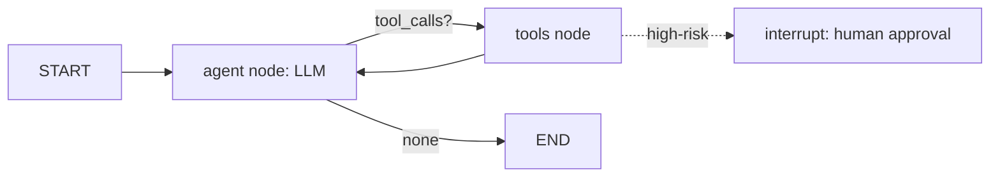
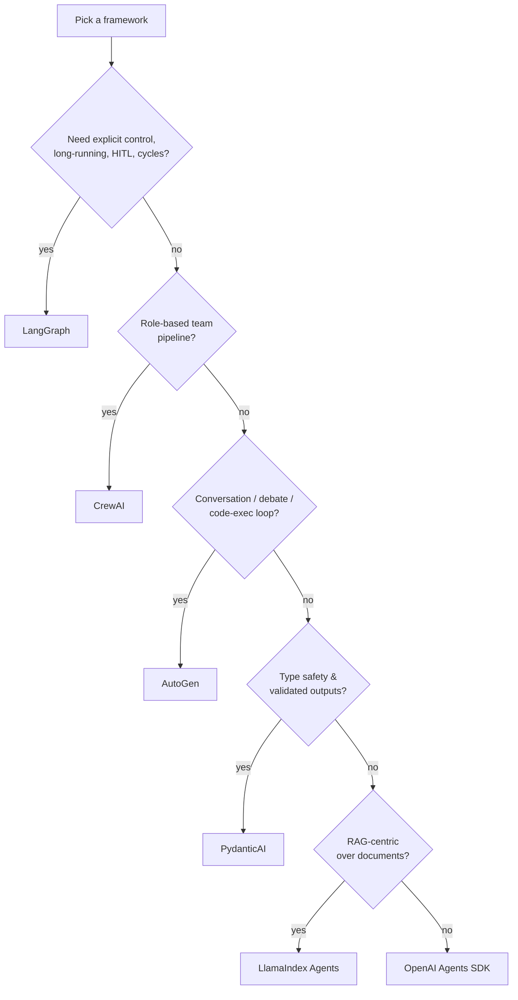

# 5.2 Agent Frameworks
### Study Notes — Book Style · Generative AI Learning Plan · Phase 5 (Agents & MCP)

> **How to read this file.** This continues from **5.1 (Agent Fundamentals)**, where we built the reason-act-observe loop by hand and listed the reliability fences it needs. Nobody hand-rolls that loop in production — frameworks implement it, plus state persistence, retries, human-in-the-loop, and tracing. This chapter surveys the 2026 landscape — **LangGraph, CrewAI, AutoGen, OpenAI Agents SDK, PydanticAI, LlamaIndex agents/workflows** — explains the mental model of each, gives a decision guide, and works a full **LangGraph** example (the framework you should know deepest for interviews). It builds directly on **LangChain/LCEL (3.1.1)**, **memory (3.1.2)**, **LlamaIndex query-engine-as-tool (3.2.2)**, and **tracing/observability (3.3)**. Explanation-forward, current to 2026.
>
> **Sources synthesized:** LangGraph docs & concepts (nodes/edges/state/checkpointers/interrupts, 2025–2026); CrewAI docs (agents/tasks/crews/flows); Microsoft AutoGen / AgentChat docs; OpenAI Agents SDK docs (agents, handoffs, guardrails, sessions); PydanticAI docs; LlamaIndex `AgentWorkflow` & Workflows docs; the framework-abstraction principle from 3.1.3 and 3.2.3.

---

## 5.2.0 Where this fits (the bridge from 5.1)

5.1 gave us the loop and its dangers. A framework's job is to make that loop **durable and operable**: persist state so a run can pause and resume, add **human-in-the-loop** approval at gates (2.2.3), retry failed tools, emit **traces** (3.3), and let you compose multiple agents. The frameworks differ mainly in **how much control they hand you** and **what abstraction they organize around** — a graph of state, a crew of roles, a conversation among agents, or a typed function. Because the Phase-3 frameworks already **abstract models and tools (3.1.3, 3.2.2)**, most of these interoperate: you can expose a LlamaIndex query engine as a tool inside a LangGraph node, or run an MCP server (5.3) that any of them consume.

> **One-line thesis:** *All agent frameworks implement the same reason-act-observe loop from 5.1; they differ in the organizing abstraction (graph / crew / conversation / typed function) and in how much low-level control vs convenience they give you — pick by the control you need and the shape of your problem.*

---

## 5.2.a LangGraph — Stateful Graphs (the one to know deepest)

**Definition.** **LangGraph** (from the LangChain team) models an agent as a **directed graph**: **nodes** are functions (often LLM or tool calls) that read and write a shared, typed **state** object; **edges** define transitions, including **conditional edges** (branch on state) and **cycles** (loops — the agent loop is literally a cycle in the graph). A **checkpointer** persists state after every node, enabling pause/resume, **human-in-the-loop** via `interrupt`, memory across sessions, and time-travel debugging.

**Intuition.** LangGraph is the **assembly language of agents**: lower-level and more verbose than the others, but you control the control flow explicitly. If 5.1's loop was pseudocode, LangGraph is that loop drawn as a state machine you can pause, inspect, and resume. This explicitness is why it dominates complex, long-running, production agents where you must gate actions and recover from failure.

**Key mechanics.**

- **State:** a `TypedDict` (or Pydantic model); nodes return partial updates, merged by **reducers** (e.g., append to a message list).
- **Nodes / edges:** `add_node`, `add_edge`; `add_conditional_edges` routes on a function of state.
- **Cycles:** an edge back to a prior node creates the agent loop; you add a step-count check for the loop limit (5.1).
- **Checkpointer:** `MemorySaver` (dev) or SQLite/Postgres (prod); enables `interrupt()` for approval and resuming a thread by `thread_id`.
- **Prebuilt:** `create_react_agent` gives a ready ReAct agent when you don't need a custom graph.

**Example — a tool-using agent as an explicit graph with a human gate:**

```python
from typing import Annotated, TypedDict
from langgraph.graph import StateGraph, START, END
from langgraph.graph.message import add_messages
from langgraph.checkpoint.memory import MemorySaver
from langgraph.types import interrupt
from langchain_openai import ChatOpenAI
from langchain_core.tools import tool

class State(TypedDict):
    messages: Annotated[list, add_messages]   # reducer appends new messages

@tool
def get_order(order_id: str) -> dict:
    "Fetch an order by id."
    return {"order_id": order_id, "total": 129.0, "status": "delivered_damaged"}

@tool
def issue_refund(order_id: str, amount: float) -> dict:
    "Issue a refund. HIGH-RISK: gated."
    return {"refunded": amount, "order_id": order_id}

llm = ChatOpenAI(model="gpt-5.5").bind_tools([get_order, issue_refund])
TOOLS = {"get_order": get_order, "issue_refund": issue_refund}

def agent(state: State):
    return {"messages": [llm.invoke(state["messages"])]}

def tools_node(state: State):
    last = state["messages"][-1]
    out = []
    for call in last.tool_calls:
        if call["name"] == "issue_refund":              # ACTION GATE (2.2.3)
            interrupt({"approve_refund": call["args"]})  # pause for human OK
        result = TOOLS[call["name"]].invoke(call["args"])
        out.append({"role": "tool", "content": str(result), "tool_call_id": call["id"]})
    return {"messages": out}

def route(state: State):
    return "tools" if state["messages"][-1].tool_calls else END

g = StateGraph(State)
g.add_node("agent", agent); g.add_node("tools", tools_node)
g.add_edge(START, "agent")
g.add_conditional_edges("agent", route, {"tools": "tools", END: END})
g.add_edge("tools", "agent")                            # CYCLE = the agent loop
app = g.compile(checkpointer=MemorySaver())             # persistence + interrupt

cfg = {"configurable": {"thread_id": "cust-42"}}
app.invoke({"messages": [{"role": "user",
    "content": "Refund order A100 if it arrived damaged."}]}, cfg)
# On interrupt, resume after approval: app.invoke(Command(resume=True), cfg)
```



---

## 5.2.b CrewAI — Roles, Tasks, and Crews

**Definition.** **CrewAI** organizes work around **role-playing agents** (each with a `role`, `goal`, and `backstory`), **tasks** (a description + expected output, assigned to an agent), and a **crew** (the team plus a `process`: `sequential` or `hierarchical`, where a manager agent delegates). CrewAI also offers **Flows** for event-driven, more deterministic orchestration when you want tighter control.

**Intuition.** CrewAI thinks in **org-chart** terms: you hire specialists ("Senior Researcher," "Report Writer"), give each a job, and let the crew run them in order or under a manager. It is opinionated and fast to stand up — high-level where LangGraph is low-level — which makes it excellent for **role-based multi-agent** pipelines (a theme we deepen in 5.4).

**Example (concept + code):**

```python
from crewai import Agent, Task, Crew, Process

researcher = Agent(role="Market Researcher",
                   goal="Find current competitor prices for {product}",
                   backstory="Meticulous analyst.", verbose=True)
writer = Agent(role="Report Writer",
               goal="Write a concise pricing brief",
               backstory="Clear business writer.")

t1 = Task(description="Research competitor prices for {product}.",
          expected_output="A table of competitor prices with sources.", agent=researcher)
t2 = Task(description="Write a 1-paragraph pricing recommendation.",
          expected_output="A short brief.", agent=writer, context=[t1])

crew = Crew(agents=[researcher, writer], tasks=[t1, t2], process=Process.sequential)
result = crew.kickoff(inputs={"product": "wireless earbuds"})
```

---

## 5.2.c AutoGen — Conversational Multi-Agent

**Definition.** **AutoGen** (Microsoft) frames multi-agent systems as **agents that converse** to solve a task. Its modern **AgentChat** layer provides `AssistantAgent`, `UserProxyAgent` (can execute code / act for a human), and **teams** (e.g., `RoundRobinGroupChat`, `SelectorGroupChat`) with termination conditions. Agents exchange messages until a stop condition is met.

**Intuition.** AutoGen is a **conversation** metaphor: solving a problem *is* a chat among specialists (and optionally a human proxy). It shines for **collaborative/debate-style** patterns and for **code-writing-and-executing** loops (an assistant proposes code, a proxy runs it, they iterate). It is research-friendly and flexible; you shape behavior through the chat protocol and termination rules.

**Example (concept).** An `AssistantAgent` writes Python; a `UserProxyAgent` executes it and returns the output; they loop in a `RoundRobinGroupChat` until tests pass or a max-message limit terminates the team. (Multi-agent topologies are covered in 5.4.)

---

## 5.2.d OpenAI Agents SDK, PydanticAI, and LlamaIndex Agents

**OpenAI Agents SDK.** A lightweight, production-minded SDK built around four primitives: **Agents** (an LLM + instructions + tools), **handoffs** (one agent delegates to another), **guardrails** (validate inputs/outputs — 2.2.3), and **sessions** (automatic conversation memory). It runs the agent loop for you, has built-in tracing, and is provider-agnostic. Great default when you want a clean, minimal API without a graph.

**PydanticAI.** Brings the **FastAPI/Pydantic developer experience** to agents: strongly **typed** dependencies and **structured outputs** validated by Pydantic (deep tie to 2.2.1/2.2.3), model-agnostic, with streaming and tracing. Best when **type safety and validated outputs** are the priority and you like Python-native, dependency-injected design.

**LlamaIndex agents & Workflows.** LlamaIndex offers `FunctionAgent` / `ReActAgent` and **`AgentWorkflow`** for multi-agent orchestration, plus a general **event-driven Workflows** engine. Its superpower is **RAG-native** agents: expose a **query engine as a tool (3.2.2)** so the agent can retrieve over your indexes. Best when the agent's core job is retrieval/knowledge work over documents.



---

## 5.2.e Comparison & When to Use Each

**Definition.** The frameworks trade **control vs convenience** and organize around different abstractions. There is no universal winner; match the tool to the problem shape and the level of control you need.

| Framework | Abstraction | Control level | Best for | Native HITL / persistence |
|---|---|---|---|---|
| **LangGraph** | Stateful graph (nodes/edges/state) | Low-level, explicit | Complex, long-running, production agents; custom control flow | Yes (checkpointers, `interrupt`) |
| **CrewAI** | Roles → tasks → crew | High-level, opinionated | Role-based multi-agent pipelines; fast to build | Partial (Flows for control) |
| **AutoGen** | Conversing agents / teams | Mid, protocol-driven | Collaborative/debate, code-exec loops, research | Via UserProxy / termination |
| **OpenAI Agents SDK** | Agents + handoffs + guardrails | Mid, minimal | Clean production agents, multi-agent handoffs | Sessions + guardrails |
| **PydanticAI** | Typed agent + Pydantic I/O | Mid, type-first | Type-safe, validated-output apps | Via typed deps / validators |
| **LlamaIndex** | FunctionAgent / AgentWorkflow | Mid | RAG-centric agents over documents | Workflow-level |

**Intuition.** Use **LangGraph** when you must *own* the control flow (gates, retries, resumable long runs). Use **CrewAI** when the problem is naturally a team of roles and you want speed. Use **AutoGen** for conversational/collaborative or code-writing loops. Use the **OpenAI Agents SDK** for a clean minimal production agent with handoffs. Use **PydanticAI** when typed, validated outputs matter most. Use **LlamaIndex** when the agent is fundamentally a retriever over your knowledge base. Crucially, these compose: a LangGraph node can wrap a LlamaIndex query engine or call an MCP server (5.3).

**Finance use cases.**

1. **LangGraph reconciliation agent:** an explicit graph with a Postgres checkpointer and an `interrupt` before any ledger write-back — resumable across days, fully audited (ties to 3.3 tracing).
2. **CrewAI research desk:** a "Data Analyst" + "Risk Writer" crew produces a credit memo; sequential process keeps the pipeline predictable and reviewable.

**E-commerce use cases.**

1. **OpenAI Agents SDK support triage:** a triage agent **hands off** to specialist agents (returns, shipping, billing) with input guardrails filtering abuse (2.2.3).
2. **LlamaIndex catalog assistant:** a `FunctionAgent` exposes the product-catalog query engine as a tool (3.2.2), answering "which earbuds are waterproof under \$80?" with grounded retrieval.

---

## 5.2.f Common Pitfalls

- **Framework-first, not problem-first.** Choosing LangGraph for a task a single prompt would solve (5.1). Start with the simplest construct; adopt a framework when its features (persistence, HITL, multi-agent) earn their complexity.
- **Skipping the checkpointer.** Without persistence you lose resumability, HITL, and cross-session memory — and you can't recover a failed long run. In LangGraph, no checkpointer means no `interrupt`.
- **No loop limit inside the graph.** A cycle without a step-count guard can loop forever; carry a counter in state and route to `END` past a cap (5.1).
- **Ignoring tracing.** Multi-node/multi-agent runs are opaque without observability; wire LangSmith/Langfuse (3.3) from day one.
- **Over-nesting agents.** Deep agent-calls-agent hierarchies multiply cost and failure surface; prefer flat handoffs or a supervisor (5.4) and cap depth.
- **Mismatched abstraction.** Forcing a conversational debate into a rigid graph, or a controlled write-back flow into a free-form chat, fights the framework. Match the metaphor to the problem.
- **Assuming lock-in.** These interoperate (LlamaIndex-in-LangGraph, MCP tools everywhere); designing as if you must pick exactly one is a false constraint (recall the abstraction lesson of 3.1.3/3.2.3).

---

# Wrap-Up: 5.2 Agent Frameworks

## The through-line (backward and forward)

Every framework here implements the **same reason-act-observe loop from 5.1** — they differ in the **organizing abstraction** and the **control-vs-convenience** trade-off. **LangGraph** exposes the loop as an explicit, persistable **state graph** (nodes/edges/cycles/checkpointers/HITL) and is the deepest, most production-grade choice. **CrewAI** (roles/tasks/crews), **AutoGen** (conversing agents), the **OpenAI Agents SDK** (agents/handoffs/guardrails), **PydanticAI** (typed, validated), and **LlamaIndex** (RAG-native agents) each suit a different problem shape, and they **compose** rather than compete. This all rests on Phase 3's model/tool abstractions (3.1.3, 3.2.2) and Phase 2's tool calling and guardrails (2.2.2/2.2.3), and it should be **traced** with the observability of 3.3. Forward: **5.3 (MCP)** standardizes how tools/resources reach any of these frameworks, and **5.4** uses them to build multi-agent systems with real memory and planning.

## Quick reference

| Pick... | When |
|---|---|
| LangGraph | You need explicit control, cycles, resumable long runs, HITL gates |
| CrewAI | Role-based team pipeline, fast to build |
| AutoGen | Conversational/debate or code-writing-and-executing loops |
| OpenAI Agents SDK | Clean minimal production agent with handoffs + guardrails |
| PydanticAI | Type safety and validated structured outputs are paramount |
| LlamaIndex agents | Agent's core job is retrieval over your documents |

## Interview Questions & Answers

1. **What problem do agent frameworks solve over the hand-rolled loop of 5.1?** Durable state, HITL, retries, tracing, and multi-agent composition — production concerns.
2. **What is LangGraph's core abstraction?** A directed graph of nodes over a shared typed state, with conditional edges and cycles; the agent loop is a cycle.
3. **What does a checkpointer enable in LangGraph?** State persistence — pause/resume, human-in-the-loop via `interrupt`, cross-session memory, and time-travel debugging.
4. **How is a loop limit enforced in a LangGraph cycle?** Carry a step counter in state and route to `END` once it exceeds a cap.
5. **What are CrewAI's primitives?** Role-based agents, tasks (description + expected output), and a crew with a sequential or hierarchical process.
6. **What metaphor does AutoGen use?** Agents that converse (teams like round-robin or selector group chats) until a termination condition; strong for code-exec and debate.
7. **Name the four OpenAI Agents SDK primitives.** Agents, handoffs, guardrails, and sessions.
8. **When would you choose PydanticAI?** When typed dependencies and Pydantic-validated structured outputs are the priority (ties to 2.2.1/2.2.3).
9. **What makes LlamaIndex agents distinctive?** RAG-native design — expose a query engine as a tool (3.2.2) so the agent retrieves over your indexes.
10. **LangGraph vs CrewAI — one-line difference?** LangGraph is low-level explicit control (graph/state); CrewAI is high-level opinionated role orchestration.
11. **Do you have to pick exactly one framework?** No — they interoperate (e.g., a LlamaIndex query engine or MCP tool inside a LangGraph node).
12. **What must you wire up regardless of framework?** Loop limits, action gating, and tracing/observability (3.3).

## Mini glossary

**Node / edge** — LangGraph function / transition.
**State** — shared typed object nodes read/write.
**Reducer** — merges node updates into state (e.g., append messages).
**Checkpointer** — persists state; enables resume + HITL.
**Interrupt** — pause a graph for human approval.
**Crew / role / task** — CrewAI's team abstractions.
**Handoff** — one agent delegating to another (Agents SDK).
**Guardrail** — input/output validation on an agent.
**AgentWorkflow** — LlamaIndex multi-agent orchestrator.

## Further reading

- LangGraph docs — state, nodes/edges, conditional edges, checkpointers, `interrupt`, `create_react_agent`.
- CrewAI docs (agents/tasks/crews/flows); Microsoft AutoGen / AgentChat docs.
- OpenAI Agents SDK docs (agents, handoffs, guardrails, sessions); PydanticAI docs; LlamaIndex `AgentWorkflow` & Workflows.
- Revisit 3.1.1 (LCEL/LangGraph mention), 3.1.3 (model abstraction), 3.2.2 (query-engine-as-tool), 3.3 (tracing).

---

*Previous ← **5.1 Agent Fundamentals** — the loop these frameworks implement.*
*Next → **5.3 Model Context Protocol (MCP)** — a standard way to expose tools/resources/prompts to any of these agents.*
