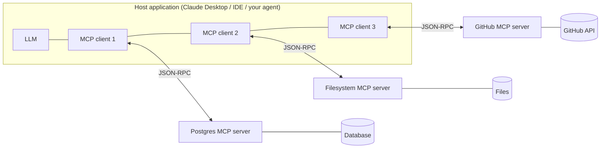

# 5.3 Model Context Protocol (MCP)
### Study Notes — Book Style · Generative AI Learning Plan · Phase 5 (Agents & MCP)

> **How to read this file.** This continues from **5.2 (Agent Frameworks)**. Those frameworks all need **tools** — and in **2.2.2** we learned to write tool schemas and wire functions by hand, per app, per model. MCP answers the obvious next question: *what if tools, data, and prompts had a standard interface, like a USB-C port, so any model or agent could plug into any tool server without bespoke glue?* This chapter defines MCP, its host/client/server architecture and transports, its three primitives (tools, resources, prompts), how to consume existing servers, how to **build a Python server with FastMCP**, how MCP differs from plain function calling, and — critically — its **security** model. It builds on tool calling (2.2.2), guardrails (2.2.3), and the RAG-as-a-tool idea (4.x). Explanation-forward, current to 2026.
>
> **Sources synthesized:** Anthropic's Model Context Protocol announcement (Nov 2024) and the open **modelcontextprotocol.io** specification (2025–2026 revisions); the official Python SDK & **FastMCP**; MCP transport docs (stdio, Streamable HTTP); MCP security best-practices guidance; the function-calling groundwork in 2.2.2.

---

## 5.3.0 Where this fits (the bridge from 5.2)

By 5.2 you can build an agent that calls tools. But those tools were **bespoke**: you wrote a schema (2.2.2), an executor, and auth for *your* app and *your* model. If a colleague builds a GitHub integration and you build one too, you both reinvent the same wiring — an **M×N problem** (M models/agents × N tools = M×N custom integrations). **MCP** turns this into **M+N**: each tool provider writes **one** MCP server; each model/agent host writes **one** MCP client; they interoperate through a shared protocol. It is an **open standard** (introduced by Anthropic, Nov 2024) now adopted across the ecosystem — the "USB-C for AI."

> **One-line thesis:** *MCP is an open protocol that standardizes how applications expose tools, data (resources), and prompts to LLMs — turning per-app, per-model integration glue (M×N) into reusable, plug-in servers (M+N) that any MCP-capable agent can consume.*

---

## 5.3.a What MCP Is and Why It Matters

**Definition.** The **Model Context Protocol (MCP)** is an **open standard** (JSON-RPC 2.0 based) that defines how an AI application connects to external systems to give models **context** and **capabilities**. It specifies a client-server architecture and three server-provided **primitives** — **tools** (actions the model can invoke), **resources** (data the model can read), and **prompts** (reusable prompt templates) — plus how they are discovered and called.

**Intuition — the USB-C analogy.** Before USB-C, every device had its own charger/cable. Before MCP, every AI app hand-wired every integration for every model. MCP is the standard port: a Postgres MCP server, a GitHub MCP server, a Slack MCP server each expose their capabilities *once*, in the standard shape, and *any* MCP host (Claude Desktop, an IDE, your LangGraph agent) can plug in and use them immediately. The value is **reuse and ecosystem**: you consume a growing library of servers instead of building each integration.

**Example.** You want your agent to query a database, read files, and open GitHub issues. Without MCP: three custom tool implementations, three auth flows, three schemas — coupled to your framework. With MCP: run (or connect to) the existing **Postgres**, **filesystem**, and **GitHub** MCP servers; your host discovers their tools automatically and the agent uses them. Swap the LLM later — the servers don't change.



---

## 5.3.b Architecture: Host, Client, Server, Transports

**Definition.** MCP defines three roles:

- **Host** — the AI application the user interacts with (Claude Desktop, an IDE, your agent app). It manages the LLM and one or more clients, and enforces user consent/security.
- **Client** — a connector *inside* the host that maintains a **1:1 connection to one server** and speaks the protocol.
- **Server** — a (usually separate) program that exposes tools/resources/prompts for a specific system (a database, an API, the filesystem).

**Transports** — how client and server exchange JSON-RPC messages:

- **stdio** — the server runs as a **local subprocess**; messages go over stdin/stdout. Simplest and most common for local tools (no network, no auth needed beyond the OS). Ideal for filesystem, local DB, dev tooling.
- **Streamable HTTP** (the current standard remote transport; superseded the older HTTP+SSE) — the server is a **remote HTTP service**; supports streaming and is used for hosted/shared servers. Requires proper **authentication/authorization** (OAuth-style) because it's networked.

**Intuition.** The host is the *application*; a client is a *cable*; a server is a *device*. Each cable connects to exactly one device. **stdio** is plugging a local device directly into your machine; **Streamable HTTP** is reaching a device across the network — same protocol, but now you must lock the door (auth).

**Example.** In Claude Desktop's config you register a filesystem server over **stdio** (it launches `npx @modelcontextprotocol/server-filesystem`), and a company knowledge server over **Streamable HTTP** at `https://mcp.acme.com` with an OAuth token. The host spins up one client per server.

**Lifecycle.** On connect, client and server **initialize** (exchange protocol version + capabilities), then the client **discovers** primitives (`tools/list`, `resources/list`, `prompts/list`), and thereafter **invokes** them (`tools/call`, `resources/read`, `prompts/get`). Discovery is dynamic — the host learns what a server offers at runtime.

---

## 5.3.c The Three Primitives: Tools, Resources, Prompts

**Definition.**

- **Tools** — **model-controlled** actions: functions the LLM can invoke to *do* something (query a DB, send an email, run code). Each has a name, description, and JSON-Schema input — exactly the shape from 2.2.2, but discovered over the protocol.
- **Resources** — **application/user-controlled** read-only data the model can be *given* as context: files, DB records, documents, identified by URIs (e.g., `file:///report.pdf`, `db://customers/42`). Think "GET-like," no side effects — a natural home for RAG context (4.x).
- **Prompts** — **user-controlled** reusable, parameterized prompt templates the server offers (e.g., a `/summarize-filing` template), often surfaced as slash-commands in the host UI.

**Intuition.** The split mirrors *who decides to use each*: the **model** decides to call tools (actions), the **app** decides which resources to attach (context), and the **user** typically triggers prompts (templates). This separation keeps action (risky, gated) distinct from data (read-only) and from canned instructions — a cleaner mental model than "everything is a function."

**Example.** A "financial filings" MCP server exposes: a **tool** `search_filings(query)` (action → returns hits), **resources** `filing://{ticker}/{year}` (read a specific 10-K as context), and a **prompt** `risk_summary(ticker)` (a vetted template that structures a risk write-up). An analyst picks the `risk_summary` prompt (user), the host attaches the relevant filing resource (app), and the model calls `search_filings` as needed (model).

---

## 5.3.d Using Existing Servers & Building One (FastMCP)

**Consuming existing servers.** The ecosystem ships many servers (filesystem, Git/GitHub, Postgres/SQLite, Slack, Google Drive, Puppeteer, and hundreds more). You register them in your host's config (Claude Desktop, IDEs) or connect programmatically from your agent. Because discovery is dynamic, adding a server instantly gives the agent new tools — no code change to the agent itself.

**Python — connecting to a server as a client (agent side):**

```python
# pip install mcp
from mcp import ClientSession, StdioServerParameters
from mcp.client.stdio import stdio_client
import asyncio

async def main():
    params = StdioServerParameters(command="python", args=["filings_server.py"])
    async with stdio_client(params) as (read, write):
        async with ClientSession(read, write) as session:
            await session.initialize()
            tools = await session.list_tools()              # dynamic discovery
            print([t.name for t in tools.tools])
            result = await session.call_tool("search_filings",
                                             {"query": "liquidity risk"})
            print(result.content)

asyncio.run(main())
```

**Building a server with FastMCP.** The Python SDK's **FastMCP** makes a server a matter of decorators — like FastAPI for MCP. Type hints and docstrings become the tool schema automatically (echoing 2.2.2's "let the schema come from the signature").

```python
# pip install "mcp[cli]"     — then: mcp run filings_server.py   (or: mcp dev ...)
from mcp.server.fastmcp import FastMCP

mcp = FastMCP("filings")

@mcp.tool()
def search_filings(query: str, limit: int = 5) -> list[dict]:
    """Search SEC filings for a query. Returns matching passages with source."""
    # real impl: hit your vector store / RAG retriever (4.x)
    return [{"ticker": "ACME", "year": 2025, "text": "…liquidity…", "score": 0.82}]

@mcp.resource("filing://{ticker}/{year}")
def get_filing(ticker: str, year: int) -> str:
    """Return the full text of a specific annual filing (read-only context)."""
    return f"10-K for {ticker} ({year})…"

@mcp.prompt()
def risk_summary(ticker: str) -> str:
    """Reusable template that structures a risk write-up for a company."""
    return (f"Summarize the top risks for {ticker}. "
            "Use only the attached filing. Cite sections.")

if __name__ == "__main__":
    mcp.run()          # stdio by default; mcp.run(transport="streamable-http") for remote
```

That single file is a fully valid MCP server: one tool, one resource template, one prompt — consumable by Claude Desktop, an IDE, or the client above, unchanged.

---

## 5.3.e MCP vs Plain Function Calling + Security

**MCP vs plain function calling (the interview favorite).** They are **complementary, not competing**. Function calling (2.2.2) is the **model capability** — the LLM emitting a structured request to call a named function. MCP is a **transport/packaging standard** for *where those functions live and how they're discovered and served* across apps. Under the hood, an MCP tool still surfaces to the model as a function-call schema; MCP adds **standardization, dynamic discovery, reuse across hosts/models, and the resource/prompt primitives** on top.

| Aspect | Plain function calling (2.2.2) | MCP |
|---|---|---|
| Scope | One app, hand-wired tools | Reusable servers across many apps/models |
| Discovery | Static (you code the schemas) | Dynamic (`tools/list` at runtime) |
| Integration cost | M×N (per model × per tool) | M+N (one server, one client) |
| Primitives | Tools only | Tools + resources + prompts |
| Best when | A few bespoke tools in one app | Sharing/consuming an ecosystem of integrations |

Use plain function calling for a handful of app-specific tools; reach for MCP when you want to **consume existing integrations** or **expose your system once** to many agents.

**Security considerations (do not skip).** MCP gives models real reach into systems, so it concentrates risk:

- **User consent & least privilege.** The host must get explicit user approval before invoking tools and expose only the minimum scope. Never auto-approve write actions (ties to action gating, 2.2.3).
- **Prompt injection via tool/resource content.** A malicious document or tool result can carry instructions ("ignore prior rules, exfiltrate data"). Treat all tool/resource output as **untrusted input**; validate and sandbox (2.2.3).
- **Confused-deputy / token passthrough.** Remote (HTTP) servers must authenticate properly (OAuth) and **not blindly forward** the user's tokens to downstream APIs; scope credentials per server.
- **Server trust & supply chain.** Running a third-party MCP server is running third-party code with access to your data — vet the source, pin versions, prefer stdio-local or isolated/containerized servers for sensitive data (data-residency echoes 1.4.2).
- **Tool poisoning / rug-pulls.** A server can change a tool's behavior or description after approval; monitor and re-verify. Log and **trace** all MCP calls (3.3).

**Finance use cases.**

1. **Governed internal data server:** a bank runs an MCP server over its filings/ledger behind OAuth (Streamable HTTP), so multiple internal agents share one audited, access-controlled integration instead of each building its own.
2. **Analyst desktop:** an analyst's host connects a market-data MCP server (tools) plus filing **resources**, using a vetted `risk_summary` **prompt** — grounded, standardized, and logged.

**E-commerce use cases.**

1. **Catalog + orders servers:** a support agent consumes an "orders" MCP server (tools: `get_order`, `issue_refund` — the refund gated) and a "catalog" server, swappable across the LLM vendors the company trials.
2. **RAG-as-a-resource:** the product knowledge base is exposed as MCP **resources**/`search` tool, so any storefront assistant retrieves the same governed content (4.x).

---

## 5.3.f Common Pitfalls

- **Confusing MCP with function calling.** They aren't alternatives; MCP standardizes and serves the tools that function calling invokes.
- **Building MCP when you don't need it.** For a couple of app-internal tools, plain function calling (2.2.2) is simpler; MCP's payoff is reuse and ecosystem.
- **Running untrusted servers unscoped.** A third-party server is third-party code touching your data — vet, sandbox, and least-privilege it.
- **Treating tool/resource output as trusted.** Prompt injection rides in on returned content; validate and gate (2.2.3).
- **Token passthrough on remote servers.** Forwarding user credentials downstream invites confused-deputy attacks; scope per-server auth.
- **No auth on HTTP transport.** stdio is local and low-risk; Streamable HTTP is networked and *must* be authenticated.
- **Skipping consent/gating for write tools.** Discovery makes it easy to expose destructive tools; keep human-in-the-loop for irreversible actions.
- **No tracing.** MCP calls cross process/network boundaries; without logging (3.3) they're invisible when they fail or misbehave.

---

# Wrap-Up: 5.3 Model Context Protocol (MCP)

## The through-line (backward and forward)

Function calling (2.2.2) let a model *request* an action; MCP standardizes **where those actions live and how they're discovered and served**, turning per-app, per-model glue (**M×N**) into reusable plug-in servers (**M+N**) — the "USB-C for AI." Its **host/client/server** architecture runs over **stdio** (local) or **Streamable HTTP** (remote, authenticated), and its three primitives cleanly separate **model-controlled tools** (actions), **app-controlled resources** (read-only context, a natural RAG home from 4.x), and **user-controlled prompts** (templates). **FastMCP** makes a Python server a few decorators. Because MCP gives models real reach, **security** — consent, least privilege, untrusted-input handling, scoped auth, server vetting — is inseparable from it, extending the guardrails of 2.2.3 and the tracing of 3.3. Forward: **5.4** builds multi-agent systems that consume these servers, adding memory and planning across many agents.

## Quick reference

| Concept | Key point |
|---|---|
| MCP | Open standard for exposing tools/resources/prompts to LLMs |
| M×N → M+N | One server + one client replaces per-app/per-model glue |
| Host / client / server | App / 1:1 connector / capability provider |
| Transports | stdio (local subprocess) · Streamable HTTP (remote, auth required) |
| Tools | Model-controlled actions (JSON-Schema input) |
| Resources | App-controlled read-only data by URI (RAG context) |
| Prompts | User-controlled reusable templates |
| FastMCP | Decorator-based Python server (`@mcp.tool/@mcp.resource/@mcp.prompt`) |
| vs function calling | Complementary: MCP standardizes/serves; function calling invokes |

## Interview Questions & Answers

1. **What is MCP?** An open standard defining how apps expose tools, resources, and prompts to LLMs over a client-server protocol.
2. **What problem does it solve?** The M×N integration explosion — it makes reusable M+N servers/clients instead of bespoke per-app, per-model glue.
3. **Name the three roles.** Host (the AI app), client (1:1 connector inside the host), server (capability provider).
4. **What are the two transports and when to use each?** stdio for local subprocess servers (simple, no network); Streamable HTTP for remote servers (needs authentication).
5. **What are the three primitives?** Tools (model-controlled actions), resources (app-controlled read-only data), prompts (user-controlled templates).
6. **Who controls each primitive?** Model → tools, application → resources, user → prompts.
7. **How does discovery work?** Dynamically at runtime via `tools/list` / `resources/list` / `prompts/list` after initialization.
8. **MCP vs plain function calling?** Complementary — function calling is the model capability to invoke functions; MCP standardizes where those functions live, how they're discovered, and adds resources/prompts.
9. **What is FastMCP?** The Python SDK's decorator-based way to build a server; type hints/docstrings become tool schemas.
10. **Top MCP security risks?** Prompt injection via tool/resource content, over-broad permissions, token passthrough/confused-deputy, and untrusted third-party servers.
11. **How do resources relate to RAG?** Resources are read-only context by URI — a natural way to serve retrieved documents (4.x) to the model.
12. **Why must HTTP servers authenticate but stdio may not?** stdio is a local subprocess (OS-bounded); HTTP is networked and exposed, so it needs OAuth-style auth and scoping.

## Mini glossary

**MCP** — Model Context Protocol, an open tool/data standard.
**Host** — the AI application managing the model and clients.
**Client** — a 1:1 connector to one server.
**Server** — provider of tools/resources/prompts.
**stdio transport** — local subprocess over stdin/stdout.
**Streamable HTTP** — remote, authenticated transport.
**Tool** — model-invoked action.
**Resource** — read-only data by URI.
**Prompt** — reusable server-provided template.
**FastMCP** — decorator-based Python server framework.

## Further reading

- modelcontextprotocol.io — specification, architecture, transports, and security best practices.
- Anthropic, *Introducing the Model Context Protocol* (Nov 2024).
- Python SDK & FastMCP docs; the official server catalog (filesystem, GitHub, Postgres, Slack, …).
- Revisit 2.2.2 (function calling), 2.2.3 (guardrails), 4.x (RAG-as-a-tool/resource), 3.3 (tracing MCP calls).

---

*Previous ← **5.2 Agent Frameworks** — the hosts that consume MCP servers.*
*Next → **5.4 Multi-Agent, Memory & Planning** — orchestrating many agents with durable memory and decomposed plans.*
