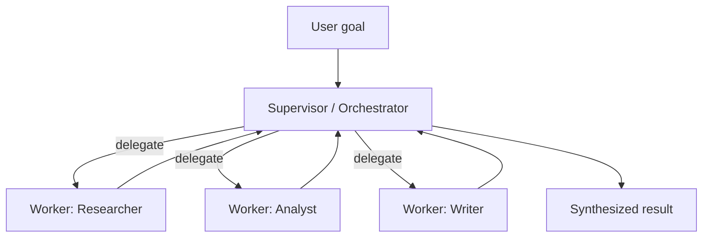
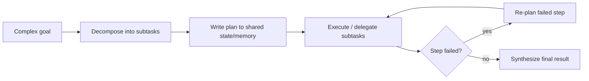

# 5.4 Multi-Agent Systems, Memory & Planning
### Study Notes — Book Style · Generative AI Learning Plan · Phase 5 (Agents & MCP)

> **How to read this file.** This closes Phase 5. **5.1** gave the single-agent loop, **5.2** the frameworks that run it, **5.3** the standard (MCP) for feeding it tools. Here we scale up in three directions: **many agents** working together (supervisor, hierarchical, collaborative, debate), **memory** that outlives a single run (short-term/working vs long-term semantic/episodic, memory stores, and retrieval-backed memory — which is **RAG, 4.x**, pointed inward), and **planning/task decomposition** for long-horizon goals. Because multi-agent systems fail in expensive, cascading ways, we close on **evaluation & observability** (link **3.3**) and **guardrails** (link **2.2.3**). Explanation-forward, current to 2026.
>
> **Sources synthesized:** Anthropic's multi-agent research system write-up (orchestrator-worker, 2025); LangGraph multi-agent & memory docs (supervisor/swarm, short- vs long-term memory, store); CrewAI hierarchical process & AutoGen teams (5.2); Du et al. *Multiagent Debate* (2023); Park et al. *Generative Agents* (memory streams, 2023); the RAG substrate of 4.x and tracing of 3.3.

---

## 5.4.0 Where this fits (the bridge from 5.1–5.3)

A single agent (5.1) hits three ceilings. First, **cognitive load**: one agent juggling many tools and a sprawling context degrades — splitting work across specialists helps. Second, **memory**: the in-run message history is lost when the run ends; real assistants must *remember* across sessions. Third, **horizon**: goals needing dozens of steps benefit from explicit planning rather than pure step-by-step improvisation. This chapter addresses all three — and then, because more agents and more steps mean more ways to fail and more tokens burned, returns to **evaluation, observability, and guardrails** as the price of admission.

> **One-line thesis:** *Scale a single agent by adding coordination (multi-agent topologies), durability (short- and long-term memory, the latter being RAG turned inward), and foresight (planning/decomposition) — but every one of these multiplies cost and failure surface, so observability and guardrails are not optional.*

---

## 5.4.a Multi-Agent Architectures

**Definition.** A **multi-agent system** decomposes a task across several LLM agents, each with its own instructions, tools, and context, coordinated by a topology. The main patterns:

- **Supervisor (orchestrator-worker):** one **lead** agent plans and **delegates** subtasks to specialized workers, then synthesizes their results. The dominant production pattern.
- **Hierarchical:** supervisors of supervisors — a tree for very large tasks (a top orchestrator delegates to mid-level leads that delegate to workers).
- **Collaborative / network:** agents pass work **peer-to-peer** (handoffs, 5.2) without a central boss — flexible but harder to control.
- **Debate:** multiple agents independently answer, then **critique and defend** across rounds, converging on a better/more-reliable answer (Du et al., 2023) — a multi-agent cousin of self-consistency (2.1.2.b).

**Intuition — a consulting firm.** The **supervisor** is the engagement manager: breaks the client problem into pieces, assigns each to a specialist (researcher, analyst, writer), and stitches the deliverable together. Specialists have **focused context** (they don't need the whole problem), which keeps each prompt sharp and cheap. **Debate** is two analysts arguing until they agree — slower, but it catches errors a lone analyst would miss.

**When multi-agent helps (and when it doesn't).** Anthropic's finding: multi-agent shines on **breadth-first, parallelizable** tasks (research across many sources) where subagents explore independently — but it **costs far more tokens** (their system used ~15× a chat) and adds coordination overhead. For tight, sequential, shared-context tasks, a single well-tooled agent is better. Prefer the fewest agents that work.



**Python — a supervisor with LangGraph's prebuilt (build on 5.2):**

```python
# pip install langgraph langgraph-supervisor langchain-openai
from langgraph.prebuilt import create_react_agent
from langgraph_supervisor import create_supervisor
from langchain_openai import ChatOpenAI

llm = ChatOpenAI(model="gpt-5.5")

def web_search(q: str) -> str: return f"results for {q}"
def calculator(expr: str) -> float: return eval(expr, {"__builtins__": {}})

researcher = create_react_agent(llm, tools=[web_search], name="researcher",
                                prompt="You gather facts with web_search.")
analyst = create_react_agent(llm, tools=[calculator], name="analyst",
                             prompt="You compute numbers with the calculator.")

supervisor = create_supervisor(
    agents=[researcher, analyst], model=llm,
    prompt=("You manage a researcher and an analyst. Delegate subtasks, "
            "then synthesize. Stop when the goal is met."),
).compile()

supervisor.invoke({"messages": [{"role": "user",
    "content": "Find competitor prices for wireless earbuds and compute our average gap."}]})
```

---

## 5.4.b Agent Memory: Short-Term, Long-Term, and Retrieval-Backed

**Definition.** **Agent memory** is how state persists so an agent behaves coherently over time. Two tiers:

- **Short-term / working memory:** the current run's context — the message history and scratchpad (5.1). Bounded by the context window; often **summarized or trimmed** as it grows.
- **Long-term memory:** state that survives across sessions, kept in an external **memory store** and *retrieved* when relevant. Three flavors (a useful taxonomy borrowed from cognitive science):
  - **Semantic** — facts about the user/world ("user prefers concise answers," "account tier = gold").
  - **Episodic** — records of past interactions/experiences ("last week we resolved ticket #12 by reshipping").
  - **Procedural** — learned how-to / rules the agent refines over time (often stored as updated instructions).

**Retrieval-backed memory = RAG turned inward (link 4.x).** Long-term memory can't all fit in the prompt, so it's stored (often embedded) and **retrieved by similarity to the current context** — the exact machinery of Phase 4 (embeddings, vector search, 4.1), just pointed at the agent's own history instead of a document corpus. "Remembering" is *retrieving the right past facts/episodes and injecting them into working memory.*

**Intuition.** Working memory is what you're holding in your head right now; long-term memory is your notebook. You don't recite the whole notebook — when a topic comes up, you *look up* the relevant page (retrieval) and bring it to mind (inject into context). Semantic = your address book; episodic = your diary; procedural = your habits and checklists.

**Example.** A returning customer says "same issue as before." The agent embeds the message, retrieves the **episodic** memory of the prior ticket and the **semantic** fact "prefers email over phone," and resolves faster — without the user re-explaining.

**Python — long-term memory as retrieval (LangGraph store):**

```python
from langgraph.store.memory import InMemoryStore
from langchain_openai import OpenAIEmbeddings

store = InMemoryStore(index={"embed": OpenAIEmbeddings(model="text-embedding-3-large"),
                             "dims": 3072})
ns = ("memories", "user-42")                       # per-user namespace

# WRITE a long-term memory (e.g., after a session)
store.put(ns, "pref-1", {"text": "Prefers concise, email-only replies."})
store.put(ns, "ep-12",  {"text": "Resolved damaged-earbuds order by reshipping."})

# RETRIEVE relevant memories for the current turn (semantic search = RAG, 4.1)
hits = store.search(ns, query="my earbuds arrived broken again", limit=3)
recalled = "\n".join(h.value["text"] for h in hits)
# inject `recalled` into the agent's working-memory prompt
```

Managed memory layers (e.g., Mem0, Zep) and framework stores automate the write/summarize/retrieve cycle; conceptually they are all "RAG over the agent's own past."

---

## 5.4.c Planning & Task Decomposition

**Definition.** **Planning** is producing an ordered set of subtasks to reach a goal; **task decomposition** is breaking a complex goal into smaller, solvable units. Beyond the strategies in 5.1 (ReAct, Plan-and-Execute, Reflexion), multi-agent planning adds: the **supervisor decomposes and assigns** subtasks (5.4.a), and long tasks use an explicit **task list / scratchpad** the agent updates as it works (write the plan to memory, check off steps, re-plan on failure).

**Intuition.** Decomposition converts one impossible-in-one-shot goal into a sequence of tractable ones — the **least-to-most** idea (2.1.2.b) at the agent level. Writing the plan **externally** (to state/memory) rather than holding it only in context keeps a long run on-track and lets it survive interruptions (checkpointers, 5.2).

**Example.** Goal: "Prepare a quarterly vendor-risk report." Decomposition → `[list active vendors] → [for each: pull spend + incidents] → [score risk] → [rank] → [write summary]`. The supervisor assigns per-vendor work to workers, writes progress to a shared task list, and re-plans only the vendors whose data fetch failed — not the whole job.



---

## 5.4.d Evaluation, Observability & Guardrails

**Definition.** Because multi-agent + memory + planning systems are **non-deterministic and multi-step**, you must **observe** them (trace every model call, tool call, handoff, and memory read/write — link 3.3) and **evaluate** them (measure task success, not just vibes). Evaluation spans **outcome** (did it achieve the goal?), **trajectory** (were the right tools/steps used?), and **cost/latency**. Guardrails (2.2.3) fence the failure modes.

**Intuition.** A single-agent bug is a straight line to find; a multi-agent bug hides in *which* agent, *which* handoff, *which* retrieved memory. Without end-to-end tracing you're debugging blind. And because agents can loop and delegate, small errors **compound** — so you evaluate the *whole trajectory*, not just the final string.

**Failure modes (the ones interviewers ask about).**

- **Error cascades:** one agent's wrong output becomes another's trusted input, amplifying downstream. Mitigate with validation at each handoff (2.2.3) and a critic/verifier step.
- **Cost blowups:** parallel subagents and long loops multiply tokens (recall the ~15× figure); a runaway can be very expensive. Enforce per-run and per-agent **token/dollar budgets** and step limits (5.1).
- **Coordination failures / deadlock:** agents wait on each other, duplicate work, or loop handing off forever. Cap depth and handoffs; give the supervisor a clear stop condition.
- **Memory poisoning / drift:** a bad fact written to long-term memory is retrieved forever after. Validate writes, timestamp, and allow correction/expiry.
- **Context bloat:** accumulated history/memory overflows the window, degrading quality. Summarize working memory and retrieve *selectively*.

**Guardrails recap (link 2.2.3).** Validate every agent output (Pydantic), **gate irreversible actions** (human-in-the-loop via checkpointers, 5.2), sanitize retrieved/tool content against prompt injection (5.3), and hard-cap loops, depth, time, and cost.

**Finance use cases.**

1. **Supervisor vendor-risk desk:** an orchestrator delegates per-vendor analysis to workers, persists **episodic** memory of prior assessments, and gates the final filing behind a human — every step traced for audit (3.3).
2. **Debate for high-stakes calls:** two agents argue a credit decision and a third adjudicates, reducing single-path errors (2.1.2.b), with a strict token budget.

**E-commerce use cases.**

1. **Personalized support with memory:** the agent retrieves **semantic** preferences and **episodic** past tickets so returning customers skip re-explaining, resolving faster; refunds stay gated.
2. **Parallel research for merchandising:** subagents scan competitors, reviews, and trends in parallel under a supervisor to draft a category plan — accepting higher token cost for breadth and speed.

---

## 5.4.e Common Pitfalls

- **Multi-agent when one agent suffices.** The most expensive mistake: coordination overhead and ~10–15× token cost for a task a single well-tooled agent handles. Add agents only for parallelizable breadth.
- **No trajectory evaluation.** Judging only the final answer hides broken handoffs and wasted steps; evaluate the whole trace (3.3).
- **Unbounded cost.** Parallel subagents + loops can blow budgets fast; enforce per-agent and per-run token/$ caps and step limits (5.1).
- **Error cascades.** Passing an unverified output as trusted input downstream — validate at every handoff (2.2.3) and add a verifier.
- **Dumping everything into memory.** Storing all history unfiltered bloats context and poisons retrieval; write selectively, summarize, timestamp, and allow correction/expiry.
- **Confusing working and long-term memory.** In-run context is not persistence; long-term memory needs an external store and retrieval (RAG, 4.x).
- **Retrieving too much / too little memory.** Over-retrieval bloats context; under-retrieval forgets. Tune top-k and use recency + relevance.
- **Ungated actions across agents.** More agents means more surfaces for an ungated refund/send/delete — keep human-in-the-loop for irreversible actions (2.2.3).
- **No stop condition for the supervisor.** Without a clear "done," orchestrators loop or over-delegate; define termination explicitly.

---

# Wrap-Up: 5.4 Multi-Agent Systems, Memory & Planning

## The through-line (backward and forward)

We scaled the single-agent loop (5.1) in three directions. **Multi-agent topologies** — supervisor/orchestrator-worker (the workhorse), hierarchical, collaborative, and debate — split cognitive load across specialists, best on parallelizable breadth but at a real token premium. **Memory** gives durability: short-term working memory (the in-run context of 5.1) plus long-term semantic/episodic/procedural memory in an external store, *retrieved by similarity* — which is **RAG (4.x) pointed inward**. **Planning/decomposition** extends the strategies of 5.1 to long horizons, writing plans to shared state so runs stay on-track and resumable (checkpointers, 5.2). Because all of this multiplies non-determinism and cost, it closes the loop back to **observability (3.3)** and **guardrails (2.2.3)**: trace everything, evaluate trajectories not just outputs, and hard-cap loops, depth, cost, and irreversible actions. That is the whole arc of Phase 5 — from a single ReAct loop (built on 2.1.2) to governed multi-agent systems that plug into standardized tools (5.3) and remember what matters.

## Quick reference

| Concept | Key point |
|---|---|
| Supervisor / orchestrator-worker | Lead plans, delegates to workers, synthesizes; the default pattern |
| Hierarchical | Supervisors of supervisors for very large tasks |
| Collaborative / debate | Peer handoffs / multi-round critique for reliability |
| Working (short-term) memory | In-run context; summarize/trim as it grows |
| Long-term memory | External store; semantic / episodic / procedural |
| Retrieval-backed memory | "Remembering" = RAG over the agent's own past (4.x) |
| Planning / decomposition | Break goal into subtasks; write plan externally; re-plan on failure |
| Failure modes | Error cascades, cost blowups, deadlock, memory poisoning, context bloat |
| Guardrails | Validate handoffs, gate actions, cap loops/depth/cost, sanitize inputs |

## Interview Questions & Answers

1. **What is the supervisor / orchestrator-worker pattern?** A lead agent plans and delegates subtasks to specialized workers, then synthesizes their outputs.
2. **When does multi-agent beat a single agent?** On breadth-first, parallelizable tasks (e.g., research across many sources); not on tight sequential shared-context work.
3. **What's the main cost of multi-agent systems?** Far higher token usage (often ~10–15×) plus coordination overhead.
4. **What is multi-agent debate?** Agents independently answer then critique/defend across rounds to converge on a more reliable answer — a cousin of self-consistency.
5. **Short-term vs long-term memory?** Short-term is the in-run context (bounded by the window); long-term persists across sessions in an external store, retrieved when relevant.
6. **Name the long-term memory types.** Semantic (facts), episodic (past experiences), procedural (learned how-to/rules).
7. **How is agent memory related to RAG?** Retrieval-backed memory embeds and retrieves past facts/episodes by similarity — RAG (4.x) applied to the agent's own history.
8. **What is task decomposition and why write the plan externally?** Breaking a goal into subtasks; writing it to shared state/memory keeps long runs on-track and resumable.
9. **What is an error cascade and how do you prevent it?** One agent's wrong output corrupts a downstream agent; prevent with validation at each handoff and a verifier step.
10. **How do you control multi-agent cost?** Per-agent and per-run token/$ budgets, step/depth/handoff caps, fewer agents, cheaper worker models.
11. **What is memory poisoning?** A bad fact written to long-term memory that keeps getting retrieved; mitigate by validating writes, timestamping, and allowing correction/expiry.
12. **Why evaluate the trajectory, not just the final output?** Multi-step, multi-agent errors hide in tool/handoff choices; outcome-only evaluation misses broken paths — trace and score the whole run (3.3).
13. **How do you keep working memory from overflowing?** Summarize/trim history and retrieve long-term memory selectively (tuned top-k, recency + relevance).
14. **What guardrails matter most at multi-agent scale?** Output validation at handoffs, action gating/human-in-the-loop for irreversible steps, input sanitization (prompt injection), and hard caps on loops/depth/cost.

## Mini glossary

**Supervisor / orchestrator-worker** — lead delegates to workers, then synthesizes.
**Hierarchical** — nested supervisors.
**Debate** — multi-agent critique-and-converge.
**Working memory** — in-run context (short-term).
**Long-term memory** — persisted, retrieved cross-session state.
**Semantic / episodic / procedural** — facts / experiences / learned how-to.
**Memory store** — external (often vector) store of memories.
**Task decomposition** — splitting a goal into subtasks.
**Error cascade** — amplified downstream failure from a bad upstream output.
**Trajectory evaluation** — scoring the full sequence of steps, not just the answer.

## Further reading

- Anthropic, *How we built our multi-agent research system* (orchestrator-worker; cost/coordination lessons).
- LangGraph docs — multi-agent (supervisor/swarm), short- vs long-term memory, the `Store`.
- Du et al., *Improving Factuality and Reasoning via Multiagent Debate* (2023); Park et al., *Generative Agents* (memory streams, 2023).
- Managed memory layers (Mem0, Zep); revisit 2.1.2.b (self-consistency/least-to-most), 4.x (RAG), 3.3 (tracing/eval), 2.2.3 (guardrails).

---

*Previous ← **5.3 Model Context Protocol (MCP)** — the standardized tools these agents consume.*
*Next → **Phase 6 (Fine-tuning)** — when prompting, tools, and retrieval aren't enough, adapt the model's weights.*
