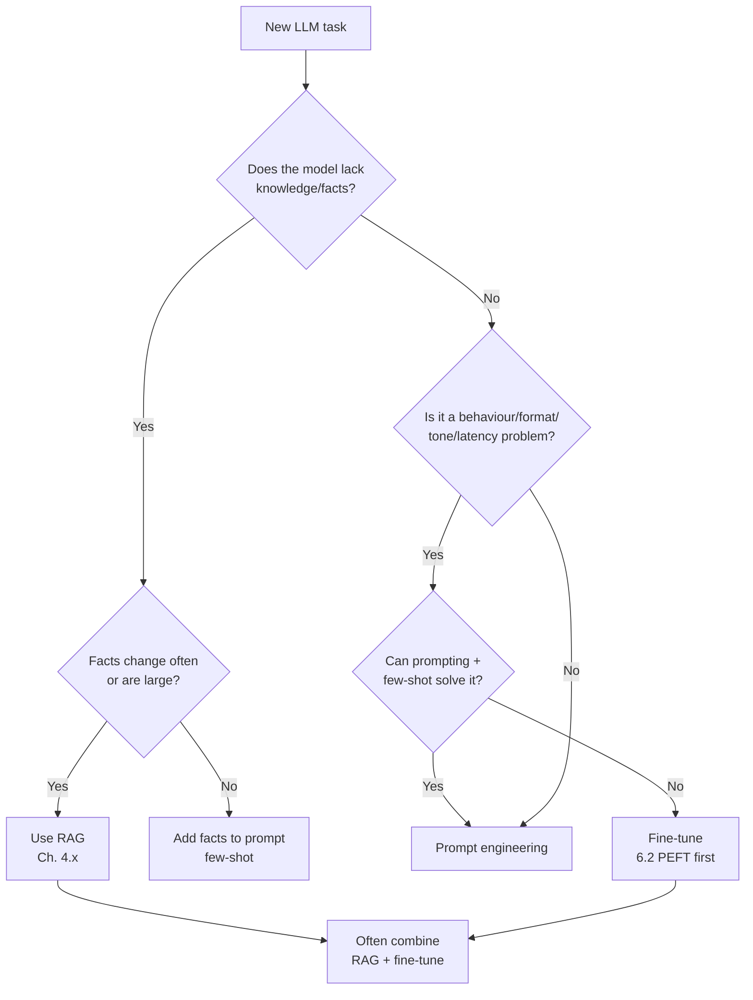
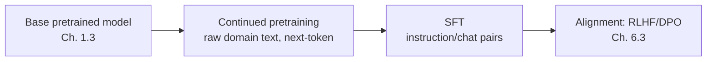

# 6.1 When to Fine-Tune & Full Fine-Tuning

### Study Notes — Book Style · Generative AI Learning Plan · Phase 6 (Fine-tuning & Adaptation)

> **How to read this file.** This chapter opens Phase 6 by answering the question that should precede every fine-tuning project: *should you fine-tune at all?* We build a decision framework that sits directly on top of the prompt-engineering and RAG material (Chapter 4.x) and the training-lifecycle overview (Chapter 1.3, which introduces pretraining → SFT → RLHF/DPO at a conceptual level). Where 1.3 gives you the map, this chapter gives you the terrain: what *full* fine-tuning actually costs, when continued pretraining differs from supervised fine-tuning, why models forget, and when writing a large check for a full-parameter update is genuinely worth it. The parameter-efficient alternatives that make fine-tuning affordable are in 6.2; alignment methods in 6.3; compression in 6.4; and data/evaluation discipline in 6.5.
>
> **Sources synthesized:** HuggingFace Transformers & TRL documentation (2024–2026); OpenAI and Together AI fine-tuning guides; the InstructGPT and "LIMA: Less Is More for Alignment" papers; DeepSpeed/FSDP engineering docs; and industry post-mortems on catastrophic forgetting.

---

## 6.1.1 The decision framework: prompt vs. RAG vs. fine-tune

**Definition.** Adapting an LLM's behaviour to your problem can happen at three layers. *Prompting* changes the input (instructions, few-shot examples). *Retrieval-augmented generation (RAG)* changes the context by injecting external knowledge at inference time (Chapter 4.x). *Fine-tuning* changes the weights themselves via gradient updates.

**Intuition.** Think of a new hire. Prompting is giving them clear instructions for one task. RAG is handing them a searchable company wiki so they can look up facts they never memorized. Fine-tuning is sending them to a multi-week training course that rewires their instincts. You reach for the course last, because it is the slowest and most expensive to run and to update.

The single most important heuristic: **fine-tuning teaches *behaviour and form*; RAG supplies *knowledge and facts*.** If your problem is "the model doesn't *know* our Q3 policy," that is a knowledge gap — use RAG. If your problem is "the model knows the facts but won't produce them in our exact JSON schema / house tone / classification taxonomy," that is a behaviour gap — fine-tuning shines.

**Worked example.** A support team wants a bot that (a) answers using the latest product docs and (b) always responds in a terse, numbered, brand-approved style. The *correct* architecture is usually **both**: fine-tune a small model to lock the style and output format, and use RAG to feed it fresh documentation. Choosing only one leaves either stale answers or off-brand ones.



A practical ordering, cheapest first: **prompt → few-shot → RAG → PEFT fine-tune (6.2) → full fine-tune.** Only descend when the tier above provably fails on your evals (6.5, 8.x).

---

## 6.1.2 What "full fine-tuning" actually means

**Definition.** *Full fine-tuning* (full-parameter, or "full FT") updates **every weight** in the model via backpropagation on your dataset, producing a new complete copy of the model.

**Intuition.** Contrast this with PEFT/LoRA (6.2), where you freeze the base model and train a tiny set of new parameters. Full FT has no such restraint — all billions of parameters move. That gives maximum expressive power and maximum risk: more capacity to learn your task, more capacity to *unlearn* general capabilities and to overfit.

**Example.** Fine-tuning a 7B-parameter model in full precision (BF16) requires, per the standard optimizer-state accounting for Adam:

- Weights: 7B × 2 bytes ≈ 14 GB
- Gradients: 7B × 2 bytes ≈ 14 GB
- Adam optimizer states (m and v, typically FP32): 7B × 8 bytes ≈ 56 GB
- Activations: variable, often tens of GB depending on batch/sequence length

That is **~84 GB before activations** — already beyond a single 80 GB A100/H100, so full FT of even a "small" 7B model needs multi-GPU sharding (DeepSpeed ZeRO-3 or PyTorch FSDP). For a 70B model you are into a multi-node cluster. This memory math is precisely why 6.2's parameter-efficient methods dominate practice.

---

## 6.1.3 Continued pretraining vs. supervised fine-tuning (SFT)

**Definition.** *Continued (or "continual") pretraining* keeps training the base model with the same **self-supervised next-token objective** on large amounts of *unlabelled domain text*. *Supervised fine-tuning (SFT)* trains on **labelled input→output pairs** (instructions, chats) to teach task behaviour. (SFT was introduced in 1.3 as step 2 of the lifecycle.)

**Intuition.** Continued pretraining shifts the model's *distribution* — it teaches vocabulary, idioms, and latent domain structure (legal jargon, ICD-10 codes, Solidity syntax). SFT shapes *how the model responds* to instructions. Continued pretraining is a blunt instrument for "the model doesn't speak our dialect"; SFT is a precise instrument for "the model should answer requests this way."

**Example.** A biomedical firm takes Llama-3-8B, runs **continued pretraining** on 20B tokens of clinical literature (raw text, no labels) so the model internalizes medical terminology, then runs **SFT** on 15k curated question–answer pairs so it answers clinician queries in the desired format. Order matters: distribution first, behaviour second.



In 2026, most teams **skip continued pretraining** — it needs huge data and compute, and modern base models already cover most domains adequately. It is reserved for genuinely low-resource languages or highly specialized token distributions.

---

## 6.1.4 Catastrophic forgetting

**Definition.** *Catastrophic forgetting* is the tendency of a neural network, when trained on new data, to overwrite parameters encoding previously learned skills — so a model fine-tuned on your niche task gets *worse* at general reasoning, other languages, or instruction-following.

**Intuition.** Gradient descent has no loyalty to old knowledge; it only minimizes loss on the current batch. If your fine-tuning set is narrow (e.g., 2,000 near-identical classification examples), the optimizer happily degrades unrelated abilities to squeeze out a fraction of a point on your loss.

**Example & mitigations.** A team full-fine-tunes a chat model purely on terse SQL-generation pairs; afterwards it emits SQL even when asked "how are you?" Mitigations:

- **Prefer PEFT (6.2):** freezing the base by construction preserves most general knowledge — the single biggest reason LoRA won.
- **Lower learning rate & fewer epochs:** full FT typically uses tiny LRs (1e-6 to 2e-5) and 1–3 epochs.
- **Mix in general/instruction data** (a "replay" buffer) so the model keeps practising broad skills.
- **Regularization** such as freezing lower layers or adding a KL penalty to the base model (the same idea RLHF uses in 6.3).
- **Regression-test** general benchmarks before/after (6.5, 8.x) — never ship on task metrics alone.

---

## 6.1.5 Compute, cost, and data requirements

**Definition.** The resource envelope of full FT = (dataset size) × (epochs) × (per-token cost driven by model size and GPU type), plus engineering time for distributed training.

**Intuition & numbers.**

- **Data:** Quality beats quantity (the LIMA finding: ~1,000 high-quality examples can produce strong instruction-following). Practical SFT ranges from a few thousand to a few hundred thousand examples. Data cleaning usually dominates the timeline (6.5).
- **Compute:** Full FT of a 7B model on tens of thousands of examples is typically a multi-GPU, multi-hour-to-day job on A100/H100 nodes. LoRA on the same data can run on **a single consumer GPU** in a fraction of the time (6.2).
- **Cost shape:** Beyond the GPU bill, full FT gives you a **full-size model to host** — you pay serving cost for a dedicated deployment, whereas many adapters can share one base at inference (6.2, 9.2).

**Example.** Estimating GPU-hours: a rough planning formula is `tokens_processed ≈ dataset_tokens × epochs`; divide by your stack's measured tokens/sec/GPU and by GPU count to get wall-clock. Always run a **1% pilot** to measure throughput before committing budget.

---

## 6.1.6 When full fine-tuning is (rarely) worth it

Full FT earns its cost only when *all* the cheaper tiers demonstrably fail. Signals it may be justified:

- You need to **deeply change the model's distribution** (new language, new modality bridge, heavy domain jargon) — beyond what adapters can absorb.
- You have **abundant high-quality data** (hundreds of thousands of examples) so overfitting risk is low and the extra capacity is used.
- **Latency/throughput at scale** matters enough that a smaller, fully-specialized model beats a large general one — and the volume amortizes the training cost.
- Benchmarks show **LoRA/QLoRA saturating below your quality bar** despite good data and tuning.

In the vast majority of 2026 projects, **PEFT (6.2) matches full FT quality** at a small fraction of the cost, which is why full FT is now the exception, not the default.

---

## 6.1.7 Managed fine-tuning vs. self-hosted

**Definition.** *Managed* fine-tuning (OpenAI, Google, Together AI, Fireworks, AWS Bedrock) hides the infrastructure: you upload a JSONL dataset, pick a base model and hyperparameters, and receive a hosted endpoint. *Self-hosted* means you run the training (HuggingFace + PEFT/TRL) on your own or rented GPUs and deploy the weights yourself.

**Intuition.** Managed = speed and simplicity, less control, per-token pricing, and (for closed models) no access to weights. Self-hosted = full control, portability, one-time compute cost, ability to use open weights and any technique in this chapter — at the price of MLOps burden.

**Worked example (managed, OpenAI-style JSONL):**

```python
# Managed path: upload a chat-format JSONL and launch a job.
from openai import OpenAI
client = OpenAI()

# 1) Upload data (each line = one chat example; see 6.5 for format details)
train_file = client.files.create(
    file=open("support_sft.jsonl", "rb"),
    purpose="fine-tune",
)

# 2) Launch the fine-tune job
job = client.fine_tuning.jobs.create(
    training_file=train_file.id,
    model="gpt-4.1-mini-2025",           # a supported base
    hyperparameters={"n_epochs": 3},
)
print(job.id, job.status)

# 3) Poll; on success you get a model id like "ft:gpt-4.1-mini:acme:support:abc123"
```

**Worked example (self-hosted, full FT sketch):** full-parameter training uses the standard HuggingFace `Trainer`/`SFTTrainer` (detailed in 6.2 for the PEFT variant) with a distributed backend:

```python
# Self-hosted full FT typically needs DeepSpeed ZeRO-3 or FSDP for memory.
# launch: accelerate launch --config_file zero3.yaml train_full_ft.py
from transformers import AutoModelForCausalLM, AutoTokenizer, TrainingArguments
from trl import SFTTrainer

model_id = "meta-llama/Meta-Llama-3-8B-Instruct"
model = AutoModelForCausalLM.from_pretrained(model_id)   # ALL params trainable
tok = AutoTokenizer.from_pretrained(model_id)

args = TrainingArguments(
    output_dir="out-fullft",
    per_device_train_batch_size=1,
    gradient_accumulation_steps=16,
    learning_rate=1e-5,          # small LR guards against forgetting (6.1.4)
    num_train_epochs=2,
    bf16=True,
    gradient_checkpointing=True, # trade compute for activation memory
)
trainer = SFTTrainer(model=model, args=args, train_dataset=train_ds, processing_class=tok)
trainer.train()
```

**Rule of thumb (2026):** start managed to validate that fine-tuning *helps at all*; move self-hosted when you need open weights, data residency, cost control at high volume, or techniques (QLoRA, DPO, custom quantization) the managed provider doesn't expose.

---

## 6.1.8 Industry use cases

**Finance.** A bank fine-tunes a model to convert analyst notes into a **strict structured risk-summary schema** (fields, enumerated risk levels, mandated disclaimers). This is a *behaviour/format* problem, so a **LoRA SFT (6.2)** on a few thousand annotated notes locks the format; **RAG (4.x)** supplies the live figures. Full FT is avoided because the knowledge is dynamic. A second team does **continued pretraining** on decades of filings to teach a base model regulatory dialect before SFT — a rare case where the domain distribution genuinely differs.

**E-commerce.** A marketplace fine-tunes a small model to generate **on-brand product descriptions and to classify listings into a 3,000-node category taxonomy**. Prompting alone can't hold 3,000 categories reliably, and RAG doesn't fix tone — so SFT on historical human-written descriptions is the right tool. Because inference volume is enormous (millions of listings), a **specialized small fine-tuned model** beats calling a large general model on latency and cost, one of the clearest cases where fine-tuning (even approaching full FT for the classifier head) pays off.

---

## 6.1.9 Common pitfalls

- **Fine-tuning to inject facts.** The classic mistake: teams fine-tune to "add knowledge," get hallucinations and stale answers, and should have used RAG (4.x). Fine-tuning is unreliable and expensive for knowledge that changes.
- **Skipping the cheaper tiers.** Jumping to full FT before exhausting prompting/few-shot/RAG/PEFT wastes budget and time.
- **Ignoring catastrophic forgetting.** Measuring only task accuracy hides degraded general ability. Always regression-test (6.5, 8.x).
- **Under-budgeting data work.** Cleaning/dedup/formatting (6.5) is the real cost; garbage data yields a confidently wrong model.
- **Full FT by default.** Reaching for full-parameter training when LoRA/QLoRA would match quality at a fraction of the cost.
- **No pilot run.** Committing full budget before measuring throughput and validating that fine-tuning moves your metric on a small slice.
- **Vendor lock-in blindness.** Managed fine-tunes of closed models can't be exported; factor portability into the buy-vs-build decision early.

---

## Wrap-Up

**Through-line.** Chapter 1.3 mapped the training lifecycle; this chapter turned that map into a *decision*: climb the ladder prompt → RAG → PEFT → full FT, and only pay for each rung when the one below provably fails. We established what full fine-tuning costs (the optimizer-state memory math), how continued pretraining differs from SFT, why models forget, and the narrow band where full FT wins. Everything that follows makes fine-tuning *practical*: 6.2 shows how LoRA/QLoRA collapse the compute cost that made full FT prohibitive here; 6.3 goes deep on alignment (RLHF/DPO) hinted at in 1.3; 6.4 compresses the result for deployment; and 6.5 supplies the data and evaluation discipline that decides whether any of it worked.

**Quick reference.**

| Situation | Best tool | Chapter |
|---|---|---|
| Missing / changing facts | RAG | 4.x |
| One-off behaviour tweak | Prompt / few-shot | 4.x |
| Fixed output format, tone, taxonomy | PEFT (LoRA) SFT | 6.2 |
| New language / heavy domain dialect | Continued pretraining → SFT | 6.1.3 |
| Preference alignment / safety | RLHF / DPO | 6.3 |
| Validate FT helps at all, fast | Managed fine-tuning | 6.1.7 |
| Open weights, data residency, high volume | Self-hosted | 6.1.7 |

**Interview questions & answers.**

1. **Q:** When should you fine-tune instead of using RAG? **A:** When the gap is behaviour/format/tone/latency, not knowledge. RAG for facts that change or are large; fine-tuning for how the model responds.
2. **Q:** What is catastrophic forgetting and one mitigation? **A:** Overwriting general skills while learning a narrow task; mitigate with PEFT, low LR/few epochs, data replay, or regression tests.
3. **Q:** Why does full FT of a 7B model need >80 GB? **A:** Adam optimizer states (~8 bytes/param) plus weights and gradients (~4 bytes/param) already reach ~84 GB before activations.
4. **Q:** Continued pretraining vs. SFT? **A:** Continued pretraining is self-supervised next-token on raw domain text (shifts distribution); SFT is supervised on input→output pairs (shapes behaviour).
5. **Q:** Give a case where full FT beats LoRA. **A:** A deep distribution shift (new language) with abundant data and high inference volume that amortizes cost, where LoRA saturates below the quality bar.
6. **Q:** Why is fine-tuning a poor way to add facts? **A:** Weights are expensive to update, facts go stale, and the model hallucinates rather than reliably recalling; RAG keeps knowledge fresh and inspectable.
7. **Q:** Managed vs. self-hosted trade-offs? **A:** Managed = fast, simple, per-token, no weight access; self-hosted = full control, portability, open techniques, but MLOps burden.
8. **Q:** Typical full-FT learning rate and epochs? **A:** Small LR (1e-6–2e-5) and 1–3 epochs to limit forgetting and overfitting.
9. **Q:** How do you decide when to stop climbing the adaptation ladder? **A:** Stop at the first tier that clears your eval bar (6.5/8.x) on held-out data at acceptable cost.
10. **Q:** Why run a pilot before a full fine-tune? **A:** To measure tokens/sec throughput, verify the metric moves, and estimate GPU-hours/cost before committing budget.
11. **Q:** What does LIMA suggest about data volume? **A:** That ~1,000 high-quality, diverse examples can produce strong instruction-following — quality over quantity.

**Mini-glossary.** *Full fine-tuning:* updating all weights. *Continued pretraining:* more self-supervised training on domain text. *SFT:* supervised instruction/chat fine-tuning. *Catastrophic forgetting:* loss of prior skills during new training. *Managed fine-tuning:* provider-hosted training + endpoint. *Replay:* mixing general data to preserve broad ability. *ZeRO-3/FSDP:* memory-sharding backends for large-model training.

**Further reading.** InstructGPT (Ouyang et al., 2022); "LIMA: Less Is More for Alignment" (2023); HuggingFace TRL & Transformers docs; DeepSpeed ZeRO and PyTorch FSDP guides; OpenAI and Together AI fine-tuning documentation. Continue to **6.2** for the parameter-efficient methods that make all of this affordable.
