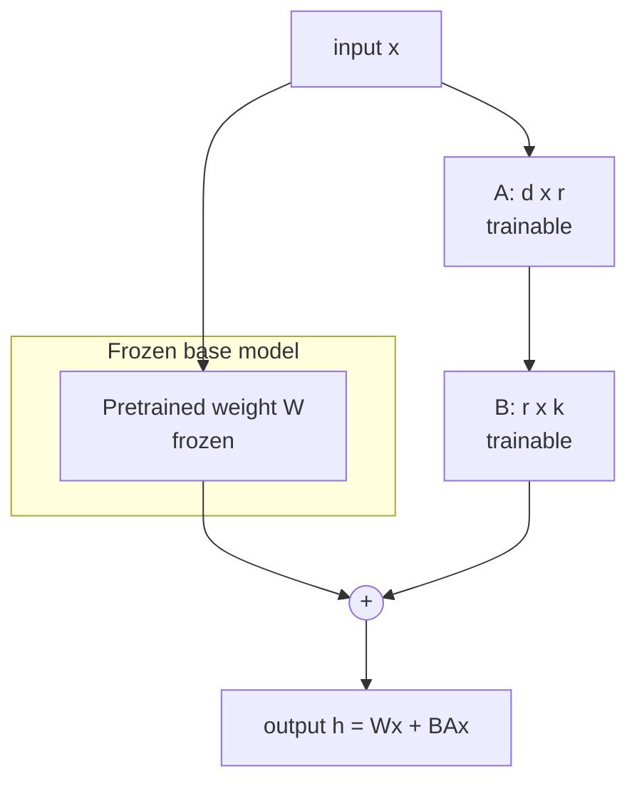
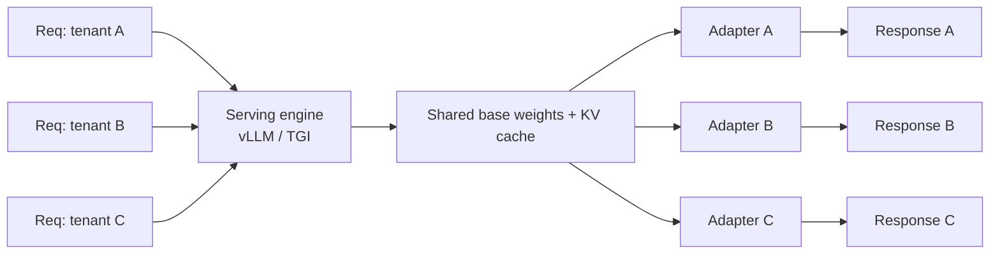

# 6.2 PEFT, LoRA & QLoRA

### Study Notes — Book Style · Generative AI Learning Plan · Phase 6 (Fine-tuning & Adaptation)

> **How to read this file.** This is the workhorse chapter of Phase 6. In 6.1 we established *when* to fine-tune and why full-parameter training is usually the wrong default — the memory math alone (optimizer states dwarfing the weights) rules it out for most teams. Here we solve that problem with **parameter-efficient fine-tuning (PEFT)**: LoRA and its 4-bit sibling QLoRA, which turn "needs a multi-GPU cluster" into "runs on one consumer card." We cover the low-rank idea, the rank/alpha/target-module knobs, the quantization trick behind QLoRA, adapter merging and multi-adapter serving, and give runnable HuggingFace `peft` + `trl` code. Alignment training (6.3) reuses this exact adapter machinery; quantization for *inference* is generalized in 6.4; the serving of many adapters links to 9.2; and the data/eval discipline is in 6.5.
>
> **Sources synthesized:** Hu et al. "LoRA" (2021); Dettmers et al. "QLoRA" (2023); HuggingFace `peft`, `trl`, and `bitsandbytes` documentation (2024–2026); Unsloth and Axolotl project docs; and vLLM/TGI multi-adapter serving guides.

---

## 6.2.1 Parameter-efficient fine-tuning (PEFT)

**Definition.** *PEFT* is a family of methods that adapt a large model by training a **small number of new or selected parameters while freezing the pretrained weights**. Variants include LoRA, prefix/prompt tuning, (IA)³, and adapters.

**Intuition.** A pretrained model already contains vast general capability; your task usually requires only a small *nudge* to that behaviour. Instead of re-estimating billions of parameters, PEFT asks: what is the smallest set of new parameters that expresses that nudge? Because the base is frozen, PEFT is cheap, fast, and — crucially — largely immune to the catastrophic forgetting we worried about in 6.1.4.

**Example.** For a 7B model, LoRA might train ~4M parameters (≈0.06% of the model). You store and ship that 4M-parameter *adapter* (a few MB) instead of a 14 GB model copy — the shift that made fine-tuning mainstream.



---

## 6.2.2 LoRA: low-rank adapters

**Definition.** *LoRA (Low-Rank Adaptation)* freezes a weight matrix `W` and learns its update as a **low-rank product**: `ΔW = B·A`, where `A ∈ ℝ^{r×k}`, `B ∈ ℝ^{d×r}`, and the rank `r ≪ min(d,k)`. The forward pass becomes `h = Wx + (α/r)·B·A·x`. Only `A` and `B` train; `W` never moves.

**Intuition.** The insight (from the LoRA paper) is that the *change* a task induces in the weights has low "intrinsic rank" — it lives in a small subspace. A full `d×k` update is wasteful; a rank-`r` factorization captures nearly all of it with orders of magnitude fewer parameters. `A` is initialized random, `B` initialized to zero, so at step 0 the adapter is a no-op and training starts exactly from the base model.

**Key knobs.**

- **`r` (rank):** capacity of the adapter. Common values 8–64. Higher `r` = more expressive but more params and more overfitting risk. 16 is a strong default.
- **`alpha` (scaling):** the update is scaled by `α/r`. A common convention is `alpha = 2·r` (or `alpha = r`). Raising alpha amplifies the adapter's influence; think of it as an effective learning-rate multiplier for the adapter.
- **`target_modules`:** which layers get adapters. Attention projections (`q_proj`, `k_proj`, `v_proj`, `o_proj`) are the classic targets; adding the MLP projections (`gate_proj`, `up_proj`, `down_proj`) — i.e., "all-linear" — often improves quality at modest extra cost and is now the common recommendation.
- **`lora_dropout`:** small dropout (0.05) on the adapter input for regularization.

**Worked example (peft + trl SFTTrainer):**

```python
from datasets import load_dataset
from transformers import AutoModelForCausalLM, AutoTokenizer
from peft import LoraConfig
from trl import SFTTrainer, SFTConfig

model_id = "meta-llama/Meta-Llama-3-8B-Instruct"
tok = AutoTokenizer.from_pretrained(model_id)
model = AutoModelForCausalLM.from_pretrained(model_id, torch_dtype="bfloat16")

lora = LoraConfig(
    r=16,
    lora_alpha=32,                 # alpha = 2r convention
    lora_dropout=0.05,
    bias="none",
    task_type="CAUSAL_LM",
    target_modules="all-linear",   # attention + MLP projections
)

ds = load_dataset("json", data_files="support_sft.jsonl", split="train")  # chat format, see 6.5

cfg = SFTConfig(
    output_dir="out-lora",
    num_train_epochs=3,
    per_device_train_batch_size=4,
    gradient_accumulation_steps=4,
    learning_rate=2e-4,            # LoRA tolerates larger LR than full FT
    bf16=True,
    logging_steps=10,
)

trainer = SFTTrainer(
    model=model,
    args=cfg,
    train_dataset=ds,
    peft_config=lora,              # trl attaches the adapter for you
    processing_class=tok,
)
trainer.train()
trainer.save_model("out-lora")     # saves only the small adapter
```

Note the learning rate: LoRA commonly uses **1e-4 to 3e-4**, roughly 10× higher than full FT (6.1), because only the small adapter is learning.

---

## 6.2.3 QLoRA: 4-bit base + LoRA on top

**Definition.** *QLoRA* loads the frozen base model in **4-bit precision** (the NF4 "NormalFloat" data type) and trains LoRA adapters in higher precision (BF16) on top, with gradients flowing through the dequantized weights. It adds two tricks: **double quantization** (quantizing the quantization constants) and **paged optimizers** (spilling optimizer state to CPU on memory spikes).

**Intuition.** The base model dominates memory. If we can store it in 4 bits instead of 16, we cut base memory ~4×, freeing a single 24 GB GPU to fine-tune a model that full FT couldn't touch. NF4 is information-theoretically tuned for the roughly-normal distribution of neural network weights, so the accuracy loss is small — the QLoRA paper showed it matches 16-bit LoRA quality on many tasks. The base stays frozen and quantized; only the tiny BF16 adapter trains, so we never need high-precision optimizer states for the whole model.

**Memory math (7B model, ballpark).**

| Approach | Base weights | Optimizer/grad | Fits on |
|---|---|---|---|
| Full FT (BF16, Adam) | ~14 GB | ~70 GB | multi-GPU |
| LoRA (BF16 base) | ~14 GB | ~0.1 GB (adapter only) | 1×24–48 GB |
| QLoRA (NF4 base) | ~4 GB | ~0.1 GB (adapter only) | 1×16–24 GB |

**Worked example (QLoRA with bitsandbytes):**

```python
import torch
from transformers import AutoModelForCausalLM, AutoTokenizer, BitsAndBytesConfig
from peft import LoraConfig, prepare_model_for_kbit_training
from trl import SFTTrainer, SFTConfig

model_id = "meta-llama/Meta-Llama-3-8B-Instruct"

bnb = BitsAndBytesConfig(
    load_in_4bit=True,
    bnb_4bit_quant_type="nf4",             # NormalFloat4
    bnb_4bit_use_double_quant=True,        # double quantization
    bnb_4bit_compute_dtype=torch.bfloat16, # compute in bf16
)

tok = AutoTokenizer.from_pretrained(model_id)
model = AutoModelForCausalLM.from_pretrained(model_id, quantization_config=bnb, device_map="auto")
model = prepare_model_for_kbit_training(model)   # enables grad checkpointing, casts norms

lora = LoraConfig(r=16, lora_alpha=32, lora_dropout=0.05,
                  bias="none", task_type="CAUSAL_LM", target_modules="all-linear")

cfg = SFTConfig(output_dir="out-qlora", num_train_epochs=3,
                per_device_train_batch_size=2, gradient_accumulation_steps=8,
                learning_rate=2e-4, bf16=True,
                optim="paged_adamw_8bit")        # paged optimizer

trainer = SFTTrainer(model=model, args=cfg, train_dataset=ds,
                     peft_config=lora, processing_class=tok)
trainer.train()
```

---

## 6.2.4 Merging adapters and serving many at once

**Definition.** After training you can either (a) **keep the adapter separate** and load it at inference on top of the base, or (b) **merge** it: compute `W' = W + (α/r)·B·A` once, producing a standard model with no runtime overhead.

**Intuition.** Merging bakes the adapter into the weights — zero added latency, but you lose the ability to swap adapters and you commit to that base precision. Keeping adapters separate enables the killer PEFT deployment pattern: **one base model in GPU memory, many small adapters swapped or batched per request.**

**Merging example:**

```python
from peft import PeftModel
from transformers import AutoModelForCausalLM

base = AutoModelForCausalLM.from_pretrained(model_id, torch_dtype="bfloat16")
merged = PeftModel.from_pretrained(base, "out-lora").merge_and_unload()
merged.save_pretrained("llama3-support-merged")   # a normal HF model
```

**Multi-adapter serving.** Because adapters are tiny, a single served base can host dozens. Serving stacks like **vLLM** and **TGI** support **multi-LoRA** with techniques such as S-LoRA/Punica-style batched adapter kernels — routing each request to its tenant's adapter while sharing the base weights and KV cache. This is transformative economics for multi-tenant products (details in 9.2).



---

## 6.2.5 Tooling: Unsloth and Axolotl

**Definition.** *Unsloth* is a library of hand-optimized Triton kernels that speeds up LoRA/QLoRA training (roughly 2× faster, ~50–70% less memory) with a drop-in HuggingFace-compatible API. *Axolotl* is a YAML-configured wrapper over the HuggingFace/PEFT/TRL stack that standardizes recipes (dataset formats, LoRA/QLoRA/full FT, DPO) so you launch runs from a config file.

**Intuition.** These do not change the *method* — they remove boilerplate and squeeze the hardware. Unsloth is the fast path for single-GPU experimentation; Axolotl is the reproducible-config path teams use to version and share training recipes.

**Example (Axolotl config sketch):**

```yaml
base_model: meta-llama/Meta-Llama-3-8B-Instruct
adapter: qlora
load_in_4bit: true
lora_r: 16
lora_alpha: 32
lora_target_linear: true
datasets:
  - path: support_sft.jsonl
    type: chat_template
num_epochs: 3
learning_rate: 0.0002
```

---

## 6.2.6 Industry use cases

**Finance.** A wealth platform serves 40 advisory firms from **one base model plus 40 QLoRA adapters**, each capturing a firm's tone and compliance disclaimers. Training each adapter costs a few GPU-hours; serving them together via vLLM multi-LoRA means one GPU fleet instead of 40 deployments — a direct cost collapse enabled by 6.2.4. RAG (4.x) still supplies live market data; the adapter only owns style and format.

**E-commerce.** A retailer QLoRA-fine-tunes a 8B model on 30k human-written product blurbs to match brand voice, running the whole job overnight on a single 24 GB GPU — impossible under full FT (6.1). They then **merge** the adapter for the highest-throughput serving path, since only one brand voice is needed in that product surface, trading swap-ability for zero adapter overhead.

---

## 6.2.7 Common pitfalls

- **Rank too high "for safety."** Large `r` (e.g., 256) adds params and invites overfitting on small datasets without quality gains; start at 16 and raise only if evals plateau.
- **Wrong `target_modules`.** Adapting only `q_proj`/`v_proj` sometimes underfits; "all-linear" is a better default for instruction tasks. Names differ per architecture — inspect the model.
- **alpha/r confusion.** Changing `r` without adjusting `alpha` silently changes the effective update scale; keep the `alpha = 2r` (or `= r`) convention consistent.
- **Merging a QLoRA adapter into a 4-bit base.** Merge into a **de-quantized (16-bit) base**, then optionally re-quantize for inference (6.4); merging into 4-bit weights degrades quality.
- **Reusing full-FT learning rates.** LoRA needs a *higher* LR (~2e-4); copying 1e-5 from full FT under-trains the adapter.
- **Forgetting the base is frozen.** If a task needs deep distribution shift (6.1.3), LoRA may saturate — that is a real signal to consider continued pretraining, not just bigger `r`.
- **Adapter/base version drift in production.** An adapter is tied to a specific base checkpoint; upgrading the base silently breaks it. Pin versions.

---

## Wrap-Up

**Through-line.** 6.1 showed why full fine-tuning is usually the wrong default — the optimizer-state memory wall. This chapter tore that wall down: LoRA trains a low-rank nudge (~0.1% of params) on a frozen base, QLoRA quantizes that base to 4-bit NF4 so a single consumer GPU suffices, and adapter-merging plus multi-LoRA serving reshape deployment economics. These are the exact mechanics 6.3 reuses to run DPO/RLHF cheaply, that 6.4 extends into inference-time quantization, and that 9.2 operationalizes at serving scale — all governed by the data and evaluation practices of 6.5.

**Quick reference.**

| Knob / concept | Typical value | Effect |
|---|---|---|
| `r` (rank) | 16 (8–64) | Adapter capacity |
| `lora_alpha` | 32 (`2r`) | Update scaling |
| `target_modules` | all-linear | Which layers adapt |
| LoRA LR | ~2e-4 | ~10× full-FT LR |
| QLoRA base dtype | NF4 4-bit | ~4× base memory cut |
| `optim` (QLoRA) | paged_adamw_8bit | Avoids OOM spikes |
| Merge | `merge_and_unload()` | Zero-overhead single model |

**Interview questions & answers.**

1. **Q:** What is the core idea of LoRA? **A:** The task-induced weight change is low-rank, so learn `ΔW = BA` with small `r` while freezing `W`.
2. **Q:** What do `r` and `alpha` control? **A:** `r` sets adapter capacity; `alpha` scales the update by `α/r`, acting like an adapter learning-rate multiplier.
3. **Q:** How does QLoRA cut memory? **A:** It stores the frozen base in 4-bit NF4 (~4× smaller), training BF16 adapters on top; double quantization and paged optimizers add headroom.
4. **Q:** Why does QLoRA barely lose accuracy? **A:** NF4 is tuned to the near-normal distribution of weights, and compute happens in BF16, so quantization error stays small.
5. **Q:** Why is LoRA resistant to catastrophic forgetting? **A:** The base weights are frozen, so general capability is preserved by construction.
6. **Q:** When would you merge vs. keep adapters separate? **A:** Merge for a single-behaviour, max-throughput endpoint; keep separate for multi-tenant / multi-adapter serving.
7. **Q:** How do you serve many fine-tunes cheaply? **A:** One shared base plus many small adapters via vLLM/TGI multi-LoRA, sharing weights and KV cache.
8. **Q:** Why is LoRA's learning rate higher than full FT's? **A:** Only the small adapter learns, so it needs a larger step to move; ~2e-4 vs ~1e-5.
9. **Q:** What are Unsloth and Axolotl? **A:** Unsloth = optimized kernels for faster/leaner LoRA training; Axolotl = YAML-config wrapper for reproducible recipes.
10. **Q:** A pitfall when merging QLoRA adapters? **A:** Merge into a 16-bit dequantized base (then optionally re-quantize); merging into 4-bit weights degrades quality.
11. **Q:** Which modules should you target for instruction tuning? **A:** Attention projections plus MLP ("all-linear") is a strong default; attention-only can underfit.

**Mini-glossary.** *PEFT:* parameter-efficient fine-tuning. *LoRA:* low-rank adapter update `BA`. *Rank `r`:* adapter dimensionality. *alpha:* adapter scaling factor. *QLoRA:* 4-bit base + LoRA. *NF4:* NormalFloat 4-bit type. *Double quantization:* quantizing the quant constants. *Paged optimizer:* CPU-offloaded optimizer state. *Merge:* fold adapter into base weights. *Multi-LoRA:* serving many adapters on one base.

**Further reading.** Hu et al., "LoRA" (2021); Dettmers et al., "QLoRA" (2023); HuggingFace `peft`/`trl`/`bitsandbytes` docs; Unsloth & Axolotl repositories; S-LoRA and vLLM multi-adapter serving papers. Next, **6.3** applies this adapter machinery to alignment (RLHF/DPO).
