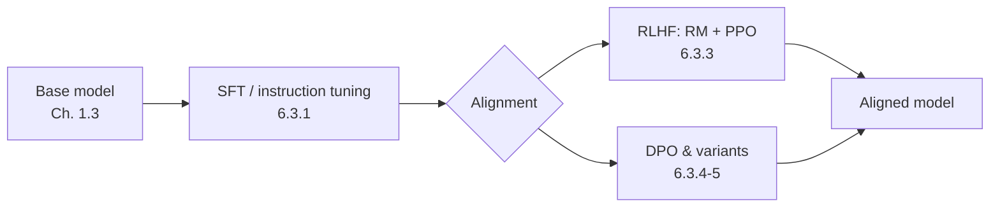
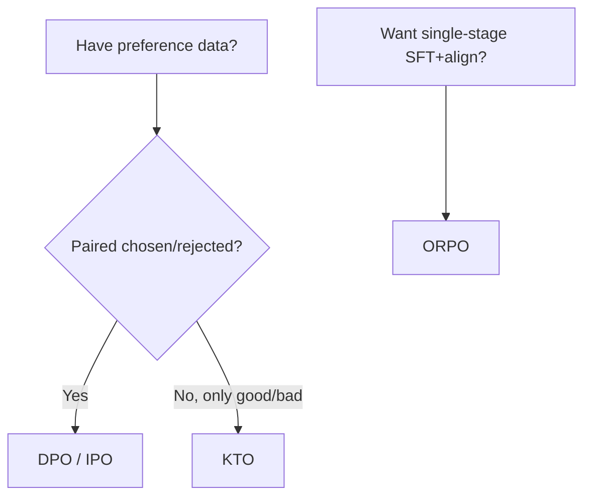

# 6.3 RLHF, DPO & Instruction Tuning

### Study Notes — Book Style · Generative AI Learning Plan · Phase 6 (Fine-tuning & Adaptation)

> **How to read this file.** Chapter 1.3.4 introduced alignment (RLHF/DPO) as the final stage of the training lifecycle, conceptually. This chapter is the *practical, deep* treatment. We first sharpen **instruction tuning** (the SFT stage that teaches models to follow requests), then move to **preference alignment**: the classic three-part RLHF pipeline (reward model + PPO + KL penalty) and its failure mode, reward hacking; then **DPO**, the simpler method that skips the reward model, with runnable `trl` code; then the 2024–2026 variants **IPO, KTO, ORPO**; and finally **RLAIF / Constitutional AI**, where AI feedback replaces human labels. Every training run here rides on the PEFT/LoRA machinery of 6.2; data construction and preference-pair quality live in 6.5; and whether alignment actually helped is measured with the evaluation methods of 8.x.
>
> **Sources synthesized:** Ouyang et al. "InstructGPT" (2022); Rafailov et al. "DPO" (2023); Azar et al. "IPO" (2023); Ethayarajh et al. "KTO" (2024); Hong et al. "ORPO" (2024); Bai et al. "Constitutional AI / RLAIF" (2022); HuggingFace TRL documentation (2024–2026).

---

## 6.3.1 Instruction tuning, deep

**Definition.** *Instruction tuning* is supervised fine-tuning (SFT, from 1.3) on a diverse set of **(instruction, ideal response)** pairs — often multi-turn chat — so a base model that merely *continues text* learns to *follow requests* and adopt a helpful assistant persona.

**Intuition.** A raw pretrained model is a next-token predictor: prompt it with "Translate to French:" and it might continue with *more example instructions* rather than translating. Instruction tuning re-shapes that reflex. It does not add much knowledge; it teaches *format and intent-following* — the "how to respond," echoing the behaviour-vs-knowledge distinction from 6.1.1.

**Example (chat template SFT).** The data uses the model's chat template so special role tokens are learned correctly:

```python
from trl import SFTTrainer, SFTConfig
from datasets import load_dataset

# Each row: {"messages": [{"role":"user","content":...},{"role":"assistant","content":...}]}
ds = load_dataset("json", data_files="instructions.jsonl", split="train")

trainer = SFTTrainer(
    model="meta-llama/Meta-Llama-3-8B",   # a BASE (non-chat) model
    args=SFTConfig(output_dir="sft-instruct", num_train_epochs=3,
                   learning_rate=1e-5, bf16=True, packing=True),
    train_dataset=ds,                      # trl applies the chat template
)
trainer.train()
```

A subtlety: **mask the loss on the user/prompt tokens** so the model is graded only on generating the *assistant* turn — TRL's completion-only handling does this. `packing=True` concatenates short examples to fill the context window and improve throughput. Quality and diversity of instructions matter far more than raw count (the LIMA lesson, 6.1.5, expanded in 6.5).

---

## 6.3.2 Why alignment after SFT?

**Definition.** *Preference alignment* further tunes an instruction-tuned model to match **human (or AI) preferences over full responses** — which of two answers is better — capturing qualities (helpfulness, harmlessness, tone, refusal behaviour) that are hard to specify with a single "correct" target.

**Intuition.** SFT teaches the model *one* good answer per prompt. But "good" is often comparative and subjective: for "write a breakup text," there is no single label, yet humans readily judge A > B. Preference methods learn from those comparisons, pushing probability mass toward preferred styles and away from dispreferred ones. This is the step that makes assistants feel polished and safe.



---

## 6.3.3 RLHF: reward model + PPO + KL penalty

**Definition.** *RLHF (Reinforcement Learning from Human Feedback)* has three stages: (1) collect human preference comparisons; (2) train a **reward model (RM)** to score responses; (3) optimize the policy (the LLM) with **PPO** to maximize reward, regularized by a **KL-divergence penalty** that keeps it close to the SFT reference model.

**Intuition.** The reward model is a learned, differentiable proxy for "what humans like." PPO then treats generation as a reinforcement-learning problem: sample responses, score them with the RM, and nudge the policy toward higher-reward outputs. The KL penalty is the leash — without it the policy drifts into degenerate text that games the RM while abandoning fluency. The objective is roughly:

`maximize  E[ RM(x, y) ]  −  β · KL( π_policy(y|x) ‖ π_ref(y|x) )`

**Reward hacking.** Because the RM is imperfect, the policy learns to exploit its blind spots — producing over-long, sycophantic, or keyword-stuffed answers the RM scores highly but humans dislike. Symptoms: reward climbs while human eval quality falls. Defenses: a strong KL penalty, RM ensembles, length normalization, and periodic re-collection of fresh human preferences.

**Example (TRL PPO sketch).** RLHF is the most complex pipeline — four models in memory (policy, reference, reward, value). LoRA (6.2) is used on the policy to keep it tractable:

```python
from trl import PPOTrainer, PPOConfig, AutoModelForCausalLMWithValueHead
from transformers import AutoTokenizer

cfg = PPOConfig(learning_rate=1e-5, batch_size=64, kl_coef=0.05)  # KL leash
policy = AutoModelForCausalLMWithValueHead.from_pretrained("sft-instruct")
ref    = AutoModelForCausalLMWithValueHead.from_pretrained("sft-instruct")  # frozen ref
tok    = AutoTokenizer.from_pretrained("sft-instruct")

# reward_model is a separately trained classifier scoring (prompt, response)
trainer = PPOTrainer(cfg, policy, ref, tok, reward_model=reward_model, ...)
# loop: generate responses -> score with reward_model -> trainer.step(...)
```

RLHF delivers top-tier quality but is operationally heavy and unstable — which is exactly why DPO became popular.

---

## 6.3.4 DPO: direct preference optimization

**Definition.** *DPO (Direct Preference Optimization)* skips the reward model and RL loop entirely. Using **preference pairs** `(prompt x, chosen y_w, rejected y_l)`, it derives a simple classification-style loss that directly increases the policy's relative log-probability of chosen over rejected, anchored to a frozen reference model, with a temperature-like hyperparameter **β**.

**Intuition.** DPO's key result: the optimal RLHF policy has a closed-form relationship to the reward, so you can optimize the *policy directly* on preferences without ever fitting an explicit RM or running PPO. It reframes alignment as supervised binary classification — vastly more stable and cheaper. **β** controls how far the policy may move from the reference: small β = aggressive adaptation, large β = stay close (analogous to RLHF's KL coefficient). Typical β ≈ 0.1.

**Worked example (TRL DPOTrainer, with LoRA):**

```python
from datasets import load_dataset
from transformers import AutoModelForCausalLM, AutoTokenizer
from peft import LoraConfig
from trl import DPOTrainer, DPOConfig

# rows: {"prompt": str, "chosen": str, "rejected": str}
ds = load_dataset("json", data_files="prefs.jsonl", split="train")

model = AutoModelForCausalLM.from_pretrained("sft-instruct", torch_dtype="bfloat16")
tok   = AutoTokenizer.from_pretrained("sft-instruct")

cfg = DPOConfig(output_dir="dpo-out", beta=0.1,        # the KL-like knob
                learning_rate=5e-6, num_train_epochs=1, bf16=True)

trainer = DPOTrainer(
    model=model,
    args=cfg,
    train_dataset=ds,
    processing_class=tok,
    peft_config=LoraConfig(r=16, lora_alpha=32, task_type="CAUSAL_LM",
                           target_modules="all-linear"),   # reuse 6.2 machinery
)
trainer.train()
```

DPO uses very small learning rates (≈5e-6) and usually **one epoch** — more epochs quickly overfit preferences and degrade the model. Start from a *good SFT checkpoint*; DPO refines, it cannot fix a weak base.

---

## 6.3.5 Variants: IPO, KTO, ORPO

**Definition & intuition.**

- **IPO (Identity Preference Optimization):** adds a regularizer addressing DPO's tendency to **overfit** when preferences are near-deterministic (it can push chosen-vs-rejected margins to extremes). IPO bounds this, improving stability.
- **KTO (Kahneman-Tversky Optimization):** needs only a **binary "good/bad" label per response**, not paired comparisons. Since unpaired thumbs-up/down data is far cheaper to collect (e.g., production feedback), KTO is attractive when you lack clean pairs.
- **ORPO (Odds Ratio Preference Optimization):** **merges SFT and preference alignment into one stage** — no separate reference model and no separate SFT pass. It appends an odds-ratio preference term to the SFT loss, cutting the pipeline to a single training run.

**Example.** A team with millions of production thumbs-up/down events but no annotator budget for pairwise comparisons chooses **KTO**. A startup wanting the leanest pipeline uses **ORPO** to instruction-tune and align in one job. A team seeing DPO overfit on very "clean" synthetic preferences switches to **IPO**.



All are one-line swaps in TRL (`KTOTrainer`, `ORPOTrainer`, or `DPOConfig(loss_type="ipo")`).

---

## 6.3.6 RLAIF and Constitutional AI

**Definition.** *RLAIF (RL from AI Feedback)* replaces human preference labellers with a capable LLM that judges responses against a written **constitution** (a set of principles). *Constitutional AI* (Anthropic) uses this in two phases: a self-critique/revision SFT phase, then preference optimization on AI-generated comparisons.

**Intuition.** Human preference collection is slow, expensive, and inconsistent. If a strong model can reliably apply explicit principles ("prefer the more harmless, more helpful answer"), it can generate preference pairs at scale, cheaply and consistently. In practice teams often **blend** human and AI feedback — AI for volume, humans for calibration and edge cases.

**Example.** To align a customer-service assistant, a team writes a constitution (be concise, never fabricate policy, escalate on legal questions), has a judge model rank response pairs against it, then runs DPO on those pairs. Guardrail: validate the AI judge against a human-labelled sample, since a biased judge propagates its bias into the aligned model.

---

## 6.3.7 When alignment matters

Alignment pays off when *style, safety, and preference* dominate correctness: consumer assistants, brand voice, refusal/safety behaviour, and reducing sycophancy or verbosity. It matters **less** for narrow, single-answer tasks (extraction, classification, structured generation) where SFT alone hits the format target — there, preference data is hard to define and DPO adds cost without clear gain. Sequence to reserve budget: SFT first, measure (8.x), and add DPO only if evals show a preference/quality gap SFT can't close.

---

## 6.3.8 Industry use cases

**Finance.** A robo-advisor uses **DPO** to align a chatbot toward responses that are compliant and appropriately cautious: annotators (and a constitution-guided judge, 6.3.6) mark pairs where the *chosen* answer includes required risk disclosures and refuses to give individualized advice. Reward hacking is a live concern — an RLHF RM once learned to append boilerplate disclaimers to *everything* to score well, so the team moved to DPO with a strong reference anchor (β=0.1) and human spot-checks.

**E-commerce.** A marketplace has millions of **thumbs-up/down** signals on AI-generated shopping answers but no pairwise annotations, so it uses **KTO** to nudge the assistant toward responses customers approved — improving helpfulness without an annotation program. A separate brand-voice model uses **ORPO** to fold instruction tuning and preference alignment into one overnight job on LoRA adapters (6.2).

---

## 6.3.9 Common pitfalls

- **Skipping/short-changing SFT.** DPO/RLHF refine a good SFT model; on a weak base they amplify flaws.
- **Reward hacking (RLHF).** Reward rises while human quality drops (length bias, sycophancy). Use KL penalty, length normalization, RM ensembles, fresh data.
- **Over-training DPO.** More than ~1 epoch or too-small β overfits preferences and degrades general ability; watch held-out reward margin *and* general benchmarks (8.x).
- **Bad preference pairs.** Noisy or contradictory chosen/rejected labels teach nothing; pair quality is the ceiling (6.5).
- **Unvalidated AI judges (RLAIF).** A biased judge bakes bias into the model; calibrate against human labels.
- **Aligning when SFT sufficed.** For extraction/classification, preference data is ill-defined and adds cost without gain.
- **Forgetting the reference model.** DPO/RLHF need a frozen reference; using the trained model as its own reference removes the leash and destabilizes training.

---

## Wrap-Up

**Through-line.** 1.3.4 told you alignment *exists*; this chapter showed you how to *do* it. We deepened instruction tuning, then walked the alignment landscape from the powerful-but-heavy RLHF (RM + PPO + KL, and its reward-hacking trap) to DPO's stable, RM-free reformulation, to the pragmatic variants (IPO for stability, KTO for unpaired feedback, ORPO for single-stage) and to RLAIF/Constitutional AI for scaling feedback. All of it runs on the LoRA adapters of 6.2, is only as good as the preference data of 6.5, and is only trustworthy once verified with the evaluations of 8.x. Next, 6.4 turns a finished, aligned model into something cheap to deploy.

**Quick reference.**

| Method | Needs | Key knob | Cost/stability |
|---|---|---|---|
| SFT / instruction tuning | (prompt, response) | LR, epochs | Cheap, stable |
| RLHF (PPO) | preference pairs + RM | KL coef β | Expensive, unstable |
| DPO | (prompt, chosen, rejected) | β (~0.1) | Cheap, stable |
| IPO | same as DPO | β + reg | More stable than DPO |
| KTO | binary good/bad labels | β | Cheap, no pairs |
| ORPO | SFT data + preferences | λ (OR weight) | Single-stage |
| RLAIF / CAI | constitution + judge LLM | judge quality | Scales feedback |

**Interview questions & answers.**

1. **Q:** What are RLHF's three stages? **A:** Collect preferences, train a reward model, optimize the policy with PPO under a KL penalty to the reference.
2. **Q:** What is the KL penalty for? **A:** To keep the policy near the SFT reference so it doesn't drift into degenerate reward-hacking text.
3. **Q:** What is reward hacking? **A:** The policy exploits RM weaknesses (length, sycophancy) to score high while humans judge quality lower.
4. **Q:** How does DPO avoid a reward model? **A:** It uses the closed-form link between optimal policy and reward to optimize the policy directly on preference pairs.
5. **Q:** What does β do in DPO? **A:** Controls deviation from the reference: small β adapts aggressively, large β stays close (like RLHF's KL coefficient).
6. **Q:** When choose KTO over DPO? **A:** When you have only unpaired binary good/bad labels rather than pairwise comparisons.
7. **Q:** What is ORPO's advantage? **A:** It merges SFT and preference alignment into one stage with no separate reference model.
8. **Q:** What problem does IPO address? **A:** DPO's overfitting on near-deterministic preferences; IPO adds a bounding regularizer.
9. **Q:** What is RLAIF / Constitutional AI? **A:** Using an LLM guided by written principles to generate preference labels, replacing/augmenting human feedback.
10. **Q:** Why usually only one DPO epoch? **A:** Preferences overfit fast; extra epochs shrink diversity and hurt general ability.
11. **Q:** When is alignment not worth it? **A:** For narrow single-answer tasks (extraction/classification) where SFT hits the target and preferences are ill-defined.

**Mini-glossary.** *Instruction tuning:* SFT on request→response pairs. *Reward model:* learned scorer of responses. *PPO:* the RL algorithm used in RLHF. *KL penalty:* reference-anchoring regularizer. *Reward hacking:* gaming the RM. *DPO:* RM-free preference optimization. *β:* DPO reference-deviation knob. *Preference pair:* (chosen, rejected). *KTO/IPO/ORPO:* preference variants. *RLAIF:* AI-generated feedback.

**Further reading.** InstructGPT (2022); DPO (2023); IPO (2023); KTO (2024); ORPO (2024); Constitutional AI (2022); HuggingFace TRL alignment guides. Proceed to **6.4** for quantization and distillation.
