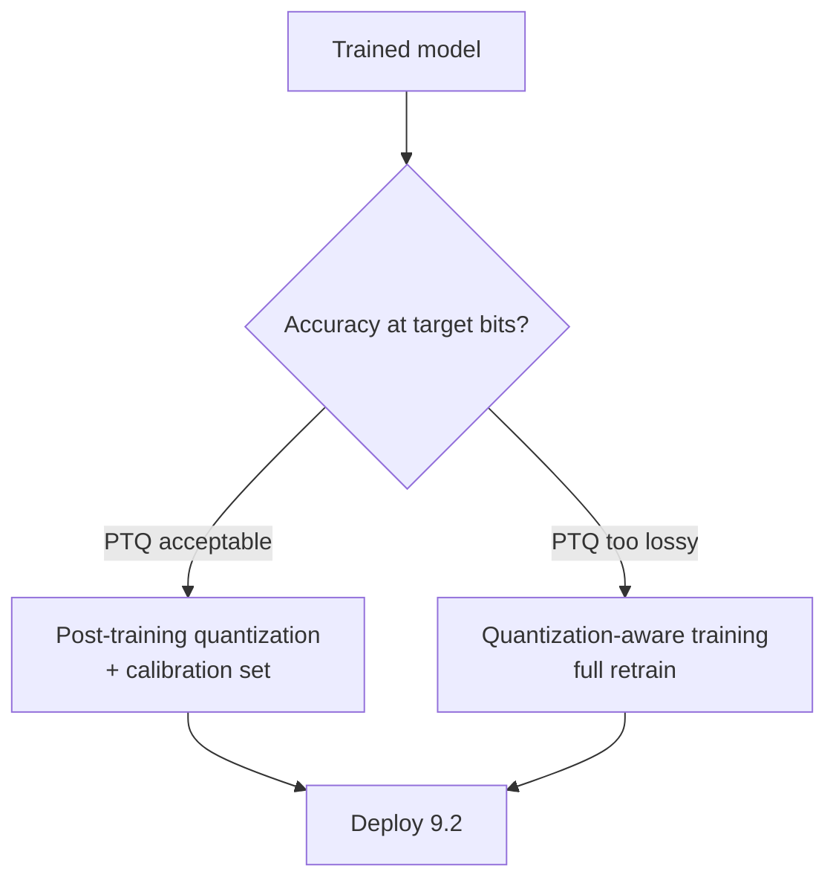
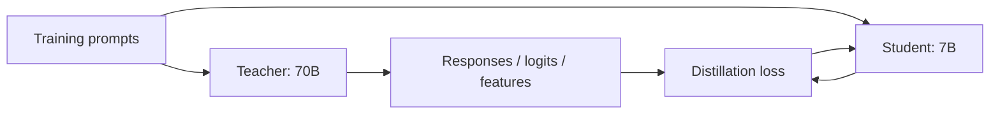

# 6.4 Quantization & Distillation

### Study Notes — Book Style · Generative AI Learning Plan · Phase 6 (Fine-tuning & Adaptation)

> **How to read this file.** Once you have a fine-tuned, aligned model (6.1–6.3), the next problem is *making it cheap and fast to run*. This chapter covers the two dominant model-compression families: **quantization** (represent weights/activations in fewer bits) and **knowledge distillation** (train a small "student" to mimic a large "teacher"). We met 4-bit NF4 quantization already in QLoRA (6.2), but there it served *training*; here we generalize to *inference-time* compression — FP16/BF16/INT8/INT4, PTQ vs. QAT, and the concrete formats GPTQ, AWQ, GGUF (llama.cpp), and bitsandbytes. Then distillation: response/feature/logit variants and when to distill vs. quantize. All of this feeds directly into deployment and serving (9.2), which decides latency, throughput, and cost.
>
> **Sources synthesized:** Frantar et al. "GPTQ" (2022); Lin et al. "AWQ" (2023); Dettmers et al. "LLM.int8()" (2022); Hinton et al. "Distilling the Knowledge in a Neural Network" (2015); the DistilBERT paper (2019); llama.cpp/GGUF, HuggingFace `optimum`, and vLLM quantization documentation (2024–2026).

---

## 6.4.1 Numeric precision: FP16, BF16, INT8, INT4

**Definition.** *Quantization* reduces the number of bits used to store and compute model parameters (and sometimes activations). Common formats: **FP16** and **BF16** (16-bit floats), **INT8** (8-bit integers), and **INT4** (4-bit). BF16 keeps FP32's exponent range (fewer overflow issues) with less mantissa precision; FP16 has more mantissa but a smaller range.

**Intuition.** A model is mostly a giant pile of numbers. Store each in 4 bytes (FP32) and a 7B model is ~28 GB; in 2 bytes (BF16) it's ~14 GB; in 1 byte (INT8) ~7 GB; in 4 bits (INT4) ~3.5 GB. Fewer bits means less memory, less bandwidth to move weights, and — with integer kernels — faster compute. The cost is precision: each weight is snapped to the nearest representable level, introducing rounding error that can degrade quality.

**Example (memory by precision, 7B model):**

| Precision | Bytes/param | ~7B model size | Typical use |
|---|---|---|---|
| FP32 | 4 | ~28 GB | training reference |
| FP16/BF16 | 2 | ~14 GB | standard inference |
| INT8 | 1 | ~7 GB | high-fidelity compression |
| INT4 | 0.5 | ~3.5 GB | max compression, edge |

The core mechanic: a group of weights is mapped to integers via a **scale** (and often a **zero-point**): `q = round(w / scale)`, recovered as `w ≈ q · scale`. Doing this per-group (e.g., every 128 weights) instead of per-tensor keeps error small.

---

## 6.4.2 PTQ vs. QAT

**Definition.** *Post-Training Quantization (PTQ)* quantizes an already-trained model, optionally using a small **calibration** dataset to choose scales — no gradient training. *Quantization-Aware Training (QAT)* simulates quantization *during* training/fine-tuning so the model learns weights robust to it.

**Intuition.** PTQ is fast and cheap (minutes to hours, a few hundred calibration samples) and is the default for LLMs. QAT recovers more accuracy at very low bit-widths but costs a full training run — worth it mainly for aggressive INT4/edge deployment where PTQ loses too much. Note QLoRA (6.2) is a hybrid flavour: a frozen 4-bit base with trainable higher-precision adapters.



---

## 6.4.3 Formats and methods: GPTQ, AWQ, GGUF, bitsandbytes

**Definition & intuition.**

- **bitsandbytes** — on-the-fly INT8/INT4 (NF4) quantization inside HuggingFace. Zero calibration, dead simple (`load_in_4bit=True`). It powers QLoRA training (6.2) and quick inference, but its kernels are generally slower than dedicated inference formats. Best for *training* and prototyping.
- **GPTQ** — a PTQ method that quantizes weights layer-by-layer to INT4/INT3 using second-order (Hessian) information to minimize error, with a calibration set. Strong accuracy at 4-bit; widely supported by vLLM/TGI. GPU-focused.
- **AWQ (Activation-aware Weight Quantization)** — observes that a small fraction of weight channels (those multiplying large activations) are **salient**; it protects/scales those before quantizing the rest to INT4. Often better accuracy than GPTQ at similar bits and fast on GPU. A common 2026 default for INT4 GPU serving.
- **GGUF (llama.cpp)** — a file format + quantization scheme for **CPU and Apple Silicon / edge** inference. Offers many levels (Q4_K_M, Q5_K_M, Q8_0, etc.); `Q4_K_M` is a popular quality/size sweet spot. This is how models run on laptops and phones.

**Example (bitsandbytes INT8 inference):**

```python
from transformers import AutoModelForCausalLM, BitsAndBytesConfig
m = AutoModelForCausalLM.from_pretrained(
    "acme/llama3-support-merged",         # merged fine-tune from 6.2
    quantization_config=BitsAndBytesConfig(load_in_8bit=True),
    device_map="auto",
)
```

**Example (AWQ / GPTQ for serving).** Quantized checkpoints are produced offline (via `autoawq`, `auto-gptq`, or `llm-compressor`) and loaded directly by the serving engine:

```python
# Produce an AWQ checkpoint offline (once):
from awq import AutoAWQForCausalLM
from transformers import AutoTokenizer
model = AutoAWQForCausalLM.from_pretrained("acme/llama3-support-merged")
tok = AutoTokenizer.from_pretrained("acme/llama3-support-merged")
model.quantize(tok, quant_config={"w_bit": 4, "q_group_size": 128, "version": "GEMM"})
model.save_quantized("llama3-support-awq")
# Then serve with vLLM: vllm serve llama3-support-awq --quantization awq  (see 9.2)
```

**Example (GGUF for edge):**

```bash
# Convert HF model to GGUF and quantize with llama.cpp:
python convert_hf_to_gguf.py acme/llama3-support-merged --outfile model-f16.gguf
./llama-quantize model-f16.gguf model-Q4_K_M.gguf Q4_K_M
./llama-cli -m model-Q4_K_M.gguf -p "Summarize this ticket:"   # runs on CPU/laptop
```

---

## 6.4.4 Accuracy / speed / memory trade-offs

**Intuition.** Quantization is a three-way trade-off. Going from BF16 → INT8 typically halves memory with negligible quality loss — an easy win. INT8 → INT4 halves memory again and speeds up memory-bound decoding, but quality loss becomes measurable, especially on reasoning and long-context tasks. Below 4-bit (3-bit, 2-bit), degradation is usually steep without QAT.

**Rules of thumb (2026):**

- **INT8** is nearly free quality-wise; use it whenever memory is tight and you want safety.
- **INT4 (AWQ/GPTQ)** is the standard aggressive choice for GPU serving; validate on *your* evals (8.x), don't trust generic benchmarks.
- **Larger models tolerate quantization better** than small ones — a 70B at INT4 often beats a 13B at BF16 for the same memory budget.
- **Always A/B against the unquantized model** on task metrics before shipping; quantization can quietly break formatting or edge-case reasoning.

**Example.** A team finds their INT4-GPTQ model regresses on a JSON-formatting eval by 6 points. Switching to **AWQ** (which protects salient channels) recovers most of it; where it doesn't, they bump `q_group_size` down (smaller groups = finer scales = less error, slightly more memory).

---

## 6.4.5 Knowledge distillation

**Definition.** *Knowledge distillation* trains a smaller **student** model to reproduce the behaviour of a larger **teacher**. Rather than compressing the *representation* (quantization), it compresses the *architecture* into fewer parameters.

**Intuition.** A big teacher "knows" more than its final answer reveals — its full probability distribution over tokens encodes *how confident* and *what alternatives* it considered ("dark knowledge"). Training the student to match that richer signal transfers more than hard labels alone. DistilBERT (60% the size, ~97% the quality) is the canonical proof.

**Three variants.**

- **Response (black-box) distillation:** the teacher generates outputs; the student does SFT on those (teacher → synthetic dataset → student). Works even when you only have API access to the teacher — hugely popular for building small models from frontier models.
- **Logit (soft-label) distillation:** the student matches the teacher's full softened probability distribution, using a temperature `T` and KL loss: `L = α·CE(hard) + (1−α)·T²·KL(student_soft ‖ teacher_soft)`. Needs teacher logits (white-box).
- **Feature distillation:** the student additionally matches the teacher's *intermediate hidden states/attention maps*, transferring internal structure. Strongest signal, requires deepest access.



**Example (response distillation, the common path):**

```python
# 1) Teacher generates high-quality answers for your prompts (white or black box)
teacher_outputs = [teacher(p) for p in prompts]        # -> {"messages":[...]} rows
# 2) Student SFT on that synthetic set (reuse the SFTTrainer from 6.2/6.3)
from trl import SFTTrainer, SFTConfig
SFTTrainer(model="meta-llama/Meta-Llama-3-8B-Instruct",
           args=SFTConfig(output_dir="student", num_train_epochs=3, bf16=True),
           train_dataset=distill_ds).train()
```

Beware licensing: many providers restrict using their outputs to train competing models — check terms before response-distilling a commercial API (see contamination notes in 6.5).

---

## 6.4.6 When to distill vs. quantize (vs. both)

**Intuition.** They are complementary. **Quantize first** — it is cheap, keeps the same architecture, and needs no training data. Reach for **distillation** when you need a genuinely *smaller/faster* architecture than any quantization of the original can provide, or when you want to compress a huge/closed teacher into an ownable small model. Best practice for edge often combines them: **distill 70B → 7B, then INT4-quantize the 7B.**

| Goal | Prefer |
|---|---|
| Cut memory fast, no training data | Quantization |
| Need a smaller architecture / lower FLOPs | Distillation |
| Own a small model from a frontier teacher | Response distillation |
| Squeeze onto a phone/laptop | Distill → quantize (GGUF) |

---

## 6.4.7 Deployment implications (→ 9.2)

Compression choices are ultimately *serving* choices. Memory footprint sets how many replicas fit per GPU and how much room the **KV cache** gets (bigger KV cache = higher batch size = higher throughput). Quantized weights reduce memory-bandwidth pressure, directly improving token/s in memory-bound decoding. Format dictates the engine: **AWQ/GPTQ → vLLM/TGI on GPU; GGUF → llama.cpp/Ollama on CPU/edge**. These throughput/latency/cost mechanics are the subject of 9.2; the takeaway here is that quantization/distillation are *upstream levers* on every serving metric.

---

## 6.4.8 Industry use cases

**Finance.** A bank must run a fine-tuned model **on-premise** for data-residency reasons on a fixed, modest GPU budget. They **AWQ-INT4** their merged 8B fine-tune (6.2) to fit more replicas per GPU and hit latency SLAs for real-time transaction-explanation, A/B-testing that INT4 doesn't regress the mandated-disclaimer formatting eval. For a fraud-triage model that must run at the branch edge, they **distill** a large classifier into a tiny student, then GGUF-quantize it for on-device CPU inference with no network dependency.

**E-commerce.** A retailer serves product-description generation at massive scale. They **distill** their expensive frontier-model prompt pipeline into an owned 7B student (response distillation on teacher outputs), then **INT4-quantize** it — cutting per-request cost by an order of magnitude versus API calls while removing vendor dependency. For a shopping assistant on the mobile app, a **GGUF Q4_K_M** student runs on-device for offline autocomplete.

---

## 6.4.9 Common pitfalls

- **Trusting generic benchmarks.** A model that holds MMLU may still break *your* JSON formatting at INT4; always run task-specific evals (8.x).
- **Over-aggressive bits.** Sub-4-bit PTQ without QAT often collapses quality; don't chase memory past the accuracy cliff.
- **Wrong format for the target.** GPTQ/AWQ are GPU formats; GGUF is CPU/edge. Mismatching wastes performance.
- **Distilling on a narrow prompt set.** A student only learns the distribution it saw; thin/biased distillation data yields a brittle student (data rules in 6.5).
- **Licensing violations.** Response-distilling a commercial API to build a competitor can breach terms; check licenses.
- **Ignoring KV-cache math.** Quantizing weights but forgetting activation/KV memory can still OOM at high batch sizes (9.2).
- **Merging-then-quantizing order.** Merge LoRA adapters into a 16-bit base (6.2), *then* quantize; quantizing before merge or into an already-4-bit base degrades quality.

---

## Wrap-Up

**Through-line.** 6.1–6.3 produced a fine-tuned, aligned model; this chapter made it *deployable*. Quantization (BF16→INT8→INT4 via bitsandbytes/GPTQ/AWQ/GGUF) shrinks the representation cheaply, extending the same NF4 idea QLoRA used for training (6.2) into inference. Distillation shrinks the *architecture*, letting a small owned student inherit a big teacher's behaviour — and the two compose (distill then quantize) for edge. Every one of these choices is an upstream lever on the latency, throughput, and cost mechanics detailed in 9.2, and every one must be validated with the evaluation discipline of 8.x. Next, 6.5 closes Phase 6 with the data and evaluation practices that determine whether any fine-tune — before or after compression — is actually good.

**Quick reference.**

| Method | Bits | Target | Needs |
|---|---|---|---|
| bitsandbytes | INT8/NF4 | GPU (train/proto) | nothing |
| GPTQ | INT4/INT3 | GPU serving | calibration set |
| AWQ | INT4 | GPU serving | calibration set |
| GGUF (llama.cpp) | Q2–Q8 | CPU / edge | conversion |
| QAT | any low bit | max accuracy | full retrain |
| Response distillation | n/a | small student | teacher outputs |
| Logit distillation | n/a | small student | teacher logits |

**Interview questions & answers.**

1. **Q:** BF16 vs FP16? **A:** BF16 keeps FP32's exponent range (fewer overflows) with less mantissa precision; FP16 has more mantissa but smaller range.
2. **Q:** PTQ vs QAT? **A:** PTQ quantizes a trained model with optional calibration and no training; QAT simulates quantization during training for better low-bit accuracy at higher cost.
3. **Q:** How does AWQ differ from GPTQ? **A:** AWQ protects salient weight channels (those tied to large activations) before quantizing; GPTQ uses second-order error minimization layer-by-layer.
4. **Q:** When use GGUF? **A:** For CPU / Apple Silicon / edge inference via llama.cpp/Ollama.
5. **Q:** Why does INT8 lose little quality? **A:** 8 bits with per-group scales represent the weight distribution finely enough that rounding error is negligible.
6. **Q:** What is "dark knowledge" in distillation? **A:** The teacher's full soft probability distribution, which encodes relative confidences beyond the top answer.
7. **Q:** Name the three distillation variants. **A:** Response (mimic outputs), logit (match soft distributions), feature (match hidden states).
8. **Q:** Distill vs quantize — which first? **A:** Quantize first (cheap, no data); distill when you need a smaller architecture or to own a small model from a big teacher; combine for edge.
9. **Q:** Why do larger models quantize more gracefully? **A:** More redundancy/capacity absorbs quantization error, so a big model at INT4 can beat a small one at BF16 for equal memory.
10. **Q:** A key distillation pitfall? **A:** Narrow/biased distillation prompts produce a brittle student; also, licensing may forbid distilling commercial APIs.
11. **Q:** How does quantization improve throughput? **A:** Less memory-bandwidth per weight speeds memory-bound decoding, and freed memory grows the KV cache and batch size (9.2).

**Mini-glossary.** *Quantization:* fewer-bit representation. *Scale/zero-point:* mapping from int to real. *PTQ/QAT:* post-training / quantization-aware training. *GPTQ/AWQ:* INT4 GPU methods. *GGUF:* llama.cpp edge format. *bitsandbytes:* on-the-fly HF quantization. *Distillation:* teacher→student training. *Dark knowledge:* soft-label information. *KV cache:* stored attention keys/values driving serving memory.

**Further reading.** GPTQ (2022); AWQ (2023); LLM.int8() (2022); Hinton et al. distillation (2015); DistilBERT (2019); llama.cpp/GGUF docs; HuggingFace `optimum` and vLLM quantization guides. Continue to **6.5** for data and evaluation.
