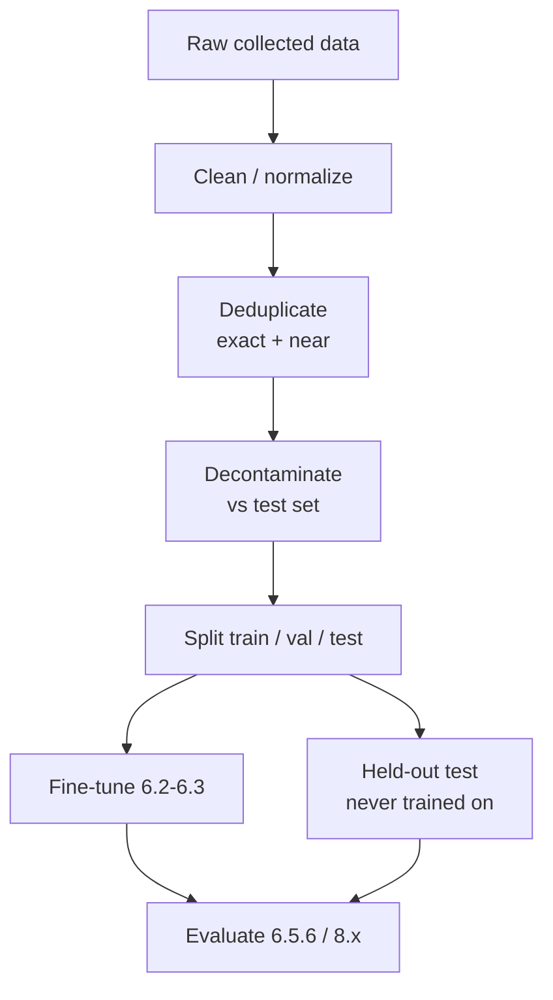

# 6.5 Fine-Tuning Data & Evaluation

### Study Notes — Book Style · Generative AI Learning Plan · Phase 6 (Fine-tuning & Adaptation)

> **How to read this file.** This chapter closes Phase 6 with the two disciplines that decide whether *any* of the preceding techniques succeed: **data** and **evaluation**. Every method in 6.1–6.4 — full FT, LoRA/QLoRA (6.2), DPO/RLHF (6.3), distillation (6.4) — has a quality ceiling set entirely by the data you feed it, and none can be trusted without rigorous measurement. We cover dataset construction (instruction/chat formats, the quality-over-quantity principle, deduplication, synthetic data, and the contamination trap), proper train/val/test splits, the hyperparameters that matter most (epochs, learning rate, batch size), and how to evaluate a fine-tune — task evals, benchmarks, regression against the base, and the tell-tale signs of overfitting. This is the applied companion to the evaluation chapter 8.x, which covers metrics, LLM-as-judge, and eval harnesses in depth.
>
> **Sources synthesized:** Zhou et al. "LIMA" (2023); "Self-Instruct" (2022) and "Alpaca" (2023); "The Pile"/dedup studies; HuggingFace `trl`/`datasets` docs; EleutherAI `lm-evaluation-harness`; and industry post-mortems on data contamination and overfitting (2023–2026).

---

## 6.5.1 Dataset formats: instruction and chat

**Definition.** Fine-tuning data is a set of examples in a fixed schema. Two dominate: **instruction format** (`{"instruction": ..., "input": ..., "output": ...}`, Alpaca-style) and **chat/messages format** (a list of role-tagged turns), which is standard for modern chat models and applied via the model's **chat template**.

**Intuition.** The format must match how the model will be *used* and how it was *pretrained/instruction-tuned*. Feeding chat-template tokens the model never saw, or grading loss on the wrong tokens, silently wastes training. The chat template inserts the exact special tokens (`<|user|>`, `<|assistant|>`, etc.) the base expects.

**Example.**

```json
{"messages": [
  {"role": "system", "content": "You are a concise support agent."},
  {"role": "user", "content": "How do I reset my password?"},
  {"role": "assistant", "content": "1. Open Settings. 2. Click Security. 3. Select Reset password."}
]}
```

Critical detail (reinforcing 6.3.1): **mask the loss on system/user tokens** so the model is graded only on the assistant turn. TRL's `SFTTrainer` handles this with completion-only collators; DPO data instead uses `{"prompt","chosen","rejected"}` (6.3.4).

---

## 6.5.2 Quality over quantity

**Definition.** The empirical principle — crystallized by **LIMA** — that a *small, high-quality, diverse* dataset produces better instruction-following than a large, noisy one.

**Intuition.** SFT mostly teaches *format and style*, not new knowledge (6.1.1). A model learns the target behaviour from a few thousand *excellent, consistent* examples; adding thousands of mediocre or contradictory ones teaches it to be mediocre and contradictory. Every example is a vote for a behaviour — noisy votes elect a worse model.

**Example.** LIMA fine-tuned on **1,000** carefully curated examples and rivaled models trained on orders of magnitude more. Practical guidance: invest in *consistency* (one canonical style, correct labels), *diversity* (cover the real input distribution and edge cases), and *difficulty coverage* — rather than scraping volume. Curate, filter, and hand-audit a sample before every run.

---

## 6.5.3 Deduplication and contamination

**Definition.** *Deduplication* removes exact and near-duplicate examples. *Data contamination* is the leakage of **test/benchmark data into training**, which inflates metrics and hides real performance.

**Intuition.** Duplicates let the model memorize instead of generalize and skew the loss toward over-represented cases. Contamination is more insidious: if your eval questions (or their paraphrases) appear in training, your evals lie — the model looks great and fails in production. With synthetic data (6.5.4) and web-scraped corpora, contamination is easy to introduce accidentally.

**Example / practice.**

- **Dedup** with hashing for exact matches and embedding/MinHash similarity for near-duplicates; drop or down-weight clusters.
- **Decontaminate** by explicitly removing any train example overlapping your held-out test set (n-gram or embedding overlap checks) *before* training.
- When distilling from a teacher (6.4.5), ensure the teacher wasn't prompted with your eval set.



---

## 6.5.4 Synthetic data generation

**Definition.** Using an LLM to *generate or augment* training data — e.g., **Self-Instruct/Alpaca**, where a strong model produces instruction→response pairs, or teacher-generated responses for distillation (6.4.5).

**Intuition.** Synthetic data is cheap, scalable, and controllable — you can target exactly the formats and edge cases you need. Its risks are **quality drift** (the generator's mistakes and biases propagate), **low diversity** (mode collapse toward a few templates), and **contamination** if the generator saw your evals. Treat synthetic data like any other data: filter and audit it.

**Example.**

```python
# Generate instruction pairs, then FILTER before training.
seed_prompts = [...]  # human-written seeds for diversity
raw = [generator(p) for p in seed_prompts]      # LLM produces (instruction, output)
clean = [x for x in raw if passes_quality(x)]   # rubric/heuristic/LLM-judge filter
clean = dedup(clean)                             # 6.5.3
# -> feed `clean` to SFTTrainer (6.2)
```

Best practice: **blend** synthetic breadth with a smaller set of gold human examples, and validate on a *human-labelled* test set the generator never touched.

---

## 6.5.5 Train/val/test splits

**Definition.** Partition data into **train** (learn), **validation** (tune hyperparameters, early-stopping), and **test** (final, untouched estimate of generalization).

**Intuition.** Validation loss is your overfitting early-warning; the test set is your honest report card and must be quarantined. For fine-tuning, splits should be **representative of production** and ideally split by *entity/time* (e.g., by customer or date) to avoid leakage — a random split can put near-duplicates of a test case into training. Keep a **small, hand-verified golden test set** that never changes across runs so results are comparable over time.

**Example.** A team splits support tickets **by month**: train on Jan–Sep, validate on Oct, test on Nov–Dec — mirroring the real "train on past, serve on future" setting and preventing temporal leakage.

---

## 6.5.6 Hyperparameters that matter

**Definition & intuition.**

- **Epochs:** how many passes over the data. Fine-tuning needs *few* — SFT typically **1–3**, DPO usually **1** (6.3.4). More epochs overfit fast because datasets are small.
- **Learning rate:** the single most impactful knob. Full FT ≈ **1e-5** (6.1); LoRA ≈ **2e-4** (6.2); DPO ≈ **5e-6** (6.3). Too high → instability/forgetting; too low → underfitting. Use a warmup + cosine/linear decay schedule.
- **Batch size (effective):** `per_device_batch × grad_accumulation × num_gpus`. Larger = more stable gradients, more memory. Gradient accumulation simulates big batches on small GPUs.
- **Sequence length / packing:** set to cover your real inputs; `packing=True` fills context windows for throughput.
- **Warmup, weight decay, gradient checkpointing:** secondary but useful (checkpointing trades compute for activation memory).

**Example (annotated SFTConfig).**

```python
from trl import SFTConfig
cfg = SFTConfig(
    num_train_epochs=3,                 # SFT: 1-3
    learning_rate=2e-4,                 # LoRA range (6.2)
    lr_scheduler_type="cosine",
    warmup_ratio=0.03,
    per_device_train_batch_size=4,
    gradient_accumulation_steps=4,      # effective batch = 16 (x #GPUs)
    max_seq_length=2048,
    packing=True,
    bf16=True,
    eval_strategy="steps", eval_steps=50, # watch val loss (6.5.7)
    logging_steps=10,
)
```

Tune systematically: sweep LR first (it dominates), then epochs, holding others fixed, and judge on **task metrics** (6.5.6), not training loss alone.

---

## 6.5.7 Evaluating a fine-tuned model

**Definition.** Evaluation combines **task-specific evals** (does it do *your* job?), **standard benchmarks** (did general ability survive?), and **base-model regression** (is it actually better than what you started with?). Metrics, LLM-as-judge, and harness mechanics are the domain of **8.x**; here we cover the fine-tuning-specific workflow.

**Intuition.** Training loss going down is *not* evidence the model is good — it only means it fits the training distribution. You must measure on held-out, production-like data with metrics that reflect the real objective (exact-match/F1 for extraction, format-validity for structured output, LLM-judge or human ratings for open-ended quality).

**The four checks.**

1. **Task eval on held-out test set** — the metric you actually care about, on data never trained on.
2. **Compare to the base model** — the fine-tune must beat the un-tuned base (and often the best prompt-only baseline from 6.1.1) to justify itself.
3. **Regression on general benchmarks** — run a few general suites (e.g., via `lm-evaluation-harness`) before and after to detect catastrophic forgetting (6.1.4).
4. **Overfitting check** — validation loss/metric vs. training; a widening gap signals overfitting.

**Example (offline task + regression harness):**

```python
# Task eval: format validity + accuracy on held-out test set
preds = [ft_model(x) for x in test_prompts]
fmt_ok = mean(is_valid_json(p) for p in preds)          # structured-output check
acc    = mean(correct(p, gold) for p, gold in zip(preds, test_gold))
print("base vs ft:", base_acc, "->", acc, "| format:", fmt_ok)

# General regression (guard against forgetting): run a subset with lm-eval-harness
# lm_eval --model hf --model_args pretrained=out-lora --tasks arc_easy,hellaswag
```

**Signs of overfitting.** Validation loss rising while training loss falls; the model parroting training phrasings verbatim; brittle behaviour on slightly-reworded inputs; loss of diversity/general skill. Fixes: fewer epochs, lower LR, more/broader data, stronger regularization, or PEFT instead of full FT (6.1.4).

---

## 6.5.8 Industry use cases

**Finance.** A bank building a transaction-categorization fine-tune curates ~5,000 hand-verified examples (quality over quantity, 6.5.2), splits **by time** to mimic deployment, and evaluates with exact-match accuracy on a frozen golden set *plus* a general-benchmark regression pass to ensure the model didn't forget how to explain its reasoning to auditors. They explicitly **decontaminate**: because they augmented with synthetic transactions (6.5.4), they check no synthetic item paraphrases a test case.

**E-commerce.** A retailer fine-tuning a product-description generator uses **synthetic data** (teacher-generated blurbs, 6.4.5) blended with gold human copy, dedups near-identical listings, and evaluates with an **LLM-as-judge** rubric (brand-voice adherence, factual grounding to the spec sheet) on a held-out product set — comparing against both the base model and the previous prompt-only pipeline before shipping (8.x for the judge harness).

---

## 6.5.9 Common pitfalls

- **Judging by training loss.** Low train loss ≠ good model; only held-out task metrics count.
- **No decontamination.** Test data leaking into training inflates metrics and hides real failure (6.5.3).
- **Too many epochs.** The most common overfitting cause; keep SFT to 1–3, DPO to ~1.
- **Wrong loss masking.** Training on user/prompt tokens instead of only the assistant completion wastes signal.
- **Unrepresentative splits.** Random splits with near-duplicates or ignoring time leak information; split by entity/time.
- **Skipping regression tests.** Measuring only task accuracy hides catastrophic forgetting (6.1.4).
- **Trusting synthetic data blind.** Unfiltered synthetic data propagates the generator's errors and collapses diversity.
- **Chasing volume over quality.** Big noisy datasets underperform small curated ones (LIMA, 6.5.2).
- **Changing the test set between runs.** Breaks comparability; keep a frozen golden set.

---

## Wrap-Up

**Through-line.** Phase 6 taught the *how* of adaptation — when to fine-tune (6.1), the parameter-efficient machinery (6.2), alignment (6.3), and compression (6.4). This chapter supplied the discipline that makes all of it *work*: data quality and honest evaluation set the ceiling and the ground truth for every method above. A LoRA run, a DPO pass, or a distilled student is only as good as the curated, deduped, decontaminated data behind it and only as trustworthy as the held-out, regression-checked evaluation in front of it. From here, the natural next step is the full evaluation toolkit in **8.x** (metrics, LLM-as-judge, benchmark harnesses) and the deployment/serving concerns in **9.2** that turn a validated fine-tune into a production system.

**Quick reference.**

| Lever | Typical setting | Watch for |
|---|---|---|
| Format | chat template, mask prompt | wrong special tokens |
| Data size | quality > quantity (LIMA) | noise, contradictions |
| Dedup + decontaminate | always, pre-split | test leakage |
| Split | by time/entity | near-duplicate leakage |
| Epochs | SFT 1–3, DPO ~1 | overfitting |
| LR | full 1e-5 / LoRA 2e-4 / DPO 5e-6 | instability / underfit |
| Eval | task + base-vs-ft + regression | training-loss illusion |

**Interview questions & answers.**

1. **Q:** Why quality over quantity in fine-tuning data? **A:** SFT teaches format/style, learned from a few excellent consistent examples; noise teaches noise (LIMA).
2. **Q:** What is data contamination and why does it matter? **A:** Test data leaking into training; it inflates metrics and hides real performance.
3. **Q:** How many epochs for SFT and DPO? **A:** SFT typically 1–3; DPO usually 1 — small datasets overfit fast.
4. **Q:** Which hyperparameter matters most? **A:** Learning rate — tune it first (full 1e-5, LoRA 2e-4, DPO 5e-6).
5. **Q:** Why not judge a fine-tune by training loss? **A:** It only shows fit to training data; generalization must be measured on held-out task metrics.
6. **Q:** How do you detect catastrophic forgetting? **A:** Regression-test general benchmarks (e.g., lm-eval-harness) before and after fine-tuning.
7. **Q:** Signs of overfitting? **A:** Validation loss rising while training loss falls, verbatim parroting, brittleness to rewording, lost diversity.
8. **Q:** Why split by time or entity? **A:** To mimic production and prevent near-duplicate/temporal leakage that a random split allows.
9. **Q:** Risks of synthetic data? **A:** Error/bias propagation, low diversity (mode collapse), and contamination; filter and audit it.
10. **Q:** Why mask loss on prompt tokens? **A:** So the model is graded only on generating the assistant response, not on reproducing the input.
11. **Q:** What baselines must a fine-tune beat? **A:** The un-tuned base model and the best prompt-only/RAG baseline (6.1.1), on held-out data.

**Mini-glossary.** *Instruction/chat format:* input schemas for SFT. *Chat template:* model-specific role tokens. *Deduplication:* removing duplicate examples. *Contamination:* test-into-train leakage. *Synthetic data:* LLM-generated examples. *Loss masking:* grading only completion tokens. *Effective batch size:* device batch × accumulation × GPUs. *Regression test:* checking general ability didn't drop. *Golden set:* frozen human-verified test set.

**Further reading.** LIMA (2023); Self-Instruct (2022); Alpaca (2023); deduplication studies on The Pile; EleutherAI `lm-evaluation-harness`; HuggingFace `trl`/`datasets` docs. For the full evaluation methodology (metrics, LLM-as-judge, harnesses), continue to **Chapter 8.x**; for turning the validated model into a service, see **9.2**.
