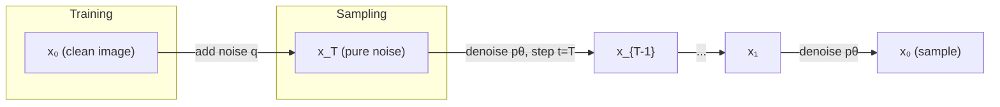
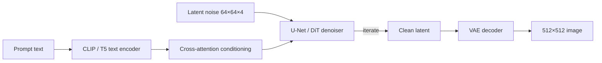

# 7.1 Diffusion and Image Generation

### Study Notes — Book Style · Generative AI Learning Plan · Phase 7 (Multimodal & Generative Media)

> **How to read this file.** This chapter opens Phase 7 by explaining how machines synthesize photorealistic images from text. It leans on the attention machinery from Chapter 1.1 (cross-attention is how text steers pixels), the convolutional and U-Net intuitions from Chapter 0.5 (deep learning foundations), the loss-function reasoning of Chapter 0.4 (diffusion is trained with a simple regression loss), and the joint image-text embedding space of Chapter 4.1 / 7.3 (CLIP is the text encoder that conditions the model). Read 7.2 afterward to contrast diffusion with VAEs and GANs, and 7.3 to see how the same CLIP encoder powers understanding rather than generation.
>
> **Sources synthesized:** Ho et al. *DDPM* (2020); Song et al. *DDIM* (2021); Rombach et al. *Latent Diffusion / Stable Diffusion* (2022); Ho & Salimans *Classifier-Free Guidance* (2022); Zhang et al. *ControlNet* (2023); Hu et al. *LoRA* (2021); Black Forest Labs *FLUX* (2024); Hugging Face `diffusers` documentation (2024–2026).

---

## 1. The core idea: learn to denoise

**Definition.** A *diffusion model* is a generative model that learns to reverse a gradual noising process. During training we take a real image and progressively add Gaussian noise until it becomes pure static; the network learns to predict and remove that noise step by step. At inference we start from pure noise and run the learned denoiser repeatedly, sculpting a coherent image out of randomness.

**Intuition.** Imagine a photograph dissolving grain by grain into TV static — that is easy and requires no learning. The hard, valuable skill is running the film *backward*: given a slightly noisy image, guess what the cleaner version looked like. If you can do that one small step reliably, you can chain hundreds of tiny steps to walk all the way from noise back to a photo. Diffusion trades one impossibly hard jump (noise → image) for many easy, learnable nudges.

**Example.** Consider a 512×512 photo of a corgi. The forward process defines a schedule of timesteps `t = 1…1000`. At `t = 200` the corgi is faintly grainy; at `t = 800` it is almost unrecognizable snow. We show the network `(noisy_image, t)` and ask it to output the noise that was added. Because we generated that noise ourselves, we know the exact answer, so training is fully supervised despite the model being "generative."

### 1.1 Forward process (fixed, no learning)

The forward process `q` adds noise according to a variance schedule `β_t`. A key algebraic trick lets us jump to *any* timestep in one shot:

`x_t = √(ᾱ_t) · x_0 + √(1 − ᾱ_t) · ε`, where `ε ~ N(0, I)` and `ᾱ_t = ∏(1 − β_s)`.

This closed form is why training is cheap: we never simulate 1000 sequential steps to make a training sample — we sample a random `t`, compute `x_t` directly, and train.

### 1.2 Reverse process (learned)

The reverse process `p_θ` is a neural network (historically a **U-Net**, increasingly a transformer) that predicts the noise `ε_θ(x_t, t)`. The training objective — from Chapter 0.4's loss vocabulary — is simply mean-squared error between predicted and true noise:

`L = E[ ‖ε − ε_θ(x_t, t)‖² ]`.

That is it. A photorealistic image generator is trained on a plain regression loss.



---

## 2. Samplers: DDPM vs DDIM and step count

**Definition.** A *sampler* (or scheduler) is the algorithm that turns the network's per-step noise predictions into the sequence of images `x_T → x_0`. **DDPM** is the original stochastic sampler requiring many steps (~1000). **DDIM** reformulates sampling as a deterministic process that can skip timesteps, producing comparable quality in 20–50 steps.

**Intuition.** DDPM walks down a staircase one small stair at a time and adds a little random jitter on each step. DDIM realizes the staircase is really a smooth ramp (an ODE), so it can take big, confident strides and skip most stairs. Fewer steps means faster generation — the difference between 30 seconds and 1 second per image.

**Example.** With Stable Diffusion, 50 DDIM steps typically saturate quality; going to 150 rarely helps and wastes compute. Modern samplers (DPM++ 2M Karras, Euler ancestral, and 2024–2026 distilled few-step methods like LCM, Turbo, and rectified-flow schedulers used by FLUX) push good results down to 1–8 steps.

---

## 3. Latent diffusion: Stable Diffusion's key trick

**Definition.** *Latent diffusion* runs the entire diffusion process not on raw pixels but inside the compressed latent space of a pretrained **variational autoencoder** (see Chapter 7.2). An encoder shrinks a 512×512×3 image to, say, a 64×64×4 latent; diffusion happens there; a decoder expands the final latent back to pixels.

**Intuition.** Pixels are wasteful — most of an image's bits encode texture the eye barely notices. Denoising 64×64×4 latents is roughly 48× cheaper than denoising 512×512×3 pixels, which is precisely why Stable Diffusion could run on a consumer GPU while pixel-space models needed data centers.

**Example.** Stable Diffusion 1.5, SDXL, SD3, and FLUX are all latent diffusion models. The VAE is trained once and frozen; all the "learning to draw" happens in the latent U-Net or diffusion transformer.



---

## 4. Text-to-image conditioning

**Definition.** *Conditioning* injects the meaning of a text prompt into the denoiser so the generated image matches the words. The prompt is tokenized and encoded by a text encoder (the **CLIP** text encoder from Chapter 7.3, and additionally a large T5 encoder in SD3/FLUX). Those text embeddings enter the U-Net through **cross-attention** layers (the same attention mechanism from Chapter 1.1), where image latents form the queries and text tokens form the keys and values.

**Intuition.** Cross-attention lets every spatial region of the forming image "ask" the prompt what it should become. A patch developing near the top can attend strongly to the token "sky," while a lower patch attends to "grass." Attention is the wiring that binds words to regions.

**Example.** For the prompt *"a red vintage car on a snowy street, cinematic lighting,"* early denoising steps lay out coarse composition (a car-shaped blob, a bright ground), and later steps, guided by cross-attention to "red," "vintage," and "snowy," refine color, styling, and texture.

### 4.1 Prompts and negative prompts

**Definition.** A *negative prompt* is text describing what you do **not** want; the sampler steers away from its embedding. **Definition.** Standard *prompts* describe desired content, style, and quality cues.

**Example.** Prompt: `"portrait of a data scientist, soft studio light, 85mm, highly detailed"`. Negative: `"blurry, extra fingers, watermark, low quality, deformed"`. The negative prompt is implemented via classifier-free guidance (next section) by substituting it for the unconditional branch.

---

## 5. Classifier-free guidance (CFG)

**Definition.** *Classifier-free guidance* strengthens prompt adherence by running the denoiser twice — once conditioned on the prompt, once unconditioned — and extrapolating: `ε = ε_uncond + s · (ε_cond − ε_uncond)`, where `s` is the guidance scale.

**Intuition.** The difference `(ε_cond − ε_uncond)` is the direction that makes the image "more about the prompt." Multiplying it by `s > 1` pushes further in that direction. Low `s` (≈1–3) yields creative but loosely-related images; high `s` (≈12+) hugs the prompt tightly but can look over-saturated and unnatural. Typical sweet spot is 5–8 (and much lower, ≈1.5–3.5, for distilled/flow models like FLUX).

**Example.** At `s = 2`, "a cat wearing a top hat" may produce a stylish cat with a vague hat. At `s = 9`, the hat is unmistakable but colors may burn. Tuning CFG is one of the highest-leverage knobs a practitioner controls.

---

## 6. Control and personalization: ControlNet, LoRA, FLUX

**Definition — ControlNet.** A ControlNet is an add-on network that conditions generation on a spatial map — a pose skeleton, depth map, Canny edge map, or segmentation — so the output follows a precise structure while the base model supplies style and texture.

**Definition — LoRA.** *Low-Rank Adaptation* (from Chapter 1.1's fine-tuning family) freezes the base model and trains tiny low-rank weight deltas. For images, a LoRA of a few megabytes can teach a new character, product, or art style without retraining billions of parameters.

**Definition — FLUX.** FLUX (Black Forest Labs, 2024) is a state-of-the-art open family of *rectified-flow* diffusion transformers (DiT) that replaced the U-Net with a transformer backbone, delivering strong prompt adherence and text rendering, with fast few-step distilled variants (FLUX.schnell) and higher-fidelity ones (FLUX.dev / pro).

**Intuition.** ControlNet answers "put the subject *here*, in *this* pose"; LoRA answers "make it look like *this specific thing*"; FLUX represents the 2026 architectural frontier where diffusion adopts transformer scaling laws.

**Example.** An e-commerce team trains a LoRA on 20 photos of a handbag, then uses a depth-map ControlNet to place that bag consistently onto model photos in dozens of poses — same product, new scenes, no photoshoot.

---

## 7. Runnable Python (diffusers)

The open-source path uses Hugging Face `diffusers`; the API path uses hosted endpoints. Below is the open path.

```python
# pip install diffusers transformers accelerate torch
import torch
from diffusers import StableDiffusionXLPipeline, DDIMScheduler

pipe = StableDiffusionXLPipeline.from_pretrained(
    "stabilityai/stable-diffusion-xl-base-1.0",
    torch_dtype=torch.float16,
).to("cuda")

# Swap in a fast deterministic sampler
pipe.scheduler = DDIMScheduler.from_config(pipe.scheduler.config)

image = pipe(
    prompt="a red vintage car on a snowy street, cinematic lighting, 8k",
    negative_prompt="blurry, watermark, deformed, low quality",
    num_inference_steps=30,      # sampler steps
    guidance_scale=7.0,          # CFG scale
    generator=torch.Generator("cuda").manual_seed(42),  # reproducibility
).images[0]

image.save("car.png")
```

Loading a LoRA is a one-liner: `pipe.load_lora_weights("path/to/handbag_lora")`. For a hosted API you would instead POST the prompt to a provider endpoint and receive a URL or base64 image — trading control and cost predictability for zero infrastructure.

---

## 8. Real-world industry use cases

**E-commerce (primary).** Product imagery at scale: generate lifestyle backgrounds for catalog cutouts, create seasonal variants (a sofa in a summer vs winter room), and produce localized ad creative. ControlNet keeps the actual product pixel-accurate while diffusion restyles the scene, and a per-SKU LoRA guarantees brand consistency. This collapses photoshoot budgets and turnaround from weeks to minutes.

**Finance.** Marketing and communications teams generate compliant, on-brand illustrations for reports, app onboarding, and social campaigns without stock-photo licensing. Diffusion is also used for **synthetic document generation** — creating realistic-but-fake invoices, checks, and IDs to train fraud-detection and OCR models (Chapter 7.3) where real labeled fraud data is scarce and privacy-sensitive. Additionally, diffusion-based tabular synthesizers create privacy-preserving synthetic transaction datasets for model development.

**Other.** Game asset generation, architectural visualization, and medical imaging augmentation (with careful regulatory review).

---

## 9. Common pitfalls

- **Cranking CFG too high.** Guidance scales above ~12 cause over-saturation, "fried" contrast, and duplicated subjects. Tune per-model; flow models want *low* CFG.
- **Too many steps.** Beyond the sampler's saturation point, extra steps burn compute for no visible gain. Match steps to the sampler (30 for DDIM, 4–8 for LCM/Turbo).
- **Ignoring the seed.** Without a fixed `generator` seed, results are irreproducible — a nightmare for A/B tests and debugging.
- **Prompt-as-magic-spell.** Piling on quality tokens ("masterpiece, 8k, trending") has diminishing returns on modern models; clear compositional description matters more.
- **VAE mismatch.** Using the wrong VAE with a checkpoint produces washed-out or artifacted colors.
- **Anatomy and text.** Hands and rendered text remain classic failure modes; FLUX and SD3 improved text rendering markedly, but verification is still needed.
- **Copyright and consent.** Training-data provenance, style mimicry, and deepfake risk are live legal and ethical issues as of 2026 — never generate real people's likenesses without consent, and watermark synthetic media.

---

## Wrap-Up

**Through-line.** Diffusion reframes the hard problem of generation as many easy denoising steps trained with the humble MSE loss of Chapter 0.4, executed by attention-driven networks from Chapter 1.1, conditioned by the CLIP text encoder you will meet again in Chapter 7.3, and made efficient by the VAE compression detailed in Chapter 7.2. Where diffusion generates media, the next chapter (7.2) situates it against its predecessors — VAEs and GANs — and 7.3 shows the flip side: using the same multimodal embedding space to *understand* images rather than draw them.

**Quick-reference table.**

| Concept | One-line takeaway |
|---|---|
| Forward process | Fixed noising; closed-form jump to any `t` |
| Reverse process | Learned denoiser, MSE on predicted noise |
| DDPM vs DDIM | Stochastic/many-step vs deterministic/few-step |
| Latent diffusion | Diffuse in VAE latent space → ~48× cheaper |
| Conditioning | CLIP/T5 text via cross-attention |
| CFG scale | Higher = closer to prompt, but can burn |
| ControlNet | Spatial control (pose/depth/edges) |
| LoRA | Tiny weight deltas for style/subject |
| FLUX | Rectified-flow diffusion transformer (2024+) |

**Interview Questions & Answers.**

1. *Q: What does the network actually predict in DDPM?* A: The noise `ε` added at timestep `t` (equivalently the score); the image is reconstructed by subtracting predicted noise.
2. *Q: Why is diffusion training supervised despite being generative?* A: We add the noise ourselves, so the target is known — it is regression against a ground-truth noise tensor.
3. *Q: Why does latent diffusion run faster than pixel diffusion?* A: It denoises a small compressed latent (e.g., 64×64×4) instead of full pixels, cutting compute by tens of times.
4. *Q: DDIM vs DDPM in one sentence?* A: DDIM is a deterministic, step-skipping reformulation enabling high quality in far fewer steps.
5. *Q: How does text condition the image?* A: Text is encoded (CLIP/T5) and injected via cross-attention where image latents are queries and text tokens are keys/values.
6. *Q: What is classifier-free guidance?* A: Extrapolating between conditional and unconditional noise predictions to strengthen prompt adherence, scaled by CFG.
7. *Q: What breaks at very high CFG?* A: Over-saturation, artifacts, and subject duplication.
8. *Q: ControlNet vs LoRA?* A: ControlNet adds spatial/structural control; LoRA cheaply adapts style or subject via low-rank weight deltas.
9. *Q: Why did FLUX/SD3 switch to transformers?* A: Diffusion transformers (DiT) scale better and, with T5 conditioning, improve prompt adherence and text rendering.
10. *Q: Why fix the random seed?* A: Reproducibility — same seed, prompt, and settings yield the same image, essential for debugging and evaluation.
11. *Q: What does the VAE do in Stable Diffusion?* A: Encodes images to latents for diffusion and decodes final latents back to pixels.

**Mini-glossary.** *Timestep* — position in the noise schedule. *Scheduler/sampler* — algorithm mapping noise predictions to images. *Latent* — compressed image representation. *Cross-attention* — mechanism binding text tokens to image regions. *CFG* — classifier-free guidance scale. *DiT* — diffusion transformer. *Rectified flow* — straight-path generative formulation used by FLUX/SD3.

**Further reading.** Ho et al. (DDPM, 2020); Rombach et al. (Latent Diffusion, 2022); Ho & Salimans (CFG, 2022); Zhang et al. (ControlNet, 2023); Peebles & Xie (DiT, 2023); Hugging Face `diffusers` docs; Black Forest Labs FLUX technical notes (2024).
