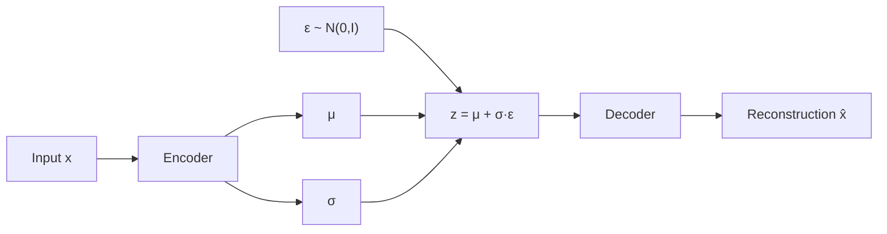
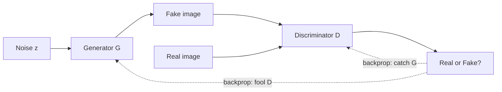

# 7.2 VAEs and GANs

### Study Notes — Book Style · Generative AI Learning Plan · Phase 7 (Multimodal & Generative Media)

> **How to read this file.** This chapter fills in the two generative families that came *before* diffusion and still power large parts of the modern stack. It builds directly on Chapter 0.4 (loss functions — VAEs and GANs are, at heart, two very different losses) and Chapter 0.5 (deep learning foundations, CNN encoders/decoders). It connects forward to Chapter 7.1, where you learned that Stable Diffusion runs *inside a VAE's latent space* — so the VAE here is the same component. It also links to Chapter 4.1 (embeddings): a VAE's latent code is a learned, structured embedding. Read 7.1 first for diffusion; read this to understand why the field moved from GANs to diffusion and where each method still wins.
>
> **Sources synthesized:** Kingma & Welling *Auto-Encoding Variational Bayes* (2013); Goodfellow et al. *Generative Adversarial Nets* (2014); Radford et al. *DCGAN* (2016); Arjovsky et al. *Wasserstein GAN* (2017); Karras et al. *StyleGAN2/3* (2020–2021); Esser et al. *VQGAN / taming transformers* (2021); Rombach et al. *Latent Diffusion* (2022).

---

## 1. Autoencoders: the common ancestor

**Definition.** An *autoencoder* is a neural network trained to reconstruct its own input through a narrow bottleneck. An **encoder** compresses input `x` into a low-dimensional code `z`; a **decoder** reconstructs `x̂` from `z`. Training minimizes reconstruction error (e.g., MSE from Chapter 0.4).

**Intuition.** Force information through a small pipe and the network must learn to keep only what matters — an automatic, learned compression. The bottleneck code `z` becomes a compact description of the input, much like an embedding (Chapter 4.1).

**Example.** A 784-pixel MNIST digit squeezed to a 16-dimensional code and reconstructed. The 16 numbers capture "which digit, what slant, how thick." A plain autoencoder is great at compression and denoising but poor at *generation*: its latent space has holes, so sampling a random `z` usually decodes to garbage.

---

## 2. Variational autoencoders (VAEs)

**Definition.** A *VAE* is a probabilistic autoencoder whose encoder outputs a *distribution* over `z` — a mean `μ` and variance `σ²` — rather than a single point. Decoding a sample from that distribution reconstructs the input. Training maximizes the **Evidence Lower Bound (ELBO)**, equivalently minimizing:

`L = reconstruction_loss + β · KL( q(z|x) ‖ N(0, I) )`.

**Intuition.** The KL term is a regularizer that pulls every encoded distribution toward a standard Gaussian. This *fills the gaps* in latent space: because all codes cluster around the same well-behaved region, a randomly sampled `z ~ N(0, I)` lands somewhere meaningful and decodes to a plausible new sample. The VAE trades a little reconstruction sharpness for a smooth, sampleable latent space.

**Example.** Encode faces; walk a straight line in latent space from one person's code to another's and the decoded images morph smoothly (add glasses, change hair). That smoothness is the KL term's gift.

### 2.1 The reparameterization trick

**Definition.** To backpropagate through the random sampling step, we rewrite `z = μ + σ · ε` where `ε ~ N(0, I)`. Randomness is moved into `ε`, an input, so gradients flow through `μ` and `σ`.

**Intuition.** You cannot differentiate "draw a random sample." But you *can* differentiate "scale and shift a fixed random number." The trick separates the stochastic part (`ε`) from the learnable part (`μ`, `σ`), making the whole network trainable by gradient descent.



### 2.2 Why VAEs matter in 2026

The VAE inside Stable Diffusion (Chapter 7.1) is exactly this component, often trained with a perceptual + adversarial objective (VQGAN-style) for crisper decoding. VAEs remain the workhorse compressor that makes latent diffusion feasible.

---

## 3. Generative adversarial networks (GANs)

**Definition.** A *GAN* pits two networks against each other. A **generator** `G` maps random noise `z` to fake samples; a **discriminator** `D` tries to classify samples as real (from data) or fake (from `G`). They train in a **minimax** game:

`min_G max_D  E[log D(x)] + E[log(1 − D(G(z)))]`.

**Intuition.** Think of a counterfeiter (`G`) and a detective (`D`). The detective learns to spot fakes; the counterfeiter learns to fool the detective. As each improves, the counterfeit money (generated images) becomes indistinguishable from real. There is no explicit likelihood or reconstruction loss — quality emerges purely from the adversarial pressure.

**Example.** DCGAN generates 64×64 bedrooms; StyleGAN2 generates megapixel photorealistic faces (`thispersondoesnotexist.com`). GANs produce famously *sharp* images because the discriminator penalizes any blur the way a detective spots a smudged bill — unlike VAEs, which average and soften.



### 3.1 Failure modes: mode collapse and instability

**Definition — mode collapse.** The generator discovers a few outputs that reliably fool `D` and produces only those, ignoring the data's full diversity.

**Definition — training instability.** Because two networks chase a moving target, training can oscillate or diverge; if `D` gets too strong, its gradient to `G` vanishes and learning stalls.

**Intuition.** If the counterfeiter finds one perfect fake $20 bill, why make anything else? That is mode collapse — impressive per-sample quality, catastrophic diversity. And because both players keep changing strategy, the game rarely converges cleanly the way a single loss (Chapter 0.4) descends.

**Example.** A GAN asked to generate all ten MNIST digits emits only convincing 1s and 7s. Metrics like FID capture this: sharp but not diverse.

### 3.2 Wasserstein GAN (WGAN)

**Definition.** *WGAN* replaces the classification objective with the **Wasserstein (earth-mover) distance**. The discriminator becomes a "critic" outputting a real-valued score instead of a probability, constrained to be Lipschitz (via weight clipping or, better, a gradient penalty — WGAN-GP).

**Intuition.** The original GAN loss provides poor gradients when the real and fake distributions barely overlap (common early in training). Wasserstein distance measures "how much probability mass to move how far," giving smooth, informative gradients everywhere — a more stable game with a loss that actually correlates with sample quality.

**Example.** WGAN-GP training curves are far more monotonic; the critic loss tracks visual improvement, letting practitioners know when to stop.

---

## 4. Runnable Python (a minimal VAE in PyTorch)

```python
# pip install torch
import torch, torch.nn as nn, torch.nn.functional as F

class VAE(nn.Module):
    def __init__(self, in_dim=784, latent=16):
        super().__init__()
        self.enc = nn.Linear(in_dim, 256)
        self.mu = nn.Linear(256, latent)
        self.logvar = nn.Linear(256, latent)
        self.dec1 = nn.Linear(latent, 256)
        self.dec2 = nn.Linear(256, in_dim)

    def encode(self, x):
        h = F.relu(self.enc(x))
        return self.mu(h), self.logvar(h)

    def reparameterize(self, mu, logvar):
        std = torch.exp(0.5 * logvar)          # σ
        eps = torch.randn_like(std)            # ε ~ N(0, I)
        return mu + eps * std                  # the trick

    def decode(self, z):
        return torch.sigmoid(self.dec2(F.relu(self.dec1(z))))

    def forward(self, x):
        mu, logvar = self.encode(x)
        z = self.reparameterize(mu, logvar)
        return self.decode(z), mu, logvar

def loss_fn(recon, x, mu, logvar, beta=1.0):
    recon_loss = F.binary_cross_entropy(recon, x, reduction="sum")
    kl = -0.5 * torch.sum(1 + logvar - mu.pow(2) - logvar.exp())  # KL to N(0,I)
    return recon_loss + beta * kl

# generation: sample z ~ N(0,I) and decode
model = VAE()
with torch.no_grad():
    new_samples = model.decode(torch.randn(8, 16))
```

The two lines that *are* the VAE: `reparameterize` (the trick) and the `kl` term (the ELBO regularizer). A GAN would instead alternate optimizing a generator and a discriminator with `nn.BCEWithLogitsLoss`.

---

## 5. VAE vs GAN vs Diffusion

| Dimension | VAE | GAN | Diffusion |
|---|---|---|---|
| Objective | ELBO (recon + KL) | Adversarial minimax | Denoising MSE |
| Sample quality | Softer/blurry | Very sharp | State-of-the-art |
| Sample diversity | Good | Prone to mode collapse | Excellent |
| Training stability | Stable | Unstable | Stable |
| Likelihood | Approximate (ELBO) | None | Approximate |
| Sampling speed | 1 pass (fast) | 1 pass (fast) | Many steps (slower) |
| Latent space | Smooth, structured | Structured (StyleGAN) | Not the point |
| 2026 role | Compressor in LDM | Real-time/upscaling | Dominant generator |

**Intuition for the trade-off.** VAEs optimize an explicit likelihood bound → stable but blurry. GANs optimize sharpness via a critic → gorgeous but fragile and low-diversity. Diffusion optimizes a simple regression over many steps → stable *and* high-quality *and* diverse, at the cost of slower, multi-step sampling. Diffusion effectively won the "unconditional image quality" race after 2021, which is why 7.1 leads Phase 7.

---

## 6. Where each is used today

**E-commerce.** GANs power **real-time** experiences where diffusion's multi-step latency is too slow: virtual try-on, super-resolution upscaling of thumbnail product images, and instant face/background retouching in seller apps. VAEs quietly run inside every latent-diffusion product-image generator (Chapter 7.1). VAE latent spaces also drive **recommendation** and anomaly detection on catalog behavior.

**Finance.** VAEs are widely used for **anomaly and fraud detection**: train a VAE on legitimate transactions; genuine transactions reconstruct with low error, while fraudulent ones — lying off the learned manifold — produce high reconstruction error and get flagged. VAEs and GANs both generate **synthetic tabular data** (transactions, credit records) for privacy-preserving model development and for balancing rare fraud classes. GANs (e.g., TimeGAN-style) simulate **synthetic market/time-series scenarios** for stress-testing and backtesting.

**Other.** GAN super-resolution (ESRGAN) in media pipelines; VAEs for molecular and drug design (smooth chemical latent spaces); GAN inversion for face editing.

---

## 7. Common pitfalls

- **Posterior collapse (VAE).** With a too-strong decoder or too-large `β`, the model ignores `z` and the KL term drives everything to the prior — reconstructions become generic. Use KL annealing or β-VAE tuning.
- **Blurry VAE outputs.** Pure pixel MSE encourages averaging; add perceptual/adversarial losses (VQGAN) for sharpness.
- **Mode collapse (GAN).** Monitor diversity (not just per-sample quality); use minibatch discrimination, spectral normalization, or WGAN-GP.
- **Unbalanced GAN training.** If `D` overpowers `G`, gradients vanish. Balance learning rates (e.g., TTUR) and never train `D` to optimality each step.
- **Weight clipping in WGAN.** Naive clipping causes capacity/gradient problems; prefer the gradient penalty (WGAN-GP).
- **Reparameterization mistake.** Using `logvar` inconsistently (forgetting the `0.5` in `std = exp(0.5·logvar)`) silently corrupts training.
- **Misusing FID.** FID rewards realism but is insensitive to some diversity failures; report multiple metrics.

---

## Wrap-Up

**Through-line.** These are the two answers the field tried before diffusion: VAEs bought a smooth, sampleable latent space with a KL-regularized likelihood bound, and GANs bought razor sharpness with an adversarial game — at the price of instability and mode collapse. Diffusion (Chapter 7.1) later combined stability *and* quality *and* diversity, which is why it dominates generation today. But neither ancestor is obsolete: the VAE is literally the compressor inside Stable Diffusion, and GANs still own the real-time and super-resolution niches where multi-step sampling is too slow. Chapter 7.3 pivots from generating images to *understanding* them with CLIP and vision-language models — where the encoder-embedding intuition from this chapter and Chapter 4.1 returns.

**Quick-reference table.**

| Concept | Takeaway |
|---|---|
| Autoencoder | Reconstruct through a bottleneck; not generative |
| VAE | Probabilistic AE; ELBO = recon + KL; sampleable |
| Reparameterization | `z = μ + σ·ε` to allow backprop |
| GAN | Generator vs discriminator minimax game |
| Mode collapse | Low diversity; generator repeats a few outputs |
| WGAN | Wasserstein distance → stable gradients |
| VAE vs GAN vs Diffusion | Stable-blurry vs sharp-fragile vs best-but-slow |

**Interview Questions & Answers.**

1. *Q: Why can't a plain autoencoder generate new samples well?* A: Its latent space is unstructured with gaps, so random codes decode to noise.
2. *Q: What two terms make up the VAE loss?* A: Reconstruction loss plus KL divergence to a standard-Gaussian prior.
3. *Q: What problem does the reparameterization trick solve?* A: It lets gradients flow through the stochastic sampling step by expressing `z = μ + σ·ε`.
4. *Q: Why are VAE images often blurry?* A: Pixel-wise reconstruction loss encourages averaging over plausible outputs.
5. *Q: State the GAN objective in words.* A: The discriminator maximizes correct real/fake classification while the generator minimizes it — a minimax game.
6. *Q: What is mode collapse?* A: The generator produces only a few outputs that fool `D`, losing data diversity.
7. *Q: How does WGAN improve stability?* A: It uses the Wasserstein distance, giving meaningful gradients even when real and fake distributions barely overlap.
8. *Q: Why prefer gradient penalty over weight clipping in WGAN?* A: Clipping harms capacity and gradient flow; the penalty enforces the Lipschitz constraint more cleanly.
9. *Q: Where do VAEs appear inside diffusion models?* A: As the encoder/decoder defining the latent space of latent diffusion (Stable Diffusion).
10. *Q: Give a finance use of a VAE.* A: Fraud/anomaly detection via reconstruction error on transactions.
11. *Q: Why did diffusion overtake GANs for image generation?* A: It offers comparable/better quality with stable training and high diversity, avoiding mode collapse.

**Mini-glossary.** *Bottleneck* — narrow latent layer. *ELBO* — evidence lower bound, the VAE objective. *KL divergence* — distance between distributions, the VAE regularizer. *Latent code* — compressed representation `z`. *Critic* — WGAN's real-valued discriminator. *FID* — Fréchet Inception Distance, a generation-quality metric. *Posterior collapse* — VAE ignoring its latent.

**Further reading.** Kingma & Welling (2013); Goodfellow et al. (2014); Arjovsky et al. (WGAN, 2017); Gulrajani et al. (WGAN-GP, 2017); Karras et al. (StyleGAN2, 2020); Esser et al. (VQGAN, 2021).
