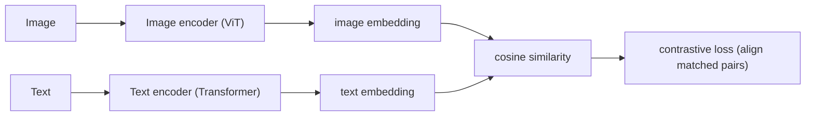
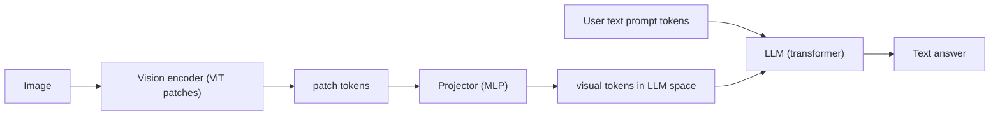

# 7.3 CLIP and Vision-Language Models

### Study Notes — Book Style · Generative AI Learning Plan · Phase 7 (Multimodal & Generative Media)

> **How to read this file.** This chapter is the "understanding" counterpart to the "generation" chapters around it. It extends the embedding intuition of Chapter 4.1 (CLIP produces a *shared* image-text embedding space, and its text encoder is the exact one conditioning diffusion in Chapter 7.1). It reuses the transformer/attention machinery of Chapter 1.1 (VLMs feed image tokens into an ordinary LLM) and the CNN/vision-encoder foundations of Chapter 0.5. Read 7.1 to see CLIP driving generation; read this to see the same multimodal space powering search, classification, and full vision-language reasoning; then 7.4 completes the modalities with audio.
>
> **Sources synthesized:** Radford et al. *CLIP* (2021); Jia et al. *ALIGN* (2021); Li et al. *BLIP-2* (2023); Liu et al. *LLaVA* (2023–2024); OpenAI *GPT-4o* (2024); Anthropic *Claude 3/4 vision*; Google *Gemini* (2024–2025); Alibaba *Qwen2-VL / Qwen2.5-VL* (2024–2025); Meta *Llama 3.2 Vision* (2024).

---

## 1. CLIP: connecting images and text

**Definition.** *CLIP* (Contrastive Language-Image Pre-training) trains two encoders — an image encoder (ViT or CNN) and a text encoder (Transformer) — so that matching image-caption pairs land close together in a **shared embedding space**, and mismatched pairs land far apart. It is trained on hundreds of millions of noisy web (image, caption) pairs.

**Intuition.** Instead of teaching a model a fixed list of labels, CLIP teaches it to *measure agreement* between any image and any sentence. If a photo of a dog and the text "a photo of a dog" point in the same direction in embedding space, the model has learned the concept — not just the label ID. This is the embedding idea of Chapter 4.1 extended across two modalities into one common vector space.

**Example.** Embed the image of a golden retriever → vector `v_img`. Embed candidate texts "a photo of a dog," "a photo of a cat," "a photo of a car" → `v₁, v₂, v₃`. Whichever text vector has the highest cosine similarity with `v_img` wins. That is classification with *no task-specific training* — **zero-shot**.

### 1.1 The contrastive objective

**Definition.** For a batch of `N` image-text pairs, CLIP computes an `N×N` similarity matrix and uses a symmetric cross-entropy loss (Chapter 0.4) that pushes the `N` correct diagonal pairs up and the `N²−N` off-diagonal (mismatched) pairs down.

**Intuition.** Within each batch, every caption is the correct answer for exactly one image and a wrong answer for all others. Learning to pick the right match out of the batch is a powerful, cheap supervision signal that scales to web data.



### 1.2 What CLIP gives us

- **Zero-shot classification** — classify into arbitrary label sets defined by text at inference time.
- **Multimodal search / retrieval** — text-to-image and image-to-image search (query and corpus share one space).
- **A frozen text encoder** for diffusion conditioning (Chapter 7.1).
- **Embeddings** for multimodal RAG (Section 4).

---

## 2. Runnable Python (CLIP zero-shot)

```python
# pip install transformers torch pillow
import torch
from PIL import Image
from transformers import CLIPProcessor, CLIPModel

model = CLIPModel.from_pretrained("openai/clip-vit-base-patch32")
proc = CLIPProcessor.from_pretrained("openai/clip-vit-base-patch32")

image = Image.open("product.jpg")
labels = ["a sneaker", "a leather handbag", "a wristwatch", "a t-shirt"]

inputs = proc(text=labels, images=image, return_tensors="pt", padding=True)
with torch.no_grad():
    out = model(**inputs)

# similarity of the image to each text label -> softmax to probabilities
probs = out.logits_per_image.softmax(dim=1)[0]
for label, p in zip(labels, probs):
    print(f"{label:20s} {p.item():.3f}")
```

No fine-tuning, no labeled training set — you defined the classes as sentences at runtime. To build a search index, store `model.get_image_features(...)` vectors in a vector database and query with `model.get_text_features(...)`.

---

## 3. Vision-language models (VLMs)

**Definition.** A *vision-language model* is an LLM that also accepts images, producing text that reasons over both. The dominant recipe: a **vision encoder** turns an image into a sequence of visual tokens; a **projector** (an MLP or cross-attention "connector") maps those tokens into the LLM's embedding space; the LLM then treats them like extra "words" in its context and generates a response.

**Intuition.** An LLM only understands token embeddings (Chapter 1.1). So the whole trick of "seeing" is: convert the picture into vectors that *look like word embeddings* to the LLM. Once the image is a handful of pseudo-tokens sitting in the prompt, the LLM's attention reasons over image and text uniformly.

**Example (LLaVA-style pipeline).**

1. A CLIP/SigLIP **ViT** splits the image into patches (e.g., 16×16), embeds each patch (Chapter 0.5's convolution-then-flatten idea generalized), yielding ~256 patch tokens.
2. A small **projector** MLP maps each patch token into the LLM's hidden dimension.
3. These projected tokens are prepended to the text tokens and fed to the LLM (e.g., Vicuna/Llama).
4. The LLM answers: *"The chart shows revenue rising 12% in Q3."*



### 3.1 The current landscape (2026)

**Definition.** Frontier VLMs are natively multimodal: **GPT-4o** (OpenAI), **Claude** (Anthropic), and **Gemini** (Google) are proprietary any-to-text (and increasingly any-to-any) models; **Qwen2.5-VL** (Alibaba) and **Llama 3.2 Vision** (Meta) are strong open-weight options. **BLIP-2** popularized a lightweight "Q-Former" connector; **LLaVA** popularized the simple MLP-projector recipe most open VLMs now follow.

**Intuition.** The differences are largely in the vision encoder resolution handling (tiling for high-res documents), the connector design, and the amount of multimodal instruction tuning — but the architectural skeleton (encoder → projector → LLM) is shared.

### 3.2 Runnable Python (a VLM query)

```python
# pip install transformers torch pillow
from transformers import AutoProcessor, LlavaForConditionalGeneration
from PIL import Image
import torch

model = LlavaForConditionalGeneration.from_pretrained(
    "llava-hf/llava-1.5-7b-hf", torch_dtype=torch.float16, device_map="auto")
proc = AutoProcessor.from_pretrained("llava-hf/llava-1.5-7b-hf")

image = Image.open("invoice.png")
prompt = "USER: <image>\nExtract the total amount due and the due date. ASSISTANT:"

inputs = proc(text=prompt, images=image, return_tensors="pt").to(model.device, torch.float16)
out = model.generate(**inputs, max_new_tokens=100)
print(proc.decode(out[0], skip_special_tokens=True))
```

---

## 4. Use cases

**OCR and document understanding.** Modern VLMs read scanned invoices, forms, receipts, and handwriting directly and return structured fields — no separate OCR engine plus rules pipeline.

**Chart and table understanding.** Ask "what was the QoQ growth?" over a screenshot of a chart; the VLM reads axes, bars, and legends and computes the answer.

**Visual question answering (VQA).** Open-ended questions about any image: "Is this shelf fully stocked?" "What safety violation is visible?"

**Multimodal RAG.** Store CLIP/VLM embeddings of document pages (including figures) in a vector DB; retrieve relevant *pages/images* for a query and feed them to a VLM. This extends the text-RAG pattern (see retrieval chapters) to PDFs, screenshots, and diagrams that text extraction alone would miss.

---

## 5. Real-world industry use cases

**Finance (primary).** Automated **document intelligence**: VLMs extract line items from invoices, parse loan applications, read bank statements and KYC/ID documents, and pull figures from 10-K filings and pitch-deck charts into structured data. In insurance, VLMs assess **vehicle-damage photos** for claims triage. A multimodal RAG assistant lets an analyst ask questions across a folder of annual reports whose key data lives in charts and tables. Guardrails and human review are mandatory for regulated decisions.

**E-commerce (primary).** **Visual search** ("find products like this photo") is CLIP embeddings in a vector database. VLMs **auto-generate product titles, attributes, and descriptions** from a single product image, **moderate** user-uploaded photos (detect prohibited or off-brand content), verify that listing images match the described item, and power **shoppable image** tagging. CLIP-based retrieval also improves recommendation and de-duplication of catalog images.

**Other.** Accessibility (image descriptions for the visually impaired), robotics perception, medical imaging triage (with regulatory oversight), and content moderation at platform scale.

---

## 6. Common pitfalls

- **CLIP prompt sensitivity.** Zero-shot accuracy depends on templating ("a photo of a {label}" beats bare labels); use prompt ensembles.
- **Bias and spurious correlations.** Web-trained CLIP inherits social biases and can latch onto backgrounds/text-in-image rather than the object.
- **VLM hallucination.** VLMs confidently describe objects that are not present, especially with leading questions; ask neutral questions and require grounding.
- **Resolution limits.** Dense documents/tiny text need high-resolution or tiling; default low-res encoders miss fine print — a real failure mode for finance OCR.
- **OCR of stylized/handwritten text.** Still error-prone; validate extracted numbers against checksums/totals.
- **Token cost.** High-resolution images consume many visual tokens, inflating latency and API cost — downscale when detail is not needed.
- **Numeric reasoning over charts.** VLMs may read values approximately; verify critical figures rather than trusting a single pass.
- **Privacy/PII.** Documents and photos often contain PII; handle per policy and avoid logging raw images.

---

## Wrap-Up

**Through-line.** CLIP taught models to place images and text in one shared embedding space (the Chapter 4.1 idea, made multimodal), which simultaneously enabled zero-shot classification, cross-modal search, and the frozen text encoder that conditions diffusion in Chapter 7.1. Vision-language models then closed the loop: convert an image into pseudo-tokens and let an ordinary LLM (Chapter 1.1) reason over pixels and words together. Where 7.1 and 7.2 *generate* media, this chapter *understands* it; Chapter 7.4 adds the final modality — audio — with speech recognition and synthesis, completing the multimodal picture.

**Quick-reference table.**

| Concept | Takeaway |
|---|---|
| CLIP | Contrastive training → shared image-text space |
| Zero-shot classification | Compare image to label sentences via cosine sim |
| Contrastive loss | Match diagonal pairs, repel off-diagonal |
| Vision encoder (ViT) | Image → patch tokens |
| Projector | Maps visual tokens into LLM embedding space |
| VLM | LLM that reads images (encoder→projector→LLM) |
| Multimodal RAG | Retrieve images/pages, answer with a VLM |

**Interview Questions & Answers.**

1. *Q: What is the shared embedding space in CLIP?* A: A common vector space where matching images and captions have high cosine similarity.
2. *Q: How does CLIP enable zero-shot classification?* A: Encode candidate labels as text; pick the label whose embedding is most similar to the image embedding.
3. *Q: Describe CLIP's training loss.* A: Symmetric contrastive cross-entropy over an in-batch similarity matrix, aligning true pairs and separating false ones.
4. *Q: Where does CLIP appear in Stable Diffusion?* A: Its text encoder produces the embeddings that condition the diffusion U-Net via cross-attention.
5. *Q: How does a VLM turn an image into something an LLM can use?* A: A vision encoder makes patch tokens; a projector maps them into the LLM's embedding space as pseudo-tokens.
6. *Q: What is the LLaVA recipe in one line?* A: Frozen ViT + trained MLP projector + LLM, tuned on multimodal instructions.
7. *Q: BLIP-2's connector vs LLaVA's?* A: BLIP-2 uses a learned Q-Former; LLaVA uses a simple MLP projector.
8. *Q: Why can high-resolution documents fail?* A: Low-res encoders lose fine text; tiling or high-res inputs are needed.
9. *Q: What is multimodal RAG?* A: Retrieval over image/page embeddings, feeding retrieved visuals to a VLM to answer.
10. *Q: Name a finance and an e-commerce VLM use.* A: Invoice/statement extraction (finance); visual search and auto-generated product descriptions (e-commerce).
11. *Q: Biggest reliability risk with VLMs?* A: Hallucinating unseen objects/values — mitigate with neutral prompts, grounding, and verification.

**Mini-glossary.** *Contrastive learning* — training by pulling matches together and pushing mismatches apart. *ViT* — Vision Transformer. *Patch token* — embedding of an image patch. *Projector/connector* — module mapping visual tokens into LLM space. *Zero-shot* — classifying without task-specific training. *VQA* — visual question answering. *SigLIP* — a sigmoid-loss CLIP variant used in newer VLMs.

**Further reading.** Radford et al. (CLIP, 2021); Dosovitskiy et al. (ViT, 2021); Li et al. (BLIP-2, 2023); Liu et al. (LLaVA, 2023–2024); Qwen2.5-VL and Llama 3.2 Vision technical reports (2024–2025).
