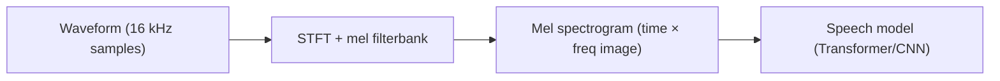
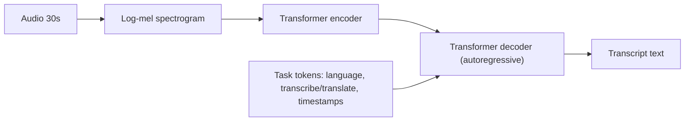
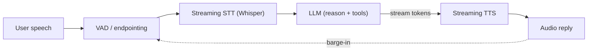

# 7.4 Speech: Whisper and TTS

### Study Notes — Book Style · Generative AI Learning Plan · Phase 7 (Multimodal & Generative Media)

> **How to read this file.** This chapter completes Phase 7's tour of modalities by adding audio: turning speech into text (ASR) and text into speech (TTS), then wiring both around an LLM to build voice agents. It reuses the encoder-decoder Transformer of Chapter 1.1 (Whisper *is* a Transformer), the spectrogram-as-image intuition connecting to the CNN/vision foundations of Chapter 0.5, and the generative-media mindset of 7.1–7.2 (neural TTS synthesizes audio much as diffusion synthesizes images). It also pairs naturally with the VLMs of 7.3 to reach fully multimodal, any-to-any assistants. Read this last in Phase 7 to see all modalities meet in a single real-time pipeline.
>
> **Sources synthesized:** Radford et al. *Whisper* (2022); Vaswani et al. *Attention Is All You Need* (2017); Wang et al. *Tacotron 2* (2018); Oord et al. *WaveNet* (2016); Kong et al. *HiFi-GAN* (2020); *VALL-E* / neural codec TTS (2023); OpenAI Realtime API and streaming voice systems (2024–2026).

---

## 1. Audio representations: the mel spectrogram

**Definition.** A raw audio waveform is a 1-D sequence of ~16,000 amplitude samples per second — far too long and low-level to model directly. A *mel spectrogram* transforms it (via the short-time Fourier transform) into a 2-D image: time on one axis, frequency (on a perceptual "mel" scale) on the other, with color = energy.

**Intuition.** The ear does not hear individual samples; it hears *which frequencies are present over time*. A mel spectrogram makes that explicit and turns audio into something that looks and behaves like an image — which is why speech models borrow the convolutional and Transformer machinery of Chapters 0.5 and 1.1.

**Example.** The spoken word "hello" becomes a spectrogram with characteristic horizontal bands (formants) sliding through time. Most speech models — for both recognition and synthesis — operate on mel spectrograms rather than raw waveforms, with a final step converting spectrogram ↔ waveform.



---

## 2. Automatic speech recognition (ASR): Whisper

**Definition.** *ASR* converts speech audio to text. **Whisper** (OpenAI, 2022) is an encoder-decoder Transformer trained on ~680k hours of multilingual, weakly-supervised web audio. The encoder ingests a 30-second log-mel spectrogram; the decoder autoregressively generates text tokens, using special tokens to select the task (transcribe vs translate), language, and timestamps.

**Intuition.** Whisper is architecturally the same encoder-decoder Transformer from Chapter 1.1 used in translation — except the "source language" is audio (a spectrogram) and the "target language" is text. Its robustness comes not from a clever architecture but from massive, diverse, noisy training data, which makes it resilient to accents, background noise, and jargon in a true zero-shot fashion.

**Example.** Feed a noisy 30-second customer call clip; Whisper emits a punctuated transcript, auto-detects the language, and can optionally translate non-English speech directly into English text — all in one model.



### 2.1 Runnable Python (Whisper)

```python
# pip install openai-whisper  (or faster-whisper for speed)
import whisper

model = whisper.load_model("small")          # tiny/base/small/medium/large-v3
result = model.transcribe("call.wav", language="en", task="transcribe")

print(result["text"])                        # full transcript
for seg in result["segments"]:               # timestamped segments
    print(f"[{seg['start']:.1f}-{seg['end']:.1f}] {seg['text']}")
```

For production, `faster-whisper` (CTranslate2) or `whisperX` (word-level timestamps + diarization) give large speedups, and streaming wrappers enable near-real-time partial transcripts.

---

## 3. Text-to-speech (TTS)

**Definition.** *Neural TTS* synthesizes natural-sounding speech from text. Classic two-stage systems use an **acoustic model** (text → mel spectrogram, e.g., Tacotron 2/FastSpeech) plus a **vocoder** (spectrogram → waveform, e.g., WaveNet/HiFi-GAN). Modern systems (VALL-E, and 2024–2026 codec/diffusion-based models) generate discrete audio tokens end-to-end and are far more expressive.

**Intuition.** Splitting the job mirrors Section 1: first decide *what frequencies over time* the speech should have (the spectrogram), then render those into an actual sound wave (the vocoder). The vocoder is where much of the "human timbre" quality lives — early parametric vocoders sounded robotic; GAN vocoders (HiFi-GAN) and neural codecs sound natural.

**Example.** Text "Your order has shipped." → acoustic model produces a mel spectrogram with the right prosody → HiFi-GAN vocoder renders a 22 kHz waveform in real time.

### 3.1 Voice cloning

**Definition.** *Voice cloning* conditions TTS on a short reference sample of a target speaker so synthesized speech adopts that voice. Modern zero-shot systems clone from a few seconds of audio by extracting a speaker embedding that conditions generation.

**Intuition.** The model separates *what* to say (text) from *how* it sounds (speaker embedding). Swap the speaker embedding and the same sentence is spoken in a different voice — the audio analogue of the style/subject control seen in image LoRAs (Chapter 7.1).

**Example.** An e-commerce brand clones a consistent narrator voice from 30 seconds of a voice actor for thousands of product videos. **Critical caveat:** cloning a real person's voice requires consent; unconsented cloning enables fraud and is increasingly regulated in 2026 — watermark synthetic audio and verify identity.

### 3.2 Runnable Python (TTS)

```python
# pip install TTS   (Coqui TTS) — open-source neural TTS with voice cloning
from TTS.api import TTS

tts = TTS("tts_models/multilingual/multi-dataset/xtts_v2").to("cuda")

tts.tts_to_file(
    text="Your order has shipped and will arrive on Thursday.",
    speaker_wav="reference_voice.wav",   # a few seconds -> zero-shot clone
    language="en",
    file_path="out.wav",
)
```

---

## 4. Real-time voice agents: STT → LLM → TTS

**Definition.** A *voice agent* chains three components: **speech-to-text** (Whisper/streaming ASR) transcribes the user, an **LLM** (Chapter 1.1) reasons and generates a reply, and **TTS** speaks it back. End-to-end **latency** — the gap between the user finishing and hearing a response — is the dominant UX metric; under ~500–800 ms feels conversational.

**Intuition.** The naive pipeline is sequential, so latencies add up: transcribe, then think, then synthesize. The engineering art is overlapping them — stream partial transcripts, use **voice-activity detection (VAD)** and endpointing to know when the user stopped, start the LLM early, and *stream* TTS audio sentence-by-sentence as the LLM tokens arrive rather than waiting for the full answer. Frontier "speech-native" models (e.g., GPT-4o's realtime/audio modes) collapse the pipeline into one model to cut latency further and preserve tone/emotion.

**Example.** A call-center bot: VAD detects the caller finished → streaming Whisper yields the transcript → the LLM (with tool access to order systems) drafts a reply → the first sentence is sent to TTS and played while later sentences are still being generated. Barge-in handling lets the caller interrupt.



---

## 5. Real-world industry use cases

**Finance (primary).** **Call-center transcription and compliance**: banks and insurers transcribe every support and advisory call (Whisper) for QA, dispute resolution, and regulatory record-keeping, then run LLM summarization and sentiment/complaint detection over transcripts. Voice agents handle balance inquiries, card activation, and fraud-alert verification with authentication. Meeting/earnings-call transcription feeds analyst workflows. Strict controls: PII redaction, consent, and audit logging are mandatory, and voice-based authentication must guard against synthetic-voice spoofing.

**E-commerce (primary).** **Voice shopping assistants** (order status, reorders, product Q&A) via STT→LLM→TTS; **automated multilingual product/ad voiceovers** and localized narration via cloned brand voices; **accessibility** (screen-reader-quality narration of listings). Post-purchase support bots deflect routine contacts, and call transcripts mine reasons for returns.

**Other.** Real-time meeting transcription and captioning, medical dictation (with clinical oversight), language-learning tutors, and in-car and smart-home voice assistants.

---

## 6. Common pitfalls

- **Whisper hallucination on silence/noise.** On long silences or music, Whisper can invent text or loop repeated phrases; use VAD to trim silence and set no-speech thresholds.
- **30-second window.** Whisper processes 30 s chunks; naive chunking cuts words mid-sentence — use overlap or VAD-aligned segmentation.
- **Latency stacking.** Treating the pipeline as strictly sequential kills conversational feel; stream and overlap stages, and stream TTS by sentence.
- **Endpointing errors.** Too-eager endpointing interrupts the user; too-slow feels laggy. Tune VAD and allow barge-in.
- **Speaker diarization.** Whisper alone does not label "who spoke"; add diarization (whisperX/pyannote) for multi-speaker calls.
- **Accents, code-switching, jargon.** Domain terms (drug names, tickers) get misrecognized; bias with prompts/vocabulary or fine-tune.
- **TTS prosody/pronunciation.** Numbers, currencies, acronyms, and names need text normalization ("$1,204.50" → spoken form) or they sound wrong.
- **Voice-clone abuse and consent.** Unconsented cloning is a fraud and legal risk; require consent, watermark output, and use anti-spoofing for voice auth.
- **PII.** Transcripts contain sensitive data — redact and encrypt.

---

## Wrap-Up

**Through-line.** Audio joins the multimodal family by borrowing everything already built: represent sound as a spectrogram (an image, echoing Chapter 0.5), recognize it with the encoder-decoder Transformer of Chapter 1.1 (Whisper), synthesize it with generative models kin to the diffusion/GAN ideas of 7.1–7.2 (neural TTS and vocoders), and orchestrate all of it around an LLM to build voice agents that pair naturally with the vision-language models of 7.3. That closes Phase 7: text, image, and audio now flow through a common Transformer-plus-embedding substrate, and the frontier — speech-native, any-to-any models — is erasing the seams between these pipelines.

**Quick-reference table.**

| Concept | Takeaway |
|---|---|
| Mel spectrogram | Audio as a time×frequency image |
| Whisper | Encoder-decoder Transformer ASR, robust via scale |
| Task tokens | Select language/transcribe/translate/timestamps |
| Neural TTS | Text → spectrogram → waveform (vocoder) |
| Vocoder | Spectrogram → waveform (HiFi-GAN etc.) |
| Voice cloning | Speaker embedding conditions synthesis |
| Voice agent | STT → LLM → TTS, latency-critical |
| VAD/endpointing | Detect speech start/stop for streaming |

**Interview Questions & Answers.**

1. *Q: Why use a mel spectrogram instead of raw audio?* A: It is a compact, perceptually meaningful time-frequency image, far easier to model than millions of raw samples.
2. *Q: What architecture is Whisper?* A: An encoder-decoder Transformer; encoder reads the spectrogram, decoder autoregressively emits text.
3. *Q: Why is Whisper so robust?* A: It was trained on ~680k hours of diverse, noisy, multilingual web audio, giving strong zero-shot generalization.
4. *Q: How does Whisper handle language and translation?* A: Special decoder tokens select language and the transcribe-vs-translate task.
5. *Q: What are the two stages of classic neural TTS?* A: An acoustic model (text→mel) and a vocoder (mel→waveform).
6. *Q: What does a vocoder do?* A: Converts a spectrogram into an audible waveform; quality/timbre largely live here.
7. *Q: How does zero-shot voice cloning work?* A: A speaker embedding from a short reference conditions the TTS model, separating content from voice identity.
8. *Q: Name the three stages of a voice agent.* A: Speech-to-text, LLM reasoning, text-to-speech.
9. *Q: How do you reduce voice-agent latency?* A: Stream ASR, use VAD/endpointing, start the LLM early, and stream TTS sentence-by-sentence (or use a speech-native model).
10. *Q: A common Whisper failure and its fix?* A: Hallucinated/looping text on silence — mitigate with VAD trimming and no-speech thresholds.
11. *Q: Key risk with voice cloning?* A: Unconsented cloning enables fraud/impersonation; require consent, watermark, and use anti-spoofing.

**Mini-glossary.** *ASR/STT* — automatic speech recognition. *TTS* — text-to-speech. *Mel spectrogram* — perceptual time-frequency representation. *Vocoder* — spectrogram-to-waveform model. *VAD* — voice-activity detection. *Endpointing* — deciding when a speaker has finished. *Diarization* — labeling who spoke when. *Barge-in* — user interrupting the agent.

**Further reading.** Radford et al. (Whisper, 2022); Wang et al. (Tacotron 2, 2018); Oord et al. (WaveNet, 2016); Kong et al. (HiFi-GAN, 2020); Wang et al. (VALL-E, 2023); OpenAI Realtime API documentation (2024–2026); `faster-whisper` and `whisperX` project docs.
