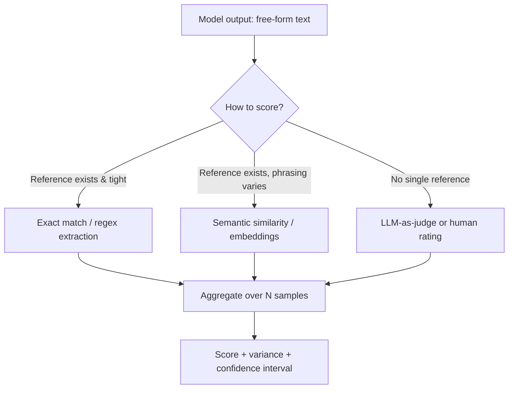
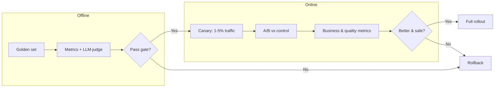

# 8.1 Benchmarks and LLM Evaluation

### Study Notes — Book Style · Generative AI Learning Plan · Phase 8 (Evaluation, Safety & Responsible AI)

> **How to read this file.** This chapter opens Phase 8 by answering a deceptively simple question: *how do we know a model or a prompt is any good?* It builds directly on the benchmark literacy introduced in **1.4.3** (how leaderboards can mislead) and looks forward to the pipeline-level evaluation ideas in **3.3.1** (LLM-as-judge, tracing) and **4.5** (RAG evaluation). Where those chapters showed evaluation embedded in a system, here we treat evaluation as a discipline in its own right — the benchmarks the industry quotes, why they leak, how to build your own golden sets, and how to run offline and online tests without fooling yourself. Read 8.1 before 8.2, because you cannot make a system *safe* until you can *measure* it.
>
> **Sources synthesized:** MMLU / MMLU-Pro, GPQA, GSM8K & MATH, HumanEval / MBPP / SWE-bench, HELM (Stanford CRFM), LMSYS Chatbot Arena & MT-Bench, the "Judging LLM-as-a-Judge" line of work, and industry evaluation practice as of 2026.

---

## 8.1.1 Why evaluating LLMs is genuinely hard

**Definition.** *LLM evaluation* is the process of assigning a comparable, reproducible quality score to a model's outputs on a defined task. The difficulty is that the outputs are free-form natural language, so there is rarely a single correct string to compare against.

**Intuition.** Classical ML has clean labels: an image is a cat or it is not, so accuracy is trivial to compute. A generative model asked "summarize this contract" can produce thousands of equally valid summaries. Two challenges collide:

- **Semantic openness.** Correctness lives at the level of *meaning*, not characters. "The refund window is 30 days" and "Customers may return items within a month" are equivalent, but string comparison scores them as a total mismatch.
- **Non-determinism.** At any temperature above zero the same prompt yields different completions, and even at temperature 0 hardware- and batching-level floating-point differences can change tokens. A single run is a noisy sample, not a measurement.

**Example.** You ask a model "What is 17 percent of 240?" three times. It answers "40.8", "The answer is 40.8.", and "≈ 40.8 (that's 240 × 0.17)". All three are correct, but a naive exact-match scorer marks two of them wrong. Good evaluation must normalize output *and* account for run-to-run variance (report a mean over several samples, ideally with a confidence interval).



---

## 8.1.2 The benchmark landscape

**Definition.** A *benchmark* is a fixed, shared dataset plus a scoring protocol that lets different models be ranked on the same yardstick. Benchmarks cluster by the capability they probe.

**Intuition.** No single number captures "intelligence". The community uses a portfolio, each item stressing a different axis — knowledge, reasoning, coding, conversation.

Quick map of the benchmarks you will see quoted in 2026:

| Benchmark | Probes | Format | Note |
|---|---|---|---|
| **MMLU / MMLU-Pro** | Broad knowledge across 57+ subjects | Multiple choice | Original MMLU is largely saturated; MMLU-Pro adds harder, 10-option questions to restore headroom. |
| **GPQA** | Graduate-level science ("Google-proof") | Multiple choice | Written by domain PhDs; hard even with web access. |
| **GSM8K** | Grade-school math word problems | Numeric answer | Tests multi-step arithmetic reasoning. |
| **MATH** | Competition mathematics | Structured answer | Much harder than GSM8K; needs symbolic reasoning. |
| **HumanEval / MBPP** | Function-level code generation | Unit tests (pass@k) | Scored by *executing* code, not by string match. |
| **SWE-bench (+ Verified)** | Real GitHub issue resolution | Patch applied, tests pass | The 2026 flagship for agentic coding; far more realistic than HumanEval. |
| **HELM** | Holistic, multi-metric | Many scenarios | Reports accuracy *and* calibration, robustness, fairness, efficiency. |
| **Chatbot Arena** | Human preference in the wild | Pairwise votes → Elo | Crowd-sourced blind A/B; ranks by relative win rate. |
| **MT-Bench** | Multi-turn conversational quality | LLM-judged 1–10 | 80 curated multi-turn prompts, judged by a strong model. |

**Example.** A vendor announces "state of the art on MMLU". By 2026 that is almost meaningless — top models cluster within noise near the ceiling. A sharper reader asks for **MMLU-Pro** (harder), **GPQA** (Google-proof), **SWE-bench Verified** (real engineering), and **Chatbot Arena Elo** (human preference). Coverage across axes tells you far more than one saturated score.

**On Elo.** Chatbot Arena converts pairwise human votes into an Elo rating, the same system used in chess. Each model has a rating; when model A beats model B, A gains and B loses points scaled by how "surprising" the result was. Because it is relative and human-judged, Arena resists the contamination problems that plague static test sets — but it measures *preference*, which can reward confident, verbose, or sycophantic answers over correct ones.

---

## 8.1.3 Contamination and overfitting traps (building on 1.4.3)

**Definition.** *Benchmark contamination* (data leakage) occurs when test questions or answers appear in a model's training data, so the model "recalls" rather than "reasons". *Overfitting to the benchmark* is the broader failure where models (or their trainers) are tuned to maximize a specific leaderboard at the expense of real capability — Goodhart's law: "when a measure becomes a target, it ceases to be a good measure."

**Intuition.** Benchmarks are public, on the web, in the training crawl. A model that has memorized GSM8K scores high without being able to do novel arithmetic. As 1.4.3 warned, a leaderboard number is a claim to be interrogated, not a fact to be trusted.

Detection and defense:

- **Held-out / private test splits** (e.g., SWE-bench Verified keeps grading hidden; Arena is live and unmemorizable).
- **Canary strings and timestamps** — release questions dated after the model's cutoff.
- **Perturbation tests** — change surface details (names, numbers) and see if accuracy collapses; a big drop implies memorization, not reasoning.
- **n-gram overlap scans** between the benchmark and the training corpus.

**Example.** A model scores 92 percent on GSM8K. You take the same 100 problems, keep the structure but swap every number, and re-score. It drops to 61 percent. That 31-point gap is the memorization signal — the model learned *answers*, not *method*. This is exactly the trap 1.4.3 flagged: never trust a benchmark you cannot perturb.

---

## 8.1.4 Task-specific evals and golden sets

**Definition.** A *task-specific eval* measures the model on *your* task, using *your* data and *your* success criteria. A *golden set* (or *golden dataset*) is a curated, version-controlled collection of representative inputs paired with known-good expected outputs or acceptance criteria.

**Intuition.** Public benchmarks tell you general capability; they do not tell you whether the model can classify *your* support tickets or extract *your* invoice fields. Every serious deployment needs its own small, high-quality eval set that mirrors production traffic — including the hard, ambiguous, and adversarial cases.

Principles for a good golden set:

- **Representative** — sampled from real traffic, covering the distribution of inputs including rare and edge cases.
- **Sized for signal** — even 100–300 well-chosen items beat 10,000 noisy ones; enough to separate real changes from variance.
- **Versioned** — stored in git, with each row traceable; when you change it you know why.
- **Includes negatives and traps** — cases the model *should* refuse, or where the expected answer is "I don't know".

**Example (worked).** A finance team building an earnings-call summarizer curates 150 transcripts. For each, an analyst writes three "must-include" facts (revenue figure, guidance change, one risk) and two "must-not-hallucinate" traps. The eval scores a summary on fact recall and hallucination rate — a task-specific rubric no public benchmark could provide.

---

## 8.1.5 Metrics for generation: exact match, BLEU/ROUGE, and semantic similarity

**Definition.** These are automatic, reference-based scorers.

- **Exact match (EM)** — output equals the reference after normalization (lowercasing, stripping punctuation/whitespace). Binary, brittle, but ideal for extraction and classification with a fixed answer space.
- **BLEU / ROUGE** — n-gram overlap metrics from machine translation (BLEU, precision-oriented) and summarization (ROUGE, recall-oriented). They count shared word sequences.
- **Semantic similarity** — embed output and reference into vectors and compare (cosine similarity, or metrics like BERTScore). Captures meaning, not surface form.

**Intuition.** EM is right when the answer is a value; it is disastrous for prose. BLEU/ROUGE are cheap and reproducible but reward lexical overlap — a correct paraphrase with different words scores low, and a fluent-but-wrong answer that reuses source words scores high. Semantic similarity fixes the paraphrase problem but can miss factual errors (two sentences can be embedding-close yet contradict on a number).

**Limits of BLEU/ROUGE (say this in interviews):** they do not measure factuality, coherence, or helpfulness; they correlate weakly with human judgment on open-ended generation; and they penalize valid diversity. Use them for regression signals on constrained tasks (translation, extractive summary), not as a verdict on chat quality.

```python
# Runnable: three scoring styles on the same output
from difflib import SequenceMatcher

def exact_match(pred, ref):
    norm = lambda s: " ".join(s.lower().strip().split())
    return norm(pred) == norm(ref)

def rouge_l_f1(pred, ref):
    # crude longest-common-subsequence F1 (illustrative, not production ROUGE)
    p, r = pred.split(), ref.split()
    lcs = SequenceMatcher(None, p, r).find_longest_match(0, len(p), 0, len(r)).size
    if lcs == 0:
        return 0.0
    prec, rec = lcs / len(p), lcs / len(r)
    return 2 * prec * rec / (prec + rec)

pred = "Customers may return items within a month."
ref  = "The refund window is 30 days."
print("EM:", exact_match(pred, ref))         # False - different strings
print("ROUGE-L F1:", round(rouge_l_f1(pred, ref), 2))  # low - little overlap
# A semantic scorer (embeddings) would rate these HIGH; that's the point.
```

For real semantic scoring you would embed both strings (e.g., a sentence-transformer) and take cosine similarity; see **4.5** for the same technique applied to RAG answer relevance.

---

## 8.1.6 LLM-as-judge: pairwise, rubric, and its pitfalls

**Definition.** *LLM-as-judge* uses a strong model to grade outputs — either scoring one output against a rubric (**pointwise**) or picking the better of two (**pairwise**). It is introduced operationally in **3.3.1**; here we go deeper on its failure modes.

**Intuition.** When no reference string exists and human rating is too slow or costly, a capable model can approximate human preference at a fraction of the price, scalably and 24/7. Pairwise ("which is better, A or B?") is more reliable than absolute scoring because relative judgments are easier and more stable than calibrated 1–10 scores.

**Documented biases — memorize these:**

- **Position bias** — judges favor the first (or a fixed) option regardless of content. *Fix:* run both orders (A,B and B,A) and average, or count a win only if it holds in both.
- **Verbosity / length bias** — longer answers are rated better even when padded. *Fix:* control for length or instruct the judge to ignore it.
- **Self-preference bias** — a judge favors outputs from its own model family. *Fix:* use a different judge model, or an ensemble.
- **Sycophancy / style bias** — confident, well-formatted, flattering answers win over accurate plain ones.

**Example (pairwise with position control).**

```python
def pairwise_judge(judge, question, ans_a, ans_b):
    template = (
        "Question: {q}\nAnswer 1: {x}\nAnswer 2: {y}\n"
        "Which answer is more accurate and helpful? Reply '1' or '2' only."
    )
    # order 1
    v1 = judge(template.format(q=question, x=ans_a, y=ans_b))
    # order 2 (swapped) to cancel position bias
    v2 = judge(template.format(q=question, x=ans_b, y=ans_a))
    a_wins = (v1.strip() == "1") + (v2.strip() == "2")
    b_wins = (v1.strip() == "2") + (v2.strip() == "1")
    if a_wins > b_wins: return "A"
    if b_wins > a_wins: return "B"
    return "TIE"   # disagreement across orders => tie, don't guess

# `judge` is any function that sends the prompt to a strong model.
```

**Best practice:** validate the judge against a human-labeled subset (measure agreement, e.g., Cohen's kappa) before trusting it at scale. A judge that agrees with humans 85 percent of the time on your task is a tool; one at 60 percent is a random-number generator with a diploma.

---

## 8.1.7 Human evaluation

**Definition.** *Human evaluation* has people rate outputs directly — via Likert scores, pairwise preference, or task-completion checks — usually with a clear rubric and multiple raters per item.

**Intuition.** Humans remain the gold standard for helpfulness, tone, safety nuance, and domain correctness. They are slow and expensive, so use them where automated metrics are weakest and to *calibrate* your automated scorers.

Practicalities: write an unambiguous rubric; use ≥3 raters per item and report inter-annotator agreement (e.g., Krippendorff's alpha); randomize and blind the model identity; and sample the hard cases, not just easy ones. Chatbot Arena is human eval at internet scale, aggregated via Elo (8.1.2).

**Example.** Before shipping a new support-bot prompt, an e-commerce team has agents blind-rate 200 real conversations on "resolved the issue" (yes/no) and "tone" (1–5). Human labels become the reference the cheaper LLM-judge is validated against — human eval sets the ground truth, the judge scales it.

---

## 8.1.8 Offline vs online evaluation

**Definition.** *Offline evaluation* scores a model on a fixed dataset before deployment (your golden set, benchmarks). *Online evaluation* measures behavior on live traffic after deployment (A/B tests, canary releases, production metrics, user feedback).

**Intuition.** Offline is a lab test — controlled, repeatable, fast, safe, but only as representative as your dataset. Online is the real world — it catches distribution shift and surfaces what users actually do, but it is slower, noisier, and exposes real users to failures. Mature teams use both: gate releases on offline evals, then confirm with a small online A/B.



**Example.** A bank's fraud-explanation assistant passes its 200-item offline golden set. It rolls out to 2 percent of sessions. Online, analyst thumbs-up rate and time-to-decision are compared against the incumbent. Only after the canary beats control on both does it go to 100 percent.

---

## 8.1.9 Regression testing prompts and models

**Definition.** *Regression testing* re-runs your eval suite whenever anything changes — a new model version, a prompt edit, a temperature tweak, an updated tool — to ensure no previously-passing behavior silently breaks.

**Intuition.** LLM systems are fragile to change: a vendor's silent model update or a one-word prompt edit can shift outputs across the board. Treat your golden set like a unit-test suite in CI. A change that improves average score but breaks ten previously-correct edge cases is a regression, not an improvement — track per-item pass/fail, not just the aggregate.

**Example (CI gate).**

```python
def run_regression(model, golden_set, scorer, threshold=0.9):
    results = []
    for item in golden_set:
        out = model(item["input"])
        results.append(scorer(out, item))          # returns pass/fail or score
    passed = sum(bool(r) for r in results)
    rate = passed / len(golden_set)
    regressions = [g["id"] for g, r in zip(golden_set, results) if not r]
    print(f"pass rate {rate:.2%} | regressions: {regressions}")
    assert rate >= threshold, "Eval gate failed - block the release"
    return rate

# Wire this into CI: every prompt/model change must clear the gate.
```

Pin model versions where you can, snapshot outputs, and alert on drift. This is the discipline that turns "the demo worked" into "the system stays working".

---

## 8.1.10 Real-world industry use cases

**Finance — model selection for a research summarizer.** A buy-side firm evaluates three candidate models to summarize regulatory filings. Public benchmarks (MMLU-Pro, GPQA) shortlist for reasoning; a 150-item golden set of filings with analyst-verified "must-include" facts scores task fit; an LLM-judge (position-controlled, human-validated on 50 items) ranks summary quality; and an offline hallucination check counts unsupported numeric claims — because in finance a fabricated figure is a compliance incident, not a style nit. Only then does a 2 percent canary run.

**E-commerce — regression-gating a prompt change.** A marketplace wants to make product-description generation "more persuasive". The new prompt lifts average human-rated appeal, but the regression suite flags that 8 percent of outputs now overstate warranty terms — a legal risk. The gate blocks the change; the team adds a grounding constraint and a guardrail (see 8.2) before re-running. The eval suite caught a business risk that the average score hid.

---

## 8.1.11 Common pitfalls

- **Trusting a single benchmark number.** Especially a saturated one like classic MMLU. Demand a portfolio and interrogate for contamination (8.1.3, 1.4.3).
- **One run = one truth.** Ignoring non-determinism; always average over samples and report variance.
- **Exact match on prose.** Punishes valid paraphrases; use semantic or judge-based scoring for open-ended output.
- **Treating BLEU/ROUGE as quality.** They measure overlap, not factuality or helpfulness.
- **Unvalidated LLM-judge.** Deploying a judge without checking human agreement, or ignoring position/length/self-preference bias.
- **No golden set.** Relying only on public benchmarks that do not reflect your task or traffic.
- **Offline-only.** Shipping on lab scores without an online canary, then being surprised by distribution shift.
- **Aggregate-only regression.** Missing per-item breakages hidden behind a rising mean.
- **Optimizing to the eval.** Goodhart's law — if the team tunes to the golden set, refresh it periodically with fresh production samples.

---

## Wrap-Up

**Through-line.** Evaluation is the load-bearing wall of Phase 8. **1.4.3** taught benchmark skepticism; this chapter turned that skepticism into a working discipline — portfolios of benchmarks, contamination checks, task-specific golden sets, the right metric for each output shape, LLM-as-judge with its biases controlled, human eval as ground truth, and offline gates plus online canaries wired into regression CI. It connects to **3.3.1** (judge/tracing in a pipeline) and **4.5** (evaluating RAG specifically), and it is the prerequisite for **8.2**: you cannot claim a system is *safe* or *responsible* until you can *measure* whether it is. Measurement first, then mitigation.

**Quick-reference table.**

| Question | Reach for |
|---|---|
| General capability? | Benchmark portfolio (MMLU-Pro, GPQA, SWE-bench, Arena) |
| Fits my task? | Task-specific golden set |
| Constrained answer (value/class)? | Exact match / regex extraction |
| Open-ended prose, references vary? | Semantic similarity + LLM-judge |
| No references at all? | LLM-as-judge (pairwise, position-controlled) + human calibration |
| Ground truth for calibration? | Human evaluation |
| Safe to ship? | Offline gate → online canary A/B |
| Did a change break things? | Regression suite in CI |

**Interview Questions & Answers.**

1. **Why is evaluating LLMs harder than classical ML?** Outputs are open-ended natural language (many valid answers, so no single reference) and non-deterministic (sampling varies run to run). Correctness is semantic, not string-level.
2. **What is benchmark contamination and how do you detect it?** Test data leaking into training, so the model recalls rather than reasons. Detect with perturbation tests, private/held-out splits, post-cutoff questions, and n-gram overlap scans.
3. **Why is classic MMLU less useful in 2026?** It is saturated — top models cluster at the ceiling within noise. Use MMLU-Pro, GPQA, and SWE-bench for headroom and realism.
4. **How does Chatbot Arena rank models?** Blind pairwise human votes converted to Elo ratings; it measures relative preference and resists memorization because it is live.
5. **What is SWE-bench and why does it matter?** Real GitHub issues that must be fixed so tests pass — an execution-verified, agentic coding benchmark far more realistic than HumanEval.
6. **Limits of BLEU/ROUGE?** They measure n-gram overlap, not factuality, coherence, or helpfulness; they punish valid paraphrases and reward fluent-but-wrong reuse of source words.
7. **When is exact match appropriate?** Constrained answer spaces — classification, extraction, numeric answers — after normalization. Not for open prose.
8. **What is LLM-as-judge and its main biases?** Using a strong model to grade outputs. Biases: position, verbosity/length, self-preference, sycophancy. Control with order-swapping, length control, a different judge, and ensembles.
9. **Why prefer pairwise over pointwise judging?** Relative "A vs B" judgments are more stable and reliable than absolute 1–10 scores, which are hard to calibrate.
10. **How do you validate an LLM-judge?** Compare it against a human-labeled subset (agreement / Cohen's kappa) before trusting it at scale.
11. **Offline vs online evaluation?** Offline = fixed dataset pre-deploy (fast, safe, repeatable, only as good as the data). Online = live traffic (A/B, canary; catches distribution shift, but slower and exposes users). Use both.
12. **What is a golden set and how big should it be?** A versioned, representative set of inputs with known-good expectations. Even 100–300 well-chosen items give strong signal; quality and coverage beat raw size.
13. **What is regression testing for LLMs and why per-item?** Re-running the eval suite on every model/prompt change. Track per-item pass/fail because an improved average can hide newly broken edge cases.
14. **How do you handle non-determinism in scoring?** Sample multiple completions per input, report mean and variance/confidence interval; pin model versions and temperature where possible.

**Mini-glossary.**

- **Benchmark** — shared dataset + scoring protocol for cross-model comparison.
- **Contamination / leakage** — test data present in training data.
- **Elo** — relative rating from pairwise outcomes (chess-derived), used by Chatbot Arena.
- **Golden set** — curated, versioned task-specific eval dataset.
- **LLM-as-judge** — a model grading outputs, pointwise or pairwise.
- **Position bias** — judge favoring a fixed option slot regardless of content.
- **pass@k** — probability at least one of k code samples passes the unit tests.
- **Regression test** — re-running evals to catch silent breakage on change.

**Further reading.** Chapter **1.4.3** (benchmark traps), **3.3.1** (LLM-as-judge and tracing in pipelines), **4.5** (RAG evaluation); Stanford CRFM HELM; the LMSYS Chatbot Arena and MT-Bench papers; "Judging LLM-as-a-Judge with MT-Bench and Chatbot Arena"; the SWE-bench and GPQA papers.
