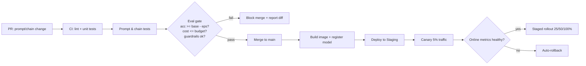

# 9.1 Experiment Tracking, Versioning & CI/CD

### Study Notes — Book Style · Generative AI Learning Plan · Phase 9 (MLOps & LLMOps)

> **How to read this file.** This chapter opens Phase 9 by turning the experimental, notebook-driven work of earlier phases into a repeatable engineering discipline. It assumes you have already built and evaluated LLM systems (see 3.3 observability/tracing and 0.2 evaluation statistics) and now want to ship them safely and repeatedly. Read this before 9.2 (serving) and 9.3 (monitoring): tracking and versioning give you the artifacts you will later deploy and watch. Where serving and cost mechanics matter we point forward to 9.2 and back to 2.3.3 (cost/rate limits/caching).
>
> **Sources synthesized:** MLflow and Weights & Biases documentation; DVC and Git-LFS docs; the Google/Microsoft MLOps maturity models; "Hidden Technical Debt in ML Systems" (Sculley et al.); LangChain/LangSmith and promptfoo eval-in-CI guides; Terraform and GitHub Actions references; practitioner reports current to 2026.

---

## 9.1.1 MLOps vs LLMOps

**Definition.** *MLOps* is the set of practices that automate and standardize the lifecycle of machine-learning systems: data preparation, training, evaluation, deployment, monitoring, and retraining. *LLMOps* is the specialization of MLOps for systems built on large language models, where the "model" is frequently a frozen third-party API or an open-weights checkpoint you do not train, and the thing you actually engineer is the *context*: prompts, retrieval pipelines, tool definitions, and orchestration.

**Intuition.** Classic MLOps assumes you own the training loop, so versioning centers on *code + data → weights*. In LLMOps the weights are often immutable (GPT-4-class APIs) or downloaded (Llama, Qwen, Mistral), so the high-frequency change surface shifts to prompts, few-shot examples, RAG chunks, and model *routing* choices. Your "experiment" is rarely a training run; it is a prompt or chain variant scored against an eval set.

**Example.** A fraud-triage assistant at a bank never fine-tunes a model in its first year. Its "releases" are: v1 zero-shot prompt, v2 adds 6 few-shot exemplars, v3 swaps to a cheaper model for low-risk cases, v4 adds a retrieval step over policy documents. Each is a versioned artifact with an eval score — no gradient descent involved, but every bit as much a deployment.

| Dimension | Traditional MLOps | LLMOps |
| --- | --- | --- |
| Primary artifact | Trained weights | Prompt/chain + optional adapter |
| Change frequency | Weekly–monthly retrains | Daily prompt/config edits |
| Evaluation | Held-out metrics (AUC, F1) | LLM-as-judge, rubric, pass@k, human prefs |
| Cost driver | Training compute | Inference tokens (see 2.3.3) |
| Reproducibility risk | Data + seed | Data + seed + model version + temperature |

---

## 9.1.2 Experiment tracking (MLflow, Weights & Biases)

**Definition.** Experiment tracking is the systematic logging of every run's *inputs* (params, prompt, dataset hash, model id), *outputs* (metrics, artifacts, sample generations), and *environment* (git SHA, dependencies) so runs are comparable and reproducible.

**Intuition.** Without tracking, "the version that scored 0.82 last Tuesday" is unrecoverable. A tracker is a lab notebook that never lies: it pins the exact prompt text, the eval slice, the model snapshot, and the resulting numbers to a single immutable record.

**Example (MLflow, LLM eval run).**

```python
import mlflow, hashlib, json

PROMPT = "You are a fraud analyst. Classify the transaction as OK/REVIEW/BLOCK.\n{tx}"

mlflow.set_experiment("fraud-triage")
with mlflow.start_run(run_name="v2-fewshot"):
    mlflow.log_param("model", "gpt-4.1-mini")
    mlflow.log_param("temperature", 0.0)
    mlflow.log_param("prompt_sha", hashlib.sha256(PROMPT.encode()).hexdigest()[:12])
    mlflow.log_param("eval_set", "fraud_gold_v3")

    metrics = run_eval(PROMPT)          # your eval harness -> dict
    mlflow.log_metrics({
        "accuracy": metrics["acc"],
        "block_recall": metrics["block_recall"],
        "avg_cost_usd": metrics["cost"],
        "p95_latency_ms": metrics["p95"],
    })
    mlflow.log_text(PROMPT, "prompt.txt")
    mlflow.log_dict(metrics["per_example"], "predictions.json")
```

**Example (Weights & Biases, equivalent).**

```python
import wandb
run = wandb.init(project="fraud-triage", name="v2-fewshot",
                 config={"model": "gpt-4.1-mini", "temperature": 0.0})
wandb.log({"accuracy": 0.91, "block_recall": 0.88, "avg_cost_usd": 0.0021})
wandb.log({"samples": wandb.Table(columns=["tx", "pred", "gold"], data=rows)})
run.finish()
```

Both let you diff runs, plot metric-vs-cost trade-offs, and share a link with reviewers. MLflow is self-hostable and pairs with its Model Registry (below); W&B excels at rich media logging and team dashboards.

---

## 9.1.3 Model & dataset versioning

**Definition.** Versioning assigns immutable identifiers to the three things that determine behavior: *models* (a registry entry with stages), *datasets* (content-hashed snapshots), and *prompts* (text under version control with an eval score attached).

**Intuition.** A result is reproducible only if all three are pinned. Change any one silently and last week's 0.91 becomes today's 0.86 with no code diff to blame.

**Model registry.** A registry (MLflow Model Registry, W&B Artifacts, SageMaker/Vertex registries) stores each model version with lifecycle stages — `Staging`, `Production`, `Archived` — plus lineage back to the run that produced it. For LLMs this often points to a fine-tuned adapter (LoRA) or a base-model + prompt bundle rather than full weights.

```python
mlflow.register_model("runs:/<run_id>/model", "fraud-triage-classifier")
# later, promote after eval gate passes:
from mlflow.tracking import MlflowClient
MlflowClient().transition_model_version_stage(
    "fraud-triage-classifier", version=7, stage="Production")
```

**Dataset versioning with DVC.** DVC keeps large files out of Git while tracking their hashes in Git, so a commit pins the exact data.

```bash
dvc add data/fraud_gold_v3.jsonl      # creates fraud_gold_v3.jsonl.dvc (hash pointer)
git add data/fraud_gold_v3.jsonl.dvc .gitignore
git commit -m "eval set v3: +200 chargeback cases"
dvc push                              # blobs go to S3/GCS remote
```

**Prompt versioning.** Treat prompts as source. Store them in the repo (or a prompt registry like LangSmith), tag each with a semantic version, and never edit a shipped prompt in place — create a new version so the old one remains scorable.

```yaml
# prompts/fraud_triage.yaml
id: fraud_triage
version: 2.1.0
model: gpt-4.1-mini
temperature: 0.0
template: |
  You are a fraud analyst...
```

---

## 9.1.4 Reproducibility

**Definition.** Reproducibility is the property that re-running a pipeline from a pinned commit yields the same (or statistically equivalent) result.

**Intuition.** LLMs add reproducibility hazards absent in classic ML: provider model updates ("gpt-4o" silently becoming a new snapshot), non-zero temperature, and non-deterministic kernels. Defend by pinning dated snapshots (`gpt-4.1-2025-04-14`), setting `temperature=0` and `seed` where supported, and recording the *observed* model version from the API response.

**Example.** An e-commerce team saw its product-description quality score drop 4 points overnight with no deploy. The tracker showed the only change was the provider promoting a new default snapshot. Because they logged `response.model`, they diagnosed it in minutes and pinned the prior snapshot.

---

## 9.1.5 CI/CD for ML/LLM apps

**Definition.** CI (continuous integration) runs automated checks on every change; CD (continuous delivery/deployment) promotes passing builds toward production through controlled stages. For LLM apps the distinctive addition is the **eval gate**: a build fails if quality on a fixed eval set regresses beyond a threshold.

**Intuition.** In normal software, a passing unit test is binary and deterministic. LLM outputs are stochastic and graded on a spectrum, so "tests" become statistical: assert that accuracy ≥ baseline − ε, that no guardrail metric (toxicity, PII leakage, refusal rate) worsens, and that cost/latency stay within budget.



**Testing prompts and chains.** Use a harness like `promptfoo`, `pytest` + LangSmith, or DeepEval to assert behavior on curated cases.

```yaml
# promptfooconfig.yaml
prompts: [prompts/fraud_triage.yaml]
providers: [openai:gpt-4.1-mini]
tests:
  - vars: { tx: "$4200 wire to new payee at 3am" }
    assert:
      - { type: contains, value: "BLOCK" }
      - { type: cost, threshold: 0.005 }
      - { type: latency, threshold: 3000 }
      - { type: llm-rubric, value: "cites a specific risk signal" }
```

```yaml
# .github/workflows/eval-gate.yml
name: eval-gate
on: [pull_request]
jobs:
  eval:
    runs-on: ubuntu-latest
    steps:
      - uses: actions/checkout@v4
      - run: pip install -r requirements.txt promptfoo
      - run: dvc pull data/fraud_gold_v3.jsonl
      - run: npx promptfoo eval --config promptfooconfig.yaml --output out.json
      - run: python ci/check_gate.py out.json --min-acc 0.90 --max-cost 0.0025
```

**Canary / staged rollout.** Route a small slice of live traffic (say 5%) to the new version behind a feature flag, compare online metrics against the incumbent, then ramp 25→50→100% or auto-rollback. This is the deployment-time complement to the offline eval gate; see 9.3 for the A/B statistics that decide "healthy."

---

## 9.1.6 How this differs from traditional software CI/CD

**Definition.** The delta is *non-determinism*, *data dependence*, and *cost as a first-class test*.

**Intuition.** A calculator app's tests never flake because 2+2 shifts; an LLM chain's might. So gates are threshold-based and run against pinned data, seeds are fixed, and each PR reports a *diff table* of quality/cost/latency rather than a green check. The registry and dataset hashes replace "the binary I built" as the deployable unit.

| Concern | Traditional CI/CD | ML/LLM CI/CD |
| --- | --- | --- |
| Test outcome | Deterministic pass/fail | Statistical, threshold-based |
| Deployable unit | Compiled artifact | Model version + prompt + data hash |
| Regression check | Unit/integration | Eval gate on frozen dataset |
| Extra budgets | — | Token cost, p95 latency |
| Rollback trigger | Errors/crashes | Quality/guardrail drop (9.3) |

---

## 9.1.7 Infrastructure as code (IaC) basics

**Definition.** IaC declares infrastructure (GPUs, autoscalers, buckets, secrets) in version-controlled files so environments are reproducible and reviewable.

**Intuition.** The same discipline you apply to prompts applies to the machines that serve them: no click-ops, everything in Git, every change a PR.

```hcl
# terraform: a GPU inference node group (sketch)
resource "aws_eks_node_group" "llm_gpu" {
  cluster_name  = aws_eks_cluster.main.name
  instance_types = ["g5.2xlarge"]        # 1x A10G, see 9.2 GPU sizing
  scaling_config { min_size = 1  max_size = 6  desired_size = 2 }
  labels = { workload = "vllm" }
}
```

Pair Terraform (provisioning) with a container image (9.2's Docker section) and a GitOps tool (Argo CD/Flux) so a merged PR reconciles the live cluster to the declared state.

---

## 9.1.8 Real-world industry use cases

**Finance.** A bank's credit-memo summarizer runs a nightly eval gate over 500 gold memos scored by an LLM-judge plus deterministic checks (no hallucinated figures, all regulatory clauses present). A prompt change that improves fluency but drops the "figures match source" guardrail is blocked in CI — protecting against a compliance incident before it reaches production. Model versions are pinned to dated snapshots for audit reproducibility.

**E-commerce.** A marketplace ships product-title generation. Each PR is evaluated on CTR-proxy rubrics and a brand-safety guardrail; passing builds canary to 5% of catalog uploads. W&B dashboards track cost-per-1k-titles so a "better" prompt that doubles token cost is rejected unless quality gains justify it (link 2.3.3).

---

## 9.1.9 Common pitfalls

- **Editing shipped prompts in place.** Destroys reproducibility; always version.
- **Unpinned model aliases.** `gpt-4o` or `latest` tags drift under you — pin dated snapshots and log the observed `response.model`.
- **Eval set leakage.** Tuning prompts against the same set you gate on inflates scores; keep a held-out gate set.
- **Ignoring cost/latency in CI.** Quality-only gates let expensive regressions through (see 2.3.3).
- **Tiny eval sets.** 20 examples give noisy gates; size them for statistical power (0.2).
- **Storing large data in Git.** Bloats history; use DVC/Git-LFS.
- **No rollback path.** Canary without auto-rollback is just a slower incident (9.3).
- **Non-zero temperature in gates.** Makes CI flaky; fix temperature and seed for evaluation.

---

## Wrap-Up

**Through-line.** Phase 9 converts craft into engineering. This chapter established the *artifacts and gates* — tracked runs, versioned models/data/prompts, and CI eval gates — that make everything downstream trustworthy. Those pinned artifacts are exactly what 9.2 takes and serves efficiently, and the canary/rollout machinery here is what 9.3's monitoring and A/B tests decide upon. Backward, it operationalizes the evaluation rigor of 0.2 and the tracing of 3.3; forward, it is the substrate every deployed model in 9.2 and 9.3 rides on.

**Quick reference.**

| Task | Tool | Artifact produced |
| --- | --- | --- |
| Track runs | MLflow / W&B | Run with params + metrics |
| Version models | Model Registry | Staged model version |
| Version data | DVC / Git-LFS | Content-hashed snapshot |
| Version prompts | Repo / LangSmith | Semver prompt + eval score |
| Gate quality | promptfoo / DeepEval | Pass/fail diff table |
| Provision infra | Terraform + GitOps | Declarative cluster state |

**Interview Questions & Answers.**

1. **Q: How does LLMOps differ from MLOps?** A: LLMOps often works with frozen/API or open-weights models, so the high-frequency change surface is prompts, retrieval, and routing rather than training weights; evaluation is rubric/judge-based and cost is a first-class metric.
2. **Q: Why is an eval gate needed in CI for LLM apps?** A: Outputs are stochastic and graded on a spectrum, so binary unit tests miss quality regressions; a gate asserts metrics stay within thresholds on a frozen set.
3. **Q: What three things must be pinned for reproducibility?** A: Model version (dated snapshot), dataset (content hash), and prompt/config (version + temperature/seed).
4. **Q: What does a model registry add over just saving files?** A: Lifecycle stages, lineage back to the producing run, and a promotion API for controlled Staging→Production transitions.
5. **Q: Why not store eval datasets in Git directly?** A: Large binaries bloat history; DVC/Git-LFS keep a hash pointer in Git and blobs in object storage.
6. **Q: What is a canary rollout?** A: Routing a small traffic slice to a new version, comparing online metrics to the incumbent, then ramping or auto-rolling-back.
7. **Q: How do you prevent flaky LLM tests in CI?** A: Fix temperature=0 and seed, pin the model snapshot, and use threshold assertions rather than exact-match where semantics vary.
8. **Q: What guardrail metrics belong in an eval gate?** A: Toxicity, PII/leakage, refusal rate, factual-consistency, plus cost and p95 latency budgets.
9. **Q: How can a model degrade with zero code changes?** A: A provider silently promoted a new default snapshot; detect by logging the observed `response.model` and pin dated versions.
10. **Q: Where does IaC fit in LLMOps?** A: It version-controls the GPU/autoscaler/secret infrastructure so serving environments (9.2) are reproducible and reviewable via PRs.
11. **Q: Why include cost in the gate and not just quality?** A: A prompt can improve quality while doubling tokens; ignoring cost lets expensive regressions ship (2.3.3).

**Mini-glossary.**

- **Eval gate:** CI check that fails a build on quality/cost/latency regression.
- **Model registry:** Store of versioned models with lifecycle stages and lineage.
- **DVC:** Data Version Control; Git-tracked hash pointers to large blobs.
- **Canary:** Small-slice production test of a new version.
- **IaC:** Infrastructure as code (e.g., Terraform).
- **Snapshot pin:** Fixing a dated model version to avoid silent drift.

**Further reading.** MLflow & W&B docs; DVC docs; promptfoo/DeepEval/LangSmith eval guides; Google "MLOps: Continuous delivery and automation pipelines"; Sculley et al., "Hidden Technical Debt in Machine Learning Systems"; Terraform and Argo CD documentation.
