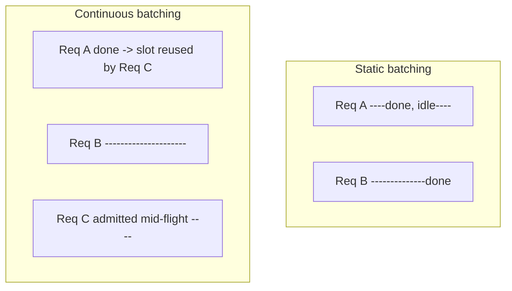
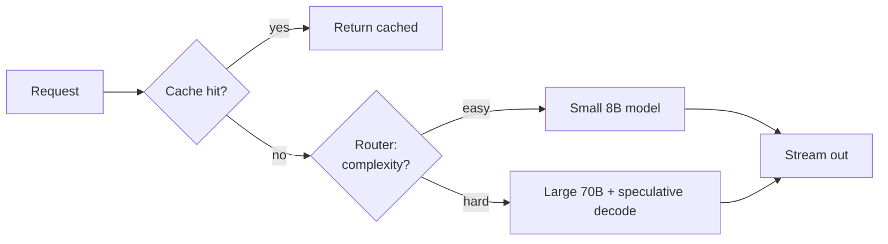

# 9.2 Serving & Inference Optimization

### Study Notes — Book Style · Generative AI Learning Plan · Phase 9 (MLOps & LLMOps)

> **How to read this file.** This chapter takes the versioned, gated artifacts of 9.1 and puts them under load: how open-weights models are served, how to trade throughput against latency, and how to keep the GPU bill sane. It leans heavily on mechanics established earlier — the prefill/decode split and KV cache (1.3.6), token streaming (2.3.2), cost/rate-limit/caching patterns (2.3.3), and quantization (6.4) — and it feeds directly into 9.3, which monitors exactly the latency/cost signals we optimize here. Read 1.3.6 first if the KV cache is fuzzy; everything about batching and PagedAttention builds on it.
>
> **Sources synthesized:** vLLM (PagedAttention) paper and docs; Hugging Face Text Generation Inference (TGI) docs; NVIDIA Triton + TensorRT-LLM docs; llama.cpp and Ollama docs; FastAPI/Starlette streaming docs; speculative decoding literature (Leviathan et al., medusa); AWS Bedrock and Google Vertex AI serving guides; Modal/RunPod deployment docs; practitioner benchmarks current to 2026.

---

## 9.2.1 The serving landscape

**Definition.** An inference server accepts prompts, schedules them onto GPU(s), runs prefill + decode (1.3.6), and streams tokens back. The main open-source options differ in scheduling sophistication, hardware target, and ergonomics.

**Intuition.** Pick by workload: high-QPS multi-tenant API → vLLM/TGI/Triton; single-user desktop or edge → Ollama/llama.cpp; maximum tuned throughput on NVIDIA → Triton + TensorRT-LLM.

| Server | Core strength | Best for | Notes |
| --- | --- | --- | --- |
| **vLLM** | PagedAttention + continuous batching | High-throughput serving | OpenAI-compatible API |
| **TGI** | Production HF stack, quantization | HF ecosystem, easy ops | Rust router + Python shards |
| **Triton (+TensorRT-LLM)** | Peak NVIDIA perf, multi-model | Enterprise, mixed models | Steeper setup |
| **Ollama** | One-command local models | Dev, prototyping, edge | Wraps llama.cpp |
| **llama.cpp** | CPU/GGUF, tiny footprint | Laptops, on-device | GGUF quantized weights |

---

## 9.2.2 vLLM: PagedAttention and continuous batching

**Definition.** *PagedAttention* stores the KV cache (1.3.6) in fixed-size non-contiguous "pages," like OS virtual memory, instead of one contiguous slab per sequence. *Continuous (in-flight) batching* admits and evicts requests at the token step rather than the request boundary, so a finished sequence's slot is immediately reused.

**Intuition.** Naive static batching wastes memory by pre-reserving max-length contiguous KV per request and wastes compute waiting for the slowest sequence to finish before starting the next batch. PagedAttention slashes memory fragmentation (near-zero waste vs 60–80% in naive allocators), which lets you fit more concurrent sequences; continuous batching keeps the GPU saturated by backfilling free slots every step. Together they are the single biggest throughput win in modern serving.



**Example (launch an OpenAI-compatible vLLM server).**

```bash
python -m vllm.entrypoints.openai.api_server \
  --model meta-llama/Llama-3.1-8B-Instruct \
  --gpu-memory-utilization 0.90 \
  --max-model-len 8192 \
  --max-num-seqs 256 \
  --quantization awq \
  --enable-prefix-caching
```

```python
from openai import OpenAI
client = OpenAI(base_url="http://localhost:8000/v1", api_key="x")
r = client.chat.completions.create(
    model="meta-llama/Llama-3.1-8B-Instruct",
    messages=[{"role": "user", "content": "Summarize this ticket..."}],
    stream=True)                     # streaming: see 2.3.2
for chunk in r:
    print(chunk.choices[0].delta.content or "", end="")
```

`--enable-prefix-caching` reuses KV for shared prompt prefixes (system prompts, few-shot blocks) across requests — a serving-side analog of the caching in 2.3.3.

---

## 9.2.3 Throughput vs latency

**Definition.** *Throughput* is tokens (or requests) served per second across all users; *latency* is time experienced by one user, split into **TTFT** (time-to-first-token, dominated by prefill) and **TPOT/ITL** (time-per-output-token, dominated by decode) — see 1.3.6.

**Intuition.** They trade off. Bigger batches raise throughput (better GPU utilization) but can raise TTFT/TPOT for any individual request because the step now does more work. Interactive chat optimizes TTFT; bulk pipelines (nightly summarization) optimize throughput and tolerate latency.

**Example.** A support-chat product targets TTFT < 500 ms, so it caps `max-num-seqs` lower and reserves headroom. A batch document-enrichment job runs the same model with a huge batch and 100% GPU utilization overnight — same weights, opposite tuning.

| Metric | Governed by | Optimize with |
| --- | --- | --- |
| TTFT | Prefill, queue wait | Prefix caching, chunked prefill, smaller batch |
| TPOT / ITL | Decode step, batch size | Continuous batching, quantization, spec decoding |
| Throughput (tok/s) | Batch occupancy | Larger `max-num-seqs`, PagedAttention |

---

## 9.2.4 KV cache management (link 1.3.6)

**Definition.** The KV cache stores per-token keys/values so decode is O(1) per step instead of re-reading the whole prompt. It grows with sequence length × layers × heads and dominates GPU memory during serving.

**Intuition.** KV memory, not model weights, usually caps concurrency. If an 8B model's weights are ~16 GB in fp16 and you have a 24 GB card, only ~8 GB remains for KV — so per-sequence context length and the number of concurrent sequences directly compete. PagedAttention (9.2.2) makes that 8 GB go much further; prefix caching avoids recomputing shared prefixes. See 1.3.6 for the mechanics.

**Example.** Serving 4k-token contexts, a team hit OOM at 40 concurrent users. Enabling prefix caching for their 900-token system prompt cut per-request KV by reusing the shared prefix, lifting concurrency to ~70 on the same card.

---

## 9.2.5 Quantization for serving (link 6.4)

**Definition.** Quantization stores weights (and sometimes activations/KV) in lower precision — INT8, INT4 (AWQ, GPTQ), FP8 — shrinking memory and often speeding decode. Full treatment is in 6.4; here we focus on the *serving* consequences.

**Intuition.** Quantization is the lever that fits a bigger model on a smaller GPU and frees memory for more KV/concurrency. FP8 on Hopper/Blackwell GPUs is near-lossless and fast; INT4 (AWQ/GPTQ) roughly quarters weight memory with a small quality hit that you must confirm with a 9.1 eval gate before shipping.

**Example.** A 70B model in fp16 needs ~140 GB (multi-GPU). In AWQ INT4 it fits in ~40 GB — a single A100 80GB or H100 — halving hardware cost. The team ran their offline eval gate (9.1) and accepted a 0.6-point quality drop for the 3.5x cost reduction.

---

## 9.2.6 GPU sizing and autoscaling

**Definition.** *Sizing* estimates the GPU memory and count a workload needs; *autoscaling* adds/removes replicas as load changes.

**Intuition.** Budget memory as: `weights + KV(context × concurrency) + activations + overhead`. A rule of thumb: weights ≈ params × bytes/param (2 for fp16, 0.5 for INT4); leave 10–20% headroom. Autoscale on a queue-depth or GPU-utilization signal, not just CPU — and expect cold starts: loading 8–70B weights takes tens of seconds, so keep a warm minimum replica.

```yaml
# k8s HPA on a custom vLLM queue metric (sketch)
apiVersion: autoscaling/v2
kind: HorizontalPodAutoscaler
metadata: { name: vllm-hpa }
spec:
  scaleTargetRef: { apiVersion: apps/v1, kind: Deployment, name: vllm }
  minReplicas: 2            # warm floor avoids cold-start latency
  maxReplicas: 12
  metrics:
    - type: Pods
      pods:
        metric: { name: vllm_num_requests_waiting }
        target: { type: AverageValue, averageValue: "5" }
```

| Model (INT4) | Approx weights | Fits on |
| --- | --- | --- |
| 8B | ~5 GB | L4 / A10G (24 GB) |
| 34B | ~19 GB | A100 40GB |
| 70B | ~40 GB | A100/H100 80GB |

---

## 9.2.7 Cost & latency optimization: caching, routing, speculative decoding

**Definition.** Three orthogonal levers beyond batching: **caching** (reuse identical/prefix work — 2.3.3), **routing** (send easy requests to cheaper/smaller models), and **speculative decoding** (a small draft model proposes several tokens that the big model verifies in one pass).

**Intuition.** Caching removes work; routing right-sizes work; speculative decoding accelerates the work you keep. Speculative decoding can 2–3x decode throughput when the draft model agrees often, with *identical* output distribution (the verifier accepts/rejects tokens), so quality is unchanged.



**Example (vLLM speculative decoding).**

```bash
python -m vllm.entrypoints.openai.api_server \
  --model meta-llama/Llama-3.1-70B-Instruct \
  --speculative-model meta-llama/Llama-3.1-8B-Instruct \
  --num-speculative-tokens 5
```

A routing layer that sends 60% of "classify" traffic to an 8B model and reserves the 70B for "explain" traffic can cut blended cost per request by half while keeping p95 quality — measure the split with the A/B tooling in 9.3.

---

## 9.2.8 FastAPI + streaming (link 2.3.2)

**Definition.** A thin FastAPI gateway can add auth, routing, logging (for 9.3), and Server-Sent-Events streaming in front of a vLLM/TGI backend.

**Intuition.** Stream tokens to the client so perceived latency tracks TTFT, not total generation time (2.3.2). The gateway is also where you attach request IDs and emit the latency/cost logs that 9.3's dashboards consume.

```python
from fastapi import FastAPI
from fastapi.responses import StreamingResponse
from openai import AsyncOpenAI

app = FastAPI()
backend = AsyncOpenAI(base_url="http://vllm:8000/v1", api_key="x")

@app.post("/chat")
async def chat(body: dict):
    async def gen():
        stream = await backend.chat.completions.create(
            model=body["model"], messages=body["messages"], stream=True)
        async for chunk in stream:
            if tok := chunk.choices[0].delta.content:
                yield f"data: {tok}\n\n"      # SSE frame (see 2.3.2)
        yield "data: [DONE]\n\n"
    return StreamingResponse(gen(), media_type="text/event-stream")
```

---

## 9.2.9 Deployment: Docker, Modal/RunPod/HF, cloud managed

**Definition.** Package the server as a container and run it either self-managed (Kubernetes, RunPod), serverless-GPU (Modal, HF Inference Endpoints), or via fully managed model APIs (AWS Bedrock, Google Vertex AI).

**Intuition.** The trade is control vs ops burden. Self-hosting vLLM on rented GPUs is cheapest per token at scale but you own scaling, upgrades, and on-call; managed APIs (Bedrock/Vertex) remove ops and add compliance/region features at a per-token premium and less tuning control.

```dockerfile
# Dockerfile for a vLLM service
FROM vllm/vllm-openai:latest
ENV HF_HOME=/models
EXPOSE 8000
ENTRYPOINT ["python", "-m", "vllm.entrypoints.openai.api_server", \
  "--model", "meta-llama/Llama-3.1-8B-Instruct", \
  "--gpu-memory-utilization", "0.9", "--enable-prefix-caching"]
```

```python
# Modal serverless-GPU deploy (sketch)
import modal
app = modal.App("vllm-svc")
img = modal.Image.from_registry("vllm/vllm-openai:latest")

@app.function(image=img, gpu="A100", scaledown_window=120, min_containers=1)
@modal.web_server(8000)
def serve():
    import subprocess
    subprocess.Popen(["python", "-m", "vllm.entrypoints.openai.api_server",
                      "--model", "meta-llama/Llama-3.1-8B-Instruct"])
```

The container image here is the deployable unit registered in 9.1's pipeline; infra is provisioned by the Terraform of 9.1.7.

---

## 9.2.10 Real-world industry use cases

**Finance.** A bank self-hosts a 70B model on-prem (data-residency rules forbid external APIs) with vLLM + FP8, routing document-classification to a quantized 8B replica and reserving the 70B for regulatory-memo drafting. Prefix caching on the long compliance system prompt cuts KV pressure; speculative decoding keeps analyst-facing TTFT under 400 ms. Cost per memo is tracked into 9.3 dashboards.

**E-commerce.** A retailer serves real-time product-Q&A at high QPS on Bedrock for elastic Black-Friday scaling, while a batch pipeline enriches the catalog nightly on cheap RunPod spot GPUs tuned for pure throughput. A router sends short "is it in stock?" queries to a small model and detailed comparison queries to a larger one, halving blended token cost (2.3.3).

---

## 9.2.11 Common pitfalls

- **OOM from KV, not weights.** Concurrency × context blows the budget; use PagedAttention, cap `max-model-len`, add prefix caching (1.3.6).
- **Over-large batches hurt interactivity.** Great throughput, terrible TTFT for chat.
- **Cold starts.** Loading big weights takes tens of seconds; keep a warm floor (`minReplicas`/`min_containers`).
- **Quantizing without re-evaluating.** Ship an INT4 model only after the 9.1 eval gate confirms acceptable quality (6.4).
- **Autoscaling on CPU.** Useless for GPU inference; scale on queue depth/GPU util.
- **No streaming.** Users feel total latency instead of TTFT (2.3.2).
- **Ignoring blended cost.** Report cost-per-request, not just tok/s; a fast setup can still be expensive (2.3.3).
- **Speculative decoding with a poorly matched draft model.** Low acceptance rate yields little speedup and wasted compute.

---

## Wrap-Up

**Through-line.** 9.1 gave us versioned, gated artifacts; this chapter runs them at scale, converting the KV-cache mechanics of 1.3.6 and the quantization of 6.4 into concrete throughput and cost. The gateway and dashboards we sketched (FastAPI streaming per 2.3.2) emit exactly the latency/cost/quality signals that 9.3 monitors and A/B-tests. Every optimization here — PagedAttention, batching, routing, speculative decoding — is only "safe to ship" because the eval gate of 9.1 guards quality and the monitoring of 9.3 catches regressions in the wild.

**Quick reference.**

| Goal | Lever | Chapter link |
| --- | --- | --- |
| Fit bigger model | Quantization (INT4/FP8) | 6.4 |
| More concurrency | PagedAttention + prefix caching | 1.3.6 |
| Keep GPU busy | Continuous batching | 9.2.2 |
| Lower TTFT | Streaming, chunked prefill | 2.3.2 |
| Cut cost | Caching + routing | 2.3.3 |
| Faster decode | Speculative decoding | 9.2.7 |
| Elastic capacity | Autoscale on queue depth | 9.2.6 |

**Interview Questions & Answers.**

1. **Q: What problem does PagedAttention solve?** A: KV-cache memory fragmentation; it stores KV in fixed non-contiguous pages, cutting waste and raising concurrency.
2. **Q: How does continuous batching differ from static batching?** A: It admits/evicts requests at the token step, reusing freed slots immediately instead of waiting for the whole batch to finish.
3. **Q: Define TTFT and TPOT.** A: TTFT is time-to-first-token (prefill-bound); TPOT is per-output-token time (decode-bound).
4. **Q: Why does throughput trade off against latency?** A: Larger batches raise GPU utilization/throughput but add per-step work, increasing individual TTFT/TPOT.
5. **Q: What usually caps serving concurrency, weights or KV cache?** A: The KV cache — it grows with context × concurrency and competes with weights for GPU memory.
6. **Q: How does speculative decoding keep output quality unchanged?** A: The large model verifies draft tokens and rejects mismatches, preserving its exact output distribution.
7. **Q: When choose Ollama/llama.cpp over vLLM?** A: For local/edge/desktop, single-user, CPU or small-GPU use with GGUF weights; vLLM is for high-QPS server workloads.
8. **Q: How do you size GPU memory for a model?** A: weights (params × bytes/param) + KV (context × concurrency) + activations + ~15% headroom.
9. **Q: Why autoscale on queue depth instead of CPU?** A: GPU inference is not CPU-bound; queue depth/GPU utilization reflect real load and cold-start risk.
10. **Q: What does prefix caching buy you?** A: Reuse of KV for shared prompt prefixes (system/few-shot), reducing recompute and KV memory (2.3.3).
11. **Q: Self-host vLLM vs managed Bedrock/Vertex — trade-off?** A: Self-host is cheaper per token at scale but you own ops/scaling; managed removes ops and adds compliance at a per-token premium.
12. **Q: Why must quantization be paired with an eval gate?** A: INT4/FP8 can degrade quality; the 9.1 gate confirms the accuracy loss is acceptable before rollout.

**Mini-glossary.**

- **PagedAttention:** Paged, non-contiguous KV storage à la virtual memory.
- **Continuous batching:** Token-level request admission/eviction.
- **TTFT/TPOT:** First-token / per-output-token latency.
- **Prefix caching:** Reusing KV of shared prompt prefixes.
- **Speculative decoding:** Draft-then-verify token acceleration.
- **FP8/INT4:** Low-precision serving formats (6.4).
- **Cold start:** Latency from loading weights onto a fresh replica.

**Further reading.** vLLM PagedAttention paper and docs; HF TGI docs; NVIDIA Triton + TensorRT-LLM guides; Leviathan et al. speculative decoding; llama.cpp/Ollama docs; AWS Bedrock & Google Vertex AI serving documentation; Modal/RunPod deployment guides.
