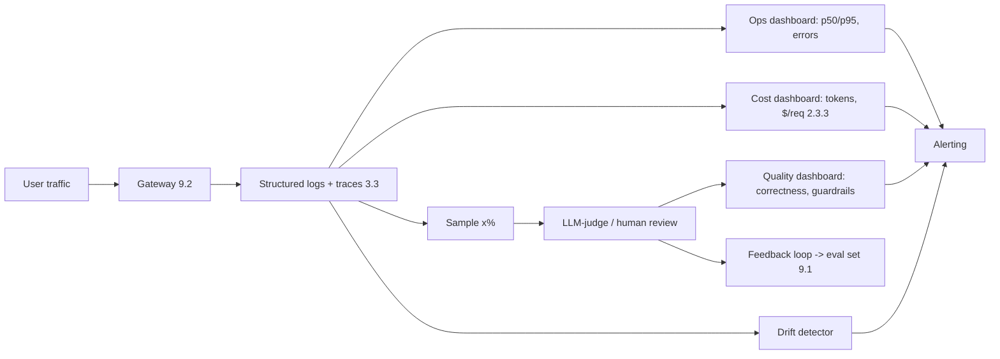
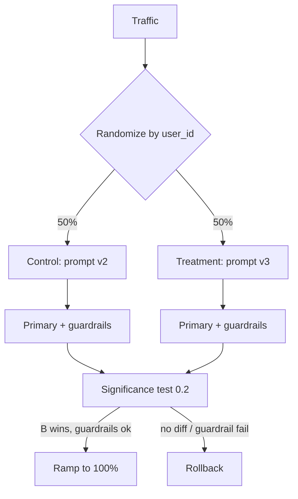

# 9.3 Monitoring, Drift & A/B Testing

### Study Notes — Book Style · Generative AI Learning Plan · Phase 9 (MLOps & LLMOps)

> **How to read this file.** This chapter closes Phase 9 by watching what 9.1 shipped and 9.2 serves. It extends the tracing/observability of 3.3 from development into production, and it turns the canary rollouts of 9.1 into statistically sound decisions using the experiment-design ideas of 0.2. Read it as the feedback loop that makes the whole pipeline self-correcting: production signals here become the eval sets and gates of 9.1, closing the circle. Where cost and latency appear, they are the same metrics we optimized in 9.2 and 2.3.3.
>
> **Sources synthesized:** the "Hidden Technical Debt in ML Systems" monitoring themes; Evidently AI and Arize/WhyLabs drift-detection docs; OpenTelemetry GenAI semantic conventions and LangSmith/Langfuse tracing; classic A/B testing references (Kohavi et al., "Trustworthy Online Controlled Experiments"); sequential-testing and CUPED literature; incident-response practice (Google SRE); practitioner reports current to 2026.

---

## 9.3.1 Production monitoring: the four signal groups

**Definition.** Production monitoring continuously measures a live LLM system across four groups: **operational** (latency, throughput, error rate), **cost** (tokens, $/request), **quality** (correctness, helpfulness, guardrail violations), and **usage** (volume, feature adoption).

**Intuition.** Operational and cost signals are cheap and instant (they come from logs/metrics); quality is expensive and delayed (it needs judges or human feedback). A mature setup pairs real-time operational dashboards with sampled, slower quality evaluation — you cannot LLM-judge every request, so you sample.



**Example.** A dashboard shows p95 latency (9.2's TPOT budget), $/1k-requests (2.3.3), judge-scored correctness on a 2% sample, and a "guardrail violation rate" line. One panel per signal group; alerts fire on the derivatives, not just the levels.

---

## 9.3.2 Logging & tracing in production (build on 3.3)

**Definition.** A trace captures the full path of one request — prompt, retrieval hits, tool calls, model, tokens, latency per span, and output — with a request ID that links to user feedback. This is 3.3's tracing carried into production with sampling and PII controls.

**Intuition.** In prod you cannot log everything verbatim (cost, privacy), so log *structured metadata* always and *full payloads* on a sample or on error. OpenTelemetry's GenAI semantic conventions standardize span attributes (`gen_ai.request.model`, `gen_ai.usage.input_tokens`, etc.) so traces are portable across Langfuse/LangSmith/Arize.

```python
import time, uuid, logging, json
log = logging.getLogger("llm")

def traced_call(client, messages, model):
    rid = str(uuid.uuid4()); t0 = time.time()
    r = client.chat.completions.create(model=model, messages=messages)
    log.info(json.dumps({
        "request_id": rid,
        "gen_ai.request.model": model,
        "gen_ai.usage.input_tokens": r.usage.prompt_tokens,
        "gen_ai.usage.output_tokens": r.usage.completion_tokens,
        "latency_ms": int((time.time() - t0) * 1000),
        "cost_usd": estimate_cost(r.usage, model),
    }))
    return rid, r        # rid links this call to later thumbs up/down
```

Retain traces long enough to debug incidents (9.3.7) and to harvest hard cases for the 9.1 eval set — but redact PII per policy before storage.

---

## 9.3.3 Data & concept drift

**Definition.** *Data (covariate) drift* is a change in the input distribution; *concept drift* is a change in the input→correct-output relationship even if inputs look the same. For LLM apps, drift also appears as **embedding drift** (the semantic distribution of prompts/documents shifts) and **prompt-topic shift**.

**Intuition.** LLMs do not "forget," but the world around them changes: new slang, new product lines, a new fraud pattern, or a provider model update (9.1.4). Because you rarely have immediate ground truth, you monitor *proxies* — input distribution and output-behavior distribution — and treat a shift as a signal to run a fresh evaluation, not an automatic failure.

**Detecting embedding drift.**

```python
import numpy as np
from scipy.stats import ks_2samp

def embedding_drift(ref_emb, live_emb):
    # compare per-dimension distributions; PSI or KS on projections
    ref_mean = ref_emb.mean(0); live_mean = live_emb.mean(0)
    cos_shift = 1 - (ref_mean @ live_mean) / (
        np.linalg.norm(ref_mean) * np.linalg.norm(live_mean))
    ks = np.mean([ks_2samp(ref_emb[:, i], live_emb[:, i]).statistic
                  for i in range(ref_emb.shape[1])])
    return {"centroid_cosine_shift": float(cos_shift), "mean_ks": float(ks)}
```

Practical detectors: **PSI** (Population Stability Index) on input features/scores, **KS test** on continuous signals, and centroid/cluster shift on embeddings (Evidently, Arize, WhyLabs automate these).

**Example.** An e-commerce assistant's embedding-drift monitor spiked when a seasonal product category launched; queries the RAG index had never seen. The alert triggered re-indexing and a fresh eval, preventing a silent quality dip during peak season.

---

## 9.3.4 Online evaluation & feedback loops

**Definition.** Online evaluation scores live traffic using (a) **explicit feedback** (thumbs up/down, star ratings, edits/regenerations), (b) **implicit signals** (copy, accept-suggestion, dwell time, follow-up questions, task completion), and (c) **sampled LLM-judge/human review**.

**Intuition.** Explicit feedback is sparse and biased (people click thumbs-down more than up); implicit signals are dense but noisy. Combine them: a rising regenerate-rate or falling accept-rate is an early, high-volume warning that pairs well with slower judge scores. Feed hard/negative cases back as new eval examples (9.1), so production continuously sharpens your offline gate.

```python
@app.post("/feedback")
async def feedback(body: dict):
    # body: {request_id, signal: "up"|"down", edited: bool}
    store.record(body["request_id"], body["signal"], body.get("edited"))
    if body["signal"] == "down":
        queue_for_eval_set(body["request_id"])   # closes loop to 9.1
    return {"ok": True}
```

**Example.** A finance summarizer treats "analyst edited the summary before sending" as an implicit negative. The edit-rate is a leading quality metric; edited pairs (original vs corrected) become gold examples for the next eval run.

---

## 9.3.5 A/B testing LLM features (link 0.2)

**Definition.** An A/B test randomly assigns users/requests to control (A) and treatment (B), then compares a pre-registered **primary metric** while watching **guardrail metrics** for unintended harm, using statistical inference (0.2) to decide if the difference is real.

**Intuition.** LLM changes (new prompt, new model per 9.2's routing) must be judged on *business* outcomes, not offline scores alone. Pick one primary metric (e.g., task-completion rate, resolution rate, conversion), define guardrails (cost/request, p95 latency, refusal rate, safety violations) that must *not* regress, randomize at the right unit (user, not request, to avoid contamination), and run until you reach the pre-computed sample size for adequate power (0.2). Peeking at p-values inflates false positives — use fixed-horizon or a sequential test designed for continuous monitoring.



**Example (two-proportion test on completion rate).**

```python
from statsmodels.stats.proportion import proportions_ztest, samplesize_proportions_2indep_onecomp
import numpy as np

# pre-registered: detect +2pp lift from 70% baseline at 80% power, alpha 0.05
# -> compute n before launch (see 0.2), then after the run:
success = np.array([7120, 7350]); nobs = np.array([10000, 10000])  # A, B
stat, p = proportions_ztest(success, nobs)
lift = success[1]/nobs[1] - success[0]/nobs[0]
print(f"lift={lift:.3%}  p={p:.4f}  significant={p < 0.05}")
```

Also check guardrails per arm: if treatment lifts completion but raises cost/request 40% or p95 latency past budget (9.2/2.3.3), it fails. Techniques like **CUPED** (variance reduction using pre-experiment covariates) shorten runtimes; **sequential testing** allows valid early stopping.

---

## 9.3.6 Alerting

**Definition.** Alerting fires notifications when a monitored signal breaches a threshold or shifts abnormally, routed by severity to the right on-call.

**Intuition.** Alert on symptoms users feel (error spikes, latency SLO breach, cost runaway, guardrail-violation surge, drift alarm), not on every wiggle. Use burn-rate style alerts on SLOs and rate-limit/dedupe to avoid fatigue. LLM-specific alerts include hallucination-rate proxy, refusal-rate spike, and toxic-output detector hits.

**Example.** SLO: 99% of requests < 4 s TTFT budget over 30 days. A fast-burn alert (2% budget in 1 h) pages on-call; a slow-burn alert opens a ticket. A separate alert triggers if daily spend exceeds 120% of the 7-day median (2.3.3), catching a prompt change that ballooned output length.

---

## 9.3.7 Incident response for LLM apps

**Definition.** A structured process — detect, triage/severity, mitigate, resolve, postmortem — adapted to LLM-specific failure modes: hallucination surges, jailbreaks/prompt injection, provider outages/model swaps, cost runaways, and RAG-index staleness.

**Intuition.** Mitigation for LLM incidents is often a *config* action, not a code deploy: roll back the prompt version (9.1), flip the router to a safe model (9.2), disable a tool, or serve a cached/fallback response. Speed matters, so keep these levers behind feature flags. Every incident yields eval cases that harden the 9.1 gate.

**Example (playbook).**

| Symptom | Likely cause | First mitigation |
| --- | --- | --- |
| Quality drop, no deploy | Provider model swap (9.1.4) | Pin prior snapshot |
| Toxic/unsafe outputs | Jailbreak/injection | Tighten guardrail, block pattern |
| Cost spike | Longer outputs / loop | Cap max_tokens, kill loop |
| Latency SLO breach | Load / no autoscale | Scale replicas (9.2) |
| Stale/wrong facts | RAG index drift (9.3.3) | Re-index, fallback message |

---

## 9.3.8 Real-world industry use cases

**Finance.** A fraud-explanation assistant monitors a hallucination proxy (does the explanation cite a real transaction feature?) on a 5% sampled judge, plus embedding drift on incoming case descriptions. When a new fraud pattern shifted the input distribution, the drift alert fired days before accuracy visibly dropped; the team refreshed few-shot examples and re-ran the 9.1 gate. All A/B tests carry a hard guardrail: false-block rate must not rise, regardless of any efficiency gain.

**E-commerce.** A retailer A/B-tests a new product-recommendation prompt with add-to-cart rate as the primary metric and cost/request + p95 latency as guardrails. Randomization is by user to avoid session contamination; CUPED using pre-period spend cuts required sample size by ~30%. Implicit "regenerate" and "no-click" signals feed a live quality panel, and negative cases become tomorrow's eval set (9.1).

---

## 9.3.9 Common pitfalls

- **Peeking at A/B p-values.** Continuous checking inflates false positives; use fixed horizon or sequential tests (0.2).
- **Randomizing by request, not user.** Contaminates the experience and biases results.
- **Quality-only or cost-only view.** A "better" arm that breaks the cost/latency guardrail is not better (2.3.3, 9.2).
- **Logging raw PII.** Redact before storage; log structured metadata always, payloads on sample/error.
- **Treating drift as automatic failure.** Drift is a signal to re-evaluate, not proof of degradation.
- **Alert fatigue.** Too many low-value alerts train on-call to ignore them; alert on user-felt symptoms.
- **No closed loop.** Feedback that never becomes eval cases wastes the best data source you have (9.1).
- **Underpowered tests.** Deciding on 200 samples yields noise; compute sample size up front (0.2).

---

## Wrap-Up

**Through-line.** Phase 9 is a loop, and this chapter is where it closes. 9.1 built versioned artifacts and gates; 9.2 served them fast and cheap; 9.3 watches them in the wild and feeds what it learns — drift alarms, negative feedback, incident cases — back into the eval sets and gates of 9.1. It extends 3.3's tracing into production, spends the latency/cost budgets defined in 9.2 and 2.3.3, and decides rollouts with the statistics of 0.2. Master this and the system becomes self-correcting: production teaches the gate, the gate protects production.

**Quick reference.**

| Question | Signal / method | Link |
| --- | --- | --- |
| Is it fast/reliable? | p50/p95 latency, error rate | 9.2 |
| Is it affordable? | tokens, $/request | 2.3.3 |
| Is it good? | sampled judge + feedback | 3.3 |
| Are inputs shifting? | PSI/KS + embedding drift | 9.3.3 |
| Is the new version better? | A/B primary + guardrails | 0.2 |
| Something broke? | SLO burn-rate alert + playbook | 9.3.7 |

**Interview Questions & Answers.**

1. **Q: Difference between data drift and concept drift?** A: Data drift changes the input distribution; concept drift changes the input→correct-output mapping even with stable inputs.
2. **Q: What is embedding drift and why monitor it?** A: A shift in the semantic distribution of prompts/documents; it flags new topics/products that the model or RAG index hasn't seen.
3. **Q: Why sample for quality but measure ops in full?** A: Ops/cost come free from logs; quality needs expensive judges/humans, so you sample a few percent.
4. **Q: What is a guardrail metric in an A/B test?** A: A metric that must not regress (cost, latency, safety, refusal rate) even if the primary metric improves.
5. **Q: Why randomize by user rather than request?** A: Per-request switching contaminates a user's experience and biases the comparison.
6. **Q: Why is peeking at p-values dangerous?** A: Repeated looks inflate the false-positive rate; use a fixed horizon or a sequential test designed for it (0.2).
7. **Q: What does CUPED do?** A: Reduces metric variance using pre-experiment covariates, shrinking required sample size / runtime.
8. **Q: Give two implicit quality signals.** A: Regenerate/edit rate and accept-suggestion or task-completion rate.
9. **Q: How can quality drop with no deployment?** A: A provider swapped the model snapshot; pin dated versions and log observed `response.model` (9.1.4).
10. **Q: What's the fastest LLM incident mitigation?** A: A config action — roll back the prompt version, route to a safe model, or serve a cached fallback — behind a feature flag.
11. **Q: How do monitoring and 9.1 form a loop?** A: Production negatives, drift cases, and incidents become new eval examples that strengthen the offline gate.
12. **Q: What SLO alert style avoids fatigue?** A: Burn-rate alerts (fast-burn pages, slow-burn tickets) on user-felt SLOs, with dedupe/rate-limiting.

**Mini-glossary.**

- **Data / concept drift:** Input-distribution vs input→output-relationship change.
- **PSI:** Population Stability Index; distribution-shift metric.
- **Guardrail metric:** Must-not-regress metric in an experiment.
- **CUPED:** Variance-reduction technique for faster A/B tests.
- **Burn-rate alert:** SLO alert scaled to how fast the error budget is consumed.
- **Feedback loop:** Turning production signals into eval data (9.1).
- **Implicit signal:** Behavioral proxy for quality (edit, regenerate, click).

**Further reading.** Kohavi et al., "Trustworthy Online Controlled Experiments"; Evidently AI, Arize, WhyLabs drift docs; OpenTelemetry GenAI semantic conventions; Langfuse/LangSmith production tracing; Google SRE Book (SLOs, alerting, incident response); CUPED and sequential-testing papers.
