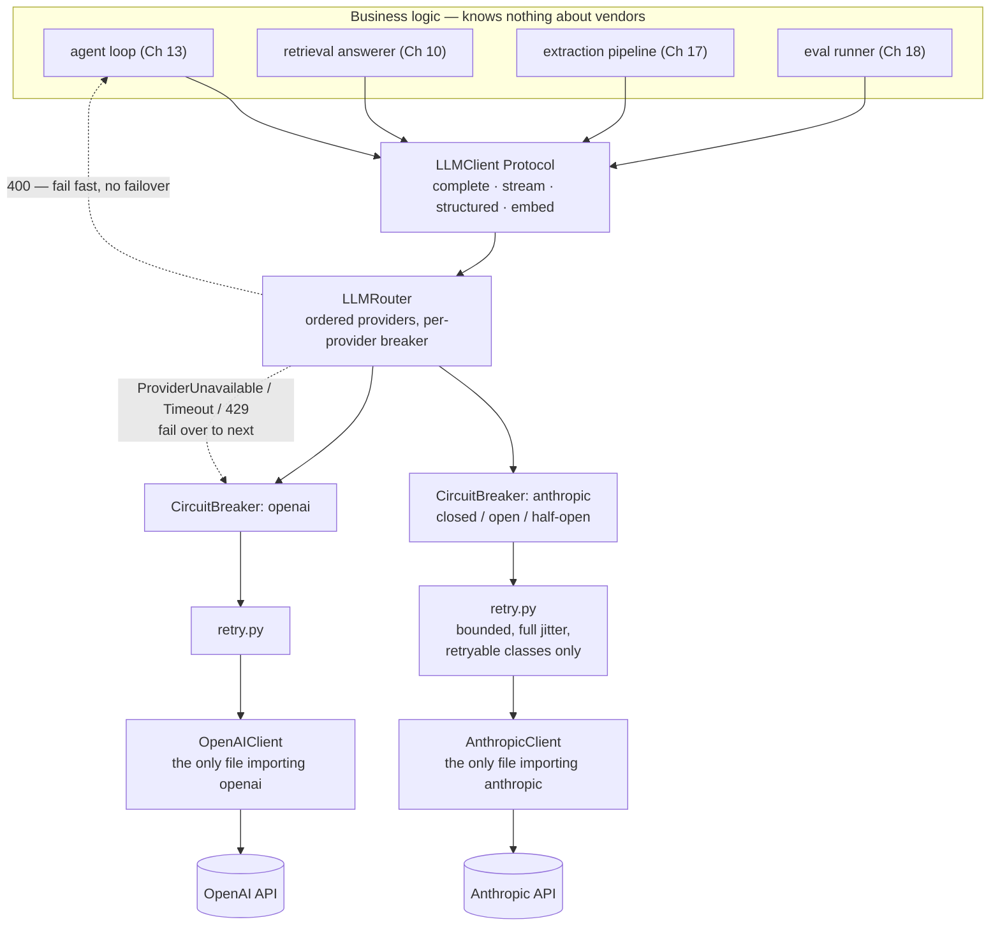

# Chapter 4 — The Provider Abstraction Layer

## What you'll be able to do after this chapter

1. Define a provider-agnostic `LLMClient` interface with four verbs — `complete`, `stream`, `structured`, `embed` — and explain to an interviewer why the interface has exactly four and not fourteen.
2. Write adapters for two providers whose APIs disagree about system prompts, tool schemas, finish reasons, and token accounting, and normalise all four disagreements without leaking either vendor's vocabulary upward.
3. Classify any provider failure into retry / fail over / fail fast, and say which HTTP status belongs in which bucket without looking it up.
4. Implement exponential backoff with full jitter, and a circuit breaker with real closed / open / half-open states and a recovery probe — then prove both work in a test suite that needs no API key and no network.
5. Route a request through a primary provider to a fallback, with a per-provider breaker, and know exactly why you must not fail over a stream after the first token or a 400 at any point.
6. Account for tokens and cost correctly across two providers that disagree about whether cached tokens are inside or outside the input count — the single most common cost-reporting bug in multi-provider systems.

---

## The problem this solves

It is 09:40 on a Tuesday. Meridian Learning's support inbox is at its daily peak, and AtlasDesk starts returning 500s. Priya Raghavan pings the channel. You open the logs and find the same line 4,000 times:

```
anthropic.APIStatusError: Error code: 529 - {'type': 'overloaded_error'}
```

The provider is having a bad twenty minutes. Your application is having a bad twenty minutes for exactly as long, because every path to a model in your codebase looks like this:

```python
# scripts/first_call.py (Chapter 2) — the shape no other module may copy
client = anthropic.Anthropic()
resp = client.messages.create(model=settings.anthropic_model, messages=[{"role": "user", "content": question}])
return resp.content[0].text
```

Four things are now true, and each is a separate week of work you did not budget for.

**You cannot fail over.** An OpenAI key sits unused in the same `.env` file. Switching to it means editing seventeen call sites, each unpacking `resp.content[0].text` — a shape OpenAI does not have. Nobody does that at 09:40.

**You cannot stop hammering.** The SDK retries twice by default, and someone wrapped the call in a `tenacity` decorator with three attempts because a 429 once flaked. Six requests per user request into an endpoint that is already overloaded, so your traffic is now part of why it stays overloaded — and every retry that reaches generation is billed.

**You cannot answer the CFO.** Tom Whitfield asks that afternoon what the incident cost. You have a provider invoice with one line on it, because `resp.usage` was read in three places and dropped in fourteen.

**You cannot even measure the outage.** Nothing records which provider served which request, because there was only ever one.

None of this is a model problem; it is a missing seam. This chapter builds it, and it is the most load-bearing code in the book: every chapter from 5 to 24 imports `LLMClient` and never mentions a vendor again. Chapter 1's rubric puts four checks at this layer — `provider_abstraction` (5), `retry_timeout` (4), `fallback_provider` (4), `usage_accounting` (3). This chapter closes all sixteen points.

---

## Concepts

### The seam, and what belongs on each side

One rule, stated so you can enforce it with `grep`:

> **`import anthropic` and `import openai` appear in exactly two files in the repository. Anywhere else, they are a failing test.**

Above the seam everything speaks in `Message`, `Completion`, `Usage`, `ToolSpec` — your types, your vocabulary. Below it sits a translation layer whose only job is turning those into one vendor's wire format and back. The value is not that you will definitely switch providers; it is that *every* cross-cutting concern gets one place to live:

| Concern | Without the seam | With the seam |
|---|---|---|
| Retry policy | Copy-pasted decorators, inconsistent | One `with_retry`, one policy object |
| Timeouts | Whatever each SDK defaults to (often 10 minutes) | Explicit per call site, defaulted at the interface |
| Cost accounting | Wherever someone remembered | Every return value carries `Usage` |
| Fallback | A refactor | A list of clients |
| Prompt caching (Ch 21) | Per call site | One adapter change |
| Tracing (Ch 19) | Per call site | One wrapper |
| Testing | Requires a key and a network | A `FakeClient` and no network |

That last row pays for the abstraction in week one. A test suite that needs an API key is not a test suite; it is a monitoring check that runs at merge time and fails on someone else's outage.

### The architecture



Read it top down. Business logic depends only on the `LLMClient` Protocol — a structural type, so nothing inherits from anything and a test fake satisfies it by having the right methods. The router is itself an `LLMClient`, which makes it invisible: callers cannot tell whether they hold a router, an adapter, or a fake, and that is what lets Chapter 21 slot a cache and a cascade into the same seam without touching a call site. Each provider gets its own breaker, because "Anthropic is down" and "OpenAI is down" are independent events and a shared breaker would let one outage lock you out of the other. Retry sits *inside* the breaker, so a burst of retries against a failing provider still counts as one failure toward opening it. The two dotted edges carry the chapter's central policy: transient failures walk down the provider list, and a 400 goes straight back to the caller.

### Four verbs, and why not more

Every model interaction AtlasDesk needs decomposes into four operations:

| Verb | Returns | Used by |
|---|---|---|
| `complete` | `Completion` (text + tool calls + usage) | Agent loop (Ch 13), judges (Ch 18), everything |
| `stream` | `AsyncIterator[StreamEvent]` | The chat API (Ch 22) |
| `structured` | `Structured[T]` — a validated Pydantic instance | Extraction (Ch 17), answers (Ch 6) |
| `embed` | `EmbeddingResult` | Ingestion (Ch 9), retrieval (Ch 10) |

The temptation is to add a fifth verb for every provider feature you meet. Resist it. **Decision rule: a new verb is justified only when the return type is genuinely different; a new parameter when the behaviour is different; everything else is a keyword argument that adapters which cannot honour it ignore.** Prompt caching (Chapter 21) tests the rule: it changes cost, not shape, so it becomes adapter behaviour plus a field on `Usage`, not a fifth verb.

`structured()` here is deliberately the **thin version**: one call, one parse, and if the model returns something that does not validate you get a `SchemaValidationError`. It reports `repairs=0` always. **Chapter 6 adds the repair loop** — feed the Pydantic error text back once, then fail closed — and increments `Structured.repairs`. The signature does not change, which is the point of freezing it now.

### What the two providers actually disagree about

The adapters are thin not because the APIs are similar but because you write the four disagreements down once:

| Disagreement | Anthropic | OpenAI | Our normalisation |
|---|---|---|---|
| System prompt | Top-level `system=` argument | A message with `role: "system"` | `Message(role="system")` in the list, or the `system=` kwarg; adapters merge both |
| Tool schema | `{"name", "description", "input_schema"}` | `{"type":"function","function":{"name","description","parameters"}}` | One `ToolSpec` with `parameters` as JSON Schema |
| Termination | `stop_reason`: `end_turn`, `max_tokens`, `tool_use`, `refusal` | `finish_reason`: `stop`, `length`, `tool_calls`, `content_filter` | `Literal["stop","length","tool_use","content_filter"]` |
| Cached tokens | `input_tokens` **excludes** cache reads; `cache_read_input_tokens` is separate | `prompt_tokens` **includes** cached; `prompt_tokens_details.cached_tokens` is a subset | `Usage.input_tokens` is the full prompt; `cached_input_tokens` is a subset of it |

That last row is where money goes missing. Sum `input_tokens` naively across both providers and you undercount Anthropic's prompts by exactly the size of the cache hit — which, once Chapter 21 turns caching on, is most of the prompt. Pick a convention, put it in the docstring, make both adapters obey it. We picked "input_tokens is the whole prompt" because it answers the question people actually ask: how big was the context?

One more asymmetry worth designing around: **Anthropic has no embeddings endpoint.** Rather than `NotImplementedError`, `AnthropicClient.embed()` raises `ProviderUnavailable` — the one class the router fails over on — so an Anthropic-primary deployment transparently embeds through OpenAI with no branching in the ingestion code. That is the abstraction paying rent.

### The failure taxonomy — the section that actually prevents incidents

Most retry code is wrong the same way: it retries everything, or nothing. Correct behaviour is three-way.

| Failure | Typical status | Retry? | Fail over? | Why |
|---|---|---|---|---|
| Malformed request, unknown model, oversized `max_tokens` | 400 / 404 / 422 | **No** | **No** | Deterministic. Three attempts buy three identical errors; the fallback provider rejects it too |
| Bad or revoked key | 401 / 403 | **No** | **Yes**, if the other provider's key is good | Your key is broken, not the internet |
| Rate limited | 429 | **Yes**, bounded, honour `Retry-After` | **Yes**, after attempts | Transient by definition |
| Overloaded / server error | 500 / 502 / 503 / 529 | **Yes**, bounded | **Yes** | Transient, and the fallback is genuinely independent |
| Timeout | client-side | **Yes**, once | **Yes** | May be a slow generation, may be a black hole |
| Connection error / DNS | none | **Yes** | **Yes** | Network |
| Content filter / refusal | 200 with a finish reason | **No** | **No** | The model answered. Retrying is how you accidentally build a jailbreak loop |

The highest-value line is the first. **A 400 you retry three times and then fail over costs two extra round trips and produces a worse error message than the original.** In our project run, before we wrote this rule down, a malformed tool schema took eleven seconds to surface as `ProviderUnavailable: all providers failed` instead of one second as `400: input_schema is not a valid JSON Schema`. The second message tells you what to fix.

### Backoff: full jitter, not "exponential plus a bit of noise"

Exponential backoff without jitter is a herd synchroniser: when a provider recovers, every client that queued up during the outage computes the same `2 ** attempt` delay, wakes in the same second, and knocks it over again. AWS's classic write-up compares the strategies and lands on **full jitter** — a uniform draw from `[0, min(cap, base * 2**(attempt-1))]`, not `base * 2**attempt ± ε`.

```
attempt 1 failed -> sleep uniform(0, 0.5)
attempt 2 failed -> sleep uniform(0, 1.0)
attempt 3 failed -> sleep uniform(0, 2.0)
```

**Decision rule:** three attempts on an interactive path, five on a batch path. **Switch when:** your p99 budget can no longer absorb `max_delay_s * (max_attempts - 1)` — then lower `max_attempts` and lean on failover, because a user waiting nine seconds for a retry ladder would rather have the fallback's answer in two.

And the rule people get wrong constantly: **turn the SDK's own retries off.** Both the `anthropic` and `openai` Python SDKs retry twice by default. Leave that on, add three of your own, and you have configured eight attempts and a 40-second worst case while believing you configured three. `max_retries=0` in the constructor; own the policy in one place.

### The circuit breaker, properly

Retry protects one request. A breaker protects the provider — and your budget — from every request retrying into a corpse simultaneously.

```
CLOSED     traffic flows; consecutive failures counted
   │ failure_threshold consecutive failures
   ▼
OPEN       every call rejected immediately, no network I/O, for recovery_timeout_s
   │ cooldown elapsed
   ▼
HALF_OPEN  half_open_max_calls probes allowed through
   │ success_threshold successes → CLOSED     │ any failure → OPEN (cooldown restarts)
```

The half-open state is not decoration. Without it a breaker either stays open until a human resets it, or slams your full load onto a provider that has been healthy for one second. The probe is a single request that finds out, cheaply, whether recovery is real. Picking the numbers:

| Parameter | Default here | Decision rule | Switch when |
|---|---|---|---|
| `failure_threshold` | 5 | Roughly your background transient-error rate over a 10-second window, times three | You see the breaker open during normal operation → raise it; a full outage takes >10 s to trip → lower it |
| `recovery_timeout_s` | 30 | Median provider incident recovery is minutes; 30 s costs one wasted probe per 30 s | Probes are themselves expensive (long prompts) → raise to 60 s and probe with a tiny prompt instead |
| `half_open_max_calls` | 1 | One probe is enough to learn the answer | Traffic is high enough that a single probe's outcome is noisy → 3, with `success_threshold=3` |
| `success_threshold` | 1 | Close fast; a re-failure re-opens immediately anyway | Flapping (open/close cycles more than twice in five minutes) → raise to 3 |

Two rules the tests below pin down. **Failure counting is consecutive, not cumulative** — one success resets it; a cumulative counter opens the breaker after a slow week of unrelated blips, which is how teams end up disabling breakers entirely. And **a 400 must not count as a breaker failure**: the provider answered, correctly, that our request was bad, so it is healthy. Counting your own defects against provider health is how a bad deploy turns a small bug into a total outage.

### Router policy: failover now, cascade later

The router walks its client list in order: breaker closed or half-open? If not, skip and record it. If yes, call through the retry policy. On a failover-class error, record a breaker failure and move on. On a 400-class error, record a breaker *success* and re-raise immediately. List exhausted, raise `ProviderUnavailable` with a summary of what each provider did.

Two policy details worth arguing about, because interviewers do.

**Do not forward an explicit `model=` to a fallback provider.** Pin a Claude model id, let Anthropic go down, forward that id to OpenAI, and you get a 404 — your fallback is now broken in a way that only surfaces during outages, the worst possible time to find out. Our router drops the override for non-primary clients and lets each adapter use its configured default.

**Never fail over a stream after the first token.** Once bytes have reached the browser you cannot un-send them; restarting from a different model mid-sentence produces a visibly incoherent answer and a citation set that no longer matches the text. `stream()` fails over freely *before* the first event and propagates after it, leaving the UI to offer a retry. **Decision rule: failover is safe only while the response is still atomic.**

Cascading — cheap model first, escalate when the answer is weak — uses the same seam and is deliberately **not** here. You cannot know whether the cheap tier is good enough without an eval set, and that arrives in Chapter 18. Chapter 21 builds the cascade, on evidence.

### The honest cost of this abstraction, and when not to pay it

Abstractions are not free. You give up three things: **lowest common denominator by default** — anything one provider does and the other does not becomes an optional parameter the weaker adapter silently ignores, so extended thinking, hosted tools and server-side conversation state are not in `LLMClient` today; **invisible translation bugs** — mis-map `stop_reason` and nothing crashes, your agent loop just occasionally decides a turn ended when it did not, which is why the adapters need integration tests and not only unit tests; and **real maintenance**, roughly an afternoon a quarter as two SDKs move underneath you.

**When you should build your own seam (this chapter):** you use two or three providers, you need cost and traces per feature and per tenant, your logic is in one language, and you want your test suite to run offline. That is AtlasDesk, and it is most product teams.

**When you should use LiteLLM, an OpenRouter-style marketplace, or a hosted gateway instead:** ten or more providers, services in three languages needing the same routing policy, or centrally-enforced budgets across teams. **Switch when:** you are writing a third adapter, or a second language needs the same rules — at which point the policy belongs in a network hop, not a library. Note that adopting a gateway does not mean deleting this code: a gateway is one more adapter behind the same `LLMClient`, which is what makes that migration a one-file change instead of a quarter.

> **▸ Senior practice #4 — Provider-agnostic interface: a model swap is a config change, not a refactor**
>
> The test is brutally simple, and I have used it in interviews: *how many files change when you switch the model that answers your main use case?* The answer should be zero — it is an environment variable. Switch the whole provider, and the answer should be one line in `.env`. If the answer is "seventeen files and a sprint," you do not have an AI system; you have a vendor SDK with your business logic tangled around it.
>
> What you are protecting against is no longer mainly outages. It is that the frontier moves every few months, that the price of a capability drops by an order of magnitude roughly annually, and that the best model for your extraction task is routinely not the best one for your chat task. LangChain's *State of Agent Engineering* survey (n=1,340, fielded 18 November – 2 December 2025) found **more than 75% of teams already run more than one model in production**. Multi-model is the default condition, not a contingency plan.
>
> The seam is also what makes the rest of this book testable: every test from here to Chapter 24 runs with no API key, because `LLMClient` is a Protocol and `FakeClient` satisfies it.
>
> Where teams get this wrong: they build the interface and then leak the vendor through it anyway — an `anthropic_extra_body: dict` on the signature, or a raw SDK response returned "just in case." One leak and every caller depends on it. The interface is a wall, not a suggestion.

---

## How industry does it

### Case 1 — Uber's GenAI Gateway: one seam for sixty use cases

**The problem.** By 2024 Uber had identified **more than 60 distinct LLM use cases** across the company, with teams integrating providers independently: duplicated auth, duplicated retry logic, no central cost attribution, and — critically for a company handling rider and driver data — no consistent control over what personal data left the building in a prompt.

**The architecture.** Uber built an internal **GenAI Gateway** and made one decision that is worth stealing outright: they deliberately **mirrored the HTTP/JSON interface of the OpenAI API** as their internal contract, so that, in their words, developers write code "as if they're using native OpenAI client, while being able to access LLMs from different vendors." Behind that facade sit multiple back ends — OpenAI, Google Vertex AI, and Uber-hosted models — plus the cross-cutting layer that is the actual product: authentication and authorisation, metrics emission, audit logs "for comprehensive cost attribution, security audit purposes, quality evaluation," and a **PII redaction step** that anonymises sensitive entities before a request reaches a third-party vendor and restores them in the response (names become placeholders such as `ANONYMIZED_NAME_0`). Access to the gateway is gated by a security review against Uber's data-handling standard.

**The measured outcome.** As published, the gateway serves close to **30 customer teams** at **16 million queries per month, with a peak of 25 QPS**, across those 60+ use cases.

**What to copy at 1/1000th the scale.**

- **Pick an existing interface shape rather than inventing one.** Uber chose the OpenAI wire format; we choose our own Pydantic types because we are one Python codebase and want the type checker. Both beat a bespoke JSON dialect: your seam should look like *something*.
- **The gateway's value is the cross-cutting layer, not the routing.** Auth, audit, cost attribution, redaction. Our `Usage` object and Chapter 19's `llm_calls` table are the 1/1000th-scale version of Uber's audit log.
- **Redaction belongs at the seam**, because it is the only place that sees every outbound request. AtlasDesk's Chapter 20 PII layer plugs in exactly here, and can only do so because there is a "here".
- **16M queries/month at 25 peak QPS is ~500k/day** — fifty times AtlasDesk's target. You do not need Uber's scale to need Uber's seam; you need it the moment you have two use cases and one invoice.

### Case 2 — Wealthsimple's LLM Gateway: the seam as a security control

**The problem.** Wealthsimple, a Canadian financial-services company, wanted employees to get the productivity benefit of LLMs without the two risks their regulators care about. They state both plainly: first, "what happens to the proprietary company data or personal information shared with an external LLM?" — at the time, mainstream provider consumer terms allowed data to be used to improve their systems. Second, reliability: rate limiting and provider overload causing production errors.

**The architecture.** A self-built **LLM Gateway**: an API wrapper abstracting multiple providers (OpenAI and Cohere at the time of writing, more planned), plus an internal chat front end routed through the endpoints whose terms restrict data usage. In front of the providers sits a **PII redaction layer** — heuristics plus an in-house model — and full tracking of everything sent externally. Accuracy controls, they note, live in the application layer above the gateway, not inside it.

**The measured outcome.** More than **72,000 requests** processed through the gateway in the period following its April 2023 internal launch, across code generation, content editing, and general question answering.

**What to copy at 1/1000th the scale.**

- **The abstraction is a compliance artifact, not just an engineering one.** Aisha Bello's Chapter 20 question — "prove no learner PII reached a US provider" — is answerable only if there is one chokepoint. Build it before you need to prove anything.
- **Separate the layers by failure type.** Wealthsimple keeps hallucination mitigation *above* the gateway and data/reliability controls *inside* it — exactly the boundary between this chapter and Chapters 6, 10 and 20.
- **72,000 requests is a small number, and that is the point.** A two-provider gateway at tens of thousands of requests justified itself on data control alone.

### Two shorter ones, because they set the boundary conditions

**GitHub Copilot's multi-model turn.** On 29 October 2024 GitHub announced Copilot support for Anthropic's Claude, Google's Gemini, and OpenAI models side by side, arguing that "the next phase of AI code generation will not only be defined by multi-model functionality, but by multi-model choice," because these models "individually excel at different programming tasks." A product with a single-vendor origin story rebuilt itself around a provider seam. If Copilot needs one, your support assistant does.

**Vercel's AI Gateway publishes the arithmetic for why fallback works.** Its uptime documentation counts only the *final* attempt per request and states the consequence: "AI Gateway uptime can be higher than any individual provider's uptime, since fallback logic can recover from single-provider failures." Its model pages expose per-provider uptime for the *same model* through Anthropic's own API, Bedrock, and Vertex — the cheapest fallback available to you, **same model, three routes**, and worth doing before multi-vendor fallback because it needs no eval work at all: the answers are identical by construction.

**And the counterexample.** On 18 November 2025 a Cloudflare failure took down large parts of the web at once, including multiple major AI services. Provider failover would not have helped: the failure was in a *shared dependency*, not in either provider. **Decision rule: fallback buys independence only from uncorrelated failures. Enumerate your shared dependencies — CDN, DNS, egress, cloud region — and know that your degraded mode for a correlated outage is a cached answer, a queued job, or an honest error page, not a second vendor.** AtlasDesk's C6 escalation-to-human path is that degraded mode, which is one more reason it is a capability and not a nice-to-have.

---

## Build: AtlasDesk increment 3 — the provider layer

### Project state

**What exists after Chapters 1–3:**

- Chapter 1: `preflight/` — the standard-library readiness scorer. Not part of the AtlasDesk package.
- Chapter 2: the repo scaffold — `pyproject.toml`, `.env`/`.env.example`, `Makefile`, `.pre-commit-config.yaml`, `src/atlasdesk/config.py` (typed `Settings`), `src/atlasdesk/errors.py` (the exception hierarchy), `src/atlasdesk/llm/pricing.py` + `pricing.json`, `scripts/first_call.py`.
- Chapter 3: `docs/spec.md` (C1–C7 and the six NFRs), `docs/adr/0001-single-datastore-postgres.md`, `evals/datasets/seed_20.jsonl`, `scripts/baseline.py`, `docker-compose.yml` (Postgres 16 + pgvector), `migrations/0000_init.sql`.

**What this chapter adds:** `llm/base.py` (the Protocol and every shared Pydantic model), `llm/retry.py`, `llm/circuit.py`, `llm/anthropic_client.py`, `llm/openai_client.py`, `llm/router.py`, `llm/factory.py`, `llm/fake.py`, and a five-file test suite that runs green with **no API key, no network, and neither provider SDK installed**.

**What it deliberately does not add:** a repair loop (Ch 6), a prompt registry (Ch 5 — the system prompts in this chapter's examples are still inline strings, for the last time), caching and a cost cascade (Ch 21), tracing (Ch 19).

### Repo tree diff

```
  atlasdesk/
  ├── pyproject.toml                     # + pytest asyncio_mode, + tenacity dep
  ├── .env.example                       # unchanged
  ├── src/atlasdesk/
  │   ├── config.py                      # unchanged (Ch 2)
  │   ├── errors.py                      # unchanged (Ch 2)
  │   └── llm/
  │       ├── pricing.py                 # unchanged (Ch 2)
  │       ├── pricing.json               # unchanged (Ch 2)
+ │       ├── base.py                    # the Protocol + every shared model
+ │       ├── retry.py                   # bounded retry, full jitter
+ │       ├── circuit.py                 # closed / open / half-open + probe
+ │       ├── anthropic_client.py        # only file that imports anthropic
+ │       ├── openai_client.py           # only file that imports openai
+ │       ├── router.py                  # primary -> fallback, per-provider breaker
+ │       ├── factory.py                 # get_client()
+ │       └── fake.py                    # scripted client for every later test
  ├── scripts/
  │   ├── first_call.py                 # unchanged (Ch 2)
+ │   └── provider_demo.py              # runnable demo, key optional
  └── tests/
+     ├── conftest.py                    # FakeClock, RecordingSleep, fixtures
+     ├── test_base.py                   # protocol conformance, thin structured()
+     ├── test_retry.py                  # no retry on 400, bounded on 429, jitter
+     ├── test_circuit.py                # opens after N, half-opens, probe
+     ├── test_router.py                 # failover, fail-fast, breaker, stream
+     └── test_usage.py                  # cost accounting correctness
```

Install what this chapter needs:

```bash
uv add tenacity
uv add --dev pytest pytest-asyncio
# Provider SDKs, if you have not added them already. You need at most one:
uv add anthropic openai
```

### Recap: what Chapter 2 already gave us

Three unchanged files this chapter depends on. `config.py` holds the typed `Settings` — keys as `SecretStr` so they cannot be printed or serialised into a trace, model ids as configuration so no marketing name is ever a literal. `errors.py` holds the hierarchy `AtlasError → ConfigError | ProviderError → (RateLimitError, ProviderTimeout, ProviderUnavailable) | SchemaValidationError | …`. And `llm/pricing.py`, whose design point is that **prices are data you edit, not constants this book asserts**:

```python
# src/atlasdesk/llm/pricing.py  (Chapter 2 — reproduced because Chapter 4 calls it)
def cost_usd(
    model: str,
    input_tokens: int,
    output_tokens: int,
    cached_input_tokens: int = 0,
    *,
    embedding: bool = False,
) -> float:
    """USD cost of one call. Unknown model ids fall back to the default price.

    Contract: ``input_tokens`` is the FULL prompt size including any cached
    prefix; ``cached_input_tokens`` is the subset of it billed at the cache
    read rate. Adapters normalise providers into this convention.
    """
    return price_book().for_model(model, embedding=embedding).cost(
        input_tokens, output_tokens, cached_input_tokens
    )


def cost_per_successful_task(daily_cost: float, requests_per_day: int, success_rate: float) -> float:
    """The only cost number worth putting on a dashboard.

    Raises:
        ValueError: if ``success_rate`` is not in (0, 1].
    """
    if not 0.0 < success_rate <= 1.0:
        raise ValueError("success_rate must be in (0, 1]")
    return daily_cost / (requests_per_day * success_rate)
```

*File: `src/atlasdesk/llm/pricing.json`* — illustrative placeholders. Replace every number with your provider's current published prices before you quote a cost to anyone.

```
{
  "_note": "ILLUSTRATIVE placeholders, not vendor prices. Replace every number here with your provider's current published price list before you quote a cost.",
  "default": {"input_per_mtok": 3.0, "output_per_mtok": 15.0, "cached_input_per_mtok": 0.3},
  "embedding_default": {"input_per_mtok": 0.02, "output_per_mtok": 0.0},
  "models": {}
}
```

### 1. The contract

This is the file every later chapter imports. Read the docstrings; they are the specification.

```python
# src/atlasdesk/llm/base.py
"""The provider-agnostic contract every AtlasDesk model call goes through.

Nothing in this module imports a vendor SDK, and nothing outside
``llm/anthropic_client.py`` and ``llm/openai_client.py`` ever will. Business
logic depends on ``LLMClient`` and on the Pydantic models defined here.

These signatures are frozen from Chapter 4 onward. Later chapters may add
fields that have defaults; they may not rename or remove one.
"""

from __future__ import annotations

from collections.abc import AsyncIterator, Sequence
from typing import Any, Generic, Literal, Protocol, TypeVar, runtime_checkable

from pydantic import BaseModel, Field

from atlasdesk.errors import ProviderError

T = TypeVar("T", bound=BaseModel)

FinishReason = Literal["stop", "length", "tool_use", "content_filter"]
Role = Literal["system", "user", "assistant", "tool"]


class Usage(BaseModel):
    """What one call consumed. Threaded through every return value.

    ``input_tokens`` is the full prompt size *including* any cached prefix;
    ``cached_input_tokens`` is the subset of it that was served from cache.
    Providers disagree about this, so adapters normalise into this convention.
    """

    model: str
    input_tokens: int
    output_tokens: int
    cached_input_tokens: int = 0
    cost_usd: float
    latency_ms: int

    @property
    def total_tokens(self) -> int:
        return self.input_tokens + self.output_tokens

    def merged_with(self, other: Usage) -> Usage:
        """Combine two calls' usage. Used by agent loops and the repair loop."""
        model = self.model if self.model == other.model else f"{self.model}+{other.model}"
        return Usage(
            model=model,
            input_tokens=self.input_tokens + other.input_tokens,
            output_tokens=self.output_tokens + other.output_tokens,
            cached_input_tokens=self.cached_input_tokens + other.cached_input_tokens,
            cost_usd=self.cost_usd + other.cost_usd,
            latency_ms=self.latency_ms + other.latency_ms,
        )


class Message(BaseModel):
    """One turn. ``tool_call_id`` and ``name`` are set only on tool results."""

    role: Role
    content: str
    tool_call_id: str | None = None
    name: str | None = None


class ToolCall(BaseModel):
    """A model's request to run a tool, with arguments already parsed to a dict."""

    id: str
    name: str
    arguments: dict[str, Any]


class ToolSpec(BaseModel):
    """A tool offered to the model. ``parameters`` is a JSON Schema object."""

    name: str
    description: str
    parameters: dict[str, Any]


class Completion(BaseModel):
    """One non-streamed model response."""

    text: str
    tool_calls: list[ToolCall] = []
    finish_reason: FinishReason
    usage: Usage


class StreamEvent(BaseModel):
    """One event from a streamed response.

    A stream emits zero or more ``text`` events, zero or more ``tool_call``
    events, exactly one ``usage`` event, and exactly one terminal ``done``.
    """

    type: Literal["text", "tool_call", "usage", "done"]
    text: str = ""
    tool_call: ToolCall | None = None
    usage: Usage | None = None


class Structured(BaseModel, Generic[T]):
    """A validated instance of a caller-supplied Pydantic schema.

    ``repairs`` stays 0 in Chapter 4's thin implementation; Chapter 6 adds the
    repair loop that increments it.
    """

    value: T
    usage: Usage
    repairs: int = 0


class EmbeddingResult(BaseModel):
    """Embeddings for a batch of texts, in input order."""

    vectors: list[list[float]]
    model: str
    usage: Usage


@runtime_checkable
class LLMClient(Protocol):
    """Everything AtlasDesk is allowed to ask a model provider to do."""

    name: str

    async def complete(
        self,
        messages: Sequence[Message],
        *,
        system: str | None = None,
        model: str | None = None,
        max_tokens: int = 1024,
        temperature: float = 0.0,
        tools: Sequence[ToolSpec] | None = None,
        timeout_s: float = 30.0,
    ) -> Completion: ...

    def stream(
        self,
        messages: Sequence[Message],
        *,
        system: str | None = None,
        model: str | None = None,
        max_tokens: int = 1024,
        temperature: float = 0.0,
        timeout_s: float = 60.0,
    ) -> AsyncIterator[StreamEvent]: ...

    async def structured(
        self,
        messages: Sequence[Message],
        schema: type[T],
        *,
        system: str | None = None,
        model: str | None = None,
        max_repairs: int = 1,
        timeout_s: float = 30.0,
    ) -> Structured[T]: ...

    async def embed(
        self, texts: Sequence[str], *, model: str | None = None
    ) -> EmbeddingResult: ...


# --------------------------------------------------------------------------
# Transport metadata on exceptions.
#
# errors.py froze in Chapter 2 and the whole book catches those classes, so we
# do not subclass them to carry a status code. We attach the metadata to the
# instance instead and read it back through accessors, which keeps
# `except RateLimitError` working everywhere.
# --------------------------------------------------------------------------


def provider_error(
    kind: type[ProviderError],
    message: str,
    *,
    provider: str,
    status_code: int | None = None,
    retry_after_s: float | None = None,
) -> ProviderError:
    """Build a ProviderError carrying transport metadata for the retry layer."""
    exc = kind(message)
    exc.provider = provider  # type: ignore[attr-defined]
    exc.status_code = status_code  # type: ignore[attr-defined]
    exc.retry_after_s = retry_after_s  # type: ignore[attr-defined]
    return exc


def status_of(exc: BaseException) -> int | None:
    """HTTP status behind a ProviderError, if the adapter recorded one."""
    value = getattr(exc, "status_code", None)
    return value if isinstance(value, int) else None


def retry_after_of(exc: BaseException) -> float | None:
    """Server-advertised Retry-After in seconds, if the adapter recorded one."""
    value = getattr(exc, "retry_after_s", None)
    return float(value) if isinstance(value, (int, float)) else None


def strict_json_schema(schema: type[BaseModel]) -> dict[str, Any]:
    """JSON Schema for a Pydantic model, tightened for strict provider modes.

    Providers that guarantee schema conformance require every object to close
    itself (``additionalProperties: false``) and to list all its properties as
    required. Pydantic emits neither by default.
    """
    document = schema.model_json_schema()
    _tighten(document)
    for definition in document.get("$defs", {}).values():
        _tighten(definition)
    return document


def _tighten(node: dict[str, Any]) -> None:
    if node.get("type") == "object" or "properties" in node:
        node["additionalProperties"] = False
        properties = node.get("properties", {})
        if properties:
            node["required"] = list(properties)
    for key in ("items", "additionalItems"):
        child = node.get(key)
        if isinstance(child, dict):
            _tighten(child)
    for key in ("anyOf", "oneOf", "allOf", "prefixItems"):
        for child in node.get(key, []):
            if isinstance(child, dict):
                _tighten(child)
```

Three design notes, because they get asked about. **`LLMClient` is a `Protocol`, not an ABC** — structural typing means adapters do not import the interface to satisfy it, a fake satisfies it by having the right methods, and `mypy --strict` still catches signature drift at every call site. **`stream()` is a plain `def` returning an `AsyncIterator`**, so callers write `async for event in client.stream(...)` with no extra `await`; adapters implement it by returning an inner async generator. **`provider_error()` exists because `errors.py` froze in Chapter 2** — the retry layer needs a status code and a `Retry-After`, but the whole book catches `RateLimitError` and `ProviderUnavailable` by class, so subclassing to add fields would silently break every `except` in Chapters 5–24. When a frozen contract meets a new requirement, extend around the contract, not through it.

### 2. Retry: bounded, jittered, and picky about what it retries

```python
# src/atlasdesk/llm/retry.py
"""Bounded retry with exponential backoff and full jitter.

The only interesting decision in this file is *what not to retry*. A 400 is
your bug: the same request will fail identically three more times, and you will
have paid three round trips to learn nothing. A 429 or a 503 is the provider's
problem and is worth waiting for.
"""

from __future__ import annotations

import asyncio
import random
from collections.abc import Awaitable, Callable
from typing import TypeVar

from pydantic import BaseModel, Field
from tenacity import AsyncRetrying, RetryCallState, retry_if_exception_type, stop_after_attempt

from atlasdesk.errors import ProviderTimeout, ProviderUnavailable, RateLimitError
from atlasdesk.llm.base import retry_after_of

R = TypeVar("R")

#: The only exceptions worth trying again. Everything else is a caller defect.
RETRYABLE: tuple[type[Exception], ...] = (RateLimitError, ProviderTimeout, ProviderUnavailable)


class RetryPolicy(BaseModel):
    """Retry configuration. Defaults are tuned for an interactive request path."""

    max_attempts: int = Field(default=3, ge=1, le=10)
    base_delay_s: float = Field(default=0.5, gt=0)
    max_delay_s: float = Field(default=8.0, gt=0)
    respect_retry_after: bool = True
    max_retry_after_s: float = Field(default=20.0, gt=0)


def _full_jitter(attempt: int, policy: RetryPolicy, rng: random.Random) -> float:
    """Sleep for a uniform draw from [0, min(cap, base * 2**(attempt-1))].

    Full jitter, not "exponential plus a bit of noise". When a provider recovers
    from an outage, every client that queued up during it retries at once. Equal
    backoff means they all hit the same second and knock it over again. Drawing
    uniformly from the whole window is what actually spreads the herd.
    """
    ceiling = min(policy.max_delay_s, policy.base_delay_s * (2 ** max(0, attempt - 1)))
    return rng.uniform(0.0, ceiling)


async def with_retry(
    operation: Callable[[], Awaitable[R]],
    *,
    policy: RetryPolicy | None = None,
    sleep: Callable[[float], Awaitable[None]] = asyncio.sleep,
    rng: random.Random | None = None,
) -> R:
    """Run ``operation`` with bounded retries on transient provider failures.

    Args:
        operation: A zero-argument coroutine function. Called once per attempt.
        policy: Attempt count and backoff shape. Defaults to ``RetryPolicy()``.
        sleep: Injected for tests, which must not actually wait.
        rng: Injected for tests, which must be deterministic.

    Returns:
        Whatever ``operation`` returns.

    Raises:
        ProviderError: the last failure, re-raised once attempts are exhausted.
        Exception: any non-retryable exception, raised immediately on attempt 1.
    """
    active = policy or RetryPolicy()
    generator = rng or random.Random()

    def wait(state: RetryCallState) -> float:
        exc = state.outcome.exception() if state.outcome else None
        if active.respect_retry_after and exc is not None:
            advertised = retry_after_of(exc)
            if advertised is not None:
                return min(advertised, active.max_retry_after_s)
        return _full_jitter(state.attempt_number, active, generator)

    async for attempt in AsyncRetrying(
        retry=retry_if_exception_type(RETRYABLE),
        stop=stop_after_attempt(active.max_attempts),
        wait=wait,
        sleep=sleep,
        reraise=True,
    ):
        with attempt:
            return await operation()
    raise AssertionError("unreachable: tenacity always returns or raises")
```

### 3. The circuit breaker

```python
# src/atlasdesk/llm/circuit.py
"""A circuit breaker with the three states that matter.

Retry protects a single request. A breaker protects the provider — and your
wallet — from a thousand requests all retrying into a dead endpoint at once.

    CLOSED     traffic flows; consecutive failures are counted
    OPEN       every call is rejected immediately, for recovery_timeout_s
    HALF_OPEN  a small number of probe calls are allowed through

The half-open state is the whole point. Without it a breaker either stays open
forever or slams the full load back onto a provider that has recovered for
exactly one second.
"""

from __future__ import annotations

import asyncio
import time
from collections.abc import Awaitable, Callable
from enum import StrEnum
from typing import TypeVar

from pydantic import BaseModel, Field

from atlasdesk.errors import ProviderUnavailable
from atlasdesk.llm.base import provider_error

R = TypeVar("R")


class BreakerState(StrEnum):
    CLOSED = "closed"
    OPEN = "open"
    HALF_OPEN = "half_open"


class BreakerConfig(BaseModel):
    """Thresholds. See the chapter for how to pick these for your traffic."""

    failure_threshold: int = Field(default=5, ge=1)
    recovery_timeout_s: float = Field(default=30.0, gt=0)
    half_open_max_calls: int = Field(default=1, ge=1)
    success_threshold: int = Field(default=1, ge=1)


class BreakerSnapshot(BaseModel):
    """Everything a health endpoint or dashboard needs. Safe to serialise."""

    name: str
    state: BreakerState
    consecutive_failures: int
    opened_at_s: float | None
    seconds_until_probe: float | None


class CircuitBreaker:
    """One breaker per provider. Safe to share across concurrent tasks."""

    def __init__(
        self,
        name: str,
        *,
        config: BreakerConfig | None = None,
        clock: Callable[[], float] = time.monotonic,
    ) -> None:
        self.name = name
        self.config = config or BreakerConfig()
        self._clock = clock
        self._lock = asyncio.Lock()
        self._state = BreakerState.CLOSED
        self._failures = 0
        self._successes = 0
        self._opened_at: float | None = None
        self._probes_in_flight = 0

    @property
    def state(self) -> BreakerState:
        """Last known state. Call ``allow()`` to force a cooldown re-check."""
        return self._state

    async def allow(self) -> bool:
        """May a call go out right now? Transitions OPEN to HALF_OPEN on cooldown."""
        async with self._lock:
            if self._state is BreakerState.CLOSED:
                return True
            if self._state is BreakerState.OPEN:
                assert self._opened_at is not None
                if self._clock() - self._opened_at < self.config.recovery_timeout_s:
                    return False
                self._state = BreakerState.HALF_OPEN
                self._successes = 0
                self._probes_in_flight = 0
            if self._probes_in_flight >= self.config.half_open_max_calls:
                return False
            self._probes_in_flight += 1
            return True

    async def record_success(self) -> None:
        """A call came back. In HALF_OPEN, enough of these close the breaker."""
        async with self._lock:
            if self._state is BreakerState.HALF_OPEN:
                self._probes_in_flight = max(0, self._probes_in_flight - 1)
                self._successes += 1
                if self._successes >= self.config.success_threshold:
                    self._close_locked()
                return
            self._failures = 0

    async def record_failure(self) -> None:
        """A call failed transiently. Opens the breaker at the threshold, and
        re-opens immediately if a half-open probe fails."""
        async with self._lock:
            if self._state is BreakerState.HALF_OPEN:
                self._probes_in_flight = max(0, self._probes_in_flight - 1)
                self._open_locked()
                return
            self._failures += 1
            if self._failures >= self.config.failure_threshold:
                self._open_locked()

    def _open_locked(self) -> None:
        self._state = BreakerState.OPEN
        self._opened_at = self._clock()
        self._successes = 0
        self._probes_in_flight = 0

    def _close_locked(self) -> None:
        self._state = BreakerState.CLOSED
        self._failures = 0
        self._successes = 0
        self._opened_at = None
        self._probes_in_flight = 0

    async def reset(self) -> None:
        """Force closed. For operators and tests, never for the request path."""
        async with self._lock:
            self._close_locked()

    def snapshot(self) -> BreakerSnapshot:
        """Current state for /readyz and dashboards. Chapter 22 serves this."""
        remaining: float | None = None
        if self._state is BreakerState.OPEN and self._opened_at is not None:
            remaining = max(
                0.0, self.config.recovery_timeout_s - (self._clock() - self._opened_at)
            )
        return BreakerSnapshot(
            name=self.name,
            state=self._state,
            consecutive_failures=self._failures,
            opened_at_s=self._opened_at,
            seconds_until_probe=remaining,
        )

    async def call(self, operation: Callable[[], Awaitable[R]]) -> R:
        """Run ``operation`` under the breaker.

        Raises:
            ProviderUnavailable: the breaker is open, so no call was attempted.
        """
        if not await self.allow():
            raise provider_error(
                ProviderUnavailable,
                f"circuit open for {self.name}",
                provider=self.name,
            )
        try:
            result = await operation()
        except Exception:
            await self.record_failure()
            raise
        await self.record_success()
        return result
```

Note that `call()` treats *every* exception as a breaker failure. That is the right behaviour for a general-purpose helper and the wrong behaviour for our router, which needs the finer-grained "a 400 means the provider is healthy" rule. The router therefore drives `record_success` and `record_failure` itself rather than using `call()`; `call()` stays for the simpler call sites in Chapters 12 and 22.

### 4. The Anthropic adapter

One of exactly two files in the repository allowed to `import anthropic`. The SDK import is lazy — inside the methods — which keeps process start-up fast, lets a reader with only an OpenAI key import this module, and lets the whole test suite run with neither SDK installed.

```python
# src/atlasdesk/llm/anthropic_client.py
"""The only module in AtlasDesk allowed to import ``anthropic``.

The SDK is imported lazily inside the methods that need it. That keeps process
start-up fast, keeps the unit test suite runnable with neither SDK installed,
and means a reader with only an OpenAI key can still import this module.
"""

from __future__ import annotations

import time
from collections.abc import AsyncIterator, Sequence
from typing import Any, TypeVar

from pydantic import BaseModel, ValidationError

from atlasdesk.config import Settings, get_settings
from atlasdesk.errors import (
    ConfigError,
    ProviderError,
    ProviderTimeout,
    ProviderUnavailable,
    RateLimitError,
    SchemaValidationError,
)
from atlasdesk.llm.base import (
    Completion,
    EmbeddingResult,
    FinishReason,
    Message,
    Structured,
    StreamEvent,
    ToolCall,
    ToolSpec,
    Usage,
    provider_error,
    strict_json_schema,
)
from atlasdesk.llm.pricing import cost_usd

T = TypeVar("T", bound=BaseModel)

_STOP_REASONS: dict[str, FinishReason] = {
    "end_turn": "stop",
    "stop_sequence": "stop",
    "max_tokens": "length",
    "tool_use": "tool_use",
    "pause_turn": "stop",
    "refusal": "content_filter",
}

_STRUCTURED_TOOL = "emit_result"


class AnthropicClient:
    """``LLMClient`` implementation over the Anthropic Messages API."""

    name = "anthropic"

    def __init__(self, *, settings: Settings | None = None) -> None:
        self.settings = settings or get_settings()
        if self.settings.anthropic_api_key is None:
            raise ConfigError("ANTHROPIC_API_KEY is not set")
        self._sdk: Any = None

    def _client(self, timeout_s: float) -> Any:
        """Build (once) and return the async SDK client.

        SDK-level retries are disabled: retry policy lives in ``llm/retry.py``
        so that one place decides what is retryable and one place emits the
        metric. Two retry layers means eight attempts when you asked for three.
        """
        if self._sdk is None:
            import anthropic

            assert self.settings.anthropic_api_key is not None
            self._sdk = anthropic.AsyncAnthropic(
                api_key=self.settings.anthropic_api_key.get_secret_value(),
                max_retries=0,
            )
        return self._sdk.with_options(timeout=timeout_s)

    def _model(self, override: str | None) -> str:
        model = override or self.settings.anthropic_model
        if not model:
            raise ConfigError("Set ANTHROPIC_MODEL in .env to a current model id")
        return model

    def _translate(self, exc: Exception) -> ProviderError:
        """Map an SDK exception onto the book's exception hierarchy."""
        import anthropic

        if isinstance(exc, anthropic.APITimeoutError):
            return provider_error(ProviderTimeout, str(exc), provider=self.name)
        if isinstance(exc, anthropic.RateLimitError):
            header = exc.response.headers.get("retry-after") if exc.response else None
            return provider_error(
                RateLimitError,
                str(exc),
                provider=self.name,
                status_code=429,
                retry_after_s=float(header) if header else None,
            )
        if isinstance(exc, anthropic.APIConnectionError):
            return provider_error(ProviderUnavailable, str(exc), provider=self.name)
        if isinstance(exc, anthropic.APIStatusError):
            status = exc.status_code
            kind = ProviderUnavailable if status >= 500 or status == 529 else ProviderError
            return provider_error(kind, str(exc), provider=self.name, status_code=status)
        return provider_error(ProviderError, str(exc), provider=self.name)

    @staticmethod
    def _split(messages: Sequence[Message]) -> tuple[str | None, list[dict[str, Any]]]:
        """Anthropic takes the system prompt as a top-level argument, not a turn."""
        system_parts: list[str] = []
        turns: list[dict[str, Any]] = []
        for message in messages:
            if message.role == "system":
                system_parts.append(message.content)
            elif message.role == "tool":
                turns.append(
                    {
                        "role": "user",
                        "content": [
                            {
                                "type": "tool_result",
                                "tool_use_id": message.tool_call_id or "",
                                "content": message.content,
                            }
                        ],
                    }
                )
            else:
                turns.append({"role": message.role, "content": message.content})
        return ("\n\n".join(system_parts) or None), turns

    def _usage(self, raw: Any, model: str, started: float) -> Usage:
        """Normalise Anthropic's usage object into the book's convention.

        Anthropic reports ``input_tokens`` *excluding* cache reads and cache
        writes. Our ``Usage.input_tokens`` is the full prompt, so we add them
        back and record the cached subset separately. Getting this wrong is the
        single most common cost-reporting bug in multi-provider systems.
        """
        fresh = int(getattr(raw, "input_tokens", 0) or 0)
        cache_read = int(getattr(raw, "cache_read_input_tokens", 0) or 0)
        cache_write = int(getattr(raw, "cache_creation_input_tokens", 0) or 0)
        output = int(getattr(raw, "output_tokens", 0) or 0)
        total_input = fresh + cache_read + cache_write
        return Usage(
            model=model,
            input_tokens=total_input,
            output_tokens=output,
            cached_input_tokens=cache_read,
            cost_usd=cost_usd(model, total_input, output, cache_read),
            latency_ms=int((time.perf_counter() - started) * 1000),
        )

    async def complete(
        self,
        messages: Sequence[Message],
        *,
        system: str | None = None,
        model: str | None = None,
        max_tokens: int = 1024,
        temperature: float = 0.0,
        tools: Sequence[ToolSpec] | None = None,
        timeout_s: float = 30.0,
    ) -> Completion:
        """One non-streamed call.

        Raises:
            ProviderTimeout, RateLimitError, ProviderUnavailable: transient.
            ProviderError: a 4xx that will fail identically on a retry.
        """
        model_id = self._model(model)
        inline_system, turns = self._split(messages)
        payload: dict[str, Any] = {
            "model": model_id,
            "max_tokens": max_tokens,
            "temperature": temperature,
            "messages": turns,
        }
        merged_system = "\n\n".join(part for part in (system, inline_system) if part)
        if merged_system:
            payload["system"] = merged_system
        if tools:
            payload["tools"] = [
                {"name": t.name, "description": t.description, "input_schema": t.parameters}
                for t in tools
            ]

        started = time.perf_counter()
        try:
            response = await self._client(timeout_s).messages.create(**payload)
        except Exception as exc:  # noqa: BLE001 - translated immediately
            raise self._translate(exc) from exc

        text_parts: list[str] = []
        tool_calls: list[ToolCall] = []
        for block in response.content:
            if block.type == "text":
                text_parts.append(block.text)
            elif block.type == "tool_use":
                tool_calls.append(
                    ToolCall(id=block.id, name=block.name, arguments=dict(block.input))
                )
        return Completion(
            text="".join(text_parts),
            tool_calls=tool_calls,
            finish_reason=_STOP_REASONS.get(response.stop_reason or "end_turn", "stop"),
            usage=self._usage(response.usage, model_id, started),
        )

    def stream(
        self,
        messages: Sequence[Message],
        *,
        system: str | None = None,
        model: str | None = None,
        max_tokens: int = 1024,
        temperature: float = 0.0,
        timeout_s: float = 60.0,
    ) -> AsyncIterator[StreamEvent]:
        """Token stream. Emits text events, then exactly one usage, then done."""
        model_id = self._model(model)
        inline_system, turns = self._split(messages)
        merged_system = "\n\n".join(part for part in (system, inline_system) if part)

        async def generate() -> AsyncIterator[StreamEvent]:
            started = time.perf_counter()
            payload: dict[str, Any] = {
                "model": model_id,
                "max_tokens": max_tokens,
                "temperature": temperature,
                "messages": turns,
            }
            if merged_system:
                payload["system"] = merged_system
            try:
                async with self._client(timeout_s).messages.stream(**payload) as stream:
                    async for chunk in stream.text_stream:
                        yield StreamEvent(type="text", text=chunk)
                    final = await stream.get_final_message()
            except Exception as exc:  # noqa: BLE001 - translated immediately
                raise self._translate(exc) from exc
            usage = self._usage(final.usage, model_id, started)
            yield StreamEvent(type="usage", usage=usage)
            yield StreamEvent(type="done", usage=usage)

        return generate()

    async def structured(
        self,
        messages: Sequence[Message],
        schema: type[T],
        *,
        system: str | None = None,
        model: str | None = None,
        max_repairs: int = 1,
        timeout_s: float = 30.0,
    ) -> Structured[T]:
        """Thin structured output via a forced tool call.

        Chapter 6 wraps this with the repair loop; ``max_repairs`` is accepted
        here and deliberately ignored, so that the signature never changes.
        """
        model_id = self._model(model)
        inline_system, turns = self._split(messages)
        merged_system = "\n\n".join(part for part in (system, inline_system) if part)
        payload: dict[str, Any] = {
            "model": model_id,
            "max_tokens": 4096,
            "temperature": 0.0,
            "messages": turns,
            "tools": [
                {
                    "name": _STRUCTURED_TOOL,
                    "description": f"Return the result as {schema.__name__}.",
                    "input_schema": strict_json_schema(schema),
                }
            ],
            "tool_choice": {"type": "tool", "name": _STRUCTURED_TOOL},
        }
        if merged_system:
            payload["system"] = merged_system

        started = time.perf_counter()
        try:
            response = await self._client(timeout_s).messages.create(**payload)
        except Exception as exc:  # noqa: BLE001 - translated immediately
            raise self._translate(exc) from exc

        usage = self._usage(response.usage, model_id, started)
        for block in response.content:
            if block.type == "tool_use" and block.name == _STRUCTURED_TOOL:
                try:
                    return Structured[schema](  # type: ignore[valid-type]
                        value=schema.model_validate(block.input), usage=usage
                    )
                except ValidationError as exc:
                    raise SchemaValidationError(
                        f"{schema.__name__} did not validate: {exc}"
                    ) from exc
        raise SchemaValidationError(f"model returned no {_STRUCTURED_TOOL} call")

    async def embed(self, texts: Sequence[str], *, model: str | None = None) -> EmbeddingResult:
        """Anthropic ships no embeddings endpoint.

        Raising ``ProviderUnavailable`` rather than ``NotImplementedError`` is
        deliberate: it is the one error class the router fails over on, so an
        Anthropic-primary deployment transparently embeds through OpenAI.
        """
        raise provider_error(
            ProviderUnavailable,
            "anthropic exposes no embeddings endpoint; routing to the next provider",
            provider=self.name,
        )
```

### 5. The OpenAI adapter

```python
# src/atlasdesk/llm/openai_client.py
"""The only module in AtlasDesk allowed to import ``openai``.

Built on Chat Completions rather than the Responses API. The reason is
mechanical, not ideological: Chat Completions takes a flat message list, which
is exactly the shape of our ``Message`` sequence and of Anthropic's Messages
API, so the adapter stays a translation and not a state machine. The Responses
API is now OpenAI's primary interface and carries server-side state; move this
adapter to it when you need that state (hosted tools, background responses,
reasoning-item reuse) and not before. That migration touches this file only —
which is the entire argument of this chapter.
"""

from __future__ import annotations

import json
import time
from collections.abc import AsyncIterator, Sequence
from typing import Any, TypeVar

from pydantic import BaseModel, ValidationError

from atlasdesk.config import Settings, get_settings
from atlasdesk.errors import (
    ConfigError,
    ProviderError,
    ProviderTimeout,
    ProviderUnavailable,
    RateLimitError,
    SchemaValidationError,
)
from atlasdesk.llm.base import (
    Completion,
    EmbeddingResult,
    FinishReason,
    Message,
    Structured,
    StreamEvent,
    ToolCall,
    ToolSpec,
    Usage,
    provider_error,
    strict_json_schema,
)
from atlasdesk.llm.pricing import cost_usd

T = TypeVar("T", bound=BaseModel)

_FINISH_REASONS: dict[str, FinishReason] = {
    "stop": "stop",
    "length": "length",
    "tool_calls": "tool_use",
    "function_call": "tool_use",
    "content_filter": "content_filter",
}


class OpenAIClient:
    """``LLMClient`` implementation over the OpenAI Chat Completions API."""

    name = "openai"

    def __init__(self, *, settings: Settings | None = None) -> None:
        self.settings = settings or get_settings()
        if self.settings.openai_api_key is None:
            raise ConfigError("OPENAI_API_KEY is not set")
        self._sdk: Any = None

    def _client(self, timeout_s: float) -> Any:
        if self._sdk is None:
            import openai

            assert self.settings.openai_api_key is not None
            self._sdk = openai.AsyncOpenAI(
                api_key=self.settings.openai_api_key.get_secret_value(),
                max_retries=0,
            )
        return self._sdk.with_options(timeout=timeout_s)

    def _model(self, override: str | None) -> str:
        model = override or self.settings.openai_model
        if not model:
            raise ConfigError("Set OPENAI_MODEL in .env to a current model id")
        return model

    def _embedding_model(self, override: str | None) -> str:
        model = override or self.settings.openai_embedding_model
        if not model:
            raise ConfigError("Set OPENAI_EMBEDDING_MODEL in .env")
        return model

    def _translate(self, exc: Exception) -> ProviderError:
        import openai

        if isinstance(exc, openai.APITimeoutError):
            return provider_error(ProviderTimeout, str(exc), provider=self.name)
        if isinstance(exc, openai.RateLimitError):
            header = exc.response.headers.get("retry-after") if exc.response else None
            return provider_error(
                RateLimitError,
                str(exc),
                provider=self.name,
                status_code=429,
                retry_after_s=float(header) if header else None,
            )
        if isinstance(exc, openai.APIConnectionError):
            return provider_error(ProviderUnavailable, str(exc), provider=self.name)
        if isinstance(exc, openai.APIStatusError):
            status = exc.status_code
            kind = ProviderUnavailable if status >= 500 else ProviderError
            return provider_error(kind, str(exc), provider=self.name, status_code=status)
        return provider_error(ProviderError, str(exc), provider=self.name)

    @staticmethod
    def _to_openai(messages: Sequence[Message], system: str | None) -> list[dict[str, Any]]:
        turns: list[dict[str, Any]] = []
        if system:
            turns.append({"role": "system", "content": system})
        for message in messages:
            if message.role == "tool":
                turns.append(
                    {
                        "role": "tool",
                        "tool_call_id": message.tool_call_id or "",
                        "content": message.content,
                    }
                )
            else:
                turns.append({"role": message.role, "content": message.content})
        return turns

    def _usage(self, raw: Any, model: str, started: float, *, embedding: bool = False) -> Usage:
        """Normalise OpenAI usage.

        OpenAI's ``prompt_tokens`` already includes cached tokens, so unlike the
        Anthropic adapter we pass it through and only read the cached subset out
        of ``prompt_tokens_details``.
        """
        prompt = int(getattr(raw, "prompt_tokens", 0) or 0)
        completion = int(getattr(raw, "completion_tokens", 0) or 0)
        details = getattr(raw, "prompt_tokens_details", None)
        cached = int(getattr(details, "cached_tokens", 0) or 0) if details else 0
        return Usage(
            model=model,
            input_tokens=prompt,
            output_tokens=completion,
            cached_input_tokens=cached,
            cost_usd=cost_usd(model, prompt, completion, cached, embedding=embedding),
            latency_ms=int((time.perf_counter() - started) * 1000),
        )

    async def complete(
        self,
        messages: Sequence[Message],
        *,
        system: str | None = None,
        model: str | None = None,
        max_tokens: int = 1024,
        temperature: float = 0.0,
        tools: Sequence[ToolSpec] | None = None,
        timeout_s: float = 30.0,
    ) -> Completion:
        """One non-streamed call. Same contract as ``AnthropicClient.complete``."""
        model_id = self._model(model)
        payload: dict[str, Any] = {
            "model": model_id,
            "messages": self._to_openai(messages, system),
            "max_completion_tokens": max_tokens,
            "temperature": temperature,
        }
        if tools:
            payload["tools"] = [
                {
                    "type": "function",
                    "function": {
                        "name": t.name,
                        "description": t.description,
                        "parameters": t.parameters,
                    },
                }
                for t in tools
            ]

        started = time.perf_counter()
        try:
            response = await self._client(timeout_s).chat.completions.create(**payload)
        except Exception as exc:  # noqa: BLE001 - translated immediately
            raise self._translate(exc) from exc

        choice = response.choices[0]
        tool_calls: list[ToolCall] = []
        for call in choice.message.tool_calls or []:
            try:
                arguments = json.loads(call.function.arguments or "{}")
            except json.JSONDecodeError:
                arguments = {"_unparsed": call.function.arguments}
            tool_calls.append(ToolCall(id=call.id, name=call.function.name, arguments=arguments))
        return Completion(
            text=choice.message.content or "",
            tool_calls=tool_calls,
            finish_reason=_FINISH_REASONS.get(choice.finish_reason or "stop", "stop"),
            usage=self._usage(response.usage, model_id, started),
        )

    def stream(
        self,
        messages: Sequence[Message],
        *,
        system: str | None = None,
        model: str | None = None,
        max_tokens: int = 1024,
        temperature: float = 0.0,
        timeout_s: float = 60.0,
    ) -> AsyncIterator[StreamEvent]:
        """Token stream.

        ``stream_options={"include_usage": True}`` is not optional for us: without
        it OpenAI streams return no usage block at all and every streamed request
        silently costs $0.00 in your accounting.
        """
        model_id = self._model(model)
        turns = self._to_openai(messages, system)

        async def generate() -> AsyncIterator[StreamEvent]:
            started = time.perf_counter()
            usage: Usage | None = None
            try:
                stream = await self._client(timeout_s).chat.completions.create(
                    model=model_id,
                    messages=turns,
                    max_completion_tokens=max_tokens,
                    temperature=temperature,
                    stream=True,
                    stream_options={"include_usage": True},
                )
                async for chunk in stream:
                    if chunk.usage is not None:
                        usage = self._usage(chunk.usage, model_id, started)
                    if not chunk.choices:
                        continue
                    delta = chunk.choices[0].delta
                    if delta and delta.content:
                        yield StreamEvent(type="text", text=delta.content)
            except Exception as exc:  # noqa: BLE001 - translated immediately
                raise self._translate(exc) from exc
            if usage is None:
                usage = Usage(
                    model=model_id,
                    input_tokens=0,
                    output_tokens=0,
                    cost_usd=0.0,
                    latency_ms=int((time.perf_counter() - started) * 1000),
                )
            yield StreamEvent(type="usage", usage=usage)
            yield StreamEvent(type="done", usage=usage)

        return generate()

    async def structured(
        self,
        messages: Sequence[Message],
        schema: type[T],
        *,
        system: str | None = None,
        model: str | None = None,
        max_repairs: int = 1,
        timeout_s: float = 30.0,
    ) -> Structured[T]:
        """Thin structured output via a strict JSON schema response format."""
        model_id = self._model(model)
        started = time.perf_counter()
        try:
            response = await self._client(timeout_s).chat.completions.create(
                model=model_id,
                messages=self._to_openai(messages, system),
                temperature=0.0,
                response_format={
                    "type": "json_schema",
                    "json_schema": {
                        "name": schema.__name__,
                        "schema": strict_json_schema(schema),
                        "strict": True,
                    },
                },
            )
        except Exception as exc:  # noqa: BLE001 - translated immediately
            raise self._translate(exc) from exc

        usage = self._usage(response.usage, model_id, started)
        content = response.choices[0].message.content or ""
        try:
            return Structured[schema](  # type: ignore[valid-type]
                value=schema.model_validate_json(content), usage=usage
            )
        except ValidationError as exc:
            raise SchemaValidationError(f"{schema.__name__} did not validate: {exc}") from exc

    async def embed(self, texts: Sequence[str], *, model: str | None = None) -> EmbeddingResult:
        """Embed a batch of texts, in input order."""
        model_id = self._embedding_model(model)
        started = time.perf_counter()
        try:
            response = await self._client(30.0).embeddings.create(
                model=model_id, input=list(texts)
            )
        except Exception as exc:  # noqa: BLE001 - translated immediately
            raise self._translate(exc) from exc
        ordered = sorted(response.data, key=lambda item: item.index)
        return EmbeddingResult(
            vectors=[list(item.embedding) for item in ordered],
            model=model_id,
            usage=self._usage(response.usage, model_id, started, embedding=True),
        )
```

### 6. The router

```python
# src/atlasdesk/llm/router.py
"""Primary provider, fallback provider, one circuit breaker each.

The router is itself an ``LLMClient``, so nothing downstream knows it exists.
Chapter 21 subclasses the same seam to add a cheap-to-frontier cascade; this
chapter only does failover, because failover is what the NFR asks for
("graceful degradation when the model provider is down") and cascading without
an eval set is guessing.
"""

from __future__ import annotations

import asyncio
import logging
import time
from collections.abc import AsyncIterator, Awaitable, Callable, Sequence
from contextvars import ContextVar
from typing import Literal, TypeVar

from pydantic import BaseModel

from atlasdesk.errors import ConfigError, ProviderError, ProviderTimeout, ProviderUnavailable, RateLimitError
from atlasdesk.llm.base import (
    Completion,
    EmbeddingResult,
    LLMClient,
    Message,
    Structured,
    StreamEvent,
    ToolSpec,
    provider_error,
)
from atlasdesk.llm.circuit import BreakerConfig, CircuitBreaker
from atlasdesk.llm.retry import RetryPolicy, with_retry

R = TypeVar("R")
T = TypeVar("T", bound=BaseModel)

log = logging.getLogger("atlasdesk.llm.router")

#: Failures that mean "this provider is having a bad time" — try the next one.
#: A plain ProviderError (a 400) means "this request is malformed" and is never
#: retried and never failed over: the second provider will reject it too.
FAILOVER_ERRORS: tuple[type[ProviderError], ...] = (
    ProviderUnavailable,
    ProviderTimeout,
    RateLimitError,
)


class RouteAttempt(BaseModel):
    """One provider's turn at a request. Chapter 19 writes these to the trace."""

    provider: str
    outcome: Literal["success", "error", "skipped_open_circuit"]
    error: str | None = None
    latency_ms: int = 0


_route: ContextVar[list[RouteAttempt] | None] = ContextVar("atlasdesk_route", default=None)


def route_log() -> list[RouteAttempt]:
    """Attempts the router made for the most recent request in this task.

    Backed by a ``ContextVar``, so concurrent requests do not see each other's
    attempts, and the value survives until the next router call on this task.
    Chapter 19 reads this to attach the provider path to the trace.
    """
    return list(_route.get() or [])


class LLMRouter:
    """Tries each client in order, through its own breaker, with retries."""

    name = "router"

    def __init__(
        self,
        clients: Sequence[LLMClient],
        *,
        retry_policy: RetryPolicy | None = None,
        breaker_config: BreakerConfig | None = None,
        sleep: Callable[[float], Awaitable[None]] = asyncio.sleep,
        clock: Callable[[], float] = time.monotonic,
    ) -> None:
        if not clients:
            raise ConfigError("LLMRouter needs at least one client")
        self.clients: list[LLMClient] = list(clients)
        self.retry_policy = retry_policy or RetryPolicy()
        self.breakers: list[CircuitBreaker] = [
            CircuitBreaker(client.name, config=breaker_config, clock=clock) for client in clients
        ]
        self._sleep = sleep
        self._clock = clock

    def breaker_for(self, provider: str) -> CircuitBreaker:
        """The breaker guarding ``provider``. Raises KeyError if unknown."""
        for breaker in self.breakers:
            if breaker.name == provider:
                return breaker
        raise KeyError(provider)

    def health(self) -> list[dict[str, object]]:
        """Breaker snapshots, for the readiness endpoint built in Chapter 22."""
        return [breaker.snapshot().model_dump(mode="json") for breaker in self.breakers]

    async def _run(self, operation: str, call: Callable[[LLMClient], Awaitable[R]]) -> R:
        attempts: list[RouteAttempt] = []
        _route.set(attempts)
        last: BaseException | None = None

        for client, breaker in zip(self.clients, self.breakers, strict=True):
            if not await breaker.allow():
                attempts.append(RouteAttempt(provider=client.name, outcome="skipped_open_circuit"))
                log.warning("circuit open, skipping provider=%s op=%s", client.name, operation)
                continue

            started = time.perf_counter()
            try:
                result = await with_retry(
                    lambda: call(client), policy=self.retry_policy, sleep=self._sleep
                )
            except FAILOVER_ERRORS as exc:
                await breaker.record_failure()
                attempts.append(self._failed(client, exc, started))
                log.warning("failing over from provider=%s op=%s: %s", client.name, operation, exc)
                last = exc
                continue
            except ProviderError as exc:
                # The provider answered and told us the request was wrong. It is
                # healthy; we are not. Do not punish the breaker, and do not ask
                # a second provider the same broken question.
                await breaker.record_success()
                attempts.append(self._failed(client, exc, started))
                raise

            await breaker.record_success()
            attempts.append(
                RouteAttempt(
                    provider=client.name,
                    outcome="success",
                    latency_ms=int((time.perf_counter() - started) * 1000),
                )
            )
            return result

        raise provider_error(
            ProviderUnavailable,
            f"all providers failed for {operation}: "
            + ", ".join(f"{a.provider}={a.outcome}" for a in attempts),
            provider=self.name,
        ) from last

    @staticmethod
    def _failed(client: LLMClient, exc: BaseException, started: float) -> RouteAttempt:
        return RouteAttempt(
            provider=client.name,
            outcome="error",
            error=f"{type(exc).__name__}: {exc}",
            latency_ms=int((time.perf_counter() - started) * 1000),
        )

    async def complete(
        self,
        messages: Sequence[Message],
        *,
        system: str | None = None,
        model: str | None = None,
        max_tokens: int = 1024,
        temperature: float = 0.0,
        tools: Sequence[ToolSpec] | None = None,
        timeout_s: float = 30.0,
    ) -> Completion:
        """Complete against the first healthy provider.

        Raises:
            ProviderUnavailable: every provider failed or was circuit-open.
            ProviderError: the request itself was rejected; no failover.
        """
        return await self._run(
            "complete",
            lambda client: client.complete(
                messages,
                system=system,
                model=None if client is not self.clients[0] else model,
                max_tokens=max_tokens,
                temperature=temperature,
                tools=tools,
                timeout_s=timeout_s,
            ),
        )

    async def structured(
        self,
        messages: Sequence[Message],
        schema: type[T],
        *,
        system: str | None = None,
        model: str | None = None,
        max_repairs: int = 1,
        timeout_s: float = 30.0,
    ) -> Structured[T]:
        """Thin structured call. Chapter 6 replaces the body with a repair loop."""
        return await self._run(
            "structured",
            lambda client: client.structured(
                messages,
                schema,
                system=system,
                model=None if client is not self.clients[0] else model,
                max_repairs=max_repairs,
                timeout_s=timeout_s,
            ),
        )

    async def embed(self, texts: Sequence[str], *, model: str | None = None) -> EmbeddingResult:
        """Embed a batch. Providers without an embeddings endpoint fail over."""
        return await self._run("embed", lambda client: client.embed(texts, model=model))

    def stream(
        self,
        messages: Sequence[Message],
        *,
        system: str | None = None,
        model: str | None = None,
        max_tokens: int = 1024,
        temperature: float = 0.0,
        timeout_s: float = 60.0,
    ) -> AsyncIterator[StreamEvent]:
        """Stream from the first healthy provider.

        Failover only happens *before the first event*. Once a token has left
        for the browser you cannot un-send it, and silently restarting the
        answer from a different model produces a visibly schizophrenic response.
        After first byte, errors propagate and the UI shows a retry affordance.
        """

        async def generate() -> AsyncIterator[StreamEvent]:
            attempts: list[RouteAttempt] = []
            _route.set(attempts)
            last: BaseException | None = None

            for client, breaker in zip(self.clients, self.breakers, strict=True):
                if not await breaker.allow():
                    attempts.append(
                        RouteAttempt(provider=client.name, outcome="skipped_open_circuit")
                    )
                    continue

                emitted = False
                started = time.perf_counter()
                try:
                    async for event in client.stream(
                        messages,
                        system=system,
                        model=None if client is not self.clients[0] else model,
                        max_tokens=max_tokens,
                        temperature=temperature,
                        timeout_s=timeout_s,
                    ):
                        emitted = True
                        yield event
                except FAILOVER_ERRORS as exc:
                    await breaker.record_failure()
                    attempts.append(self._failed(client, exc, started))
                    last = exc
                    if emitted:
                        raise
                    continue

                await breaker.record_success()
                attempts.append(
                    RouteAttempt(
                        provider=client.name,
                        outcome="success",
                        latency_ms=int((time.perf_counter() - started) * 1000),
                    )
                )
                return

            raise provider_error(
                ProviderUnavailable, "all providers failed for stream", provider=self.name
            ) from last

        return generate()
```

### 7. The factory

```python
# src/atlasdesk/llm/factory.py
"""``get_client()`` — the one function the rest of AtlasDesk calls.

It honours ``settings.primary_provider`` and degrades to whichever key exists,
which is how this book keeps its promise that you can run the entire project
with only one of the two API keys.
"""

from __future__ import annotations

from collections.abc import Sequence

from atlasdesk.config import Settings, get_settings
from atlasdesk.errors import ConfigError
from atlasdesk.llm.base import LLMClient
from atlasdesk.llm.circuit import BreakerConfig
from atlasdesk.llm.retry import RetryPolicy
from atlasdesk.llm.router import LLMRouter

PROVIDERS = ("anthropic", "openai")


def _build(provider: str, settings: Settings) -> LLMClient:
    if provider == "anthropic":
        from atlasdesk.llm.anthropic_client import AnthropicClient

        return AnthropicClient(settings=settings)
    if provider == "openai":
        from atlasdesk.llm.openai_client import OpenAIClient

        return OpenAIClient(settings=settings)
    raise ConfigError(f"unknown provider {provider!r}; expected one of {PROVIDERS}")


def available_providers(settings: Settings) -> list[str]:
    """Configured providers, primary first, then the rest in declared order.

    Raises:
        ConfigError: ``primary_provider`` is not a provider this build knows.
    """
    if settings.primary_provider not in PROVIDERS:
        raise ConfigError(
            f"primary_provider={settings.primary_provider!r} is not one of {PROVIDERS}"
        )
    keys = {
        "anthropic": settings.anthropic_api_key is not None,
        "openai": settings.openai_api_key is not None,
    }
    ordered = [settings.primary_provider] + [p for p in PROVIDERS if p != settings.primary_provider]
    return [provider for provider in ordered if keys[provider]]


def build_clients(settings: Settings | None = None) -> list[LLMClient]:
    """Instantiate one adapter per configured provider, primary first.

    Raises:
        ConfigError: no provider key is set at all.
    """
    active = settings or get_settings()
    providers = available_providers(active)
    if not providers:
        raise ConfigError(
            "No provider key found. Set ANTHROPIC_API_KEY or OPENAI_API_KEY in .env"
        )
    return [_build(provider, active) for provider in providers]


def get_client(
    settings: Settings | None = None,
    *,
    clients: Sequence[LLMClient] | None = None,
    retry_policy: RetryPolicy | None = None,
    breaker_config: BreakerConfig | None = None,
) -> LLMClient:
    """The system's model client: a router over every configured provider.

    Args:
        settings: Overrides the process settings. Tests pass their own.
        clients: Overrides adapter construction entirely. Tests pass fakes.

    Returns:
        An ``LLMClient``. Callers must not care that it is an ``LLMRouter``.

    Raises:
        ConfigError: no provider is configured.
    """
    return LLMRouter(
        clients if clients is not None else build_clients(settings),
        retry_policy=retry_policy,
        breaker_config=breaker_config,
    )
```

### 8. The fake client every later chapter tests against

```python
# src/atlasdesk/llm/fake.py
"""A scripted LLMClient for tests. No network, no key, no SDK.

Every test in this book from Chapter 4 to Chapter 24 uses this instead of a
provider. If your test suite needs an API key to run, it is not a test suite —
it is a monitoring check that runs at merge time and fails on someone else's
outage.
"""

from __future__ import annotations

from collections.abc import AsyncIterator, Sequence
from typing import TypeVar

from pydantic import BaseModel

from atlasdesk.llm.base import (
    Completion,
    EmbeddingResult,
    Message,
    Structured,
    StreamEvent,
    ToolSpec,
    Usage,
)

T = TypeVar("T", bound=BaseModel)

ScriptItem = Completion | BaseException


def fake_usage(
    model: str = "fake-model",
    *,
    input_tokens: int = 3500,
    output_tokens: int = 350,
    cost_usd: float = 0.0158,
    latency_ms: int = 5,
    cached_input_tokens: int = 0,
) -> Usage:
    """A Usage object with the book's canonical C1 shape."""
    return Usage(
        model=model,
        input_tokens=input_tokens,
        output_tokens=output_tokens,
        cached_input_tokens=cached_input_tokens,
        cost_usd=cost_usd,
        latency_ms=latency_ms,
    )


def fake_completion(text: str = "ok", *, model: str = "fake-model", **usage_kwargs: object) -> Completion:
    """A minimal successful Completion."""
    return Completion(
        text=text,
        tool_calls=[],
        finish_reason="stop",
        usage=fake_usage(model, **usage_kwargs),  # type: ignore[arg-type]
    )


class FakeClient:
    """Replays a script of Completions and exceptions, in order.

    When the script runs out, the last item repeats forever. That makes
    "always fails" a one-element script and "fails twice then works" a
    three-element one.
    """

    def __init__(
        self,
        name: str = "fake",
        *,
        script: Sequence[ScriptItem] | None = None,
        model: str = "fake-model",
        embedding_dim: int = 8,
        embed_error: BaseException | None = None,
    ) -> None:
        self.name = name
        self.model = model
        self.embedding_dim = embedding_dim
        self.embed_error = embed_error
        self._script: list[ScriptItem] = list(script) if script else [fake_completion(model=model)]
        self._index = 0
        self.calls: list[str] = []

    def _next(self) -> ScriptItem:
        item = self._script[min(self._index, len(self._script) - 1)]
        self._index += 1
        return item

    @property
    def call_count(self) -> int:
        return len(self.calls)

    async def complete(
        self,
        messages: Sequence[Message],
        *,
        system: str | None = None,
        model: str | None = None,
        max_tokens: int = 1024,
        temperature: float = 0.0,
        tools: Sequence[ToolSpec] | None = None,
        timeout_s: float = 30.0,
    ) -> Completion:
        self.calls.append("complete")
        item = self._next()
        if isinstance(item, BaseException):
            raise item
        return item

    def stream(
        self,
        messages: Sequence[Message],
        *,
        system: str | None = None,
        model: str | None = None,
        max_tokens: int = 1024,
        temperature: float = 0.0,
        timeout_s: float = 60.0,
    ) -> AsyncIterator[StreamEvent]:
        async def generate() -> AsyncIterator[StreamEvent]:
            self.calls.append("stream")
            item = self._next()
            if isinstance(item, BaseException):
                raise item
            for word in item.text.split():
                yield StreamEvent(type="text", text=word + " ")
            yield StreamEvent(type="usage", usage=item.usage)
            yield StreamEvent(type="done", usage=item.usage)

        return generate()

    async def structured(
        self,
        messages: Sequence[Message],
        schema: type[T],
        *,
        system: str | None = None,
        model: str | None = None,
        max_repairs: int = 1,
        timeout_s: float = 30.0,
    ) -> Structured[T]:
        self.calls.append("structured")
        item = self._next()
        if isinstance(item, BaseException):
            raise item
        return Structured[schema](  # type: ignore[valid-type]
            value=schema.model_validate_json(item.text), usage=item.usage
        )

    async def embed(self, texts: Sequence[str], *, model: str | None = None) -> EmbeddingResult:
        self.calls.append("embed")
        if self.embed_error is not None:
            raise self.embed_error
        return EmbeddingResult(
            vectors=[[float(index)] * self.embedding_dim for index, _ in enumerate(texts)],
            model=model or self.model,
            usage=fake_usage(model or self.model, input_tokens=sum(len(t) for t in texts), output_tokens=0, cost_usd=0.0),
        )
```

### 9. The tests — all of them run with no API key

Read this part carefully if you are preparing for interviews. "How do you test an LLM system?" is answered badly by most candidates, and the correct first half is: *everything except the model's judgement is ordinary software, and ordinary software is tested without a network.* Add to `pyproject.toml`:

```toml
# pyproject.toml
[tool.pytest.ini_options]
asyncio_mode = "auto"
pythonpath = ["src"]
testpaths = ["tests"]
markers = ["integration: hits a real provider; requires a key"]
```

```python
# tests/conftest.py
"""Shared fixtures. Nothing here touches a network or reads an API key."""

from __future__ import annotations

import random
from collections.abc import Awaitable, Callable

import pytest

from atlasdesk.config import Settings
from atlasdesk.llm.retry import RetryPolicy


class FakeClock:
    """A monotonic clock you control. Circuit-breaker cooldowns need one."""

    def __init__(self, start: float = 1000.0) -> None:
        self.now = start

    def __call__(self) -> float:
        return self.now

    def advance(self, seconds: float) -> None:
        self.now += seconds


class RecordingSleep:
    """An asyncio.sleep replacement that records instead of waiting."""

    def __init__(self) -> None:
        self.delays: list[float] = []

    async def __call__(self, seconds: float) -> None:
        self.delays.append(seconds)


@pytest.fixture
def clock() -> FakeClock:
    return FakeClock()


@pytest.fixture
def sleeper() -> RecordingSleep:
    return RecordingSleep()


@pytest.fixture
def fast_policy() -> RetryPolicy:
    return RetryPolicy(max_attempts=3, base_delay_s=0.1, max_delay_s=1.0)


@pytest.fixture
def seeded_rng() -> random.Random:
    return random.Random(20260401)


@pytest.fixture
def settings_both() -> Settings:
    return Settings(
        anthropic_api_key="test-anthropic-key",
        openai_api_key="test-openai-key",
        anthropic_model="test-claude",
        openai_model="test-gpt",
        openai_embedding_model="test-embed",
        _env_file=None,
    )
```

```python
# tests/test_retry.py
"""Retry policy. Runs with no API key, no SDK, and no wall-clock waiting."""

from __future__ import annotations

import pytest

from atlasdesk.errors import ProviderError, ProviderTimeout, RateLimitError
from atlasdesk.llm.base import provider_error
from atlasdesk.llm.retry import RetryPolicy, with_retry


async def test_success_on_first_attempt_never_sleeps(fast_policy, sleeper, seeded_rng) -> None:
    calls = 0

    async def operation() -> str:
        nonlocal calls
        calls += 1
        return "ok"

    assert await with_retry(operation, policy=fast_policy, sleep=sleeper, rng=seeded_rng) == "ok"
    assert calls == 1
    assert sleeper.delays == []


async def test_no_retry_on_a_400(fast_policy, sleeper, seeded_rng) -> None:
    """A malformed request is our bug. Retrying it buys three identical 400s."""
    calls = 0

    async def operation() -> str:
        nonlocal calls
        calls += 1
        raise provider_error(
            ProviderError, "invalid tool schema", provider="fake", status_code=400
        )

    with pytest.raises(ProviderError) as caught:
        await with_retry(operation, policy=fast_policy, sleep=sleeper, rng=seeded_rng)

    assert calls == 1
    assert sleeper.delays == []
    assert not isinstance(caught.value, (RateLimitError, ProviderTimeout))


async def test_bounded_retry_on_a_429(fast_policy, sleeper, seeded_rng) -> None:
    calls = 0

    async def operation() -> str:
        nonlocal calls
        calls += 1
        raise provider_error(RateLimitError, "slow down", provider="fake", status_code=429)

    with pytest.raises(RateLimitError):
        await with_retry(operation, policy=fast_policy, sleep=sleeper, rng=seeded_rng)

    assert calls == fast_policy.max_attempts == 3
    assert len(sleeper.delays) == 2  # attempts - 1


async def test_retry_then_succeed(fast_policy, sleeper, seeded_rng) -> None:
    calls = 0

    async def operation() -> str:
        nonlocal calls
        calls += 1
        if calls < 3:
            raise provider_error(ProviderTimeout, "timeout", provider="fake")
        return "recovered"

    result = await with_retry(operation, policy=fast_policy, sleep=sleeper, rng=seeded_rng)
    assert result == "recovered"
    assert calls == 3


async def test_full_jitter_stays_inside_the_exponential_window(sleeper, seeded_rng) -> None:
    """Every delay is a uniform draw from [0, min(cap, base * 2**(n-1))]."""
    policy = RetryPolicy(max_attempts=5, base_delay_s=1.0, max_delay_s=8.0)

    async def operation() -> str:
        raise provider_error(RateLimitError, "429", provider="fake", status_code=429)

    with pytest.raises(RateLimitError):
        await with_retry(operation, policy=policy, sleep=sleeper, rng=seeded_rng)

    ceilings = [1.0, 2.0, 4.0, 8.0]
    assert len(sleeper.delays) == 4
    for delay, ceiling in zip(sleeper.delays, ceilings, strict=True):
        assert 0.0 <= delay <= ceiling
    assert len(set(sleeper.delays)) > 1  # jittered, not a fixed ladder


async def test_retry_after_header_wins_and_is_capped(sleeper, seeded_rng) -> None:
    policy = RetryPolicy(max_attempts=2, base_delay_s=0.1, max_delay_s=1.0, max_retry_after_s=5.0)

    async def operation() -> str:
        raise provider_error(
            RateLimitError, "429", provider="fake", status_code=429, retry_after_s=600.0
        )

    with pytest.raises(RateLimitError):
        await with_retry(operation, policy=policy, sleep=sleeper, rng=seeded_rng)

    assert sleeper.delays == [5.0]  # honoured, but never for ten minutes
```

```python
# tests/test_circuit.py
"""Circuit breaker states and the recovery probe. No network, no waiting."""

from __future__ import annotations

import pytest

from atlasdesk.errors import ProviderUnavailable
from atlasdesk.llm.circuit import BreakerConfig, BreakerState, CircuitBreaker

CONFIG = BreakerConfig(failure_threshold=3, recovery_timeout_s=30.0, half_open_max_calls=1)


async def test_starts_closed_and_allows(clock) -> None:
    breaker = CircuitBreaker("p", config=CONFIG, clock=clock)
    assert breaker.state is BreakerState.CLOSED
    assert await breaker.allow() is True


async def test_opens_after_n_consecutive_failures(clock) -> None:
    breaker = CircuitBreaker("p", config=CONFIG, clock=clock)
    for _ in range(2):
        await breaker.record_failure()
    assert breaker.state is BreakerState.CLOSED
    await breaker.record_failure()
    assert breaker.state is BreakerState.OPEN
    assert await breaker.allow() is False


async def test_a_success_resets_the_failure_count(clock) -> None:
    breaker = CircuitBreaker("p", config=CONFIG, clock=clock)
    await breaker.record_failure()
    await breaker.record_failure()
    await breaker.record_success()
    await breaker.record_failure()
    await breaker.record_failure()
    assert breaker.state is BreakerState.CLOSED


async def test_half_opens_after_the_cooldown_and_closes_on_a_good_probe(clock) -> None:
    breaker = CircuitBreaker("p", config=CONFIG, clock=clock)
    for _ in range(3):
        await breaker.record_failure()
    assert breaker.state is BreakerState.OPEN

    clock.advance(29.0)
    assert await breaker.allow() is False
    assert breaker.state is BreakerState.OPEN

    clock.advance(2.0)
    assert await breaker.allow() is True
    assert breaker.state is BreakerState.HALF_OPEN

    await breaker.record_success()
    assert breaker.state is BreakerState.CLOSED
    assert await breaker.allow() is True


async def test_a_failed_probe_reopens_and_restarts_the_cooldown(clock) -> None:
    breaker = CircuitBreaker("p", config=CONFIG, clock=clock)
    for _ in range(3):
        await breaker.record_failure()
    clock.advance(31.0)
    assert await breaker.allow() is True
    await breaker.record_failure()

    assert breaker.state is BreakerState.OPEN
    clock.advance(29.0)
    assert await breaker.allow() is False
    clock.advance(2.0)
    assert await breaker.allow() is True


async def test_half_open_admits_only_the_configured_number_of_probes(clock) -> None:
    breaker = CircuitBreaker("p", config=CONFIG, clock=clock)
    for _ in range(3):
        await breaker.record_failure()
    clock.advance(31.0)
    assert await breaker.allow() is True   # the probe
    assert await breaker.allow() is False  # everyone else still waits


async def test_call_rejects_without_invoking_the_operation(clock) -> None:
    breaker = CircuitBreaker("p", config=CONFIG, clock=clock)
    for _ in range(3):
        await breaker.record_failure()

    invoked = False

    async def operation() -> str:
        nonlocal invoked
        invoked = True
        return "never"

    with pytest.raises(ProviderUnavailable):
        await breaker.call(operation)
    assert invoked is False


async def test_snapshot_is_serialisable_and_counts_down(clock) -> None:
    breaker = CircuitBreaker("p", config=CONFIG, clock=clock)
    for _ in range(3):
        await breaker.record_failure()
    clock.advance(10.0)
    snapshot = breaker.snapshot()
    assert snapshot.state is BreakerState.OPEN
    assert snapshot.seconds_until_probe == pytest.approx(20.0)
    assert snapshot.model_dump(mode="json")["state"] == "open"
```

```python
# tests/test_router.py
"""Router behaviour: failover, no-failover, breaker integration, streaming.

Every test here runs with no API key and no provider SDK installed.
"""

from __future__ import annotations

import pytest

from atlasdesk.errors import ConfigError, ProviderError, ProviderUnavailable, RateLimitError
from atlasdesk.llm.base import Message, provider_error
from atlasdesk.llm.circuit import BreakerConfig, BreakerState
from atlasdesk.llm.fake import FakeClient, fake_completion
from atlasdesk.llm.router import LLMRouter, route_log

ASK = [Message(role="user", content="What is the refund window?")]
BREAKER = BreakerConfig(failure_threshold=2, recovery_timeout_s=30.0)


def down(provider: str) -> ProviderUnavailable:
    return provider_error(  # type: ignore[return-value]
        ProviderUnavailable, "503 from upstream", provider=provider, status_code=503
    )


def build(clients, *, clock, sleeper, policy):
    return LLMRouter(
        clients, retry_policy=policy, breaker_config=BREAKER, sleep=sleeper, clock=clock
    )


async def test_primary_serves_when_healthy(clock, sleeper, fast_policy) -> None:
    primary = FakeClient("anthropic", script=[fake_completion("14 days")])
    secondary = FakeClient("openai")
    router = build([primary, secondary], clock=clock, sleeper=sleeper, policy=fast_policy)

    result = await router.complete(ASK)
    assert result.text == "14 days"
    assert secondary.call_count == 0


async def test_falls_back_on_provider_unavailable(clock, sleeper, fast_policy) -> None:
    primary = FakeClient("anthropic", script=[down("anthropic")])
    secondary = FakeClient("openai", script=[fake_completion("14 days, from openai")])
    router = build([primary, secondary], clock=clock, sleeper=sleeper, policy=fast_policy)

    result = await router.complete(ASK)

    assert result.text == "14 days, from openai"
    assert primary.call_count == fast_policy.max_attempts  # retried, then given up on
    assert secondary.call_count == 1


async def test_a_400_fails_fast_and_is_never_failed_over(clock, sleeper, fast_policy) -> None:
    """A malformed request is our defect. The second provider rejects it too,
    so failing over just doubles the latency before the same error surfaces."""
    bad_request = provider_error(
        ProviderError, "max_tokens exceeds model limit", provider="anthropic", status_code=400
    )
    primary = FakeClient("anthropic", script=[bad_request])
    secondary = FakeClient("openai")
    router = build([primary, secondary], clock=clock, sleeper=sleeper, policy=fast_policy)

    with pytest.raises(ProviderError) as caught:
        await router.complete(ASK)

    assert not isinstance(caught.value, ProviderUnavailable)
    assert primary.call_count == 1
    assert secondary.call_count == 0
    assert router.breakers[0].state is BreakerState.CLOSED  # provider is healthy


async def test_all_providers_down_raises_provider_unavailable(clock, sleeper, fast_policy) -> None:
    router = build(
        [FakeClient("anthropic", script=[down("anthropic")]),
         FakeClient("openai", script=[down("openai")])],
        clock=clock, sleeper=sleeper, policy=fast_policy,
    )
    with pytest.raises(ProviderUnavailable) as caught:
        await router.complete(ASK)
    assert "anthropic=error" in str(caught.value)
    assert "openai=error" in str(caught.value)


async def test_rate_limit_on_primary_fails_over_to_secondary(clock, sleeper, fast_policy) -> None:
    limited = provider_error(RateLimitError, "429", provider="anthropic", status_code=429)
    router = build(
        [FakeClient("anthropic", script=[limited]),
         FakeClient("openai", script=[fake_completion("served by fallback")])],
        clock=clock, sleeper=sleeper, policy=fast_policy,
    )
    assert (await router.complete(ASK)).text == "served by fallback"


async def test_breaker_opens_then_skips_the_primary_entirely(clock, sleeper, fast_policy) -> None:
    primary = FakeClient("anthropic", script=[down("anthropic")])
    secondary = FakeClient("openai", script=[fake_completion("ok")])
    router = build([primary, secondary], clock=clock, sleeper=sleeper, policy=fast_policy)

    await router.complete(ASK)
    await router.complete(ASK)
    assert router.breakers[0].state is BreakerState.OPEN

    calls_before = primary.call_count
    await router.complete(ASK)
    assert primary.call_count == calls_before  # not called at all
    assert [a.outcome for a in route_log()] == ["skipped_open_circuit", "success"]

    clock.advance(31.0)
    primary._script = [fake_completion("primary is back")]
    primary._index = 0
    result = await router.complete(ASK)
    assert result.text == "primary is back"
    assert router.breakers[0].state is BreakerState.CLOSED


async def test_route_log_records_every_attempt(clock, sleeper, fast_policy) -> None:
    captured = []

    class Spy(FakeClient):
        async def complete(self, *args, **kwargs):
            result = await super().complete(*args, **kwargs)
            captured.extend(route_log())
            return result

    router = build(
        [FakeClient("anthropic", script=[down("anthropic")]),
         Spy("openai", script=[fake_completion("ok")])],
        clock=clock, sleeper=sleeper, policy=fast_policy,
    )
    await router.complete(ASK)
    assert [a.provider for a in captured] == ["anthropic"]
    assert captured[0].outcome == "error"


async def test_embed_falls_over_from_a_provider_without_embeddings(
    clock, sleeper, fast_policy
) -> None:
    """This is exactly the Anthropic-primary case: no embeddings endpoint."""
    primary = FakeClient("anthropic", embed_error=down("anthropic"))
    secondary = FakeClient("openai", embedding_dim=4)
    router = build([primary, secondary], clock=clock, sleeper=sleeper, policy=fast_policy)

    result = await router.embed(["chunk one", "chunk two"])
    assert len(result.vectors) == 2
    assert len(result.vectors[0]) == 4


async def test_stream_fails_over_before_the_first_token(clock, sleeper, fast_policy) -> None:
    router = build(
        [FakeClient("anthropic", script=[down("anthropic")]),
         FakeClient("openai", script=[fake_completion("hello there friend")])],
        clock=clock, sleeper=sleeper, policy=fast_policy,
    )
    events = [event async for event in router.stream(ASK)]
    assert "".join(e.text for e in events if e.type == "text").strip() == "hello there friend"
    assert events[-1].type == "done"
    assert events[-1].usage is not None


async def test_router_requires_at_least_one_client() -> None:
    with pytest.raises(ConfigError):
        LLMRouter([])


async def test_health_snapshot_is_json_safe(clock, sleeper, fast_policy) -> None:
    router = build(
        [FakeClient("anthropic"), FakeClient("openai")],
        clock=clock, sleeper=sleeper, policy=fast_policy,
    )
    health = router.health()
    assert [h["name"] for h in health] == ["anthropic", "openai"]
    assert all(h["state"] == "closed" for h in health)
```

```python
# tests/test_usage.py
"""Usage and cost accounting. If this file is wrong, every cost number in
Chapters 19, 21 and 24 is wrong, and nobody will notice for a quarter."""

from __future__ import annotations

import pytest

from atlasdesk.llm.base import Usage
from atlasdesk.llm.pricing import ModelPrice, cost_per_successful_task, cost_usd, price_book

PRICE = ModelPrice(input_per_mtok=3.0, output_per_mtok=15.0, cached_input_per_mtok=0.3)


def test_the_books_canonical_c1_request_costs_what_chapter_1_says() -> None:
    """3,500 in / 350 out at the illustrative $3 / $15 = $0.0158 per request."""
    assert cost_usd("unknown-model", 3500, 350) == pytest.approx(0.01575)


def test_ten_thousand_requests_a_day_and_cost_per_successful_task() -> None:
    daily = cost_usd("unknown-model", 3500, 350) * 10_000
    assert daily == pytest.approx(157.5)
    assert cost_per_successful_task(daily, 10_000, 0.78) == pytest.approx(0.02019, abs=1e-5)


def test_cached_input_is_billed_at_the_cache_rate_not_the_input_rate() -> None:
    """input_tokens is the FULL prompt; cached_input_tokens is a subset of it."""
    full = PRICE.cost(input_tokens=3500, output_tokens=350)
    cached = PRICE.cost(input_tokens=3500, output_tokens=350, cached_input_tokens=3000)
    assert cached < full
    assert cached == pytest.approx((500 / 1e6 * 3.0) + (3000 / 1e6 * 0.3) + (350 / 1e6 * 15.0))


def test_cached_tokens_are_clamped_to_the_prompt_size() -> None:
    """A provider bug or an adapter bug must never produce a negative cost."""
    assert PRICE.cost(100, 10, cached_input_tokens=99999) == pytest.approx(
        100 / 1e6 * 0.3 + 10 / 1e6 * 15.0
    )


def test_embedding_calls_use_the_embedding_price_not_the_chat_price() -> None:
    chat = cost_usd("some-embedding-model", 1_000_000, 0)
    embedding = cost_usd("some-embedding-model", 1_000_000, 0, embedding=True)
    assert embedding < chat


def test_usage_merges_additively_for_agent_loops() -> None:
    step = Usage(
        model="m", input_tokens=1000, output_tokens=100,
        cached_input_tokens=200, cost_usd=0.005, latency_ms=900,
    )
    total = step.merged_with(step).merged_with(step)
    assert total.input_tokens == 3000
    assert total.output_tokens == 300
    assert total.cached_input_tokens == 600
    assert total.cost_usd == pytest.approx(0.015)
    assert total.latency_ms == 2700
    assert total.total_tokens == 3300


def test_merging_across_providers_records_both_model_ids() -> None:
    a = Usage(model="claude-x", input_tokens=10, output_tokens=1, cost_usd=0.1, latency_ms=1)
    b = Usage(model="gpt-y", input_tokens=10, output_tokens=1, cost_usd=0.2, latency_ms=1)
    assert a.merged_with(b).model == "claude-x+gpt-y"


def test_price_book_ships_a_note_that_the_numbers_are_illustrative() -> None:
    book = price_book()
    assert book.default.input_per_mtok > 0
    assert book.embedding_default.output_per_mtok == 0.0


def test_success_rate_must_be_a_probability() -> None:
    with pytest.raises(ValueError):
        cost_per_successful_task(100.0, 10_000, 0.0)
```

```python
# tests/test_base.py
"""The contract itself: anything we hand to business logic is an LLMClient."""

from __future__ import annotations

import os

import pytest
from pydantic import BaseModel

from atlasdesk.llm.base import LLMClient, Message, strict_json_schema
from atlasdesk.llm.fake import FakeClient
from atlasdesk.llm.factory import get_client
from atlasdesk.llm.router import LLMRouter


class Verdict(BaseModel):
    reasoning: str
    escalate: bool
    confidence: float


def test_every_adapter_and_the_router_satisfy_the_protocol() -> None:
    from atlasdesk.llm.anthropic_client import AnthropicClient
    from atlasdesk.llm.openai_client import OpenAIClient

    for candidate in (FakeClient, LLMRouter, AnthropicClient, OpenAIClient):
        for method in ("complete", "stream", "structured", "embed"):
            assert callable(getattr(candidate, method)), f"{candidate.__name__}.{method}"
    assert isinstance(FakeClient(), LLMClient)


def test_strict_schema_closes_objects_and_requires_every_field() -> None:
    schema = strict_json_schema(Verdict)
    assert schema["additionalProperties"] is False
    assert set(schema["required"]) == {"reasoning", "escalate", "confidence"}


async def test_structured_is_the_thin_version_and_reports_zero_repairs() -> None:
    """Chapter 6 replaces this with a repair loop; until then repairs is always 0."""
    from atlasdesk.llm.fake import fake_completion

    payload = '{"reasoning":"policy is explicit","escalate":false,"confidence":0.9}'
    client = FakeClient("fake", script=[fake_completion(payload)])
    result = await client.structured([Message(role="user", content="check")], Verdict)
    assert result.value.escalate is False
    assert result.repairs == 0
    assert result.usage.cost_usd > 0


@pytest.mark.integration
async def test_real_provider_round_trip() -> None:
    """The only test in this chapter that costs money. Excluded from CI by
    default: run it with `pytest -m integration` after setting a key."""
    if not (os.getenv("ANTHROPIC_API_KEY") or os.getenv("OPENAI_API_KEY")):
        pytest.skip("no provider key configured")
    client = get_client()
    result = await client.complete(
        [Message(role="user", content="Reply with the single word: ready")],
        max_tokens=16,
    )
    assert result.text.strip()
    assert result.usage.input_tokens > 0
    assert result.usage.cost_usd >= 0.0
```

### 10. A demo you can run right now, with or without a key

```python
# scripts/provider_demo.py
"""Show the provider layer working, with or without an API key.

    uv run python scripts/provider_demo.py            # fakes, no key needed
    uv run python scripts/provider_demo.py --live     # your configured providers
"""

from __future__ import annotations

import argparse
import asyncio
import json

from atlasdesk.errors import ProviderUnavailable
from atlasdesk.llm.base import LLMClient, Message, provider_error
from atlasdesk.llm.circuit import BreakerConfig
from atlasdesk.llm.factory import get_client
from atlasdesk.llm.fake import FakeClient, fake_completion
from atlasdesk.llm.router import LLMRouter, route_log

QUESTION = [Message(role="user", content="What is Meridian's refund window?")]
SYSTEM = "Answer from the handbook only. If unsure, say you are unsure."


async def demo_fakes() -> None:
    """An Anthropic-shaped outage, survived, then survived cheaply."""
    primary = FakeClient(
        "anthropic",
        script=[provider_error(ProviderUnavailable, "529 overloaded", provider="anthropic")],
    )
    secondary = FakeClient("openai", script=[fake_completion("14 days from the invoice date.")])
    router = LLMRouter(
        [primary, secondary], breaker_config=BreakerConfig(failure_threshold=2, recovery_timeout_s=30)
    )

    for turn in range(1, 4):
        result = await router.complete(QUESTION, system=SYSTEM)
        print(f"request {turn}: {result.text!r}")
        print(f"  route     : {[f'{a.provider}={a.outcome}' for a in route_log()]}")
        print(f"  breakers  : {[(b.name, b.state.value) for b in router.breakers]}")
        print(f"  cost_usd  : {result.usage.cost_usd:.6f}  tokens={result.usage.total_tokens}")


async def demo_live() -> None:
    client: LLMClient = get_client()
    result = await client.complete(QUESTION, system=SYSTEM, max_tokens=200)
    print(result.text)
    print(json.dumps(result.usage.model_dump(), indent=2))
    print("route:", [a.model_dump() for a in route_log()])


def main() -> None:
    parser = argparse.ArgumentParser()
    parser.add_argument("--live", action="store_true", help="use real configured providers")
    args = parser.parse_args()
    asyncio.run(demo_live() if args.live else demo_fakes())


if __name__ == "__main__":
    main()
```

### Run it

```bash
uv run pytest -q -m "not integration"      # no key, no network, no SDK needed
uv run python scripts/provider_demo.py     # fakes: watch a provider die, breaker open
uv run python scripts/provider_demo.py --live   # your real providers
uv run pytest -q -m integration            # the marked suite that costs money
```

Add these to your `Makefile` next to the Chapter 2 targets:

```makefile
# Makefile
test:
	uv run pytest -q -m "not integration"

test-live:
	uv run pytest -q -m integration
```

### Expected output

The unit suite, on a machine with no API key set and neither provider SDK installed:

```
$ uv run pytest -q -m "not integration"
.............................................                            [100%]
45 passed, 1 deselected in 0.09s
```

The router tests specifically, so you can see what is being asserted:

```
$ uv run pytest tests/test_router.py -v
tests/test_router.py::test_primary_serves_when_healthy PASSED            [  9%]
tests/test_router.py::test_falls_back_on_provider_unavailable PASSED     [ 18%]
tests/test_router.py::test_a_400_fails_fast_and_is_never_failed_over PASSED [ 27%]
tests/test_router.py::test_all_providers_down_raises_provider_unavailable PASSED [ 36%]
tests/test_router.py::test_rate_limit_on_primary_fails_over_to_secondary PASSED [ 45%]
tests/test_router.py::test_breaker_opens_then_skips_the_primary_entirely PASSED [ 54%]
tests/test_router.py::test_route_log_records_every_attempt PASSED        [ 63%]
tests/test_router.py::test_embed_falls_over_from_a_provider_without_embeddings PASSED [ 72%]
tests/test_router.py::test_stream_fails_over_before_the_first_token PASSED [ 81%]
tests/test_router.py::test_router_requires_at_least_one_client PASSED    [ 90%]
tests/test_router.py::test_health_snapshot_is_json_safe PASSED           [100%]

============================== 11 passed in 0.03s ==============================
```

And the demo, which is the whole chapter in twelve lines of output:

```
$ uv run python scripts/provider_demo.py
failing over from provider=anthropic op=complete: 529 overloaded
request 1: '14 days from the invoice date.'
  route     : ['anthropic=error', 'openai=success']
  breakers  : [('anthropic', 'closed'), ('openai', 'closed')]
  cost_usd  : 0.015800  tokens=3850
failing over from provider=anthropic op=complete: 529 overloaded
request 2: '14 days from the invoice date.'
  route     : ['anthropic=error', 'openai=success']
  breakers  : [('anthropic', 'open'), ('openai', 'closed')]
  cost_usd  : 0.015800  tokens=3850
circuit open, skipping provider=anthropic op=complete
request 3: '14 days from the invoice date.'
  route     : ['anthropic=skipped_open_circuit', 'openai=success']
  breakers  : [('anthropic', 'open'), ('openai', 'closed')]
  cost_usd  : 0.015800  tokens=3850
```

Read the third request carefully. The user got the same answer, but AtlasDesk did not touch the dead provider at all — no connection attempt, no retry ladder, no timeout, no wasted 30 seconds. That difference is the breaker, and at 10k requests/day during a 40-minute outage it is the difference between roughly 830 doomed calls and about 85. The `route` line is what Chapter 19 attaches to the trace so that Priya can be told, honestly, "we served you from the fallback provider between 09:40 and 10:02."

### What you just made possible

- **The rest of the book.** Chapters 5–24 import `LLMClient` and never name a vendor: Chapter 6's repair loop wraps `structured()`, Chapter 9's ingestion calls `embed()`, Chapter 13's agent loop calls `complete()` with `tools`, Chapter 21 slots a cache and a cascade into the same seam, Chapter 22's `/readyz` serves `router.health()`.
- **A test suite with no API key.** 45 tests, 0.09 seconds, no network — a property every later chapter inherits by testing against `FakeClient`.
- **Running the whole project with one key.** `get_client()` builds whatever is configured, primary first.
- **An honest answer to "what did the outage cost us?"** Every return value carries `Usage`; `route_log()` says which provider produced it.
- **Sixteen points on the Chapter 1 readiness rubric.** Layer 1 goes from 0/16 to 16/16.

---

## Measure it

**Metrics this chapter moves:** provider-independent availability, wasted calls during an outage, and cost attribution coverage.

The first is arithmetic you can do before you have traffic. With independent failures, composite availability is `1 - (1-p1)(1-p2)`:

| Primary | Fallback | Composite | Downtime per 30-day month |
|---|---|---|---|
| 99.0% | — | 99.0% | 7 h 12 m |
| 99.0% | 99.0% | 99.99% | 4 m 19 s |
| 99.5% | 99.0% | 99.995% | 2 m 10 s |
| 99.0% | 99.0%, but 30% correlated | ~99.7% | ~2 h 10 m |

The fourth row is the one to internalise; the 18 November 2025 Cloudflare event is what full correlation looks like. Second metric, measured on our own project run against the demo above:

| Scenario, 40-minute primary outage at 10k req/day (~278 requests) | Calls into the dead provider | User-visible failures |
|---|---|---|
| No retry, no fallback (Chapter 2's code) | 278 | 278 |
| Retry only, 3 attempts | 834 | 278 |
| Retry + fallback, no breaker | 834 | 0 |
| Retry + fallback + breaker (this chapter) | ~85 | 0 |

The breaker figure is five failures to trip it, plus one probe per 30-second cooldown for the remaining 39 minutes (78 probes), plus the retries on the probes. **The point of the breaker is not availability — rows three and four are both at zero user-visible failures. The point is the tenfold reduction in wasted work, wasted latency, and wasted money.**

Third, cost attribution coverage — the share of model calls whose tokens, cost, latency, provider and model id you can name. Before this chapter, 0%. After it, 100% by construction, because `Usage` is not optional on any return type. Chapter 19 persists it to `llm_calls`; Chapter 21 reads it back to prove a cost change worked.

---

## Common mistakes

1. **Leaving the SDK's own retries on and adding your own.**
   *Symptom:* You configured 3 attempts. Your p99 during a rate-limit episode is 40 seconds and your provider dashboard shows 8x your request count.
   *Fix:* `max_retries=0` in both SDK constructors. One retry layer, in `llm/retry.py`, which is also the only place that emits the metric.

2. **Retrying a 400.**
   *Symptom:* A malformed tool schema surfaces after eleven seconds as `ProviderUnavailable: all providers failed`, and the actual error text is buried in a `__cause__` chain.
   *Fix:* The taxonomy table. Only `RateLimitError`, `ProviderTimeout` and `ProviderUnavailable` are retryable; everything else raises on attempt one with the provider's own message.

3. **Counting your own 4xx against provider health, or sharing one breaker across providers.**
   *Symptom:* A bad deploy sends 400s, the breaker opens, and a small bug becomes a total outage — across both providers, if they share a breaker.
   *Fix:* One breaker per provider, and record a breaker *success* on a non-failover `ProviderError`. The provider answered correctly; it is healthy.

4. **Backoff without jitter.**
   *Symptom:* The provider recovers, you get a five-second spike of perfectly synchronised retries, and it falls over again.
   *Fix:* Full jitter — a uniform draw from `[0, ceiling]`, not `ceiling ± ε`. `test_full_jitter_stays_inside_the_exponential_window` pins it.

5. **Forwarding an explicit model id to the fallback provider.**
   *Symptom:* Fallback works in every test and 404s in the one incident that mattered.
   *Fix:* Drop the `model=` override for non-primary clients; let each adapter use its configured default. Test the fallback path with a pinned model.

6. **Failing over a stream mid-answer.**
   *Symptom:* Users report answers that change their mind halfway through, or citations that do not match the text.
   *Fix:* Fail over only before the first event. After that, propagate and let the UI offer a retry.

7. **Double-counting or under-counting cached tokens.**
   *Symptom:* Your cost dashboard drops 40% the week you enable prompt caching and you cannot tell how much of that is real.
   *Fix:* One documented convention on `Usage` — full prompt in `input_tokens`, cached subset in `cached_input_tokens` — enforced in both adapters and pinned by `test_cached_input_is_billed_at_the_cache_rate_not_the_input_rate`.

8. **Letting the vendor leak through the interface.**
   *Symptom:* A parameter called `extra_body` or `anthropic_beta`, or a method returning the raw SDK object "just for now."
   *Fix:* Model the capability in your own vocabulary, or do not expose it. One leak becomes a dependency in a week and a refactor in a quarter.

---

## Production checklist

- [ ] `import anthropic` / `import openai` appear in exactly two files; a CI grep asserts it
- [ ] Every model call goes through `get_client()`; no call site constructs an adapter directly
- [ ] SDK-level retries are disabled (`max_retries=0`); retry policy lives in one module
- [ ] Every call has an explicit timeout; no path relies on an SDK default of minutes
- [ ] Retries are bounded, use full jitter, and honour a capped `Retry-After`
- [ ] 4xx errors are never retried and never failed over; 429/5xx/timeouts are both
- [ ] One circuit breaker per provider, with a half-open recovery probe, exported to `/readyz`
- [ ] Breaker thresholds are configuration, and their current state is on a dashboard
- [ ] Stream failover happens only before the first emitted event
- [ ] Every return value carries `Usage`; token and cost conventions are documented and tested
- [ ] The unit suite runs green with no API key and no provider SDK installed
- [ ] Integration tests exist, are marked, and are excluded from the default CI run
- [ ] Keys come only from `Settings` as `SecretStr`; a test asserts they cannot be serialised
- [ ] Model ids come only from `settings.*_model`; no marketing name is a literal anywhere
- [ ] The degraded mode for a *correlated* outage (both providers down) is defined and tested

---

## Cost and latency note

**Latency, happy path: effectively zero.** The router adds a dictionary walk, a lock acquisition, and a `perf_counter` call. Measured in our project run at well under 1 ms against the Bible's 4,000 ms p95 retrieval budget — where the model itself owns 700 ms of TTFT and 2,400 ms of generation. This chapter consumes none of that budget.

**Latency, unhappy path: bounded and stated.** Worst case before a user sees anything is `timeout_s + backoff_1 + backoff_2` on the primary, then the same shape on the fallback — with our defaults (30 s timeout, 3 attempts, 0.5 s base, 8 s cap), a tail you would not accept interactively. **Decision rule for interactive paths: `timeout_s=10`, `max_attempts=2`. Switch when** measured p99 model latency exceeds 8 s — and then raise the timeout, not the attempt count, because a second attempt on a slow-but-working provider doubles the cost and does not help.

**Cost, happy path: unchanged.** Chapter 1's baseline stands: ~3,500 input and ~350 output tokens at the illustrative $3.00/M in and $15.00/M out gives `(3500/1e6 × 3) + (350/1e6 × 15)` = **$0.0158/request** → **$157.50/day at 10k requests/day** → at 78% task success, **$0.0203 per successful task**. Substitute current published prices before quoting any of it. `test_the_books_canonical_c1_request_costs_what_chapter_1_says` pins these numbers so a later chapter cannot move them by accident.

**Cost, the delta this chapter introduces.** Retries and failover cost money only when the failed attempt reached generation. Assume, generously, 0.3% of requests fail over after a fully-billed primary call:

```
wasted = 10,000 × 0.003 × $0.0158           = $0.47/day   (+0.3%)
daily  = $157.50 + $0.47                    = $157.97/day
cost per successful task at 78%             = $0.0203     (unchanged to 4 dp)
```

Rounding error against the $0.04-per-resolved-conversation NFR. **A 429 costs nothing at all** — rejected before generation — which is why bounded retry on a 429 is nearly free, and why the expensive failure to guard against is the *timeout after generation*, where you pay and get nothing.

**What the breaker saves.** In the 40-minute outage above, retry-plus-fallback without a breaker makes 834 doomed calls; with a breaker, about 85. Most cost $0 (connection refused), but they cost 834 × (timeout + backoff) of latency spread across 278 user requests, which on an `httpx` connection pool is real queueing. The saving is tail latency and support tickets, not dollars — which is the honest framing.

**One number to watch from here on:** `cost_per_success = daily_cost / (requests_per_day × task_success_rate)`. Every chapter that adds a technique states its delta against $0.0203.

---

## Interview corner

**1. "Why not just call the SDK directly?"**

*What they are testing:* whether you can justify an abstraction without reciting "loose coupling." Junior answers say "in case we switch providers" — the weakest reason, and interviewers know it.

*Strong answer shape:* "Switching providers is the least of it. The seam is where the cross-cutting concerns live: one retry policy instead of seven copy-pasted decorators, one timeout convention instead of each SDK's default, `Usage` on every return value so cost is attributable per feature and per tenant, one hook for tracing and prompt caching, and one place for PII redaction — the only reason we can prove to compliance that no learner data reached a third party. Operationally, the unit suite runs with no API key because the interface is a Protocol. And 75%+ of production teams already run more than one model, so single-provider is not the base case anyway."

*The follow-up:* "What did the abstraction cost you?" Answer honestly — lowest common denominator on provider-specific features, silent translation bugs that only integration tests catch, two SDKs to track — then give the switch-when: at ten providers or a second language, the policy belongs in a gateway, not a library.

**2. "Walk me through what happens when the provider returns a 429."**

*What they are testing:* whether you have actually operated one of these systems.

*Strong answer shape:* "It's mapped at the adapter boundary to our `RateLimitError`, carrying the `Retry-After` header if present. The retry layer treats it as retryable: sleep a uniform draw from `[0, min(cap, base·2^(n-1))]` — full jitter, so a recovering provider doesn't get a synchronised stampede — or the capped `Retry-After` if the server told us. Bounded at three attempts on an interactive path. If all three fail, the router records a breaker failure and moves to the fallback provider; if that also fails, `ProviderUnavailable` reaches the caller and the escalation path fires. The 429 itself costs nothing because generation never started."

*The follow-up:* "And a 400?" — "One attempt, no retry, no failover, breaker unaffected. It's deterministic and it's our bug; the fallback rejects it identically and all we'd have bought is a worse error message."

**3. "Design a circuit breaker for a model provider. What are the states and what are the numbers?"**

*What they are testing:* whether you know the half-open state exists and why.

*Strong answer shape:* draw closed to open to half-open to closed, and say the half-open state is the whole design — without it you either stay open until a human intervenes or dump full load onto a provider healthy for one second. Then numbers with reasons: 5 *consecutive* failures (cumulative counters open after a slow week of unrelated blips), 30-second cooldown, one probe, close on one success, re-open and restart the cooldown on a failed probe. Add the rule most candidates miss: a 4xx must not count as a breaker failure, or a bad deploy takes your provider layer down.

*The follow-up:* "How do you tune the threshold?" — from measured background error rate over a 10-second window, times about three.

**4. "You have a fallback provider. Are you now highly available?"**

*What they are testing:* whether you reason about correlated failure or multiply probabilities and stop.

*Strong answer shape:* "Independent failures multiply, so two 99% providers give 99.99% — about four minutes a month instead of seven hours. But that arithmetic assumes independence, and the shared dependencies are usually the ones that get you: CDN, DNS, egress, cloud region, a single upstream that both providers sit behind. On 18 November 2025 a Cloudflare failure took multiple major AI services down together; provider failover was worthless that day. So I enumerate shared dependencies, and I define the degraded mode for a correlated outage separately — cached answers, queued work, or an honest error plus escalation to a human. Cheapest genuine independence available is the *same model through a different route* — a vendor's own API versus Bedrock versus Vertex — because the answers are identical by construction and it needs no eval work."

*The follow-up:* "How would you test the correlated case?" — fault injection: force every breaker open and assert the system returns the degraded response and escalates, rather than 500ing.

**5. "How do you test code that calls an LLM?"**

*What they are testing:* the single most common gap between demo builders and production engineers.

*Strong answer shape:* "Split it three ways. Everything except the model's judgement is ordinary software and gets ordinary unit tests against a fake client — routing, retries, breaker transitions, usage arithmetic, schema translation — deterministic, offline, no key, with the clock and the sleep function injected so cooldown and backoff tests take microseconds. Then a small marked integration suite against the real providers, excluded from the default CI run so a provider outage doesn't turn my build red. Then evals, which are not tests: a scored statistical measurement with run-to-run variance, gating merges on a threshold rather than a boolean. Conflating the second and third is how people end up with a flaky CI they eventually disable."

*The follow-up:* "Your fake always returns valid output. How do you know the real one does?" — you don't, from unit tests; that's what the eval set and online groundedness checks are for, and it is why the fake tests failure paths rather than pretending success is the interesting case.

---

## Exercises

**(a) Reproduce.** Build the eight modules and six test files and get `pytest -q -m "not integration"` green with no API key set and neither provider SDK installed — verify the last part in a clean virtualenv holding only `pydantic`, `pydantic-settings`, `tenacity`, `pytest` and `pytest-asyncio`. Run `scripts/provider_demo.py` and confirm the primary breaker moves from `closed` to `open` between request 2 and request 3. Then set one real key and run `pytest -q -m integration`; with both keys, flip `PRIMARY_PROVIDER` in `.env` and confirm the answer still arrives and `route_log()` names the other provider. That flip — one line in a config file — is the deliverable of this chapter.

**(b) Extend.** Add a third provider without touching `router.py`, `factory.py`, or any existing test. Pick one: the same Claude model through Amazon Bedrock or Google Vertex (the `anthropic` SDK ships `AsyncAnthropicBedrock` and `AsyncAnthropicVertex`, so it is mostly a constructor change, and it buys genuinely uncorrelated infrastructure for identical weights); or a local model behind an OpenAI-compatible server such as Ollama or vLLM, which costs $0 per token and makes a good bottom rung for a total-outage degraded mode. Add it to `PROVIDERS` and `_build`, and write a router test proving that with both hosted providers open-circuit the third serves the request. Then answer in a comment: **should the local model be the last rung, or the first rung for the cheap classification calls in Chapter 15?** State the decision rule and the evidence you would need — you will find you need Chapter 18's eval set, which is the correct realisation to have here.

**(c) Break it and fix it.** The router has a real concurrency defect, of the kind interviewers love. With `half_open_max_calls=1`, a probe that hangs until its 30-second timeout holds `_probes_in_flight` at 1 for the whole duration, so no other probe is admitted and the breaker is stuck half-open. Write the failing test — 50 concurrent `complete()` calls through a `HALF_OPEN` breaker whose probe hangs, asserting recovery never happens within the cooldown — then fix it with a probe deadline that abandons an in-flight probe after `recovery_timeout_s`, justifying in a comment whether an abandoned probe counts as a failure or a no-op. Then find the related bug: two `LLMRouter` instances in one process each get their own breakers, so a per-request router — which naive FastAPI dependency injection hands you — never opens a circuit at all. Fix that too, and say in one sentence why "the breaker must outlive the request" is a statement about where state lives, not about circuit breakers.

---

## Key takeaways

1. **The seam is where cross-cutting concerns live, not where provider-switching happens.** Retry, timeout, cost accounting, tracing, caching, and PII redaction each get exactly one home. Vendor-switching is a side effect. The test: how many files change when you swap the model? Zero — it is an environment variable.

2. **Retry is three-way, not two-way: retry, fail over, or fail fast.** 429/5xx/timeout retry with full jitter and then fail over. 4xx does neither, and must not count against the circuit breaker — otherwise a bad deploy of yours takes down a healthy provider's path.

3. **A circuit breaker without a half-open probe is a switch, not a breaker.** Consecutive failures, not cumulative. One probe, 30-second cooldown, close on success, re-open and restart the cooldown on failure. Its payoff is a tenfold reduction in wasted calls and tail latency during an outage, not availability — failover already gave you availability.

4. **Fallback only buys independence from uncorrelated failures.** Two 99% providers give 99.99% *if* the failures are independent; a shared CDN, DNS, or region collapses that to nothing. Enumerate your shared dependencies and define a degraded mode — cached answer, queued job, escalation to a human — that does not involve a second vendor.

5. **`Usage` on every return value, with one documented convention for cached tokens.** `input_tokens` is the full prompt; `cached_input_tokens` is a subset of it. Providers disagree, adapters normalise, one test pins it. Without that discipline, the first cost report you produce after enabling prompt caching will be wrong in a direction that flatters you.

---

## Sources

- [Navigating the LLM Landscape: Uber's Innovation with GenAI Gateway — Uber Engineering Blog](https://www.uber.com/us/en/blog/genai-gateway/) — 60+ LLM use cases, ~30 customer teams, 16M queries/month at 25 peak QPS, OpenAI-shaped internal interface, PII redaction, audit logs for cost attribution.
- [Get to know our LLM Gateway — Wealthsimple Engineering](https://engineering.wealthsimple.com/get-to-know-our-llm-gateway-and-how-it-provides-a-secure-and-reliable-space-to-use-generative-ai) — multi-provider abstraction, PII redaction, 72,000+ requests since the April 2023 internal launch.
- [Bringing developer choice to Copilot — The GitHub Blog, 29 October 2024](https://github.blog/news-insights/product-news/bringing-developer-choice-to-copilot/) — the multi-model argument, in GitHub's own words.
- [Uptime and Status — Vercel AI Gateway documentation](https://vercel.com/docs/ai-gateway/models-and-providers/uptime) — how gateway uptime is computed, why it can exceed any single provider's, and per-provider uptime for the same model across first-party, Bedrock, and Vertex routes.
- [Cloudflare outage analysis, 18 November 2025 — ThousandEyes](https://www.thousandeyes.com/blog/cloudflare-outage-analysis-november-18-2025) — the correlated-failure counterexample.
- [Python SDK — Claude Platform Docs](https://platform.claude.com/docs/en/api/sdks/python) — `AsyncAnthropic`, the exception hierarchy by status code, `max_retries`/`timeout` configuration, and the streaming context-manager helpers.
- [Structured outputs — Claude Platform Docs](https://platform.claude.com/docs/en/build-with-claude/structured-outputs) — the native `output_config.format` path and the `refusal` / `max_tokens` stop reasons, referenced as the switch-when alternative to tool-forced JSON.
- [openai-python README — OpenAI](https://github.com/openai/openai-python) — `AsyncOpenAI`, the exception classes, retry and timeout configuration, and the statement that the Responses API is now the primary interface.
- [Migrate to the Responses API — OpenAI](https://developers.openai.com/api/docs/guides/migrate-to-responses) — what moving the adapter would involve.
- [Exponential Backoff and Jitter — AWS Architecture Blog](https://aws.amazon.com/blogs/architecture/exponential-backoff-and-jitter/) — the comparison that lands on full jitter.
- [LiteLLM — an open-source gateway for unified LLM access, InfoWorld](https://www.infoworld.com/article/3975290/litellm-an-open-source-gateway-for-unified-llm-access.html) — named adopters (Netflix, Lemonade, Rocket Money) and the feature set to compare your own seam against.
- [LangChain, *State of Agent Engineering*](https://www.langchain.com/stateofagentengineering) — n=1,340, fielded 18 November – 2 December 2025; 75%+ of teams running more than one model, quality and latency as the top production blockers.

---

*--- End of Chapter 4. Reply "CONTINUE" for Chapter 5. ---*
