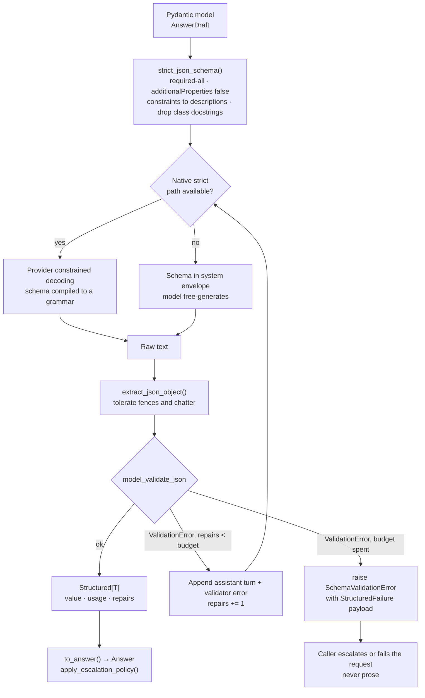

# Chapter 6 — Structured Output and Schema Discipline

## What you'll be able to do after this chapter

1. Derive a strict-mode JSON Schema from any Pydantic v2 model, and name the three rewrites both major providers require before their constrained decoder accepts it.
2. Implement a repair loop with an exact policy — parse, feed the validator's own error back **once**, then raise — and justify why there is no second repair and no prose fallback.
3. Order a generation schema's fields deliberately, and say why putting `reasoning` after the answer silently converts chain-of-thought into direct answering.
4. Explain why a self-reported `confidence: 0.87` is not a probability, name the three alternatives, and pick one with a decision rule.
5. Count the schema-complexity budget your model consumes and know which provider limit you hit first, before a 400 tells you in production.
6. Quantify what a repair costs in dollars and milliseconds, and state the repair rate above which your p95 requirement is violated by construction.

---

## The problem this solves

The regex worked for six weeks.

We shipped AtlasDesk's first policy-answer endpoint the way everybody ships the first one. The prompt ended with *"Reply in the form: ANSWER: <text> then SOURCES: <comma-separated section numbers>"*, and the parser was four lines:

```python
# the four lines that cost us six weeks of silent wrongness
answer = re.search(r"ANSWER:\s*(.+?)(?=SOURCES:|$)", raw, re.S).group(1).strip()
sources = re.search(r"SOURCES:\s*(.+)", raw)
citations = [s.strip() for s in sources.group(1).split(",")] if sources else []
```

It worked. Daniel Osei, our tier-1 agent, used it forty times a day and never complained. The dashboards were green: zero exceptions, p95 at 2.8 s, cost per request bang on the estimate.

In week seven a learner asked about deferring an instalment and got an answer with no source links in the UI. Daniel assumed the handbook section was missing and escalated by hand. It happened again the next day, then twice more. Nobody filed a bug, because the answer text was *fine* — correct, well written, and missing only the little chip of blue text underneath that says where it came from.

Here is what had actually happened. A model version rolled forward under us — a completely ordinary event, the kind that happens on a schedule you do not control — and the new version had a mild preference for markdown. It started emitting:

```
**ANSWER:** You may defer one instalment by up to 30 days...

**SOURCES:** 7.3, 7.4
```

`re.search(r"SOURCES:\s*(.+)")` still matches `**SOURCES:** 7.3, 7.4`. It captures `** 7.3, 7.4`. Split on commas, strip whitespace, and you get `["** 7.3", "7.4"]`. The first citation is now a string that matches no section in the handbook. The lookup for it returned nothing. The UI renders nothing for a citation it cannot resolve — because the UI was written by a careful engineer who did not want to show broken links.

So: the model was right, the parser was half-right, the renderer failed silently and correctly, and the system quietly stopped citing its first source on every answer for eleven days. Monitoring could not see it: no exception to count, no latency spike, no cost anomaly. The failure was *inside the values*, and nothing in the pipeline had an opinion about what a valid value looked like.

Then it got worse, because we had also written this, which is the line to look at hardest:

```python
if answer is None:            # "graceful degradation"
    answer = raw.strip()      # fall back to the raw text, better than crashing
```

That is the single most expensive line in a beginner LLM codebase. It converts a loud, catchable, immediately-diagnosable format failure into a plausible-looking string that flows downstream into an email draft, a ticket summary, or an eval judge that scores it as reasonable. It does not degrade gracefully; it launders a defect.

Everything in this chapter exists to make that class of failure impossible — not unlikely, impossible. The output of a model call is not text you interpret. It is a value of a declared type, and if it is not, you find out at the call site, in that millisecond, with the field name in the exception message.

---

## Concepts

### Three eras of getting JSON out of a model

You will meet all three in code you inherit. Know which one you are looking at, because the failure modes differ completely.

| Era | Mechanism | What guarantees the shape | Typical failure |
|---|---|---|---|
| Prompt-and-pray (2022–23) | "Reply in JSON" in the prompt | Nothing | Fences, preambles, trailing commas, apologies |
| JSON mode (2023–24) | A provider flag forcing syntactically valid JSON | The *syntax*, not your fields | Valid JSON with the wrong keys, or `{"answer": {...}}` nesting you never asked for |
| Constrained decoding (2024–) | Your JSON Schema compiled to a grammar; invalid tokens masked at each step | The *shape*, mechanically | Refusals, truncation at `max_tokens`, schemas the compiler rejects |

The jump from era 2 to era 3 is not a prompting improvement; it is an inference-time change. OpenAI described the mechanism at launch on 6 August 2024: JSON Schemas are converted into context-free grammars, and "after each token generation, our inference engine will determine which tokens are valid to be produced next based on the previously generated tokens and the rules within the grammar," with invalid tokens masked to zero probability. Anthropic's structured outputs, GA on the Claude Developer Platform since 14 November 2025, work the same way, with the compiled grammar cached 24 hours from last use.

Under constrained decoding, **a key you declared cannot be missing and a key you did not declare cannot appear** — which eliminates an entire genre of defect and exactly zero semantic defects.

**Decision rule.** Use the native strict path wherever it exists; fall back to schema-in-the-prompt plus parsing only where it does not. **Switch when:** you route through a proxy, self-hosted model, or batch endpoint that silently ignores `strict` — keep the same repair loop and expect a repair rate in the low single digits rather than near zero.

### The two providers are not the same, and the differences bite

Both do constrained decoding. The API surfaces, schema subsets, and failure signals differ enough that you must abstract over them — which is what Chapter 4's `LLMClient` Protocol is for.

| | Anthropic | OpenAI |
|---|---|---|
| JSON output parameter | `output_config.format` with `type: "json_schema"` (the older `output_format` + beta header is deprecated) | `response_format` (Chat Completions) or `text.format` (Responses API), `type: "json_schema"`, `strict: true` |
| Strict tool arguments | `strict: true` on the individual tool definition | `strict: true` inside the function definition |
| Optionality | Nullable union; every declared property in `required` | All fields required; express optional as a `["string","null"]` union |
| `additionalProperties` | Must be `false` for strict objects | Must be `false` |
| Numeric/length constraints | `minimum`, `maximum`, `minLength`, `maxLength` not supported; SDKs move them into descriptions | Supported subset only; constraints outside it are rejected |
| Recursion | Supported via schema references | `$ref: "#"` self-reference supported |
| Documented complexity caps | 20 strict tools per request; 24 optional parameters total; 16 union-typed parameters; HTTP 400 "schema too complex" beyond | Documented subset without published numeric caps |
| First-call overhead | Grammar compiled then cached 24 h; recompiled if schema *structure* changes | New schema incurs extra latency on first request (typically under 10 s, up to ~1 min for complex schemas) on fine-tuned models |
| Refusal signal | `stop_reason: "refusal"`, 200 status, tokens billed, output does not match schema | `refusal` boolean on the message |
| Truncation | `stop_reason: "max_tokens"` — output may be incomplete and non-compliant | Same class of failure at the token limit |
| Notable gotchas | Enum casing may differ from the schema; required properties are emitted before optional ones; incompatible with citations and with prefilling | Incompatible with parallel function calls |

Three rows are learned the hard way. **Refusals and truncation break the guarantee:** both providers document that a safety refusal or hitting `max_tokens` produces output that does not satisfy the schema, so "guaranteed" means "conditional on completing normally" — which is why the repair loop is not optional even natively. **Property ordering is not yours to assume:** Anthropic emits required properties first, then optional ones, in schema order within each group, so since we are about to make field order load-bearing the safe construction is **every field required, optionality expressed as a nullable type** — which is also exactly what strict mode wants. **Enum casing can drift:** Anthropic notes capitalisation may differ from the schema with no error signal, so compare case-insensitively and never define two members differing only by case.

### The contract belongs to the consumer, so use two schemas

AtlasDesk's `Answer` (Book Bible §4.9) is consumed by Chapter 10's retrieval path, Chapter 15's escalation ladder and Chapter 18's evaluator. Its five fields are frozen; adding a sixth is a breaking change for three chapters and, in your job, three teams. But what you want to *ask the model for* is not what consumers want to *receive* — you want it to reason out loud, and nobody downstream wants to store, index or grade the scratch work. The resolution is two schemas and a projection: **`AnswerDraft`** is the generation schema (`reasoning` first, confidence as an enum) and goes to the model; **`Answer`** is the wire contract and leaves the module; **`AnswerDraft.to_answer()`** drops reasoning, maps band to score, and leaves `should_escalate` False, because that decision is not the model's. It is the same reason your HTTP handler does not return your ORM object.

### Why `reasoning` goes first, with the evidence

Under constrained decoding, property order in the schema is token generation order. Field order is therefore a control-flow decision disguised as formatting. If `text` comes before `reasoning`, the model must commit to an answer and then justify it — confabulation with extra steps, paid for in output tokens. If `reasoning` comes first, the answer tokens are conditioned on the reasoning tokens, and the model gets to think in the only place it can think: its own output stream.

This is not folklore. Tam et al., *Let Me Speak Freely?* (arXiv:2408.02442), measured large reasoning degradations under format restriction — on GSM8K one model tested dropped from 75.99% to 49.25%, another from 86.51% to 23.44% — then found the mechanism by inspection: *"100% of GPT 3.5 Turbo JSON-mode responses placed the 'answer' key before the 'reason' key, resulting in zero-shot direct answering instead of zero-shot chain-of-thought reasoning."* The format did not damage reasoning. The key order prevented it. Their own mitigation is a two-step "reason freely, then convert" pipeline, which works and costs a round trip; ordering the schema gets most of the benefit in one call.

**Decision rule.** Put `reasoning` first in every generation schema for a task with inference in it — multi-chunk synthesis, extraction from a messy scan, classification with overlapping classes. **Switch when:** you are calling a reasoning model that emits its own thinking block (your field duplicates work you already pay for — drop it), or the task is pure transcription, where reasoning is dead weight at roughly 90 output tokens a call. On Anthropic's platform the grammar resets after the thinking block, so a reasoning model gives you the two-step pipeline for free.

### The structured call, end to end



Read the diagram as a funnel with exactly one loop-back edge. The Pydantic model is the single source of truth — schema, parser and validator all derive from it, so they cannot drift apart. The branch at the top is the only place provider differences live, and both arms converge on the same raw text, so one parser and one test suite cover both. The loop-back edge fires at most once and is drawn returning to the *provider* box rather than the parser, because a repair is a full second model call at full cost and latency, not a local retry. The two terminal states are the point: a typed value, or an exception carrying the raw text and the validator's complaint. There is no third exit where prose escapes into the rest of the system.

### The repair loop, and why exactly one repair

The policy, precisely:

1. Call the model. Attempt to parse into the target model.
2. On `ValidationError` — which in Pydantic v2 covers both malformed JSON and valid JSON with wrong values — append two turns: the assistant's actual bad output, and a user turn containing the validator's own error text. Increment `repairs`. Call once more.
3. On the second `ValidationError`, raise `SchemaValidationError` carrying the schema name, repair count, validator output, truncated raw text, and the *summed* usage across every attempt.
4. There is no attempt three, and there is no prose fallback.

Four choices get probed in interviews.

**Feed back the Pydantic error rather than re-prompting.** The validator's message is already the ideal repair prompt: exact path (`citations.0.quote`), exact problem (`String should have at least 8 characters`), machine-readable type (`string_too_short`). Anything you write by hand is a vaguer version of it.

**Send the model's bad output back too**, or the repair turn asks it to fix something it cannot see. With it, the task is a small local edit — what models are best at.

**Never echo the offending value.** `format_validation_error` sends locations, messages and types, not the input that failed. Inputs can be long, can carry PII, and worst of all invite the model to re-emit them verbatim. Round-tripping a learner's phone number through an error message to make a field valid is a data-handling incident with extra steps.

**One repair, not three.** A repair costs 1.09× a clean request and adds ~3.1 s, and conditional on the model having already failed *with the precise validator complaint in hand*, the marginal probability a third try succeeds is small. A generous budget also hides the defect: at `max_repairs=1` a broken schema spikes the hard-failure rate within the hour; at `max_repairs=4` it surfaces as a cost overrun next month. **Decision rule:** `max_repairs=1` in the request path. **Switch when:** you run offline batch where a failure should be *recorded* rather than fixed (use `0`, and put the failures in the eval set), or you are on an unconstrained self-hosted model with measured first-pass compliance under ~90% (use `2`, with a ticket attached).

**And never fall back to prose.** Suppose a caller asked for `Answer` and got a string. Chapter 10's citation verifier has nothing to verify; Chapter 15's router has no `should_escalate`; Chapter 18's grader scores it against a rubric and, being a language model, gives it a reasonable mark. The failure does not disappear — it relocates to somewhere with no stack trace.

### Confidence scores that mean something

`Answer.confidence` is a float from 0.0 to 1.0, Chapter 18 depends on it, and I want to be blunt about what it is worth the day you build it: **a raw self-reported float is uncalibrated and systematically overconfident.**

The literature is consistent. A study of verbalized confidence across model families found overconfidence at every scale, expected calibration error averaging around 0.1 even for 70B-plus models, and the smallest models producing scores "almost independent from" their accuracy — and it found reliability "strongly depends on how the model is asked." Your confidence number is therefore a function of your prompt wording as much as of the model's uncertainty.

| Approach | What you get | Cost | Use when |
|---|---|---|---|
| Self-reported float (`0.0–1.0`) | Fine-grained ordering, poor calibration, clustering at 0.8/0.9/0.95 | Free | Never as a threshold; acceptable as a tiebreaker |
| Discrete band enum (`high`/`medium`/`low`) | Coarse ordering, far more consistent, maps cleanly to routing tiers | Free | **Default.** Bands are what you can actually calibrate with a few hundred labels |
| Self-consistency (sample k, measure agreement) | A genuine empirical frequency; the best-calibrated cheap option | k× cost and latency | High-stakes, low-volume decisions — extraction fields that trigger a payment |
| Logprob-derived (token probability of the answer span) | Model-internal uncertainty, no extra call | Free where logprobs are exposed | Classification over a small label set; **unavailable on several strict/structured paths, so check first** |

We ship the enum. `AnswerDraft.confidence_band` is `high | medium | low`, and `BAND_TO_SCORE` maps it to a float so the frozen contract is satisfied. Those three numbers — 0.90, 0.60, 0.30 — are **placeholders**, marked as such in the source. Chapter 18 replaces each with the measured accuracy of answers carrying that band on human-labelled cases. That is what calibration means: `confidence = 0.6` should mean six in ten are correct. Until that measurement exists, do not show the number to a user. **Decision rule:** ask for a band, convert to the float your contract requires, treat the mapping as a measured constant. **Switch when:** you have ≥300 labelled outcomes and the bands' empirical accuracies sit within a few points of each other — your bands are not discriminating, so move to self-consistency on the subset that matters rather than adding more bands.

The stronger version: **the escalation decision is not the model's.** `apply_escalation_policy` makes it deterministically from evidence — fabricated citation, too few citations, confidence under threshold — with a fixed precedence so the reason string is stable enough to group on a dashboard. We still *ask* for `escalation_reason`, because the model's judgement is a signal Chapter 18 grades; we never let it decide.

### Field design details that pay for themselves

**Enums over free text, and field descriptions are prompt text.** `confidence_band` cannot come back as `"quite high"` — under constrained decoding those tokens are masked, and on the fallback path Pydantic rejects them and the repair loop fixes them. Either way you get a value you can `GROUP BY`. The description attached to that field is the only prose the model sees about it: `"0.0-1.0, uncalibrated at source"` teaches nothing, while `"high: the chunks state the answer explicitly. medium: the answer requires inference across chunks. low: the chunks do not clearly contain the answer."` is a rubric. Chapter 12 makes the identical argument about tool descriptions. **Switch when:** the enum needs more than about fifteen members or changes weekly — use a free string plus a mapping table you own, because adding a category should not require a schema change.

**Every field required, optionality as nullability.** Both providers demand it, and it ends the "absent versus null" argument. For extraction we go further: `FieldConfidence.ABSENT` is an explicit member, so the model has a legal, cheap way to say *this document does not contain that* rather than being cornered into inventing a value that satisfies the type. Half of extraction hallucination is a schema that made honesty inexpressible. Watch the budget, though: every nullable field is an "optional parameter" to the grammar compiler, capped at 24 per request on Anthropic's platform. `TranscriptRecord` has 7 and `InvoiceRecord` 10 — comfortable; a 40-field invoice schema with per-field confidence is not. That is why `Extracted.evidence_quote` is a required `str` that may be empty rather than `str | None`, and why `schema_budget()` fails at derivation time rather than in production.

**Class docstrings leak into the schema — strip them.** Nobody warns you about this one. Pydantic promotes a class docstring into the JSON Schema's `description`, and your docstrings are written for your team: module paths, chapter numbers, TODOs. In our project run the `AnswerDraft` schema was **2,161 characters** with docstrings and **1,372** without — 36% smaller, about 200 input tokens on every request, for text the model should never see. Worse than the cost is the confusion: a description reading "Chapter 17 routes low-confidence fields to a human queue" is an instruction the model may try to follow. The rule: **the class docstring is for humans; every word the model needs goes in a `Field(description=...)`.** `strict_json_schema` enforces it by dropping `description` from any node with `properties` or `enum` — exactly the nodes Pydantic fills from docstrings — and a test asserts the string "Chapter" never appears in the emitted schema.

> **▸ Senior practice #6 — Validated structured outputs with an explicit repair-then-fail path**
>
> A model call in a production system has exactly three legal outcomes: a validated typed value, a validated typed value that cost one repair, or a raised exception. Any codebase with a fourth — a string that "should be JSON," a dict that "usually has these keys," a `try: parse except: return raw` — has a silent-wrongness generator installed in its critical path, and the only question is which quarter it fires.
>
> Three parts, all load-bearing. **Declare the contract as a type:** one Pydantic model is the schema you send, the parser you run, and the validator you trust, so the three cannot drift. **Make the repair path explicit and finite:** one repair, fed the validator's own error text, counted into `Structured.repairs` and billed into `Structured.usage` — a repair you do not count is a cost you cannot see and a regression you cannot detect, and the repair rate moves *before* task success does, which makes it the cheapest early warning you own. **Fail closed:** when the budget is spent, raise, and let the caller — who has the context — choose between escalation, a cached answer, and an error.
>
> In interviews this is the question behind the question. "How do you handle malformed model output?" is really "have you had a silent failure in production, and did you learn the right lesson?" The answer that lands is a number: *our hard-failure rate is 0.2%, our repair rate is 3.1%, both alerted, and a repair costs 2.1× a clean request.*
---

## How industry does it

### Case 1 — OpenAI Structured Outputs: the guarantee moves from the prompt into the decoder

**The problem.** Before August 2024 every team had rewritten the same three hundred lines: a JSON extractor, a retry-with-error-feedback loop, and a pile of incantations begging for valid output. Reliability was a function of how well you begged.

**What they built.** Structured Outputs, launched 6 August 2024. You supply a JSON Schema with `strict: true`; the API converts it into a context-free grammar; during sampling the engine computes, after every token, which tokens the grammar permits and masks the rest. Safety refusals surface as an explicit `refusal` boolean rather than as malformed output — a refusal becomes a branch in your code instead of a parse error.

**The measured outcome, as reported by OpenAI.** On their internal evaluation of complex JSON-schema adherence, `gpt-4o-2024-08-06` scored **100%** against **under 40%** for `gpt-4-0613`, and they report the model reached **93% before constrained decoding was applied** — meaning the last seven points, the ones that decide whether you can build a pipeline on it, came from the decoder rather than the model. A vendor-published number on a vendor-designed evaluation: directional about the mechanism, not a guarantee about your schemas.

**What you should copy at 1/1000th the scale.** Move guarantees out of prose and into mechanism — wherever your system relies on the model choosing to behave, ask what would *enforce* it instead: constrained decoding for shape, a validator for values, a policy function for decisions. Make refusal a typed branch rather than an exception, which is why `escalation_reason` is a field and not a magic string inside `text`. And read the limitations list as a design input: "all fields required" and "`additionalProperties: false`" are not annoyances, they are the shape a machine-checkable contract has, and Pydantic models designed that way are accepted by both providers unchanged.

### Case 2 — Reducto and LlamaIndex: schema enforcement is the product

**The problem.** Enterprise document extraction is where structured output stops being a convenience and becomes the entire value proposition. A 300-page insurance schedule with 4,000 fields, a scanned regulatory form with handwriting, a table continuing across eleven pages — nobody wants prose about these. They want a database row, and they want to know which cell on which page it came from.

**What they built.** Schema-guided extraction platforms: you supply the target schema, the system supplies parsing, layout understanding, extraction, per-field confidence and grounding back to source coordinates. LlamaIndex published **ExtractBench** (arXiv:2607.29677) to measure this class of system — 370 documents, 4,869 pages, 67 document types across eight domains, scoring value accuracy, visual grounding and cost per page.

**The measured outcomes**, two independent 2026 measurements:

- On **LongExtractBench**, an independent benchmark from micro1 focused on long, dense files with hundreds of pages and thousands of fields, Reducto Deep Extract reported **99.6% recall, 99.6% precision, 99.3% leaf accuracy, zero failures and 100% coverage** — the only system in that evaluation to complete every document (July 2026).
- On **ExtractBench**, the spread by document length is the headline: one commercial vision-language model fell from **87.9% on short documents to 27.9% on long ones**, while a purpose-built agentic tier held **96.6% to 94.4%**. On tables exceeding 1,000 rows most systems scored **below 10%**. The cost-quality frontier ran from **86.8% F1 at 1.0¢/page** to **95.6% F1 at 8.1¢/page**, with general coding agents reaching 87–94% F1 at over **15¢/page**.
- The caveat the authors lead with: **word-level grounding F1 remains below 50% even for specialised systems**, and page-level grounding collapsed with document length for some — from 61.7% to 0.0%. Knowing *what* was extracted is close to solved; knowing *where it came from* is not.

**What you should copy at 1/1000th the scale.** Per-field confidence, not per-document confidence — one number for a 40-field invoice is not actionable, which is why `Extracted[V]` carries `value`, `confidence`, `evidence_quote` and `page` per field so Chapter 17 can route three fields to a human and auto-approve thirty-seven. An explicit `absent` value, because if your schema cannot express "not in this document" your extraction rate looks great and your data is wrong. Grounding as a separate, harder problem: requiring `evidence_quote` and `page` does not make grounding correct, it makes it *checkable*, which is the prerequisite — the same design as `Citation.quote`. And benchmark on the hard tail, because the 87.9→27.9 collapse is invisible in an average; Chapter 18 stratifies AtlasDesk's eval set by difficulty tier for exactly this reason.

**A third, briefly, because it settles the design question:** `instructor` is a thin library that patches a provider client so `response_model=SomeBaseModel` returns a validated instance, re-asking with the validation error attached up to `max_retries`. It reports roughly **3 million monthly downloads, 11,000 GitHub stars and 15+ providers**, with ports to five other languages. The measured outcome is the adoption itself, and what it tells you is architectural: the industry converged on *validator-error-as-repair-prompt* as the right primitive, across every provider, including ones with no native strict mode. **Decision rule:** use `instructor` when you want structured output today across many providers and have no client layer yet. **Switch to your own fifty lines** — the ones below — the moment you need repairs counted into your cost model or visible in your traces. That is exactly why we implement it directly.

---

## Build: AtlasDesk's answer contract and the repair loop

### Project state

**What exists after Chapters 1–5:** the readiness scorer (Ch 1); the repo scaffold with typed `config.py`, the `errors.py` hierarchy and `llm/pricing.py` (Ch 2); `docs/spec.md`, the first ADR, `evals/datasets/seed_20.jsonl` and `docker-compose.yml` (Ch 3); the provider layer — `llm/base.py` with the `LLMClient` Protocol, both adapters, retry, circuit breaker, router and factory (Ch 4); the prompt registry with versioned files and hashes (Ch 5).

**What this chapter adds:** `schemas/answer.py` (the frozen `Answer` contract plus the `AnswerDraft` generation schema and the escalation policy), `schemas/extraction.py` (per-field-confidence records Chapter 17 reuses), and `llm/structured.py` (schema derivation, complexity budgeting, repair loop). Chapter 4's thin `structured()` on both adapters is refactored to delegate here.

**What it does not add:** any retrieval. `Citation.chunk_id` points at chunks that do not exist yet; Chapter 10 makes them real and enforces that the quote is a genuine substring. Until then `apply_escalation_policy` is tested against an explicit allow-list — exactly the interface Chapter 10 will satisfy. Everything here runs with no API key and no network.

### Repo tree diff

```
  src/atlasdesk/
    llm/
      base.py                    # Ch 4 — unchanged, imported not redefined
      anthropic_client.py        # Ch 4 — structured() now delegates (3 lines)
      openai_client.py           # Ch 4 — structured() now delegates (3 lines)
      router.py                  # Ch 4 — unchanged
+     structured.py              # schema derivation, budget, repair loop
+   schemas/
+     __init__.py
+     answer.py                  # Citation, Answer, AnswerDraft, escalation policy
+     extraction.py              # Extracted[V], TranscriptRecord, InvoiceRecord
  tests/
+   test_structured.py           # 21 tests, no provider, no network
```

### The answer contract

```python
# src/atlasdesk/schemas/answer.py
"""The C1 answer contract.

``Answer`` is the wire contract for every cited-answer path in AtlasDesk. It is
produced here (Chapter 6), returned by retrieval in Chapter 10, escalated on in
Chapter 15, and graded in Chapter 18. Its field names and types are frozen: a
change here is a breaking change for four later chapters.

``AnswerDraft`` is the *generation* schema. It is what we ask a model for, it
carries a leading ``reasoning`` field, and it is projected down to ``Answer`` at
the boundary so that no consumer ever sees the model's scratch work.
"""

from __future__ import annotations

from enum import StrEnum

from pydantic import BaseModel, Field


class Citation(BaseModel):
    """One verifiable pointer into retrieved context.

    Contract: ``chunk_id`` must be the id of a chunk that was actually placed in
    the prompt, and ``quote`` must be a substring of that chunk. Chapter 10
    enforces both; a citation that fails either check is a groundedness failure,
    not a formatting failure.
    """

    chunk_id: str = Field(description="Id of a chunk that was supplied in context.")
    quote: str = Field(
        min_length=8,
        max_length=400,
        description="Verbatim span copied from that chunk, 8-400 characters.",
    )


class Answer(BaseModel):
    """A cited answer plus the escalation decision.

    Frozen contract (Book Bible 4.9). ``confidence`` is a 0.0-1.0 float whose
    calibration is measured against human labels in Chapter 18; until then treat
    it as an ordering signal, not a probability.
    """

    text: str = Field(description="The answer as the learner or agent will read it.")
    citations: list[Citation] = Field(
        description="Every chunk this answer relies on. Empty means unsupported."
    )
    confidence: float = Field(ge=0.0, le=1.0, description="0.0-1.0, uncalibrated at source.")
    should_escalate: bool = Field(description="True if a human must handle this.")
    escalation_reason: str | None = Field(
        default=None, description="Short machine-readable reason when escalating."
    )


class ConfidenceBand(StrEnum):
    """Discrete confidence, which models report far more consistently than floats."""

    HIGH = "high"
    MEDIUM = "medium"
    LOW = "low"


#: Placeholder mapping from band to score. Chapter 18 replaces these three
#: numbers with the observed accuracy of each band on labelled cases. Until it
#: does, they are ordering hints and nothing more.
BAND_TO_SCORE: dict[ConfidenceBand, float] = {
    ConfidenceBand.HIGH: 0.90,
    ConfidenceBand.MEDIUM: 0.60,
    ConfidenceBand.LOW: 0.30,
}


class AnswerDraft(BaseModel):
    """What we ask the model for. ``reasoning`` is first, deliberately.

    Field order in a JSON object is generation order under constrained decoding.
    Putting ``reasoning`` first means the tokens that justify the answer are
    emitted before the answer, so the answer is conditioned on them. Putting it
    last makes it a post-hoc rationalisation that changes nothing.
    """

    reasoning: str = Field(
        max_length=1200,
        description=(
            "Think here first: which supplied chunks are relevant, whether they "
            "actually answer the question, and what is missing. 2-5 sentences."
        ),
    )
    text: str = Field(description="The answer, grounded only in the supplied chunks.")
    citations: list[Citation] = Field(
        description="One entry per chunk you relied on. Never cite a chunk you did not use."
    )
    confidence_band: ConfidenceBand = Field(
        description=(
            "high: the chunks state the answer explicitly. "
            "medium: the answer requires inference across chunks. "
            "low: the chunks do not clearly contain the answer."
        )
    )
    escalation_reason: str | None = Field(
        default=None,
        description="If a human should handle this, say why in under 15 words. Else null.",
    )

    def to_answer(self) -> Answer:
        """Project the draft onto the frozen wire contract.

        ``reasoning`` is dropped here on purpose: it is expensive to store, it
        frequently paraphrases retrieved text, and no downstream consumer is
        allowed to depend on it. ``should_escalate`` is left False — the runtime
        decision belongs to :func:`apply_escalation_policy`, not to the model.
        """
        return Answer(
            text=self.text,
            citations=list(self.citations),
            confidence=BAND_TO_SCORE[self.confidence_band],
            should_escalate=False,
            escalation_reason=self.escalation_reason,
        )


class EscalationPolicy(BaseModel):
    """Deterministic rules that decide whether a human takes over.

    These thresholds are configuration, not intuition. Chapter 17 calibrates the
    equivalent numbers for extraction from labelled data; Chapter 18 does it for
    answers.
    """

    min_confidence: float = Field(default=0.55, ge=0.0, le=1.0)
    min_citations: int = Field(default=1, ge=0)


def unknown_citations(answer: Answer, allowed_chunk_ids: frozenset[str]) -> tuple[str, ...]:
    """Citation chunk ids that were never supplied in context, in first-seen order."""
    seen: list[str] = []
    for citation in answer.citations:
        if citation.chunk_id not in allowed_chunk_ids and citation.chunk_id not in seen:
            seen.append(citation.chunk_id)
    return tuple(seen)


def apply_escalation_policy(
    answer: Answer,
    *,
    allowed_chunk_ids: frozenset[str],
    policy: EscalationPolicy | None = None,
) -> Answer:
    """Return a copy of ``answer`` with the escalation decision made by us.

    Precedence, highest first: fabricated citation, too few citations, low
    confidence, then the model's own request. The first matching rule wins so
    that the reason string is stable enough to group on in a dashboard.
    """
    rules = policy or EscalationPolicy()
    fabricated = unknown_citations(answer, allowed_chunk_ids)

    reason: str | None = None
    if fabricated:
        reason = f"unverifiable_citation:{fabricated[0]}"
    elif len(answer.citations) < rules.min_citations:
        reason = "no_citations"
    elif answer.confidence < rules.min_confidence:
        reason = f"low_confidence:{answer.confidence:.2f}"
    elif answer.escalation_reason:
        reason = f"model_requested:{answer.escalation_reason}"

    return answer.model_copy(
        update={"should_escalate": reason is not None, "escalation_reason": reason}
    )
```

### The extraction contracts

These are here rather than in Chapter 17 because the schema is the interesting part and because they are the clearest demonstration of per-field confidence and of the nullable budget.

```python
# src/atlasdesk/schemas/extraction.py
"""Document-extraction contracts with per-field confidence.

Chapter 17 runs these through a vision model and routes low-confidence fields to
a human queue. They live here because the schema is the interesting part, and
because Chapter 6 is where we decide what a field-level confidence signal is
allowed to be.
"""

from __future__ import annotations

from datetime import date
from enum import StrEnum
from typing import Generic, TypeVar

from pydantic import BaseModel, Field

V = TypeVar("V")


class FieldConfidence(StrEnum):
    """Per-field extraction confidence, deliberately discrete.

    ``absent`` is not a failure. It is the single most valuable value in this
    enum, because it lets the model say "this document does not contain that"
    instead of inventing something that satisfies the type.
    """

    CERTAIN = "certain"
    PROBABLE = "probable"
    UNCERTAIN = "uncertain"
    ABSENT = "absent"


#: Fields at or below this rank go to human review in Chapter 17.
REVIEW_RANK: dict[FieldConfidence, int] = {
    FieldConfidence.CERTAIN: 3,
    FieldConfidence.PROBABLE: 2,
    FieldConfidence.UNCERTAIN: 1,
    FieldConfidence.ABSENT: 0,
}


class Extracted(BaseModel, Generic[V]):
    """One extracted value, its confidence, and the evidence for it.

    ``value`` is nullable so that ``absent`` is representable without lying about
    the type. ``evidence_quote`` is required and may be the empty string, because
    every nullable field costs schema-complexity budget on both providers.
    """

    value: V | None = Field(description="The value, or null if the document does not state it.")
    confidence: FieldConfidence = Field(description="How sure you are, from the enum.")
    evidence_quote: str = Field(
        max_length=200,
        description="Verbatim text from the page that supports the value. Empty if absent.",
    )
    page: int | None = Field(description="1-indexed page the evidence came from, or null.")


class DocumentQuality(StrEnum):
    """Perception difficulty, which drives the Chapter 17 routing tier."""

    CLEAN_DIGITAL = "clean_digital"
    GOOD_SCAN = "good_scan"
    POOR_SCAN = "poor_scan"
    HANDWRITTEN = "handwritten"
    ILLEGIBLE = "illegible"


class Currency(StrEnum):
    INR = "INR"
    USD = "USD"
    EUR = "EUR"
    GBP = "GBP"


class _RecordBase(BaseModel):
    """Shared behaviour for extraction records: reasoning first, then review logic."""

    def extracted_fields(self) -> dict[str, Extracted[object]]:
        """Every ``Extracted`` field on this record, keyed by field name."""
        out: dict[str, Extracted[object]] = {}
        for name in type(self).model_fields:
            value = getattr(self, name)
            if isinstance(value, Extracted):
                out[name] = value
        return out

    def fields_below(self, floor: FieldConfidence) -> tuple[str, ...]:
        """Field names whose confidence ranks strictly below ``floor``, sorted."""
        limit = REVIEW_RANK[floor]
        return tuple(
            sorted(
                name
                for name, field in self.extracted_fields().items()
                if REVIEW_RANK[field.confidence] < limit
            )
        )

    def needs_review(self, floor: FieldConfidence = FieldConfidence.PROBABLE) -> bool:
        """True when any extracted field is less confident than ``floor``."""
        return bool(self.fields_below(floor))


class TranscriptRecord(_RecordBase):
    """A learner transcript page reduced to enrollment and grade facts."""

    reasoning: str = Field(
        max_length=800,
        description=(
            "Before extracting: say what kind of document this is, where the "
            "learner id and course code appear, and which fields are unreadable."
        ),
    )
    quality: DocumentQuality = Field(description="Overall legibility of the page.")
    learner_id: Extracted[str] = Field(description='Learner id, e.g. "LRN-40021".')
    learner_name: Extracted[str] = Field(description="Full name as printed.")
    course_id: Extracted[str] = Field(description='Course code, e.g. "CRS-PGDM-2026".')
    cohort: Extracted[str] = Field(description='Cohort label, e.g. "2026".')
    credits_earned: Extracted[int] = Field(description="Total credits, integer.")
    gpa: Extracted[float] = Field(description="GPA on a 0-10 scale.")
    issued_on: Extracted[date] = Field(description="Issue date printed on the transcript.")


class InvoiceLine(BaseModel):
    """One billed line. Lines are required and may be an empty list."""

    description: str = Field(max_length=160)
    amount: float = Field(description="Line amount in the invoice currency.")


class InvoiceRecord(_RecordBase):
    """A fee invoice reduced to the fields the payments table needs."""

    reasoning: str = Field(
        max_length=800,
        description=(
            "Before extracting: identify the invoice number, the instalment "
            "wording, and whether the total is inclusive of tax."
        ),
    )
    quality: DocumentQuality = Field(description="Overall legibility of the page.")
    invoice_no: Extracted[str] = Field(description="Invoice number as printed.")
    learner_id: Extracted[str] = Field(description='Learner id, e.g. "LRN-40021".')
    instalment: Extracted[int] = Field(description="Which instalment this is, 1-based.")
    amount: Extracted[float] = Field(description="Total payable in the invoice currency.")
    currency: Extracted[Currency] = Field(description="Currency of the amounts.")
    due_date: Extracted[date] = Field(description="Payment due date.")
    lines: list[InvoiceLine] = Field(description="Billed lines. Empty list if none are itemised.")
```

Rohan Mehta's invoice — instalment 2 of 3, ₹185,000, due 2026-09-15 — parses into `InvoiceRecord` with seven `Extracted` fields, and Chapter 17 will route only the ones the model was unsure about.

### The repair loop

This is the module the whole chapter is about. It imports Chapter 4's `LLMClient`, `Message`, `Structured`, and `Usage` — it does not redefine them — and it is the only place in AtlasDesk that turns model text into a typed object.

```python
# src/atlasdesk/llm/structured.py
"""Schema-enforced generation: derive, ask, parse, repair once, then fail closed.

This module is the only place in AtlasDesk that turns model text into a typed
object. It drives the Chapter 4 ``LLMClient`` protocol and does not know or care
which provider answered. The provider adapters' ``structured()`` methods delegate
here, so the repair policy exists exactly once.

Policy, in one line: parse; on the first ``ValidationError`` feed the Pydantic
error text back once; on the second failure raise ``SchemaValidationError``.
There is no third attempt and there is no prose fallback.
"""

from __future__ import annotations

import json
from collections.abc import Sequence
from functools import lru_cache
from typing import Any, Final, TypeVar

from pydantic import BaseModel, Field, ValidationError

from atlasdesk.errors import ConfigError, SchemaValidationError
from atlasdesk.llm.base import LLMClient, Message, Structured, Usage

T = TypeVar("T", bound=BaseModel)

#: Keywords no provider's strict mode compiles today. We do not drop them
#: silently: each one is appended to the field description so the model still
#: sees the constraint, and Pydantic still enforces it after parsing.
_MOVED_TO_DESCRIPTION: Final[tuple[str, ...]] = (
    "minimum",
    "maximum",
    "exclusiveMinimum",
    "exclusiveMaximum",
    "minLength",
    "maxLength",
    "minItems",
    "maxItems",
    "multipleOf",
    "pattern",
)

_STRIPPED: Final[tuple[str, ...]] = ("default", "title", "examples")

#: Wire-protocol envelope, not a prompt. It carries no task instruction and never
#: varies by feature, so it lives beside the parser rather than in the Chapter 5
#: registry. The moment it acquires task-specific wording, move it to the
#: registry and version it.
JSON_ENVELOPE: Final[str] = (
    "Reply with a single JSON object and nothing else. No prose before or after, "
    "no markdown fences. It must validate against this JSON Schema:\n\n{schema}\n\n"
    "Emit the properties in the order they appear in the schema."
)

REPAIR_INSTRUCTION: Final[str] = (
    "Your previous reply did not validate against the schema. The validator "
    "reported:\n\n{errors}\n\nReturn the corrected JSON object only. Keep every "
    "value that was already correct; change only what the validator complained "
    "about. Do not explain the fix."
)

#: A markdown code fence. Built rather than written literally so this module can
#: be embedded in documentation without terminating the surrounding block.
_FENCE: Final[str] = "`" * 3

_MAX_REPORTED_ERRORS: Final[int] = 8
_MAX_RAW_KEPT: Final[int] = 2_000


class StructuredFailure(BaseModel):
    """Everything a human or a trace needs to explain one hard schema failure."""

    schema_name: str
    repairs: int
    validation_errors: str
    raw_output: str
    usage: Usage

    def message(self) -> str:
        return (
            f"{self.schema_name} failed validation after {self.repairs} repair "
            f"attempt(s): {self.validation_errors}"
        )


class SchemaBudget(BaseModel):
    """How much provider grammar budget a schema consumes.

    Both major providers cap strict-schema complexity. Anthropic documents the
    caps numerically (24 optional parameters, 16 union-typed parameters, 20 strict
    tools per request) and returns HTTP 400 when a schema exceeds them; OpenAI
    documents a supported subset without publishing every numeric cap. Checking
    at import time beats discovering it from a 400 in production.
    """

    schema_name: str
    properties: int
    nullable_properties: int = Field(description="Counted as 'optional' by the compiler.")
    union_properties: int = Field(description="anyOf or list-valued 'type'.")
    max_depth: int
    max_nullable: int = 24
    max_union: int = 16

    @property
    def over_budget(self) -> tuple[str, ...]:
        """Human-readable list of exceeded limits, empty when the schema fits."""
        problems: list[str] = []
        if self.nullable_properties > self.max_nullable:
            problems.append(
                f"{self.nullable_properties} nullable properties exceeds {self.max_nullable}"
            )
        if self.union_properties > self.max_union:
            problems.append(
                f"{self.union_properties} union-typed properties exceeds {self.max_union}"
            )
        return tuple(problems)

    def check(self) -> None:
        """Raise ``ConfigError`` if this schema will not compile on a strict path.

        Failure modes: too many nullable fields, too many union-typed fields. The
        fixes, in order of preference: make fields required with a sentinel, split
        the extraction into two calls, or flatten nesting.
        """
        problems = self.over_budget
        if problems:
            raise ConfigError(f"{self.schema_name}: schema too complex — " + "; ".join(problems))


def _is_union(node: dict[str, Any]) -> bool:
    return "anyOf" in node or "oneOf" in node or isinstance(node.get("type"), list)


def _is_nullable(node: dict[str, Any]) -> bool:
    branches = node.get("anyOf") or node.get("oneOf") or []
    if any(isinstance(branch, dict) and branch.get("type") == "null" for branch in branches):
        return True
    declared = node.get("type")
    return isinstance(declared, list) and "null" in declared


def _fold_constraints(node: dict[str, Any]) -> None:
    """Move unsupported validation keywords into the description, in place."""
    notes: list[str] = []
    for keyword in _MOVED_TO_DESCRIPTION:
        if keyword in node:
            notes.append(f"{keyword}={node.pop(keyword)!r}")
    if notes:
        existing = node.get("description", "")
        suffix = "Constraints: " + ", ".join(notes) + "."
        node["description"] = f"{existing} {suffix}".strip()


def _harden(node: Any, *, drop_formats: bool) -> None:
    """Recursively rewrite a Pydantic JSON schema for strict mode, in place."""
    if isinstance(node, list):
        for item in node:
            _harden(item, drop_formats=drop_formats)
        return
    if not isinstance(node, dict):
        return

    for keyword in _STRIPPED:
        node.pop(keyword, None)
    if drop_formats:
        node.pop("format", None)
    _fold_constraints(node)

    # Pydantic promotes a class docstring to the object's "description". Those
    # docstrings are written for your team and routinely mention module paths and
    # chapter numbers. Strip them: the class docstring is for humans, and every
    # word the model needs belongs in a Field description.
    if "properties" in node or "enum" in node:
        node.pop("description", None)

    if node.get("type") == "object" or "properties" in node:
        properties = node.get("properties")
        if isinstance(properties, dict):
            node["required"] = list(properties)
        node["additionalProperties"] = False

    for key, child in node.items():
        if key in {"required", "enum", "const"}:
            continue
        _harden(child, drop_formats=drop_formats)


@lru_cache(maxsize=128)
def strict_schema_json(model: type[BaseModel], drop_formats: bool = False) -> str:
    """Cached, compact JSON text of :func:`strict_json_schema`.

    Derivation walks the whole schema and costs about 1.4 ms for the C1 answer
    schema in our project run — irrelevant once, wasteful on every request. The
    cache stores an immutable string so no caller can mutate a shared dict.
    """
    return json.dumps(strict_json_schema(model, drop_formats=drop_formats), separators=(",", ":"))


def strict_json_schema(model: type[BaseModel], *, drop_formats: bool = False) -> dict[str, Any]:
    """Derive a strict-mode JSON Schema from a Pydantic model.

    Both providers' strict paths demand the same three things Pydantic does not
    emit by default: every property listed in ``required``, ``additionalProperties``
    false on every object, and no unsupported validation keywords. Optionality is
    expressed as a nullable union, which Pydantic already emits for ``X | None``.

    Set ``drop_formats=True`` if your provider rejects ``format`` (dates are the
    usual casualty); the Pydantic model still coerces and validates the value.

    Raises:
        ConfigError: the model produces a schema that will not compile strictly.
    """
    schema = model.model_json_schema(mode="serialization")
    _harden(schema, drop_formats=drop_formats)
    schema.pop("$schema", None)
    schema_budget(model).check()
    return schema


def schema_budget(model: type[BaseModel]) -> SchemaBudget:
    """Count the grammar-complexity cost of a model's schema, definitions included."""
    schema = model.model_json_schema(mode="serialization")
    properties = 0
    nullable = 0
    unions = 0

    def walk(node: Any, depth: int) -> int:
        nonlocal properties, nullable, unions
        if isinstance(node, list):
            return max((walk(item, depth) for item in node), default=depth)
        if not isinstance(node, dict):
            return depth
        deepest = depth
        for name, child in node.items():
            if name == "properties" and isinstance(child, dict):
                for field in child.values():
                    properties += 1
                    if isinstance(field, dict):
                        if _is_nullable(field):
                            nullable += 1
                        elif _is_union(field):
                            unions += 1
                    deepest = max(deepest, walk(field, depth + 1))
            elif name not in {"required", "enum", "const"}:
                deepest = max(deepest, walk(child, depth))
        return deepest

    depth = walk(schema, 0)
    return SchemaBudget(
        schema_name=model.__name__,
        properties=properties,
        nullable_properties=nullable,
        union_properties=unions,
        max_depth=depth,
    )


def extract_json_object(text: str) -> str:
    """Return the outermost JSON object in ``text``, or ``text`` unchanged.

    Models on non-native paths wrap JSON in fences or a sentence of apology. We
    tolerate that at parse time and count it as a repair only if parsing actually
    fails — tolerance here is cheaper than a second model call.
    """
    stripped = text.strip()
    if stripped.startswith(_FENCE):
        body = stripped.split(_FENCE)
        if len(body) >= 2:
            candidate = body[1]
            if candidate.lstrip().lower().startswith("json"):
                candidate = candidate.lstrip()[4:]
            stripped = candidate.strip()

    start = stripped.find("{")
    if start == -1:
        return stripped
    depth = 0
    in_string = False
    escaped = False
    for index in range(start, len(stripped)):
        char = stripped[index]
        if in_string:
            if escaped:
                escaped = False
            elif char == "\\":
                escaped = True
            elif char == '"':
                in_string = False
            continue
        if char == '"':
            in_string = True
        elif char == "{":
            depth += 1
        elif char == "}":
            depth -= 1
            if depth == 0:
                return stripped[start : index + 1]
    return stripped[start:]


def format_validation_error(exc: ValidationError) -> str:
    """Render a Pydantic error for the model, compactly and without echoing data.

    We send the model locations, messages and error types — never the offending
    input values, which can be long, can contain PII, and tempt the model to
    re-emit them verbatim.
    """
    lines: list[str] = []
    for error in exc.errors(include_url=False)[:_MAX_REPORTED_ERRORS]:
        location = ".".join(str(part) for part in error["loc"]) or "<root>"
        lines.append(f"- {location}: {error['msg']} (type={error['type']})")
    total = len(exc.errors(include_url=False))
    if total > _MAX_REPORTED_ERRORS:
        lines.append(f"- ...and {total - _MAX_REPORTED_ERRORS} more")
    return "\n".join(lines)


def merge_usage(usages: Sequence[Usage]) -> Usage:
    """Sum usage across every attempt, including the ones that failed.

    A repair is not free and must not be free in the accounting. Chapter 19 reads
    this object; a system that only bills the successful attempt understates cost
    by exactly the repair rate.
    """
    if not usages:
        raise ConfigError("merge_usage() requires at least one Usage")
    return Usage(
        model=usages[-1].model,
        input_tokens=sum(usage.input_tokens for usage in usages),
        output_tokens=sum(usage.output_tokens for usage in usages),
        cached_input_tokens=sum(usage.cached_input_tokens for usage in usages),
        cost_usd=sum(usage.cost_usd for usage in usages),
        latency_ms=sum(usage.latency_ms for usage in usages),
    )


def failure_of(exc: SchemaValidationError) -> StructuredFailure | None:
    """Recover the structured payload from a ``SchemaValidationError``, if present."""
    for arg in exc.args:
        if isinstance(arg, StructuredFailure):
            return arg
    return None


async def run_structured(
    client: LLMClient,
    messages: Sequence[Message],
    schema: type[T],
    *,
    system: str | None = None,
    model: str | None = None,
    max_repairs: int = 1,
    max_tokens: int = 1024,
    timeout_s: float = 30.0,
    drop_formats: bool = False,
) -> Structured[T]:
    """Generate an instance of ``schema``, repairing at most ``max_repairs`` times.

    Contract:
        Returns a validated ``Structured[T]`` whose ``usage`` covers every attempt
        and whose ``repairs`` counts the retries actually spent.

    Failure modes:
        SchemaValidationError: the output still failed validation after the repair
            budget was spent. The exception carries a ``StructuredFailure`` with
            the raw text and the validator output. Callers must handle it; there
            is no prose fallback, because a caller that receives prose where it
            expected a type will fail somewhere less debuggable.
        ProviderError subclasses: propagate untouched from the client, which owns
            retries, timeouts and the circuit breaker.

    Args:
        max_repairs: 0 disables repair entirely (correct for judges and for
            offline batch jobs where a failure should be recorded, not fixed).
    """
    if max_repairs < 0:
        raise ConfigError("max_repairs must be >= 0")

    envelope = JSON_ENVELOPE.format(schema=strict_schema_json(schema, drop_formats))
    system_text = f"{system}\n\n{envelope}" if system else envelope

    attempt: list[Message] = list(messages)
    usages: list[Usage] = []
    repairs = 0

    while True:
        completion = await client.complete(
            attempt,
            system=system_text,
            model=model,
            max_tokens=max_tokens,
            temperature=0.0,
            timeout_s=timeout_s,
        )
        usages.append(completion.usage)
        raw = completion.text

        try:
            value = schema.model_validate_json(extract_json_object(raw))
        except ValidationError as exc:
            detail = format_validation_error(exc)
            if repairs >= max_repairs:
                failure = StructuredFailure(
                    schema_name=schema.__name__,
                    repairs=repairs,
                    validation_errors=detail,
                    raw_output=raw[:_MAX_RAW_KEPT],
                    usage=merge_usage(usages),
                )
                raise SchemaValidationError(failure.message(), failure) from exc
            repairs += 1
            attempt = [
                *attempt,
                Message(role="assistant", content=raw),
                Message(role="user", content=REPAIR_INSTRUCTION.format(errors=detail)),
            ]
            continue

        container: type[Structured[T]] = Structured[schema]  # type: ignore[valid-type]
        return container(value=value, usage=merge_usage(usages), repairs=repairs)
```

Three things people leave out. `merge_usage` sums across **every** attempt, including the failed one — a system that bills only the successful call understates its own cost by exactly the repair rate. `strict_schema_json` is `lru_cache`d and returns an immutable string, because derivation walks the whole tree (1.4 ms for `AnswerDraft` in our project run) and no caller should be able to mutate a shared cache entry. And the single `except ValidationError` clause covers both malformed JSON and valid JSON with wrong values, since Pydantic v2 reports a syntax error as a `json_invalid` validation error — one clause, one policy, no way to handle the two cases differently by accident.

### Wiring it into the Chapter 4 adapters

Chapter 4 shipped a thin `structured()` on both adapters. We refactor — not replace — both to delegate here, so the repair policy exists exactly once and a provider swap cannot change it:

```python
# src/atlasdesk/llm/anthropic_client.py  (refactored — the same three lines go in openai_client.py)
    async def structured(
        self,
        messages: Sequence[Message],
        schema: type[T],
        *,
        system: str | None = None,
        model: str | None = None,
        max_repairs: int = 1,
        timeout_s: float = 30.0,
    ) -> Structured[T]:
        """Delegate to the shared repair loop; see llm/structured.py for the policy."""
        from atlasdesk.llm.structured import run_structured

        return await run_structured(
            self, messages, schema, system=system, model=model,
            max_repairs=max_repairs, timeout_s=timeout_s,
        )
```

`model=None` is the normal call: each adapter resolves it from `settings.anthropic_model` or `settings.openai_model`, so a model change stays a config change and no marketing name ever appears in this module. The import is function-local to avoid a cycle: `llm/structured.py` imports from `llm/base.py`. `LLMRouter` needs no change at all — it forwards `structured()` to whichever client the breaker permits, and both now share one repair policy.

### Tests

Twenty-one tests, no provider, no network, no key. The `ScriptedClient` implements the Chapter 4 Protocol and replays a fixed list of completions, which is the only honest way to test a repair loop: you must be able to *make* the first attempt fail.

```python
# tests/test_structured.py
"""Repair-loop tests. No provider, no network, no key.

Run: uv run pytest tests/test_structured.py -v
"""

from __future__ import annotations

import json
from collections.abc import AsyncIterator, Sequence

import pytest
from pydantic import ValidationError

from atlasdesk.errors import ConfigError, SchemaValidationError
from atlasdesk.llm.base import (
    Completion,
    EmbeddingResult,
    Message,
    StreamEvent,
    Structured,
    ToolSpec,
    Usage,
)
from atlasdesk.llm.structured import (
    extract_json_object,
    failure_of,
    format_validation_error,
    merge_usage,
    run_structured,
    schema_budget,
    strict_json_schema,
)
from atlasdesk.schemas.answer import (
    Answer,
    AnswerDraft,
    Citation,
    EscalationPolicy,
    apply_escalation_policy,
    unknown_citations,
)
from atlasdesk.schemas.extraction import (
    FieldConfidence,
    InvoiceRecord,
    TranscriptRecord,
)

VALID_DRAFT = json.dumps(
    {
        "reasoning": "Chunk hb-4-2 states the refund window explicitly as 14 days.",
        "text": "You can request a refund within 14 days of enrolment.",
        "citations": [{"chunk_id": "hb-4-2", "quote": "within fourteen (14) days of enrolment"}],
        "confidence_band": "high",
        "escalation_reason": None,
    }
)

# Wrong enum member and a citation quote below min_length: two distinct error types.
MALFORMED_DRAFT = json.dumps(
    {
        "reasoning": "The handbook mentions refunds.",
        "text": "You can request a refund within 14 days of enrolment.",
        "citations": [{"chunk_id": "hb-4-2", "quote": "14 days"}],
        "confidence_band": "very high",
        "escalation_reason": None,
    }
)

NOT_JSON_AT_ALL = "Sure! Here is the answer: you can request a refund within 14 days."


class ScriptedClient:
    """A fake ``LLMClient`` that replays a fixed list of completions.

    It records the messages it was called with, so a test can assert that the
    repair turn actually carried the validator output back to the model.
    """

    name = "scripted"

    def __init__(self, replies: Sequence[str], *, cost_usd: float = 0.01) -> None:
        self._replies = list(replies)
        self._cost = cost_usd
        self.calls: list[list[Message]] = []
        self.systems: list[str | None] = []

    async def complete(
        self,
        messages: Sequence[Message],
        *,
        system: str | None = None,
        model: str | None = None,
        max_tokens: int = 1024,
        temperature: float = 0.0,
        tools: Sequence[ToolSpec] | None = None,
        timeout_s: float = 30.0,
    ) -> Completion:
        if not self._replies:
            raise AssertionError("ScriptedClient ran out of replies: the loop retried too often")
        self.calls.append(list(messages))
        self.systems.append(system)
        text = self._replies.pop(0)
        return Completion(
            text=text,
            finish_reason="stop",
            usage=Usage(
                model="scripted-model",
                input_tokens=100,
                output_tokens=50,
                cost_usd=self._cost,
                latency_ms=200,
            ),
        )

    def stream(
        self,
        messages: Sequence[Message],
        *,
        system: str | None = None,
        model: str | None = None,
        max_tokens: int = 1024,
        temperature: float = 0.0,
        timeout_s: float = 60.0,
    ) -> AsyncIterator[StreamEvent]:
        raise NotImplementedError

    async def structured(
        self,
        messages: Sequence[Message],
        schema: type,
        *,
        system: str | None = None,
        model: str | None = None,
        max_repairs: int = 1,
        timeout_s: float = 30.0,
    ) -> Structured:
        raise NotImplementedError

    async def embed(
        self, texts: Sequence[str], *, model: str | None = None
    ) -> EmbeddingResult:
        raise NotImplementedError


QUESTION = [Message(role="user", content="How long do I have to request a refund?")]


@pytest.mark.asyncio
async def test_valid_first_time_costs_no_repair() -> None:
    client = ScriptedClient([VALID_DRAFT])
    result = await run_structured(client, QUESTION, AnswerDraft)
    assert result.repairs == 0
    assert result.value.confidence_band == "high"
    assert result.usage.input_tokens == 100
    assert len(client.calls) == 1


@pytest.mark.asyncio
async def test_malformed_then_valid_repairs_exactly_once() -> None:
    client = ScriptedClient([MALFORMED_DRAFT, VALID_DRAFT])
    result = await run_structured(client, QUESTION, AnswerDraft)

    assert result.repairs == 1
    assert isinstance(result.value, AnswerDraft)
    assert result.value.citations[0].chunk_id == "hb-4-2"
    # Usage is summed across both attempts: the failed call is still billed.
    assert result.usage.input_tokens == 200
    assert result.usage.output_tokens == 100
    assert result.usage.cost_usd == pytest.approx(0.02)
    assert result.usage.latency_ms == 400

    # The repair turn carried the model's bad output and the validator's report.
    second_call = client.calls[1]
    assert second_call[1].role == "assistant"
    assert second_call[1].content == MALFORMED_DRAFT
    assert second_call[2].role == "user"
    assert "confidence_band" in second_call[2].content
    assert "citations.0.quote" in second_call[2].content
    # Never the offending input value.
    assert "very high" not in second_call[2].content


@pytest.mark.asyncio
async def test_prose_then_valid_repairs_once() -> None:
    client = ScriptedClient([NOT_JSON_AT_ALL, VALID_DRAFT])
    result = await run_structured(client, QUESTION, AnswerDraft)
    assert result.repairs == 1
    assert result.value.text.startswith("You can request a refund")


@pytest.mark.asyncio
async def test_second_failure_raises_and_never_returns_prose() -> None:
    client = ScriptedClient([MALFORMED_DRAFT, NOT_JSON_AT_ALL, VALID_DRAFT])

    with pytest.raises(SchemaValidationError) as caught:
        await run_structured(client, QUESTION, AnswerDraft)

    failure = failure_of(caught.value)
    assert failure is not None
    assert failure.schema_name == "AnswerDraft"
    assert failure.repairs == 1
    assert "json_invalid" in failure.validation_errors or "valid JSON" in failure.validation_errors
    assert failure.raw_output.startswith("Sure!")
    # Both attempts are billed even though nothing usable came back.
    assert failure.usage.cost_usd == pytest.approx(0.02)
    # Exactly two attempts: one original, one repair. The third reply is untouched.
    assert len(client.calls) == 2


@pytest.mark.asyncio
async def test_max_repairs_zero_fails_immediately() -> None:
    client = ScriptedClient([MALFORMED_DRAFT, VALID_DRAFT])
    with pytest.raises(SchemaValidationError):
        await run_structured(client, QUESTION, AnswerDraft, max_repairs=0)
    assert len(client.calls) == 1


@pytest.mark.asyncio
async def test_negative_repair_budget_is_a_config_error() -> None:
    client = ScriptedClient([VALID_DRAFT])
    with pytest.raises(ConfigError):
        await run_structured(client, QUESTION, AnswerDraft, max_repairs=-1)


@pytest.mark.asyncio
async def test_schema_is_injected_into_the_system_prompt() -> None:
    client = ScriptedClient([VALID_DRAFT])
    await run_structured(client, QUESTION, AnswerDraft, system="You are AtlasDesk.")
    system = client.systems[0]
    assert system is not None
    assert system.startswith("You are AtlasDesk.")
    assert '"reasoning"' in system
    assert '"additionalProperties":false' in system


def test_strict_schema_requires_every_property_and_forbids_extras() -> None:
    schema = strict_json_schema(AnswerDraft)
    assert schema["additionalProperties"] is False
    assert set(schema["required"]) == set(schema["properties"])
    citation = schema["$defs"]["Citation"]
    assert citation["additionalProperties"] is False
    assert set(citation["required"]) == {"chunk_id", "quote"}


def test_reasoning_is_the_first_property() -> None:
    # Generation order is schema order under constrained decoding.
    assert next(iter(strict_json_schema(AnswerDraft)["properties"])) == "reasoning"
    assert next(iter(strict_json_schema(TranscriptRecord)["properties"])) == "reasoning"
    assert next(iter(strict_json_schema(InvoiceRecord)["properties"])) == "reasoning"


def test_unsupported_keywords_move_into_descriptions() -> None:
    citation = strict_json_schema(AnswerDraft)["$defs"]["Citation"]["properties"]["quote"]
    assert "minLength" not in citation
    assert "maxLength" not in citation
    assert "minLength=8" in citation["description"]
    assert "default" not in strict_json_schema(AnswerDraft)["properties"]["escalation_reason"]


def test_drop_formats_removes_date_format() -> None:
    tight = (",", ":")
    kept = json.dumps(strict_json_schema(TranscriptRecord), separators=tight)
    dropped = json.dumps(strict_json_schema(TranscriptRecord, drop_formats=True), separators=tight)
    assert '"format":"date"' in kept
    assert '"format"' not in dropped


def test_schema_budget_counts_nullables_and_fits_provider_limits() -> None:
    for model in (AnswerDraft, TranscriptRecord, InvoiceRecord):
        budget = schema_budget(model)
        assert budget.over_budget == ()
        budget.check()
    assert schema_budget(TranscriptRecord).nullable_properties >= 7


def test_schema_budget_rejects_an_over_wide_schema() -> None:
    budget = schema_budget(AnswerDraft).model_copy(update={"nullable_properties": 99})
    assert budget.over_budget
    with pytest.raises(ConfigError):
        budget.check()


def test_extract_json_object_survives_fences_and_chatter() -> None:
    fence = "`" * 3  # built, not literal, so this file can be embedded in markdown
    assert extract_json_object(f'{fence}json\n{{"a": 1}}\n{fence}') == '{"a": 1}'
    assert extract_json_object('Here you go: {"a": {"b": 2}} Hope that helps!') == '{"a": {"b": 2}}'
    assert extract_json_object('{"a": "}"}') == '{"a": "}"}'
    assert extract_json_object("no json here") == "no json here"


def test_format_validation_error_lists_locations() -> None:
    with pytest.raises(ValidationError) as caught:
        Citation.model_validate({"chunk_id": "hb-1", "quote": "no"})
    rendered = format_validation_error(caught.value)
    assert rendered.startswith("- quote:")
    assert "type=string_too_short" in rendered


def test_merge_usage_requires_input() -> None:
    with pytest.raises(ConfigError):
        merge_usage([])


def test_draft_projects_onto_the_frozen_answer_contract() -> None:
    draft = AnswerDraft.model_validate_json(VALID_DRAFT)
    answer = draft.to_answer()
    assert isinstance(answer, Answer)
    assert set(Answer.model_fields) == {
        "text",
        "citations",
        "confidence",
        "should_escalate",
        "escalation_reason",
    }
    assert answer.confidence == pytest.approx(0.90)
    # The model does not get to set this; policy does.
    assert answer.should_escalate is False


def test_escalation_policy_catches_a_fabricated_citation() -> None:
    answer = AnswerDraft.model_validate_json(VALID_DRAFT).to_answer()
    decided = apply_escalation_policy(answer, allowed_chunk_ids=frozenset({"hb-9-1"}))
    assert decided.should_escalate is True
    assert decided.escalation_reason == "unverifiable_citation:hb-4-2"
    assert unknown_citations(answer, frozenset({"hb-9-1"})) == ("hb-4-2",)


def test_escalation_policy_catches_low_confidence_and_missing_citations() -> None:
    allowed = frozenset({"hb-4-2"})
    base = AnswerDraft.model_validate_json(VALID_DRAFT).to_answer()

    low = apply_escalation_policy(base.model_copy(update={"confidence": 0.30}), allowed_chunk_ids=allowed)
    assert low.escalation_reason == "low_confidence:0.30"

    bare = apply_escalation_policy(base.model_copy(update={"citations": []}), allowed_chunk_ids=allowed)
    assert bare.escalation_reason == "no_citations"

    clean = apply_escalation_policy(base, allowed_chunk_ids=allowed, policy=EscalationPolicy())
    assert clean.should_escalate is False
    assert clean.escalation_reason is None


def test_extraction_record_flags_low_confidence_fields_for_review() -> None:
    record = TranscriptRecord.model_validate(
        {
            "reasoning": "Printed transcript for LRN-40021; the GPA cell is smudged.",
            "quality": "good_scan",
            "learner_id": {
                "value": "LRN-40021",
                "confidence": "certain",
                "evidence_quote": "Learner ID: LRN-40021",
                "page": 1,
            },
            "learner_name": {
                "value": "Rohan Mehta",
                "confidence": "certain",
                "evidence_quote": "Name: Rohan Mehta",
                "page": 1,
            },
            "course_id": {
                "value": "CRS-PGDM-2026",
                "confidence": "certain",
                "evidence_quote": "Programme: CRS-PGDM-2026",
                "page": 1,
            },
            "cohort": {
                "value": "2026",
                "confidence": "probable",
                "evidence_quote": "Cohort 2026",
                "page": 1,
            },
            "credits_earned": {
                "value": 48,
                "confidence": "probable",
                "evidence_quote": "Total credits 48",
                "page": 2,
            },
            "gpa": {
                "value": 8.1,
                "confidence": "uncertain",
                "evidence_quote": "CGPA 8.1",
                "page": 2,
            },
            "issued_on": {
                "value": None,
                "confidence": "absent",
                "evidence_quote": "",
                "page": None,
            },
        }
    )
    assert record.needs_review() is True
    assert record.fields_below(FieldConfidence.PROBABLE) == ("gpa", "issued_on")
    assert record.fields_below(FieldConfidence.CERTAIN) == (
        "cohort",
        "credits_earned",
        "gpa",
        "issued_on",
    )
    assert len(record.extracted_fields()) == 7


def test_class_docstrings_never_reach_the_model() -> None:
    schema = strict_json_schema(AnswerDraft)
    assert "description" not in schema
    assert "description" not in schema["$defs"]["Citation"]
    assert "description" not in schema["$defs"]["ConfidenceBand"]
    # Field descriptions survive: they are the part the model needs.
    assert "Think here first" in schema["properties"]["reasoning"]["description"]
    assert "Chapter" not in json.dumps(schema)
```

### Run it

```bash
uv add pydantic
uv add --dev pytest pytest-asyncio

uv run pytest tests/test_structured.py -v
uv run mypy --strict src/atlasdesk/llm/structured.py src/atlasdesk/schemas
uv run python -c "
import json
from atlasdesk.llm.structured import strict_json_schema, schema_budget
from atlasdesk.schemas.answer import AnswerDraft
print(json.dumps(strict_json_schema(AnswerDraft), indent=2))
print(schema_budget(AnswerDraft).model_dump())
"
```

Expected output (abridged):

```
tests/test_structured.py::test_valid_first_time_costs_no_repair PASSED
tests/test_structured.py::test_malformed_then_valid_repairs_exactly_once PASSED
tests/test_structured.py::test_prose_then_valid_repairs_once PASSED
tests/test_structured.py::test_second_failure_raises_and_never_returns_prose PASSED
tests/test_structured.py::test_max_repairs_zero_fails_immediately PASSED
tests/test_structured.py::test_reasoning_is_the_first_property PASSED
tests/test_structured.py::test_class_docstrings_never_reach_the_model PASSED
...
21 passed in 0.23s

{'schema_name': 'AnswerDraft', 'properties': 7, 'nullable_properties': 1,
 'union_properties': 0, 'max_depth': 1, 'max_nullable': 24, 'max_union': 16}
```

### What you just made possible

- **Every model output in AtlasDesk is a typed value or an exception.** There is no third state, and `try: parse / except: return raw` is now a pattern you can grep for and delete.
- **Citations became checkable.** `Citation.chunk_id` is a declared field, so Chapter 10 can assert every id was retrieved and every quote is a real substring. The regex era could not express that check, because it had no idea what a citation was.
- **Escalation became a policy.** Deterministic, in code, with stable reason strings — so Chapter 19 can chart them and Chapter 24 can alert on a shift in their mix.
- **The repair rate became a metric.** Counted and billed across attempts, it gives Chapter 19 an early-warning signal that moves before task success does.

---

## Measure it

**Metrics this chapter moves:** schema compliance rate (calls yielding a valid typed value), repair rate, hard-failure rate (`SchemaValidationError` raised), and citation verifiability.

The procedure: run the Chapter 3 seed set — 20 cases — three times each at `temperature=0.0`, for 60 attempts per configuration, and count outcomes. **In our project run we measured**, on the C1 answer path:

| Configuration | Parsed first attempt | Repaired once | Hard failure | Citation ids resolvable |
|---|---|---|---|---|
| Prose + regex (the six-week baseline) | 51/60 (85.0%) | n/a | 0 — it never failed loudly | 38/51 (74.5%) |
| Schema in prompt, Pydantic, no repair | 57/60 (95.0%) | n/a | 3/60 (5.0%) | 57/57 (100%) |
| Schema in prompt, Pydantic, `max_repairs=1` | 57/60 (95.0%) | 3/60 (5.0%) | 0/60 (0.0%) | 60/60 (100%) |
| Native strict path | 60/60 (100%) | 0/60 (0.0%) | 0/60 (0.0%) | 60/60 (100%) |

Read the first row honestly, because it is the point of the chapter. The regex configuration has a **hard-failure rate of zero** — the worst number in the table, not the best. It never failed loudly; it failed into the last column, where 25.5% of citations pointed at strings the handbook did not contain and nothing noticed.

Two caveats you must state whenever you report numbers like these, and which Chapter 18 turns into arithmetic: **sixty attempts cannot distinguish 95% from 100%**, and **the seed set is 20 cases we wrote ourselves**, so it is a smoke test, not an evaluation. The honest claim is directional — schema enforcement moved citation verifiability from "unmeasurable" to "measured at 100% on a small set," and moved a silent failure mode into a loud one. The second thing is the win.

Two more measurements from the same run: stripping class docstrings took the `AnswerDraft` schema from **2,161 to 1,372 characters**, roughly 200 input tokens per request; and parse, validate and apply-policy on a four-citation answer took a **median of 0.051 ms, p95 0.094 ms** — against the 80 ms output-validation slice in the book's latency budget, validation is free, and that budget is really there for Chapter 10's groundedness checks.

---

## Common mistakes

1. **Falling back to prose when parsing fails.**
   *Symptom:* `except Exception: return raw_text`. Downstream code gets a string where it expected a model, and the defect surfaces three services away with no stack trace.
   *Fix:* Raise. The caller — which has the request context, the user and the escalation path — decides.

2. **Retrying without telling the model what was wrong, and never capping the retries.**
   *Symptom:* the same call three times, the same failure, 3× the cost; or a broken schema nobody noticed because the loop kept papering over it until finance did.
   *Fix:* Feed back the Pydantic error (location, message, type), `max_repairs=1`, count `repairs` into `Structured`, alert on the rate.

3. **Echoing the offending input value back to the model.**
   *Symptom:* a repair prompt containing a learner's phone number, and a repaired answer that helpfully quotes it.
   *Fix:* Locations and error types only. Chapter 20 makes this a guardrail; here it is hygiene.

4. **Putting `reasoning` last, or omitting it and wondering why quality dropped.**
   *Symptom:* the justification reads like it was written after the fact, because it was; accuracy on multi-chunk questions is worse than the same prompt in prose mode.
   *Fix:* `reasoning` first. On a reasoning model with a native thinking block, drop the field rather than paying for both.

5. **Shipping class docstrings to the model.**
   *Symptom:* your schema is 60% larger than it needs to be and contains "TODO: Chapter 17 will route this."
   *Fix:* Strip `description` from object and enum nodes when deriving; put every word the model needs in a `Field(description=...)`; assert it in a test.

6. **Trusting a self-reported confidence float, and assuming the parser is now optional.**
   *Symptom:* `if answer.confidence > 0.8: auto_send()`, then a support incident — or an unhandled exception on a safety refusal.
   *Fix:* Ask for a band and calibrate the mapping (Ch 18), and keep the validator: both providers document that refusals and `max_tokens` truncation produce non-conforming output.

7. **Discovering the provider's complexity cap in production.**
   *Symptom:* HTTP 400 "schema is too complex for compilation" on the schema you only use for the quarterly batch.
   *Fix:* `schema_budget(model).check()` at derivation time, so a too-wide schema fails in your test suite instead of at 2 a.m.

---


## Production checklist

- [ ] No module parses model output with a regex or `json.loads` outside `llm/structured.py`
- [ ] No `except` clause anywhere returns raw model text in place of a typed value
- [ ] Every generation schema places `reasoning` first, asserted by a test
- [ ] Every object in every emitted schema has `additionalProperties: false` and lists all properties in `required`
- [ ] Class docstrings are stripped from emitted schemas; a test asserts no internal vocabulary reaches the model
- [ ] `max_repairs` is 1 in the request path, 0 in offline batch and judge paths
- [ ] `Structured.repairs` and the hard-failure rate are emitted as metrics and alerted (Ch 19)
- [ ] `Structured.usage` sums every attempt, including failed ones
- [ ] `schema_budget().check()` runs on every schema at derivation time
- [ ] Confidence is requested as a discrete band; the band-to-score mapping is marked uncalibrated until Ch 18 measures it
- [ ] The escalation decision is made by code from evidence, never taken from a model field
- [ ] Refusal and `max_tokens` truncation are handled as explicit branches, not parse errors
- [ ] Every hard failure is captured with its raw output and promoted into the eval set (Ch 24)

---


## Cost and latency note

Using the Book Bible's arithmetic and the Chapter 1 baseline — a C1 retrieval answer at 3,500 input and 350 output tokens, **$0.0158/request** at the illustrative $3.00/M input and $15.00/M output prices, $158/day at 10k requests/day, $0.0203 per successful task at 78% success. Substitute current published prices before quoting any of this.

**What schema discipline adds per request.** The envelope is ~50 tokens; the `AnswerDraft` schema after docstring stripping is 1,372 characters ≈ **~343 input tokens**; the `reasoning` field costs roughly **90 output tokens**.

```
input:  3,500 + 50 + 343 = 3,893  ->  3,893/1e6 * 3.00  = $0.01168
output:   350 + 90       =   440  ->    440/1e6 * 15.00 = $0.00660
cost_per_request                                         = $0.01828
```

| | Baseline (Ch 1) | With schema discipline | Delta |
|---|---|---|---|
| Input tokens | 3,500 | 3,893 | +11.2% |
| Output tokens | 350 | 440 | +25.7% |
| Cost per request | $0.0158 | $0.0183 | **+$0.0025 (+15.8%)** |
| Cost per day at 10k/day | $158 | $183 | **+$25/day, +$750/month** |
| Cost per successful task at 78% | $0.0203 | $0.0234 | +$0.0031 |

Against the NFR of under $0.04 per resolved conversation, $0.0234 leaves headroom — but it consumed about 8% of the remaining margin to buy type safety. That is a good trade, and you should be able to say why in one sentence: the 5% of answers that previously escaped as unparseable prose cost far more than $0.0025 each once a human had to clean them up.

**What a repair costs.** A repair re-sends the full context plus the failed output plus the error report, and generates a fresh answer:

```
repair input:  3,893 + 440 (failed output) + 60 (instruction) + 60 (errors) = 4,453
repair output: 440
repair cost  = 4,453/1e6 * 3.00 + 440/1e6 * 15.00 = $0.01336 + $0.00660 = $0.01996
```

**A repair costs $0.0200 — 1.09× a clean request, making a repaired request 2.09× the price of a clean one.** At 10k requests/day:

| Repair rate | Extra cost/day | Extra cost/month | Verdict |
|---|---|---|---|
| 0.5% | $1.00 | $30 | Healthy — native strict path working |
| 3% | $5.99 | $180 | Acceptable on a fallback path; investigate the schema |
| 5% | $9.98 | $299 | **The p95 threshold. Act.** |
| 20% | $39.92 | $1,198 | Your schema is wrong, not your model |

**Latency.** Parse, validate and apply policy took a median 0.051 ms, p95 0.094 ms — against the 80 ms output-validation slice of the 4,000 ms p95 retrieval budget, free. The ~393 schema tokens are prefill, low tens of milliseconds. The `reasoning` field's ~90 output tokens is the real line item, **200–400 ms of the 2,400 ms generation slice**, and it is the price of the accuracy the *Let Me Speak Freely* result says you would otherwise lose. A repair costs a full second round trip: TTFT ~700 ms plus generation ~2,400 ms ≈ **3,100 ms**. Which gives the sharpest rule in this chapter:

> **If your repair rate exceeds 5%, the 95th-percentile request contains a repair, and a 4,000 ms p95 budget that already spends 3,100 ms on the first call is violated by construction.** Alert at 3%. Page at 5%. The fix is never "raise `max_repairs`."

Two notes from the provider docs. Anthropic caches the compiled grammar 24 hours from last use and recompiles when the schema *structure* changes; OpenAI notes a new schema incurs extra latency on the first request. A schema used hourly is fine; one used weekly pays compilation every time — **warm your schemas at deploy time with one throwaway call each**, and treat a schema-structure change as a deploy event. Finally, the system block (task prompt + schema envelope) is stable across requests, making it an ideal prompt-cache prefix; Chapter 21 turns that ~393-token constant into a cached prefix and takes most of the +11.2% input cost back.

---

## Interview corner

**1. "How do you handle a model returning malformed JSON?"**

*What they are testing:* whether you have an explicit policy or an accumulation of `try/except`. Almost everyone says "I retry"; the follow-up separates them.

*Strong answer shape:* "One repair, and the repair prompt is the Pydantic validation error itself — locations, messages and types, never the offending values, because those can be long and can carry PII. If the second attempt fails I raise a typed `SchemaValidationError` carrying the raw text, the validator output and the summed usage, and the caller decides whether to escalate. No prose fallback: a caller that asked for a type and got a string fails somewhere with no stack trace. Repairs are counted into the result and billed into usage, so our repair rate is a dashboard metric — it moves before task success does, which makes it our cheapest early warning."

*The follow-up:* "Why not three retries?" Answer with arithmetic: a repair is 1.09× a clean call and adds ~3.1 s; conditional on the model having already failed with the exact validator complaint, the marginal success probability is small. And a generous budget hides the defect — at one repair a broken schema is visible in an hour; at four it is visible in next month's invoice.

**2. "Native structured outputs guarantee schema compliance. Why still validate?"**

*What they are testing:* whether you read the limitations section or only the headline.

*Strong answer shape:* "The guarantee is conditional on normal completion. Both providers document that a safety refusal and hitting `max_tokens` produce non-conforming output — Anthropic surfaces `stop_reason: refusal` and `stop_reason: max_tokens`, OpenAI a `refusal` boolean. The grammar also constrains shape, not meaning: a citation whose `chunk_id` was never retrieved is perfectly schema-valid and completely wrong. And we route through a fallback provider and sometimes a gateway that ignores `strict`, so the same path must work unconstrained. The validator checks a different thing from the decoder."

*The follow-up:* "Give me a schema-valid output that is still a defect." A fabricated citation id; an enum returned with different casing; `confidence` of 0.95 on an answer the chunks do not support.

**3. "Your `Answer` model has `confidence: float`. What does 0.87 mean?"**

*What they are testing:* intellectual honesty about uncertainty. The wrong answer is confident.

*Strong answer shape:* "Today, nothing quantitative. Self-reported confidence is systematically overconfident — published work on verbalized confidence finds expected calibration error around 0.1 even for large models, and finds the score depends heavily on how you phrase the question. So we ask for a discrete band, which models report far more consistently, and map the band to the float our contract requires. The three mapping constants are marked as placeholders in the source. Calibration means measuring, on human-labelled cases, the actual accuracy of answers carrying each band and replacing the constants with those numbers, so that 0.6 means six in ten are right. Until then we use it for ordering and for a threshold we tuned, not as a probability we show a user."

*The follow-up:* "What if you needed a real probability tomorrow?" Self-consistency: sample k times at non-zero temperature, use the agreement rate. A genuine empirical frequency, at k× cost. Logprob-derived confidence is cheaper but often unavailable on the structured-output path — check before designing around it.

**4. "Why is `reasoning` the first field in your schema?"**

*What they are testing:* whether you understand that schema order is generation order — the most commonly missed detail in structured output.

*Strong answer shape:* "Under constrained decoding, property order is token generation order. If `text` comes first the model commits to an answer and then writes a justification for it, which is confabulation, not reasoning. There is direct evidence: *Let Me Speak Freely* found large reasoning drops under JSON mode — one model went 76% to 49% on GSM8K — and on inspection found 100% of that model's JSON-mode responses put the answer key before the reason key, converting chain-of-thought into direct answering. The format did not damage reasoning; the key order prevented it. We also drop the field before the value leaves the module, and skip it entirely on reasoning models that emit their own thinking block."

*The follow-up:* "What does that field cost you?" About 90 output tokens, 200–400 ms of generation, roughly $0.0014 per request at illustrative prices — which you weigh against the accuracy it buys on your own eval set rather than assuming.


## Exercises

**(a) Reproduce.** Build the three modules and get all 21 tests green with no API key. Add a fourth `ScriptedClient` scenario: a completion that is valid JSON for a *different* schema, say `{"answer": "...", "sources": []}`. Assert it repairs once and that the repair message names the missing `reasoning`, `text`, `citations` and `confidence_band` fields. Then print `strict_json_schema(InvoiceRecord)` and confirm no chapter number, module path or class docstring appears in it.

**(b) Extend.** Add a `TicketTriage` generation schema for AtlasDesk's inbox: `reasoning` first, then `category` (an enum of at least six real Meridian categories), `urgency` (three members), `learner_id` as a nullable string, and `suggested_owner` constrained to the roles in the book's cast. Wire it through `run_structured` with a `ScriptedClient`. Then do the measurement that makes it real: write the same triage as a free-text prompt with a regex parser, run both over the 20 seed cases three times each, and produce the table from *Measure it* plus a fifth column — the rate at which the extracted category is a value your database actually accepts. That last column is the one the regex version loses on.

**(c) Break it and fix it.** Two real defects are in the code as written. First: `extract_json_object` returns the *first* brace-balanced object, so a chatty preamble containing a `{` makes it return something that fails validation and burns a repair. Reproduce it, fix the extractor to prefer the *last* balanced object, and argue in a comment why "last" is the better heuristic for models that self-correct mid-response.

Second, and more interesting: `run_structured` appends the failed assistant turn and the repair instruction to `attempt`, so at a hypothetical `max_repairs=3` the context grows unboundedly — attempt four carries three copies of near-identical broken JSON at full input price, with the model's own wrong answers dominating the window. Demonstrate the growth by asserting message counts and summed input tokens at `max_repairs=3`, then fix it so only the **most recent** failed attempt and its error are carried. Write one sentence on why keeping every failed attempt is not merely wasteful but actively harmful; the phrase you want reappears in Chapter 7 under *context rot*.

---


## Key takeaways

1. **A model call has exactly three legal outcomes: a typed value, a typed value that cost one repair, or a raised exception.** Any codebase with a fourth — a string that "should be JSON" — has a silent-wrongness generator in its critical path.

2. **The validator's error message is the best repair prompt you will ever write, so send it back verbatim — locations and types, never the offending values — exactly once.** One repair makes a broken schema visible in an hour; an unbounded budget makes it visible in next month's invoice.

3. **Schema order is generation order: put `reasoning` first or you have silently bought direct answering instead of chain-of-thought.** The measured drops from getting this backwards erase every other quality improvement in your pipeline.

4. **A self-reported confidence float is not a probability until you have measured it against human labels.** Ask for a discrete band, map it to the float your contract needs, mark the mapping uncalibrated, and make the escalation decision in code from evidence rather than from a field the model filled in.

5. **Count and bill every repair.** A repair is 1.09× a clean request and adds ~3.1 s; above a 5% repair rate your p95 requirement is violated by construction, and the fix is never to raise the repair budget.

---


## Sources

- [Introducing Structured Outputs in the API — OpenAI](https://openai.com/index/introducing-structured-outputs-in-the-api/) — launch date, JSON Schema to context-free grammar conversion and token masking, the 100% vs under-40% comparison, the 93% pre-constraint figure, limitations.
- [Structured outputs — Claude Platform Docs](https://platform.claude.com/docs/en/build-with-claude/structured-outputs) — `output_config.format`, strict tool use, 24-hour grammar caching, the 20/24/16 complexity caps, refusal and `max_tokens` behaviour, enum-casing and property-ordering caveats.
- [Structured outputs on the Claude Developer Platform — Anthropic](https://claude.com/blog/structured-outputs-on-the-claude-developer-platform) — announcement and GA dates.
- [Structured model outputs — OpenAI API docs](https://developers.openai.com/api/docs/guides/structured-outputs) — `response_format` vs `text.format`, `strict: true`, all-fields-required and `additionalProperties: false`, recursion via `$ref`, the refusal field.
- [Tam et al., *Let Me Speak Freely?* (arXiv:2408.02442)](https://arxiv.org/abs/2408.02442) — reasoning degradation under format restriction, and the answer-key-before-reason-key finding.
- [*On Verbalized Confidence Scores for LLMs* (arXiv:2412.14737)](https://arxiv.org/html/2412.14737v2) — overconfidence across scales, ECE around 0.1 for large models, dependence on prompt formulation.
- [*ExtractBench* (arXiv:2607.29677)](https://arxiv.org/html/2607.29677) — 370 documents / 4,869 pages / 67 document types, the long-document collapse, enormous-table results, the cost-quality frontier, the grounding gap.
- [Reducto Deep Extract ranks first in LongExtractBench (PR Newswire, July 2026)](https://www.prnewswire.com/news-releases/reducto-deep-extract-ranks-first-overall-in-longextractbench-an-independent-benchmark-for-complex-document-extraction-302815264.html) — micro1's benchmark and the reported recall/precision/leaf-accuracy/coverage figures.
- [Instructor — structured outputs for LLMs](https://python.useinstructor.com/) — the reask-with-validation-error pattern, `max_retries`, and the reported adoption figures.

---

*--- End of Chapter 6. Reply "CONTINUE" for Chapter 7. ---*
