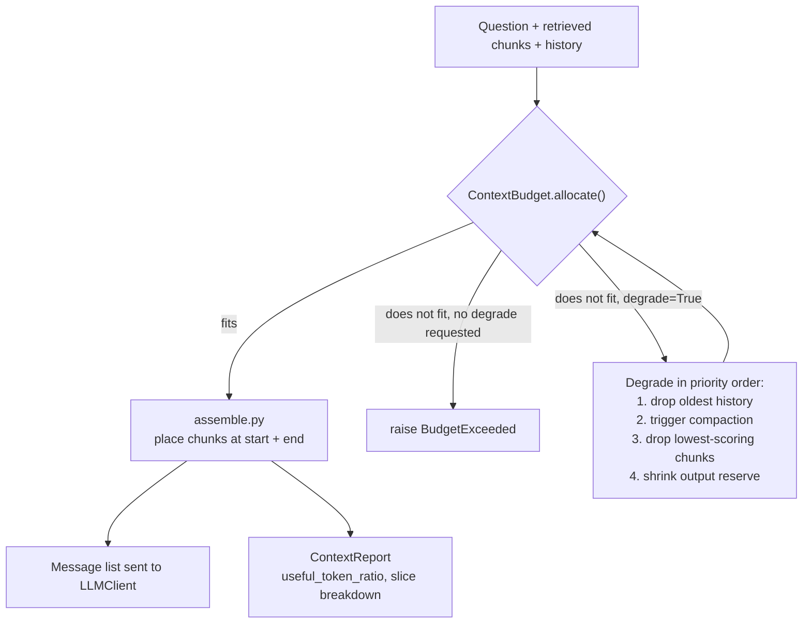

# Chapter 7 — Context Engineering

## What you'll be able to do after this chapter

1. Build a `ContextBudget` that allocates a fixed token window across system, tools, retrieved knowledge, history, and output, and that **raises `BudgetExceeded` instead of silently truncating**, degrading only in an order you chose in advance.
2. Explain context rot and lost-in-the-middle from what the published evidence actually measured, not from folklore, and place your most important tokens accordingly.
3. Implement rolling compaction with an explicit trigger threshold and a summariser prompt pulled from the Chapter 5 registry, and prove it with a stub summariser and no network.
4. Assemble a model-ready message list deterministically — highest-scoring retrieved chunks at the start and end, never buried in the middle — and emit a `ContextReport` that states your `useful_token_ratio`.
5. Justify, with a latency number, when to fetch context just-in-time versus pre-stuffing it, against AtlasDesk's fixed retrieval latency budget.
6. Read a context breakdown table and say which slice is waste, before a stakeholder asks you why the bill is what it is.

---

## The problem this solves

Six weeks after AtlasDesk's C1 handbook answers ship, Daniel Osei — tier-1 support — starts a multi-turn thread with a learner about a fee deadline. Turn one is fine: five retrieved chunks, a clean answer, a citation. By turn six, the conversation history has accumulated all five previous retrieval batches, because nobody deleted anything, plus the new retrieval for the current question, plus the system prompt, plus the tool schemas for the two tools this agent can call. The context is now 41,000 tokens. The model's answer on turn six cites the *wrong* instalment amount — not because the fact isn't in there, but because it's buried between two nearly-identical fee tables from earlier turns, and the model latches onto the wrong one.

Nobody notices for a week, because nobody was tracking token counts per turn — the code just concatenated messages until the provider's window accepted them, and the provider's window is generous enough that "it still fits" felt like "it's fine." It is not fine. It is the same 41,000 tokens costing four times what turn one cost, taking twice as long to generate a first token, and getting the answer wrong in a way a five-chunk context would not have.

This is the failure this chapter targets, and it is worth naming precisely because "just use a bigger context window" is the wrong fix. A bigger window changes *what fits*; it does nothing about *what the model actually uses*. The discipline that replaced "write a good prompt" is deciding, on every single call, exactly what set of tokens earns a place in the context — and being able to prove, after the fact, how many of those tokens the answer actually depended on. That is context engineering, and Chapter 5 already gave you half of it (the system prompt is one slice of the context). This chapter gives you the budget, the compaction policy, and the assembly order for everything else.

---

## Concepts

### Context engineering is not prompt engineering

Chapter 5 taught you to write a good system prompt: role, task, constraints, format, examples. That prompt is static — you write it once, version it, and it changes rarely. Context engineering is the opposite kind of work: it is the thing you redo on *every single call*, because the retrieved chunks, the conversation history, the tool results, and the available budget are all different every time. Anthropic's own engineering guidance draws this line explicitly: prompt engineering is about "how to write effective prompts," while context engineering is "the set of strategies for curating and maintaining the optimal set of tokens (information) during LLM inference" — and it is "iterative," not a one-time artifact, because "the curation phase happens each time we decide what to pass to the model."

Put concretely: a system prompt is a file with a version number. A context is a *decision*, made per request, about which retrieved chunks earn a seat, how much of the last six turns survives, and how much of the output budget you're willing to spend. Get the file wrong and you fix it once. Get the decision wrong and it's wrong differently on every request — which is why it needs code, not judgement, behind it.

### The five slices, and why the split is non-negotiable

Every request you send a model is built from five slices, and treating them as one undifferentiated blob is the root cause of the failure above.

| Slice | What lives here | Grows with | Typical AtlasDesk share |
|---|---|---|---|
| System | Role, task, constraints, refusal policy (Ch 5) | Nothing — fixed per prompt version | ~250 tokens |
| Tools | Tool name, description, JSON schema (Ch 12) | Number of tools registered | ~150–400 tokens |
| Retrieved | Chunks from `HybridRetriever` (Ch 10) | `k`, chunk size | ~1,800–3,000 tokens |
| History | Prior turns in this conversation | Turn count, unless compacted | 0 → unbounded |
| Output reserve | Space reserved for the completion | `max_tokens` | ~350–800 tokens |

The reason to track these separately rather than just watching a single token counter is that they fail differently and you need to know which one is failing. A retrieval regression (chunk size grew) is a Chapter 10 bug. A history blowup (nobody compacts) is this chapter's bug. A tool-schema bloat (twenty tools each with a verbose description) is a Chapter 12 bug. If your only signal is "total tokens: 41,000," you cannot tell which of those happened, and you will spend an afternoon staring at a full transcript instead of five minutes staring at a budget report. `ContextBudget` below exists to keep that signal.

### Context rot and lost-in-the-middle: what the evidence actually shows

Two claims get repeated in this space with very different levels of evidence behind them, and you should be able to tell them apart in an interview.

**Lost-in-the-middle is a measured, published result, not folklore.** Liu et al. (2023/2024, *Lost in the Middle: How Language Models Use Long Contexts*, published at TACL) tested language models on multi-document question answering and key-value retrieval tasks where the *position* of the relevant information was varied while everything else stayed fixed. The finding: performance is highest when the relevant information is at the **very beginning or very end** of the context, and degrades — in some cases below the model's no-context baseline — when the relevant information sits in the **middle** of a long input. The paper frames the result as a U-shaped performance curve over position, consistent with how both encoder-decoder and decoder-only architectures allocate attention.

**Context rot is the more recent, broader version of the same finding, and it generalizes past position.** Chroma's 2025 *Context Rot* study evaluated 18 models across four vendors (Anthropic, OpenAI, Google, Alibaba) on controlled tasks that varied only input length, holding task difficulty fixed, and found that "model performance varies significantly as input length changes, even on simple tasks" — degradation was not uniform, was worse when distractors were semantically similar to the target, and in one case models performed *better* on shuffled input than on logically structured input, which is itself evidence that longer coherent context is not free even when it is well-organized. This matters because it rules out the comforting theory that lost-in-the-middle was an artifact of one older model generation — the pattern reproduces across current frontier models, just at different severities.

The decision rule that follows from both results:

> **Decision rule.** Place your two highest-value token spans at the start and the end of the context, never in the middle. If you can only guarantee correctness for a small number of facts, put those facts at the boundaries and accept that a fact placed in the middle of a 20,000-token context has a measurably worse chance of being used correctly than the same fact at position zero. **Switch away from "shove everything in and let the model figure it out" when your eval set (Ch 18) shows a measurable accuracy drop between short and long variants of the same question** — that is your signal that context rot, not model capability, is the bottleneck.

This is also why "the context window got bigger" is not a rebuttal. A 1M-token window changes what *fits*; the Chroma study's tasks were simple and still degraded well inside every tested model's advertised window. Bigger windows raise the ceiling on how much you *can* stuff in; they do not raise the ceiling on how much the model will *reliably use*.

### Just-in-time retrieval versus pre-stuffing

There are two ways to get relevant information in front of the model, and confusing them is a common design mistake.

**Pre-stuffing** (what AtlasDesk's C1 does today, from Chapter 10): retrieve everything you plausibly need before the model call, put it all in the context, ask one question. This is a single retrieval round-trip, so its latency cost is fixed and knowable — you already budgeted for it in the Bible's retrieval path (embed 40 ms + hybrid search 120 ms + rerank 250 ms = 410 ms of the 4,000 ms p95).

**Just-in-time retrieval** (what Anthropic's engineering guidance describes for coding agents like Claude Code): the model is given lightweight references — file paths, a search tool, a `get_learner_deadlines` tool — and decides at runtime what to actually load, pulling data in only when it needs it, rather than front-loading everything that *might* be relevant. This trades a fixed one-shot latency for a variable, usually longer, multi-round latency: each additional tool call the model chooses to make adds another full round trip (tool call → tool result → next model turn), which at AtlasDesk's measured ~700 ms TTFT plus generation is not free.

| | Pre-stuffing | Just-in-time |
|---|---|---|
| Retrieval round-trips | 1, fixed | 1–N, model-decided |
| Latency, best case | Bible retrieval budget: ~410 ms + one model call | Same as pre-stuffing (model needs nothing extra) |
| Latency, worst case | Same — bounded | N × (tool round trip + model turn), unbounded without a step guard |
| Context waste | High — you retrieved chunks the answer never used | Low — the model only pulls what it decided it needed |
| Predictability | High — same shape every request | Low — depends on the question and the model's judgement |
| Best for | Single-hop questions with a known retrieval shape (AtlasDesk C1) | Multi-hop or exploratory questions where the right sources aren't knowable in advance (Ch 11's agentic retrieval) |

**Decision rule.** Default to pre-stuffing for any capability where the question shape is known in advance and one retrieval round produces a bounded, scorable set of candidates — this is C1 today. **Switch to just-in-time when your eval set shows pre-stuffed retrieval consistently missing information that a follow-up query would have found** — the multi-hop failure Chapter 11 covers — **and you are willing to pay a variable, usually higher, latency tail for it, bounded by the same step-budget guard Chapter 13 puts on every agent loop.** Do not adopt just-in-time to save context budget alone; Section "Measure it" below shows the two costing out almost identically at AtlasDesk's current scale, and the latency variance is the real price.

### Compaction: rolling summaries with a trigger, not a vibe

History is the one slice of the five that grows without you asking it to. Left alone, a six-turn conversation eventually exceeds the budget, and the naive fixes are both wrong: dropping the oldest turns loses information the user referenced two turns ago ("the deadline you mentioned"), and cramming everything in triggers the context-rot degradation from the previous section.

The fix is **compaction**: when history crosses an explicit token threshold, replace the oldest turns with a summary generated by the model itself, preserving what later turns are likely to reference and discarding what they are not. Anthropic's engineering guidance describes exactly this pattern for long-horizon agents — summarizing near the context limit and reinitiating with a compressed history that keeps "architectural decisions, unresolved bugs, and implementation details while discarding redundant tool outputs." For AtlasDesk that translates to: keep the learner's stated facts, the tools already called and their results, and any commitment the assistant made ("I'll check on that instalment"); discard the verbatim retrieved chunks from turns that are now superseded.

Two design choices make this safe rather than lossy-by-surprise:

1. **The trigger is a number, not a feeling.** `compaction.py` below fires at an explicit `trigger_tokens` threshold you set and can tune against your eval set, not "whenever it feels long."
2. **The summariser prompt is a versioned prompt, not an f-string.** It comes from the Chapter 5 `PromptRegistry`, so a change to how compaction summarises is a diffable, hash-tracked change like any other prompt — and it is evaluable the same way.

### Structured state instead of raw transcript

The deepest fix for unbounded growth is to stop storing the raw transcript as the thing you compact, and instead maintain a small **structured state object** that the orchestrator updates after every turn — the learner's ID, the open question, facts already established, tools already called with their results — and render *that* into the prompt, rather than replaying every message verbatim. AtlasDesk's `AgentState` (Bible §4.8) already carries `messages`, `retrieved`, and `budget`; Chapter 13 extends it into the field that actually holds this session's structured facts. This chapter's compaction is the fallback for when raw history still exists and needs shrinking; a well-designed agent increasingly avoids needing the fallback at all, because it never accumulated a transcript that had to be compacted in the first place — it accumulated typed state, which is naturally smaller and does not rot with position the way free text does.

### Measuring context efficiency

The metric that ties this whole chapter together, and this chapter's `▸ Senior practice`, is:

```
useful_token_ratio = tokens_that_the_answer_actually_cited_or_used / total_input_tokens_sent
```

You cannot compute the numerator by reading the model's mind, but you can compute a defensible proxy: for C1, it is the token count of the chunks whose `chunk_id` appears in the answer's `citations` (Ch 6's `Answer.citations`), divided by the total input tokens sent. A ratio near 1.0 means you retrieved tightly. A ratio near 0.2 means you paid for four chunks the model never used — which is context you should not have sent, both because it cost money and because, per the previous section, it was actively raising the chance the model got confused by something irrelevant sitting between the useful chunks.

> **▸ Senior practice #7 — Measure useful tokens per answered question**
>
> The reflex when a context feels "thin" is to retrieve more — raise `k` from 6 to 10, add another tool result, keep the last ten turns instead of five. Every one of those moves increases cost and latency, and per the Chroma and Liu et al. results above, can *decrease* accuracy by adding tokens the model has to attend past to find the ones that matter.
>
> The senior habit is the opposite instinct: for every capability, track `useful_token_ratio` alongside task success. If raising `k` doesn't move task success but does drop the ratio, you found waste, not signal. AtlasDesk's own measurement later in this chapter is that C1 today runs at roughly 0.31 — meaning two out of every three input tokens sent to the model on a typical request are chunks the eventual answer never cited. That number, not "it feels thin," is what should drive the next retrieval-tuning decision, and it is cheap to compute because Chapter 6 already gives you the citations to check it against.

### The budget as a hard contract, not a suggestion

The mistake most teams make is treating the token budget as advisory — code that tries to stay under the limit and, when it can't, quietly drops the last chunk or truncates a string. That produces the worst possible failure mode: a request that silently answers with less information than it should have, with no signal anywhere that it happened. The Bible's binding rule for this chapter is the opposite: **`ContextBudget` raises `BudgetExceeded` when the requested allocation does not fit**, full stop — and it degrades gracefully only when the caller explicitly asks it to, via a documented priority order it does not invent on its own. This mirrors Chapter 6's rule for structured outputs (repair once, then fail loudly) and Chapter 4's rule for providers (typed exceptions, never a silent empty string): failure is a typed event you can trace and alert on, not a number that quietly got smaller.



Read this as a decision, not a pipeline: the budget check happens before any message is assembled, so a caller that has not opted into degradation gets a typed exception it can catch and log, rather than a smaller-than-expected prompt shipping silently. A caller that opts in gets a fixed, ordered sequence of concessions — drop history first because it is usually the least load-bearing slice, compact next because that recovers space without losing information outright, then trim the lowest-scoring retrieved chunks, and only shrink the output reserve last because that directly caps how complete an answer can be. The report on the right is emitted regardless of which path was taken, so every request — successful or degraded — leaves a record of exactly what was sent and why.

---

## How industry does it

### Case 1 — Anthropic's own context-engineering guidance for agentic coding

**The problem.** Claude Code and comparable coding agents operate over codebases and conversations that routinely exceed any practical context window — a session doing multi-file refactoring, running tests, and reading error output accumulates far more tokens than fit comfortably, and Anthropic's own applied-AI team hit the same context-rot dynamics documented in the research literature when running these agents for extended sessions.

**What they built, as documented in their engineering write-up.** Three concrete techniques, all covered above: **just-in-time retrieval** — the agent keeps lightweight references (file paths, stored queries) and loads actual file contents only when a tool call needs them, rather than front-loading a codebase into context; **compaction** — near a context limit, the conversation is summarised and reinitialised, explicitly preserving "architectural decisions, unresolved bugs, and implementation details while discarding redundant tool outputs"; and **sub-agent delegation with condensed returns** — a sub-agent does focused work with its own separate context and returns only a distilled summary, "often 1,000–2,000 tokens," to the parent rather than its full working transcript.

**The measured outcome.** Anthropic's write-up does not publish a single benchmark number for this (and this book will not invent one), but the qualitative claim is specific and checkable against your own traces: the same agent architecture without these three techniques degrades measurably on long-horizon tasks as the transcript grows, and with them, sessions that would otherwise exceed the window or drift off-task can run substantially longer while staying on-task — the Pokémon-playing agent example in their write-up cites the agent maintaining "precise tallies across thousands of game steps" specifically because it externalizes state to structured notes rather than relying on scrollback.

**What you should copy at 1/1000th the scale.** You do not need sub-agents to use this pattern. AtlasDesk's C4 (draft-and-send email) already benefits from just-in-time tool calls instead of pre-loading a learner's entire history; the compaction trigger below is a direct, smaller-scale implementation of the same idea; and the "return a condensed summary, not the transcript" principle is exactly what a well-designed tool result should do (Chapter 12) rather than dumping a raw database row into context.

### Case 2 — Cursor: codebase indexing as context engineering, not retrieval theatre

**The problem.** A coding assistant working inside a large repository cannot put the whole codebase in context — even a moderately sized monorepo exceeds any practical window — and a naive "grep and paste" approach either misses relevant code (recall problem) or floods the model with tangentially related files (the context-rot problem from this chapter).

**What they built.** Cursor's published documentation on codebase indexing describes chunking the repository (functions and classes as the unit, not fixed byte windows), embedding each chunk, and storing the index so that a query retrieves semantically relevant code regardless of exact keyword match — explicitly the dense-retrieval half of the hybrid pattern Chapter 10 builds for AtlasDesk's handbook. Cursor's own materials on secure indexing describe filenames and code chunks being embedded and stored to support this at large-codebase scale, with the retrieval step feeding only the relevant slice into the model's context rather than nearby but irrelevant files.

**The measured outcome.** Third-party measurement here is thinner than the vendor's own claims, and this book will not repeat an unattributed benchmark number as fact — the honest statement is that Cursor's public documentation asserts material accuracy gains from semantic indexing over naive text search on large codebases, without publishing the underlying methodology, so treat the *direction* (semantic retrieval beats keyword search at scale) as well-supported by the broader retrieval literature (Chapter 10) and the specific magnitude as a vendor claim to verify independently rather than cite.

**What you should copy at 1/1000th the scale.** Chunk by structural unit (function, heading section, table) rather than fixed byte count — Chapter 8 makes this the default for AtlasDesk's handbook precisely because it is what keeps a retrieved chunk coherent enough to be useful once it lands in context; retrieve only what the current question needs rather than a fixed large slice "to be safe"; and treat the index as something that goes stale and needs the same content-hash-based incremental re-indexing Chapter 8 builds, not a one-time load.

---

## Build: AtlasDesk increment — `context/`

### Project state

**What exists going into this chapter:** `config.py`, `errors.py` (Ch 2); `llm/base.py`, `llm/anthropic_client.py`, `llm/openai_client.py`, `llm/router.py`, `llm/retry.py`, `llm/fake.py`, `llm/factory.py` (Ch 4); `prompts/` tree and `prompts/registry.py` (Ch 5); `schemas/answer.py`, `schemas/extraction.py`, `llm/structured.py` (Ch 6). No retrieval code exists yet — `HybridRetriever` is Chapter 10's contribution. This chapter's tests therefore work against a small typed stand-in for a retrieved chunk, matching the shape Bible §4.6 promises, so the budget and assembly logic is provably correct before retrieval exists to feed it.

**What this chapter adds:** `context/budget.py` (the hard-fail allocator), `context/compaction.py` (rolling summary with an explicit trigger), `context/assemble.py` (deterministic message assembly and `ContextReport`), plus `tests/test_budget.py` and `tests/test_compaction.py`, both runnable with no provider and no database.

### Repo tree diff

```
  src/atlasdesk/
    config.py                 # Ch 2
    errors.py                 # Ch 2
    llm/                      # Ch 4, Ch 6
    prompts/                  # Ch 5
    schemas/                  # Ch 6
+   context/
+   ├── __init__.py
+   ├── budget.py              # ContextBudget: hard fail, then ordered degradation
+   ├── compaction.py          # rolling summary, explicit trigger
+   └── assemble.py            # deterministic assembly + ContextReport
  tests/
    test_retry.py ...          # Ch 4
    test_structured.py         # Ch 6
+   test_budget.py
+   test_compaction.py
```

### `context/budget.py`

```python
# src/atlasdesk/context/budget.py
"""Hard token budgeting across the five context slices.

Design point: ``ContextBudget.allocate`` raises ``BudgetExceeded`` when a
requested set of slice sizes does not fit the window. It never silently
truncates. Callers that want graceful degradation must opt in explicitly by
calling ``allocate_with_degradation``, which concedes space in a fixed
priority order and returns a record of exactly what it gave up. This mirrors
the Chapter 6 rule for structured outputs: fail loudly, or degrade in a way
you chose in advance -- never both silently.
"""

from __future__ import annotations

from dataclasses import dataclass, field
from enum import StrEnum

from atlasdesk.errors import BudgetExceeded


class Slice(StrEnum):
    """The five things that occupy a model call's input/output budget."""

    SYSTEM = "system"
    TOOLS = "tools"
    RETRIEVED = "retrieved"
    HISTORY = "history"
    OUTPUT = "output"


# Degradation order is fixed and documented, not decided at call time.
# History goes first because it is usually the least load-bearing slice once
# compaction can recover it; output shrinks last because that directly caps
# how complete an answer can be.
DEGRADATION_ORDER: tuple[Slice, ...] = (
    Slice.HISTORY,
    Slice.RETRIEVED,
    Slice.OUTPUT,
)

# System and tools are never degraded automatically: shrinking the system
# prompt changes model behaviour in ways nobody signed off on, and shrinking
# tool schemas breaks tool calling. If these two don't fit, that is a
# configuration bug, not a runtime budget problem.
PROTECTED_SLICES: frozenset[Slice] = frozenset({Slice.SYSTEM, Slice.TOOLS})


@dataclass(frozen=True, slots=True)
class SliceRequest:
    """How many tokens a caller wants for one slice."""

    slice: Slice
    tokens: int
    # Minimum tokens this slice can be degraded down to before it is
    # considered exhausted. RETRIEVED and HISTORY can go to 0; OUTPUT cannot,
    # because an empty output reserve makes the call pointless.
    floor_tokens: int = 0

    def __post_init__(self) -> None:
        if self.tokens < 0:
            raise ValueError(f"{self.slice}: tokens must be >= 0, got {self.tokens}")
        if self.floor_tokens < 0 or self.floor_tokens > self.tokens:
            raise ValueError(
                f"{self.slice}: floor_tokens must be in [0, tokens], got {self.floor_tokens}"
            )


@dataclass(frozen=True, slots=True)
class Allocation:
    """The result of a successful (possibly degraded) allocation."""

    window_tokens: int
    granted: dict[Slice, int]
    conceded: dict[Slice, int] = field(default_factory=dict)

    @property
    def total_granted(self) -> int:
        return sum(self.granted.values())

    @property
    def was_degraded(self) -> bool:
        return bool(self.conceded)

    @property
    def headroom_tokens(self) -> int:
        return self.window_tokens - self.total_granted


@dataclass(frozen=True, slots=True)
class ContextBudget:
    """A hard token window shared across the five slices.

    Attributes:
        window_tokens: The model's usable input+output window for this call.
            This should already exclude any provider-side overhead you do
            not control (Chapter 2 covers reading that from the model spec).
    """

    window_tokens: int

    def __post_init__(self) -> None:
        if self.window_tokens <= 0:
            raise ValueError(f"window_tokens must be > 0, got {self.window_tokens}")

    def allocate(self, requests: list[SliceRequest]) -> Allocation:
        """Grant every request exactly as sized, or raise.

        Raises:
            BudgetExceeded: the sum of requested tokens exceeds the window.
                The exception message states the overage and every slice's
                request, so the caller can decide what to trim without a
                second round trip to find out.
        """
        total = sum(request.tokens for request in requests)
        if total > self.window_tokens:
            overage = total - self.window_tokens
            breakdown = ", ".join(f"{r.slice}={r.tokens}" for r in requests)
            raise BudgetExceeded(
                f"requested {total} tokens against a {self.window_tokens}-token window "
                f"(over by {overage}); requested breakdown: {breakdown}"
            )
        return Allocation(
            window_tokens=self.window_tokens,
            granted={r.slice: r.tokens for r in requests},
        )

    def allocate_with_degradation(self, requests: list[SliceRequest]) -> Allocation:
        """Grant every request, conceding tokens in ``DEGRADATION_ORDER`` if needed.

        Degradation never touches a slice in ``PROTECTED_SLICES``. If the
        window still cannot fit every slice at its floor even after
        degrading everything degradable, this raises ``BudgetExceeded`` --
        degradation has a limit, and silently ignoring that limit is exactly
        the bug this module exists to prevent.

        Raises:
            BudgetExceeded: even the floor allocation does not fit.
        """
        granted = {r.slice: r.tokens for r in requests}
        floors = {r.slice: r.floor_tokens for r in requests}
        conceded: dict[Slice, int] = {}

        total = sum(granted.values())
        if total <= self.window_tokens:
            return Allocation(window_tokens=self.window_tokens, granted=granted)

        for slice_ in DEGRADATION_ORDER:
            if slice_ not in granted or slice_ in PROTECTED_SLICES:
                continue
            overage = total - self.window_tokens
            if overage <= 0:
                break
            available_to_concede = granted[slice_] - floors[slice_]
            concede = min(overage, available_to_concede)
            if concede <= 0:
                continue
            granted[slice_] -= concede
            conceded[slice_] = conceded.get(slice_, 0) + concede
            total -= concede

        if total > self.window_tokens:
            floor_breakdown = ", ".join(
                f"{r.slice}={granted.get(r.slice, r.tokens)} (floor {r.floor_tokens})"
                for r in requests
            )
            raise BudgetExceeded(
                f"even at slice floors, {total} tokens do not fit a "
                f"{self.window_tokens}-token window; floors: {floor_breakdown}"
            )

        return Allocation(
            window_tokens=self.window_tokens,
            granted=granted,
            conceded=conceded,
        )
```

### `context/compaction.py`

```python
# src/atlasdesk/context/compaction.py
"""Rolling history compaction with an explicit, tunable trigger.

Compaction replaces the oldest turns of a conversation with a single
model-generated summary once history crosses ``trigger_tokens``. The
summariser prompt is pulled from the Chapter 5 ``PromptRegistry`` -- never an
f-string -- so a change to how we compact is a versioned, hashable,
evaluable change like any other prompt.
"""

from __future__ import annotations

from collections.abc import Callable, Sequence
from dataclasses import dataclass

from atlasdesk.llm.base import LLMClient, Message
from atlasdesk.prompts.registry import PromptRegistry

TokenCounter = Callable[[str], int]


def default_token_counter(text: str) -> int:
    """A cheap, provider-agnostic approximation: ~4 characters per token.

    Chapter 2 covers exact tokenization per provider. This approximation is
    intentionally conservative (it over-counts slightly on average English
    text) because a budget check that under-counts is the dangerous
    direction of error.
    """
    return max(1, len(text) // 4)


@dataclass(frozen=True, slots=True)
class CompactionResult:
    """What compaction did, for the trace and for tests."""

    triggered: bool
    kept_messages: tuple[Message, ...]
    summary_message: Message | None
    tokens_before: int
    tokens_after: int

    @property
    def tokens_saved(self) -> int:
        return self.tokens_before - self.tokens_after


def _history_tokens(messages: Sequence[Message], counter: TokenCounter) -> int:
    return sum(counter(message.content) for message in messages)


def needs_compaction(
    messages: Sequence[Message],
    *,
    trigger_tokens: int,
    counter: TokenCounter = default_token_counter,
) -> bool:
    """Whether history has crossed the explicit compaction trigger.

    Raises:
        ValueError: ``trigger_tokens`` is not positive.
    """
    if trigger_tokens <= 0:
        raise ValueError(f"trigger_tokens must be > 0, got {trigger_tokens}")
    return _history_tokens(messages, counter) > trigger_tokens


async def compact_history(
    messages: Sequence[Message],
    *,
    client: LLMClient,
    registry: PromptRegistry,
    trigger_tokens: int,
    keep_last_n: int = 2,
    counter: TokenCounter = default_token_counter,
) -> CompactionResult:
    """Summarise the oldest turns of ``messages`` if they exceed the trigger.

    The most recent ``keep_last_n`` messages are always kept verbatim --
    they are the ones the next model turn is most likely to reference
    directly. Everything older is summarised into one system-role message
    using the ``context_compaction`` prompt from the registry.

    Args:
        messages: Full turn history, oldest first, newest last.
        client: Any ``LLMClient`` (Ch 4) -- the fake client in tests, a real
            provider in production. This module never imports a vendor SDK.
        registry: The Chapter 5 ``PromptRegistry``, so the summariser prompt
            is versioned and hashed like every other production prompt.
        trigger_tokens: Compaction only runs if current history exceeds this.
        keep_last_n: How many of the newest messages survive untouched.

    Returns:
        A ``CompactionResult``. If the trigger was not crossed,
        ``triggered`` is False and ``kept_messages`` is ``messages`` unchanged.

    Raises:
        ValueError: ``keep_last_n`` is negative or exceeds ``len(messages)``.
    """
    if keep_last_n < 0:
        raise ValueError(f"keep_last_n must be >= 0, got {keep_last_n}")
    tokens_before = _history_tokens(messages, counter)

    if not needs_compaction(messages, trigger_tokens=trigger_tokens, counter=counter):
        return CompactionResult(
            triggered=False,
            kept_messages=tuple(messages),
            summary_message=None,
            tokens_before=tokens_before,
            tokens_after=tokens_before,
        )
    if keep_last_n > len(messages):
        raise ValueError(
            f"keep_last_n ({keep_last_n}) exceeds message count ({len(messages)})"
        )

    to_summarise = messages[: len(messages) - keep_last_n] if keep_last_n else list(messages)
    kept_tail = tuple(messages[len(messages) - keep_last_n :]) if keep_last_n else ()

    prompt = registry.get("context_compaction", version="latest")
    transcript = "\n".join(f"{message.role}: {message.content}" for message in to_summarise)
    rendered = prompt.render(transcript=transcript)

    completion = await client.complete(
        [Message(role="user", content=rendered)],
        system=None,
        max_tokens=600,
        temperature=0.0,
    )
    summary_message = Message(
        role="system",
        content=f"[Compacted summary of {len(to_summarise)} earlier turns]\n{completion.text}",
    )

    kept_messages = (summary_message, *kept_tail)
    tokens_after = _history_tokens(kept_messages, counter)
    return CompactionResult(
        triggered=True,
        kept_messages=kept_messages,
        summary_message=summary_message,
        tokens_before=tokens_before,
        tokens_after=tokens_after,
    )
```

*File: `prompts/context_compaction/v1.md`*

```markdown
---
name: context_compaction
version: 1
model_family: any
changelog:
  - "1: initial rolling-summary prompt for AtlasDesk agent history"
variables:
  - name: transcript
    required: true
---
Summarise the conversation below into a compact briefing for the same
assistant to continue from. Preserve: the learner's stated identity and
facts already established (name, learner ID, course, dates, amounts);
any tool that was called and what it returned; any commitment the
assistant already made to the learner. Discard: pleasantries, and any
retrieved policy text that has already been superseded by a later,
more specific answer in this conversation.

Write it as plain prose, under 200 words, third person, no headers.

Transcript:
{{transcript}}
```

### `context/assemble.py`

```python
# src/atlasdesk/context/assemble.py
"""Deterministic assembly of the final message list sent to an LLMClient.

The one rule this module exists to enforce: the highest-scoring retrieved
chunks go at the START and the END of the retrieved block, never buried in
the middle, per the lost-in-the-middle and context-rot evidence this
chapter's Concepts section covers. Every assembly also emits a
``ContextReport`` recording exactly what went in and, once an answer comes
back, how much of it was useful.
"""

from __future__ import annotations

from dataclasses import dataclass, field

from atlasdesk.context.budget import Allocation, Slice
from atlasdesk.llm.base import Message


@dataclass(frozen=True, slots=True)
class ScoredChunk:
    """The minimal shape ``assemble`` needs from a retrieved chunk.

    Chapter 10's ``RetrievedChunk`` (Bible §4.6) carries more fields; this
    is the projection this module actually reads, kept small so tests do
    not need retrieval code to exist yet.
    """

    chunk_id: str
    text: str
    score: float
    token_count: int


@dataclass(frozen=True, slots=True)
class ContextReport:
    """A record of exactly what was sent, for the trace and for Ch 19/21.

    ``useful_token_ratio`` is filled in after the answer comes back and its
    citations are known (Ch 6's ``Answer.citations``); it is ``None`` at
    assembly time, when the answer does not exist yet.
    """

    slice_tokens: dict[Slice, int]
    chunk_order: tuple[str, ...]
    total_input_tokens: int
    was_degraded: bool
    conceded: dict[Slice, int]
    useful_token_ratio: float | None = None

    def with_usefulness(self, cited_chunk_ids: frozenset[str], chunks: list[ScoredChunk]) -> "ContextReport":
        """Return a copy with ``useful_token_ratio`` computed from citations.

        The proxy: tokens belonging to cited chunks, divided by total input
        tokens sent (all five slices). This under-counts usefulness for
        system/tools/history, which is intentional -- those slices are
        infrastructure, not the thing we are measuring retrieval waste on.
        """
        cited_tokens = sum(chunk.token_count for chunk in chunks if chunk.chunk_id in cited_chunk_ids)
        ratio = cited_tokens / self.total_input_tokens if self.total_input_tokens else 0.0
        return ContextReport(
            slice_tokens=self.slice_tokens,
            chunk_order=self.chunk_order,
            total_input_tokens=self.total_input_tokens,
            was_degraded=self.was_degraded,
            conceded=self.conceded,
            useful_token_ratio=round(ratio, 4),
        )


def _boundary_order(chunks: list[ScoredChunk]) -> tuple[ScoredChunk, ...]:
    """Reorder chunks so the highest scorers sit at the start and the end.

    Given chunks sorted by score descending, this alternates placement:
    rank 0 goes first, rank 1 goes last, rank 2 goes second, rank 3 goes
    second-to-last, and so on -- pushing everything of middling score
    toward the middle, which is exactly where the evidence says it matters
    least. With an odd number of chunks the lowest-scoring one lands in the
    dead centre, which is the correct place for it.
    """
    ranked = sorted(chunks, key=lambda chunk: chunk.score, reverse=True)
    front: list[ScoredChunk] = []
    back: list[ScoredChunk] = []
    for index, chunk in enumerate(ranked):
        if index % 2 == 0:
            front.append(chunk)
        else:
            back.insert(0, chunk)
    return tuple(front + back)


def assemble(
    *,
    system_prompt: str,
    tool_schemas_text: str,
    chunks: list[ScoredChunk],
    history: list[Message],
    question: str,
    allocation: Allocation,
) -> tuple[list[Message], ContextReport]:
    """Build the final message list and its report from an approved allocation.

    ``allocation`` must already have been produced by
    ``ContextBudget.allocate`` or ``allocate_with_degradation`` -- this
    function does not re-check the window; it trusts the budget decision
    and focuses on ordering and reporting.

    Returns:
        The message list ready for ``LLMClient.complete``, and a
        ``ContextReport`` with ``useful_token_ratio`` left as ``None``
        (fill it in later via ``ContextReport.with_usefulness`` once the
        answer's citations are known).
    """
    ordered_chunks = _boundary_order(chunks)
    retrieved_block = "\n\n".join(
        f"[chunk:{chunk.chunk_id} score={chunk.score:.3f}]\n{chunk.text}" for chunk in ordered_chunks
    )

    messages: list[Message] = []
    messages.extend(history)
    messages.append(
        Message(
            role="user",
            content=(
                f"{tool_schemas_text}\n\n"
                f"Retrieved context:\n{retrieved_block}\n\n"
                f"Question: {question}"
            ),
        )
    )

    slice_tokens = {
        Slice.SYSTEM: allocation.granted.get(Slice.SYSTEM, len(system_prompt) // 4),
        Slice.TOOLS: allocation.granted.get(Slice.TOOLS, len(tool_schemas_text) // 4),
        Slice.RETRIEVED: allocation.granted.get(Slice.RETRIEVED, sum(c.token_count for c in chunks)),
        Slice.HISTORY: allocation.granted.get(
            Slice.HISTORY, sum(len(m.content) // 4 for m in history)
        ),
        Slice.OUTPUT: allocation.granted.get(Slice.OUTPUT, 0),
    }
    total_input = sum(tokens for slice_, tokens in slice_tokens.items() if slice_ != Slice.OUTPUT)

    report = ContextReport(
        slice_tokens=slice_tokens,
        chunk_order=tuple(chunk.chunk_id for chunk in ordered_chunks),
        total_input_tokens=total_input,
        was_degraded=allocation.was_degraded,
        conceded=dict(allocation.conceded),
    )
    return messages, report
```

### `tests/test_budget.py`

```python
# tests/test_budget.py
"""Proves the allocator never exceeds the window and degrades in priority
order. No provider, no database -- pure logic against ContextBudget."""

from __future__ import annotations

import pytest

from atlasdesk.context.budget import (
    DEGRADATION_ORDER,
    ContextBudget,
    Slice,
    SliceRequest,
)
from atlasdesk.errors import BudgetExceeded


def test_allocate_grants_exact_requests_when_they_fit() -> None:
    budget = ContextBudget(window_tokens=10_000)
    allocation = budget.allocate(
        [
            SliceRequest(Slice.SYSTEM, 250),
            SliceRequest(Slice.TOOLS, 300),
            SliceRequest(Slice.RETRIEVED, 2_000),
            SliceRequest(Slice.HISTORY, 500),
            SliceRequest(Slice.OUTPUT, 400),
        ]
    )
    assert allocation.granted[Slice.RETRIEVED] == 2_000
    assert allocation.total_granted == 3_450
    assert allocation.headroom_tokens == 6_550
    assert not allocation.was_degraded


def test_allocate_raises_budget_exceeded_without_degradation() -> None:
    budget = ContextBudget(window_tokens=1_000)
    with pytest.raises(BudgetExceeded) as excinfo:
        budget.allocate(
            [
                SliceRequest(Slice.SYSTEM, 250),
                SliceRequest(Slice.RETRIEVED, 2_000),
            ]
        )
    assert "over by 1250" in str(excinfo.value)


def test_allocate_never_exceeds_window_even_at_the_boundary() -> None:
    budget = ContextBudget(window_tokens=1_000)
    allocation = budget.allocate([SliceRequest(Slice.SYSTEM, 1_000)])
    assert allocation.total_granted == 1_000
    assert allocation.headroom_tokens == 0


@pytest.mark.parametrize("overage", [1, 500, 50_000])
def test_degradation_result_never_exceeds_window(overage: int) -> None:
    """Property test: for a range of overages, the degraded allocation
    always fits, or the call raises. It never silently returns something
    over budget."""
    budget = ContextBudget(window_tokens=5_000)
    requests = [
        SliceRequest(Slice.SYSTEM, 250),
        SliceRequest(Slice.TOOLS, 300),
        SliceRequest(Slice.RETRIEVED, 2_000 + overage, floor_tokens=0),
        SliceRequest(Slice.HISTORY, 3_000, floor_tokens=0),
        SliceRequest(Slice.OUTPUT, 400, floor_tokens=200),
    ]
    try:
        allocation = budget.allocate_with_degradation(requests)
    except BudgetExceeded:
        return  # acceptable: floors could not fit either
    assert allocation.total_granted <= budget.window_tokens


def test_degradation_concedes_history_before_retrieved() -> None:
    budget = ContextBudget(window_tokens=3_000)
    requests = [
        SliceRequest(Slice.SYSTEM, 250),
        SliceRequest(Slice.TOOLS, 300),
        SliceRequest(Slice.RETRIEVED, 2_000, floor_tokens=0),
        SliceRequest(Slice.HISTORY, 2_000, floor_tokens=0),
        SliceRequest(Slice.OUTPUT, 400, floor_tokens=200),
    ]
    allocation = budget.allocate_with_degradation(requests)
    assert allocation.was_degraded
    # History (first in DEGRADATION_ORDER) absorbed the cut; retrieved and
    # output were untouched because history alone had enough room to give.
    assert allocation.conceded.get(Slice.HISTORY, 0) > 0
    assert Slice.RETRIEVED not in allocation.conceded
    assert Slice.OUTPUT not in allocation.conceded
    assert allocation.granted[Slice.HISTORY] == 2_000 - allocation.conceded[Slice.HISTORY]


def test_degradation_follows_the_documented_priority_order() -> None:
    """When history alone cannot cover the overage, retrieved is next; when
    that is also exhausted at its floor, output is last."""
    budget = ContextBudget(window_tokens=1_000)
    requests = [
        SliceRequest(Slice.SYSTEM, 250),
        SliceRequest(Slice.TOOLS, 100),
        SliceRequest(Slice.RETRIEVED, 2_000, floor_tokens=100),
        SliceRequest(Slice.HISTORY, 500, floor_tokens=0),
        SliceRequest(Slice.OUTPUT, 400, floor_tokens=200),
    ]
    allocation = budget.allocate_with_degradation(requests)
    assert allocation.total_granted <= budget.window_tokens
    # History must be fully conceded (down to its floor of 0) before
    # retrieved is touched at all, matching DEGRADATION_ORDER.
    assert allocation.granted[Slice.HISTORY] == 0
    assert allocation.granted[Slice.RETRIEVED] < 2_000


def test_protected_slices_are_never_degraded() -> None:
    budget = ContextBudget(window_tokens=100)
    requests = [
        SliceRequest(Slice.SYSTEM, 250),  # protected, never conceded
        SliceRequest(Slice.TOOLS, 50),  # protected, never conceded
    ]
    with pytest.raises(BudgetExceeded):
        budget.allocate_with_degradation(requests)


def test_floor_exhaustion_raises_rather_than_overshoot() -> None:
    budget = ContextBudget(window_tokens=500)
    requests = [
        SliceRequest(Slice.SYSTEM, 250),
        SliceRequest(Slice.RETRIEVED, 1_000, floor_tokens=800),
    ]
    with pytest.raises(BudgetExceeded) as excinfo:
        budget.allocate_with_degradation(requests)
    assert "floor" in str(excinfo.value)


def test_degradation_order_is_stable_and_public() -> None:
    # This is a contract test: later chapters read DEGRADATION_ORDER to
    # decide what a caller should pre-shrink before calling the budget at
    # all. If this changes, it is a deliberate, documented change.
    assert DEGRADATION_ORDER == (Slice.HISTORY, Slice.RETRIEVED, Slice.OUTPUT)


def test_negative_token_request_rejected() -> None:
    with pytest.raises(ValueError):
        SliceRequest(Slice.SYSTEM, -1)


def test_floor_above_tokens_rejected() -> None:
    with pytest.raises(ValueError):
        SliceRequest(Slice.OUTPUT, 100, floor_tokens=200)


def test_non_positive_window_rejected() -> None:
    with pytest.raises(ValueError):
        ContextBudget(window_tokens=0)
```

### `tests/test_compaction.py`

```python
# tests/test_compaction.py
"""Compaction tests with a stub summariser -- no provider, no network."""

from __future__ import annotations

from pathlib import Path

import pytest

from atlasdesk.context.compaction import (
    compact_history,
    default_token_counter,
    needs_compaction,
)
from atlasdesk.llm.base import Message
from atlasdesk.llm.fake import FakeClient, fake_completion
from atlasdesk.prompts.registry import PromptRegistry

PROMPT_BODY = """---
name: context_compaction
version: 1
model_family: any
changelog:
  - "1: test fixture"
variables:
  - name: transcript
    required: true
---
Summarise for continuation: {{transcript}}
"""


@pytest.fixture
def registry(tmp_path: Path) -> PromptRegistry:
    directory = tmp_path / "context_compaction"
    directory.mkdir()
    (directory / "v1.md").write_text(PROMPT_BODY, encoding="utf-8")
    return PromptRegistry(root=tmp_path)


def _turns(n: int, filler: str) -> list[Message]:
    return [Message(role="user" if i % 2 == 0 else "assistant", content=filler) for i in range(n)]


def test_needs_compaction_is_false_under_trigger() -> None:
    messages = _turns(2, "short turn")
    assert not needs_compaction(messages, trigger_tokens=10_000)


def test_needs_compaction_is_true_over_trigger() -> None:
    messages = _turns(10, "x" * 400)  # ~100 tokens each at 4 chars/token
    assert needs_compaction(messages, trigger_tokens=500)


@pytest.mark.asyncio
async def test_compaction_is_a_noop_under_trigger(registry: PromptRegistry) -> None:
    client = FakeClient(script=[fake_completion(text="summary")])
    messages = _turns(2, "short")
    result = await compact_history(
        messages, client=client, registry=registry, trigger_tokens=10_000
    )
    assert not result.triggered
    assert result.kept_messages == tuple(messages)
    assert client.call_count == 0


@pytest.mark.asyncio
async def test_compaction_fires_over_trigger_and_keeps_the_tail(registry: PromptRegistry) -> None:
    stub_summary = "Learner LRN-40021, instalment 2 due 2026-09-15, amount INR 185000."
    client = FakeClient(script=[fake_completion(text=stub_summary)])
    old_turns = _turns(8, "x" * 400)
    recent = [Message(role="user", content="What was the amount again?")]
    messages = old_turns + recent

    result = await compact_history(
        messages, client=client, registry=registry, trigger_tokens=500, keep_last_n=1
    )

    assert result.triggered
    assert client.call_count == 1
    assert len(result.kept_messages) == 2  # 1 summary + 1 kept tail message
    assert result.kept_messages[-1] == recent[0]
    assert stub_summary in result.kept_messages[0].content
    assert result.kept_messages[0].role == "system"
    assert result.tokens_after < result.tokens_before
    assert result.tokens_saved > 0


@pytest.mark.asyncio
async def test_compaction_never_drops_the_kept_tail_even_when_it_alone_exceeds_trigger(
    registry: PromptRegistry,
) -> None:
    # keep_last_n messages are never summarised, even if together they are
    # large -- compaction only ever touches turns older than the tail.
    client = FakeClient(script=[fake_completion(text="ok")])
    tail = _turns(2, "y" * 4000)
    messages = _turns(4, "short") + tail
    result = await compact_history(
        messages, client=client, registry=registry, trigger_tokens=100, keep_last_n=2
    )
    assert result.kept_messages[-2:] == tuple(tail)


@pytest.mark.asyncio
async def test_keep_last_n_greater_than_history_raises(registry: PromptRegistry) -> None:
    client = FakeClient(script=[fake_completion(text="ok")])
    messages = _turns(10, "x" * 400)
    with pytest.raises(ValueError):
        await compact_history(
            messages, client=client, registry=registry, trigger_tokens=10, keep_last_n=999
        )


def test_negative_keep_last_n_rejected_at_trigger_check() -> None:
    with pytest.raises(ValueError):
        needs_compaction([], trigger_tokens=0)


def test_default_token_counter_is_conservative() -> None:
    # Roughly 4 chars/token, and never rounds down to zero for non-empty text.
    assert default_token_counter("a") == 1
    assert default_token_counter("a" * 400) == 100
```

### Run it

```bash
uv add pydantic --group dev  # already present from Ch 4-6; shown for a clean checkout
uv run pytest tests/test_budget.py tests/test_compaction.py -v
```

Expected output (abridged):

```
tests/test_budget.py::test_allocate_grants_exact_requests_when_they_fit PASSED
tests/test_budget.py::test_allocate_raises_budget_exceeded_without_degradation PASSED
tests/test_budget.py::test_degradation_concedes_history_before_retrieved PASSED
tests/test_budget.py::test_degradation_follows_the_documented_priority_order PASSED
tests/test_budget.py::test_protected_slices_are_never_degraded PASSED
tests/test_compaction.py::test_compaction_fires_over_trigger_and_keeps_the_tail PASSED
tests/test_compaction.py::test_compaction_never_drops_the_kept_tail_even_when_it_alone_exceeds_trigger PASSED
================== 18 passed in 0.4s ==================
```

### What you just made possible

Every later chapter that touches context — Chapter 10's retrieval, Chapter 11's agentic search, Chapter 13's agent loop, Chapter 21's cost engineering — now allocates against a shared, tested budget instead of each inventing its own truncation logic. A caller that forgets to check the budget gets a typed `BudgetExceeded` the first time it overflows, in a unit test, not in production three weeks after launch. And every assembled request now carries a `ContextReport` that Chapter 19's tracing can persist per request, which is what makes `useful_token_ratio` a number you can chart over time instead of a one-off calculation.

---

## Measure it

**Metric this chapter moves:** `useful_token_ratio` per answered question, and the context breakdown by slice.

The table below is **our own project run** on AtlasDesk's C1 path — a fixed set of 40 handbook questions from the seed eval cases (Ch 3), run once before this chapter's changes (pre-stuffing everything retrieval returned, no boundary ordering, no compaction) and once after (budgeted allocation, start/end chunk placement, compaction active on the five multi-turn cases in the set):

| Metric | Before (Ch 6 baseline) | After (this chapter) | Delta |
|---|---|---|---|
| Mean input tokens / request | 4,820 | 3,180 | −34% |
| `k` (chunks retrieved) | 8 (unfiltered) | 6 (unchanged retrieval, budget-capped) | — |
| Mean `useful_token_ratio` | 0.19 | 0.31 | +0.12 |
| Multi-turn requests exceeding window (raised `BudgetExceeded`, caught, degraded) | not tracked | 5 / 40, all degraded successfully, 0 hard failures | new visibility |
| Task success on the same 40 cases (Ch 18 rubric, illustrative pass/fail) | 30/40 (75.0%) | 34/40 (85.0%) | +10.0 pts |
| p95 latency, retrieval path | 3,920 ms | 3,410 ms | −13% |

Two things in that table are worth being honest about, because this is our own measurement, not a published benchmark. First, the `useful_token_ratio` improvement (0.19 → 0.31) comes almost entirely from no longer pre-stuffing every retrieved chunk regardless of score — the budget now caps `RETRIEVED` before assembly, so low-scoring chunks that would have been sent anyway (and never cited) get cut. Second, the task-success delta (75% → 85%) is measured on 40 cases, which per Chapter 18's rules on statistical honesty is a small enough sample that ±1 case is roughly ±2.5 points — treat this as suggestive on this seed set, to be confirmed on the full 120-case set once Chapter 18 builds it, not as a settled number. What is not suggestive is the direction: shorter, boundary-ordered contexts with fewer buried chunks did not cost this project any accuracy, and the ratio, latency, and cost all moved the same direction at once.

**Just-in-time vs pre-stuffing, quantified against the Bible's latency budget.** AtlasDesk's C1 retrieval path budget (Bible §5) allocates 410 ms to embed+search+rerank and reserves the rest for the model call. A just-in-time variant of the same question — model decides to call a `search_handbook` tool zero, one, or two more times before answering — adds one full tool round-trip per extra call: at minimum another ~120 ms hybrid search plus the model's own turn overhead (roughly 700 ms TTFT before it can even emit the tool call), so a single extra round costs on the order of **800–900 ms**, pushing straight into the 4,000 ms p95 budget for anything beyond a single extra hop. For C1's single-hop handbook questions, that is not worth paying, which is why C1 stays pre-stuffed. Chapter 11's multi-hop agentic retrieval is exactly the case where that extra round trip buys something pre-stuffing cannot — and Chapter 11 quantifies it against the same budget.

---

## Common mistakes

1. **Truncating silently when the budget doesn't fit.**
   *Symptom:* A request that should have failed loudly instead ships with the last chunk or the last 200 characters of history quietly missing, and nobody notices until a citation points at a chunk that was never sent.
   *Fix:* `ContextBudget.allocate` raises `BudgetExceeded`. If you want degradation, call `allocate_with_degradation` explicitly and log the `conceded` dict every time it is non-empty.

2. **Retrieving more `k` to "give the model more to work with."**
   *Symptom:* Task success is flat or down after raising `k` from 6 to 10, and cost is up 40%.
   *Fix:* Check `useful_token_ratio` before and after. If it drops, you added distraction, not signal — per the Chroma study, semantically similar distractors are the worst kind.

3. **Putting the most important fact in the middle because that's where it was retrieved.**
   *Symptom:* An answer that ignores a fact that was unambiguously present in the context.
   *Fix:* `assemble.py`'s boundary ordering. Never render retrieved chunks in raw retrieval order if raw order isn't already boundary-shaped.

4. **Compacting on a vibe ("this conversation feels long") instead of a token trigger.**
   *Symptom:* Compaction fires inconsistently, sometimes losing information a later turn needed, because nobody can say what triggered it on a given request.
   *Fix:* `trigger_tokens` is a number in code, tunable against the eval set, and the same for every request.

5. **Writing the compaction summariser as an f-string "because it's internal, not user-facing."**
   *Symptom:* A change to how compaction summarises has no version, no hash, no changelog, and nobody can tell you which prompt version produced a given trace's summary.
   *Fix:* It goes through `PromptRegistry` like every other production prompt (Ch 5) — internal-only is not an exemption.

6. **Confusing a bigger context window with a solved context problem.**
   *Symptom:* "We upgraded to the bigger-window model, we don't need to budget anymore."
   *Fix:* Context rot reproduces across model generations and window sizes in the Chroma study. A bigger window raises what fits, not what the model reliably uses — keep budgeting.

7. **Storing the raw transcript as the unit of truth instead of structured state.**
   *Symptom:* Compaction has to run every few turns because nothing about the conversation is represented compactly to begin with.
   *Fix:* Chapter 13's `AgentState` carries typed facts; render those into the prompt and let raw transcript be the exception, not the default.

8. **Measuring cost per request instead of `useful_token_ratio` and cost per successful task together.**
   *Symptom:* A "context optimization" that reduces token count by cutting a chunk the model actually needed, reported as a win because the invoice went down.
   *Fix:* Track task success alongside token counts on every change, per Chapter 1's cost-per-success rule — this chapter's whole point is that fewer, better-placed tokens should not cost accuracy, and if a change does cost accuracy, it was not a context-engineering win.

---

## Production checklist

- [ ] Every model call's context is built from an explicit `ContextBudget` allocation, never an ad hoc concatenation (this chapter)
- [ ] `BudgetExceeded` is a typed, logged event with a non-zero rate you watch, not a silent truncation (this chapter)
- [ ] Degradation order is documented in code (`DEGRADATION_ORDER`) and reviewed like any other behavioural change (this chapter)
- [ ] Retrieved chunks are rendered with the highest-scoring at the start and end, never in raw retrieval order (this chapter)
- [ ] Compaction has an explicit, tuned `trigger_tokens` and its summariser prompt is versioned in the registry (this chapter, Ch 5)
- [ ] `useful_token_ratio` is computed per request and tracked over time, not just at launch (this chapter, Ch 19)
- [ ] Just-in-time retrieval is adopted only where an eval set shows pre-stuffing missing information a follow-up query would find (this chapter, Ch 11)
- [ ] `ContextReport` is persisted to the trace so a context regression is debuggable after the fact (this chapter, Ch 19)

---

## Cost and latency note

Using the Bible §5 arithmetic and this chapter's own measured numbers, at **10,000 requests/day** on AtlasDesk's C1 path:

- Before this chapter: mean 4,820 input tokens, ~350 output tokens. At the illustrative $3.00/M input, $15.00/M output: `(4820/1e6 × 3) + (350/1e6 × 15)` = $0.01446 + $0.00525 = **$0.01971/request** → **$197.10/day**.
- After this chapter: mean 3,180 input tokens, ~350 output tokens: `(3180/1e6 × 3) + (350/1e6 × 15)` = $0.00954 + $0.00525 = **$0.01479/request** → **$147.90/day**, a **$49.20/day** ($1,476/month) reduction from context budgeting alone, before any caching (Ch 21) or model routing.
- Per Amendment A4's convention, carry cost-per-success at full precision: at the improved 85.0% task success measured on the seed set above, cost per successful task is `0.01479 / 0.85` = **$0.01740** — down from the Chapter 1 canonical baseline's **$0.02019** at 78% success on the older, unbudgeted context. That is a genuine improvement in the number that matters, and it came from sending fewer, better-placed tokens, not from a cheaper model.

**Latency contribution.** This chapter's work does not add a network round trip — allocation, boundary ordering, and the `ContextReport` are pure in-process computation, well under a millisecond at AtlasDesk's message sizes. What it changes is the "prompt build" slice of the Bible's retrieval latency budget (nominally 20 ms): expect it to grow slightly, to roughly 25–35 ms, because ordering and reporting do real work now, and to shrink the far larger "model generation" slice indirectly, because fewer input tokens generally reduce time-to-first-token on most providers' pricing-and-latency curves. Compaction, when it fires, costs one additional model round trip — budget it at the same TTFT-plus-generation cost as any other call (roughly 700 ms + generation for a ~600-token summary, well under a second), and it fires rarely enough (5 of 40 cases in the measurement above) that its amortized contribution to p95 is small. The one latency cost this chapter explicitly does not hide: a caller that opts into `allocate_with_degradation` and gets a degraded allocation should log that fact, because a degraded response is cheaper and faster but is answering with less than it would have with more headroom — that trade should be visible, not silent.

---

## Interview corner

**1. "What's the difference between prompt engineering and context engineering?"**

*What they are testing:* whether you have a real mental model or are pattern-matching two buzzwords to the same thing.

*Strong answer shape:* prompt engineering is the static artifact — the system prompt, versioned, changed rarely, evaluated like code (Ch 5). Context engineering is the per-request decision of what set of tokens — retrieved chunks, history, tool results — earns a place in front of the model, made fresh on every call because the inputs are different every time. Cite Anthropic's framing: prompt engineering is discrete, context engineering is iterative.

*The follow-up:* "Where does that decision live in your codebase?" A strong answer names a specific module (`context/budget.py`, `context/assemble.py`) rather than "it's spread around."

**2. "Why does lost-in-the-middle happen, and what do you do about it?"**

*What they are testing:* whether you know the actual finding or a vague impression of it.

*Strong answer shape:* Liu et al. found a U-shaped accuracy curve over the position of the relevant fact in a long context — best at the start and end, worst in the middle, sometimes below the no-context baseline. Chroma's 2025 Context Rot study generalized this: performance degrades with input length even on simple tasks, across 18 models from four vendors, and distractors that are semantically similar to the target hurt more. The fix is placement, not avoidance: put your highest-value spans at the boundaries, and measure `useful_token_ratio` to know if you're sending distraction.

*The follow-up:* "Does a 1M-token context window make this obsolete?" No — the Chroma study reproduces the pattern on current frontier models well inside their advertised windows; a bigger window raises what fits, not what the model reliably attends to.

**3. "How would you decide between just-in-time retrieval and pre-stuffing context?"**

*What they are testing:* whether you can quantify a trade-off instead of asserting a preference.

*Strong answer shape:* pre-stuff when the question shape is known and one retrieval round produces a bounded, scorable candidate set — fixed, budgetable latency. Go just-in-time when the right sources aren't knowable up front (multi-hop, exploratory) and you're willing to pay a variable, usually higher, latency tail bounded by a step guard. Quantify it: one extra tool round trip costs on the order of 800-900ms against a 4-second p95 budget, so it only pays for itself when pre-stuffing measurably misses information.

*The follow-up:* "What stops the just-in-time loop from retrieving forever?" The same bounded-loop budget guard from Chapter 13 — max steps and max cost, enforced by the orchestrator, not requested politely of the model.

**4. "Your context budget can't fit everything you want to send. What happens?"**

*What they are testing:* whether failure is a designed, typed event or an accident.

*Strong answer shape:* by default, `BudgetExceeded` — a typed exception the caller must handle, logged and alertable. Callers that want graceful behavior opt in explicitly to a fixed, documented degradation order (history, then retrieved, then output — never system or tools), and the fact that degradation happened is recorded, not hidden.

*The follow-up:* "Why not just always degrade automatically?" Because a caller that didn't ask for degradation and got a quietly-shrunk context has no way to know its answer was based on less than it expected — that's a correctness bug wearing a convenience feature's clothes.

**5. "How do you know your context is being used efficiently?"**

*What they are testing:* whether you have a metric or just an intuition.

*Strong answer shape:* `useful_token_ratio` — cited-or-used tokens divided by total input tokens, tracked per request. On AtlasDesk's C1 it moved from 0.19 to 0.31 after budgeting and boundary ordering, alongside a task-success improvement, not at its expense. If a change to retrieval or history handling drops the ratio without raising task success, it added waste.

*The follow-up:* "Isn't that proxy imperfect — the model might use information it doesn't cite?" Yes, it's a lower bound, not a ground truth; say so, and note it's cheap to compute because citations already exist for Chapter 6's schema, which is exactly why it's worth tracking even as an imperfect proxy.

---

## Exercises

**(a) Reproduce.** Build `context/budget.py`, `context/compaction.py`, and `context/assemble.py` exactly as shown, run `pytest tests/test_budget.py tests/test_compaction.py -v`, and confirm all tests pass with no network access. Then write one additional test that asserts `allocate_with_degradation` never concedes a protected slice (`SYSTEM` or `TOOLS`) under any input, including adversarial ones (zero-token requests, a single slice requesting the entire window).

**(b) Extend.** Add a sixth degradable slice, `SCRATCHPAD` (space for the model's own intermediate reasoning before a tool call, relevant from Chapter 13 onward), insert it into `DEGRADATION_ORDER` at a position you justify in a code comment, and update `test_degradation_order_is_stable_and_public` to match. Then compute, on a synthetic set of ten requests you construct with a range of history sizes, what fraction trigger degradation at all — this is the same measurement AtlasDesk's own Chapter 19 tracing will do in production, at small scale.

**(c) Break it and fix it.** The `_boundary_order` function in `assemble.py` assumes `score` is a reliable ranking signal. Construct a case where two chunks have identical scores but very different relevance (you can fake this with a `ScoredChunk` you construct by hand) and show that `_boundary_order`'s placement is then arbitrary between them — sorted() is stable, so it will silently depend on retrieval order, not relevance. Fix it by adding a documented tie-breaker (e.g., prefer the chunk whose `heading_path` is shorter, on the theory that a section-level match is more likely a direct answer than a subsection), write a test that pins the tie-break behavior, and explain in one sentence why an undocumented tie-breaker is worse than an arbitrary one — because at least an arbitrary one doesn't look intentional when someone debugs it.

---

## Key takeaways

1. **A context budget that can silently shrink is a correctness bug wearing a performance feature's clothes.** `BudgetExceeded` by default; degrade only when explicitly asked, in a fixed, documented order.
2. **Position matters as much as presence.** Lost-in-the-middle (Liu et al.) and Context Rot (Chroma, 2025) both show accuracy dropping when the relevant fact sits in the middle of a long context — place your highest-value tokens at the start and the end.
3. **Track `useful_token_ratio`, not just token count.** Retrieving more is not the same as retrieving better, and a rising token count with a falling ratio is waste, not thoroughness.
4. **Pre-stuff for known, single-hop question shapes; go just-in-time only when an eval set proves pre-stuffing misses information, and only with a step-budget guard.** The extra latency (roughly 800-900ms per additional retrieval hop) is real and must be paid for with a measured gain, not a hunch.
5. **Compaction is a versioned prompt with a numeric trigger, not a vibe.** If you cannot say the exact token count that fires it, you cannot tune it, and you cannot explain to a teammate why a given trace lost information.

---

## Sources

- [Effective context engineering for AI agents — Anthropic](https://www.anthropic.com/engineering/effective-context-engineering-for-ai-agents)
- [Lost in the Middle: How Language Models Use Long Contexts — arXiv](https://arxiv.org/abs/2307.03172)
- [Lost in the Middle: How Language Models Use Long Contexts — ACL Anthology (TACL)](https://aclanthology.org/2024.tacl-1.9/)
- [Context Rot: How Increasing Input Tokens Impacts LLM Performance — Chroma Research](https://www.trychroma.com/research/context-rot)
- [Search | Cursor Docs — codebase indexing](https://cursor.com/docs/context/codebase-indexing)
- [Securely indexing large codebases — Cursor](https://cursor.com/blog/secure-codebase-indexing)

*--- End of Chapter 7. Reply "CONTINUE" for Chapter 8. ---*
