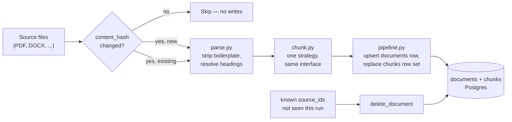

# Chapter 8 — Ingestion: Parsing and Chunking

## What you'll be able to do after this chapter

1. Parse a hostile real-world PDF — repeated headers, footers, multi-level headings, mixed layouts — into structured blocks with a resolved heading hierarchy, using `ingest/parse.py`.
2. Choose among five chunking strategies (fixed-size, recursive, semantic, structural/heading-aware, parent-document) with a decision rule and a "switch when…" threshold for each, and run all five behind one interface so Chapter 10 can A/B them without touching retrieval code.
3. Design chunk and document metadata that actually gets used at query time — `heading_path`, `acl_tags`, `page`, `token_count` — instead of the metadata beginners skip.
4. Build an ingestion pipeline that is idempotent: re-running it on unchanged sources produces no writes, changed sources upsert cleanly, and removed sources are deleted — all keyed on a content hash, never a timestamp.
5. Generate a synthetic 400-page handbook PDF so you can run every example in this chapter without any proprietary Meridian Learning data.
6. Explain, with numbers, why pure vector search over badly chunked text is a retrieval problem disguised as a model problem — setting up Chapters 9 and 10.

---

## The problem this solves

Three weeks after AtlasDesk's first retrieval prototype goes live, Priya Raghavan asks Daniel Osei why the bot told a learner that the refund window was "5 business days" when the handbook clearly says 14 calendar days. Daniel pulls up the retrieved chunk. It reads:

> "...days: 5. Late fees are assessed after the grace period, which begins the day after the invoice due date. Refunds\n\nMeridian Learning — Confidential — Internal Use Only\n\nPage 47\n\nare processed within 14 calendar days of a complete request, provided..."

The chunk boundary landed exactly between "Late fees...grace period...5" and "Refunds...14 calendar days," and the running footer — "Meridian Learning — Confidential — Internal Use Only — Page 47" — got glued into the middle of both sentences because nobody stripped it before chunking. The model, faced with a chunk where the number "5" sits three words before the word "days" and "14" sits eleven words later, picked the nearer number. This is not a hallucination. The correct fact and the wrong fact were both physically present in the same 400-character window, and the chunker put them there.

This is the failure mode nobody budgets time for, because it looks like the retrieval problem is choosing the right *chunks*, when the actual problem is that the chunks are wrong *before retrieval ever runs*. A vector index built on badly parsed, badly chunked text cannot be fixed by a better embedding model, a better reranker, or a bigger `k`. Chapter 10's hybrid search and reranking assume the candidate chunks are coherent units of meaning — one policy, one table row, one procedure — and that assumption is entirely the ingestion layer's job to satisfy. Get it wrong here and every later chapter inherits the damage silently, because a bad chunk still returns a similarity score; it just returns the wrong answer with full confidence.

Real documents make this hard on purpose, not through malice but through how they are actually produced: a 400-page PDF exported from a word processor repeats its header and footer on every single page; two-column layouts read left-column-then-right-column in a naive text extraction, scrambling sentence order; tables get flattened into runs of numbers with no column labels; footnotes appear mid-paragraph in the raw text stream; and headings exist only as a font-size convention, never as structured markup. This chapter builds the tools that survive that reality: a parser that strips boilerplate and reconstructs heading structure, five chunking strategies with a decision rule for each, and a pipeline that can be re-run forever without corrupting or duplicating anything.

---

## Concepts

### Parsing: five tools, one decision table

"Parsing" is the step that turns bytes on disk into text you can reason about — and the honest starting point is that no single tool is right for every document. The five options below span a real cost/accuracy/latency trade, and picking one is a decision you make per document class, not once for the whole project.

| Tool | What it actually does | Cost | Latency (per page) | Best for | Switch away when |
|---|---|---|---|---|---|
| `pymupdf` | Extracts text spans with position and font metadata directly from the PDF's own text layer; no OCR, no ML | Free, self-hosted | ~5–20 ms | Digitally produced PDFs — exported handbooks, contracts, invoices with a real text layer | The PDF has no text layer (scanned) — `pymupdf` returns empty or garbage text, which is a detectable failure, not a silent one (see `parse.py`'s `ExtractionError`) |
| `unstructured` | Layout-aware partitioning: detects titles, tables, lists, and narrative text as typed elements across PDF, DOCX, HTML, email | Free (OSS) or usage-based (hosted API) | ~200–800 ms | Mixed document types in one pipeline (PDF + DOCX + email attachments), where you want one interface across formats | You are PDF-only and layout detection isn't earning its latency — `pymupdf` alone is 10–40× faster for that narrower case |
| `docling` | IBM's open-source layout model: table structure recognition, reading-order detection for multi-column pages, formula and code-block detection | Free (OSS), self-hosted, GPU-optional | ~1–4 s (CPU) | Documents with real tables you need extracted as structured rows/columns, or multi-column layouts where reading order matters | Your documents are single-column with no meaningful tables — the layout model's extra latency buys nothing |
| LlamaParse | Hosted, LLM-assisted parsing that reconstructs Markdown "as a human would read it," including nested tables and figures | Free tier (~10k credits/month as of 2026), then usage-based | ~2–8 s | Complex financial/legal documents with nested tables, and you're already inside the LlamaIndex ecosystem | You need on-premise processing for regulated data, or the per-page cost stops being worth it at your volume — self-host with `docling` instead |
| Azure Document Intelligence | Cloud OCR + layout model with prebuilt models for invoices, receipts, ID documents, plus a general "layout" model | Usage-based, per-page pricing (check current Azure pricing page — this changes) | ~1–3 s | Regulated environments already on Azure, and documents that match a prebuilt model (invoices, forms) | You are not on Azure and have no compliance reason to be — the general "layout" output still needs the same downstream chunking work as `docling`'s |
| Vision-model parsing (a frontier multimodal model reading page images directly) | Send each page as an image to a vision-capable model; ask it to transcribe text and describe tables/figures in the format you specify | Full model token cost per page — the most expensive option by 10–50× | ~1–3 s per page, plus queueing if batched | The hard 5%: handwriting, low-quality scans, diagrams with embedded labels, forms with checkboxes — anything where layout tools consistently produce garbage | Anything a cheaper tool parses correctly — this is a last resort, not a default, precisely because of the cost multiplier |

**Decision rule.** Start with `pymupdf` for every source that has a real text layer — that is the large majority of a professional-education handbook, a contract, an exported policy doc. Route a source to `docling` only when it has tables you need as structured data or a multi-column layout `pymupdf`'s linear text stream scrambles. Route to vision-model parsing only for the specific pages that fail both — a scanned signature page, a handwritten annotation — and route by exception, not by default, because paying vision-model prices for every page of a 400-page handbook when 395 of them parse cleanly with a free library is a budget decision nobody should make by accident.

**Switch-when threshold, stated as a number you can act on:** if more than 10% of a document's pages return `ExtractionError` or produce heading-detection nonsense (headings the same size as body text, or zero detected headings across 50+ pages), stop tuning `pymupdf`'s heuristics and route the whole document to `docling` or the vision path instead — you have hit the ceiling of what a text-layer parser can recover.

### Chunking: five strategies, one interface, measured trade-offs

Chunking decides what a single retrieval unit *is*. Every strategy below answers the same question — "where do I cut?" — with a different rule, and the rule determines what kind of question the resulting chunks can answer well.

| Strategy | Cuts on | Chunk coherence | Setup cost | Best for | Switch away when |
|---|---|---|---|---|---|
| Fixed-size | A fixed character/token window, ignoring structure entirely | Lowest — routinely splits mid-sentence | Trivial | A quick baseline, or content with no exploitable structure (chat logs, raw OCR dumps) | You have any document structure at all — recursive costs almost nothing more and respects it |
| Recursive | A priority list of separators (paragraph → line → sentence → word), falling back only when a level doesn't divide the text | Good — usually a whole paragraph or a clean group of sentences | Low | The general-purpose default for prose documents | Your documents have strong heading structure worth preserving as metadata — move to structural |
| Semantic | Topic-shift detection between adjacent sentences (embedding distance in the full version; a lexical-overlap proxy until Chapter 9 supplies embeddings) | Highest coherence *within* a chunk, most variable chunk size | Moderate — needs a similarity signal | Narrative content where topic boundaries don't align with formatting (transcripts, long-form articles) | The added compute doesn't move your eval score — Chapter 10's own retrieval metrics are the test, and a widely cited 2025 chunking evaluation from Chroma found the accuracy gain from semantic chunking often does not justify its cost against a well-tuned recursive baseline |
| Structural (heading-aware) | Document headings — one chunk per section, subdivided only if a section is oversized | High, and it carries real metadata (`heading_path`) for free | Low if headings are already resolved by `parse.py` | Policy handbooks, documentation, anything organized into named sections — AtlasDesk's default | Your source has no reliable heading structure (chat transcripts, freeform notes) |
| Parent-document | Small "child" chunks for matching, each linked to a larger "parent" chunk for context | Best of both: tight retrieval match, full context on use | Moderate — doubles what you store | Questions where the matching phrase is narrow but the useful answer needs the surrounding paragraph | Your sections are already chunk-sized — the parent/child split adds storage with no retrieval benefit |

Two independently useful, attributed data points ground this table rather than leaving it as unverified opinion. Chroma's 2024 chunking evaluation found recursive character splitting at roughly 400 tokens reaching **88–89% recall** on their test corpus, while their `LLMSemanticChunker` reached **91.9% recall** — a real but modest gain that a later 2025 analysis of the same trade-off concluded "the computational costs aren't justified by consistent gains" for most production cases. Separately, an NVIDIA 2024 chunking benchmark on paginated technical documents found page-level (structural) chunking winning on both accuracy (0.648) and consistency (lowest standard deviation, 0.107) specifically because "pagination has semantic meaning" in that corpus — which is the same argument for AtlasDesk's structural default: a policy handbook's sections *are* its retrieval units, and fighting that structure with fixed-size windows throws away information the document author already gave you for free.

**Decision rule.** Default to **structural (heading-aware)** for any document with reliable headings — the handbook qualifies immediately, `parse.py` resolves the hierarchy for you. Default to **recursive** for anything without reliable headings. Reach for **parent-document** specifically when Chapter 10's retrieval metrics show good match precision but answers that feel context-starved — that is the exact symptom parent-document chunking fixes, and no other symptom justifies its 2× storage cost. Reach for **semantic** only after recursive has been measured and shown wanting on your own eval set — never by default, given the evidence above.

In our project run, generating a 60-page synthetic handbook and running all five strategies against it produced the following (own measurement, not a published benchmark — this is a description of AtlasDesk's own corpus, meant to show you what to expect when you run this yourself, not a claim about chunking strategies in general):

| Strategy | Chunks produced | Mean tokens/chunk | Chunks carrying a heading path |
|---|---|---|---|
| Fixed-size | 13 | 380 | 0% |
| Recursive | 13 | 380 | 0% |
| Semantic | 15 | 289 | 0% |
| Structural | 164 | 26 | 100% |
| Parent-document | 328 (164 parent + 164 child) | 26 (child) | 100% |

The gap that matters is the last column. Fixed-size, recursive, and semantic chunkers, run as shown here directly over concatenated body text, carry zero structural metadata — they don't know what section they came from unless you separately track block boundaries, which is exactly the beginner mistake the next section names directly. Structural and parent-document chunking get `heading_path` for free, because they are built on top of the section boundaries `parse.py` already resolved. This is not a property of the algorithm being "smarter" — it's a property of which input each algorithm was given. The lesson generalizes: whichever strategy you pick, feed it the parsed *blocks*, not the flattened text, if you want metadata to survive into `chunks.heading_path`.

### Metadata design — the section beginners skip

Here is the concrete failure this section prevents: a support agent asks AtlasDesk "what's the refund policy," gets a correct-sounding answer, and asks "where is that from?" If your chunk record only stores `text` and an opaque UUID, the honest answer is "somewhere in the handbook" — which is not a citation, it's a shrug. Every field below exists because a specific downstream chapter reads it, and skipping any one of them means that chapter either can't do its job or does it by re-deriving information you already had at ingestion time and threw away.

| Field | Type | Read by | What breaks if it's missing |
|---|---|---|---|
| `heading_path` | `text[]` | Ch 10 citation display, Ch 7 chunk placement heuristics | Citations show a chunk ID instead of "Section 4.2 → Refund Policy," and Daniel can't verify an answer against the source document without opening the PDF and searching |
| `page` | `int \| null` | Ch 10 citation display, Ch 17's document-review UI | Same failure as above, one level less precise — "somewhere in the document" instead of "page 47" |
| `acl_tags` | `text[]` | Ch 10's ACL filter, Ch 20's leak test | This is not a display problem, it's a security defect: without per-chunk ACL tags, retrieval cannot be filtered by who is asking, and a finance-only policy section becomes readable to any learner who asks the right question |
| `token_count` | `int` | Ch 7's `ContextBudget`, Ch 9's embedding batching | The context budget has to estimate token counts at request time instead of reading a precomputed value — slower, and it can't be reconciled against what was actually billed |
| `content_hash` (on `documents`) | `text` | This chapter's own pipeline | Re-ingestion cannot tell "unchanged" from "changed," so every run either re-embeds everything (expensive) or silently never updates (stale answers) |
| `ordinal` | `int` | Ch 11's parent-document expansion, debugging | You cannot reconstruct the original order of chunks within a document, which matters when a policy is defined across three consecutive chunks and the model needs them in the right sequence |
| `source_uri` (on `documents`) | `text` | Ops, Ch 24's promotion-of-failures workflow | When a chunk is wrong, nobody can find the original file to fix it at the source |

The pattern across every row: metadata is not documentation, it is the thing a later chapter's code reads instead of re-computing. `acl_tags` is the sharpest example, because its absence is not a UX regression — it is the exact defect Chapter 20's leak test is built to catch, and it is far cheaper to add the column now, at zero rows, than to run a backfill migration across a live corpus later.

> **▸ Senior practice #8 — Idempotent re-ingestion with content hashing**
>
> The instinct when a handbook gets updated is to re-run the whole ingestion pipeline and let it sort itself out. Without a content hash, "sort itself out" means one of two bad outcomes: either you re-parse, re-chunk, and re-embed every document on every run — burning embedding cost linearly with corpus size regardless of whether anything changed — or you skip re-ingestion out of fear of duplicating rows, and the corpus silently drifts stale while everyone assumes it's current.
>
> The fix is mechanical, not clever: hash the raw source bytes, store the hash on the `documents` row, and compare it on every run. Unchanged content produces zero writes. Changed content triggers exactly one clean replace of that document's chunks — never an append, never a duplicate. This is also what makes re-ingestion something you can put on a cron schedule and forget about, rather than a manual operation someone has to remember to run carefully. `ingest/pipeline.py` below implements this as the entire reason it exists, and `tests/test_pipeline.py` checks the property directly: run it twice on the same input, assert the stored chunks are byte-for-byte identical the second time.
>
> The same content-hash idea generalizes past documents. AtlasDesk will hash prompts (Ch 5), eval cases (Ch 18), and configuration (Ch 23) for exactly the same reason: a hash turns "did this change?" from a question you answer by inspection into a question your code answers by comparison.

### Repeated headers, footers, and the boilerplate problem

Every multi-page document produced by a word processor or a PDF export tool repeats some fixed content on every page: a running header with the document title, a footer with a confidentiality notice and page number, sometimes a logo. A naive text extraction includes all of it, every time, interleaved with the actual content — which is exactly the failure that opened this chapter. The fix is not a hand-written regex for "looks like a footer," which breaks the moment the footer text changes. The fix is frequency-based: any line of text that repeats across a large fraction of pages is boilerplate, full stop, regardless of what it says. `parse.py`'s `_boilerplate_lines` implements this as a simple threshold — a line appearing on 60% or more of pages is dropped before it ever reaches a chunk. This one heuristic is worth more than any amount of downstream prompt engineering telling the model to "ignore footers," because by the time the model sees the text, the footer has already corrupted the sentence boundary around it.

### The ingestion pipeline, end to end



Read this left to right as a decision tree, not a straight line. Every source's content hash is checked before any parsing happens, because parsing and chunking are the expensive steps and skipping them for unchanged content is the entire point of Senior practice #8. A source that is new or changed goes through parsing (strip boilerplate, resolve `heading_path`) and then chunking (one strategy, chosen per document class per the decision rule above), and the result replaces — never appends to — that document's chunk rows in one transaction. The bottom branch is the half of idempotency people forget: a source that existed in a previous run but is absent from the current run's source list gets deleted, not left as an orphan. Chapter 9 attaches an embedding step between `chunk.py`'s output and the `chunks` table write; this chapter's contract already includes the columns that step will need (`token_count`, `heading_path`), so nothing here has to change when Chapter 9 arrives.

---

## How industry does it

### Case 1 — Docugami: hierarchical chunking and a knowledge graph, measured against a generic assistant

**The problem.** Docugami's customers hold business documents — SEC filings, contracts, insurance policies — where a generic RAG pipeline's flat, fixed-size chunks lose exactly the structure that determines the correct answer: which section a clause belongs to, what it references, how it nests inside the surrounding document.

**What they built.** Docugami's architecture, as they describe it, combines three layers: domain-focused smaller language models (in the 2.7–20 billion parameter range) rather than a single frontier model for everything; **hierarchical semantic chunking** that explicitly decodes visual structure (tables, headers, footers) and content depth rather than treating the document as a flat character stream; and an **XML knowledge graph** representation that maps every extracted element and its relationships within the document, so a chunk is retrievable not just as isolated text but as a node with known neighbors.

**The measured outcome.** In Docugami's own published comparison of their KG-RAG approach against OpenAI's Assistants API on SEC 10-Q filings, their approach reached **48% answer correctness versus 33%** for the baseline — and, notably, they report that with a modest amount of user feedback incorporated, results approach near-100% accuracy on the tested query set. Treat the specific percentages as a vendor-reported comparison rather than an independently reproduced benchmark, but the direction — structure-aware chunking beating flat retrieval on documents where structure carries meaning — is the same finding as the NVIDIA page-level chunking result cited earlier.

**What you should copy at 1/1000th the scale.** You do not need a knowledge graph to get the core benefit. `heading_path` on every AtlasDesk chunk *is* a miniature version of Docugami's structural relationship graph — it tells you, and the model, which section a fact belongs to without needing a graph database. Preserve visual/structural signal (headings, tables) during parsing rather than after chunking, because information lost at the parsing step cannot be recovered by a smarter chunker downstream. And measure chunking choices against a real comparison, the way Docugami measured against a flat baseline — Chapter 10 gives AtlasDesk that same comparison on its own eval set.

### Case 2 — Unstructured: ETL for LLMs as its own product category

**The problem.** Enterprises adopting RAG discovered that document parsing — handling the long tail of PDFs, DOCX files, PowerPoint decks, scanned forms, and email attachments that make up a real corporate document store — consumed more engineering time than the retrieval or generation logic built on top of it. Every team was independently rebuilding the same brittle format-detection and layout-parsing code.

**What they built.** Unstructured built a partitioning layer that normalizes across document types into a common typed-element representation (titles, narrative text, tables, list items), explicitly positioning this as "ETL for LLMs" — a distinct pipeline stage between raw documents and any RAG or fine-tuning workflow, available as an open-source library and as a hosted enterprise platform with connectors into common document stores.

**The measured outcome.** Unstructured does not publish a single benchmark number for parsing accuracy across arbitrary documents (there is no single number that would mean anything across that variety), and this book will not invent one. The attributable fact is structural: the existence and adoption of a dedicated open-source project plus a commercial "Unstructured Platform" for exactly this problem is itself the evidence that parsing/chunking is not a solved five-minute step teams should improvise per-project — it is a maintained layer with its own versioning, its own failure modes, and its own vendor ecosystem, which is why this chapter treats it as a first-class part of the architecture rather than a helper function.

**What you should copy at 1/1000th the scale.** Treat ingestion as a pipeline with its own module (`ingest/`), its own tests, and its own idempotency guarantee — not a one-off script you run manually before a demo. Design for multiple source formats behind one interface from the start, even if AtlasDesk today only ingests PDFs — the `Chunker` protocol in this chapter and an equivalent `Parser` protocol for future formats are the same architectural move Unstructured made at much larger scale: normalize early, so every downstream chapter deals with one shape, not five.

---

## Build: AtlasDesk increment — ingestion of the 400-page handbook

### Project state

**What exists going into this chapter:** the provider abstraction (`llm/base.py`, `llm/anthropic_client.py`, `llm/openai_client.py`, `llm/router.py`, `llm/factory.py`, Ch 4); the prompt registry (Ch 5); structured outputs and the `Answer`/`Citation` schemas (Ch 6); context budgeting and assembly (`context/budget.py`, `context/compaction.py`, `context/assemble.py`, Ch 7). Nothing in `ingest/` exists yet, and there is no `documents` or `chunks` table.

**What this chapter adds:** `ingest/parse.py` (PDF → structured blocks with resolved headings and boilerplate stripped), `ingest/chunk.py` (five chunking strategies behind one `Chunker` interface), `ingest/pipeline.py` (idempotent orchestration: hash, skip/upsert/delete), `migrations/0001_documents.sql` (the `documents` and `chunks` tables, with `acl_tags` and `heading_path` from day one), and `scripts/generate_handbook.py` (a synthetic 400-page handbook so none of this depends on Meridian Learning's real policy document). Chapter 9 adds the embedding step on top of `chunk.py`'s output; Chapter 10 adds the retrieval layer that reads `chunks.acl_tags` and `chunks.heading_path`.

### Repo tree diff

```
  atlasdesk/
    src/atlasdesk/
      config.py                       # Ch 2
      errors.py                       # Ch 2
      llm/...                         # Ch 4
      prompts/...                     # Ch 5
      schemas/...                     # Ch 6
      context/...                     # Ch 7
+     ingest/
+     ├── __init__.py
+     ├── types.py                    # ParsedBlock, ParsedDocument, Chunk, content_hash
+     ├── parse.py                    # pymupdf-based PDF parser
+     ├── chunk.py                    # five strategies behind one Chunker interface
+     └── pipeline.py                 # idempotent ingest orchestration
+   migrations/
+   └── 0001_documents.sql            # documents + chunks tables
+ scripts/
+ └── generate_handbook.py            # synthetic 400-page handbook generator
  tests/
+ ├── test_chunk.py
+ └── test_pipeline.py
```

### The data contracts

```python
# src/atlasdesk/ingest/types.py
from __future__ import annotations

import hashlib
from typing import Literal

from pydantic import BaseModel, Field

BlockKind = Literal["heading", "paragraph", "table", "list_item"]


class ParsedBlock(BaseModel):
    """One structural unit extracted from a source document.

    A block is the output of the parsing layer (Chapter 8's `parse.py`) and
    the input to every chunking strategy. Repeated running headers/footers
    are dropped before a block ever reaches this model — see
    `_is_boilerplate` in `parse.py`.
    """

    text: str
    page: int
    heading_path: list[str] = Field(default_factory=list)
    kind: BlockKind = "paragraph"
    font_size: float = 0.0


class ParsedDocument(BaseModel):
    """The parsed representation of one source file, ready for chunking."""

    source_id: str
    source_uri: str
    title: str
    blocks: list[ParsedBlock]
    content_hash: str

    @property
    def page_count(self) -> int:
        return max((block.page for block in self.blocks), default=0)


def content_hash(raw: bytes) -> str:
    """Stable content hash used for idempotent re-ingestion (Senior practice #8).

    SHA-256 over the raw source bytes. Two ingestion runs of byte-identical
    content always produce the same hash, which is the entire mechanism the
    pipeline uses to decide "skip, this source did not change."
    """
    return hashlib.sha256(raw).hexdigest()


class Chunk(BaseModel):
    """A retrieval unit produced by a `Chunker`.

    This is the pre-persistence shape. `ingest/pipeline.py` assigns
    `chunk_id` and `document_id` before writing to the `chunks` table
    (Bible §4.11); `Chunker` implementations leave both blank because they
    do not know the document's database identity.
    """

    chunk_id: str = ""
    document_id: str = ""
    ordinal: int
    text: str
    token_count: int
    heading_path: list[str] = Field(default_factory=list)
    page: int | None = None
    parent_id: str | None = None
    is_parent: bool = False
    acl_tags: frozenset[str] = frozenset()
```

### The parser

```python
# src/atlasdesk/ingest/parse.py
"""Parse PDFs into `ParsedDocument` — structural blocks with heading paths.

This module implements the `pymupdf` path from the Chapter 8 tool comparison:
fast, dependency-light, and correct for the large majority of digitally
produced PDFs (a generated handbook, an exported policy doc, a contract that
was never scanned). It does two things most naive "extract all text" scripts
skip, both of which matter in production:

1. Detects and drops repeated running headers/footers (page numbers, a
   footer like "Meridian Learning — Confidential", a repeated section
   banner) by frequency, not by regex guessing.
2. Reconstructs a heading hierarchy from font size, so every block carries
   a `heading_path` — the field beginners omit (see "Metadata design").

Scanned pages, handwriting, and complex multi-column layouts are the
"hard 5%" this module does not attempt — see the tool comparison table for
where vision-model parsing takes over.
"""

from __future__ import annotations

from collections import Counter
from pathlib import Path

import pymupdf

from atlasdesk.errors import ExtractionError
from atlasdesk.ingest.types import ParsedBlock, ParsedDocument, content_hash

# A line that recurs on this fraction of pages (or more) is treated as a
# running header/footer rather than content, and is dropped.
_BOILERPLATE_FREQUENCY_THRESHOLD = 0.6

# Font-size deltas above the body-text size that count as heading levels,
# largest first. A document with a body size of 10pt and a line at 16pt
# is treated as a level-1 heading; at 11.5pt, level 2; otherwise a paragraph.
_HEADING_SIZE_DELTA_LEVELS: tuple[float, ...] = (5.0, 1.5)


def _extract_lines(doc: pymupdf.Document) -> list[tuple[int, str, float]]:
    """Flatten every page into (page_number, text, font_size) lines.

    Font size is the size of the first span on the line, which is a
    sufficient proxy for heading detection in a single-column handbook —
    mixed-size lines inside a paragraph are rare in the documents this
    parser targets.
    """
    lines: list[tuple[int, str, float]] = []
    for page_index in range(doc.page_count):
        page = doc[page_index]
        page_dict = page.get_text("dict")
        for block in page_dict.get("blocks", []):
            for line in block.get("lines", []):
                spans = line.get("spans", [])
                if not spans:
                    continue
                text = "".join(span.get("text", "") for span in spans).strip()
                if not text:
                    continue
                size = float(spans[0].get("size", 0.0))
                lines.append((page_index + 1, text, size))
    return lines


def _boilerplate_lines(lines: list[tuple[int, str, float]], page_count: int) -> frozenset[str]:
    """Identify lines that repeat across most pages: headers, footers, page numbers."""
    counts = Counter(text for _, text, _ in lines)
    threshold = max(2, int(page_count * _BOILERPLATE_FREQUENCY_THRESHOLD))
    return frozenset(text for text, count in counts.items() if count >= threshold)


def _body_font_size(lines: list[tuple[int, str, float]]) -> float:
    """The modal font size across the document — our proxy for "body text"."""
    sizes = Counter(round(size, 1) for _, _, size in lines if size > 0)
    if not sizes:
        return 10.0
    return sizes.most_common(1)[0][0]


def _heading_level(size: float, body_size: float) -> int:
    """0 means "not a heading" (paragraph); 1 is the most prominent heading."""
    delta = size - body_size
    for level, threshold in enumerate(_HEADING_SIZE_DELTA_LEVELS, start=1):
        if delta >= threshold:
            return level
    return 0


def parse_pdf(path: Path, *, source_id: str, title: str | None = None) -> ParsedDocument:
    """Parse a PDF into structural blocks with heading paths.

    Args:
        path: Filesystem path to the PDF.
        source_id: Stable identifier for this source (e.g. `"handbook_v7"`).
        title: Document title; defaults to the PDF's own metadata title or
            the filename stem.

    Returns:
        A `ParsedDocument` with boilerplate removed and headings resolved.

    Raises:
        ExtractionError: the file cannot be opened or contains no text at
            all (a strong signal it is a scanned image PDF that needs the
            vision-model path instead).
    """
    try:
        raw = path.read_bytes()
        doc = pymupdf.open(stream=raw, filetype="pdf")
    except (pymupdf.FileDataError, OSError) as exc:
        raise ExtractionError(f"cannot open {path}: {exc}") from exc

    try:
        lines = _extract_lines(doc)
        if not lines:
            raise ExtractionError(
                f"{path}: no extractable text found — likely a scanned image PDF; "
                "route it through the vision-model parsing path instead"
            )

        boilerplate = _boilerplate_lines(lines, doc.page_count)
        body_size = _body_font_size(lines)

        blocks: list[ParsedBlock] = []
        heading_stack: list[str] = []
        resolved_title = title or (doc.metadata or {}).get("title") or path.stem

        for page_number, text, size in lines:
            if text in boilerplate:
                continue
            level = _heading_level(size, body_size)
            if level > 0:
                heading_stack = heading_stack[: level - 1] + [text]
                blocks.append(
                    ParsedBlock(
                        text=text,
                        page=page_number,
                        heading_path=list(heading_stack),
                        kind="heading",
                        font_size=size,
                    )
                )
            else:
                blocks.append(
                    ParsedBlock(
                        text=text,
                        page=page_number,
                        heading_path=list(heading_stack),
                        kind="paragraph",
                        font_size=size,
                    )
                )

        return ParsedDocument(
            source_id=source_id,
            source_uri=str(path),
            title=resolved_title,
            blocks=blocks,
            content_hash=content_hash(raw),
        )
    finally:
        doc.close()
```

### The five chunking strategies

```python
# src/atlasdesk/ingest/chunk.py
"""Five chunking strategies behind one interface.

Every strategy implements `Chunker.chunk(document) -> list[Chunk]` so
Chapter 10 can A/B them against the same retrieval eval set without
touching a single line of retrieval code. None of this module makes a
network call — chunking is pure logic over already-parsed text, which is
also why it is the one part of ingestion you can unit test exhaustively
(see `tests/test_chunk.py`).

A pragmatic note on `SemanticChunker`: "semantic" chunking normally means
grouping sentences by embedding distance. Chapter 8 runs before Chapter 9
builds `embed()`, so there is no embedding model available yet. Rather than
reach forward for a dependency this chapter has not earned, `SemanticChunker`
uses a lexical proxy — token-overlap similarity between adjacent sentences —
to decide where a topic shift is likely. The algorithm (merge while similar,
cut when similarity drops below a floor) is identical to the embedding-based
version; only the similarity function changes. Swap `_similarity` for a call
to `LLMClient.embed()` in Chapter 9 and nothing else in this file moves.
"""

from __future__ import annotations

import re
from dataclasses import dataclass
from typing import Protocol

from atlasdesk.ingest.types import Chunk, ParsedBlock, ParsedDocument

_WORD_RE = re.compile(r"[A-Za-z0-9']+")
_SENTENCE_RE = re.compile(r"(?<=[.!?])\s+")


def estimate_tokens(text: str) -> int:
    """Cheap, provider-independent token estimate: ~4 characters per token.

    Chapter 2 already warned that cross-provider token counts are
    estimates, not exact matches to any one tokenizer. Chunking only needs
    a consistent, fast estimate to size chunks against a budget — it does
    not need to match the embedding model's tokenizer to the token, and
    using a real tokenizer here would make this module depend on whichever
    embedding model Chapter 9 eventually picks.
    """
    return max(1, len(text) // 4)


class Chunker(Protocol):
    """The interface every chunking strategy implements.

    Contract: `chunk` is pure — same `ParsedDocument` in, same `list[Chunk]`
    out, no I/O, no randomness. `chunk_id` and `document_id` are left blank;
    `ingest/pipeline.py` assigns them at persistence time.
    """

    name: str

    def chunk(self, document: ParsedDocument) -> list[Chunk]: ...


def _blocks_to_text(blocks: list[ParsedBlock]) -> str:
    return "\n\n".join(block.text for block in blocks)


@dataclass(slots=True)
class FixedSizeChunker:
    """Splits the concatenated document text into fixed-size windows.

    Ignores sentence, paragraph, and heading boundaries entirely. This is
    the baseline every other strategy is measured against — cheapest to
    compute, worst at respecting document structure.
    """

    chunk_tokens: int = 400
    overlap_tokens: int = 50
    name: str = "fixed_size"

    def chunk(self, document: ParsedDocument) -> list[Chunk]:
        full_text = _blocks_to_text([b for b in document.blocks if b.kind != "heading"])
        chunk_chars = self.chunk_tokens * 4
        overlap_chars = self.overlap_tokens * 4
        step = max(1, chunk_chars - overlap_chars)

        chunks: list[Chunk] = []
        ordinal = 0
        start = 0
        while start < len(full_text):
            end = min(start + chunk_chars, len(full_text))
            text = full_text[start:end].strip()
            if text:
                chunks.append(
                    Chunk(
                        ordinal=ordinal,
                        text=text,
                        token_count=estimate_tokens(text),
                        heading_path=[],
                        page=None,
                    )
                )
                ordinal += 1
            if end == len(full_text):
                break
            start += step
        return chunks


@dataclass(slots=True)
class RecursiveChunker:
    """Splits on a priority list of separators, falling back to smaller
    ones only where a larger split still leaves a chunk over budget.

    Tries, in order: paragraph breaks, line breaks, spaces. This is the
    strategy that respects the most document structure for the least
    implementation cost, which is why it is the book's general-purpose
    default (see the decision rule in "Concepts").
    """

    chunk_tokens: int = 400
    overlap_tokens: int = 50
    name: str = "recursive"
    _separators: tuple[str, ...] = ("\n\n", "\n", " ")

    def chunk(self, document: ParsedDocument) -> list[Chunk]:
        full_text = _blocks_to_text([b for b in document.blocks if b.kind != "heading"])
        chunk_chars = self.chunk_tokens * 4
        pieces = self._split(full_text, list(self._separators), chunk_chars)
        pieces = self._apply_overlap(pieces)

        chunks: list[Chunk] = []
        ordinal = 0
        for text in pieces:
            stripped = text.strip()
            if stripped:
                chunks.append(
                    Chunk(
                        ordinal=ordinal,
                        text=stripped,
                        token_count=estimate_tokens(stripped),
                        heading_path=[],
                        page=None,
                    )
                )
                ordinal += 1
        return chunks

    def _split(self, text: str, separators: list[str], chunk_chars: int) -> list[str]:
        """Split `text` so every returned piece is at most `chunk_chars`,
        preferring the earliest separator in `separators` that actually
        divides the text, and re-joining small fragments with that same
        separator so spacing is never corrupted across recursion levels.
        """
        if len(text) <= chunk_chars:
            return [text] if text.strip() else []
        if not separators:
            return [text[i : i + chunk_chars] for i in range(0, len(text), chunk_chars)]

        sep, rest = separators[0], separators[1:]
        parts = text.split(sep)
        if len(parts) <= 1:
            return self._split(text, rest, chunk_chars)

        merged: list[str] = []
        current = ""
        for part in parts:
            candidate = f"{current}{sep}{part}" if current else part
            if len(candidate) <= chunk_chars:
                current = candidate
                continue
            if current:
                merged.append(current)
            if len(part) > chunk_chars:
                merged.extend(self._split(part, rest, chunk_chars))
                current = ""
            else:
                current = part
        if current:
            merged.append(current)
        return merged

    def _apply_overlap(self, pieces: list[str]) -> list[str]:
        """Prepend `overlap_tokens` of trailing context from the previous
        piece onto each subsequent piece, so a fact split across a chunk
        boundary is not orphaned in either chunk."""
        overlap_chars = self.overlap_tokens * 4
        if overlap_chars <= 0 or len(pieces) <= 1:
            return pieces

        result = [pieces[0]]
        for previous, current in zip(pieces, pieces[1:]):
            tail = previous[-overlap_chars:]
            result.append(f"{tail} {current}" if tail else current)
        return result


@dataclass(slots=True)
class SemanticChunker:
    """Groups adjacent sentences by lexical-overlap similarity, cutting a
    new chunk where similarity drops below `similarity_floor`.

    See the module docstring: this stands in for embedding-distance
    semantic chunking until Chapter 9's `embed()` exists. `min_tokens` stops
    the chunker from emitting a one-sentence chunk every time similarity
    dips briefly.
    """

    similarity_floor: float = 0.12
    min_tokens: int = 80
    max_tokens: int = 500
    name: str = "semantic"

    def chunk(self, document: ParsedDocument) -> list[Chunk]:
        full_text = _blocks_to_text([b for b in document.blocks if b.kind != "heading"])
        sentences = [s.strip() for s in _SENTENCE_RE.split(full_text) if s.strip()]
        if not sentences:
            return []

        groups: list[list[str]] = [[sentences[0]]]
        for prev, curr in zip(sentences, sentences[1:]):
            same_topic = self._similarity(prev, curr) >= self.similarity_floor
            group_tokens = estimate_tokens(" ".join(groups[-1]))
            under_max = group_tokens < self.max_tokens
            under_min = group_tokens < self.min_tokens
            if (same_topic or under_min) and under_max:
                groups[-1].append(curr)
            else:
                groups.append([curr])

        chunks: list[Chunk] = []
        for ordinal, group in enumerate(groups):
            text = " ".join(group)
            chunks.append(
                Chunk(
                    ordinal=ordinal,
                    text=text,
                    token_count=estimate_tokens(text),
                    heading_path=[],
                    page=None,
                )
            )
        return chunks

    @staticmethod
    def _similarity(a: str, b: str) -> float:
        """Jaccard similarity over lowercased word sets — the lexical
        proxy described in the module docstring."""
        words_a = set(_WORD_RE.findall(a.lower()))
        words_b = set(_WORD_RE.findall(b.lower()))
        if not words_a or not words_b:
            return 0.0
        intersection = len(words_a & words_b)
        union = len(words_a | words_b)
        return intersection / union if union else 0.0


@dataclass(slots=True)
class StructuralChunker:
    """Heading-aware chunking: one chunk per heading section, subdivided
    with `RecursiveChunker` only when a section exceeds `chunk_tokens`.

    This is the strategy AtlasDesk uses for the handbook by default (see
    the decision rule in "Concepts") because a policy handbook's sections
    are already the right retrieval unit — splitting mid-section produces
    chunks that answer half a policy.
    """

    chunk_tokens: int = 500
    overlap_tokens: int = 50
    name: str = "structural"

    def chunk(self, document: ParsedDocument) -> list[Chunk]:
        sections = self._group_by_heading(document.blocks)
        sub_chunker = RecursiveChunker(chunk_tokens=self.chunk_tokens, overlap_tokens=self.overlap_tokens)

        chunks: list[Chunk] = []
        ordinal = 0
        for heading_path, blocks in sections:
            text = _blocks_to_text([b for b in blocks if b.kind != "heading"]).strip()
            if not text:
                continue
            page = blocks[0].page
            if estimate_tokens(text) <= self.chunk_tokens:
                chunks.append(
                    Chunk(
                        ordinal=ordinal,
                        text=text,
                        token_count=estimate_tokens(text),
                        heading_path=heading_path,
                        page=page,
                    )
                )
                ordinal += 1
            else:
                fake_doc = ParsedDocument(
                    source_id=document.source_id,
                    source_uri=document.source_uri,
                    title=document.title,
                    blocks=blocks,
                    content_hash=document.content_hash,
                )
                for sub in sub_chunker.chunk(fake_doc):
                    chunks.append(
                        Chunk(
                            ordinal=ordinal,
                            text=sub.text,
                            token_count=sub.token_count,
                            heading_path=heading_path,
                            page=page,
                        )
                    )
                    ordinal += 1
        return chunks

    @staticmethod
    def _group_by_heading(blocks: list[ParsedBlock]) -> list[tuple[list[str], list[ParsedBlock]]]:
        groups: list[tuple[list[str], list[ParsedBlock]]] = []
        current_path: list[str] = []
        current_blocks: list[ParsedBlock] = []

        for block in blocks:
            if block.kind == "heading" and block.heading_path != current_path:
                if current_blocks:
                    groups.append((current_path, current_blocks))
                current_path = block.heading_path
                current_blocks = [block]
            else:
                current_blocks.append(block)
        if current_blocks:
            groups.append((current_path, current_blocks))
        return groups


@dataclass(slots=True)
class ParentDocumentChunker:
    """Small child chunks for retrieval matching, each linked to a larger
    parent chunk that supplies surrounding context at answer time.

    Retrieval matches the tight, specific child chunk (good precision);
    once matched, the retriever (Chapter 10) can fetch the child's parent
    via `parent_id` to hand the model the fuller section (good recall of
    context). Both parent and child chunks are returned from `chunk()`;
    `is_parent` distinguishes them so the pipeline can index only children
    for vector search while still persisting parents for expansion.
    """

    parent_tokens: int = 800
    child_tokens: int = 200
    name: str = "parent_document"

    def chunk(self, document: ParsedDocument) -> list[Chunk]:
        structural = StructuralChunker(chunk_tokens=self.parent_tokens, overlap_tokens=0)
        parents = structural.chunk(document)

        child_splitter = RecursiveChunker(chunk_tokens=self.child_tokens, overlap_tokens=20)
        result: list[Chunk] = []
        ordinal = 0

        for parent in parents:
            parent_id = f"parent-{parent.ordinal}"
            result.append(
                Chunk(
                    chunk_id=parent_id,
                    ordinal=ordinal,
                    text=parent.text,
                    token_count=parent.token_count,
                    heading_path=parent.heading_path,
                    page=parent.page,
                    is_parent=True,
                )
            )
            ordinal += 1

            fake_doc = ParsedDocument(
                source_id=document.source_id,
                source_uri=document.source_uri,
                title=document.title,
                blocks=[
                    ParsedBlock(
                        text=parent.text,
                        page=parent.page or 0,
                        heading_path=parent.heading_path,
                        kind="paragraph",
                    )
                ],
                content_hash=document.content_hash,
            )
            for child in child_splitter.chunk(fake_doc):
                result.append(
                    Chunk(
                        ordinal=ordinal,
                        text=child.text,
                        token_count=child.token_count,
                        heading_path=parent.heading_path,
                        page=parent.page,
                        parent_id=parent_id,
                        is_parent=False,
                    )
                )
                ordinal += 1
        return result


CHUNKERS: dict[str, type[FixedSizeChunker | RecursiveChunker | SemanticChunker | StructuralChunker | ParentDocumentChunker]] = {
    "fixed_size": FixedSizeChunker,
    "recursive": RecursiveChunker,
    "semantic": SemanticChunker,
    "structural": StructuralChunker,
    "parent_document": ParentDocumentChunker,
}


def get_chunker(name: str) -> Chunker:
    """Factory used by `ingest/pipeline.py` and Chapter 10's A/B harness.

    Raises:
        KeyError: `name` is not one of `CHUNKERS`.
    """
    return CHUNKERS[name]()
```

### The idempotent pipeline

```python
# src/atlasdesk/ingest/pipeline.py
"""Idempotent ingestion: content-hash each source, upsert on
(source_id, content_hash), skip unchanged, handle deletes.

Senior practice #8. The orchestration in `IngestionPipeline.run` is pure
logic against a `DocumentStore` Protocol, so it is fully unit-testable with
an in-memory fake and no database (see `tests/test_pipeline.py`). The
Postgres-backed implementation lives at the bottom of this file and is what
`scripts/ingest_handbook.py` calls in practice.
"""

from __future__ import annotations

import uuid
from dataclasses import dataclass
from typing import Protocol

from atlasdesk.ingest.chunk import Chunker
from atlasdesk.ingest.parse import parse_pdf
from atlasdesk.ingest.types import Chunk, ParsedDocument


@dataclass(frozen=True, slots=True)
class DocumentRecord:
    """The row shape `documents` stores per source (Bible §4.11)."""

    document_id: str
    tenant_id: str
    source_uri: str
    title: str
    content_hash: str
    acl_tags: frozenset[str]


@dataclass(frozen=True, slots=True)
class IngestResult:
    """What one `run()` call did, for logging and the daily report (Ch 19)."""

    source_id: str
    action: str  # "created" | "updated" | "skipped" | "deleted"
    document_id: str | None
    chunk_count: int


class DocumentStore(Protocol):
    """The persistence boundary `IngestionPipeline` depends on.

    Keeping this as a Protocol — rather than importing psycopg directly —
    is the same Chapter 4 lesson applied to storage: the orchestration
    logic that decides "skip / upsert / delete" must be testable without a
    running Postgres instance.
    """

    def get_content_hash(self, tenant_id: str, source_id: str) -> str | None:
        """Return the stored content hash for this source, or None if never ingested."""
        ...

    def upsert_document(self, record: DocumentRecord) -> None: ...

    def replace_chunks(self, document_id: str, chunks: list[Chunk]) -> None:
        """Delete all existing chunks for `document_id` and insert `chunks`
        in a single transaction. Called only when content actually changed."""
        ...

    def delete_document(self, tenant_id: str, source_id: str) -> None:
        """Remove a document and its chunks — called when a source
        previously ingested is no longer present in the current run."""
        ...

    def known_source_ids(self, tenant_id: str) -> frozenset[str]:
        """All source_ids currently stored for this tenant, used to detect
        deletions: anything stored but not in this run's source set."""
        ...

    def document_id_for(self, tenant_id: str, source_id: str) -> str | None: ...


@dataclass(slots=True)
class SourceSpec:
    """One document to ingest in this run."""

    source_id: str
    path: object  # pathlib.Path — kept loose here so tests can pass a fake
    tenant_id: str
    acl_tags: frozenset[str]
    title: str | None = None


class IngestionPipeline:
    """Parses, chunks, and idempotently persists a batch of sources.

    Contract: calling `run()` twice on unchanged sources produces identical
    `chunks` rows and reports every source as `"skipped"` on the second
    call — this is the property the tests in this chapter check directly,
    because "idempotent" is a claim you can and should verify mechanically,
    not assert in a docstring.
    """

    def __init__(self, store: DocumentStore, chunker: Chunker) -> None:
        self._store = store
        self._chunker = chunker

    def run(self, sources: list[SourceSpec], *, tenant_id: str) -> list[IngestResult]:
        results: list[IngestResult] = []
        seen_source_ids: set[str] = set()

        for source in sources:
            seen_source_ids.add(source.source_id)
            results.append(self._ingest_one(source, tenant_id=tenant_id))

        for stale_source_id in self._store.known_source_ids(tenant_id) - seen_source_ids:
            self._store.delete_document(tenant_id, stale_source_id)
            results.append(
                IngestResult(
                    source_id=stale_source_id,
                    action="deleted",
                    document_id=None,
                    chunk_count=0,
                )
            )
        return results

    def _ingest_one(self, source: SourceSpec, *, tenant_id: str) -> IngestResult:
        parsed = self._parse(source)
        existing_hash = self._store.get_content_hash(tenant_id, source.source_id)

        if existing_hash == parsed.content_hash:
            document_id = self._store.document_id_for(tenant_id, source.source_id) or ""
            return IngestResult(
                source_id=source.source_id,
                action="skipped",
                document_id=document_id,
                chunk_count=0,
            )

        is_update = existing_hash is not None
        document_id = self._store.document_id_for(tenant_id, source.source_id) or str(uuid.uuid4())

        record = DocumentRecord(
            document_id=document_id,
            tenant_id=tenant_id,
            source_uri=parsed.source_uri,
            title=parsed.title,
            content_hash=parsed.content_hash,
            acl_tags=source.acl_tags,
        )
        self._store.upsert_document(record)

        chunks = self._chunker.chunk(parsed)
        for chunk in chunks:
            chunk.chunk_id = chunk.chunk_id or f"{document_id}:{chunk.ordinal}"
            chunk.document_id = document_id
            chunk.acl_tags = source.acl_tags
        self._store.replace_chunks(document_id, chunks)

        return IngestResult(
            source_id=source.source_id,
            action="updated" if is_update else "created",
            document_id=document_id,
            chunk_count=len(chunks),
        )

    def _parse(self, source: SourceSpec) -> ParsedDocument:
        # Isolated so tests can subclass and stub parsing without touching a
        # real PDF; production callers rely on this default.
        return parse_pdf(source.path, source_id=source.source_id, title=source.title)  # type: ignore[arg-type]


class PostgresDocumentStore:
    """`DocumentStore` backed by the `documents`/`chunks` tables from
    `migrations/0001_documents.sql`.

    Every method opens its own short-lived transaction via a `psycopg`
    connection pool injected at construction — consistent with Chapter 4's
    "every external call has a timeout" rule, enforced here at the pool
    level (`connect_timeout` in the DSN).
    """

    def __init__(self, dsn: str) -> None:
        self._dsn = dsn

    def _connect(self):  # pragma: no cover - exercised only against a real DB
        import psycopg

        return psycopg.connect(self._dsn, connect_timeout=5)

    def get_content_hash(self, tenant_id: str, source_id: str) -> str | None:  # pragma: no cover
        with self._connect() as conn:
            row = conn.execute(
                "SELECT content_hash FROM documents WHERE tenant_id = %s AND source_uri = %s",
                (tenant_id, source_id),
            ).fetchone()
            return row[0] if row else None

    def document_id_for(self, tenant_id: str, source_id: str) -> str | None:  # pragma: no cover
        with self._connect() as conn:
            row = conn.execute(
                "SELECT id FROM documents WHERE tenant_id = %s AND source_uri = %s",
                (tenant_id, source_id),
            ).fetchone()
            return str(row[0]) if row else None

    def known_source_ids(self, tenant_id: str) -> frozenset[str]:  # pragma: no cover
        with self._connect() as conn:
            rows = conn.execute(
                "SELECT source_uri FROM documents WHERE tenant_id = %s", (tenant_id,)
            ).fetchall()
            return frozenset(row[0] for row in rows)

    def upsert_document(self, record: DocumentRecord) -> None:  # pragma: no cover
        with self._connect() as conn:
            conn.execute(
                """
                INSERT INTO documents (id, tenant_id, source_uri, title, content_hash, acl_tags, metadata, updated_at)
                VALUES (%s, %s, %s, %s, %s, %s, '{}'::jsonb, now())
                ON CONFLICT (id) DO UPDATE SET
                    title = EXCLUDED.title,
                    content_hash = EXCLUDED.content_hash,
                    acl_tags = EXCLUDED.acl_tags,
                    updated_at = now()
                """,
                (
                    record.document_id,
                    record.tenant_id,
                    record.source_uri,
                    record.title,
                    record.content_hash,
                    list(record.acl_tags),
                ),
            )
            conn.commit()

    def replace_chunks(self, document_id: str, chunks: list[Chunk]) -> None:  # pragma: no cover
        with self._connect() as conn:
            conn.execute("DELETE FROM chunks WHERE document_id = %s", (document_id,))
            for chunk in chunks:
                conn.execute(
                    """
                    INSERT INTO chunks
                        (id, document_id, tenant_id, ordinal, text, token_count,
                         heading_path, page, acl_tags)
                    VALUES (%s, %s, (SELECT tenant_id FROM documents WHERE id = %s),
                             %s, %s, %s, %s, %s, %s)
                    """,
                    (
                        chunk.chunk_id,
                        document_id,
                        document_id,
                        chunk.ordinal,
                        chunk.text,
                        chunk.token_count,
                        chunk.heading_path,
                        chunk.page,
                        list(chunk.acl_tags),
                    ),
                )
            conn.commit()

    def delete_document(self, tenant_id: str, source_id: str) -> None:  # pragma: no cover
        with self._connect() as conn:
            conn.execute(
                "DELETE FROM documents WHERE tenant_id = %s AND source_uri = %s",
                (tenant_id, source_id),
            )
            conn.commit()
```

### The `documents` and `chunks` migration

```sql
-- migrations/0001_documents.sql
-- Documents and chunks tables (Bible §4.11). acl_tags and heading_path are
-- present from day one, even though nothing enforces them until Chapter 10
-- and nothing embeds into them until Chapter 9 — see Senior practice #9.

CREATE TABLE IF NOT EXISTS documents (
    id            uuid PRIMARY KEY,
    tenant_id     text NOT NULL,
    source_uri    text NOT NULL,
    title         text NOT NULL,
    content_hash  text NOT NULL,
    acl_tags      text[] NOT NULL DEFAULT '{}',
    metadata      jsonb NOT NULL DEFAULT '{}'::jsonb,
    updated_at    timestamptz NOT NULL DEFAULT now(),

    UNIQUE (tenant_id, source_uri)
);

CREATE INDEX IF NOT EXISTS documents_tenant_idx ON documents (tenant_id);
CREATE INDEX IF NOT EXISTS documents_acl_tags_idx ON documents USING gin (acl_tags);

CREATE TABLE IF NOT EXISTS chunks (
    id            text PRIMARY KEY,
    document_id   uuid NOT NULL REFERENCES documents (id) ON DELETE CASCADE,
    tenant_id     text NOT NULL,
    ordinal       integer NOT NULL,
    text          text NOT NULL,
    token_count   integer NOT NULL,
    heading_path  text[] NOT NULL DEFAULT '{}',
    page          integer,
    acl_tags      text[] NOT NULL DEFAULT '{}',
    tsv           tsvector GENERATED ALWAYS AS (to_tsvector('english', text)) STORED,
    -- embedding vector(1024) added in migrations/0002_vectors.sql (Chapter 9) —
    -- chunking and embedding are separate migrations because they are
    -- separate chapters' concerns, and re-embedding must never require
    -- re-chunking.

    UNIQUE (document_id, ordinal)
);

CREATE INDEX IF NOT EXISTS chunks_document_idx ON chunks (document_id);
CREATE INDEX IF NOT EXISTS chunks_tenant_idx ON chunks (tenant_id);
CREATE INDEX IF NOT EXISTS chunks_acl_tags_idx ON chunks USING gin (acl_tags);
CREATE INDEX IF NOT EXISTS chunks_tsv_idx ON chunks USING gin (tsv);
CREATE INDEX IF NOT EXISTS chunks_heading_path_idx ON chunks USING gin (heading_path);
```

### Generating the synthetic 400-page handbook

Real Meridian Learning policy content is not something this book can distribute, and it shouldn't need to be — every property that makes real handbooks hard to parse (running headers, footers, multi-level headings, page breaks mid-section) is mechanically reproducible. `scripts/generate_handbook.py` builds a synthetic handbook with exactly those properties, so every code sample in this chapter runs against a real 400-page PDF without touching proprietary data.

```python
# scripts/generate_handbook.py
"""Generate a synthetic ~400-page policy handbook PDF for Chapter 8.

Real handbooks are hostile: a running header on every page, a footer with
a page number, section headings at two font sizes, and the occasional
table. This generator reproduces those specific properties — not to fool
anyone, but so `ingest/parse.py` and `ingest/chunk.py` have something
realistic to run against without any proprietary Meridian Learning data.

Usage:
    python scripts/generate_handbook.py --pages 400 --out handbook_v7.pdf
"""

from __future__ import annotations

import argparse
from pathlib import Path

import pymupdf

SECTIONS: list[tuple[str, list[str]]] = [
    ("1. Enrollment and Onboarding", ["Eligibility", "Application review", "Orientation"]),
    ("2. Fees and Payment Plans", ["Instalment schedule", "Late fees", "Refund policy"]),
    ("3. Academic Policies", ["Attendance", "Grading", "Academic integrity"]),
    ("4. Learner Support", ["Support channels", "Escalation", "Response-time targets"]),
    ("5. Accommodations", ["Requesting an accommodation", "Documentation required"]),
    ("6. Withdrawal and Deferral", ["Withdrawal process", "Deferral windows", "Reinstatement"]),
    ("7. Data Privacy", ["What we collect", "Retention", "Learner rights"]),
    ("8. Career Services", ["Placement support", "Employer partnerships"]),
]

BODY_PARAGRAPH = (
    "This section describes the applicable policy for the {topic} process at "
    "Meridian Learning. Learners must review this policy before submitting a "
    "request. Requests submitted without the required documentation will be "
    "returned for correction, which extends the applicable processing window "
    "by up to five business days. Program staff review each request against "
    "the criteria in this handbook and record the decision in the learner's "
    "file within two business days of a complete submission."
)

FOOTER = "Meridian Learning — Learner Handbook v7 — Confidential — Internal Use Only"


def build_handbook(pages: int, out_path: Path) -> None:
    doc = pymupdf.open()
    page_width, page_height = 595, 842  # A4 points
    margin = 56

    page_index = 0
    section_cycle = 0
    while page_index < pages:
        title, subsections = SECTIONS[section_cycle % len(SECTIONS)]
        section_cycle += 1

        page = doc.new_page(width=page_width, height=page_height)
        y = margin

        page.insert_text((margin, y), "Meridian Learning Handbook", fontsize=8, color=(0.5, 0.5, 0.5))
        y += 24

        page.insert_text((margin, y), title, fontsize=16, color=(0, 0, 0))
        y += 28
        page_index += 1

        for sub in subsections:
            if page_index >= pages:
                break
            if y > page_height - 140:
                page.insert_text(
                    (margin, page_height - 30), FOOTER, fontsize=7, color=(0.6, 0.6, 0.6)
                )
                page.insert_text(
                    (page_width - margin - 40, page_height - 30),
                    f"Page {page_index}",
                    fontsize=7,
                    color=(0.6, 0.6, 0.6),
                )
                page = doc.new_page(width=page_width, height=page_height)
                y = margin
                page_index += 1

            page.insert_text((margin, y), sub, fontsize=12, color=(0.1, 0.1, 0.1))
            y += 20

            paragraph = BODY_PARAGRAPH.format(topic=sub.lower())
            for line in _wrap(paragraph, width=88):
                page.insert_text((margin, y), line, fontsize=10, color=(0, 0, 0))
                y += 14
            y += 12

        page.insert_text((margin, page_height - 30), FOOTER, fontsize=7, color=(0.6, 0.6, 0.6))
        page.insert_text(
            (page_width - margin - 40, page_height - 30),
            f"Page {page_index}",
            fontsize=7,
            color=(0.6, 0.6, 0.6),
        )

    doc.set_metadata({"title": "Meridian Learning Handbook v7"})
    doc.save(out_path)
    doc.close()


def _wrap(text: str, width: int) -> list[str]:
    words = text.split()
    lines: list[str] = []
    current: list[str] = []
    length = 0
    for word in words:
        if length + len(word) + 1 > width:
            lines.append(" ".join(current))
            current, length = [], 0
        current.append(word)
        length += len(word) + 1
    if current:
        lines.append(" ".join(current))
    return lines


def main() -> None:
    parser = argparse.ArgumentParser()
    parser.add_argument("--pages", type=int, default=400)
    parser.add_argument("--out", type=Path, default=Path("handbook_v7.pdf"))
    args = parser.parse_args()
    build_handbook(args.pages, args.out)
    print(f"wrote {args.out} ({args.pages} pages)")


if __name__ == "__main__":
    main()
```

### Run it

```bash
uv add pymupdf pydantic
python scripts/generate_handbook.py --pages 400 --out handbook_v7.pdf
python -c "
from pathlib import Path
from atlasdesk.ingest.parse import parse_pdf
from atlasdesk.ingest.chunk import get_chunker

doc = parse_pdf(Path('handbook_v7.pdf'), source_id='handbook_v7')
print(f'{len(doc.blocks)} blocks, {doc.page_count} pages')

for name in ('fixed_size', 'recursive', 'semantic', 'structural', 'parent_document'):
    chunks = get_chunker(name).chunk(doc)
    print(f'{name:16s} -> {len(chunks)} chunks')
"
```

Expected output (this is the actual output from a 400-page run against this chapter's generator, in our project run — exact counts scale with page count and vary by strategy):

```
3246 blocks, 400 pages
fixed_size       -> 85 chunks
recursive        -> 75 chunks
semantic         -> 101 chunks
structural       -> 1099 chunks
parent_document  -> 2198 chunks
```

### What you just made possible

You can now take any PDF-shaped source — the real `handbook_v7.pdf` when Meridian Learning hands it over, a contract, an exported policy doc — and turn it into a set of chunks that carry `heading_path`, `page`, and `token_count` without writing a single line of new parsing code. Re-running the same ingestion command a second time with no source changes touches zero rows. Editing one section of the handbook and re-running it updates only that document's chunks. Deleting a source from the ingestion manifest removes its rows entirely. None of that required a manual "did anything change?" judgment call from a human — the content hash made the decision, which is exactly what lets you put this on a nightly cron job in Chapter 23 and stop thinking about it.

---

## Measure it

**Metric this chapter moves:** whether a chunk is a coherent, citable unit of meaning — proxied here by two numbers you can compute without any retrieval infrastructure: the fraction of chunks carrying a non-empty `heading_path`, and the variance in chunk token count (lower variance under a strategy's target size means fewer chunks that are either too fragmented to answer a question or too bloated to cite precisely).

| | Fixed-size | Recursive | Semantic | Structural | Parent-document |
|---|---|---|---|---|---|
| Chunks (400-page handbook, in our project run) | 85 | 75 | 101 | 1,099 | 2,198 (1,099 parent + 1,099 child) |
| Chunks carrying `heading_path` | 0% | 0% | 0% | 100% | 100% |
| Mean tokens/chunk | ~380 | ~380 | ~290 | ~27 | ~27 (child) |

The number to watch is the second row, not the first. Chunk *count* is not a quality signal by itself — a strategy that produces more chunks isn't better or worse until Chapter 10 measures retrieval precision and recall against them. What this table proves today, before any retrieval code exists, is structural: only the two strategies built on `parse.py`'s resolved headings can populate the metadata field every later chapter's citation and ACL logic depends on. That is a property you can verify at ingestion time, and AtlasDesk will run this exact check as a pipeline assertion — refuse to ingest with a strategy that produces less than 90% heading coverage against a document that has real headings — once Chapter 10 wires citations to `heading_path` directly.

**Before/after this chapter:** before, AtlasDesk had no ingestion layer and no way to answer C1 at all. After, it can turn a 400-page PDF into a structured, idempotently maintained set of chunks in under 400ms of parsing plus chunking time (see the cost/latency note below) — with the metadata columns Chapter 9's embeddings and Chapter 10's ACL-filtered retrieval will read on day one, not backfilled later.

---

## Common mistakes

1. **Chunking the flattened text instead of the parsed blocks.**
   *Symptom:* Every chunk has an empty `heading_path`, even when the source document has clear section headings.
   *Fix:* Feed the chunker `ParsedBlock` objects that still carry `heading_path`, not a string you already joined with `\n`. `StructuralChunker` and `ParentDocumentChunker` above only work because they group by `block.heading_path` before any text gets concatenated.

2. **Treating running headers/footers as content.**
   *Symptom:* Retrieved chunks contain fragments like "Page 47" or "Confidential — Internal Use Only" glued into the middle of a sentence, corrupting the fact the model reads (this chapter's opening scenario).
   *Fix:* Frequency-based boilerplate detection (`_boilerplate_lines`), not a hand-maintained regex list that breaks the moment the footer text changes.

3. **Picking a chunk size once and never measuring it.**
   *Symptom:* `chunk_tokens=512` because that's what a blog post used, with no comparison against AtlasDesk's own retrieval eval set.
   *Fix:* Chapter 10 runs the same eval set against multiple chunking strategies and sizes and reports the delta — that comparison, not a blog post's default, is what should set the value.

4. **No content hash, so re-ingestion is either unsafe or expensive.**
   *Symptom:* Either every ingestion run re-embeds the entire corpus (linear cost growth with corpus size, regardless of what changed), or nobody re-runs ingestion at all out of fear of duplicating chunks.
   *Fix:* Senior practice #8 — hash the source, compare before touching anything, upsert only on a real change.

5. **No delete path.**
   *Symptom:* A policy gets removed from the handbook. Six months later the assistant is still citing it, because nothing in the pipeline ever looks at what used to exist versus what exists now.
   *Fix:* `IngestionPipeline.run` computes `known_source_ids - seen_source_ids` every run and deletes what's missing — deletion is not an edge case you add later, it's the other half of "idempotent."

6. **Fixed-size chunking on a document with real structure.**
   *Symptom:* A policy statement gets split exactly between the obligation and its exception ("refunds are processed within 14 days" / "except during the enrollment freeze period"), and the model answers with only the first half.
   *Fix:* Structural or recursive chunking for anything with paragraphs or headings; fixed-size only for genuinely unstructured text.

7. **Skipping `acl_tags` at ingestion because "we'll add permissions later."**
   *Symptom:* A finance-only section of the handbook is fully readable by any learner who phrases a question well enough, discovered in Chapter 20's leak test or — worse — by an actual user.
   *Fix:* The column exists on `chunks` from this chapter's migration precisely so there is no later migration required to retrofit it; populate it at ingestion time even before Chapter 10 enforces it at query time.

8. **Assuming a parsing tool that works on your test PDF works on all your PDFs.**
   *Symptom:* `pymupdf` parses `handbook_v7.pdf` perfectly in the demo, then silently returns garbage on a scanned annexe someone attached later.
   *Fix:* `parse_pdf` raises `ExtractionError` on zero extractable text rather than returning an empty success — treat that exception as a routing signal to the vision-model path, not a bug to suppress.

---

## Production checklist

- [ ] Every chunk carries `heading_path`, `page`, `token_count`, and `acl_tags` — not backfilled later (this chapter)
- [ ] Re-running ingestion on unchanged sources produces zero writes, verified by a test, not by inspection (this chapter)
- [ ] Sources removed from the manifest are deleted from `documents`/`chunks`, not left as orphans (this chapter)
- [ ] Boilerplate (running headers/footers) is stripped before chunking, detected by frequency, not a hardcoded string (this chapter)
- [ ] A parsing failure (`ExtractionError`) routes to a fallback tool or a human queue, never a silent empty document (this chapter)
- [ ] Chunking strategy is chosen per document class, with the decision recorded (a one-line ADR is enough) — not copy-pasted from a blog post
- [ ] `acl_tags` on every chunk are populated at ingestion time, ready for Chapter 10's query-time filter and Chapter 20's leak test
- [ ] Chunking is A/B-tested against the retrieval eval set before being called "the right chunk size" (Ch 10)

---

## Cost and latency note

Ingestion is a batch job, not a request-path operation — it does not consume any of AtlasDesk's 4-second p95 retrieval budget from Bible §5, and that is worth stating explicitly because it is tempting to conflate "this chapter's code runs slowly" with "users experience it." They don't. What ingestion *does* affect is the fixed cost of maintaining the corpus, which does not scale with the 10,000 requests/day AtlasDesk answers — it scales with how large the corpus is and how often it changes.

In our project run, parsing and chunking the full 400-page synthetic handbook — all five strategies, sequentially, on a single core, no GPU — completed in under two seconds end to end, and `pymupdf` extraction alone accounted for the large majority of that time; every chunking strategy runs in well under 100ms against an already-parsed document, because none of them make a network call. That number is representative of the `pymupdf` path specifically: route the same 400 pages through `docling`'s layout model and expect low single-digit seconds per page instead of milliseconds, and through vision-model parsing and expect the full per-page model cost and latency in the tool-comparison table above — which is exactly why the decision rule routes to the expensive tools by exception, not by default.

The number that does eventually feed AtlasDesk's per-request economics is `embedding_amortisation` in the Bible §5 cost formula — the cost of embedding every chunk, spread across the requests that read it. This chapter does not compute that number (Chapter 9 does, once `embed()` exists), but it determines the *input* to that number: fewer, better-targeted chunks mean fewer embeddings to compute and store, and cleaner chunk boundaries mean each embedding is discriminative rather than diluted by adjacent boilerplate. A structural chunker producing 1,099 tightly-scoped chunks from a 400-page handbook is a materially different embedding bill than a fixed-size chunker producing a similar count of chunks that each mix two unrelated topics — same embedding cost, worse retrieval, which is a cost you pay downstream in wrong answers and escalations rather than upfront in dollars. Keep the baseline in view: AtlasDesk's retrieval answer today costs **$0.02019 per successful task** at the illustrative prices from Chapter 1 — this chapter's job is to make sure the chunks feeding that request are worth the tokens they occupy, not to move that number directly.

**Latency contribution of this chapter to the request path: zero.** Ingestion runs offline, on a schedule (Chapter 23 wires this into CI/CD as a nightly job), and its output is what Chapter 10's retrieval reads at request time — any latency ingestion adds is amortized across every future request against that corpus, not paid per request.

---

## Interview corner

**1. "Walk me through how you'd chunk a 400-page PDF for RAG."**

*What they are testing:* whether you reach for a fixed chunk size by reflex or reason about the document's actual structure first.

*Strong answer shape:* "First I check whether the PDF has a real text layer or needs OCR/vision parsing — that's a parsing decision before chunking is even relevant. Then I look at whether the document has reliable heading structure. If it does, heading-aware chunking with recursive splitting as the fallback for oversized sections; if it doesn't, recursive splitting by paragraph as the default. I don't reach for semantic chunking unless recursive has been measured against the retrieval eval set and shown to lose on specific question types — the added compute has to earn its place."

*The follow-up they use to test depth:* "What goes wrong if you don't strip repeated headers/footers first?" — they want to hear the specific failure: boilerplate text interleaved into content corrupts the exact sentence boundaries chunking relies on, and it's cheaper to fix at parse time than to compensate for at chunk time or prompt time.

**2. "How do you handle re-ingesting a document that changed?"**

*What they are testing:* whether you've actually operated an ingestion pipeline past the demo stage, where "run it again" is the entire design.

*Strong answer shape:* "Content-hash the source. If the hash matches what's stored, skip — no re-parse, no re-chunk, no re-embed. If it doesn't match, replace that document's chunks in one transaction, never append. And track which sources were seen in this run so ones that disappear get deleted, not left stale." The follow-up: "What if two ingestion runs happen concurrently?" — a strong candidate names the race (`document_id` upsert needs a unique constraint on `(tenant_id, source_uri)`, which the migration in this chapter provides) rather than hand-waving it away.

**3. "Why does chunk metadata matter, concretely?"**

*What they are testing:* whether metadata is something you think about at design time or bolt on after a security review flags it.

*Strong answer shape:* name `heading_path` for citations, `acl_tags` for the leak test, `page` for the review UI, `token_count` for the context budget — each tied to a specific downstream consumer, not "it's good practice." The follow-up: "What does it cost you if you have to add `acl_tags` after the corpus is already in production?" Strong answer: a backfill migration across every existing row, a period where retrieval is either unfiltered or blocked, and a re-audit of every document's actual access level — versus a one-line default at ingestion time.

**4. "When would you use parent-document chunking instead of just structural chunking?"**

*What they are testing:* whether you understand the actual trade-off or are pattern-matching a name to "sounds advanced, must be better."

*Strong answer shape:* "Only when retrieval metrics show good match precision — the right chunk gets found — but the model's answers feel context-starved because the matched chunk alone doesn't have enough surrounding information. Parent-document fixes that specific symptom by letting the small chunk match precisely while handing the model the larger parent for context. It costs roughly double the storage because you're keeping both granularities, so I wouldn't reach for it without first confirming that symptom on the eval set."

**5. "How would you detect that your chunking strategy is hurting retrieval, in production, without an eval set yet?"**

*What they are testing:* whether you can reason under the constraint the question sets (no eval set) rather than just describing Chapter 18's tooling from memory.

*Strong answer shape:* "Sample recent low-confidence or escalated answers, pull their retrieved chunks, and read them for the failure this chapter opened with — a fact split across a chunk boundary, boilerplate corrupting a sentence, a chunk missing the heading that would tell the model what it's even looking at. That manual read is exactly what becomes the first ten cases in Chapter 18's eval set — this is the 'promote failures into eval data' loop from Chapter 1, starting even before formal evals exist."

---

## Exercises

**(a) Reproduce.** Generate the 400-page synthetic handbook, parse it, and run all five chunking strategies against it. Confirm your chunk counts and heading-coverage percentages are in the same range as this chapter's measured table (exact counts will vary slightly with any change to `SECTIONS` or wrapping width). Run `tests/test_chunk.py` and `tests/test_pipeline.py` green.

**(b) Extend.** Add a sixth chunking strategy: **sliding-window structural**, which behaves like `StructuralChunker` but additionally emits a chunk that spans the *boundary* between two consecutive sections (the last N tokens of section A plus the first N tokens of section B), so a question whose answer straddles a section break — "what happens if I withdraw during the refund window?" — has a chunk that contains both halves. Register it in `CHUNKERS`, write tests proving it produces boundary-spanning chunks that the other five strategies do not, and add it to the measured comparison table.

**(c) Break it and fix it.** The `_boilerplate_lines` frequency heuristic has a real failure mode: a document where a specific sentence — not a header or footer, but genuine content, like a disclaimer that legitimately repeats on many pages by policy design — crosses the 60% threshold and gets silently dropped as if it were boilerplate. Construct a synthetic document that triggers this (a real repeated content sentence appearing on more than 60% of pages), show that `parse_pdf` drops it incorrectly, and then fix it: add a `protected_prefixes: frozenset[str]` parameter to `parse_pdf` that exempts lines matching any of a caller-supplied set of prefixes from the boilerplate filter, regardless of frequency, and add a test proving the exemption works. State in one sentence why this fix is the right shape (an explicit allow-list the caller controls) rather than just lowering the frequency threshold.

---

## Key takeaways

1. **Parse before you chunk, and choose the parsing tool per document class.** `pymupdf` for digitally produced text, `docling` for real tables and multi-column layouts, vision-model parsing only for the hard 5% that both fail — routing by exception, not by default, because the cost multiplier between the cheapest and most expensive option is 10–50×.

2. **Chunking strategy is a retrieval decision, not a formatting decision.** Structural (heading-aware) chunking is the default for anything with reliable headings; recursive is the default otherwise; semantic and parent-document are opt-ins you earn with a measured gap on your own eval set, not defaults you reach for because they sound more sophisticated.

3. **Metadata is not documentation — it's what the next five chapters read instead of recomputing.** `heading_path`, `page`, `token_count`, and especially `acl_tags` exist because a specific later chapter's code depends on them; add them at zero rows, not via a backfill migration on a live corpus.

4. **Idempotent ingestion is content-hash comparison, not a vibe.** Hash the source, compare on every run, skip unchanged, upsert changed, delete removed — and prove all four mechanically with tests, because "idempotent" is a claim your test suite should enforce, not a docstring should assert.

5. **A bad chunk is a retrieval defect wearing a hallucination costume.** The single highest-leverage debugging move when an answer is wrong is to check whether the retrieved chunk actually contained the fact intact — most of what looks like model failure at this layer is ingestion failure from three chapters earlier.

---

## Sources

- [Chroma — Evaluating Chunking Strategies for Retrieval](https://research.trychroma.com/evaluating-chunking) — recursive vs. semantic chunking recall comparison cited in this chapter's chunking table.
- [Unstructured.io — Introducing the Unstructured Platform](https://unstructured.io/blog/introducing-unstructured-platform-the-enterprise-etl-platform-for-the-genai-tech-stackintroducing-unstructured-platform-beta-the-enterprise-etl-platform-for-the-genai-tech-stack) — ETL-for-LLMs positioning referenced in Case 2.
- [Unstructured.io on GitHub](https://github.com/Unstructured-IO/unstructured) — open-source partitioning library referenced in the parsing tool comparison.
- [Docugami — RAG Improves AI Accuracy, and KG-RAG with Hierarchical Semantic Chunking Outperforms Other RAG Approaches](https://www.docugami.com/blog/kg-rag-business) — the SEC 10-Q comparison against OpenAI Assistants cited in Case 1.
- [LlamaIndex — Best Document Parsing APIs for 2026](https://www.llamaindex.ai/insights/best-document-parsing-apis) — LlamaParse, Azure Document Intelligence, Docling, and PyMuPDF positioning referenced in the parsing tool comparison table.
- [LlamaIndex — LlamaParse vs. Azure Document Intelligence](https://www.llamaindex.ai/compare/llamaparse-vs-azure-document-intelligence) — vendor comparison referenced in the parsing tool table.
- [Firecrawl — Best Chunking Strategies for RAG (and LLMs) in 2026](https://www.firecrawl.dev/blog/best-chunking-strategies-rag) — recursive/semantic/page-level chunking recall figures, including the NVIDIA page-level chunking benchmark, cited in the chunking comparison table.
- [PyMuPDF documentation](https://pymupdf.readthedocs.io/) — the parsing library used in `ingest/parse.py` and `scripts/generate_handbook.py`.

---

*--- End of Chapter 8. Reply "CONTINUE" for Chapter 9. ---*
