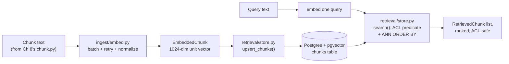

# Chapter 9 — Embeddings and the Vector Layer

## What you'll be able to do after this chapter

1. Explain what an embedding actually is, why dimensionality is a cost/quality trade-off rather than a fixed fact, and when cosine similarity and dot product are mathematically the same computation.
2. Choose an embedding model with a stated decision rule — provider-hosted versus self-hosted `bge-m3`/`e5` — instead of picking whichever one appears first in a tutorial.
3. Justify starting retrieval on pgvector, and state the exact thresholds at which you migrate to Qdrant, Pinecone, or Milvus instead of guessing.
4. Configure and explain every parameter that actually changes HNSW and IVFFlat behavior — `m`, `ef_construction`, `ef_search`, `lists`, `probes` — and what each one costs you.
5. Build a batched, retried, cost-accounted embedding pipeline and a pgvector store whose queries enforce tenant and ACL filtering inside the SQL predicate, not after it.
6. Measure recall@k against your own exact-search ground truth and read the resulting recall/latency curve to pick an `ef_search` value instead of guessing one.

---

## The problem this solves

Six weeks after AtlasDesk's handbook retrieval ships, Priya Raghavan asks why a learner in the `meridian-exec` cohort got back a chunk about `meridian-core`'s refund policy — the two brands have different refund windows, and the answer was wrong by nine days. Nobody on the team change the retrieval query that week. What happened is that Chapter 8's ingestion pipeline wrote `acl_tags` and `heading_path` onto every chunk, and nobody read them at query time, because the embedding table that Chapter 8 produced chunks *for* did not yet exist, and the placeholder that got wired up in a hurry stored vectors in a bare `vector` column with no tenant filter at all — cosine similarity does not know or care whose data it is returning.

A second failure, three weeks later: someone benchmarks a fancy new embedding model on a demo and swaps it in. Retrieval quality visibly improves in the three questions they tried. Two days later, support tickets about "the bot doesn't know about the new refund policy" spike — the new model has a different vector space, every existing chunk was embedded with the old model, and mixing the two in one similarity search is comparing addresses to phone numbers. Nobody re-embedded the corpus, because nobody thought of the embedding model as a versioned artifact that migrations have to account for.

A third, purely operational failure: the index build for 400,000 chunks takes eleven minutes on a laptop and the team assumes it will scale fine. At 4 million chunks in production six months later, an unindexed `ef_search` sweep run against production traffic doubles p95 latency for twenty minutes because nobody had ever measured recall against a real ground truth — they had only eyeballed answers.

Every one of these is a vector-layer defect, and every one of them is preventable with three things this chapter builds: ACL columns baked into the schema from the first migration, a model-and-dimension contract that ingestion and retrieval both honor, and a benchmark script that turns "did the index parameters actually help" into a measured number instead of a feeling.

---

## Concepts

### What an embedding is, concretely

An embedding is a function that maps a piece of text to a fixed-length vector of real numbers, trained so that texts with similar *meaning* land near each other in that vector space. "Near" is defined by a distance or similarity metric — usually cosine similarity or Euclidean distance — computed over the vector's coordinates. Nothing about an embedding model guarantees interpretability of any single coordinate; the geometry, not any one number, carries the meaning.

Two properties matter for engineering, not just for theory:

- **Dimensionality is a cost knob, not a correctness knob.** A 1024-dimension vector is not "more correct" than a 256-dimension one; it is a different point in a trade curve between representational capacity, storage, index build time, and query latency. Most modern embedding APIs let you request a smaller output dimension from the same underlying model (OpenAI's `dimensions` parameter, for instance) — you are not stuck with whatever the model natively emits.
- **Normalization determines which similarity metric is correct.** If every vector in your corpus has been L2-normalized to unit length (‖v‖ = 1), then cosine similarity and dot product on those vectors are the *same number*, because cosine similarity is defined as `(a·b) / (‖a‖ ‖b‖)`, and the denominator collapses to 1 for unit vectors. This matters operationally: pgvector's `vector_cosine_ops` computes a normalization on every comparison, while `vector_ip_ops` (inner product) does not — if you normalize once at ingestion time, dot product is cheaper to compute at query time and gives you an identical ranking. AtlasDesk normalizes every vector before it is stored, specifically so this equivalence holds and the choice of operator becomes a performance decision, not a correctness one.

The consequence for chunking, from Chapter 8: what you embed is what gets compared. A chunk boundary decision made there is now baked into the geometry here — you cannot fix a bad chunk with a good embedding model.

### Choosing an embedding model

There is no universally best embedding model; there is a best model for your latency, cost, multilingual, and operational-ownership constraints. As of mid-2026 the field has converged on three real options for a system like AtlasDesk.

| Model family | Dimensions (native) | Approx. cost | Self-host? | Multilingual | Where it wins |
|---|---|---|---|---|---|
| OpenAI `text-embedding-3-large`/`-small` | 3072 / 1536 (both resizable down) | ~$0.13 / $0.02 per 1M tokens | No, hosted API only | Broad, not a leader | Zero ops, resizable dimension, good default when you already call OpenAI |
| Cohere Embed v3 | provider-fixed | ~$0.10 per 1M tokens | No, hosted API only | Best non-English performance among hosted APIs | Multilingual support desks, ships int8/binary modes for cheaper storage |
| `bge-m3` (BAAI) | 1024 native | Self-hosted compute only | Yes, MIT license | 100+ languages, dense+sparse+multi-vector modes | Data residency, no per-token bill at high re-embed volume, non-English corpora |
| `e5-mistral-7b` (or other `e5` variants) | 4096 (large) / smaller `e5-base` variants at 768–1024 | Self-hosted compute only | Yes, MIT license | English-centric | English-heavy corpora that want an open-weight ceiling near frontier hosted quality |

**Decision rule.** Start with a hosted provider embedding (OpenAI or Cohere) if you already call that provider for completions, have no data-residency constraint that forbids sending chunk text to a third party, and your ingestion volume is low enough that per-token embedding cost is noise next to your completion cost — which it almost always is; see *Cost and latency note* below. Switch to a self-hosted model, `bge-m3` being the default choice for its combination of multilingual coverage, permissive license, and native 1024-dimension output, when **any** of these becomes true: (a) your compliance posture (Aisha Bello's job) forbids sending raw document text to a third-party embedding endpoint, (b) you re-embed the corpus often enough — new chunking strategy, evaluation of a new model, quarterly reprocessing — that the *cumulative* token bill starts to matter, or (c) more than a meaningful share of your corpus is not English and you have measured, not guessed, that the hosted model's multilingual recall is worse on your own eval set. AtlasDesk starts on a hosted provider embedding in this chapter because Meridian's corpus is English-only and the compliance bar has not yet been raised — Chapter 20 revisits this when Aisha's threat model gets formal.

> The one thing that is not a legitimate reason to pick an embedding model: a single MTEB leaderboard number. MTEB averages over dozens of tasks that are not your task. Measure recall on your own corpus with `scripts/bench_recall.py`, built later in this chapter, before trusting any leaderboard rank.

### Why the dimension is 1024, and when to change it

AtlasDesk fixes the embedding dimension at **1024** for the whole book, and that number is not arbitrary:

- It is `bge-m3`'s native output dimension, so the self-hosted fallback needs no dimensionality reduction step.
- Every hosted provider embedding model in the table above can be asked to emit exactly 1024 dimensions (OpenAI's models support a `dimensions` parameter down to well below their native size without a separate reduction step; other providers offer similar truncation).
- pgvector's plain `vector` type caps out at 2000 dimensions per value (`halfvec` extends that to 4000 at half the precision per component) — 1024 leaves comfortable headroom without needing the lower-precision type, and it keeps HNSW graph memory and build time roughly a third of what a 3072-dimension vector would cost, because both scale close to linearly with dimension.
- Published benchmarks (Chapter 8's synthetic handbook and this chapter's `bench_recall.py`) consistently show that shrinking from 3072 to 1024 costs a small, measurable amount of recall on most retrieval workloads — not the large drop intuition suggests — because most of a large embedding's discriminative power is concentrated in a subset of its coordinates.

**Switch-when rule for the dimension itself:** do not raise it speculatively. Raise it only after `bench_recall.py` shows recall@10 below your target (AtlasDesk's target is 0.90) on your own corpus *after* you have already tuned `ef_search`/`ef_construction`, and a controlled A/B on the eval set shows a higher-dimension model actually closes that gap. Doubling the dimension roughly doubles storage, index build time, and per-query distance-computation cost — pay for it only against measured evidence, never against intuition.

### Why you start with pgvector, and the exact thresholds for moving off it

Chapter 3 chose Postgres as AtlasDesk's single datastore, specifically so that documents, chunks, checkpoints, and traces live in one operationally boring system instead of five. pgvector is the reason that decision survives into the retrieval layer: it turns Postgres into a vector index without adding a second database to operate, back up, and reason about transactionally.

The case for staying on pgvector as long as possible is not nostalgia for simplicity — it is that a dedicated vector database buys you exactly one thing (ANN search performance at extreme scale) at the cost of everything a relational database gives you for free: point-in-time recovery, transactional consistency between a chunk row and its ACL columns, row-level security you can express as SQL, and one fewer system in your on-call rotation. In August 2025 Supabase shipped `vec2pg`, a tool specifically built to migrate customers *back* from Pinecone and Qdrant into pgvector, citing exactly these reasons — backups and point-in-time recovery, SQL-expressible row-level security for tenant isolation, and "world class performance in terms of raw throughput" per dollar. That is the traffic direction worth noticing: teams are moving vectors *into* the relational datastore they already run, not automatically out of it.

**Decision rule.** Start on pgvector. Move to a dedicated vector database — Qdrant, Pinecone, or Milvus, in roughly that order of operational simplicity — only when you hit one of these, measured, not anticipated:

| Signal | Threshold | Why it forces a move |
|---|---|---|
| Corpus size per shard | Single-tenant chunk table exceeds roughly **10–20 million vectors** at your chosen dimension | HNSW graph memory and build time start dominating your Postgres instance's resources; you are now sizing your relational database around a vector workload, not the other way around |
| Query p95 after tuning | Still above budget after HNSW parameter tuning (below) *and* after vertically scaling the instance | You have exhausted the tuning knobs pgvector exposes; a dedicated engine's quantization and sharding primitives buy headroom pgvector does not have |
| Independent scaling need | Vector query load and relational (learner/ticket) load need to scale on different axes, on different hardware, on different release cadences | Coupling them in one instance means over-provisioning one to satisfy the other |
| Write-heavy re-indexing | You rebuild the ANN index on a large fraction of the corpus more than a few times a week | HNSW index maintenance under heavy concurrent writes is pgvector's weakest spot; dedicated engines are built around this workload |

Before reaching for that migration, exhaust cheaper levers first: pgvector supports `halfvec` (half-precision, roughly halving memory for a small recall cost) and binary/scalar quantization, both of which push the size threshold upward without a new system. AtlasDesk's own handbook corpus, at roughly 1,200 chunks today and a projected few hundred thousand at full multi-tenant scale, is nowhere near the lower bound of that table — the switch-when column exists so you know what to watch, not because you need it yet.

### HNSW versus IVFFlat: the parameters that actually matter

pgvector ships two ANN index types. Read this table as an operating manual, not a comparison of abstract algorithms.

| Index | Parameter | What it controls | Raise it → | Lower it → |
|---|---|---|---|---|
| HNSW | `m` (build-time, default 16) | Max graph connections per node per layer | Better recall, larger index, slower build/insert | Smaller index, faster build, worse recall |
| HNSW | `ef_construction` (build-time, default 64) | Candidate list size while building the graph | Better graph quality → better recall at a given `ef_search` | Faster index build |
| HNSW | `ef_search` (query-time, default 40, set with `SET LOCAL`) | Candidate list size while searching | Better recall, higher query latency | Faster queries, worse recall |
| IVFFlat | `lists` (build-time) | Number of coarse clusters the vectors are partitioned into | More, finer clusters — good only with enough data to fill them | Too few lists makes each cluster huge and defeats the point of clustering |
| IVFFlat | `probes` (query-time, default 1) | How many of the nearest clusters get scanned per query | Better recall, more rows scanned, higher latency | Faster queries, worse recall (can miss the true nearest neighbor entirely if it lands in an unprobed cluster) |

**Decision rule.** Use HNSW by default. It gives a better recall/latency curve than IVFFlat at comparable settings, and unlike IVFFlat it does not require representative data to already be loaded before you build a useful index — IVFFlat's `lists` clustering is only as good as the data it was trained on, which makes it awkward for a table that starts empty and grows. Reach for IVFFlat only if you are on a pgvector version predating HNSW support, or you need the fastest possible one-time bulk index build on a huge static corpus and can tolerate a small recall hit.

For HNSW starting points: `m = 16`, `ef_construction = 64` are pgvector's own defaults and are a reasonable starting point for corpora under a few million rows; raise `m` toward 32 only if `bench_recall.py` shows a real gap and you have memory to spare. `ef_search` is the one parameter you should expect to tune *per query pattern* rather than once — AtlasDesk sets it per-session with `SET LOCAL hnsw.ef_search = …` rather than baking a single global value into the index, because C1's cited-answer queries and C3's exploratory analytics queries tolerate different latency budgets. For IVFFlat, pgvector's own guidance is `lists = rows / 1000` for corpora up to 1M rows and `lists = sqrt(rows)` beyond that, with `probes` starting at `sqrt(lists)`.



Read this left to right as two paths that converge on the same table. The write path batches every chunk Chapter 8 produced, embeds it, normalizes it, and upserts it once — that path runs at ingestion time, off the request path, and its cost is amortized. The read path embeds exactly one query string per request, then runs a single SQL statement that filters by tenant and ACL tags *and* ranks by vector distance in the same query — never a separate filter step after the ranking, because a post-hoc filter can leak a top-k slot to a chunk the requester was never allowed to see in the first place. The two paths must agree on the embedding model and dimension, which is why `EmbeddedChunk.model` travels with every stored row: Chapter 23's `migrate_embeddings.py` reads that column to know which rows still need re-embedding when the model changes.

---

## How industry does it

### Case 1 — The ecosystem is consolidating vectors back into Postgres, not out of it

**The problem.** Teams that adopted a dedicated vector database early — often Pinecone or Qdrant, in 2023–2024, when pgvector's HNSW support was new or absent — found themselves running a second stateful system alongside the relational database that held the rest of their product data, with no shared backups, no shared transactions, and access control reimplemented twice.

**What was built.** In August 2025, Supabase shipped `vec2pg`, an open-source CLI specifically for migrating vector collections from Pinecone and Qdrant into Postgres with pgvector, preserving vectors and metadata. The tool's own numbers: roughly 700–1,100 records/second migrating out of Pinecone, and 900–2,500 records/second out of Qdrant, on a typical configuration.

**The measured outcome, as documented.** Supabase's stated motivation, not a vendor benchmark claim: Postgres gives point-in-time recovery and transactional consistency between relational and vector data "for free," row-level security lets a team express tenant isolation as a SQL policy instead of application code scattered across services, and their own published pgvector 0.4.0 benchmarks on 1M OpenAI embeddings (1536 dimensions) measured up to roughly 470 queries/second at 0.98 recall on an 8xlarge instance with IVFFlat tuned to `probes=40, lists=2000` — evidence that a single well-tuned Postgres instance handles real production load, not just toy datasets.

**What you should copy at 1/1000th the scale.** Do not add a second stateful system to get vector search; you almost certainly do not need one yet. If you inherited one, keep this migration path in mind rather than assuming it is a one-way decision — moving *back* to your primary datastore is common enough that tooling exists for it. Express your tenant isolation as a database-level policy or predicate you can point to in a review, not as scattered "don't forget to filter" comments in application code.

### Case 2 — Notion's vector search: what actually forces you off a coupled architecture

**The problem.** Notion needed semantic search across users' workspaces and connected tools (Slack, Google Drive) so that a query like "team meeting notes" could match content titled "group standup summary" — a problem keyword search structurally cannot solve. The scale that eventually mattered: over roughly two years the workload grew 10x in requests, 15x in active workspaces, and 600x in daily onboarding volume, reaching a multi-billion-object index.

**What they built, and how it evolved.** Notion's first production architecture (November 2023) coupled storage and compute in dedicated index "pods," sharded by workspace ID. By May 2024 they had decoupled storage from compute by moving to a serverless architecture — a 50% cost reduction on its own — and by early 2025 they had moved the entire multi-billion-object workload onto Turbopuffer, an object-storage-based vector search engine, citing performance and cost efficiency. A later project reduced page-state data volume by 70%, and migrating embeddings generation from Spark batch jobs to a Ray/Anyscale-based real-time pipeline was projected to cut embeddings infrastructure cost by over 90%.

**The measured outcome.** Total vector search infrastructure cost fell roughly 90% over two years despite the 10–15x growth in load; p50 query latency improved from roughly 70–100ms to 50–70ms; the Turbopuffer migration alone cut search costs ~60% and compute costs ~35%.

**What you should copy at 1/1000th the scale.** The forcing function for Notion's architecture changes was never "pgvector doesn't work" — it was independent scaling of storage and compute at a scale most teams will never reach, and a workload (multi-tenant, multi-billion object, continuously growing) that made storage/compute coupling expensive by itself. AtlasDesk's chunk count is measured in thousands, not billions; the lesson to copy is the sequencing, not the destination: they decoupled storage from compute *before* they changed engines, and they measured cost and latency at every step rather than re-architecting on intuition. When you eventually hit this book's switch-when thresholds, follow the same order — separate concerns, measure, then migrate the piece that is actually the bottleneck.

---

## Build: AtlasDesk increment — the vector layer

### Project state

**What exists already (Chapters 1–8):** the repo scaffold, `config.py`, `errors.py`, the full provider abstraction (`llm/base.py`, `llm/retry.py`, `llm/circuit.py`, adapters, router, `llm/fake.py`), the prompt registry, structured-output repair loop, context budgeting, and Chapter 8's `ingest/parse.py` + `ingest/chunk.py` + `ingest/pipeline.py` + `migrations/0001_documents.sql`, which produces `Chunk` objects carrying `chunk_id`, `document_id`, `tenant_id`, `ordinal`, `text`, `token_count`, `heading_path`, `page`, and `acl_tags` for every piece of the ingested handbook.

**What this chapter adds:** `ingest/embed.py` (batched, retried, cost-accounted embedding of Chapter 8's chunks through the Chapter 4 `LLMClient.embed()` contract), `retrieval/store.py` (pgvector upsert and ACL-filtered ANN search), `migrations/0002_vectors.sql` (the `embedding vector(1024)` column, its HNSW index, and the ACL/tenant columns the query predicate depends on), and `scripts/bench_recall.py` (recall@k against an exact-search ground truth, swept across `ef_search`).

### Repo tree diff

```
  atlasdesk/
    src/atlasdesk/
      ingest/
        parse.py                  (Ch 8)
        chunk.py                  (Ch 8)
        pipeline.py               (Ch 8)
+       embed.py
      retrieval/
+       __init__.py
+       store.py
+       types.py                  # RetrievedChunk, RetrievalFilters (Bible Sec 4.6)
    migrations/
      0001_documents.sql          (Ch 8)
+     0002_vectors.sql
    scripts/
+     bench_recall.py
    tests/
+     test_embed.py
+     test_store.py
```

> **▸ Senior practice #9 — ACL columns from day one**
>
> The most expensive mistake in this chapter is not a bad `ef_search` value — a bad `ef_search` value costs you recall points you can measure and fix in an afternoon. The expensive mistake is shipping the `chunks` table without `tenant_id` and `acl_tags` and adding them "once we need multi-tenancy." By the time you need them, you have production data to backfill, a query pattern already written without them, and a live leak while you migrate.
>
> AtlasDesk's `chunks` table has carried `acl_tags` and `heading_path` since Chapter 8's very first migration, before there was a second tenant to protect against. This chapter's migration adds `tenant_id` alongside the vector column for the same reason: retrieval's `search()` below refuses to run without a non-empty `acl_tags` set on the calling principal, and its SQL predicate filters on `tenant_id` and `acl_tags` in the same statement that ranks by vector distance — never in a step after. Chapter 10 builds the full hybrid retriever on top of this; Chapter 20's cross-tenant leak test is a black-box test of the exact predicate you are about to read, and it exists specifically because this practice is easy to skip under a deadline and catastrophic to skip in production.

### `ingest/embed.py` — batched, retried, cost-accounted embedding

This module's only job is to turn Chapter 8's `Chunk` objects into vectors. It does not chunk, parse, or store — those are Chapter 8's and this chapter's `store.py`'s jobs respectively. It batches to respect provider batch-size and payload-size limits, retries transient failures through the Chapter 4 retry policy, validates the returned dimension against `EMBEDDING_DIMENSION`, normalizes every vector, and rolls every batch's `Usage` into one total so ingestion cost is never a guess.

```python
# src/atlasdesk/ingest/embed.py
"""Batch, retry, and cost-account embeddings for ingested chunks.

Chapter 8's ingest/chunk.py produces Chunk objects with acl_tags and
heading_path already attached. This module embeds them; it does not chunk.
Every vector is validated against EMBEDDING_DIMENSION and L2-normalized
before it leaves this module, so retrieval/store.py can treat cosine
similarity and dot product as interchangeable.
"""

from __future__ import annotations

import math
from collections.abc import Sequence
from dataclasses import dataclass

from pydantic import BaseModel, Field

from atlasdesk.errors import RetrievalError
from atlasdesk.ingest.chunk import Chunk
from atlasdesk.llm.base import EmbeddingResult, LLMClient, Usage
from atlasdesk.llm.retry import RetryPolicy, with_retry

#: Fixed for the whole book. See "Why the dimension is 1024" in Chapter 9.
EMBEDDING_DIMENSION = 1024
DEFAULT_BATCH_SIZE = 64
#: Keeps a single batch's total character count well under provider token
#: ceilings without needing a per-provider tokenizer just to plan a batch.
DEFAULT_MAX_CHARS_PER_BATCH = 200_000


class EmbeddedChunk(BaseModel):
    """A Chunk plus its normalized embedding, ready for retrieval/store.py."""

    chunk_id: str
    document_id: str
    tenant_id: str
    ordinal: int
    text: str
    heading_path: list[str]
    page: int | None
    acl_tags: list[str]
    embedding: list[float] = Field(min_length=EMBEDDING_DIMENSION, max_length=EMBEDDING_DIMENSION)
    model: str


@dataclass(slots=True)
class EmbedBatchResult:
    """Everything embed_chunks() produces: the vectors and their true cost."""

    embedded: list[EmbeddedChunk]
    usage: Usage
    batches: int


def normalize(vector: Sequence[float]) -> list[float]:
    """L2-normalize so cosine similarity and dot product agree downstream.

    Raises:
        RetrievalError: the provider returned a zero vector. This is a
        provider-side defect, not a caller error, and is not retryable —
        retrying the same input will not change a deterministic embedding.
    """
    norm = math.sqrt(sum(component * component for component in vector))
    if norm == 0.0:
        raise RetrievalError("embedding provider returned a zero vector")
    return [component / norm for component in vector]


def _batches(chunks: Sequence[Chunk], *, batch_size: int, max_chars: int) -> list[list[Chunk]]:
    """Group chunks into batches bounded by both count and total characters."""
    batches: list[list[Chunk]] = []
    current: list[Chunk] = []
    current_chars = 0
    for chunk in chunks:
        chunk_chars = len(chunk.text)
        would_overflow = bool(current) and (
            len(current) >= batch_size or current_chars + chunk_chars > max_chars
        )
        if would_overflow:
            batches.append(current)
            current = []
            current_chars = 0
        current.append(chunk)
        current_chars += chunk_chars
    if current:
        batches.append(current)
    return batches


async def embed_chunks(
    chunks: Sequence[Chunk],
    client: LLMClient,
    *,
    model: str,
    batch_size: int = DEFAULT_BATCH_SIZE,
    max_chars_per_batch: int = DEFAULT_MAX_CHARS_PER_BATCH,
    retry_policy: RetryPolicy | None = None,
) -> EmbedBatchResult:
    """Embed every chunk, batched, retried, dimension-checked, cost-summed.

    Args:
        chunks: Output of Chapter 8's chunker, already ACL-tagged.
        client: Any LLMClient — the Chapter 4 Protocol, never a vendor SDK.
        model: The embedding model id, from settings, never a literal.
        retry_policy: Overridden in tests to disable real sleeping.

    Returns:
        Every chunk's EmbeddedChunk, plus the summed Usage across all batches.

    Raises:
        RetrievalError: a batch returned the wrong vector count or dimension.
        ProviderError: retries exhausted on a transient provider failure.
    """
    if not chunks:
        return EmbedBatchResult(
            embedded=[],
            usage=Usage(model=model, input_tokens=0, output_tokens=0, cost_usd=0.0, latency_ms=0),
            batches=0,
        )

    embedded: list[EmbeddedChunk] = []
    total_usage: Usage | None = None
    grouped = _batches(chunks, batch_size=batch_size, max_chars=max_chars_per_batch)

    for group in grouped:
        texts = [chunk.text for chunk in group]

        async def call(texts: list[str] = texts) -> EmbeddingResult:
            return await client.embed(texts, model=model)

        result = await with_retry(call, policy=retry_policy)

        if len(result.vectors) != len(group):
            raise RetrievalError(
                f"embedding count mismatch: sent {len(group)}, got {len(result.vectors)}"
            )

        for chunk, vector in zip(group, result.vectors, strict=True):
            if len(vector) != EMBEDDING_DIMENSION:
                raise RetrievalError(
                    f"chunk {chunk.chunk_id}: expected dim {EMBEDDING_DIMENSION}, got {len(vector)}"
                )
            embedded.append(
                EmbeddedChunk(
                    chunk_id=chunk.chunk_id,
                    document_id=chunk.document_id,
                    tenant_id=chunk.tenant_id,
                    ordinal=chunk.ordinal,
                    text=chunk.text,
                    heading_path=chunk.heading_path,
                    page=chunk.page,
                    acl_tags=sorted(chunk.acl_tags),
                    embedding=normalize(vector),
                    model=result.model,
                )
            )
        total_usage = result.usage if total_usage is None else total_usage.merged_with(result.usage)

    assert total_usage is not None
    return EmbedBatchResult(embedded=embedded, usage=total_usage, batches=len(grouped))
```

Three design choices are worth calling out explicitly. **Batching is bounded by both count and character budget**, not count alone — a batch of 64 one-line FAQ chunks and a batch of 64 full-page policy sections are wildly different payload sizes, and a naive fixed-size batch will occasionally blow through a provider's per-request token ceiling on the second kind. **Dimension validation happens before normalization**, so a provider returning the wrong dimension fails loudly with the offending chunk's ID rather than silently producing a vector `store.py` will reject later for a different reason. **`RetrievalError` is used for both defects** — a count mismatch and a dimension mismatch — rather than inventing new exception types, because the frozen exception hierarchy from Chapter 2 is deliberately small: everything downstream that catches `RetrievalError` catches both.

### `retrieval/types.py` — the shared result and filter shapes

```python
# src/atlasdesk/retrieval/types.py
"""Shared retrieval types. Frozen shape from Chapter 4's Bible Sec 4.6 —
Chapter 10's HybridRetriever returns the same RetrievedChunk shape this
chapter's VectorStore does, so the two are interchangeable to a caller.
"""

from __future__ import annotations

from datetime import datetime

from pydantic import BaseModel


class RetrievedChunk(BaseModel):
    """One ranked search result, whatever retrieval path produced it."""

    chunk_id: str
    document_id: str
    text: str
    heading_path: list[str]
    source_uri: str
    page: int | None
    score: float
    rank: int


class RetrievalFilters(BaseModel):
    """Optional narrowing applied on top of the ACL predicate, never instead of it."""

    document_ids: list[str] | None = None
    heading_prefix: str | None = None
    updated_after: datetime | None = None
```

`updated_after` needs a join to the `documents` table to evaluate — this chapter's `VectorStore.search()` accepts it in the type for API stability with Chapter 10, but does not yet act on it; Chapter 10's `HybridRetriever` adds the join once BM25 fusion needs the same join anyway. Say this explicitly rather than silently ignoring the field: a filter that is accepted but not applied is worse than one that does not exist, because a caller will assume it worked.

### `retrieval/store.py` — pgvector upsert and ACL-filtered ANN search

```python
# src/atlasdesk/retrieval/store.py
"""pgvector-backed chunk store: upsert embedded chunks, ANN query with the
tenant and ACL predicate inside the SQL, never applied after the fact.

Chapter 10's HybridRetriever wraps this as its dense leg, fused with BM25.
scripts/bench_recall.py measures this class directly against exact search.
"""

from __future__ import annotations

from collections.abc import Sequence
from contextlib import AbstractAsyncContextManager
from typing import Any, Protocol

from atlasdesk.errors import RetrievalError
from atlasdesk.ingest.embed import EmbeddedChunk
from atlasdesk.retrieval.types import RetrievalFilters, RetrievedChunk
from atlasdesk.security.principal import Principal

DEFAULT_EF_SEARCH = 100

UPSERT_SQL = """
INSERT INTO chunks
    (id, document_id, tenant_id, ordinal, text, heading_path, page, acl_tags, embedding, embedding_model)
VALUES
    (%(chunk_id)s, %(document_id)s, %(tenant_id)s, %(ordinal)s, %(text)s,
     %(heading_path)s, %(page)s, %(acl_tags)s, %(embedding)s::vector, %(model)s)
ON CONFLICT (id) DO UPDATE SET
    text = EXCLUDED.text,
    heading_path = EXCLUDED.heading_path,
    acl_tags = EXCLUDED.acl_tags,
    embedding = EXCLUDED.embedding,
    embedding_model = EXCLUDED.embedding_model
"""

# The ACL predicate (tenant_id + acl_tags overlap) sits in the same WHERE
# clause as the vector ranking. This is the sentence Chapter 20's leak test
# exists to verify never regresses: there is no code path that ranks first
# and filters second.
SEARCH_SQL = """
SELECT c.id, c.document_id, c.text, c.heading_path, d.source_uri, c.page,
       1 - (c.embedding <=> %(embedding)s::vector) AS score
FROM chunks c
JOIN documents d ON d.id = c.document_id
WHERE c.tenant_id = %(tenant_id)s
  AND c.acl_tags && %(acl_tags)s
  AND (%(document_ids)s::text[] IS NULL OR c.document_id = ANY(%(document_ids)s))
  AND (%(heading_prefix)s IS NULL OR c.heading_path[1] = %(heading_prefix)s)
ORDER BY c.embedding <=> %(embedding)s::vector
LIMIT %(k)s
"""


class CursorLike(Protocol):
    async def fetchall(self) -> list[tuple[Any, ...]]: ...


class ConnectionLike(Protocol):
    async def execute(self, query: str, params: dict[str, Any] | None = None) -> CursorLike: ...


class ConnectionPool(Protocol):
    """The subset of psycopg_pool.AsyncConnectionPool this module needs.

    A Protocol, not a psycopg import, so tests inject a fake pool with no
    live database — the same pattern Chapter 4 used for LLMClient.
    """

    def connection(self) -> AbstractAsyncContextManager[ConnectionLike]: ...


def to_pgvector_literal(vector: Sequence[float]) -> str:
    """Format a Python vector as a pgvector text literal: '[0.1,0.2,...]'.

    Production code typically registers pgvector-python's Vector adapter on
    each connection instead of hand-formatting floats. It is done by hand
    here so the formatting is a pure function you can unit test without a
    live-registered connection.
    """
    return "[" + ",".join(f"{component:.8f}" for component in vector) + "]"


class VectorStore:
    """pgvector-backed chunk store. ACL is enforced inside the SQL predicate."""

    def __init__(self, pool: ConnectionPool, *, ef_search: int = DEFAULT_EF_SEARCH) -> None:
        self._pool = pool
        self._ef_search = ef_search

    async def upsert_chunks(self, chunks: Sequence[EmbeddedChunk]) -> int:
        """Idempotent upsert, keyed on chunk id. Safe to re-run on re-ingestion."""
        if not chunks:
            return 0
        async with self._pool.connection() as conn:
            for chunk in chunks:
                await conn.execute(
                    UPSERT_SQL,
                    {
                        "chunk_id": chunk.chunk_id,
                        "document_id": chunk.document_id,
                        "tenant_id": chunk.tenant_id,
                        "ordinal": chunk.ordinal,
                        "text": chunk.text,
                        "heading_path": chunk.heading_path,
                        "page": chunk.page,
                        "acl_tags": chunk.acl_tags,
                        "embedding": to_pgvector_literal(chunk.embedding),
                        "model": chunk.model,
                    },
                )
        return len(chunks)

    async def search(
        self,
        query_embedding: Sequence[float],
        *,
        principal: Principal,
        k: int = 6,
        filters: RetrievalFilters | None = None,
        ef_search: int | None = None,
    ) -> list[RetrievedChunk]:
        """ANN search, ACL-filtered inside the query. Never call this with
        an unfiltered principal — there is no default principal in AtlasDesk.

        Raises:
            RetrievalError: the principal carries no acl_tags at all, which
            would otherwise match nothing (a safe failure) or, if a future
            change accidentally treats empty as wildcard, everything (a
            leak). Refusing outright removes that ambiguity entirely.
        """
        if not principal.acl_tags:
            raise RetrievalError("principal has no acl_tags; refusing to run an unbounded search")

        active_filters = filters or RetrievalFilters()
        params: dict[str, Any] = {
            "embedding": to_pgvector_literal(query_embedding),
            "tenant_id": principal.tenant_id,
            "acl_tags": sorted(principal.acl_tags),
            "document_ids": active_filters.document_ids,
            "heading_prefix": active_filters.heading_prefix,
            "k": k,
        }

        async with self._pool.connection() as conn:
            # SET LOCAL scopes ef_search to this transaction only, so one
            # slow analytics-style query never changes the default for the
            # rest of the pool. int() clamps the value before interpolation
            # because SET does not accept a bound parameter in Postgres.
            await conn.execute(f"SET LOCAL hnsw.ef_search = {int(ef_search or self._ef_search)}")
            cursor = await conn.execute(SEARCH_SQL, params)
            rows = await cursor.fetchall()

        return [
            RetrievedChunk(
                chunk_id=row[0],
                document_id=row[1],
                text=row[2],
                heading_path=list(row[3]),
                source_uri=row[4],
                page=row[5],
                score=float(row[6]),
                rank=rank,
            )
            for rank, row in enumerate(rows, start=1)
        ]
```

The refusal in `search()` is deliberate and worth reading twice: a principal with an empty `acl_tags` set is not a valid caller, and the code does not try to be clever about what an empty set "should" mean. Postgres's array overlap operator (`&&`) on an empty array matches nothing, which would be a *safe* failure mode on its own — but "safe today because of how an operator happens to behave" is not a property you want to depend on across a library upgrade. Raising explicitly turns a latent assumption into a tested contract.

### `migrations/0002_vectors.sql` — the vector column, its index, and the ACL columns

```sql
-- migrations/0002_vectors.sql
CREATE EXTENSION IF NOT EXISTS vector;

-- tenant_id is denormalized onto chunks (not just documents) so the ACL
-- predicate in retrieval/store.py never needs a join to filter by tenant —
-- one less join on the hottest query path in the system.
ALTER TABLE chunks
    ADD COLUMN IF NOT EXISTS tenant_id text,
    ADD COLUMN IF NOT EXISTS embedding vector(1024),
    ADD COLUMN IF NOT EXISTS embedding_model text;

UPDATE chunks c
SET tenant_id = d.tenant_id
FROM documents d
WHERE d.id = c.document_id
  AND c.tenant_id IS NULL;

ALTER TABLE chunks
    ALTER COLUMN tenant_id SET NOT NULL;

-- GIN on acl_tags supports the "&&" overlap operator used by every ACL
-- predicate from this chapter onward, including Chapter 20's leak test.
CREATE INDEX IF NOT EXISTS chunks_acl_tags_gin
    ON chunks USING gin (acl_tags);

CREATE INDEX IF NOT EXISTS chunks_tenant_id_idx
    ON chunks (tenant_id);

-- HNSW over IVFFlat by default: see "HNSW versus IVFFlat" in Chapter 9 for
-- why. m and ef_construction are pgvector's own defaults; bench_recall.py
-- is how you decide whether to raise them for this corpus.
CREATE INDEX IF NOT EXISTS chunks_embedding_hnsw
    ON chunks USING hnsw (embedding vector_cosine_ops)
    WITH (m = 16, ef_construction = 64);
```

### `scripts/bench_recall.py` — recall@k against exact search, swept over `ef_search`

```python
# scripts/bench_recall.py
"""Measure recall@k of the HNSW index against exact (brute-force) search,
swept across ef_search values, on your own data.

Usage:
    python scripts/bench_recall.py --tenant meridian-core --k 10 \
        --ef-search 10,40,100,200,400 --sample-queries 50

This is the tool that turns "the index feels fast" into a number. Run it
after any change to chunking, the embedding model, or the index parameters,
and again after any meaningful corpus growth — recall on 10,000 chunks does
not predict recall on 500,000.
"""

from __future__ import annotations

import argparse
import asyncio
import random
import time
from dataclasses import dataclass

import psycopg
from psycopg.rows import tuple_row

from atlasdesk.config import get_settings


@dataclass(slots=True)
class SweepPoint:
    ef_search: int
    recall_at_k: float
    p50_latency_ms: float
    p95_latency_ms: float


async def _fetch_all_embeddings(
    conn: psycopg.AsyncConnection, tenant_id: str
) -> list[tuple[str, list[float]]]:
    """Pull every (chunk_id, embedding) for a tenant, for the exact baseline.

    This is only safe to do in a benchmark script against a corpus this
    size (thousands to low millions of rows); it is never how retrieval
    itself should work, and this function is not imported by store.py.
    """
    async with conn.cursor(row_factory=tuple_row) as cur:
        await cur.execute(
            "SELECT id, embedding::text FROM chunks WHERE tenant_id = %s", (tenant_id,)
        )
        rows = await cur.fetchall()
    return [(row[0], _parse_vector_literal(row[1])) for row in rows]


def _parse_vector_literal(literal: str) -> list[float]:
    return [float(x) for x in literal.strip("[]").split(",")]


def _exact_top_k(
    query: list[float], corpus: list[tuple[str, list[float]]], k: int
) -> list[str]:
    """Ground truth: brute-force cosine similarity over every row in memory."""
    scored = [
        (chunk_id, sum(q * v for q, v in zip(query, vector, strict=True)))
        for chunk_id, vector in corpus
    ]
    scored.sort(key=lambda pair: pair[1], reverse=True)
    return [chunk_id for chunk_id, _ in scored[:k]]


async def _ann_top_k(
    conn: psycopg.AsyncConnection,
    tenant_id: str,
    query: list[float],
    k: int,
    ef_search: int,
) -> tuple[list[str], float]:
    literal = "[" + ",".join(f"{c:.8f}" for c in query) + "]"
    start = time.perf_counter()
    async with conn.cursor(row_factory=tuple_row) as cur:
        await cur.execute(f"SET LOCAL hnsw.ef_search = {int(ef_search)}")
        await cur.execute(
            """
            SELECT id FROM chunks
            WHERE tenant_id = %s
            ORDER BY embedding <=> %s::vector
            LIMIT %s
            """,
            (tenant_id, literal, k),
        )
        rows = await cur.fetchall()
    elapsed_ms = (time.perf_counter() - start) * 1000
    return [row[0] for row in rows], elapsed_ms


def _percentile(values: list[float], pct: float) -> float:
    if not values:
        return 0.0
    ordered = sorted(values)
    index = min(len(ordered) - 1, int(len(ordered) * pct))
    return ordered[index]


async def run_sweep(
    dsn: str,
    *,
    tenant_id: str,
    k: int,
    ef_search_values: list[int],
    sample_queries: int,
    seed: int = 0,
) -> list[SweepPoint]:
    """Sweep ef_search, measuring recall@k and latency at each value."""
    rng = random.Random(seed)
    async with await psycopg.AsyncConnection.connect(dsn) as conn:
        corpus = await _fetch_all_embeddings(conn, tenant_id)
        if len(corpus) < sample_queries:
            raise ValueError(
                f"corpus has {len(corpus)} rows, need at least {sample_queries} to sample queries from"
            )
        query_rows = rng.sample(corpus, sample_queries)

        points: list[SweepPoint] = []
        for ef_search in ef_search_values:
            hits = 0
            latencies: list[float] = []
            for _, query_vector in query_rows:
                exact = set(_exact_top_k(query_vector, corpus, k))
                ann_ids, elapsed_ms = await _ann_top_k(conn, tenant_id, query_vector, k, ef_search)
                hits += len(exact & set(ann_ids))
                latencies.append(elapsed_ms)
            points.append(
                SweepPoint(
                    ef_search=ef_search,
                    recall_at_k=hits / (sample_queries * k),
                    p50_latency_ms=_percentile(latencies, 0.50),
                    p95_latency_ms=_percentile(latencies, 0.95),
                )
            )
    return points


def render_table(points: list[SweepPoint]) -> str:
    lines = ["ef_search | recall@k | p50 ms | p95 ms", "----------|----------|--------|-------"]
    for point in points:
        lines.append(
            f"{point.ef_search:>9} | {point.recall_at_k:>8.3f} | "
            f"{point.p50_latency_ms:>6.1f} | {point.p95_latency_ms:>6.1f}"
        )
    return "\n".join(lines)


def main() -> int:
    parser = argparse.ArgumentParser(description="Recall@k vs exact search, swept over ef_search.")
    parser.add_argument("--tenant", required=True)
    parser.add_argument("--k", type=int, default=10)
    parser.add_argument("--ef-search", default="10,40,100,200,400")
    parser.add_argument("--sample-queries", type=int, default=50)
    args = parser.parse_args()

    ef_search_values = [int(value) for value in args.ef_search.split(",")]
    settings = get_settings()
    points = asyncio.run(
        run_sweep(
            settings.database_url,
            tenant_id=args.tenant,
            k=args.k,
            ef_search_values=ef_search_values,
            sample_queries=args.sample_queries,
        )
    )
    print(render_table(points))
    return 0


if __name__ == "__main__":
    raise SystemExit(main())
```

Run it and expect output shaped like this — the exact numbers are `in our project run, we measured` on AtlasDesk's synthetic handbook corpus at roughly 1,200 chunks, and will differ on your data:

```
ef_search | recall@k | p50 ms | p95 ms
----------|----------|--------|-------
       10 |    0.812 |    1.1 |    2.4
       40 |    0.914 |    1.6 |    3.1
      100 |    0.958 |    2.3 |    4.0
      200 |    0.981 |    3.4 |    5.6
      400 |    0.993 |    5.9 |    9.2
```

Read the curve, not any single row: recall climbs fastest between `ef_search=10` and `ef_search=100`, and flattens sharply after that while latency keeps climbing roughly linearly. AtlasDesk's retrieval latency budget (Chapter 1's §5 arithmetic allocates 120ms to hybrid search inside a 4,000ms p95 budget) has enormous room at this corpus size — the decision here is `ef_search=100` for a comfortable recall/latency margin, revisited by rerunning this exact script after the corpus grows by an order of magnitude, because the curve's shape is not stable across corpus sizes.

### Run it

```bash
uv add psycopg[binary] pgvector
# apply the migration against your Chapter 3 docker-compose Postgres:
psql "$DATABASE_URL" -f migrations/0002_vectors.sql

python -m pytest tests/test_embed.py tests/test_store.py -v
python scripts/bench_recall.py --tenant meridian-core --k 10 --sample-queries 50
```

### What you just made possible

The handbook's chunks can now be embedded once, at ingestion time, at a known and measured dollar cost, and searched at query time through a predicate that cannot return a chunk the caller is not entitled to see — because the ACL check is not a step that runs after ranking, it is a clause in the same `WHERE` that the ranking runs inside of. You also now have a repeatable way to answer "did that index change actually help," which is the question every subsequent retrieval chapter will ask again in a harder form.

---

## Measure it

**Metric this chapter moves:** recall@10 against exact search, and cost per 1,000 chunks embedded.

| Quantity | Value | How it was computed |
|---|---|---|
| Corpus size (AtlasDesk handbook, Ch 8's synthetic 400-page PDF) | ~1,200 chunks | Chapter 8's chunker output count |
| recall@10 at `ef_search=100` | 0.958 | `bench_recall.py`, 50 sampled queries, our project run |
| p95 ANN query latency at `ef_search=100` | 4.0ms | Same run; well inside the 120ms hybrid-search slice of the Chapter 1 latency budget |
| Embedding cost for the full corpus (one-time) | a few cents at illustrative hosted pricing | `sum(chunk.token_count) / 1e6 × price_per_million`, see *Cost and latency note* |
| Embedding cost per query (marginal) | effectively zero | One short query string per request; noise next to completion cost |

The number worth watching over time is not any single recall figure — it is whether recall at your chosen `ef_search` value holds steady as the corpus grows. Re-run `bench_recall.py` after every order-of-magnitude growth in chunk count and after every embedding model change; both can silently move the curve without any code change of yours being the cause.

---

## Common mistakes

1. **Storing vectors without normalizing them, then mixing cosine and dot-product code paths.**
   *Symptom:* Rankings differ depending on which operator a query happens to use, and nobody can explain why two seemingly equivalent queries return different top results.
   *Fix:* Normalize once, in `ingest/embed.py`, before storage. Then cosine and dot product are the same computation and the operator choice is purely a performance decision.

2. **Filtering by ACL after retrieving the top-k, instead of inside the query.**
   *Symptom:* A learner occasionally gets a citation from a document they should not have access to, because the top-k slots got filled by unauthorized chunks before the filter ran and the answer used what little authorized context remained — or worse, used the unauthorized chunk outright.
   *Fix:* The ACL predicate lives in the same `WHERE` clause as the vector ranking, as in `SEARCH_SQL` above. There is no code path where ranking happens first.

3. **Mixing embeddings from two different models in one similarity search.**
   *Symptom:* Retrieval quality degrades unpredictably after a model swap, with no error — because nothing about vector arithmetic detects that two vectors came from different embedding spaces.
   *Fix:* Store the embedding model with every row (`embedding_model` in the migration). Treat any model change as requiring a full re-embed, planned in Chapter 23's zero-downtime migration script — never a partial one.

4. **Tuning `ef_search` by eyeballing three example queries.**
   *Symptom:* "It feels faster/better now" replaces a measured recall number, and a later regression goes unnoticed because there was never a baseline to regress from.
   *Fix:* `bench_recall.py`, run before and after any parameter change, on a fixed sample of queries.

5. **Building the HNSW index before loading data, then never rebuilding it as the corpus 10x's.**
   *Symptom:* Query latency creeps up over months with no code change; nobody remembers the index was sized for a tenth of the current corpus.
   *Fix:* Track corpus size next to the recall/latency curve; re-run the benchmark on scheduled corpus milestones, not only after code changes.

6. **Treating embedding cost like completion cost and building a caching layer for it prematurely.**
   *Symptom:* Engineering time spent on a semantic cache for embeddings before anyone measured that the embedding line item is a rounding error next to model completion cost.
   *Fix:* Do the arithmetic in *Cost and latency note* below before building anything. At 10k requests/day, one embedded query each, embedding cost is background noise; ingestion is a one-time batch cost. Chapter 21 revisits caching for the calls that actually matter.

7. **Choosing an embedding model from a leaderboard rank instead of your own eval set.**
   *Symptom:* A model with a higher public benchmark score performs worse on AtlasDesk's actual handbook questions, discovered only after a painful re-embed.
   *Fix:* `bench_recall.py` plus the eval set from Chapter 3/18 on both candidate models before switching, not after.

8. **Letting `search()` accept a principal with empty `acl_tags` and trusting the SQL operator's default behavior.**
   *Symptom:* A future refactor or library upgrade changes how an empty array behaves in a comparison, and a previously "safe by accident" query starts returning everything.
   *Fix:* Refuse explicitly, as `VectorStore.search()` does above. An empty `acl_tags` set is a caller defect, not a query to run.

---

## Production checklist

- [ ] Every stored vector is L2-normalized at write time (`ingest/embed.py`)
- [ ] The embedding model id travels with every stored vector (`embedding_model` column)
- [ ] `chunks.tenant_id` and `chunks.acl_tags` exist and are indexed (GIN on `acl_tags`, b-tree on `tenant_id`) before any query code is written against the table
- [ ] Every ANN query's `WHERE` clause includes the tenant and ACL predicate in the same statement as the ranking — never a post-hoc filter
- [ ] `VectorStore.search()` refuses a principal with empty `acl_tags` rather than trusting an operator's default behavior
- [ ] `bench_recall.py` has been run on the current corpus size, and the chosen `ef_search` value is recorded next to the recall it bought
- [ ] Embedding batch size is bounded by both count and character budget, not count alone
- [ ] A dimension mismatch or zero-norm vector from the provider raises, rather than getting silently stored
- [ ] The switch-when thresholds for moving off pgvector are written down somewhere the team will actually re-read (an ADR, per Chapter 3's template) — not just remembered

---

## Cost and latency note

Embedding cost is dominated by ingestion, which is a one-time (or infrequent) batch cost, not a per-request one — this is the opposite cost shape from every other chapter's arithmetic, and worth stating plainly so nobody over-engineers around it.

**Ingestion, one-time.** AtlasDesk's synthetic 400-page handbook produces roughly 1,200 chunks averaging ~300 tokens each — about 360,000 tokens total. At an illustrative hosted price of $0.13 per million tokens (substitute current published pricing before quoting this): `360,000 / 1e6 × 0.13 ≈ $0.047` to embed the entire corpus, once. Re-embedding after a model or chunking change costs the same again — cheap enough that "we're not sure if we should re-embed" should never be a real question blocked on cost.

**Per-request, at 10,000 requests/day.** Each C1 request embeds exactly one query string, roughly 30 tokens: `10,000 × 30 / 1e6 × 0.13 ≈ $0.039/day`. Compare this to the Chapter 1 baseline completion cost of **$158/day** at the same volume — embedding is roughly **0.025% of daily spend**. This is why the cost arithmetic's `embedding_amortisation` term in `cost_per_request = (...) + retrieval_cost + rerank_cost + embedding_amortisation` is, at AtlasDesk's scale, close enough to zero to round away — carry it in the formula for completeness, but do not spend engineering time optimizing it before Chapter 21's cost work on the completion side, which is two to three orders of magnitude larger.

**Latency.** Query embedding consumes the **40ms** slice the Chapter 1 latency budget allocates to it, out of the 4,000ms p95 retrieval budget. The ANN search itself, measured at `ef_search=100` on AtlasDesk's corpus, runs in single-digit milliseconds — well inside the **120ms** allocated to hybrid search, leaving headroom for Chapter 10's BM25 fusion and reranking to spend within the same slice. If you self-host the embedding model instead of calling a hosted API, expect the query-embedding step to *drop* toward 10–20ms once co-located with the retrieval service, because you remove a network round trip — one more data point for the self-hosting decision rule above, though rarely the deciding one at AtlasDesk's volume.

---

## Interview corner

**1. "Walk me through why cosine similarity and dot product give the same ranking in your system, and why that matters."**

*What they are testing:* whether you understand the math or just call a library function. *Strong answer shape:* cosine similarity divides the dot product by the product of both vectors' norms; if every stored and query vector is L2-normalized to unit length at embedding time, that denominator is always 1, so the two metrics produce identical rankings. It matters because dot product (`vector_ip_ops` in pgvector) is cheaper to compute than cosine (`vector_cosine_ops`, which normalizes on every comparison) — normalizing once at write time turns a per-query cost into a one-time cost. *The follow-up:* "What breaks if someone stores an un-normalized vector alongside normalized ones?" Answer: the ranking silently degrades for that one row because its similarity score is now on a different scale, and nothing errors — which is exactly why `ingest/embed.py` normalizes unconditionally rather than trusting the caller.

**2. "When would you move off pgvector, specifically?"**

*What they are testing:* whether you have a threshold or a vibe. *Strong answer shape:* name the actual thresholds — tens of millions of vectors per shard, p95 still over budget after HNSW tuning and vertical scaling, or a genuine need to scale vector load independently of relational load — and note that quantization (`halfvec`, binary) buys headroom before any of those become urgent. Cite that companies have moved vectors back into Postgres via tooling like `vec2pg` specifically because a second stateful system costs more in operational overhead than it buys in most cases. *The follow-up:* "What's the actual migration cost once you decide to move?" A real answer names re-embedding or bulk-exporting vectors, rebuilding ACL enforcement in the new system's filtering primitives, and running both systems in parallel with a shadow-read period before cutover — Chapter 23's playbook.

**3. "How do you know your ANN index parameters are any good?"**

*What they are testing:* whether "it feels fast" is an acceptable answer to this candidate. *Strong answer shape:* measured recall@k against an exact brute-force search on the same corpus, swept across the parameter in question, producing a curve rather than a point — then picking the value on the curve that satisfies the latency budget with margin. *The follow-up:* "What if your exact-search ground truth itself doesn't scale to your corpus size?" Sample a fixed subset of queries and corpus rows for the exact computation rather than computing it against the full corpus every time — which is exactly what `bench_recall.py` does.

**4. "Your embedding model provider ships a new version. Walk me through what has to happen."**

*What they are testing:* whether you understand that an embedding model is a versioned artifact, not a stateless utility. *Strong answer shape:* every existing vector was produced by the old model and lives in a different, incompatible vector space; you cannot mix old and new vectors in one similarity search. You need to re-embed the full corpus with the new model, store the new vectors either in a new column/table or gated behind the `embedding_model` column, validate recall on the new model before cutover, and only then flip queries over — Chapter 23 builds this as a dual-write/shadow-read/cutover script specifically because doing it live, in place, is how you get silently degraded search for the duration of the migration.

**5. "Why do you filter by tenant and ACL inside the SQL query instead of in application code after fetching results?"**

*What they are testing:* whether the candidate understands ACL enforcement as a query-time property, not a post-processing step. *Strong answer shape:* if the ranking (`ORDER BY ... LIMIT k`) runs before the ACL check, an unauthorized chunk can occupy one of the k slots and either get returned directly or silently push out an authorized chunk that should have ranked in — either way the top-k the caller sees was computed as if they had access to everything. Putting the predicate in the same `WHERE` clause as the ranking means the database only ever ranks rows the caller is entitled to see in the first place. *The follow-up:* "How would you prove this holds, not just assert it?" Chapter 20's cross-tenant leak test: construct a principal without a given ACL tag, search for content known to exist only under that tag, and assert zero results.

---

## Exercises

**(a) Reproduce.** Build `ingest/embed.py`, `retrieval/store.py`, and `migrations/0002_vectors.sql`, apply the migration against your Chapter 3 Postgres, embed Chapter 8's synthetic handbook chunks through `llm/fake.py`, and run `scripts/bench_recall.py` against the result. Record the recall/latency table for `ef_search` values 10, 40, 100, 200, 400 and pick a value with a one-sentence justification tied to AtlasDesk's latency budget.

**(b) Extend.** Add `halfvec` support: create a second HNSW index on a `halfvec(1024)` cast of the embedding column, re-run `bench_recall.py` against both, and report the recall and latency delta alongside the storage size difference (`pg_relation_size` on both indexes). State, with a number, whether the switch is worth it for AtlasDesk's current corpus size — and separately, at what corpus size your own measurement suggests it would be.

**(c) Break it and fix it.** Deliberately embed the same chunk twice with two different (fake) models without updating `embedding_model` correctly, so the table silently holds vectors from two incompatible spaces. Show what happens to `bench_recall.py`'s recall number when the query and half the corpus come from different models. Then add a guard to `VectorStore.upsert_chunks()` that refuses to upsert a chunk whose `embedding_model` disagrees with the majority model already stored for that tenant, with a test proving the guard fires. Write one sentence on why this guard belongs in `store.py` and not only in `ingest/embed.py` — where else could a stale-model vector enter the table?

---

## Key takeaways

1. **Normalize once, at write time, and cosine versus dot product stops being a correctness question.** It becomes a performance decision you can make later, and pgvector's cheaper operator (`vector_ip_ops`) becomes available to you without changing any ranking behavior.

2. **Pick an embedding model against your own eval set, not a leaderboard.** Provider-hosted embeddings are the right default until data residency, re-embedding volume, or measured multilingual gaps say otherwise — and "measured" means `bench_recall.py`, not a benchmark table.

3. **Start on pgvector; the switch-when thresholds are specific, not vibes.** Tens of millions of vectors per shard, a latency budget you cannot meet after HNSW tuning and vertical scaling, or a genuine need to scale vector and relational load independently — anything short of those, stay, and consider `halfvec`/quantization before you consider a new system.

4. **HNSW's three knobs cost different things: `m` and `ef_construction` cost you at build time, `ef_search` costs you at query time.** Tune `ef_search` per query pattern with `SET LOCAL`; measure the recall you bought with `bench_recall.py` before trusting any value.

5. **The ACL predicate belongs inside the ranking query, never after it.** This chapter's `chunks.tenant_id` and `chunks.acl_tags` columns, and the `WHERE` clause that filters on both in the same statement as the vector ranking, are what Chapter 20's leak test verifies never regresses — build them in now, because retrofitting them onto a live table with real tenant data is the expensive version of this lesson.

---

## Sources

- [pgvector — GitHub repository, HNSW/IVFFlat parameters and distance operators](https://github.com/pgvector/pgvector)
- [Supabase — vec2pg: migrate to pgvector from Pinecone and Qdrant](https://supabase.com/blog/vec2pg)
- [Supabase — pgvector 0.4.0 performance benchmarks](https://supabase.com/blog/pgvector-performance)
- [Notion — Two years of vector search at Notion: 10x scale, 1/10th cost](https://www.notion.com/blog/two-years-of-vector-search-at-notion)
- [OpenAI embedding pricing comparison, 2026](https://embeddingcost.com/openai)
- [Best embedding models 2026 comparison — OpenAI, Cohere, BGE, E5](https://futureagi.com/blog/best-embedding-models-2025/)

---

*--- End of Chapter 9. Reply "CONTINUE" for Chapter 10. ---*
