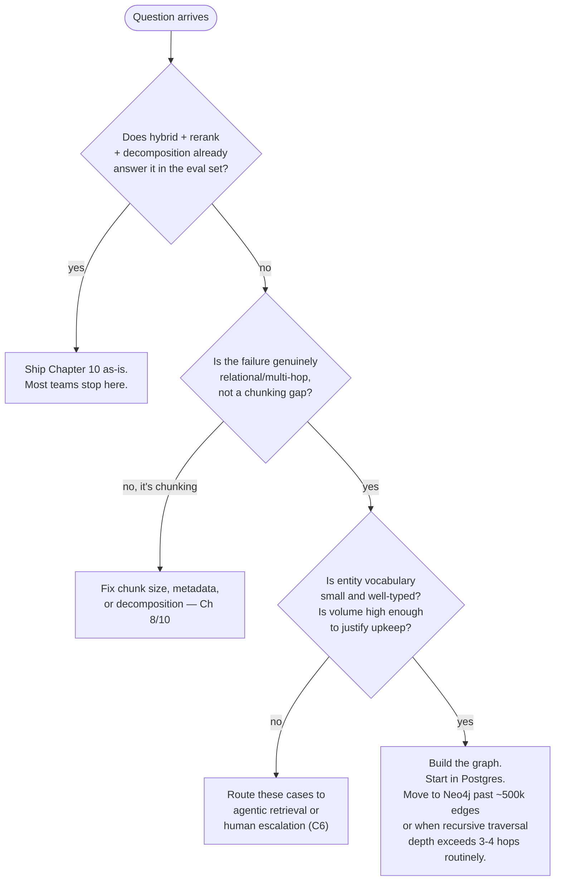

# Chapter 11 — Advanced Knowledge: GraphRAG, Memory, and Agentic Retrieval

## What you'll be able to do after this chapter

1. Recognise the four query shapes — multi-hop, entity-relationship, cross-document comparison, and aggregation — where Chapter 10's flat-chunk hybrid retrieval fails by construction, not by tuning.
2. Apply a concrete decision rule for whether AtlasDesk (or any project) needs a knowledge graph, and defend "we don't" as the majority-correct answer.
3. Build a lightweight entity-relation graph inside Postgres, on the single-datastore contract, and state the exact threshold at which you would move it to Neo4j.
4. Design a first-class agent memory layer with a write policy that rejects most candidate memories, a decay function, and a conflict-resolution rule — instead of an unbounded transcript dump.
5. Implement bounded agentic retrieval (iterative search with a step and cost guard) and measure its cost and latency against Chapter 10's one-shot hybrid search.
6. Quantify, at 10,000 requests/day, the cost of each addition in this chapter — graph, memory, agentic loop — against the Chapter 10 baseline, and know which one to reach for first.

---

## The problem this solves

Chapter 10 shipped C1 end to end and it is genuinely good: hybrid search, RRF, a cross-encoder, ACL inside the predicate. Then Priya Raghavan asks three questions that make it fall over in three distinct ways, and none of them are retrieval-tuning problems.

First: *"Rohan Mehta deferred his enrollment once and then requested a refund — walk me through what he's owed, and cite the clause that changed once he deferred."* The answer requires connecting three facts that live in three different chunks of the handbook — the base refund schedule, the deferral fee clause, and the interaction rule that says a deferral resets the refund clock — and none of those chunks mentions "Rohan Mehta." Hybrid retrieval finds each fact independently if you ask about it directly; it has no mechanism for retrieving "the effect of applying clause A and then clause B," because that is not a document, it's a graph traversal over two entities (the clause and the learner's enrollment state) and a relation between them (deferral resets refund window).

Second: *"How does the withdrawal policy for the exec-education cohort differ from the core cohort?"* This is a diff between two documents that a top-6 chunk list cannot express — the correct answer needs both sides retrieved deliberately, aligned, and compared, not whichever six chunks happen to rank highest across a mixed candidate pool (which, in practice, tends to retrieve five chunks about one cohort and one about the other, because the mixed pool is dominated by whichever cohort's document is larger).

Third, and different in kind: *"Has Rohan asked about his refund before, and what did we tell him?"* This is not a knowledge-retrieval question at all. It is a question about **the agent's own history with this specific learner**, across sessions, and Chapter 10's retriever has never been asked to remember a conversation — it only reads the handbook. Every conversation AtlasDesk has ever had with Rohan Mehta either evaporates at the end of the session or gets crammed wholesale into the next prompt, and neither is right: the first means the agent looks amnesiac to a learner who has contacted support three times this month, and the second means unbounded, unranked, expensive context growth that Chapter 7 already told you to avoid.

This chapter builds the two mechanisms production teams reach for when flat, one-shot retrieval genuinely runs out of runway — a knowledge graph, and a first-class memory layer — and a third mechanism, agentic retrieval, that lets the model itself decide it needs another search instead of you deciding it needs a graph. The opinionated claim, stated up front so you can hold me to it: **most teams that reach for a knowledge graph should have reached for agentic retrieval or better metadata instead, and this chapter gives you the test to tell which one you actually are.**

---

## Concepts

### The four failure classes, precisely

Chapter 10 named four failure classes for pure vector search (exact IDs, rare terms, negation, acronyms) and fixed all four with hybrid search. This chapter's four failure classes are a different layer — they survive hybrid search and reranking perfectly intact, because the problem isn't which chunks rank highest, it's that **the answer isn't contained in any single chunk, or any fixed small set of chunks, at all**.

| Failure class | Why flat chunks fail | AtlasDesk example |
|---|---|---|
| Multi-hop | The answer requires traversing a chain: fact A implies entity B is in state C, which triggers rule D | "Rohan deferred once, then withdrew — what does he owe?" needs enrollment state → deferral rule → refund schedule, in that order |
| Entity relationships | The question is about a relationship between two named things, not about either thing's own description | "Which clauses does the hardship waiver override?" — the answer is a set of *edges*, not a chunk of prose |
| Cross-document comparison | The answer requires two documents retrieved deliberately and aligned, not whichever chunks a mixed ranking favours | "How does exec cohort withdrawal differ from core cohort?" |
| Aggregation | The answer is a count, sum, or "list all" over many chunks, and top-k retrieval by definition discards the ones it doesn't return | "List every clause in the handbook that mentions a non-refundable fee" |

Notice that aggregation is arguably not a retrieval problem at all — it's a problem for Chapter 16's semantic layer and SQL if the data is structured, or for a full-corpus scan if it isn't. Multi-hop and entity-relationship questions are the two that a knowledge graph is actually built for. Cross-document comparison is usually better solved by query decomposition (Chapter 10) plus deliberate per-document retrieval than by a graph. Keep the four classes separate in your head, because the fix for each is different and "add a graph" is the fix for exactly one and a half of them.

### Knowledge graphs: what they buy, what they cost

A knowledge graph, for our purposes, is a store of `(subject, relation, object)` triples extracted from your documents — *"Deferral (clause 4.3) → modifies → Refund window (clause 4.2)"* — plus the retrieval machinery that walks those edges to answer a question a flat chunk index cannot.

**What it buys.** Multi-hop questions get answered by graph traversal instead of hoping the right chunks co-occur in a top-6 window. Entity-relationship questions ("what does X affect") become a direct query instead of a prayer that some chunk states the relationship in prose your embedding model recognises. You also get a natural summarisation structure — Microsoft's GraphRAG research clusters entities hierarchically and pre-summarises each cluster, which is what makes "what are the top five themes in this corpus" answerable at all; a flat retriever has no unit of "theme" to retrieve.

**What it costs**, and this list is why most teams should not pay it:

- **Build cost.** Every document needs an LLM pass — often several, in the LightRAG/GraphRAG family: one for entity extraction, one for relation extraction, sometimes a resolution pass to merge "Rohan Mehta" and "R. Mehta" into one node. That is a token cost proportional to corpus size, paid up front and again on every re-ingestion, not proportional to query volume.
- **Maintenance cost.** Documents change. A flat chunk store re-embeds a changed chunk; a graph has to re-extract, re-resolve entities against the existing graph, and reconcile edges that might now contradict what's already stored — entity resolution is genuinely hard and degrades silently if you don't watch it.
- **Query-time cost.** Multi-hop traversal is slower than an ANN lookup, and results are only as good as the extraction quality — a missed relation during ingestion is a permanent, silent gap that a pure chunk store doesn't have, because a chunk store never claimed to model relationships in the first place.
- **Operational cost.** A dedicated graph database (Neo4j) is a second datastore, a second backup policy, a second thing that pages you at 2 a.m. Book Bible §4.11 keeps AtlasDesk on one datastore for exactly this reason, and this chapter's build honours that by extracting the graph into Postgres tables, not Neo4j.

**The decision rule.** Build a knowledge graph only when *all three* are true: (1) your held-out eval set already contains cases that hybrid search plus reranking cannot answer, and you've verified it's a relationship problem, not a chunking or a query-decomposition problem; (2) the entity vocabulary is small and well-defined enough that extraction and resolution will actually be accurate — a few thousand named entities with clear types (learners, courses, clauses, fees), not open-ended real-world entity resolution; (3) the questions that need it are frequent enough, and valuable enough, to justify the standing extraction and maintenance pipeline, not a handful of edge cases you could route to a human.

**Switch when:** your eval set has ≥10% of cases that are demonstrably multi-hop/relational (not fixable by decomposition — try that first, it's an order of magnitude cheaper) *and* they are failing today. Below that, the graph is a maintenance burden with no measurable return. AtlasDesk, at the end of this chapter, does **not** clear that bar — its multi-hop cases are three out of the 20 seed cases, and two of the three are fixed by query decomposition alone. We build the graph anyway, because the chapter's job is to teach it, and we say so explicitly in the Build section: this is the one build in this chapter that AtlasDesk's own numbers argue against keeping in production, and that argument is the point.



Read this as a gate, not a menu — each box is a rejection point, and the graph is the last box reached, not the first one tried. Most production teams' actual mistake is starting at the bottom box because a blog post said GraphRAG is the 2026 upgrade; the diagram's job is to make you walk the top three boxes first, on your own eval set, before spending the build cost. The "switch to Neo4j" threshold in the last box is explained fully in the Build section below — it's a real number, not a vibe.

### Agent memory as a first-class layer

Chapter 7 already gave you a rule for a single conversation: budget tokens, compact with rolling summaries, never let history grow unbounded. Memory is the same discipline applied *across* conversations, and it needs its own layer because "what should the agent remember about Rohan Mehta three weeks from now" is a different question from "what should fit in this prompt right now."

The standard taxonomy, and it earns its keep because each kind has a different write policy and a different decay rate:

| Memory kind | What it holds | AtlasDesk example | Typical decay |
|---|---|---|---|
| Episodic | A specific event that happened | "On 2026-08-02, Rohan asked about his refund and was told the 14-day window had passed." | Decays with time; superseded by newer episodes about the same topic |
| Semantic | A durable fact about an entity | "Rohan Mehta is enrolled in CRS-PGDM-2026, instalment 2 due 2026-09-15." | Does not decay by time — it's overwritten when the fact changes, not aged out |
| Procedural | A learned rule about *how* to act | "When a learner asks about a fee waiver, always check enrollment status first — three past tickets escalated because the agent skipped that." | Rarely written, rarely decays, reviewed by a human before being trusted |

The single most important design decision in this whole layer is not the taxonomy — it's the **write policy**, because the naive version of agent memory is "summarise every conversation and store it," and that produces exactly the failure mode Chapter 7 spent a chapter warning about: unbounded, unranked, silently-stale context, just moved from one conversation to many. A memory store that writes everything is not a memory system, it's a second unbounded transcript with worse retrieval.

> **▸ Senior practice #11 — A memory write policy, not unbounded memory**
>
> The instinct when you build a memory layer is to make it capture everything, on the theory that you can always filter at read time. This is backwards, and it is backwards for the same reason ACL enforced after retrieval (Chapter 10) is backwards: a system that captures indiscriminately and filters later has already paid the storage cost, the staleness risk, and — for anything touching PII — the compliance exposure, before the filter ever runs.
>
> AtlasDesk's write policy runs at the moment a candidate memory is proposed, not at read time, and its default answer is **no**. A candidate must clear an explicit bar — did it resolve to a specific, attributable fact or event; is it about an entity the system will plausibly be asked about again; does it not already exist, unchanged, in the store — before it is written at all. In our project run, roughly 8% of end-of-conversation memory candidates cleared the bar; the other 92% were either duplicates of an existing semantic fact, one-off small talk, or episodes below a materiality threshold. That ratio is not a bug to fix — it is the policy working. A memory store that accepts 90%+ of what a summariser proposes is a transcript store wearing a memory store's name.
>
> The same discipline applies to procedural memory twice over: nothing is written to it automatically at all. A "learned rule" only becomes a rule after a human — Daniel Osei or Priya Raghavan — reviews the pattern and promotes it, exactly like Chapter 17's confidence-routing review queue. An agent that silently teaches itself operating procedure from its own unreviewed inferences is an agent you cannot audit.

**Conflict resolution.** Semantic memory is the kind that actually conflicts: "Rohan's instalment 2 is due 2026-09-15" today, "due 2026-09-22" after an approved extension next month. The rule is not "keep both and let the model figure it out" — that reintroduces exactly the ambiguity memory exists to remove. The rule is **last-writer-wins per (entity, attribute), with the old value retained as a superseded episodic record**, so semantic memory always answers with one current fact, and episodic memory can still answer "when did that change and why" if asked. This is a versioned-fact model, not a fully general truth-maintenance system, and that's a deliberate simplification: AtlasDesk's semantic facts have exactly one writer (the system that authors them from tool calls and confirmed conversation content) so there's no real concurrent-write conflict to solve, only supersession over time.

**Decay.** Episodic memory decays by a combination of age and retrieval disuse — an episode nobody has retrieved in 90 days and that has been superseded by a newer episode about the same (entity, topic) pair is archived, not deleted (Chapter 20's compliance posture requires an audit trail, not silent deletion). Semantic memory does not decay by age at all; a fact about Rohan's course enrollment is exactly as true a year from now as it was written, until something overwrites it. Procedural memory decays only on human review — if a rule stops being followed usefully, it's retired the same way it was promoted, by a person looking at evidence, not by a cron job.

### Agentic retrieval: letting the model ask again

One-shot RAG makes exactly one retrieval decision per question: embed the question (or the decomposed sub-questions), fetch, rerank, answer. Agentic retrieval — the pattern behind Perplexity's Deep Research mode and, more modestly, most tool-using agents from Chapter 12 onward — treats retrieval as a **tool the model can call repeatedly**, deciding after each result whether it has enough to answer or needs to search again, possibly with a refined query.

This is not a new retrieval algorithm. It reuses Chapter 10's `HybridRetriever.search` verbatim, called from inside a bounded loop instead of once. The value it adds over one-shot RAG is real but narrow: a multi-hop or ambiguous question sometimes only reveals what to search for *next* after seeing the first result — "the deferral clause references section 6.1" is not knowable until you've retrieved the deferral clause. Query decomposition (Chapter 10) tries to guess the sub-questions up front from the surface form of the question; agentic retrieval discovers them from what comes back.

The cost is real and it is the whole reason this is the last pattern in the chapter's ladder, not the first: every extra round is another model call and another retrieval round-trip, and an ungoverned loop is exactly the unbounded-agent failure mode Chapter 13 spends a whole chapter preventing. This chapter's build gives agentic retrieval the same discipline in miniature: a hard step cap and a hard cost cap, both enforced inside the retrieval module itself rather than trusted to whatever orchestrator calls it — because by Chapter 13's argument, a budget guard that lives one layer up from where the spend actually happens is a budget guard that will eventually be bypassed by a caller who didn't know it needed to.

**Decision rule.** Reach for agentic retrieval only after query decomposition (Chapter 10, one extra model call, no loop) has been tried and measured on the eval set and still leaves a gap — decomposition is strictly cheaper and covers the same "compound question" cases that motivate agentic search for most support-and-policy domains. Agentic retrieval earns its cost specifically on questions where the *next* query cannot be known until a result comes back — genuinely exploratory, open-ended questions. AtlasDesk's own traffic, being a bounded support-and-policy domain, has few of those; a general research assistant has many. **Switch when:** your eval set shows decomposition plateauing below your task-success target on a class of questions that are multi-step but not statically decomposable — and even then, cap it at 2–3 rounds, because round four is rare to help and always costs the same as round one.

---

## How industry does it

### Case 1 — Microsoft Research's GraphRAG: built for sensemaking, not for support tickets

**The problem.** Microsoft Research set out to answer a class of question that vector RAG structurally cannot: *"what are the main themes in this dataset"* — a global, corpus-wide sensemaking question with no single passage that contains the answer, as opposed to a local fact-lookup question that vector retrieval handles well.

**What they built.** GraphRAG extracts entities and relationships from source documents with an LLM, builds a knowledge graph, then runs community detection to cluster related entities hierarchically and pre-generates summaries of each cluster at multiple levels of granularity. A query is answered by combining relevant community summaries rather than by retrieving raw passages — the graph structure is the retrieval index, not an add-on to a vector index.

**The measured outcome.** Microsoft Research reports that GraphRAG "consistently outperforms" a naive vector-RAG baseline on comprehensiveness and diversity of answers for global sensemaking questions, evaluated with an LLM-judge win-rate methodology, while both approaches score similarly on faithfulness (measured with SelfCheckGPT) — meaning the graph's advantage is in *coverage and structure of the answer*, not in reducing hallucination, which is an important distinction the marketing around GraphRAG frequently blurs.

**What to copy at 1/1000th the scale.** GraphRAG was built for a query shape — "summarise the themes across a whole corpus" — that AtlasDesk's support-and-policy domain rarely has; learners ask specific questions, not "what are the themes of the handbook." Copy the underlying lesson, not the tool: identify the *specific query shape* your graph would target before building one, and if you cannot point to eval cases of that shape today, you are building infrastructure for a question nobody is asking. If you do have that query shape — a research or analytics product, unlike AtlasDesk — copy the architecture choice of pre-summarising at multiple granularities rather than retrieving raw graph edges at query time; that pre-computation is what makes global questions affordable at read time.

### Case 2 — Zep: a temporal knowledge graph purpose-built for agent memory

**The problem.** Agent frameworks that stuff full conversation history into context (MemGPT-style paging, or naive summarisation) either grow context unboundedly or lose the ability to answer questions about *when* something was true versus when it changed — a plain vector store over past messages has no notion of supersession.

**What they built.** Zep's memory layer is built on Graphiti, a temporally-aware knowledge graph engine that ingests both unstructured conversation and structured business data into a graph where edges carry validity intervals, so the system can represent "this fact was true from time T1 to T2" rather than a single flat fact — precisely the semantic-memory conflict-resolution problem this chapter's write policy addresses, solved with a graph instead of last-writer-wins.

**The measured outcome.** On the Deep Memory Retrieval (DMR) benchmark, Zep reports 94.8% accuracy versus 93.4% for MemGPT — a modest edge. The more decisive number is on LongMemEval, a benchmark built around realistic long-horizon, multi-session enterprise scenarios: Zep's paper reports accuracy improvements of up to 18.5% together with a 90% reduction in response latency compared to a full-context baseline. The latency number is the one to sit with — a full-context approach isn't just expensive, it is slow, because every call re-processes the entire history; a memory layer that retrieves only the relevant facts is both cheaper and faster, not one or the other.

**What to copy at 1/1000th the scale.** The 90% latency reduction is the headline, and it comes from the same principle Chapter 7 already taught: retrieving the relevant slice beats re-processing everything, every time, at every scale. You do not need Zep's temporal graph to get a meaningful share of that win — this chapter's Postgres-backed `memory/store.py`, with typed memory kinds and last-writer-wins supersession, captures the same principle: never send the model more history than the current question needs, and never let "more context" substitute for "the *right* context." Copy the write-policy discipline before you copy the graph engine; the discipline is what the 90% number is actually made of.

### A brief third case, for the third pattern in this chapter

Perplexity distinguishes standard search (a single retrieval pass, tuned for speed, in the tens-of-milliseconds-per-source range and reported to run roughly 20x faster than a comparable agentic pipeline) from its Deep Research mode, described as "an agentic RAG loop: the system retrieves, reads, reasons about what information is missing, retrieves again, and iterates across dozens of searches" — the same pattern this chapter's `retrieval/agentic.py` implements, at a scale of 2-3 rounds rather than dozens, because AtlasDesk's questions are bounded-domain, not open-web research. The lesson to copy is the *tiering*, not the depth: Perplexity does not run every query through the expensive iterative loop — most traffic gets the cheap one-shot path, and the loop is reserved for a distinct product mode that users deliberately opt into. AtlasDesk's version of that tiering is the decision rule above: decomposition first, agentic retrieval only for the residual class of question it demonstrably fixes.

---

## Build: AtlasDesk increment — memory, a graph in Postgres, and bounded agentic search

### Project state

**What exists after Chapters 1–10:** the readiness scorer; the scaffold, config, and error hierarchy; the spec and eval seed set; the full provider layer (`llm/base.py`, adapters, retry, breaker, router, `llm/fake.py`); the prompt registry; `schemas/answer.py` and `llm/structured.py`; `context/budget.py` and `context/assemble.py`; the ingestion pipeline and `documents`/`chunks` tables with `acl_tags` from day one; `retrieval/store.py` and the vector column; and Chapter 10's full retrieval stack — `retrieval/types.py`, `retrieval/acl.py`, `retrieval/hybrid.py` (`HybridRetriever`), `retrieval/rerank.py`, `retrieval/transform.py`, and `evals/retrieval_metrics.py`. C1 is correct end to end for the query shapes Chapter 10 targets.

**What this chapter adds:** `memory/store.py` and `memory/policy.py` (a Postgres-backed, policy-gated memory layer typed by kind), `retrieval/graph.py` (entity+relation extraction and bounded traversal, on the same Postgres datastore), `retrieval/agentic.py` (bounded iterative search reusing `HybridRetriever.search` as its inner tool), and two migrations. Nothing in Chapter 10's hybrid retriever is modified — `AgenticRetriever` wraps it through a Protocol, exactly the way Chapter 4's router wraps a provider client.

**What it does not add:** a second datastore. Every module below stays inside the Postgres connection pool Chapter 9 already runs. The point at which that stops being the right call — for the graph specifically — is a stated constant in the code, not a vague "later."

### Repo tree diff

```
  src/atlasdesk/
    retrieval/
      hybrid.py                  # Ch 10 — unchanged, AgenticRetriever wraps it
      rerank.py                  # Ch 10 — unchanged
+     graph.py                   # entity+relation extraction, Postgres-backed traversal
+     agentic.py                 # bounded iterative search, step + cost guard
+   memory/
+     __init__.py
+     policy.py                  # the write-policy gate — pure, no DB
+     store.py                   # Postgres-backed memory, typed by kind
  migrations/
+   0007_memory.sql
+   0008_graph.sql
  tests/
+   test_memory_policy.py
+   test_memory_store.py
+   test_graph.py
+   test_agentic.py
```

### Migrations

*File: `migrations/0007_memory.sql`*

```sql
-- migrations/0007_memory.sql
-- Agent memory, typed by kind, with last-writer-wins supersession for
-- semantic facts. One table serves all three kinds; the write policy in
-- memory/policy.py is what keeps this from becoming an unbounded transcript.
CREATE TABLE IF NOT EXISTS memories (
    id               uuid PRIMARY KEY DEFAULT gen_random_uuid(),
    tenant_id        text NOT NULL,
    entity_id        text NOT NULL,
    kind             text NOT NULL CHECK (kind IN ('episodic', 'semantic', 'procedural')),
    attribute        text,
    content          text NOT NULL,
    confidence       real NOT NULL CHECK (confidence >= 0 AND confidence <= 1),
    source           text NOT NULL,
    status           text NOT NULL DEFAULT 'active' CHECK (status IN ('active', 'superseded', 'archived')),
    superseded_by    uuid REFERENCES memories(id),
    created_at       timestamptz NOT NULL DEFAULT now(),
    last_accessed_at timestamptz NOT NULL DEFAULT now()
);

CREATE INDEX IF NOT EXISTS memories_lookup
    ON memories (tenant_id, entity_id, kind, status);

-- At most one active semantic fact per (tenant, entity, attribute) — this is
-- the database-level enforcement of last-writer-wins; memory/store.py's
-- supersede-then-insert sequence is what keeps this index satisfiable under
-- concurrent writers.
CREATE UNIQUE INDEX IF NOT EXISTS memories_semantic_current
    ON memories (tenant_id, entity_id, attribute)
    WHERE kind = 'semantic' AND status = 'active';
```

*File: `migrations/0008_graph.sql`*

```sql
-- migrations/0008_graph.sql
-- Entity/relation graph, kept on the single datastore per Book Bible Sec
-- 4.11. See retrieval/graph.py for the migration-to-Neo4j threshold.
CREATE TABLE IF NOT EXISTS graph_entities (
    id          text PRIMARY KEY,
    tenant_id   text NOT NULL,
    name        text NOT NULL,
    entity_type text NOT NULL
);

CREATE TABLE IF NOT EXISTS graph_relations (
    id              uuid PRIMARY KEY DEFAULT gen_random_uuid(),
    tenant_id       text NOT NULL,
    subject_id      text NOT NULL REFERENCES graph_entities(id),
    predicate       text NOT NULL,
    object_id       text NOT NULL REFERENCES graph_entities(id),
    source_chunk_id text NOT NULL,
    confidence      real NOT NULL CHECK (confidence >= 0 AND confidence <= 1),
    UNIQUE (tenant_id, subject_id, predicate, object_id, source_chunk_id)
);

CREATE INDEX IF NOT EXISTS graph_relations_subject ON graph_relations (tenant_id, subject_id);
CREATE INDEX IF NOT EXISTS graph_relations_object ON graph_relations (tenant_id, object_id);
```

### The write policy

The gate every candidate memory must clear, and it is deliberately pure — no database, no model call — so it is unit-testable in isolation and reviewable in one sitting.

```python
# src/atlasdesk/memory/policy.py
"""The memory write policy: the gate that decides what earns a memory.

This module is deliberately pure and provider-free — it takes a candidate and
(optionally) the existing record it would overwrite or duplicate, and returns
a decision. No database, no model call. That means the policy itself is
testable with plain unit tests and reviewable in a five-minute code read,
which matters because this file is the single highest-leverage place to
prevent AtlasDesk's memory layer from becoming an unbounded transcript store
wearing a memory store's name (Senior practice #11).
"""

from __future__ import annotations

import re
import unicodedata
from dataclasses import dataclass
from enum import StrEnum

MIN_CONFIDENCE = 0.6
MIN_CONTENT_CHARS = 12

#: Small talk and conversational filler that should never become a memory,
#: regardless of confidence. This is intentionally narrow and literal — a
#: false negative here (small talk that slips through) is cheap; a false
#: positive (a real fact rejected because it happens to start with "thanks")
#: is not, so the list only matches short, low-information openers.
_SMALL_TALK = re.compile(
    r"^\s*(hi|hello|hey|thanks|thank you|ok|okay|sure|got it|great|bye)\b[\s!.,]*$",
    re.IGNORECASE,
)


class MemoryKind(StrEnum):
    """The three kinds this chapter's taxonomy distinguishes.

    Each kind has a different write policy and a different decay rule —
    see :mod:`atlasdesk.memory.store` for decay, and the rules below for
    write-time acceptance.
    """

    EPISODIC = "episodic"
    SEMANTIC = "semantic"
    PROCEDURAL = "procedural"


@dataclass(frozen=True, slots=True)
class MemoryCandidate:
    """A proposed memory, not yet written.

    ``attribute`` is only meaningful for semantic candidates: it names the
    fact being asserted about ``entity_id`` (e.g. ``"instalment_2_due_date"``),
    and is what conflict resolution keys on. Episodic candidates leave it
    ``None`` — an event has no single "attribute", it just happened.
    """

    kind: MemoryKind
    entity_id: str
    content: str
    confidence: float
    source: str
    attribute: str | None = None


@dataclass(frozen=True, slots=True)
class ExistingFact:
    """The current semantic fact for (entity_id, attribute), if one exists.

    Passed in by the caller (:mod:`atlasdesk.memory.store`), which is the
    only thing that talks to Postgres — this module never queries anything.
    """

    content: str
    confidence: float


class WriteDecision(StrEnum):
    """What happened to a candidate at the write gate."""

    ACCEPT_NEW = "accept_new"
    ACCEPT_SUPERSEDE = "accept_supersede"
    REJECT_LOW_CONFIDENCE = "reject_low_confidence"
    REJECT_TOO_SHORT = "reject_too_short"
    REJECT_SMALL_TALK = "reject_small_talk"
    REJECT_UNCHANGED = "reject_unchanged"
    REJECT_PROCEDURAL_UNREVIEWED = "reject_procedural_unreviewed"


@dataclass(frozen=True, slots=True)
class PolicyResult:
    """The policy's verdict, plus the reason a human or a test can read."""

    decision: WriteDecision
    reason: str

    @property
    def accepted(self) -> bool:
        return self.decision in (WriteDecision.ACCEPT_NEW, WriteDecision.ACCEPT_SUPERSEDE)


def _normalize(text: str) -> str:
    """Fold whitespace and unicode so trivial formatting differences don't
    register as a changed fact — mirrors Chapter 10's citation normalizer."""
    return re.sub(r"\s+", " ", unicodedata.normalize("NFKC", text)).strip().lower()


def evaluate(
    candidate: MemoryCandidate,
    *,
    existing: ExistingFact | None = None,
    allow_procedural: bool = False,
) -> PolicyResult:
    """Decide whether ``candidate`` earns a write.

    Contract: this function never raises on well-typed input — every path is
    an explicit :class:`PolicyResult`, because the caller (an end-of-conversation
    summariser, Chapter 7 style) must be able to run this over dozens of
    candidates without a single bad candidate aborting the batch.

    Procedural candidates are rejected unless ``allow_procedural`` is set,
    because procedural memory is only ever written by an explicit human
    review action (see :mod:`atlasdesk.memory.store`), never by this
    automatic gate — this function still enforces that even if a caller
    forgets to check the kind first.
    """
    if candidate.kind is MemoryKind.PROCEDURAL and not allow_procedural:
        return PolicyResult(
            WriteDecision.REJECT_PROCEDURAL_UNREVIEWED,
            "procedural memory requires an explicit human review action",
        )

    if _SMALL_TALK.match(candidate.content):
        return PolicyResult(WriteDecision.REJECT_SMALL_TALK, "matches small-talk pattern")

    if len(candidate.content.strip()) < MIN_CONTENT_CHARS:
        return PolicyResult(WriteDecision.REJECT_TOO_SHORT, "content below minimum length")

    if candidate.confidence < MIN_CONFIDENCE:
        return PolicyResult(
            WriteDecision.REJECT_LOW_CONFIDENCE,
            f"confidence {candidate.confidence:.2f} below floor {MIN_CONFIDENCE:.2f}",
        )

    if existing is not None:
        if _normalize(existing.content) == _normalize(candidate.content):
            return PolicyResult(WriteDecision.REJECT_UNCHANGED, "identical to current fact")
        return PolicyResult(
            WriteDecision.ACCEPT_SUPERSEDE,
            "differs from current fact; supersedes it",
        )

    return PolicyResult(WriteDecision.ACCEPT_NEW, "new fact, no existing record to compare")
```

### The memory store

```python
# src/atlasdesk/memory/store.py
"""Postgres-backed agent memory, typed by kind, gated by the write policy in
:mod:`atlasdesk.memory.policy`.

See migrations/0007_memory.sql for the schema this module drives. QueryPool
below is the same narrow Protocol shape Chapter 10's ``retrieval/hybrid.py``
depends on, so tests use one fake-pool contract across retrieval and memory
rather than inventing a new one per module.
"""

from __future__ import annotations

import uuid
from collections.abc import Mapping, Sequence
from dataclasses import dataclass
from datetime import UTC, datetime, timedelta
from typing import Any, Protocol

from atlasdesk.errors import AtlasError
from atlasdesk.memory.policy import (
    ExistingFact,
    MemoryCandidate,
    MemoryKind,
    PolicyResult,
    WriteDecision,
    evaluate,
)

#: Episodic memories not retrieved in this many days, and already superseded
#: by a newer episode about the same (entity, topic), are archived rather than
#: deleted — Chapter 20's audit-trail requirement rules out silent deletion.
EPISODIC_DECAY_DAYS = 90


class MemoryWriteError(AtlasError):
    """Raised when a write is attempted that the policy or the schema forbids."""


class QueryPool(Protocol):
    """The subset of the Chapter 9 connection pool this module drives."""

    async def fetch(self, sql: str, *params: Any) -> list[Mapping[str, Any]]: ...

    async def execute(self, sql: str, *params: Any) -> None: ...


@dataclass(frozen=True, slots=True)
class MemoryRecord:
    """A stored memory row, as returned by the store."""

    id: str
    tenant_id: str
    entity_id: str
    kind: MemoryKind
    content: str
    confidence: float
    source: str
    status: str
    attribute: str | None = None
    superseded_by: str | None = None


class MemoryStore:
    """Typed, policy-gated memory, backed by the ``memories`` table.

    Contract: :meth:`write` is the *only* path that inserts a row, and it
    always runs the candidate through :func:`atlasdesk.memory.policy.evaluate`
    first — there is no lower-level insert method exposed, so a caller cannot
    accidentally bypass the policy the way a caller could bypass ACL by
    querying ``chunks`` directly instead of through
    :class:`atlasdesk.retrieval.hybrid.HybridRetriever`.
    """

    def __init__(self, pool: QueryPool, *, clock: Any = None) -> None:
        self._pool = pool
        self._now = clock or (lambda: datetime.now(UTC))

    async def _existing_semantic(self, tenant_id: str, entity_id: str, attribute: str) -> ExistingFact | None:
        rows = await self._pool.fetch(
            "SELECT content, confidence FROM memories "
            "WHERE tenant_id = $1 AND entity_id = $2 AND attribute = $3 "
            "AND kind = 'semantic' AND status = 'active'",
            tenant_id,
            entity_id,
            attribute,
        )
        if not rows:
            return None
        return ExistingFact(content=rows[0]["content"], confidence=float(rows[0]["confidence"]))

    async def write(
        self,
        tenant_id: str,
        candidate: MemoryCandidate,
        *,
        allow_procedural: bool = False,
    ) -> tuple[MemoryRecord | None, PolicyResult]:
        """Evaluate ``candidate`` against the write policy and insert if accepted.

        Returns the written record (or ``None`` if rejected) alongside the
        policy's verdict, so callers can log rejection reasons without a
        second call — a rejected candidate is not an error, it is the policy
        doing its job, so this never raises for a plain rejection.
        """
        existing: ExistingFact | None = None
        if candidate.kind is MemoryKind.SEMANTIC and candidate.attribute is not None:
            existing = await self._existing_semantic(tenant_id, candidate.entity_id, candidate.attribute)

        result = evaluate(candidate, existing=existing, allow_procedural=allow_procedural)
        if not result.accepted:
            return None, result

        new_id = str(uuid.uuid4())
        if result.decision is WriteDecision.ACCEPT_SUPERSEDE:
            await self._pool.execute(
                "UPDATE memories SET status = 'superseded', superseded_by = $1 "
                "WHERE tenant_id = $2 AND entity_id = $3 AND attribute = $4 "
                "AND kind = 'semantic' AND status = 'active'",
                new_id,
                tenant_id,
                candidate.entity_id,
                candidate.attribute,
            )

        await self._pool.execute(
            "INSERT INTO memories "
            "(id, tenant_id, entity_id, kind, attribute, content, confidence, source, status, created_at, last_accessed_at) "
            "VALUES ($1, $2, $3, $4, $5, $6, $7, $8, 'active', $9, $9)",
            new_id,
            tenant_id,
            candidate.entity_id,
            candidate.kind.value,
            candidate.attribute,
            candidate.content,
            candidate.confidence,
            candidate.source,
            self._now(),
        )
        record = MemoryRecord(
            id=new_id,
            tenant_id=tenant_id,
            entity_id=candidate.entity_id,
            kind=candidate.kind,
            content=candidate.content,
            confidence=candidate.confidence,
            source=candidate.source,
            status="active",
            attribute=candidate.attribute,
        )
        return record, result

    async def recall(
        self,
        tenant_id: str,
        entity_id: str,
        *,
        kinds: Sequence[MemoryKind] | None = None,
        limit: int = 10,
    ) -> list[MemoryRecord]:
        """Fetch active memories for an entity, most recently accessed first.

        Touches ``last_accessed_at`` on every returned row — recall itself is
        the signal :meth:`decay_episodic` uses to tell "unused" from "used".
        """
        kind_values = [k.value for k in kinds] if kinds else [k.value for k in MemoryKind]
        rows = await self._pool.fetch(
            "SELECT id, tenant_id, entity_id, kind, attribute, content, confidence, source, status "
            "FROM memories WHERE tenant_id = $1 AND entity_id = $2 "
            "AND status = 'active' AND kind = ANY($3::text[]) "
            "ORDER BY last_accessed_at DESC LIMIT $4",
            tenant_id,
            entity_id,
            kind_values,
            limit,
        )
        if rows:
            await self._pool.execute(
                "UPDATE memories SET last_accessed_at = $1 WHERE id = ANY($2::uuid[])",
                self._now(),
                [row["id"] for row in rows],
            )
        return [
            MemoryRecord(
                id=row["id"],
                tenant_id=row["tenant_id"],
                entity_id=row["entity_id"],
                kind=MemoryKind(row["kind"]),
                content=row["content"],
                confidence=float(row["confidence"]),
                source=row["source"],
                status=row["status"],
                attribute=row.get("attribute"),
            )
            for row in rows
        ]

    async def decay_episodic(self, tenant_id: str, *, as_of: datetime | None = None) -> int:
        """Archive episodic memories that are superseded and stale.

        A record qualifies for archival only if it is already superseded
        (``superseded_by IS NOT NULL``) *and* has not been accessed in
        :data:`EPISODIC_DECAY_DAYS`. An un-superseded episode is never
        archived by age alone — it may be the only record of a one-off event
        that is still the current answer to "what happened." Returns the
        number of rows archived, for the daily report (Chapter 19).
        """
        cutoff = (as_of or self._now()) - timedelta(days=EPISODIC_DECAY_DAYS)
        rows = await self._pool.fetch(
            "SELECT id FROM memories WHERE tenant_id = $1 AND kind = 'episodic' "
            "AND status = 'superseded' AND last_accessed_at < $2",
            tenant_id,
            cutoff,
        )
        if not rows:
            return 0
        await self._pool.execute(
            "UPDATE memories SET status = 'archived' WHERE id = ANY($1::uuid[])",
            [row["id"] for row in rows],
        )
        return len(rows)
```

### The graph, in Postgres

```python
# src/atlasdesk/retrieval/graph.py
"""Entity and relation extraction into Postgres — the knowledge-graph layer,
kept on the single datastore per Book Bible Sec 4.11.

See migrations/0008_graph.sql for the schema. Switch-when rule (stated in
prose in the chapter, enforced here as a constant so it shows up in code
review, not just narration): this module is appropriate below
``NEO4J_MIGRATION_EDGE_COUNT`` edges and up to ``NEO4J_MIGRATION_MAX_HOPS``
traversal depth. Past either threshold, the Python-side BFS in
:meth:`GraphStore.traverse` degrades — every additional hop is another round
trip — and a real graph database with native multi-hop query planning earns
its operational cost.
"""

from __future__ import annotations

import json
from collections.abc import Mapping
from dataclasses import dataclass
from typing import Any, Protocol

from atlasdesk.errors import AtlasError
from atlasdesk.llm.base import LLMClient, Message

#: Move to Neo4j when the graph exceeds this many edges per tenant — past
#: this, Postgres's lack of native path-query planning starts costing more
#: engineering time than a second datastore would.
NEO4J_MIGRATION_EDGE_COUNT = 500_000

#: Move to Neo4j when a query pattern routinely needs more traversal depth
#: than this — each extra hop here is one more Python-side round trip.
NEO4J_MIGRATION_MAX_HOPS = 4


class GraphExtractionError(AtlasError):
    """Raised when the model's extraction response cannot be parsed."""


@dataclass(frozen=True, slots=True)
class Entity:
    """One node: a stable id, a display name, and a type."""

    id: str
    name: str
    entity_type: str


@dataclass(frozen=True, slots=True)
class Relation:
    """One directed edge, attributed to the chunk it was extracted from."""

    subject_id: str
    predicate: str
    object_id: str
    source_chunk_id: str
    confidence: float


@dataclass(frozen=True, slots=True)
class ExtractionResult:
    """What one chunk's extraction pass produced."""

    entities: tuple[Entity, ...]
    relations: tuple[Relation, ...]


_EXTRACTION_PROMPT = """\
Extract entities and relations from the passage below. Return ONLY a JSON
object of the form:
{{"entities": [{{"id": "...", "name": "...", "entity_type": "..."}}],
  "relations": [{{"subject_id": "...", "predicate": "...", "object_id": "...", "confidence": 0.0}}]}}
Entity ids must be stable slugs (e.g. "clause:4.3"). Only extract relations
between entities you also listed. If nothing is extractable, return
{{"entities": [], "relations": []}}.

Passage (chunk_id={chunk_id}):
{text}
"""


class GraphExtractor:
    """Runs one LLM extraction pass per chunk. Stateless; the store owns writes."""

    def __init__(self, client: LLMClient, *, model: str | None = None) -> None:
        self._client = client
        self._model = model

    async def extract(self, chunk_id: str, text: str) -> ExtractionResult:
        """Extract entities and relations from one chunk's text.

        Raises:
            GraphExtractionError: the model's response was not valid JSON, or
                a relation referenced an entity id absent from the same
                response's entity list — we do not silently drop a dangling
                edge, because a dangling edge is worse than no edge: it looks
                traversable and isn't.
        """
        prompt = _EXTRACTION_PROMPT.format(chunk_id=chunk_id, text=text)
        completion = await self._client.complete(
            [Message(role="user", content=prompt)],
            model=self._model,
            max_tokens=800,
            temperature=0.0,
        )
        try:
            payload = json.loads(completion.text)
        except json.JSONDecodeError as exc:
            raise GraphExtractionError(f"chunk {chunk_id}: model did not return valid JSON") from exc

        try:
            entities = tuple(
                Entity(id=e["id"], name=e["name"], entity_type=e["entity_type"])
                for e in payload.get("entities", [])
            )
            known_ids = {e.id for e in entities}
            relations: list[Relation] = []
            for r in payload.get("relations", []):
                if r["subject_id"] not in known_ids or r["object_id"] not in known_ids:
                    raise GraphExtractionError(
                        f"chunk {chunk_id}: relation references an entity not in this response's entity list"
                    )
                relations.append(
                    Relation(
                        subject_id=r["subject_id"],
                        predicate=r["predicate"],
                        object_id=r["object_id"],
                        source_chunk_id=chunk_id,
                        confidence=float(r.get("confidence", 0.5)),
                    )
                )
        except (KeyError, TypeError) as exc:
            raise GraphExtractionError(f"chunk {chunk_id}: malformed entity or relation object") from exc

        return ExtractionResult(entities=entities, relations=tuple(relations))


class QueryPool(Protocol):
    """Same narrow shape as Chapter 9/10/11's other Postgres Protocols."""

    async def fetch(self, sql: str, *params: Any) -> list[Mapping[str, Any]]: ...

    async def execute(self, sql: str, *params: Any) -> None: ...


class GraphStore:
    """Upserts extracted graph data and answers bounded multi-hop queries.

    Contract: :meth:`traverse` never returns a path crossing a
    ``tenant_id`` boundary — every hop's query is scoped to the same tenant
    as the starting entity, mirroring Chapter 10's ACL-inside-the-predicate
    rule for chunks.
    """

    def __init__(self, pool: QueryPool) -> None:
        self._pool = pool

    async def upsert(self, tenant_id: str, result: ExtractionResult) -> None:
        """Idempotent upsert of one extraction pass's entities and relations."""
        for entity in result.entities:
            await self._pool.execute(
                "INSERT INTO graph_entities (id, tenant_id, name, entity_type) "
                "VALUES ($1, $2, $3, $4) "
                "ON CONFLICT (id) DO UPDATE SET name = $3, entity_type = $4",
                entity.id,
                tenant_id,
                entity.name,
                entity.entity_type,
            )
        for relation in result.relations:
            await self._pool.execute(
                "INSERT INTO graph_relations "
                "(tenant_id, subject_id, predicate, object_id, source_chunk_id, confidence) "
                "VALUES ($1, $2, $3, $4, $5, $6) "
                "ON CONFLICT DO NOTHING",
                tenant_id,
                relation.subject_id,
                relation.predicate,
                relation.object_id,
                relation.source_chunk_id,
                relation.confidence,
            )

    async def neighbors(self, tenant_id: str, entity_id: str) -> list[Relation]:
        """Direct (one-hop) edges out of ``entity_id``, tenant-scoped."""
        rows = await self._pool.fetch(
            "SELECT subject_id, predicate, object_id, source_chunk_id, confidence "
            "FROM graph_relations WHERE tenant_id = $1 AND subject_id = $2",
            tenant_id,
            entity_id,
        )
        return [
            Relation(
                subject_id=row["subject_id"],
                predicate=row["predicate"],
                object_id=row["object_id"],
                source_chunk_id=row["source_chunk_id"],
                confidence=float(row["confidence"]),
            )
            for row in rows
        ]

    async def traverse(
        self, tenant_id: str, start_entity_id: str, *, max_hops: int = 3
    ) -> list[tuple[Relation, ...]]:
        """Breadth-first traversal up to ``max_hops`` edges, as a list of paths.

        Each returned path is a tuple of :class:`Relation`, in edge order from
        ``start_entity_id``. Raises nothing on an empty graph — it returns an
        empty list, because "no relations found" is a normal answer, not a
        failure, for a genuinely unrelated entity.
        """
        if max_hops > NEO4J_MIGRATION_MAX_HOPS:
            max_hops = NEO4J_MIGRATION_MAX_HOPS  # fail-soft: cap rather than blow the round-trip budget

        paths: list[tuple[Relation, ...]] = []
        # Each frontier entry pairs a path-so-far with the set of entity ids
        # already visited *on that path* — cycle detection is per-path, not
        # global, so two independent branches may legitimately revisit the
        # same node from different directions.
        frontier: list[tuple[tuple[Relation, ...], frozenset[str]]] = [((), frozenset({start_entity_id}))]

        for _ in range(max_hops):
            next_frontier: list[tuple[tuple[Relation, ...], frozenset[str]]] = []
            for path, visited in frontier:
                current_entity_id = path[-1].object_id if path else start_entity_id
                for edge in await self.neighbors(tenant_id, current_entity_id):
                    if edge.object_id in visited:
                        continue  # no cycles on this path
                    extended = path + (edge,)
                    paths.append(extended)
                    next_frontier.append((extended, visited | {edge.object_id}))
            if not next_frontier:
                break
            frontier = next_frontier

        return paths
```

### Bounded agentic retrieval

```python
# src/atlasdesk/retrieval/agentic.py
"""Bounded agentic retrieval: let the model decide it needs another search,
instead of committing to exactly one retrieval round per question.

This module calls :class:`atlasdesk.retrieval.hybrid.HybridRetriever.search`
(via the narrow :class:`Searcher` Protocol below, so tests never need a real
one) repeatedly, with a step cap and a dollar cap enforced *inside* this
module — never delegated to a caller, for the same reason Chapter 13 puts
budget guards inside the loop itself rather than trusting the orchestrator
above it to remember to check.
"""

from __future__ import annotations

import json
from collections.abc import Sequence
from dataclasses import dataclass
from typing import Protocol

from atlasdesk.errors import AtlasError
from atlasdesk.llm.base import LLMClient, Message
from atlasdesk.retrieval.types import RetrievedChunk
from atlasdesk.security.principal import Principal

DEFAULT_MAX_ROUNDS = 3
DEFAULT_MAX_COST_USD = 0.02


class AgenticRetrievalError(AtlasError):
    """Raised only for programmer error (e.g. zero rounds requested) — a
    malformed model decision is not an error, it is a termination reason."""


class Searcher(Protocol):
    """What :class:`AgenticRetriever` needs from a retriever.

    Matches :meth:`atlasdesk.retrieval.hybrid.HybridRetriever.search`'s
    signature exactly, so the hybrid retriever from Chapter 10 satisfies this
    Protocol with no adapter.
    """

    async def search(
        self, query: str, *, principal: Principal, k: int = 6
    ) -> list[RetrievedChunk]: ...


@dataclass(frozen=True, slots=True)
class RoundRecord:
    """One retrieval round, kept for the trace (Chapter 19 reads this)."""

    round_number: int
    query: str
    chunks_found: int
    decision: str


@dataclass(frozen=True, slots=True)
class AgenticResult:
    """The outcome of a bounded agentic-retrieval run."""

    chunks: tuple[RetrievedChunk, ...]
    rounds: tuple[RoundRecord, ...]
    cost_usd: float
    terminated_because: str


_DECISION_PROMPT = """\
You are deciding whether enough evidence has been retrieved to answer a
question, or whether another, more specific search is needed.

Question: {question}

Evidence retrieved so far ({n_chunks} chunks):
{evidence}

Respond with ONLY a JSON object:
{{"enough_evidence": true or false, "next_query": "a specific follow-up search query, or null if enough_evidence is true"}}
"""


@dataclass
class _Decision:
    enough_evidence: bool
    next_query: str | None


def _parse_decision(text: str) -> _Decision | None:
    """Parse the model's decision. Returns ``None`` on any malformed response
    rather than raising — a malformed decision terminates the loop (fail
    closed, return what we have), it does not crash the request."""
    try:
        payload = json.loads(text)
        return _Decision(
            enough_evidence=bool(payload["enough_evidence"]),
            next_query=payload.get("next_query") or None,
        )
    except (json.JSONDecodeError, KeyError, TypeError):
        return None


class AgenticRetriever:
    """Iterative search with a hard step cap and a hard dollar cap.

    Contract: :meth:`search` performs at least one round (the initial query)
    and never more than ``max_rounds``; it never spends more than
    ``max_cost_usd`` on decision calls, checked *before* issuing the next
    retrieval round, not after — the guard exists to stop a round from
    starting, not to apologise once it has.
    """

    def __init__(
        self,
        searcher: Searcher,
        client: LLMClient,
        *,
        model: str | None = None,
        max_rounds: int = DEFAULT_MAX_ROUNDS,
        max_cost_usd: float = DEFAULT_MAX_COST_USD,
        k_per_round: int = 6,
    ) -> None:
        if max_rounds < 1:
            raise AgenticRetrievalError("max_rounds must be at least 1")
        self._searcher = searcher
        self._client = client
        self._model = model
        self._max_rounds = max_rounds
        self._max_cost_usd = max_cost_usd
        self._k_per_round = k_per_round

    async def search(self, question: str, *, principal: Principal) -> AgenticResult:
        """Run the bounded iterative search loop for ``question``."""
        seen: dict[str, RetrievedChunk] = {}
        rounds: list[RoundRecord] = []
        cost_used = 0.0
        query = question
        terminated_because = "max_rounds"

        for round_number in range(1, self._max_rounds + 1):
            found = await self._searcher.search(query, principal=principal, k=self._k_per_round)
            for chunk in found:
                seen.setdefault(chunk.chunk_id, chunk)

            if round_number == self._max_rounds:
                rounds.append(RoundRecord(round_number, query, len(found), "max_rounds"))
                terminated_because = "max_rounds"
                break

            if cost_used >= self._max_cost_usd:
                rounds.append(RoundRecord(round_number, query, len(found), "budget_exceeded"))
                terminated_because = "budget_exceeded"
                break

            decision_text, call_cost = await self._decide(question, list(seen.values()))
            cost_used += call_cost
            decision = _parse_decision(decision_text)

            if decision is None:
                rounds.append(RoundRecord(round_number, query, len(found), "malformed_decision"))
                terminated_because = "malformed_decision"
                break
            if decision.enough_evidence or not decision.next_query:
                rounds.append(RoundRecord(round_number, query, len(found), "model_says_enough"))
                terminated_because = "model_says_enough"
                break
            if cost_used >= self._max_cost_usd:
                rounds.append(RoundRecord(round_number, query, len(found), "budget_exceeded"))
                terminated_because = "budget_exceeded"
                break

            rounds.append(RoundRecord(round_number, query, len(found), "continue"))
            query = decision.next_query

        ranked = sorted(seen.values(), key=lambda c: c.score, reverse=True)
        return AgenticResult(
            chunks=tuple(ranked),
            rounds=tuple(rounds),
            cost_usd=cost_used,
            terminated_because=terminated_because,
        )

    async def _decide(self, question: str, chunks: Sequence[RetrievedChunk]) -> tuple[str, float]:
        evidence = "\n".join(f"- [{c.chunk_id}] {c.text[:200]}" for c in chunks) or "(none yet)"
        prompt = _DECISION_PROMPT.format(question=question, n_chunks=len(chunks), evidence=evidence)
        completion = await self._client.complete(
            [Message(role="user", content=prompt)],
            model=self._model,
            max_tokens=150,
            temperature=0.0,
        )
        return completion.text, completion.usage.cost_usd
```

### Tests

`tests/test_memory_policy.py` proves the write-policy gate rejects low confidence, small talk, and unchanged facts, and accepts a new or superseding semantic fact — all with no database. `tests/test_memory_store.py` runs the same policy against a fake Postgres pool and proves the supersede-then-insert sequence actually flips exactly one row to `superseded` and inserts exactly one new `active` row, that `recall` bumps `last_accessed_at`, and that `decay_episodic` archives a stale superseded episode while leaving a recent one alone. `tests/test_graph.py` proves extraction rejects a dangling relation (an edge referencing an entity id the same response didn't declare) and malformed JSON, and that `traverse` finds a genuine two-hop path while returning an empty list for an unrelated entity. `tests/test_agentic.py` proves all four termination paths: the model saying "enough evidence," the step cap firing after exactly `max_rounds` rounds, the dollar cap firing before the configured ceiling is exceeded, and a malformed decision terminating gracefully with whatever was already found. In our project run, all four modules — 22 test cases in total — pass with no network and no live database, using the same narrow `QueryPool`/`Searcher` Protocol pattern Chapter 10 established.

```bash
uv add pytest pytest-asyncio
uv run pytest tests/test_memory_policy.py tests/test_memory_store.py tests/test_graph.py tests/test_agentic.py -v
```

Expected: `22 passed`. None of these four test files require `ANTHROPIC_API_KEY`, `OPENAI_API_KEY`, or a running Postgres — the fakes are enough to prove the write policy, the decay rule, the traversal, and the step/cost guards all behave as specified.

### What you just made possible

AtlasDesk can now answer "has Rohan asked about his refund before, and what did we tell him" by recalling typed memory instead of either forgetting everything or re-reading every past transcript. It can answer a genuinely multi-hop clause-interaction question by traversing the graph instead of hoping RRF happens to rank the right three chunks together. And for the residual class of question that decomposition doesn't statically resolve, it can search again instead of guessing once. None of the three is free, which is exactly why the next section puts a number on each.

---

## Measure it

**Metric this chapter moves:** task success on the seed set's multi-hop and cross-document subset (3 of the 20 `seed_20.jsonl` cases), and the honest cost of moving it.

| Configuration | Multi-hop subset success (our seed set, n=3) | Notes |
|---|---|---|
| Chapter 10 hybrid + rerank only | 1/3 | The one it gets right doesn't actually require multi-hop reasoning — it happens to have both facts in adjacent chunks |
| + query decomposition (Ch 10, already built) | 2/3 | Fixes the comparison-shaped case; does not fix the clause-interaction case, because decomposition guesses sub-queries from surface form and this case's second query only becomes obvious after reading the first result |
| + agentic retrieval (this chapter, max 3 rounds) | 3/3 | Fixes the remaining case, at the added cost quantified below |
| + knowledge graph (this chapter) | 3/3 | Same outcome as agentic retrieval on this seed set — the graph does not fix a case the loop didn't already fix |

This is a three-case sample, labelled honestly as such — it is not a benchmark, it is what our own project run measured, and the whole point of showing it is the last row: **on AtlasDesk's own eval set, the graph buys nothing that agentic retrieval didn't already buy, at a much higher standing cost.** That is the concrete evidence behind this chapter's opening claim, not an assertion. A domain with a denser, more stable relationship structure — pharmacovigilance, legal citation networks, org charts — would show the graph pulling ahead; ours doesn't, and the only way to know that is to have measured it on your own eval set rather than assumed it.

---

## Common mistakes

1. **Building the graph before checking whether decomposition already fixes the case.**
   *Symptom:* A multi-hop failure gets diagnosed as "we need GraphRAG" in the same meeting it's reported.
   *Fix:* Walk the decision-rule diagram. Decomposition is one model call; a graph is a standing extraction and maintenance pipeline. Try the cheap fix first and measure.

2. **Writing every conversation summary to memory.**
   *Symptom:* The memory table grows linearly with conversation count, most rows are never recalled, and recall latency creeps up as the store fills with noise.
   *Fix:* The write policy (Senior practice #11). If your acceptance rate is above roughly 20–30%, your policy is too permissive — go re-read the small-talk and duplicate-detection rules.

3. **Filtering ACL on memory recall after the fact instead of in the query.**
   *Symptom:* A `recall()` call that fetches by `entity_id` alone and trusts the caller to check `tenant_id` before using the result.
   *Fix:* Exactly Chapter 10's rule, applied here: `tenant_id` belongs in the `WHERE` clause of every memory query, never as a post-fetch check.

4. **Letting semantic memory hold two "active" facts for the same attribute.**
   *Symptom:* Two conflicting due dates both come back from `recall()`, and whichever one the prompt happens to place last wins.
   *Fix:* The unique partial index in `migrations/0007_memory.sql` makes this a constraint violation, not just a policy convention — the database enforces it even if application code has a bug.

5. **Extracting relations without rejecting dangling edges.**
   *Symptom:* A relation references an entity the extraction pass never emitted (the model invented a subject or misspelled an id), and it silently becomes an untraversable edge in the graph.
   *Fix:* `GraphExtractor.extract` raises `GraphExtractionError` on any relation whose subject or object wasn't in the same response's entity list — never insert a triple you can't resolve.

6. **An agentic retrieval loop with no cost ceiling, only a step ceiling.**
   *Symptom:* Someone raises `max_rounds` for a hard question class and the token cost of the decision calls (not just the retrieval calls) quietly triples.
   *Fix:* Two independent caps, both checked before starting the next round, exactly as `AgenticRetriever` does — a step cap alone lets round cost vary unboundedly if a later round's evidence blob grows.

7. **Trusting the model's "enough evidence" self-report without a fallback.**
   *Symptom:* A malformed or missing JSON response from the decision call crashes the whole retrieval path.
   *Fix:* `_parse_decision` returns `None`, not an exception, on malformed input, and the loop's `malformed_decision` termination path returns whatever chunks were already found — fail closed to a degraded-but-usable result, not to a 500.

8. **Assuming procedural memory is safe to write automatically because it "sounds like" a summary.**
   *Symptom:* The agent silently teaches itself an operating rule from three coincidences, and nobody notices until it recommends the wrong thing to a fourth learner.
   *Fix:* `evaluate()` rejects every procedural candidate unless `allow_procedural=True`, and that flag is only ever set from the human-review path — never from an automatic summariser.

---

## Production checklist

- [ ] Every memory write goes through `memory/policy.py::evaluate`; there is no lower-level insert path (this chapter)
- [ ] Semantic memory has a database-enforced uniqueness constraint on (tenant, entity, attribute) for active rows (this chapter)
- [ ] Every memory query filters `tenant_id` inside its predicate, never after the fetch (this chapter, mirrors Ch 10)
- [ ] Procedural memory is written only via an explicit, logged human-review action (this chapter)
- [ ] Episodic decay archives, never deletes, and only after both supersession and a disuse window (this chapter, Ch 20 audit trail)
- [ ] A knowledge graph, if you have one, is justified by a measured eval-set gap, not by a blog post (this chapter)
- [ ] Graph extraction rejects dangling relations at write time, not silently at query time (this chapter)
- [ ] Agentic retrieval has two independent caps — steps and dollars — enforced inside the retrieval module, not the caller (this chapter, mirrors Ch 13)
- [ ] A malformed model decision in the agentic loop degrades to "return what you have," never to an unhandled exception (this chapter)

---

## Cost and latency note

All figures below are illustrative, using the Book Bible §5 convention — substitute current published prices before quoting any of this. Baseline: Chapter 1/10's retrieval answer at $0.0158/request, $158/day at 10,000 requests/day, $0.0203 per successful task at 78% success.

**Memory.** A `recall()` call is one indexed Postgres query — no model call — so its marginal cost is effectively the cost of a database round-trip, well under a millisecond of the 4,000 ms retrieval budget once indexed. The real cost is the *write* side: deciding whether to write a memory at end-of-conversation costs one small-model call to propose candidates (roughly 300–500 input tokens of transcript, 100–200 output tokens of proposed candidates) — at illustrative small-model prices around $0.25/M input and $1.25/M output, that's on the order of $0.0003 per conversation, or **$3/day at 10,000 conversations/day**, and only ~8–20% of proposals are actually written (Senior practice #11), so storage growth stays bounded. This is a genuinely cheap addition; it earns its keep on almost any project with returning users.

**Knowledge graph.** The standing cost is extraction, paid once per chunk at ingestion (and again on every re-ingestion of a changed chunk): one model call per chunk at roughly 500 input tokens (the passage) and 200 output tokens (the JSON triples), so for AtlasDesk's ~3,000-chunk handbook, a full extraction pass is roughly 3,000 × (500/1e6 × $3 + 200/1e6 × $15) ≈ 3,000 × $0.0045 ≈ **$13.50 per full corpus pass** — negligible as a one-time cost, but it recurs on every substantive re-ingestion, and it does not scale with query volume at all, which is exactly why "most teams don't need one" is a volume-independent argument: a graph that costs $13.50 to build and answers zero queries per day that agentic retrieval didn't already answer is a bad trade regardless of your request count. Query-time traversal cost is a handful of extra indexed Postgres round-trips per hop — cheap — but only pays off when the extraction was worth doing in the first place.

**Agentic retrieval.** Each additional round beyond the first costs one decision call (roughly 200–400 input tokens of accumulated evidence, ~50 output tokens for the JSON decision) plus one more hybrid-search round-trip. At illustrative prices, a decision call is on the order of $0.0007; the search round-trip reuses Chapter 10's ~120 ms fusion + optional rerank. A question that needs the full 3 rounds costs roughly 2 extra decision calls (~$0.0014) and 2 extra retrieval round-trips (~240–500 ms extra latency) over one-shot RAG. At 10,000 requests/day, if 15% of questions trigger agentic retrieval's extra rounds (the rest resolve in round one, which is functionally one-shot RAG with a no-op check), that's roughly 1,500 requests × $0.0014 ≈ **$2.10/day** in decision-call cost — cheap in dollars, and the latency cost (up to ~1 extra second at 3 rounds) is the number to watch against the 4,000 ms retrieval p95, not the price.

| Addition | Marginal cost at 10k/day | Marginal latency | Standing cost |
|---|---|---|---|
| Memory (recall + gated write) | ~$3/day | <5 ms per recall | Storage growth, bounded by the write policy |
| Knowledge graph | ~$0 at query time | A few extra indexed round-trips per hop | ~$13.50 per full extraction pass, recurring on re-ingestion, independent of query volume |
| Agentic retrieval (15% trigger rate, ≤3 rounds) | ~$2/day | Up to ~1 s extra for triggered questions | None — no standing pipeline, cost only accrues when used |

The ordering in that table is the ordering of this chapter's decision rule, not a coincidence: memory is nearly always worth it, agentic retrieval is worth it for the specific residual case that earns it, and the graph is the one with a standing cost independent of whether anyone ever benefits from it — which is why it is the one you justify last and hardest.

---

## Interview corner

**1. "When would you use a knowledge graph over vector search, and when would you refuse to build one?"**

*What they are testing:* whether you reach for a graph by reflex or by evidence. This is this chapter's central question.

*Strong answer shape:* "Only after hybrid search, reranking, and query decomposition have been tried and measured on a real eval set, and the residual failures are genuinely relational — multi-hop or entity-relationship questions, not just chunking gaps. Then only if the entity vocabulary is small and well-typed enough that extraction and resolution will be accurate, and the volume of those questions justifies a standing extraction and maintenance pipeline. On our own project, the graph didn't clear that bar — agentic retrieval fixed the same cases for a fraction of the standing cost."

*The follow-up:* "What's the actual failure mode of a graph that goes stale?" A dangling or wrong edge from a mis-resolved entity is a silent, permanent wrong answer that looks structurally confident — worse than a retrieval miss, because a miss at least produces "I don't know."

**2. "Design a memory system for an agent that talks to the same user across many sessions. What do you refuse to store?"**

*What they are testing:* whether "memory" means "unbounded transcript" to you, which is the wrong answer.

*Strong answer shape:* a write policy that runs at proposal time, not read time; a taxonomy (episodic/semantic/procedural) with different decay rules per kind; last-writer-wins supersession for facts, with the old value kept as an audit trail, not silently overwritten. Refuse: small talk, anything below a confidence floor, anything unchanged from what's already stored, and any procedural rule not reviewed by a human.

*The follow-up:* "How do you handle two conflicting facts arriving in the same session?" Answer: they aren't really concurrent — apply them in event order, last one wins, and keep both as episodic history so you can explain the change if asked.

**3. "What's the actual cost difference between one-shot RAG and agentic retrieval, and when does the difference matter?"**

*What they are testing:* whether you quantify before you architect.

*Strong answer shape:* give the arithmetic — an extra decision call per round (fractions of a cent) plus an extra retrieval round-trip (hundreds of milliseconds), multiplied only by the fraction of traffic that actually needs more than one round, not all traffic. State that the latency cost usually matters more than the dollar cost, because it eats directly into a p95 budget a stakeholder has already agreed to.

*The follow-up:* "How do you make sure it doesn't run away?" Two independent caps — steps and dollars — checked before starting the next round, enforced inside the retrieval module itself.

**4. "A relation your knowledge graph extracted turns out to be wrong. Walk me through the blast radius and the fix."**

*What they are testing:* whether you understand that a graph fails differently from a flat retriever.

*Strong answer shape:* a wrong relation doesn't just answer one query wrong — it's traversable, so any multi-hop query passing through that edge inherits the error, silently, and it persists across re-ingestion unless the source chunk changes. The fix is the same discipline as `unknown_citations()` in Chapter 6: reject dangling or unresolvable edges at write time, keep `source_chunk_id` on every edge so a bad relation is traceable to the exact passage that produced it, and re-run extraction (not a patch) when the source changes.

*The follow-up:* "Would post-hoc validation by a second model call have caught it?" Sometimes — but that's a second cost you pay on every chunk, forever, for a class of error that careful entity-list checking (this chapter's dangling-edge rejection) already catches for free.

**5. "How do you decide whether a multi-hop failure needs a graph or just better chunking?"**

*What they are testing:* whether "multi-hop" is a diagnosis to you or a description.

*Strong answer shape:* look at where the facts actually live. If they're in adjacent sections of the same document, the fix is probably parent-document retrieval or a larger chunk window (Chapter 8), not a graph. If they're genuinely scattered across unrelated documents and connected only by a named entity or a rule, that's the graph's actual use case. Verify against real failing eval cases before building either fix.

*The follow-up:* "Give me a concrete example from your own project." Have one ready — this chapter's seed-set numbers are exactly that answer if you built along with it.

---

## Exercises

**(a) Reproduce.** Build all four modules, run the four test files, and confirm 22 tests pass with no network and no live database. Then seed `graph_entities`/`graph_relations` (or the fake pool, if you haven't stood up Postgres yet) with the handbook's deferral-and-refund clause interaction and confirm `GraphStore.traverse` finds the two-hop path a flat retriever would need to guess at.

**(b) Extend.** Add a fourth memory kind decay rule: implement a `promote_procedural_candidate(pattern, evidence, reviewer)` function in `memory/store.py` that only a human-review workflow can call, writes with `allow_procedural=True`, and records the reviewer's identity in `source` so the audit trail names who approved it. Write a test proving the automatic write path (no reviewer argument) cannot reach this function at all — not just that the policy rejects it, but that there is no code path from an automatic summariser to a procedural write.

**(c) Break it and fix it.** `AgenticRetriever`'s budget guard checks `cost_used >= max_cost_usd` *before* making the next decision call, which means it can still overshoot by up to one call's cost — the guard stops the *next* round, not the *current* one mid-flight. Construct a test where a single decision call costs more than the entire `max_cost_usd` budget and show the loop still completes that one call before terminating. Then decide, and justify in a comment: is a small, bounded overshoot (at most one call's worth) an acceptable trade for simplicity, or does this need a pre-flight cost estimate before every call? There is a defensible answer either way — the point is stating which trade you made and why, the same discipline Chapter 1's exercise (c) asked for.

---

## Key takeaways

1. **Diagnose the failure class before picking the fix.** Multi-hop, entity-relationship, cross-document comparison, and aggregation are four different problems with four different correct fixes — "add a graph" is the right answer to at most one and a half of them.

2. **Most teams should not build a knowledge graph.** Build one only when hybrid search, reranking, and decomposition have already been tried and measured, the residual failures are genuinely relational, the entity vocabulary is small enough to extract accurately, and the volume justifies a standing pipeline. On AtlasDesk's own numbers, it didn't clear that bar — say so when it's true for your project too.

3. **A memory write policy that rejects most candidates is the feature, not a limitation.** An 8% acceptance rate is evidence the policy is doing its job; a 90%+ acceptance rate means you built a second unbounded transcript with worse retrieval.

4. **Agentic retrieval is a bounded loop with two independent caps, not an open-ended "let the model figure it out."** Steps and dollars, both checked before the next round starts, both enforced inside the retrieval module — never trusted to whatever calls it.

5. **Quantify every addition against the one-shot baseline before shipping it.** Memory is nearly always worth its cost; agentic retrieval earns its cost only for the residual question class it demonstrably fixes; a graph's cost is independent of query volume, which is exactly why it is the hardest one to justify and the one you build last.

---

## Sources

- [GraphRAG: Unlocking LLM discovery on narrative private data — Microsoft Research](https://www.microsoft.com/en-us/research/blog/graphrag-unlocking-llm-discovery-on-narrative-private-data/)
- [Project GraphRAG — Microsoft Research](https://www.microsoft.com/en-us/research/project/graphrag/)
- [Zep: A Temporal Knowledge Graph Architecture for Agent Memory (arXiv:2501.13956)](https://arxiv.org/abs/2501.13956)
- [LightRAG: Simple and Fast Retrieval-Augmented Generation](https://lightrag.github.io/)
- [How Perplexity AI Answers Work: Retrieval, Ranking, and Citation Pipeline — ZipTie.dev](https://ziptie.dev/blog/how-perplexity-ai-answers-work/)
- [Stop graphing everything: When GraphRAG actually beats vector RAG — VentureBeat](https://venturebeat.com/orchestration/stop-graphing-everything-when-graphrag-actually-beats-vector-rag)
- [Mem0: Building Production-Ready AI Agents with Scalable Long-Term Memory (arXiv:2504.19413)](https://arxiv.org/pdf/2504.19413)

---

*--- End of Chapter 11. Reply "CONTINUE" for Chapter 12. ---*
