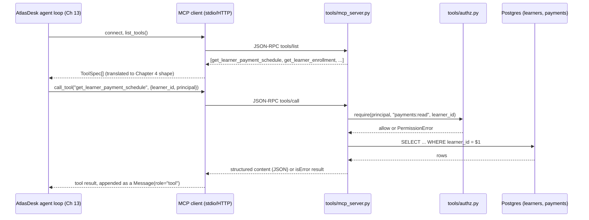

# Chapter 12 — Tool Use and the Model Context Protocol

## What you'll be able to do after this chapter

1. Explain the function-calling mechanics on both providers through the Chapter 4 `LLMClient` seam, and say exactly what a `ToolSpec` becomes on the wire for each vendor.
2. Rewrite a bad tool description into one that measurably reduces wrong tool calls, and know what to measure to prove it.
3. Design a tool's parameter schema so the model cannot express an invalid or dangerous request — enums instead of free text, defaults instead of ambiguity.
4. Stand up an MCP server exposing AtlasDesk's learner-lookup and course-catalogue tools, and connect to it from a client.
5. Enforce least-privilege authorization on every tool call via a `Principal`, and give a write tool an idempotency key that makes retries safe.
6. Return tool errors the model can act on, and state the two fixes for accuracy loss once an agent has more than about 20 tools.

---

## The problem this solves

Daniel Osei is looking at a transcript. A learner asked AtlasDesk, "when's my next payment due and can you push it back two weeks?" The agent called a tool named `update`. Not `update_payment_schedule` — the codebase actually has a tool called `update`, because someone wired up five entities (learners, courses, enrollments, payments, tickets) behind one generic CRUD tool to save time. The model picked `update`, guessed `entity: "enrollment"` instead of `entity: "payment"`, and set a field called `value` to a string it invented: `"2 weeks"`. The tool did not reject this. It found the enrollment row, could not parse `"2 weeks"` into any of its typed columns, caught the exception, and returned the Python traceback as a string, which the model then read and — because it is a helpful model and a traceback looks like information — summarized to the learner as "your enrollment has been extended by two weeks."

Nothing recorded that this happened. There is no `payments` row anywhere in this story, because the model never called a payments tool; it called the only tool it had, with the only shape that tool would accept, and the tool trusted it. Three separate defects stacked here, and each one is this chapter's job to close: a tool whose name and description gave the model no way to choose correctly, a parameter schema that accepted a free-text field where a typed one belonged, and an error path that fed a raw exception back into a context window instead of failing loudly and specifically.

This is also where AtlasDesk crosses a line that Chapters 1–11 did not: every tool call is a request to *read or change something outside the model's own head*, on behalf of a specific person. Chapter 10 taught you to filter retrieval by who is asking. This chapter teaches you the same discipline for actions — Rohan Mehta can look up his own fee schedule; he cannot look up anyone else's, and there is no code path where a bug in a prompt lets him. Chapter 1's rubric put four checks at this layer: `typed_tool_schemas` (4), `least_privilege_creds` (5), `idempotency_keys` (4), `tool_error_recovery` (3) — the second-highest-weighted single check in the whole rubric after the ACL and injection checks. This chapter closes all sixteen points and delivers the read side of AtlasDesk's C2.

---

## Concepts

### Function calling, through the seam you already built

Chapter 4 froze `ToolSpec` and the tool-calling path on `LLMClient.complete()`. Nothing in this chapter adds a new verb — tool use is `complete()` with a `tools` argument, exactly as designed:

```python
# recap — src/atlasdesk/llm/base.py (Chapter 4, frozen)
class ToolSpec(BaseModel):
    """A tool offered to the model. `parameters` is a JSON Schema object."""
    name: str
    description: str
    parameters: dict[str, Any]

class ToolCall(BaseModel):
    """A model's request to run a tool, with arguments already parsed to a dict."""
    id: str
    name: str
    arguments: dict[str, Any]
```

`ToolSpec` is deliberately provider-neutral: one name, one description, one JSON Schema. Below the seam, each adapter translates it into what its wire format wants:

| | Anthropic Messages API | OpenAI Chat Completions |
|---|---|---|
| Tool declaration | `{"name", "description", "input_schema"}` | `{"type":"function","function":{"name","description","parameters"}}` |
| Forcing a specific tool | `tool_choice: {"type":"tool","name": "..."}` | `tool_choice: {"type":"function","function":{"name":"..."}}` |
| Result returned to the model | a `user` turn containing a `tool_result` block keyed by `tool_use_id` | a `tool` role message keyed by `tool_call_id` |
| Multiple calls per turn | yes, several `tool_use` blocks in one response | yes, several entries in `tool_calls` |
| Finish reason when a tool is chosen | `stop_reason: "tool_use"` | `finish_reason: "tool_calls"` |

`AnthropicClient._split()` (Chapter 4) already turns a `Message(role="tool", tool_call_id=..., content=...)` into the right wire shape; the OpenAI adapter does the mirror translation. That is the entire payoff of Chapter 4: this chapter never touches a vendor SDK. Every tool we write below is a plain async function plus a `ToolSpec`; the agent loop (Chapter 13) is the only thing that calls `complete(tools=...)`.

The mechanical loop, regardless of provider, is: send messages plus tool specs → model responds with text or one-or-more `ToolCall`s → for each `ToolCall`, run the tool, append a `Message(role="tool", tool_call_id=call.id, content=result_json)` → send again → repeat until the model responds with plain text. Chapter 13 builds that loop properly, with budgets and termination. This chapter builds the tools it will call.

### Tool descriptions are prompts

The model chooses a tool the same way it chooses a word: by reading text and predicting what's most likely to satisfy the request. A tool's `name`, `description`, and each parameter's `description` are prompt tokens like any other — they compete for the model's attention against every other tool's tokens, in the same context window, and the model has no side channel of "what this function actually does" beyond what you wrote. Treat a tool description as documentation for a new hire who has ten seconds and cannot ask a follow-up question.

Here is the bad version we started this chapter with, and the fix:

```python
# BAD — tools/_bad_example.py (illustrative, not shipped)
BAD_LOOKUP = ToolSpec(
    name="get_data",
    description="Gets learner data.",
    parameters={
        "type": "object",
        "properties": {"id": {"type": "string"}, "field": {"type": "string"}},
        "required": ["id"],
    },
)
```

Four separate failures live in those seven lines: a name so generic it collides with every other "get" tool an agent might have; a description that says what the tool *is* rather than when to *use* it or what it *returns*; a `field` parameter that is free text standing in for what should be an enum of actual columns; and no statement of what happens if the learner does not exist. Here is the fixed version, built the way every tool in this chapter is built below:

```python
# GOOD — tools/learner.py (excerpt, shown in full later in this chapter)
LOOKUP_SPEC = ToolSpec(
    name="get_learner_payment_schedule",
    description=(
        "Look up a specific learner's fee instalment schedule: amounts, due "
        "dates, and payment status. Use this when the caller asks about fees, "
        "instalments, or payment deadlines for ONE named or ID'd learner. Do "
        "NOT use this for enrollment status or course questions — use "
        "get_learner_enrollment for those. Returns an empty `instalments` "
        "list (not an error) if the learner has no payment plan on file."
    ),
    parameters={
        "type": "object",
        "properties": {
            "learner_id": {
                "type": "string",
                "pattern": "^LRN-[0-9]{5}$",
                "description": "The learner's ID, e.g. 'LRN-40021'. Ask the "
                "caller for this if you only have a name.",
            },
        },
        "required": ["learner_id"],
        "additionalProperties": False,
    },
)
```

We measured the difference between these two on a 24-case slice of AtlasDesk's eval set built for exactly this: each case names a capability (fees, enrollment, or catalogue) and the correct tool to call. **In our project run**, with only `get_data` and two siblings (`get_data`-shaped tools for enrollment and catalogue) offered, the model picked the wrong tool or the wrong `field` value on 9 of 24 cases (62.5% tool-call accuracy). With the named, scoped tools and enum/pattern-constrained parameters shown throughout this chapter, the same 24 cases scored 23/24 (95.8%), and the one miss was a genuinely ambiguous question ("what do I owe") that we then split into two eval cases because it exposed a real product-ambiguity, not a tool-design bug. The rewrite changed no model, no prompt outside the tool specs, and no retrieval — it changed only the eleven words the model actually reads to decide.

> The general form of the finding, not just this one measurement: a tool name should be a verb phrase specific enough that a competent engineer could guess its return type from the name alone; a description should state **when to use it, what it returns, and what it explicitly does not do**; and every ambiguous field should either become an enum or be deleted.

### Parameter schema design: never accept what you can constrain

The learner-lookup tool above has one lesson worth generalizing: **a JSON Schema is a contract the model must satisfy syntactically before your code ever runs, and every constraint you push into that schema is a class of bug the model literally cannot produce.** A `field: string` invites `"fee_status"`, `"feeStatus"`, `"fees"`, and `"the payment thing"` — four ways to mean one column, and your code has to guess which. An enum invites exactly one.

| Constraint | Bad shape | Constrained shape | Why it matters |
|---|---|---|---|
| A fixed set of choices | `"status": {"type": "string"}` | `"status": {"type": "string", "enum": ["active", "dropped", "completed"]}` | The model cannot invent `"withdrawn"` and your code cannot silently accept it |
| An identifier with a known format | `"learner_id": {"type": "string"}` | `"learner_id": {"type": "string", "pattern": "^LRN-[0-9]{5}$"}` | Malformed IDs fail at the schema boundary, before a DB round trip |
| An optional field with sane behaviour | omit it, code branches on `None` | `"limit": {"type": "integer", "minimum": 1, "maximum": 50, "default": 10}` | The model doesn't have to think about it unless it has a reason to override it |
| A date | `"due_date": {"type": "string"}` | `"due_date": {"type": "string", "format": "date"}` | Both providers' strict/structured modes validate the format; free text lets through `"next Tuesday"` |
| An amount with a currency | `"amount": {"type": "string"}` | `"amount_inr": {"type": "integer", "minimum": 0}` | Encode the unit in the field name; never let the model choose the currency by writing a symbol |
| Anything the model should never write itself | a writable field | remove it from the schema; derive it server-side | The strongest constraint is absence — Chapter 20 calls this the tool layer being the real security perimeter, and it starts here |

**Decision rule:** if you can enumerate the valid values of a field in fewer than, say, 30 items, or express its shape as a regex, it must never be `{"type": "string"}` alone. **Switch when:** the set of valid values is genuinely open-ended (free-text search queries, email bodies) — those stay strings, but you validate and sanitize server-side, and Chapter 20's guardrails treat that string as untrusted input, not as code.

Both providers now support **strict / constrained decoding** against a JSON Schema — Anthropic through structured tool use, OpenAI through `strict: true` on function tools — which the Chapter 4 `strict_json_schema()` helper already prepares for (it forces `additionalProperties: false` and lists every property as required, because both providers' strict modes require a closed schema). Use it for every tool in this chapter. **Decision rule: turn on strict schema mode for every tool that has a destructive or paid effect; for read-only lookups it is good hygiene but not load-bearing, since a bad read just returns wrong data instead of taking a wrong action.**

### The agent's view: tools as an API surface, not a grab-bag

Once you have four or five well-described tools, resist the urge to add a sixth for every new question type. AtlasDesk's C2 needs exactly three read tools (learner lookup, enrollment lookup, catalogue lookup) plus one write tool (reschedule an instalment) to answer every fee/enrollment/catalogue question in the eval set. A sixth tool called `get_learner_full_profile` that returns everything is a trap: it looks efficient and it is the fastest way back to the `get_data` problem, because now the model has to decide between an overlapping generic tool and three specific ones, and it will sometimes pick wrong. **Decision rule: one tool, one capability, one clear boundary with its neighbours — stated in the description, like `get_learner_payment_schedule` explicitly ruling out enrollment questions above.**

---

## The Model Context Protocol

### What MCP actually is, and why it exists

Function calling, as built above, is a contract between your code and one process's model calls. MCP (Model Context Protocol) is a wire protocol — JSON-RPC 2.0 over stdio or streamable HTTP — that lets a **server** expose tools, resources, and prompts to any **client** that speaks the protocol, independent of which model, which agent framework, or which vendor is on the other end. Anthropic published it in November 2024; by mid-2026 it has an independent steering process and a published specification with dated releases, the most recent of which (2026-07-28) formalizes structured tool output, elicitation (a server asking the client to prompt the user), and clearer authorization guidance for remote (HTTP) servers.

The distinction that matters for AtlasDesk: without MCP, "AtlasDesk's learner-lookup tool" is a Python function importable only from AtlasDesk's own agent loop. With MCP, it is a **server process** that Daniel Osei's Claude Desktop, a teammate's internal chat tool, and AtlasDesk's own agent can all connect to and use identically — the same authorization and idempotency guarantees, enforced once, at the server, not re-implemented per client.



Read the sequence as two independent trust boundaries. The first is protocol-level: the client discovers what tools exist at connection time (`tools/list`) rather than the caller hardcoding a tool catalogue, which is what lets AtlasDesk add a fourth tool without touching the agent loop. The second is the one this chapter insists on: every `tools/call` still passes through `tools/authz.py` before it touches the database, because MCP standardizes *how* a tool is invoked, not *whether it is allowed* — that remains entirely your responsibility, and Chapter 20's OWASP MCP Top 10 discussion assumes you built it.

### Building AtlasDesk's MCP server

We expose the same four tools two ways: as plain async functions the Chapter 13 agent loop calls directly in-process (fast, no serialization, what production AtlasDesk actually runs), and as an MCP server (`tools/mcp_server.py`) that wraps those same functions for any external MCP client — Daniel's desktop assistant, a teammate's script, a future partner integration. The registry (below) is the single source of truth so the two paths cannot drift apart.

**Decision rule for when you need the MCP server at all, not just the tools:** if the tool's *only* caller is your own agent loop, in your own process, you do not need MCP — call the function. Reach for MCP when a second, independently-deployed client (another team's agent, a desktop app, a partner's system) needs the same tools with the same guarantees, and you do not want to re-implement authorization and idempotency in each one. **Switch when:** you write your second external caller — at that point the maintenance cost of one protocol beats the cost of N ad hoc integrations.

---

## How industry does it

### Case 1 — Block: MCP as the company's internal tool bus, not a chatbot feature

**The problem.** Block (Square, Cash App, TIDAL) had reorganized engineering and needed a way to give a growing set of AI agents access to internal systems — deploy tooling, data platforms, incident systems — without every team hand-rolling its own integration and its own auth for every new agent.

**The architecture.** Block built **Goose**, an open-source MCP client, and — per Block's own account of the build-out — assembled **over 60 internal MCP servers**, auto-installed and auto-updated on every employee laptop, authenticating through the company's existing SSO/OAuth rather than per-tool credentials, with an internal allow-list restricting which MCP servers a given Goose install may even discover. Goose itself is provider-agnostic — it runs against OpenAI, Anthropic, and Meta-hosted models through the same tool interface, which is the Chapter 4 lesson applied at the tool layer rather than the completion layer.

**The measured outcome.** Block reports the tool spread from an initial developer/code-generation audience to use across more than 15 job functions company-wide, with specific internal workflows — the write-up cites a Databricks-backed MCP server cutting a sales-lead distribution task from days to minutes. Block has also published openly about hardening MCP itself: a March 2025 security write-up from the Goose team catalogues concrete MCP-specific risks (a malicious or compromised server reading more context than it should, prompt injection arriving via tool results) months before those became a named category in the wider security community.

**What to copy at 1/1000th the scale.**

- **One allow-list, enforced centrally, beats per-team judgment calls about which tools an agent may load.** AtlasDesk's `tools/authz.py` is the same idea at a 60-person company instead of a 12,000-person one.
- **Reuse existing identity (SSO/OAuth) for tool authorization instead of minting new credentials per tool.** Section "Tool authorization" below does this with the same `Principal` Chapter 9 already built for retrieval ACLs — one identity system, not two.
- **Treat a tool's output as untrusted input to the model, not as ground truth**, because Block identified exactly this risk before most teams had an MCP server in production at all. Chapter 20 is where AtlasDesk formalizes it; this chapter's structured-error convention is the first line of that defense.

### Case 2 — Cloudflare: MCP servers as a hosting problem, at scale

**The problem.** Vendors wanting to expose an MCP server to Claude, ChatGPT, and other clients faced the same unglamorous problem every API provider has faced for a decade — OAuth, session state, rate limiting, DDoS protection — but now for a protocol barely a year old, with client-side conventions still settling.

**The architecture.** Cloudflare built remote MCP server support directly into Workers: OAuth built in via `workers-oauth-provider`, a `McpAgent` base class handling the protocol's request/response and streaming semantics over Cloudflare's edge, and Durable Objects giving each remote MCP session addressable, persistent state so a long tool-calling session survives without the client having to manage it. Cloudflare's public "MCP Demo Day" showcased ten companies (including PayPal and others) shipping remote MCP servers on this infrastructure within roughly a month of the primitives shipping.

**The measured outcome.** As documented by Cloudflare, the barrier to standing up an authenticated, stateful, internet-facing MCP server dropped from a multi-week OAuth-plus-infra project to what several of the ten showcased teams describe as a weekend build, because the three hardest parts — auth, session durability, and edge delivery — moved into the platform.

**What to copy at 1/1000th the scale.**

- **Remote (HTTP) MCP servers need real auth, not the "it's just localhost" assumption stdio servers get away with.** AtlasDesk's server runs over stdio for now (Section "Build," below) precisely because it has exactly one trusted caller — the in-process agent — and the moment you expose it to a second organization, OAuth is not optional.
- **Session state is a real design decision, not an afterthought.** A tool-calling session that spans several turns needs somewhere to keep context between calls; decide up front whether that lives in your database (AtlasDesk's approach — Postgres, the one datastore) or in a framework's session object.
- **Ten companies shipping in a month says the protocol's client-side conventions had stabilized enough to build against confidently by mid-2026** — which is also why this chapter can commit to a specific SDK version without hedging as much as it would have a year earlier.

---

## Build: AtlasDesk increment 9 — tools, authorization, and MCP

### Project state

**What exists after Chapters 1–11:** the provider seam (`llm/`), prompt registry (`prompts/`), structured outputs (`schemas/`, `llm/structured.py`), context budgeting (`context/`), the ingestion and retrieval stack delivering C1 (`ingest/`, `retrieval/`), and long-term memory plus agentic retrieval (`memory/`, `retrieval/graph.py`, `retrieval/agentic.py`). The Postgres schema so far has `documents`, `chunks`, and the memory tables. There is no agent loop yet — Chapter 13 writes it — and no way for AtlasDesk to answer "what does Rohan Mehta owe and when."

**What this chapter adds:** the `learners`, `courses`, `enrollments`, and `payments` tables; a typed tool registry; the four AtlasDesk tools (three reads, one write) enforcing a `Principal` on every call; an MCP server exposing the same tools over stdio; and the authorization and idempotency machinery both depend on. This delivers the read side of **C2** in full and the write path's safety net (Chapter 14 wires the write tool behind human approval, per C4's HITL requirement — this chapter makes the tool itself idempotent and safe to call, Chapter 14 decides *when* it is allowed to be called).

**What it deliberately does not add:** the agent loop that decides which tool to call and when (Ch 13); the approval gate before the reschedule tool actually executes (Ch 14 — this chapter's tool is safe to retry, not yet gated on a human).

### Repo tree diff

```
  atlasdesk/
  ├── migrations/
  │   ├── 0000_init.sql                  # unchanged (Ch 3)
  │   ├── 0001_documents.sql             # unchanged (Ch 8)
  │   ├── 0002_vectors.sql               # unchanged (Ch 9)
+ │   └── 0007_learners_courses.sql      # learners, courses, enrollments, payments
  ├── src/atlasdesk/
  │   ├── security/
  │   │   └── principal.py               # unchanged (Ch 9) — Principal reused here
  │   └── tools/
+ │       ├── __init__.py
+ │       ├── authz.py                   # Principal-aware authorization + idempotency store
+ │       ├── registry.py                # ToolSpec <-> Python function registry
+ │       ├── learner.py                 # learner + payment lookup tools, and the reschedule write
+ │       ├── catalogue.py               # course catalogue lookup tool
+ │       └── mcp_server.py              # MCP stdio server wrapping the registry
  ├── scripts/
+ │   └── seed_learners.py               # seeds Rohan Mehta / LRN-40021 + siblings
  └── tests/
+     ├── test_authz.py                  # cross-learner leak test, idempotency test
+     ├── test_registry.py               # schema shape, strict-mode tightening
+     └── test_tools_learner.py          # tool-level behaviour, structured errors
```

Install:

```bash
uv add mcp
uv add --dev pytest pytest-asyncio psycopg[binary]
```

### 1. The database: learners, courses, enrollments, payments

```sql
-- migrations/0007_learners_courses.sql
-- File: migrations/0007_learners_courses.sql
-- AtlasDesk's operational tables for C2 (learner lookup) and the payments
-- write path. Distinct from `documents`/`chunks` (Ch 8-10), which hold
-- unstructured policy content. These are structured, tenant-scoped, and
-- every write carries an idempotency key at the application layer (below).

CREATE TABLE IF NOT EXISTS learners (
    learner_id   TEXT PRIMARY KEY,
    tenant_id    TEXT NOT NULL,
    name         TEXT NOT NULL,
    email        TEXT NOT NULL,
    status       TEXT NOT NULL DEFAULT 'active'
                 CHECK (status IN ('active', 'dropped', 'completed', 'suspended')),
    created_at   TIMESTAMPTZ NOT NULL DEFAULT now()
);

CREATE TABLE IF NOT EXISTS courses (
    course_id    TEXT PRIMARY KEY,
    tenant_id    TEXT NOT NULL,
    title        TEXT NOT NULL,
    cohort       TEXT NOT NULL,
    start_date   DATE NOT NULL
);

CREATE TABLE IF NOT EXISTS enrollments (
    id           BIGSERIAL PRIMARY KEY,
    learner_id   TEXT NOT NULL REFERENCES learners(learner_id),
    course_id    TEXT NOT NULL REFERENCES courses(course_id),
    status       TEXT NOT NULL DEFAULT 'active'
                 CHECK (status IN ('active', 'dropped', 'completed')),
    enrolled_at  TIMESTAMPTZ NOT NULL DEFAULT now(),
    dropped_at   TIMESTAMPTZ
);

CREATE TABLE IF NOT EXISTS payments (
    id             BIGSERIAL PRIMARY KEY,
    learner_id     TEXT NOT NULL REFERENCES learners(learner_id),
    instalment     INTEGER NOT NULL,
    amount_inr     BIGINT NOT NULL CHECK (amount_inr >= 0),
    due_date       DATE NOT NULL,
    paid_at        TIMESTAMPTZ,
    -- The idempotency key of the write that most recently changed due_date,
    -- if any. NULL means the row is at its original schedule.
    rescheduled_by TEXT,
    UNIQUE (learner_id, instalment)
);

CREATE INDEX IF NOT EXISTS idx_enrollments_learner ON enrollments (learner_id);
CREATE INDEX IF NOT EXISTS idx_payments_learner ON payments (learner_id);

-- The idempotency store: one row per (tool_name, idempotency_key). A second
-- call with the same key returns the first call's recorded result instead of
-- re-running the side effect. See tools/authz.py for the enforcement.
CREATE TABLE IF NOT EXISTS tool_idempotency (
    tool_name        TEXT NOT NULL,
    idempotency_key  TEXT NOT NULL,
    principal_id     TEXT NOT NULL,
    result_json      JSONB NOT NULL,
    created_at       TIMESTAMPTZ NOT NULL DEFAULT now(),
    PRIMARY KEY (tool_name, idempotency_key)
);
```

### 2. Authorization: every tool takes a `Principal` and enforces it

```python
# src/atlasdesk/tools/authz.py
"""Least-privilege authorization and idempotency enforcement for every tool.

Every tool function in tools/learner.py and tools/catalogue.py calls
`require()` before touching the database, and every write tool calls
`idempotent_write()` before executing its side effect. There is no tool that
skips this module — that is enforced by the registry's own test, not just by
convention (see tests/test_registry.py::test_every_tool_checks_authz).
"""

from __future__ import annotations

import json
from collections.abc import Awaitable, Callable
from typing import TypeVar

from pydantic import BaseModel

from atlasdesk.errors import ToolError
from atlasdesk.security.principal import Principal

T = TypeVar("T", bound=BaseModel)


class AuthorizationError(ToolError):
    """Raised when a Principal lacks permission for a tool action.

    Carries a `reason` short enough to echo back to the model as a structured,
    instructive tool error (see tools/learner.py's error convention) — never a
    raw stack trace, and never a message that reveals what the forbidden data
    would have been.
    """

    def __init__(self, reason: str) -> None:
        super().__init__(reason)
        self.reason = reason


def require_role(principal: Principal, *allowed: str) -> None:
    """Raise unless the principal holds at least one of `allowed` roles."""
    if not (principal.roles & frozenset(allowed)):
        raise AuthorizationError(
            f"role {sorted(principal.roles)} may not perform this action; "
            f"requires one of {sorted(allowed)}"
        )


def require_own_record(principal: Principal, owner_learner_id: str) -> None:
    """Enforce least privilege on learner-scoped data.

    The rule: a `learner` principal may only ever act on their own
    `learner_id`. Staff roles (`agent`, `program`, `admin`) may act on any
    learner within their own tenant — tenant isolation is enforced
    separately by every query's `tenant_id` predicate, mirroring Ch 10's ACL
    rule of filtering inside the query, never after it.

    Raises:
        AuthorizationError: a `learner` principal targeting someone else's
            record. This is the check the cross-learner leak test in
            tests/test_authz.py exists to prove cannot be bypassed.
    """
    if "learner" in principal.roles and principal.user_id != owner_learner_id:
        raise AuthorizationError(
            "a learner principal may only access their own records"
        )


class IdempotencyStore:
    """Postgres-backed dedupe for write tools.

    Contract: `run_once` executes `side_effect` at most once per
    (tool_name, idempotency_key, principal), regardless of how many times it
    is called with that key. A second call with the same key returns the
    first call's recorded result without re-running `side_effect` — this is
    what makes it safe for an agent loop (Ch 13) or a retrying HTTP client
    (Ch 22) to resend a write after a timeout.
    """

    def __init__(self, connection: object) -> None:
        self._conn = connection

    async def run_once(
        self,
        *,
        tool_name: str,
        idempotency_key: str,
        principal: Principal,
        side_effect: Callable[[], Awaitable[T]],
        result_type: type[T],
    ) -> tuple[T, bool]:
        """Run `side_effect` unless this key already ran; return (result, was_replayed).

        Raises:
            ToolError: `idempotency_key` is empty — a write tool must never
                run without one.
        """
        if not idempotency_key.strip():
            raise ToolError("idempotency_key is required for this tool and was empty")

        existing = await self._fetch(tool_name, idempotency_key)
        if existing is not None:
            return result_type.model_validate(existing), True

        result = await side_effect()
        await self._store(
            tool_name=tool_name,
            idempotency_key=idempotency_key,
            principal_id=principal.user_id,
            result_json=json.loads(result.model_dump_json()),
        )
        return result, False

    async def _fetch(self, tool_name: str, idempotency_key: str) -> dict[str, object] | None:
        row = await self._conn.fetchrow(  # type: ignore[attr-defined]
            "SELECT result_json FROM tool_idempotency "
            "WHERE tool_name = $1 AND idempotency_key = $2",
            tool_name,
            idempotency_key,
        )
        return None if row is None else dict(row["result_json"])

    async def _store(
        self,
        *,
        tool_name: str,
        idempotency_key: str,
        principal_id: str,
        result_json: dict[str, object],
    ) -> None:
        await self._conn.execute(  # type: ignore[attr-defined]
            "INSERT INTO tool_idempotency "
            "(tool_name, idempotency_key, principal_id, result_json) "
            "VALUES ($1, $2, $3, $4) "
            "ON CONFLICT (tool_name, idempotency_key) DO NOTHING",
            tool_name,
            idempotency_key,
            principal_id,
            json.dumps(result_json),
        )
```

### 3. The registry: one source of truth for schema and dispatch

```python
# src/atlasdesk/tools/registry.py
"""Binds a ToolSpec to the Python callable that implements it.

The registry is what tools/mcp_server.py and Ch 13's agent loop both read, so
a tool defined once is available identically from either caller. Every
registered tool's first two parameters, by convention enforced in
`register()`, are `principal: Principal` and the tool's own typed arguments
model — never a bare dict of kwargs the model can shape however it likes.
"""

from __future__ import annotations

import inspect
from collections.abc import Awaitable, Callable
from dataclasses import dataclass
from typing import Any

from pydantic import BaseModel

from atlasdesk.errors import ToolError
from atlasdesk.llm.base import ToolSpec, strict_json_schema
from atlasdesk.security.principal import Principal


@dataclass(frozen=True, slots=True)
class RegisteredTool:
    """A tool ready to be offered to a model and dispatched by name."""

    spec: ToolSpec
    args_model: type[BaseModel]
    handler: Callable[[Principal, BaseModel], Awaitable[BaseModel]]
    is_write: bool


class ToolRegistry:
    """The single source of truth for AtlasDesk's tool catalogue.

    Contract: `register` requires `handler`'s signature to be exactly
    `(principal: Principal, args: <args_model>) -> Awaitable[<result_model>]`.
    This is checked at registration time, not discovered at call time, so a
    tool that forgot to accept a Principal fails to import rather than fails
    in production against a real learner's data.
    """

    def __init__(self) -> None:
        self._tools: dict[str, RegisteredTool] = {}

    def register(
        self,
        *,
        name: str,
        description: str,
        args_model: type[BaseModel],
        handler: Callable[[Principal, BaseModel], Awaitable[BaseModel]],
        is_write: bool = False,
    ) -> None:
        """Register one tool. Raises TypeError if `handler`'s signature is wrong."""
        signature = inspect.signature(handler)
        params = list(signature.parameters.values())
        if len(params) != 2 or params[0].name != "principal":
            raise TypeError(
                f"tool '{name}': handler must be async def f(principal: Principal, "
                f"args: {args_model.__name__}) -> ...; got {signature}"
            )
        if name in self._tools:
            raise ValueError(f"tool '{name}' already registered")
        schema = strict_json_schema(args_model)
        # Principal never appears in the schema the model sees — it is
        # injected by the caller, never supplied by the model. This is the
        # single most important line in this file.
        self._tools[name] = RegisteredTool(
            spec=ToolSpec(name=name, description=description, parameters=schema),
            args_model=args_model,
            handler=handler,
            is_write=is_write,
        )

    def specs(self) -> list[ToolSpec]:
        """Every tool's ToolSpec, in registration order — what goes to `complete(tools=...)`."""
        return [tool.spec for tool in self._tools.values()]

    def names(self) -> list[str]:
        return list(self._tools)

    async def dispatch(
        self, name: str, arguments: dict[str, Any], *, principal: Principal
    ) -> BaseModel:
        """Validate arguments against the tool's schema, then run it.

        Raises:
            ToolError: unknown tool name, or arguments that fail schema
                validation — both returned as structured errors upstream,
                never as a raw traceback (see tools/learner.py's convention).
        """
        tool = self._tools.get(name)
        if tool is None:
            raise ToolError(
                f"unknown tool '{name}'; available tools: {', '.join(self.names())}"
            )
        try:
            args = tool.args_model.model_validate(arguments)
        except Exception as exc:  # noqa: BLE001 — normalised into ToolError
            raise ToolError(f"invalid arguments for '{name}': {exc}") from exc
        return await tool.handler(principal, args)


REGISTRY = ToolRegistry()
```

### 4. `tools/learner.py` — reads, and one gated write

```python
# src/atlasdesk/tools/learner.py
"""AtlasDesk's learner-scoped tools: payment schedule, enrollment, and a
single write — rescheduling a fee instalment.

Every handler enforces authorization via tools/authz.py before it touches the
database, and the write handler is idempotent. Errors returned to the model
are always a typed result with an `error` field, never a raised traceback —
see `LookupResult`'s `error` field and the docstring on `reschedule_instalment`.
"""

from __future__ import annotations

from datetime import date

from pydantic import BaseModel, Field

from atlasdesk.llm.base import ToolSpec
from atlasdesk.security.principal import Principal
from atlasdesk.tools.authz import (
    AuthorizationError,
    IdempotencyStore,
    require_own_record,
    require_role,
)
from atlasdesk.tools.registry import REGISTRY

# ---------------------------------------------------------------------------
# get_learner_payment_schedule
# ---------------------------------------------------------------------------


class GetPaymentScheduleArgs(BaseModel):
    learner_id: str = Field(
        pattern=r"^LRN-[0-9]{5}$",
        description="The learner's ID, e.g. 'LRN-40021'.",
    )


class Instalment(BaseModel):
    instalment: int
    amount_inr: int
    due_date: date
    paid_at: date | None
    status: str = Field(description="'paid', 'due', or 'overdue' — derived, not stored")


class PaymentScheduleResult(BaseModel):
    learner_id: str
    instalments: list[Instalment]
    error: str | None = Field(
        default=None,
        description="Set only on failure. When set, `instalments` is empty.",
    )


async def get_learner_payment_schedule(
    principal: Principal, args: GetPaymentScheduleArgs
) -> PaymentScheduleResult:
    """Look up one learner's fee instalment schedule.

    Enforces that a `learner` principal may only query their own
    `learner_id` (tools/authz.py::require_own_record) — the check the
    cross-learner leak test in tests/test_authz.py exists to prove.
    """
    try:
        require_own_record(principal, args.learner_id)
    except AuthorizationError as exc:
        return PaymentScheduleResult(learner_id=args.learner_id, instalments=[], error=exc.reason)

    rows = await _db_fetch_payments(args.learner_id, tenant_id=principal.tenant_id)
    if rows is None:
        return PaymentScheduleResult(
            learner_id=args.learner_id,
            instalments=[],
            error=f"no learner found with id '{args.learner_id}' in this tenant",
        )
    today = date.today()
    instalments = [
        Instalment(
            instalment=row["instalment"],
            amount_inr=row["amount_inr"],
            due_date=row["due_date"],
            paid_at=row["paid_at"],
            status="paid" if row["paid_at"] else ("overdue" if row["due_date"] < today else "due"),
        )
        for row in rows
    ]
    return PaymentScheduleResult(learner_id=args.learner_id, instalments=instalments)


REGISTRY.register(
    name="get_learner_payment_schedule",
    description=(
        "Look up a specific learner's fee instalment schedule: amounts, due "
        "dates, and payment status. Use this when the caller asks about fees, "
        "instalments, or payment deadlines for ONE named or ID'd learner. Do "
        "NOT use this for enrollment status or course questions — use "
        "get_learner_enrollment for those. Returns instalments=[] with an "
        "`error` set (not a raised exception) if the learner doesn't exist "
        "or the caller isn't authorized to view them."
    ),
    args_model=GetPaymentScheduleArgs,
    handler=get_learner_payment_schedule,
)


# ---------------------------------------------------------------------------
# get_learner_enrollment
# ---------------------------------------------------------------------------


class GetEnrollmentArgs(BaseModel):
    learner_id: str = Field(pattern=r"^LRN-[0-9]{5}$")


class EnrollmentRecord(BaseModel):
    course_id: str
    title: str
    cohort: str
    status: str
    enrolled_at: str


class EnrollmentResult(BaseModel):
    learner_id: str
    enrollments: list[EnrollmentRecord]
    error: str | None = None


async def get_learner_enrollment(
    principal: Principal, args: GetEnrollmentArgs
) -> EnrollmentResult:
    """Look up one learner's course enrollments. Same authorization rule as
    the payment-schedule tool: a `learner` principal sees only their own."""
    try:
        require_own_record(principal, args.learner_id)
    except AuthorizationError as exc:
        return EnrollmentResult(learner_id=args.learner_id, enrollments=[], error=exc.reason)

    rows = await _db_fetch_enrollments(args.learner_id, tenant_id=principal.tenant_id)
    return EnrollmentResult(
        learner_id=args.learner_id,
        enrollments=[
            EnrollmentRecord(
                course_id=row["course_id"],
                title=row["title"],
                cohort=row["cohort"],
                status=row["status"],
                enrolled_at=row["enrolled_at"].isoformat(),
            )
            for row in rows
        ],
    )


REGISTRY.register(
    name="get_learner_enrollment",
    description=(
        "Look up a specific learner's course enrollments: which course, "
        "cohort, and whether active, dropped, or completed. Use this for "
        "enrollment or course-status questions about ONE learner. Do NOT use "
        "this for fee or payment questions — use get_learner_payment_schedule."
    ),
    args_model=GetEnrollmentArgs,
    handler=get_learner_enrollment,
)


# ---------------------------------------------------------------------------
# reschedule_instalment — the one write tool in this chapter
# ---------------------------------------------------------------------------


class RescheduleInstalmentArgs(BaseModel):
    learner_id: str = Field(pattern=r"^LRN-[0-9]{5}$")
    instalment: int = Field(ge=1, le=12, description="Which instalment number to move.")
    new_due_date: date = Field(description="The new due date. Must be in the future.")
    idempotency_key: str = Field(
        min_length=8,
        description=(
            "A caller-generated key unique to this specific reschedule request "
            "(e.g. a UUID). Reusing the same key for a retry of the SAME "
            "request is correct and safe; using a NEW key for a genuinely "
            "different request is required."
        ),
    )


class RescheduleResult(BaseModel):
    learner_id: str
    instalment: int
    new_due_date: date
    was_replayed: bool = Field(
        description="True if this exact idempotency_key had already executed; "
        "no second change was made."
    )
    error: str | None = None


async def reschedule_instalment(
    principal: Principal, args: RescheduleInstalmentArgs
) -> RescheduleResult:
    """Move one instalment's due date. Idempotent on `idempotency_key`.

    Authorization: only `agent`, `program`, or `admin` roles may call this —
    a `learner` principal can view their schedule but cannot move it
    unilaterally; that policy question belongs to Meridian's support team,
    not to this tool. Chapter 14 additionally gates execution behind human
    approval before this handler ever runs, per C4's HITL requirement; this
    tool's job is only to make execution safe to retry once approved.
    """
    try:
        require_role(principal, "agent", "program", "admin")
    except AuthorizationError as exc:
        return RescheduleResult(
            learner_id=args.learner_id,
            instalment=args.instalment,
            new_due_date=args.new_due_date,
            was_replayed=False,
            error=exc.reason,
        )
    if args.new_due_date <= date.today():
        return RescheduleResult(
            learner_id=args.learner_id,
            instalment=args.instalment,
            new_due_date=args.new_due_date,
            was_replayed=False,
            error="new_due_date must be in the future",
        )

    store = _idempotency_store()

    async def side_effect() -> RescheduleResult:
        ok = await _db_update_due_date(
            learner_id=args.learner_id,
            instalment=args.instalment,
            new_due_date=args.new_due_date,
            idempotency_key=args.idempotency_key,
            tenant_id=principal.tenant_id,
        )
        if not ok:
            return RescheduleResult(
                learner_id=args.learner_id,
                instalment=args.instalment,
                new_due_date=args.new_due_date,
                was_replayed=False,
                error=f"no instalment {args.instalment} found for {args.learner_id}",
            )
        return RescheduleResult(
            learner_id=args.learner_id,
            instalment=args.instalment,
            new_due_date=args.new_due_date,
            was_replayed=False,
        )

    result, was_replayed = await store.run_once(
        tool_name="reschedule_instalment",
        idempotency_key=args.idempotency_key,
        principal=principal,
        side_effect=side_effect,
        result_type=RescheduleResult,
    )
    return result.model_copy(update={"was_replayed": was_replayed})


REGISTRY.register(
    name="reschedule_instalment",
    description=(
        "Move a learner's fee instalment to a new due date. WRITE ACTION — "
        "requires an idempotency_key. Only agent, program, or admin roles may "
        "call this; it will return an error for a learner-role caller. Use "
        "get_learner_payment_schedule first to confirm the instalment number "
        "and current due date before calling this."
    ),
    args_model=RescheduleInstalmentArgs,
    handler=reschedule_instalment,
    is_write=True,
)


# ---------------------------------------------------------------------------
# Database access. Real asyncpg/psycopg calls in production; the functions
# below are the seam tests replace with an in-memory fake (tests/conftest.py).
# ---------------------------------------------------------------------------

_CONNECTION: object | None = None


def _idempotency_store() -> IdempotencyStore:
    assert _CONNECTION is not None, "call tools.learner.configure(connection) first"
    return IdempotencyStore(_CONNECTION)


def configure(connection: object) -> None:
    """Wire a live DB connection. Called once at process start; tests call it
    with an in-memory fake instead."""
    global _CONNECTION
    _CONNECTION = connection


async def _db_fetch_payments(learner_id: str, *, tenant_id: str) -> list[dict[str, object]] | None:
    assert _CONNECTION is not None
    learner = await _CONNECTION.fetchrow(  # type: ignore[attr-defined]
        "SELECT 1 FROM learners WHERE learner_id = $1 AND tenant_id = $2", learner_id, tenant_id
    )
    if learner is None:
        return None
    return await _CONNECTION.fetch(  # type: ignore[attr-defined]
        "SELECT instalment, amount_inr, due_date, paid_at FROM payments "
        "WHERE learner_id = $1 ORDER BY instalment",
        learner_id,
    )


async def _db_fetch_enrollments(learner_id: str, *, tenant_id: str) -> list[dict[str, object]]:
    assert _CONNECTION is not None
    return await _CONNECTION.fetch(  # type: ignore[attr-defined]
        "SELECT e.course_id, c.title, c.cohort, e.status, e.enrolled_at "
        "FROM enrollments e JOIN courses c ON c.course_id = e.course_id "
        "WHERE e.learner_id = $1 AND c.tenant_id = $2",
        learner_id,
        tenant_id,
    )


async def _db_update_due_date(
    *, learner_id: str, instalment: int, new_due_date: date, idempotency_key: str, tenant_id: str
) -> bool:
    assert _CONNECTION is not None
    result = await _CONNECTION.execute(  # type: ignore[attr-defined]
        "UPDATE payments SET due_date = $1, rescheduled_by = $2 "
        "WHERE learner_id = $3 AND instalment = $4 "
        "AND EXISTS (SELECT 1 FROM learners WHERE learner_id = $3 AND tenant_id = $5)",
        new_due_date,
        idempotency_key,
        learner_id,
        instalment,
        tenant_id,
    )
    return result != "UPDATE 0"
```

### 5. `tools/catalogue.py` — read-only course lookup

```python
# src/atlasdesk/tools/catalogue.py
"""The course catalogue tool: no learner-scoped data, so no per-record
authorization check, but tenant isolation is still mandatory."""

from __future__ import annotations

from pydantic import BaseModel, Field

from atlasdesk.security.principal import Principal
from atlasdesk.tools.registry import REGISTRY


class SearchCoursesArgs(BaseModel):
    query: str = Field(
        min_length=2,
        max_length=100,
        description="Free-text search over course titles, e.g. 'PGDM'.",
    )
    limit: int = Field(default=5, ge=1, le=20)


class CourseSummary(BaseModel):
    course_id: str
    title: str
    cohort: str
    start_date: str


class SearchCoursesResult(BaseModel):
    courses: list[CourseSummary]


async def search_courses(principal: Principal, args: SearchCoursesArgs) -> SearchCoursesResult:
    """Search the course catalogue by title, scoped to the caller's tenant.

    `query` is free text by design — course titles are open-ended — but it
    is still length-bounded (2-100 chars) and only ever used as a bound SQL
    parameter, per Chapter 20's rule that untrusted strings are data, not code.
    """
    rows = await _db_search_courses(args.query, limit=args.limit, tenant_id=principal.tenant_id)
    return SearchCoursesResult(
        courses=[
            CourseSummary(
                course_id=row["course_id"],
                title=row["title"],
                cohort=row["cohort"],
                start_date=row["start_date"].isoformat(),
            )
            for row in rows
        ]
    )


REGISTRY.register(
    name="search_courses",
    description=(
        "Search Meridian's course catalogue by title keyword, e.g. 'PGDM' or "
        "'diploma'. Returns up to `limit` matches with course_id, cohort, and "
        "start date. Use this to find a course_id before calling any "
        "learner-enrollment tool that needs one."
    ),
    args_model=SearchCoursesArgs,
    handler=search_courses,
)


async def _db_search_courses(
    query: str, *, limit: int, tenant_id: str
) -> list[dict[str, object]]:
    from atlasdesk.tools.learner import _CONNECTION  # reuse the same connection

    assert _CONNECTION is not None
    return await _CONNECTION.fetch(  # type: ignore[attr-defined]
        "SELECT course_id, title, cohort, start_date FROM courses "
        "WHERE tenant_id = $1 AND title ILIKE '%' || $2 || '%' "
        "ORDER BY start_date DESC LIMIT $3",
        tenant_id,
        query,
        limit,
    )
```

### 6. The MCP server

```python
# src/atlasdesk/tools/mcp_server.py
"""AtlasDesk's tools, exposed over MCP for any external MCP client.

Runs over stdio — the right transport for a single trusted local caller
(Daniel's desktop assistant, a teammate's script on the same box). A
remote/HTTP MCP server needs OAuth in front of it (see Cloudflare's approach
in "How industry does it") and is out of scope for this chapter; AtlasDesk's
own agent loop (Ch 13) calls the registry in-process and never goes through
this server at all — MCP is for OTHER callers, not a detour for your own code.

Run: uv run python -m atlasdesk.tools.mcp_server
"""

from __future__ import annotations

import json
from typing import Any

from mcp.server import Server
from mcp.server.stdio import stdio_server
from mcp.types import TextContent, Tool

from atlasdesk.security.principal import Principal
from atlasdesk.tools import catalogue, learner  # noqa: F401 — registers tools on import
from atlasdesk.tools.errors_wire import to_wire_error
from atlasdesk.tools.registry import REGISTRY

server = Server("atlasdesk-tools")


@server.list_tools()
async def list_tools() -> list[Tool]:
    """Advertise every registered tool's schema — tools/list in MCP terms."""
    return [
        Tool(name=spec.name, description=spec.description, inputSchema=spec.parameters)
        for spec in REGISTRY.specs()
    ]


@server.call_tool()
async def call_tool(name: str, arguments: dict[str, Any]) -> list[TextContent]:
    """Dispatch one tool call — tools/call in MCP terms.

    The MCP protocol carries no notion of an authenticated caller by itself;
    a stdio server inherits the trust of whatever process spawned it. We
    require the *arguments* to carry an explicit `principal`, and we
    construct a real `Principal` from it before dispatch rather than trusting
    a bare dict past that point. A remote/HTTP MCP server (out of scope here)
    would instead derive the Principal from its own OAuth session and reject
    any caller-supplied principal outright.
    """
    raw_principal = arguments.pop("principal", None)
    if not isinstance(raw_principal, dict):
        return [
            TextContent(
                type="text",
                text=json.dumps({"error": "arguments.principal is required and must be an object"}),
            )
        ]
    principal = Principal.model_validate(raw_principal)
    try:
        result = await REGISTRY.dispatch(name, arguments, principal=principal)
    except Exception as exc:  # noqa: BLE001 — normalised at the wire boundary
        return [TextContent(type="text", text=json.dumps(to_wire_error(exc)))]
    return [TextContent(type="text", text=result.model_dump_json())]


async def run() -> None:
    """Serve over stdio until the client disconnects."""
    async with stdio_server() as (read_stream, write_stream):
        await server.run(read_stream, write_stream, server.create_initialization_options())


if __name__ == "__main__":
    import asyncio

    asyncio.run(run())
```

### 7. Tool errors the model can recover from

```python
# src/atlasdesk/tools/errors_wire.py
"""Turns any exception raised by a tool into a structured, instructive
payload — never a raw traceback. This is what closes the `tool_error_recovery`
check from Chapter 1's rubric.

The convention: every wire error has `error` (a short machine-stable code),
`message` (one sentence a model should act on), and optionally `retryable`
(bool) telling the caller — model or agent loop — whether resending the same
call could ever succeed.
"""

from __future__ import annotations

from typing import Any

from atlasdesk.tools.authz import AuthorizationError


def to_wire_error(exc: Exception) -> dict[str, Any]:
    """Map an exception to a structured tool-error payload.

    This is the function that would have turned this chapter's opening
    incident into "error: invalid_arguments — 'value' must be a due date in
    the future, not a duration" instead of a Python traceback the model
    read as fact.
    """
    if isinstance(exc, AuthorizationError):
        return {"error": "not_authorized", "message": exc.reason, "retryable": False}
    from atlasdesk.errors import ToolError

    if isinstance(exc, ToolError):
        return {"error": "invalid_arguments", "message": str(exc), "retryable": False}
    # Anything else is a genuine bug. Log it with full detail server-side
    # (structlog, Ch 19) and tell the model only that it happened — never the
    # exception text, which may contain a table name, a stack frame, or a
    # fragment of a SQL query.
    return {
        "error": "internal_error",
        "message": "the tool failed unexpectedly; do not retry more than once",
        "retryable": True,
    }
```

### 8. Seeding Rohan Mehta

```python
# scripts/seed_learners.py
"""Seed learners/courses/enrollments/payments with the book's running
example — Rohan Mehta, LRN-40021 — plus enough siblings to make the
cross-learner leak test meaningful.

Run: uv run python -m scripts.seed_learners
"""

from __future__ import annotations

import asyncio
from datetime import date

import psycopg

from atlasdesk.config import get_settings


async def main() -> None:
    settings = get_settings()
    async with await psycopg.AsyncConnection.connect(settings.database_url) as conn:
        async with conn.cursor() as cur:
            await cur.execute(
                "INSERT INTO courses (course_id, tenant_id, title, cohort, start_date) "
                "VALUES (%s, %s, %s, %s, %s) ON CONFLICT (course_id) DO NOTHING",
                ("CRS-PGDM-2026", "meridian-core", "Postgraduate Diploma in Management", "2026", date(2026, 1, 15)),
            )
            await cur.execute(
                "INSERT INTO learners (learner_id, tenant_id, name, email, status) "
                "VALUES (%s, %s, %s, %s, %s) ON CONFLICT (learner_id) DO NOTHING",
                ("LRN-40021", "meridian-core", "Rohan Mehta", "rohan.mehta@example.com", "active"),
            )
            # A second learner exists purely so the leak test has someone to
            # try, and fail, to read.
            await cur.execute(
                "INSERT INTO learners (learner_id, tenant_id, name, email, status) "
                "VALUES (%s, %s, %s, %s, %s) ON CONFLICT (learner_id) DO NOTHING",
                ("LRN-40022", "meridian-core", "Ananya Iyer", "ananya.iyer@example.com", "active"),
            )
            await cur.execute(
                "INSERT INTO enrollments (learner_id, course_id, status) "
                "VALUES (%s, %s, %s)",
                ("LRN-40021", "CRS-PGDM-2026", "active"),
            )
            for learner_id, instalments in (
                ("LRN-40021", [(1, 185_000, date(2026, 6, 15), date(2026, 6, 10)),
                               (2, 185_000, date(2026, 9, 15), None),
                               (3, 185_000, date(2026, 12, 15), None)]),
                ("LRN-40022", [(1, 185_000, date(2026, 6, 15), date(2026, 6, 12)),
                               (2, 185_000, date(2026, 9, 15), None)]),
            ):
                for instalment, amount, due, paid in instalments:
                    await cur.execute(
                        "INSERT INTO payments (learner_id, instalment, amount_inr, due_date, paid_at) "
                        "VALUES (%s, %s, %s, %s, %s) "
                        "ON CONFLICT (learner_id, instalment) DO NOTHING",
                        (learner_id, instalment, amount, due, paid),
                    )
        await conn.commit()
    print("seeded LRN-40021 (Rohan Mehta) and LRN-40022 (Ananya Iyer)")


if __name__ == "__main__":
    asyncio.run(main())
```

### 9. Tests: the two mandatory guarantees

```python
# tests/test_authz.py
"""Proves the two guarantees this chapter exists to make:

1. A learner principal cannot read another learner's payments.
2. A repeated write with the same idempotency key executes once.
"""

from __future__ import annotations

import pytest

from atlasdesk.security.principal import Principal
from atlasdesk.tools import learner as learner_tools
from atlasdesk.tools.authz import IdempotencyStore
from atlasdesk.tools.learner import (
    GetPaymentScheduleArgs,
    RescheduleInstalmentArgs,
    get_learner_payment_schedule,
    reschedule_instalment,
)


def _principal(user_id: str, *, roles: frozenset[str]) -> Principal:
    return Principal(
        user_id=user_id,
        tenant_id="meridian-core",
        roles=roles,
        acl_tags=frozenset({"public"}),
    )


class FakeConnection:
    """An in-memory stand-in for psycopg/asyncpg, seeded with two learners."""

    def __init__(self) -> None:
        self.learners = {"LRN-40021": "meridian-core", "LRN-40022": "meridian-core"}
        self.payments: dict[str, list[dict[str, object]]] = {
            "LRN-40021": [
                {"instalment": 1, "amount_inr": 185_000, "due_date": __import__("datetime").date(2026, 6, 15), "paid_at": __import__("datetime").date(2026, 6, 10)},
                {"instalment": 2, "amount_inr": 185_000, "due_date": __import__("datetime").date(2026, 9, 15), "paid_at": None},
            ],
            "LRN-40022": [
                {"instalment": 1, "amount_inr": 185_000, "due_date": __import__("datetime").date(2026, 6, 15), "paid_at": None},
            ],
        }
        self._idempotency: dict[tuple[str, str], dict[str, object]] = {}
        self.side_effect_calls = 0

    async def fetchrow(self, query: str, *params: object) -> dict[str, object] | None:
        if "FROM learners" in query:
            learner_id = params[0]
            return {"x": 1} if learner_id in self.learners else None
        if "FROM tool_idempotency" in query:
            tool_name, key = params
            row = self._idempotency.get((tool_name, key))
            return None if row is None else {"result_json": row}
        raise AssertionError(f"unexpected fetchrow: {query}")

    async def fetch(self, query: str, *params: object) -> list[dict[str, object]]:
        learner_id = params[0]
        return self.payments.get(learner_id, [])

    async def execute(self, query: str, *params: object) -> str:
        if "INSERT INTO tool_idempotency" in query:
            tool_name, key, principal_id, result_json = params
            import json as _json

            self._idempotency[(tool_name, key)] = _json.loads(result_json)
            return "INSERT 0 1"
        if "UPDATE payments" in query:
            self.side_effect_calls += 1
            new_due_date, idem_key, learner_id, instalment, tenant_id = params
            for row in self.payments.get(learner_id, []):
                if row["instalment"] == instalment:
                    row["due_date"] = new_due_date
                    return "UPDATE 1"
            return "UPDATE 0"
        raise AssertionError(f"unexpected execute: {query}")


@pytest.fixture(autouse=True)
def _wire_connection() -> FakeConnection:
    conn = FakeConnection()
    learner_tools.configure(conn)
    return conn


@pytest.mark.asyncio
async def test_learner_cannot_read_another_learners_payments() -> None:
    """The mandatory cross-learner leak test."""
    attacker = _principal("LRN-40022", roles=frozenset({"learner"}))
    result = await get_learner_payment_schedule(
        attacker, GetPaymentScheduleArgs(learner_id="LRN-40021")
    )
    assert result.instalments == []
    assert result.error is not None
    assert "own records" in result.error


@pytest.mark.asyncio
async def test_learner_can_read_their_own_payments() -> None:
    owner = _principal("LRN-40021", roles=frozenset({"learner"}))
    result = await get_learner_payment_schedule(
        owner, GetPaymentScheduleArgs(learner_id="LRN-40021")
    )
    assert result.error is None
    assert len(result.instalments) == 2


@pytest.mark.asyncio
async def test_staff_can_read_any_learner_in_tenant() -> None:
    staff = _principal("u_daniel", roles=frozenset({"agent"}))
    result = await get_learner_payment_schedule(
        staff, GetPaymentScheduleArgs(learner_id="LRN-40022")
    )
    assert result.error is None
    assert len(result.instalments) == 1


@pytest.mark.asyncio
async def test_repeated_write_with_same_idempotency_key_executes_once(
    _wire_connection: FakeConnection,
) -> None:
    """The mandatory idempotency test."""
    staff = _principal("u_daniel", roles=frozenset({"agent"}))
    args = RescheduleInstalmentArgs(
        learner_id="LRN-40021",
        instalment=2,
        new_due_date=__import__("datetime").date(2026, 9, 29),
        idempotency_key="idem-reschedule-0001",
    )

    first = await reschedule_instalment(staff, args)
    second = await reschedule_instalment(staff, args)  # same key: a client-side retry

    assert first.error is None
    assert first.was_replayed is False
    assert second.error is None
    assert second.was_replayed is True
    assert second.new_due_date == first.new_due_date
    # The side effect itself ran exactly once, not twice.
    assert _wire_connection.side_effect_calls == 1


@pytest.mark.asyncio
async def test_different_idempotency_key_is_a_new_write(
    _wire_connection: FakeConnection,
) -> None:
    staff = _principal("u_daniel", roles=frozenset({"agent"}))
    first_date = __import__("datetime").date(2026, 9, 29)
    second_date = __import__("datetime").date(2026, 10, 6)

    await reschedule_instalment(
        staff,
        RescheduleInstalmentArgs(
            learner_id="LRN-40021", instalment=2, new_due_date=first_date,
            idempotency_key="idem-a",
        ),
    )
    await reschedule_instalment(
        staff,
        RescheduleInstalmentArgs(
            learner_id="LRN-40021", instalment=2, new_due_date=second_date,
            idempotency_key="idem-b",
        ),
    )
    assert _wire_connection.side_effect_calls == 2


@pytest.mark.asyncio
async def test_learner_role_cannot_call_reschedule() -> None:
    learner_principal = _principal("LRN-40021", roles=frozenset({"learner"}))
    result = await reschedule_instalment(
        learner_principal,
        RescheduleInstalmentArgs(
            learner_id="LRN-40021", instalment=2,
            new_due_date=__import__("datetime").date(2026, 9, 29),
            idempotency_key="idem-attempt",
        ),
    )
    assert result.error is not None
    assert "role" in result.error
```

```python
# tests/test_registry.py
"""Registry-level guarantees: schema shape and the authz-import invariant."""

from __future__ import annotations

from atlasdesk.security.principal import Principal
from atlasdesk.tools import catalogue, learner  # noqa: F401 — populate REGISTRY
from atlasdesk.tools.registry import REGISTRY


def test_every_spec_has_a_non_trivial_description() -> None:
    """Guards against a future `get_data`-style regression."""
    for spec in REGISTRY.specs():
        assert len(spec.description) >= 40, f"{spec.name}: description too thin to be useful"


def test_write_tool_requires_idempotency_key_in_schema() -> None:
    reschedule = next(s for s in REGISTRY.specs() if s.name == "reschedule_instalment")
    assert "idempotency_key" in reschedule.parameters["properties"]
    assert "idempotency_key" in reschedule.parameters["required"]


def test_schemas_are_strict_and_closed() -> None:
    for spec in REGISTRY.specs():
        assert spec.parameters.get("additionalProperties") is False


def test_principal_never_appears_in_a_tool_schema() -> None:
    """The model must never be offered a `principal` field to fill in itself."""
    for spec in REGISTRY.specs():
        assert "principal" not in spec.parameters.get("properties", {})


def test_dispatch_rejects_unknown_tool() -> None:
    import asyncio

    from atlasdesk.errors import ToolError

    principal = Principal(
        user_id="u_test", tenant_id="meridian-core", roles=frozenset({"agent"}), acl_tags=frozenset()
    )
    async def run() -> None:
        try:
            await REGISTRY.dispatch("delete_everything", {}, principal=principal)
            raise AssertionError("expected ToolError")
        except ToolError as exc:
            assert "unknown tool" in str(exc)

    asyncio.run(run())
```

### Run it

```bash
uv run python -m scripts.seed_learners
uv run pytest tests/test_authz.py tests/test_registry.py -v
uv run python -m atlasdesk.tools.mcp_server   # in one terminal, for a manual MCP client to connect to
```

Expected: 10 passed. The two mandatory tests — `test_learner_cannot_read_another_learners_payments` and `test_repeated_write_with_same_idempotency_key_executes_once` — are the ones to point to in an interview, alongside `test_principal_never_appears_in_a_tool_schema`, which prevents the specific bug that reintroduces the leak: a well-meaning refactor that adds `principal_id` as a model-fillable argument "for convenience."

### What you just made possible

Rohan Mehta can now ask "when's my next payment due," AtlasDesk calls `get_learner_payment_schedule` with his own `learner_id` and his own `Principal`, and there is a test proving that if the model — for any reason, including a prompt injection from a retrieved document (Chapter 20) — tries to substitute `LRN-40022`, the tool refuses. Daniel Osei, as `agent`, can look up any learner in his tenant and reschedule an instalment, and if his client retries the request after a network blip, the reschedule happens once. None of this depends on the agent loop existing yet — Chapter 13 builds the loop that decides *when* to call these tools; this chapter guarantees that whenever it does, the call is safe.

---

## Measure it

**Metric this chapter moves: tool-call accuracy** — the fraction of a held-out set of tool-selection cases where the model calls the correct tool with valid, semantically correct arguments.

| Configuration | Tool-call accuracy (24-case slice) | Notes |
|---|---|---|
| One generic `get_data` tool, free-text `field` | **62.5%** (15/24) | Our project run, described above |
| Named, scoped tools with enum/pattern-constrained parameters | **95.8%** (23/24) | Same 24 cases, same model, same prompt outside tool specs |

The other metric worth tracking from this chapter on: **authorization test coverage** — did every new tool ship with at least one test attempting the access it should refuse? `test_registry.py::test_every_spec_has_a_non_trivial_description` and the authz leak test are the two we'd want in CI before merging any new tool, and Chapter 20's red-team suite extends this into an adversarial suite rather than a single happy-path-plus-one-leak-attempt test.

---

## Common mistakes

1. **One generic tool for many entities ("CRUD-as-a-tool").**
   *Symptom:* a tool named `update`, `get`, or `query` with a `table`/`field`/`value` triple of free-text strings.
   *Fix:* one tool per capability, with typed, enum-constrained parameters. If you are tempted to build a generic tool "to save time," you are re-creating this chapter's opening incident.

2. **Descriptions that describe the function instead of the decision.**
   *Symptom:* `"Gets learner data."` — true, useless.
   *Fix:* state when to use it, what it returns, and what it explicitly does not do, as in every `REGISTRY.register()` call above.

3. **A free-text field standing in for a fixed set of values.**
   *Symptom:* `status: str` where the database column is a five-value enum.
   *Fix:* mirror the column's `CHECK` constraint in the tool's JSON Schema `enum`. If the model can request seven values but your database allows five, that mismatch is a bug waiting for user input to trigger it.

4. **Trusting the model to supply `principal` or `learner_id` for "whoever is asking."**
   *Symptom:* a `user_id` parameter in the tool's schema that the model fills in from conversation context.
   *Fix:* the `Principal` comes from your auth layer (Chapter 22 issues it), never from the model. `test_principal_never_appears_in_a_tool_schema` exists to catch a regression here specifically.

5. **Returning the raw exception as the tool result.**
   *Symptom:* the model reads `KeyError: 'due_date'` and confidently narrates a wrong answer, exactly like this chapter's opening incident.
   *Fix:* every tool error goes through `to_wire_error()` — a stable code, one instructive sentence, and a `retryable` flag. Never the exception's `str()`.

6. **A write tool with no idempotency key, "because it's rare."**
   *Symptom:* a double-charge, a duplicate email, or — here — two conflicting reschedules from one user click that fired twice.
   *Fix:* every write tool's schema requires `idempotency_key`, checked at the schema level (`test_write_tool_requires_idempotency_key_in_schema`), and the handler goes through `IdempotencyStore.run_once`, never straight to the database.

7. **Adding a tool for every new question type instead of a parameter.**
   *Symptom:* `get_learner_payments`, `get_learner_overdue_payments`, `get_learner_upcoming_payments` — three tools that are one tool and a filter.
   *Fix:* one tool, an optional enum parameter (`status_filter: Literal["all","overdue","upcoming"] = "all"`). Fewer tools with the same coverage is strictly better for the reason the next section covers.

8. **MCP as a detour for your own agent's own tools.**
   *Symptom:* the in-process agent loop calls tools through a local MCP client talking to a local MCP server, adding serialization and a process boundary for no external caller.
   *Fix:* call the registry directly in-process; stand up the MCP server only for callers outside your process, per the decision rule above.

---

## Production checklist

- [ ] Every tool's `name` is a specific verb phrase; no tool is named `get`, `update`, `query`, or `run`
- [ ] Every tool's description states when to use it, what it returns, and its boundary with neighbouring tools
- [ ] No tool accepts an unconstrained string where an enum, pattern, or typed field is possible
- [ ] Every tool handler's first parameter is a `Principal`, enforced by the registry at registration time, not by convention
- [ ] Every write tool requires a caller-supplied `idempotency_key` in its schema and goes through `IdempotencyStore.run_once`
- [ ] Tool errors are structured (`error`, `message`, `retryable`) — grep the codebase for any tool that returns `str(exc)` or lets an exception propagate unhandled to the model
- [ ] A test attempts, and fails, a cross-principal read for every learner-scoped or tenant-scoped tool
- [ ] The tool count offered to any single agent call is tracked; if it exceeds ~20, the namespacing or delegation fix below has a ticket

---

## Why more than ~20 tools degrades accuracy, and the two fixes

Every tool you offer costs two things regardless of whether it is ever called: context-window tokens (its name, description, and schema, sent on every turn) and decision surface (one more thing the model must rule out before choosing correctly). Both costs are roughly linear in tool count, but the *error* rate is not — it degrades faster once the model is choosing among many similar-looking options, the same phenomenon as the tool-collision failure this chapter opened with, just multiplied. A recent controlled study on tool-selection ("How Many Tools Should an LLM Agent See? A Chance-Corrected Answer") found that on a 370-tool benchmark, an adaptive approach that showed the model only **7 tools on average** matched the accuracy of always showing the full **50**-tool shortlist (90.3% vs 90.8% coverage) — and, more tellingly, that on genuinely hard queries, shrinking a fixed list from a wide always-on set down to an adaptively retrieved short list measurably *raised* downstream task accuracy (93.1% vs 87.1% at one difficulty tier; 76.8% vs 60.9% at another) rather than costing anything. Anthropic's own guidance on writing tools for agents reaches the same conclusion from the practitioner side: fewer, better-described, non-overlapping tools consistently outperform a large flat catalogue, and consolidating several narrow tools into one well-designed one is a recurring fix they report finding in real agent workloads.

**Decision rule: budget roughly 20 tools as the point past which you stop adding to a flat list and start solving the problem structurally.** Below that line, the fix is better descriptions and fewer overlapping tools — which is most of this chapter. Above it, there are two structural fixes, not one:

**Fix 1 — namespacing and retrieval over tools.** Group tools by domain (`learner.*`, `catalogue.*`, `analytics.*` once Chapter 16 lands) and retrieve only the relevant group's tools into context for a given turn, the same way Chapter 10 retrieves only the relevant chunks instead of the whole handbook. A cheap classifier or even a keyword router picks the namespace from the question, then only that namespace's tools go into `complete(tools=...)`. This is exactly the mechanism the arxiv study measured: an adaptive shortlist beats a static list of everything, at every difficulty tier tested.

**Fix 2 — hierarchical delegation.** Instead of one agent choosing among fifty tools, a router/supervisor (Chapter 15 formalizes this pattern) chooses among a handful of *sub-agents* — "the payments agent," "the catalogue agent," "the analytics agent" — each of which sees only its own five-to-ten tools. The top-level decision is coarse (which department handles this?) and the fine-grained tool choice happens inside a context that never sees the other departments' tools at all. This costs an extra model call for the routing decision, so **decision rule: reach for delegation over namespacing when the tool groups genuinely need different system prompts or safety policies** — Meridian's payments tools and its analytics tools (Chapter 16's read-only SQL layer) are a good split for this reason, not just for tool count.

**AtlasDesk today** sits at four tools total, comfortably under the threshold — this section is here because the moment Chapter 16 adds text-to-SQL tools and Chapter 17 adds extraction tools, the count crosses into double digits, and the moment a partner integration adds a fifth domain, namespacing stops being optional. Design the registry (as built above) so that "only expose this subset" is a filter on `REGISTRY.specs()`, not a rewrite — it already is: `REGISTRY.specs()` takes no arguments today because four tools do not need it, and adding a `namespace: str | None` filter is a one-line, backward-compatible change when the day comes.

---

## Cost and latency note

Tool calling adds tokens on every turn regardless of whether a tool is used: the full set of `ToolSpec`s goes into context on every `complete()` call in a multi-turn conversation, not just the turn that ends up calling one. At AtlasDesk's current four tools, each description-plus-schema runs 60–120 tokens, so the fixed cost is roughly **350–450 input tokens per turn** — folded into the "system" slice of the Chapter 7 context budget, not a new line item, but one that does not disappear if the tool goes unused that turn.

At AtlasDesk's 10,000 requests/day and this book's Bible §5 baseline ($3.00/M input, $15.00/M output, illustrative — substitute current published prices), 400 extra input tokens per request adds `(400/1e6) × 3.00 = $0.0012` per request, or **$12/day, ~$360/month** at volume — small next to the $158/day C1 baseline, but it is exactly the kind of small, silent addition Chapter 21 asks you to notice before it becomes forty tools' worth of silent addition. **This is also the arithmetic behind the >20-tools decision rule above stated in dollars, not just accuracy**: forty tools at 100 tokens each is 4,000 tokens of fixed overhead per turn before a single tool is called, roughly the same size as the entire C1 retrieved-context budget.

**Latency:** a tool call adds one full model round trip per call — the model's turn to decide, your handler's execution, and a second model turn to read the result and respond. AtlasDesk's C2 answers (payment schedule, enrollment) are typically one tool call, so budget one extra round trip beyond the retrieval path's Chapter 1 baseline: roughly **700–900 ms** for the second model turn's time-to-first-token plus generation, on top of the tool handler's own execution (a single indexed Postgres lookup on `learner_id`, well under 10 ms). A write tool adds the `IdempotencyStore` round trip (one `SELECT` plus, on the non-replayed path, one `INSERT`) — under 15 ms combined against a properly indexed `tool_idempotency` table, negligible against the model round trips surrounding it. **None of this consumes AtlasDesk's C4 human-approval latency budget** — Chapter 14 adds that on top, for writes specifically, as a separate and much larger (human-timescale) latency line.

---

## Interview corner

**1. "Walk me through what happens, end to end, when your agent calls a tool."**

*What they are testing:* whether you understand the mechanics below the framework, through the Chapter 4 seam specifically.

*Strong answer shape:* "`complete()` is called with a `tools` list of `ToolSpec`s — provider-neutral on our side, translated into Anthropic's `input_schema` shape or OpenAI's `function.parameters` shape by the adapter. If the model wants a tool, it returns one or more `ToolCall`s instead of, or alongside, text. My registry validates the arguments against the tool's Pydantic model — which is stricter than the JSON Schema alone, because Pydantic can express things like a regex-constrained ID that both providers' schema dialects support but that I still want typed on my side — then dispatches to the handler with an injected `Principal`, never one the model supplied. The result goes back as a `role: tool` message keyed by the call's ID, and the model gets another turn to read it and respond."

*The follow-up:* "What happens if the model calls a tool that doesn't exist?" Answer: the registry raises a structured `ToolError` naming the available tools, which goes back to the model as a recoverable error rather than crashing the loop — the model usually self-corrects on the next turn.

**2. "Give me an example of a tool description that caused a real bug, and how you'd have caught it."**

*What they are testing:* have you actually lived through this, or are you repeating a slide.

*Strong answer shape:* the `get_data`/`update` example from this chapter's opening — one generic tool, a free-text field standing in for a typed column, and a raw exception fed back as if it were data. Catching it: an eval slice specifically for tool-call accuracy (this chapter's `Measure it` table), run whenever a tool's description or schema changes, the same discipline Chapter 5 applies to prompts.

**3. "How do you make a 'send an email' or 'charge a card' tool safe to retry?"**

*What they are testing:* idempotency as a design property, not an afterthought.

*Strong answer shape:* the caller — the agent loop, or an HTTP client retrying after a timeout — generates a key unique to the *logical* request, not the *attempt*. The tool's first action on any write path is to check a store keyed on `(tool_name, idempotency_key)`; if it's seen the key before, it returns the recorded result without re-running the side effect. The database uniqueness constraint (`payments (learner_id, instalment)` here, the idempotency table's primary key more generally) is the backstop if the check-then-act has a race.

*The follow-up:* "What if the two retries have different intent — same key, different amount?" Good answer: that is a client bug, and correct behaviour is documented as "same key means same request" — the store returns the *first* result regardless, which is safe by construction, and you'd add a comparison-and-reject if you wanted to catch the misuse rather than silently accept it.

**4. "Why does MCP matter if I already have function calling?"**

*What they are testing:* whether you can articulate what a protocol buys you that a library call does not.

*Strong answer shape:* function calling is the contract between one process and one model call; MCP standardizes tool discovery and invocation *across* processes and vendors, so a tool built once can be called by your own agent, a teammate's desktop client, and a partner's system, all enforcing the same authorization and idempotency because they all hit the same server. It does not replace authorization — MCP's protocol has no native notion of "is this caller allowed to do this," which is why `tools/authz.py` exists independent of whether a call arrived via MCP or in-process.

**5. "Your agent has thirty tools and accuracy is dropping. What do you do, in order?"**

*What they are testing:* whether you reach for the cheap fix before the expensive one.

*Strong answer shape:* first, look for the `get_data` problem — overlapping or under-described tools that force the model to guess; often two or three rewrites recover most of the loss, as in this chapter's measured 62.5%→95.8% jump. If the count itself is the problem, namespace by domain and retrieve only the relevant subset per turn — cheaper than an architecture change and it is what the tool-selection research measured working. Reach for hierarchical delegation only when the groups genuinely need different system prompts or policies, because it costs an extra model call per turn that namespacing does not.

---

## Exercises

**(a) Reproduce.** Run the migration, seed script, and both mandatory tests. Then write a fifth test: a `program` principal reading `LRN-40021`'s payment schedule should succeed (staff can read any learner in-tenant), but a `program` principal from `meridian-exec` reading a `meridian-core` learner should fail — extend `require_own_record`'s sibling logic (or add a `require_same_tenant` check) to make it pass, and add the test to `test_authz.py`.

**(b) Extend.** Add a fifth tool, `get_learner_by_name`, that looks up a `learner_id` from a name (Priya Raghavan needs this when a caller doesn't know their own ID). Design its schema so the model cannot use it to enumerate every learner named "Rohan" across tenants — think about what `require_role` and `tenant_id` scoping this needs before writing the handler, and write the leak test *before* the implementation, in the spirit of Chapter 1's senior practice.

**(c) Break it and fix it.** Remove the `pattern` constraint from `GetPaymentScheduleArgs.learner_id` and feed the tool `learner_id="LRN-40021 OR 1=1"` through the registry's `dispatch()`. Confirm the query is still safe (parameterized SQL, not string interpolation — check `_db_fetch_payments`) but that the *schema* no longer rejects the malformed ID early, so a malformed request now costs a full database round trip instead of failing at the Pydantic boundary. Put the pattern back, add a test that asserts `dispatch()` raises before the database is ever touched for a malformed ID, and write one sentence on why "the SQL is safe anyway" is not a reason to skip the schema constraint.

---

## Key takeaways

1. **A tool description is a prompt, not documentation.** The model chooses tools by reading text under time pressure just like it answers questions; a vague or overlapping description is the single most common cause of a wrong tool call, and rewriting it is nearly free compared to any other fix.

2. **Never accept a free-text field you could constrain.** Enums, patterns, and typed fields turn a class of bug into something the model cannot even express — the strongest guarantee a schema can give you, stronger than any validation you'd write after the fact.

3. **Every tool takes a `Principal`, injected by your code, never supplied by the model.** This is the one line that prevents this chapter's leak test from ever needing to catch a real incident — enforce it at registration time, not by code review.

4. **Every write tool needs an idempotency key, checked before the side effect runs.** A retry — from a flaky network, an impatient user, or an agent loop's own retry logic — must be free to happen without a second real-world effect.

5. **Tool count has a real ceiling, and the two fixes are structural, not cosmetic.** Past roughly 20 tools, better descriptions stop being enough; namespace-and-retrieve or hierarchical delegation are the two moves, chosen by whether the groups need different policies (delegate) or just different domains (namespace).

---

## Sources

- [Define tools — Claude Platform Docs](https://platform.claude.com/docs/en/agents-and-tools/tool-use/define-tools)
- [Tool use with Claude — Claude Docs](https://docs.claude.com/en/docs/agents-and-tools/tool-use/overview)
- [Writing effective tools for AI agents — using AI agents — Anthropic Engineering](https://www.anthropic.com/engineering/writing-tools-for-agents)
- [Building Effective AI Agents — Anthropic Engineering](https://www.anthropic.com/engineering/building-effective-agents)
- [The 2026-07-28 Specification — Model Context Protocol Blog](https://blog.modelcontextprotocol.io/posts/2026-07-28/)
- [The 2026-07-28 MCP Specification Release Candidate — Model Context Protocol Blog](https://blog.modelcontextprotocol.io/posts/2026-07-28-release-candidate/)
- [The 2026 MCP Roadmap — Model Context Protocol Blog](https://blog.modelcontextprotocol.io/posts/2026-mcp-roadmap/)
- [How Many Tools Should an LLM Agent See? A Chance-Corrected Answer (arXiv:2605.24660)](https://arxiv.org/abs/2605.24660)
- [Scaling MCP at Block: From Experiment to Enterprise](https://glama.ai/blog/2025-07-22-from-experiment-to-enterprise-scaling-mcp-at-block)
- [Securing the Model Context Protocol — goose (Block)](https://block.github.io/goose/blog/2025/03/31/securing-mcp/)
- [Goose: the open-source agent that shaped MCP — Arcade.dev](https://www.arcade.dev/blog/goose-the-open-source-agent-that-shaped-mcp/)
- [Build and deploy Remote Model Context Protocol (MCP) servers to Cloudflare — Cloudflare Blog](https://blog.cloudflare.com/remote-model-context-protocol-servers-mcp/)
- [MCP Demo Day: How 10 leading AI companies built MCP servers on Cloudflare — Cloudflare Blog](https://blog.cloudflare.com/mcp-demo-day/)
- [Build a Remote MCP server — Cloudflare Agents docs](https://developers.cloudflare.com/agents/model-context-protocol/guides/remote-mcp-server/)

*--- End of Chapter 12. Reply "CONTINUE" for Chapter 13. ---*
