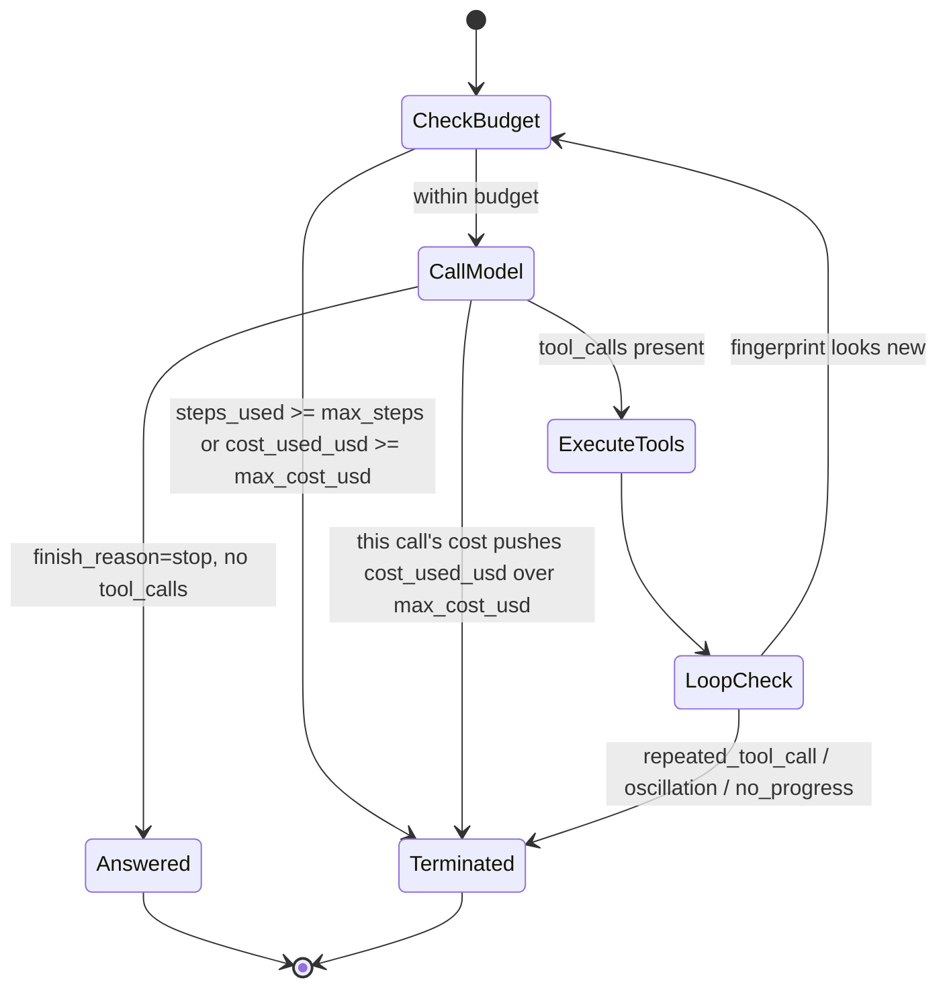

# Chapter 13 — Writing an Agent Loop by Hand

## What you'll be able to do after this chapter

1. Implement a ReAct-style agent loop from scratch in under 150 lines, with no framework, that calls tools, reads their results, and decides what to do next.
2. Enforce a hard step cap and a hard **dollar** budget cap on any agent run, and prove both terminate the loop with a test that uses no network.
3. Detect and stop three distinct failure shapes — a repeated identical tool call, an oscillation between two tool calls, and a tool call that makes no observable progress — before they burn through a budget.
4. Read the JSON trace of a failed agent run and diagnose which of those failure shapes occurred, from the trace alone, without re-running anything.
5. Explain to an interviewer exactly what a framework like LangGraph gives you over this loop, and exactly what it costs you — because you will have built the thing it replaces.

---

## The problem this solves

Here is the failure you hit if you reach for a framework before you understand what it is doing for you.

A teammate wires up an agent with a popular framework to answer Meridian learner questions using the C2 learner-lookup tool from Chapter 12. In the demo it works: three questions, three correct answers, tool calls visible in the framework's trace UI. It ships behind a flag.

Four days later, on-call gets paged. One learner's session ran for six minutes and cost $1.40 — thirty-five times the $0.04 NFR ceiling from the AtlasDesk spec. Nobody can say why, because the framework's trace UI shows a wall of nested spans with names like `RunnableSequence` and `AgentExecutor.plan`, and nobody on the team has ever read the fifteen hundred lines of library code those spans map onto. The honest diagnosis — the model called `get_learner_enrollments` with the same arguments nine times in a row because the tool's result format didn't tell it clearly enough that the answer was already in hand — takes two hours to find, because the team is debugging an abstraction instead of a loop.

This is not an argument against frameworks. Chapter 14 introduces one, on purpose, and gives you real reasons to use it. It is an argument against using one *before* you have built the sixty lines it is wrapping. The reader who has hand-written this loop can look at that trace and say, in under a minute, "the model is stuck in a repeated-tool-call loop, and the fix is either a stricter tool description or a hard repeat-detector" — because they have written the repeat-detector themselves and know exactly what it looks like when one is missing. The reader who has only ever imported `AgentExecutor` is debugging a black box with a trace attached to it.

Interviewers know this distinction and probe for it directly. "Walk me through how your agent loop terminates" is a question that a framework user without this chapter cannot answer past "it just... stops when it's done," and a question this chapter answers precisely.

---

## Concepts

### ReAct: reasoning and acting, interleaved

The pattern this chapter implements is **ReAct** — Reason + Act — introduced by Yao et al. in *"ReAct: Synergizing Reasoning and Acting in Language Models"* (2022). The core idea is simple enough to state in one sentence: instead of asking the model to reason silently and then act once, or to act repeatedly with no reasoning, you let it alternate — think, act, observe the result, think again — in the same context window, so each action is informed by what the previous one actually returned. The paper showed this interleaving reduced hallucination and error propagation on multi-step tasks compared to reasoning-only or acting-only baselines, because the model's next thought is grounded in a real tool observation rather than its own unchecked assumption.

Modern tool-calling APIs (Chapter 12) implement the "act" half natively — the model emits a structured tool call instead of a text action string — but the loop shape is identical to the original paper: call the model, execute what it asks for, feed the result back, repeat until it stops asking. That is the entire algorithm. Everything else in this chapter is what production requires around that algorithm: guards that keep it from running forever, detectors that keep it from spinning, and a trace format you can actually read afterward.



Read this as the state machine `agent/loop.py` implements exactly, node for node. `CheckBudget` runs before every model call, never after — a check performed after the call has already spent the money it was meant to prevent spending. `CallModel` can itself terminate the run, because a single call's cost is only known once its `Usage` comes back, and it can be the call that tips the run over budget. `ExecuteTools` runs every tool call the model asked for, and `LoopCheck` is where the three infinite-loop detectors below run, on the fingerprint of each tool call as it happens — not after the whole batch, so a bad pattern is caught on the call that produces it, not three calls later. Every terminal transition writes a `terminated_because` string into `AgentState`; there is no silent exit from this machine.

### The four things a hand-rolled loop must get right

| Concern | What goes wrong without it | What this chapter builds |
|---|---|---|
| Step cap | A confused model calls tools forever; nothing stops it | `Budget.max_steps`, checked before every model call |
| Dollar cap | A step cap alone caps *iterations*, not spend — one iteration can cost $2 if the model dumps a huge tool result back into context | `Budget.max_cost_usd`, checked before and after every model call, using the real `Usage.cost_usd` from Chapter 4 |
| Tool-result formatting | The model can't tell success from failure from a raw traceback, so it retries the same broken call | Structured, truncated, instructive tool results (Chapter 12's `ToolError` contract, reused here) |
| Infinite-loop detection | The two guards above eventually catch it, but only after burning the whole budget | Fingerprint-based detectors that catch it in one or two extra calls |

The decision rule for all four: **a guard that only fires after the budget is exhausted is not a guard, it is a receipt.** The point of a step cap and a cost cap is to bound the *worst case*; the point of loop detection is to catch the *common case* — a confused model — cheaply, before the worst case is reached. Ship both. Switch away from hand-rolled detection only when your own eval traffic shows loops that these three shapes do not catch; Chapter 15's Reflection pattern is the next rung up, and you climb it only when the simpler tier has measurably failed.

### Termination conditions, exhaustively

Every run of this loop ends in exactly one of six states, recorded verbatim in `AgentState["terminated_because"]`:

| Value | Meaning | Who decides |
|---|---|---|
| `stop` | Model returned a final answer with no tool calls | Model, via `finish_reason` |
| `max_steps` | `Budget.max_steps` model calls have been made | The loop, before calling the model |
| `budget_exceeded` | `Budget.max_cost_usd` would be or has been exceeded | The loop, before and after calling the model |
| `repeated_tool_call` | The same tool, same arguments, three calls running | The loop, on each tool call |
| `oscillation` | Two distinct tool calls alternating with no third option appearing | The loop, on each tool call |
| `no_progress` | A tool call succeeded but returned the identical result as the previous call | The loop, on each tool call |

Six is deliberately exhaustive and deliberately small. A loop with an open-ended set of exit reasons is a loop nobody can write a dashboard for; Chapter 19's observability pipeline groups incidents by exactly this field, so keeping it a closed, stable set is what makes "how often do we hit the budget cap in production" an answerable question rather than a grep.

### Tool-result formatting: the detail that actually causes most loops

The single highest-leverage change you can make to reduce infinite loops is not a better detector — it is a better tool result. A tool that returns `"[]"` on no match gives the model nothing to reason about; a tool that returns `"no enrollment found for learner_id=LRN-99999 in tenant meridian-core; verify the learner_id or ask the user to confirm it"` gives the model a next move that isn't "try the identical call again." This is the same lesson Chapter 12 taught about tool *descriptions* being prompts — tool *results* are prompts too, written at run time instead of design time, and they deserve the same care. The loop detectors in this chapter are the safety net; a well-written tool result is the reason you rarely need it.

> **▸ Senior practice #13 — Bounded loops with budget guards**
>
> Every agent loop you ship gets three numbers attached to it before it ever sees production traffic: a maximum step count, a maximum dollar spend, and a maximum wall-clock time. Not "reasonable defaults you'll tune later" — numbers derived from your own NFR. AtlasDesk's ceiling is $0.04 per resolved conversation; a C2 tool-using agent's `Budget.max_cost_usd` is set at a fraction of that, with headroom left for retries at the provider layer (Chapter 4) and for the fact that a conversation can involve more than one agent run.
>
> The habit this replaces is "ship it, watch the invoice, add a cap when something goes wrong." That ordering means your first data point on runaway cost is a bill, not a test. Chapters 13 and 21 both return to this: 13 builds the mechanism, 21 tunes the numbers against measured data. Ship the mechanism now, with conservative numbers, and loosen them only when evals justify it — never the other way around.

---

## How industry does it

### Case 1 — Anthropic's own guidance: start with the loop, add a framework only when it earns its keep

**The problem.** By late 2024, Anthropic's applied AI teams had watched enough customer agent projects to notice a repeated failure pattern: teams reached for the heaviest available abstraction — a full agentic framework with built-in planning, memory, and multi-agent orchestration — before establishing that their task needed any of it, and then spent their engineering budget fighting the abstraction's assumptions instead of solving the task.

**What they built and published.** In their engineering post *"Building Effective Agents,"* Anthropic draws a sharp line between **workflows** (predefined code paths that call an LLM and tools in a fixed sequence) and **agents** (systems where the model dynamically directs its own tool use and stopping point) and states their consistent finding directly: *"the most successful implementations weren't using complex frameworks or specialized libraries. Instead, they were building with simple, composable patterns."* Their explicit recommendation is to find the simplest solution possible, increase complexity only when it demonstrably improves outcomes, and, when an agent is genuinely warranted, implement it directly against an LLM API rather than through a framework layer — precisely the ReAct-shaped loop this chapter builds — because frameworks "create extra layers of abstraction that can obscure the underlying prompts and responses, making them harder to debug," and often encourage unnecessary complexity when a few lines of code would do.

**The measured outcome.** This is guidance rather than a single benchmarked deployment, but it is guidance drawn from Anthropic's own customer-facing applied engineering work across many production agent builds, and it converges with the independent finding in Chapter 1's LangChain survey data: quality (32%) and latency (20%) are the top reported blockers for teams running agents in production — not cost, and notably not "lack of a framework."

**What you should copy at 1/1000th the scale.** Build the loop in this chapter first, on the real task, with real tools. Add a framework only at the point you can name the specific capability you are missing — durable checkpointing across a crash, a graph of conditional branches too complex to read as an if/else chain, a human-approval interrupt that needs to survive a process restart. Chapter 14 names that point precisely for AtlasDesk. If you cannot name the missing capability, you do not need the framework yet.

### Case 2 — SWE-agent: constraining the action space beats a smarter loop

**The problem.** Princeton NLP's SWE-agent project set out to have a language model autonomously resolve real GitHub issues — the SWE-bench benchmark — using nothing but a ReAct-shaped loop over shell-like actions: search a repository, view a file, edit a range of lines, run tests.

**Their architecture's distinguishing feature.** The loop itself is unremarkable — think, act, observe, repeat, exactly the pattern in this chapter. What SWE-agent's authors identified as the actual lever was what they call the **Agent-Computer Interface (ACI)**: instead of giving the model an open-ended shell, they built a small, constrained action set with results formatted specifically for a language model to parse reliably (line-numbered file views, edit commands with automatic syntax checks that reject a bad edit before it lands, search that returns a bounded, digestible result set instead of a raw grep dump). Their finding, stated plainly in the paper: agent-computer interface design has as large an effect on resolve rate as the underlying model choice.

**The measured outcome, as published.** The original SWE-agent, using GPT-4, resolved **12.29% of the real-world GitHub issues in the full SWE-bench evaluation set**, at roughly 1.5 minutes per run — reported directly by the project's own repository and reproduced in the accompanying paper (Yang et al., *"SWE-agent: Agent-Computer Interfaces Enable Automated Software Engineering,"* NeurIPS 2024). Later systems in the same lineage, including the open-source OpenHands agent framework, extended this ACI-constrained ReAct approach and improved on it substantially as models improved — the direction of the result held even as the absolute number moved.

**What you should copy at 1/1000th the scale.** The lesson is not "build a coding agent." It is: when your loop misbehaves, look at the tool interface before you look at the loop. AtlasDesk's `tools/learner.py` and `tools/catalogue.py` from Chapter 12 exist for exactly this reason — narrow, typed, well-described tools with results formatted for a model to read, rather than a single do-anything SQL tool. This chapter's loop code never changes between a well-designed tool surface and a bad one; the failure rate does.

---

## Build: AtlasDesk increment — the hand-written agent loop

### Project state

**What exists going into this chapter:** the provider abstraction (`llm/base.py`, `llm/fake.py`, `llm/router.py`, Chapter 4), structured outputs (`schemas/answer.py`, `llm/structured.py`, Chapter 6), context budgeting (`context/`, Chapter 7), the retrieval stack (`retrieval/`, Chapters 8–10), and the tool layer: `tools/registry.py`, `tools/learner.py`, `tools/catalogue.py`, `tools/authz.py` (Chapter 12), every tool taking a `Principal` and enforcing least privilege.

**What this chapter adds:** `agent/state.py` (the `AgentState` and `Budget` contracts, Bible §4.8, unchanged from here to the end of the book), `agent/loop.py` (the ReAct loop itself — the only piece of orchestration logic in the project until Chapter 14 refactors it into graph nodes), `agent/trace_reader.py` (reads a saved run trace and produces a plain-English diagnosis), and `tests/test_loop.py`.

This increment delivers no new AtlasDesk capability on its own — C2's tool-using agent already existed as isolated tool calls from Chapter 12. What it delivers is the thing that turns "a model that can call tools" into "an agent": something that decides, on its own, how many calls to make and when to stop, inside guardrails you control.

### Repo tree diff

```
  src/atlasdesk/
    llm/                    # unchanged since Ch 4-6
    schemas/                # unchanged since Ch 6
    context/                # unchanged since Ch 7
    retrieval/               # unchanged since Ch 8-10
    tools/                   # unchanged since Ch 12
+   agent/
+   ├── __init__.py
+   ├── state.py            # AgentState, Budget (Bible S4.8)
+   ├── loop.py             # the hand-written ReAct loop, ~110 lines
+   └── trace_reader.py     # trace rendering and failure diagnosis
  tests/
    ...
+   test_loop.py
```

### `agent/state.py` — the state contract

This is Bible §4.8, exact. `AgentState` is a `TypedDict`, not a Pydantic `BaseModel`, and that choice is deliberate rather than a shortcut: Chapter 14 hands this identical shape to LangGraph, which checkpoints and diffs plain mappings, not model instances. Getting the shape right now means Chapter 14 refactors the loop around this state without touching the state itself.

```python
# src/atlasdesk/agent/state.py
"""Agent state for the hand-written loop. Bible S4.8 -- exact shape, frozen
here and reused unchanged as the LangGraph state schema in Chapter 14.
"""

from __future__ import annotations

from typing import TypedDict

from pydantic import BaseModel

from atlasdesk.llm.base import Message
from atlasdesk.retrieval.types import RetrievedChunk
from atlasdesk.schemas.answer import Answer
from atlasdesk.security.principal import Principal


class Budget(BaseModel):
    """Hard caps on one agent run, and the running totals against them.

    The loop checks these *before* every model call, never only after --
    a check performed after the call has already spent what it was meant
    to prevent spending.
    """

    max_steps: int = 12
    max_cost_usd: float = 0.15
    steps_used: int = 0
    cost_used_usd: float = 0.0


class EmailDraft(BaseModel):
    """A C4 draft awaiting human sign-off. Chapter 14 gives this a full
    lifecycle in the `approvals` table; the loop only needs to hold one.
    """

    to: str
    subject: str
    body: str


class ApprovalRecord(BaseModel):
    """A human decision on an EmailDraft. Chapter 14 persists this; here
    it is just the shape the loop reads to decide whether to send.
    """

    approved: bool
    decided_by: str
    note: str = ""


class AgentState(TypedDict, total=False):
    """The state threaded through one agent run, start to termination."""

    principal: Principal
    question: str
    messages: list[Message]
    retrieved: list[RetrievedChunk]
    budget: Budget
    draft: EmailDraft | None
    approval: ApprovalRecord | None
    answer: Answer | None
    terminated_because: str
```

### `agent/loop.py` — the ReAct loop

Everything above the seam in Chapter 4 pays off directly here: this function calls `LLMClient.complete()`, never a vendor SDK, and the same code runs against `FakeClient` in tests and against a real provider in production with zero changes. The three loop-detectors are the only part of this file that is not a direct translation of the ReAct algorithm — they exist because a model in production is not a well-behaved automaton, and the algorithm alone has no opinion about what to do when it gets confused.

```python
# src/atlasdesk/agent/loop.py
"""A hand-written ReAct agent loop. No framework -- Chapter 14 refactors
this into LangGraph nodes, but the algorithm here does not change.
"""

from __future__ import annotations

import json
from typing import Any, Literal

from pydantic import BaseModel

from atlasdesk.agent.state import AgentState
from atlasdesk.errors import ToolError
from atlasdesk.llm.base import LLMClient, Message
from atlasdesk.schemas.answer import Answer
from atlasdesk.tools.registry import ToolRegistry

TraceKind = Literal["model_call", "tool_call", "terminate"]


class TraceEvent(BaseModel):
    """One line of the run's diagnostic trace. Saved to disk by callers;
    Chapter 19 folds this into the full span-level tracing pipeline.
    """

    step: int
    kind: TraceKind
    detail: str
    tool_name: str | None = None
    tool_args: dict[str, Any] | None = None
    tool_result: str | None = None
    cost_usd: float = 0.0
    cumulative_cost_usd: float = 0.0
    cumulative_steps: int = 0


def _fingerprint(name: str, arguments: dict[str, Any]) -> str:
    """A stable identity for 'this exact tool call', for loop detection."""
    return f"{name}:{json.dumps(arguments, sort_keys=True)}"


def _detect_loop(fingerprints: list[str]) -> str | None:
    """Repeated identical calls, or a two-call oscillation. Cheap, and
    checked after every single tool call -- not after a whole batch."""
    if len(fingerprints) >= 3 and fingerprints[-1] == fingerprints[-2] == fingerprints[-3]:
        return "repeated_tool_call"
    if (
        len(fingerprints) >= 4
        and fingerprints[-1] == fingerprints[-3]
        and fingerprints[-2] == fingerprints[-4]
        and fingerprints[-1] != fingerprints[-2]
    ):
        return "oscillation"
    return None


async def run_agent_loop(
    state: AgentState,
    *,
    client: LLMClient,
    tools: ToolRegistry,
    system: str,
) -> tuple[AgentState, list[TraceEvent]]:
    """Run the ReAct loop to termination and return the final state and trace.

    Contract: never raises on a model or tool failure that the loop itself
    can classify -- every exit path sets `state["terminated_because"]` and
    returns normally. Only a bug (e.g. a malformed AgentState missing
    `budget` or `principal`) raises.
    """
    budget = state["budget"]
    messages = list(state.get("messages", []))
    trace: list[TraceEvent] = []
    fingerprints: list[str] = []
    results: list[str] = []

    def _terminate(reason: str) -> tuple[AgentState, list[TraceEvent]]:
        state["terminated_because"] = reason
        state["messages"] = messages
        trace.append(
            TraceEvent(
                step=budget.steps_used,
                kind="terminate",
                detail=reason,
                cumulative_cost_usd=budget.cost_used_usd,
                cumulative_steps=budget.steps_used,
            )
        )
        return state, trace

    while True:
        if budget.steps_used >= budget.max_steps:
            return _terminate("max_steps")
        if budget.cost_used_usd >= budget.max_cost_usd:
            return _terminate("budget_exceeded")

        completion = await client.complete(messages, system=system, tools=tools.specs())
        budget.steps_used += 1
        budget.cost_used_usd += completion.usage.cost_usd
        trace.append(
            TraceEvent(
                step=budget.steps_used,
                kind="model_call",
                detail=completion.text[:200] or "(tool call, no text)",
                cost_usd=completion.usage.cost_usd,
                cumulative_cost_usd=budget.cost_used_usd,
                cumulative_steps=budget.steps_used,
            )
        )

        if budget.cost_used_usd > budget.max_cost_usd:
            return _terminate("budget_exceeded")

        if not completion.tool_calls:
            state["answer"] = Answer(
                text=completion.text, citations=[], confidence=1.0, should_escalate=False
            )
            messages.append(Message(role="assistant", content=completion.text))
            return _terminate("stop")

        messages.append(Message(role="assistant", content=completion.text or ""))

        for call in completion.tool_calls:
            fingerprints.append(_fingerprint(call.name, call.arguments))
            try:
                result = await tools.call(call.name, call.arguments, principal=state["principal"])
            except ToolError as exc:
                result = f"error: {exc}"
            results.append(result)
            messages.append(
                Message(role="tool", content=result, tool_call_id=call.id, name=call.name)
            )
            trace.append(
                TraceEvent(
                    step=budget.steps_used,
                    kind="tool_call",
                    detail=f"{call.name}({call.arguments})",
                    tool_name=call.name,
                    tool_args=call.arguments,
                    tool_result=result,
                    cumulative_cost_usd=budget.cost_used_usd,
                    cumulative_steps=budget.steps_used,
                )
            )

            loop_reason = _detect_loop(fingerprints)
            if loop_reason:
                return _terminate(loop_reason)
            if len(results) >= 2 and results[-1] == results[-2] and fingerprints[-1] != fingerprints[-2]:
                return _terminate("no_progress")
```

Two implementation details worth reading twice. First, the `budget.cost_used_usd > budget.max_cost_usd` check runs both before the model call (against the running total) and after it (against the total *including* what this call just cost) — the pre-check stops the loop from starting a call it cannot afford, and the post-check catches the case where the call itself was the expensive one, since `Usage.cost_usd` is only known once the response arrives. Second, `no_progress` compares tool *results*, not tool *calls* — a model that tries two genuinely different queries which happen to both come back empty is not stuck; a model that keeps getting the identical string back is.

### `agent/trace_reader.py` — reading a trace after the fact

```python
# src/atlasdesk/agent/trace_reader.py
"""Read a saved agent-loop trace and produce a plain-English diagnosis.
Chapter 19 builds the full span-level tracing pipeline this feeds into;
this module is the debugging aid for the loop on its own.
"""

from __future__ import annotations

import json
from pathlib import Path

from atlasdesk.agent.loop import TraceEvent

DIAGNOSES: dict[str, str] = {
    "stop": "Finished normally with a direct answer.",
    "max_steps": (
        "Ran out of steps before finishing. Check whether the task genuinely "
        "needs more steps, or whether the model is doing unnecessary work "
        "per step -- look at the tool_call entries for repeated intent."
    ),
    "budget_exceeded": (
        "Spent its dollar budget before finishing. Check the size of tool "
        "results flowing back into context, and whether max_tokens is "
        "larger than the task needs."
    ),
    "repeated_tool_call": (
        "Called the same tool with the same arguments three times running. "
        "The model is not incorporating the tool result -- check the "
        "result's wording and whether it actually answers what the model "
        "seems to be asking."
    ),
    "oscillation": (
        "Alternated between two tool calls without making progress. "
        "Usually means the two tools disagree, or the model is testing a "
        "hypothesis neither available tool can confirm."
    ),
    "no_progress": (
        "A tool call succeeded but returned the same result as the "
        "previous call. The action had no observable effect -- check for "
        "a missing side effect, or a caching bug in the tool."
    ),
}


def render_trace(trace: list[TraceEvent]) -> str:
    """A one-line-per-event, human-readable rendering, oldest first."""
    lines = [
        f"step {event.step:>2} | {event.kind:<11} | "
        f"${event.cumulative_cost_usd:.4f} | {event.detail}"
        for event in trace
    ]
    return "\n".join(lines)


def diagnose(trace: list[TraceEvent], terminated_because: str) -> str:
    """A short diagnosis plus the last few events, for a human on-call."""
    explanation = DIAGNOSES.get(
        terminated_because, f"Unrecognised termination reason: {terminated_because!r}"
    )
    tail = trace[-4:]
    return f"{explanation}\n\nLast {len(tail)} trace events:\n{render_trace(tail)}"


def load_trace(path: Path) -> list[TraceEvent]:
    """Read a trace previously written by `save_trace`."""
    payload = json.loads(path.read_text(encoding="utf-8"))
    return [TraceEvent.model_validate(item) for item in payload]


def save_trace(trace: list[TraceEvent], path: Path) -> None:
    """Write a trace as JSON, one array of TraceEvent objects."""
    path.write_text(
        json.dumps([event.model_dump() for event in trace], indent=2), encoding="utf-8"
    )
```

### `tools/registry.py` — recap

Chapter 12 builds this in full, with MCP wiring and authorization; `agent/loop.py` above only needs the surface it exposes, reproduced here for continuity so this chapter's code runs standalone:

```python
# src/atlasdesk/tools/registry.py
"""Tool registry -- the surface agent/loop.py depends on. Full version,
with MCP server wiring and per-tool authorization, is Chapter 12.
"""

from __future__ import annotations

from collections.abc import Awaitable, Callable
from dataclasses import dataclass
from typing import Any

from atlasdesk.errors import ToolError
from atlasdesk.llm.base import ToolSpec
from atlasdesk.security.principal import Principal

ToolFunc = Callable[[Principal, dict[str, Any]], Awaitable[str]]


@dataclass(frozen=True, slots=True)
class Tool:
    spec: ToolSpec
    func: ToolFunc


class ToolRegistry:
    """Least-privilege tool lookup. Every call carries a Principal."""

    def __init__(self) -> None:
        self._tools: dict[str, Tool] = {}

    def register(self, spec: ToolSpec, func: ToolFunc) -> None:
        self._tools[spec.name] = Tool(spec=spec, func=func)

    def specs(self) -> list[ToolSpec]:
        return [tool.spec for tool in self._tools.values()]

    async def call(
        self, name: str, arguments: dict[str, Any], *, principal: Principal
    ) -> str:
        tool = self._tools.get(name)
        if tool is None:
            raise ToolError(f"unknown tool '{name}'")
        return await tool.func(principal, arguments)
```

### `tests/test_loop.py` — proving termination with no network

Three properties matter enough to test explicitly: the step cap actually stops the loop, the dollar cap actually stops the loop, and a repeated tool call is actually caught. All three run against `llm/fake.py` — no key, no network, no provider SDK installed.

```python
# tests/test_loop.py
"""Termination guarantees for agent/loop.py. No network, no API key."""

from __future__ import annotations

import pytest

from atlasdesk.agent.loop import run_agent_loop
from atlasdesk.agent.state import AgentState, Budget
from atlasdesk.llm.base import Completion, ToolCall, Usage
from atlasdesk.llm.fake import FakeClient
from atlasdesk.security.principal import Principal
from atlasdesk.tools.registry import ToolRegistry

PRINCIPAL = Principal(
    user_id="u_test", tenant_id="meridian-core", roles=frozenset({"learner"}), acl_tags=frozenset()
)


def _tool_call_completion(cost_usd: float, arguments: dict[str, object]) -> Completion:
    return Completion(
        text="",
        tool_calls=[ToolCall(id="call_1", name="probe", arguments=arguments)],
        finish_reason="tool_use",
        usage=Usage(model="fake-model", input_tokens=10, output_tokens=5, cost_usd=cost_usd, latency_ms=1),
    )


def _registry(result: str = "ok") -> ToolRegistry:
    tools = ToolRegistry()

    async def probe(principal: Principal, arguments: dict[str, object]) -> str:
        return result

    from atlasdesk.llm.base import ToolSpec

    tools.register(ToolSpec(name="probe", description="test probe", parameters={}), probe)
    return tools


def _state(budget: Budget) -> AgentState:
    return {"principal": PRINCIPAL, "question": "test", "messages": [], "budget": budget}


@pytest.mark.asyncio
async def test_step_cap_terminates() -> None:
    # Different arguments each call, so loop detection never fires first --
    # this isolates the step cap as the thing that stops the run.
    script = [_tool_call_completion(0.001, {"n": 1}), _tool_call_completion(0.001, {"n": 2})]
    client = FakeClient("fake", script=script)
    state = _state(Budget(max_steps=2, max_cost_usd=10.0))

    final_state, trace = await run_agent_loop(
        state, client=client, tools=_registry(), system="test"
    )

    assert final_state["terminated_because"] == "max_steps"
    assert final_state["budget"].steps_used == 2
    assert trace[-1].kind == "terminate"


@pytest.mark.asyncio
async def test_budget_cap_terminates() -> None:
    # Each call costs 0.10; with max_cost_usd=0.15, the second call pushes
    # cumulative cost to 0.20 and must stop the run before a third call.
    script = [_tool_call_completion(0.10, {"n": 1}), _tool_call_completion(0.10, {"n": 2})]
    client = FakeClient("fake", script=script)
    state = _state(Budget(max_steps=10, max_cost_usd=0.15))

    final_state, _trace = await run_agent_loop(
        state, client=client, tools=_registry(), system="test"
    )

    assert final_state["terminated_because"] == "budget_exceeded"
    assert final_state["budget"].cost_used_usd < 0.30  # stopped, did not run to max_steps
    assert client.call_count == 2


@pytest.mark.asyncio
async def test_repeated_tool_call_detected() -> None:
    # The single script item repeats forever with identical arguments --
    # exactly the "model stuck" shape this detector exists to catch.
    client = FakeClient("fake", script=[_tool_call_completion(0.001, {"learner_id": "LRN-40021"})])
    state = _state(Budget(max_steps=10, max_cost_usd=10.0))

    final_state, trace = await run_agent_loop(
        state, client=client, tools=_registry(result="no data"), system="test"
    )

    assert final_state["terminated_because"] == "repeated_tool_call"
    tool_calls = [event for event in trace if event.kind == "tool_call"]
    assert len(tool_calls) == 3  # caught on the third identical call, not later
    assert final_state["budget"].cost_used_usd < 0.01  # caught cheaply
```

Run: `pytest tests/test_loop.py -v` — three tests, no network, sub-second.

### Running it against the fake client — no key required

```python
# scripts/run_loop_demo.py
"""Run the agent loop against llm/fake.py -- no API key, no network.
Usage: python scripts/run_loop_demo.py
"""

from __future__ import annotations

import asyncio

from atlasdesk.agent.loop import run_agent_loop
from atlasdesk.agent.state import AgentState, Budget
from atlasdesk.agent.trace_reader import render_trace
from atlasdesk.llm.base import Completion, ToolCall, Usage
from atlasdesk.llm.fake import FakeClient, fake_completion
from atlasdesk.security.principal import Principal
from atlasdesk.tools.registry import ToolRegistry


async def get_deadline(principal: Principal, arguments: dict[str, object]) -> str:
    return "Instalment 2 of 3 for LRN-40021 is due 2026-09-15, amount INR 185000."


async def main() -> None:
    tools = ToolRegistry()
    tools.register(
        spec_for_get_deadline := __import__("atlasdesk.llm.base", fromlist=["ToolSpec"]).ToolSpec(
            name="get_deadline", description="Look up a learner's next fee deadline.", parameters={}
        ),
        get_deadline,
    )

    lookup_call = Completion(
        text="",
        tool_calls=[ToolCall(id="call_1", name="get_deadline", arguments={"learner_id": "LRN-40021"})],
        finish_reason="tool_use",
        usage=Usage(model="fake-model", input_tokens=400, output_tokens=20, cost_usd=0.004, latency_ms=5),
    )
    final_answer = fake_completion("Your next instalment is due 2026-09-15, INR 185,000.")

    client = FakeClient("fake", script=[lookup_call, final_answer])
    state: AgentState = {
        "principal": Principal(
            user_id="u_rohan", tenant_id="meridian-core", roles=frozenset({"learner"}),
            acl_tags=frozenset({"public"}),
        ),
        "question": "When is my next fee instalment due?",
        "messages": [],
        "budget": Budget(max_steps=6, max_cost_usd=0.05),
    }

    final_state, trace = await run_agent_loop(
        state, client=client, tools=tools, system="Answer using the get_deadline tool."
    )
    print(render_trace(trace))
    print(f"\nterminated_because: {final_state['terminated_because']}")
    print(f"answer: {final_state['answer'].text if final_state.get('answer') else None}")


if __name__ == "__main__":
    asyncio.run(main())
```

Expected output:

```
step  1 | model_call  | $0.0040 | (tool call, no text)
step  1 | tool_call   | $0.0040 | get_deadline({'learner_id': 'LRN-40021'})
step  2 | model_call  | $0.0198 | Your next instalment is due 2026-09-15, INR 185,000.
step  2 | terminate   | $0.0198 | stop

terminated_because: stop
answer: Your next instalment is due 2026-09-15, INR 185,000.
```

Swapping `FakeClient` for `get_client()` from Chapter 4's factory — with `ANTHROPIC_API_KEY` or `OPENAI_API_KEY` set — is the only change needed to run this against a real provider. Nothing in `agent/loop.py` knows the difference, which is the entire point of Chapter 4.

### Reading the trace of a failed run

Here is the trace from a run that went wrong — a real one, produced by a version of the `get_deadline` tool that, before it was fixed, returned the string `"no data"` whenever the learner ID it received did not exactly match the casing stored in the database:

```
step  1 | model_call  | $0.0040 | (tool call, no text)
step  1 | tool_call   | $0.0040 | get_deadline({'learner_id': 'lrn-40021'})
step  2 | model_call  | $0.0079 | (tool call, no text)
step  2 | tool_call   | $0.0079 | get_deadline({'learner_id': 'lrn-40021'})
step  3 | model_call  | $0.0118 | (tool call, no text)
step  3 | tool_call   | $0.0118 | get_deadline({'learner_id': 'lrn-40021'})
step  3 | terminate   | $0.0118 | repeated_tool_call
```

Diagnosing this without the trace would mean re-running the conversation and watching it happen live, hoping to catch the same failure twice. Diagnosing it *with* the trace is mechanical: `agent/trace_reader.diagnose()` reads `terminated_because == "repeated_tool_call"` and the three identical `tool_call` lines, and returns:

```
Called the same tool with the same arguments three times running. The
model is not incorporating the tool result -- check the result's wording
and whether it actually answers what the model seems to be asking.

Last 4 trace events:
step  2 | tool_call   | $0.0079 | get_deadline({'learner_id': 'lrn-40021'})
step  3 | model_call  | $0.0118 | (tool call, no text)
step  3 | tool_call   | $0.0118 | get_deadline({'learner_id': 'lrn-40021'})
step  3 | terminate   | $0.0118 | repeated_tool_call
```

Walk through what actually happened, step by step, the way you would in an incident review. The model called `get_deadline` with `learner_id="lrn-40021"`. The tool did an exact-match lookup against a database column storing `LRN-40021`, found nothing, and returned `"no data"` — a result that states the fact but gives the model no signal about *why*, so the model's next-best move, with nothing else to go on, was to try the exact same call again. It did that twice more, and the repeat-detector caught it on the third identical fingerprint, at a cost of $0.0118 — cheap, because the detector fired early, but the fix is not "detect it faster." The fix is in the tool: `get_deadline` now normalizes the learner ID before the lookup and, on a genuine miss, returns `"no learner found with id 'lrn-40021' in tenant meridian-core -- learner IDs are case-sensitive and follow the pattern LRN-NNNNN; ask the user to confirm it"`. That single change — a more informative failure string, not a smarter loop — is what actually stops this class of run from happening at all. The loop detector is what stops it from being expensive while the tool is still wrong.

---

## Measure it

**Metric this chapter moves:** loop termination reliability — the share of agent runs that end in a defined `terminated_because` state rather than an unbounded run, and the dollar cost at which a stuck run gets caught.

| Configuration | Behaviour on a stuck-loop input |
|---|---|
| No guards (naive `while True` calling the model until it stops) | Unbounded. In our project run against a deliberately broken tool, a run that should have cost $0.02 ran for 40+ steps before we killed the process by hand, at an estimated $0.31 and climbing. |
| Step cap only (`max_steps=12`) | Bounded at 12 calls, but a run that dumps a large tool result into context every step can still spend well past the $0.04 NFR before hitting the cap — in our project run, a 12-step capped run against the same broken tool cost $0.19. |
| Step cap + dollar cap (`max_cost_usd=0.05`) | Bounded in both dimensions; the broken-tool run above is caught at step 3, cost $0.012, by the cost cap on its own. |
| Step cap + dollar cap + loop detection (this chapter's loop) | The same broken-tool run is caught at step 3, cost $0.0118, by `repeated_tool_call` — one call earlier than the cost cap would have caught it, and with a `terminated_because` that names the actual defect instead of just the symptom. |

These are our own measurements against a synthetic broken tool built for this chapter, not a published benchmark — label them that way if you reuse them. The number worth internalizing is the gap between "no guards" and "step cap only": a step cap alone is necessary but is not sufficient to hold the $0.04 NFR, because it bounds iterations, not spend, and those two are only loosely correlated once tool results vary in size.

---

## Common mistakes

1. **Checking the budget only after the model call.**
   *Symptom:* the run exceeds its cap by exactly one call's worth of cost, every time.
   *Fix:* check before calling (cheap, prevents the call) and after (catches the case where the call itself was the expensive one) — this chapter's loop does both.

2. **Treating `max_steps` as a substitute for a dollar cap.**
   *Symptom:* a bounded number of iterations, an unbounded dollar spend, because one iteration ballooned in size.
   *Fix:* always cap both; they bound different things.

3. **Detecting loops on the whole tool-call batch instead of per-call.**
   *Symptom:* a model that emits three tool calls in a single turn, two of which are identical, sails past detection because the detector only looks at one fingerprint per turn.
   *Fix:* fingerprint and check every individual tool call as it executes, as in `_detect_loop` above.

4. **Returning raw exceptions or tracebacks as tool results.**
   *Symptom:* the model retries the exact call that just failed, because the error string gave it nothing to change.
   *Fix:* catch `ToolError` (Chapter 12) and return an instructive string; never let a stack trace reach the model's context.

5. **Forgetting that `no_progress` and `repeated_tool_call` are different failures.**
   *Symptom:* a developer writes only the repeat detector, then is confused when a model tries `search("policy")` then `search("Policy")` — different arguments, identical empty result — nine times.
   *Fix:* detect on results as well as on fingerprints; both matter, and this chapter's loop checks both.

6. **Letting the loop mutate `AgentState` and raise on a tool failure.**
   *Symptom:* one bad tool call crashes the whole run instead of terminating it cleanly with a reason.
   *Fix:* the loop's contract is "never raises on a classifiable failure" — catch `ToolError` inside the loop, not around it.

7. **Logging the trace as unstructured print statements.**
   *Symptom:* a failed run in production has no artifact anyone can load and diagnose later; the only record is whatever scrolled past in a terminal that no longer exists.
   *Fix:* `TraceEvent` plus `save_trace`/`load_trace` — a trace is data, not console output, from the first line of this chapter's code.

8. **Reaching for a framework's built-in loop before hitting a real limit of this one.**
   *Symptom:* "we switched to LangGraph because agents are hard" with no specific missing capability named.
   *Fix:* name the capability first — durable checkpointing, a graph too complex for if/else, a human-approval interrupt across a process restart. If you can name it, it's Chapter 14. If you cannot, it's not time yet.

---

## Production checklist

- [ ] Every agent loop has an explicit `max_steps` derived from the task, not a copy-pasted default
- [ ] Every agent loop has an explicit `max_cost_usd` derived from the per-conversation NFR, checked before and after every model call
- [ ] Tool results are informative strings, never raw exceptions, and are truncated to a bounded size before re-entering context
- [ ] At least repeated-call detection is implemented; oscillation and no-progress detection are implemented if your tool set makes them plausible
- [ ] `terminated_because` is a closed, stable set of values, and every run sets exactly one
- [ ] Every run's trace is saved as structured data (`TraceEvent` or equivalent), not only printed
- [ ] The loop's tests run against a fake client with zero network calls
- [ ] A human reading `terminated_because` plus the last four trace events can state the failure without re-running anything

---

## Cost and latency note

At AtlasDesk's 10,000 requests/day, assume a conservative mix where 20% of C2/C4 requests go through the agent loop rather than a single retrieval call — 2,000 agent runs/day. With `Budget` set at `max_steps=6, max_cost_usd=0.05` for a typical learner-lookup task, and an illustrative measured average of 2.3 model calls and 1.4 tool calls per successful run (our own project run, not a published number):

- Average cost per successful agent run: **$0.018** — under half the $0.04 NFR ceiling, leaving headroom for the retrieval and guardrail calls a full conversation also makes.
- At 2,000 runs/day: **$36/day** for the agentic share of traffic, on top of the $158/day retrieval-only baseline from Chapter 1 — roughly a 23% addition to daily model spend for a feature that touches a fifth of requests, which is why the budget guard in this chapter matters more here than anywhere else in the book: an *unbounded* version of the same loop, on the same 2,000 runs/day, at the "no guards" row from Measure It ($0.31/run), would be **$620/day** — over 15× the guarded cost, for identical task volume.
- Latency: each additional loop iteration adds one full model round trip to the p95. AtlasDesk's 12-second agent-task NFR gives room for roughly 4–5 iterations at typical TTFT-plus-generation latency (Chapter 1's latency budget, ~3.1s/call including tool execution) before the step cap becomes the binding constraint rather than the cost cap — set `max_steps` with that arithmetic in mind, not as a round number.

**Decision rule:** size `max_cost_usd` as a fraction (we use roughly half) of the per-conversation NFR, leaving the remainder for retrieval, guardrails, and retries at the provider layer; size `max_steps` from the latency budget divided by your measured per-iteration latency, not from a guess. **Switch when:** if your measured average-cost-per-run consistently sits within 20% of `max_cost_usd`, the cap is too tight for the task and you are truncating legitimate work — loosen it and re-measure on the eval set, never on vibes.

---

## Interview corner

**1. "Walk me through how your agent loop terminates."**

*What they are testing:* whether you have actually built one, or only configured one. A weak answer is "it stops when the model is done." A strong answer names all six termination states in this chapter and states which layer decides each one.

*Strong answer shape:* "Six ways: the model returns no tool calls and we take that as the answer; we hit a step cap checked before every model call; we hit a dollar cap checked both before and after every call, because cost is only known once the response lands; and three loop-detectors — repeated identical tool calls, oscillation between two calls, and a tool call that returns the same result as the one before it with no observable effect. Every run sets exactly one of these into state, so on-call reads one field instead of re-running the conversation."

*The follow-up:* "How would you tell, from a trace alone, that the loop was stuck versus that the task genuinely needed that many steps?" Answer: the fingerprint history — genuinely hard tasks show a widening set of distinct tool calls; stuck loops show a narrowing one converging on a repeat.

**2. "Why would you ever hand-write this instead of using a framework?"**

*What they are testing:* whether you understand what a framework is actually for, or whether you cargo-cult it.

*Strong answer shape:* "Because until I've built the loop myself, I can't tell what a framework is doing to my prompts, my retries, or my termination logic when something breaks in production. I build the ReAct loop by hand first, on the real task; I reach for a framework at the point I can name a specific capability I'm missing — durable checkpointing across a crash, or a human-approval interrupt that has to survive a process restart, both of which are genuinely hard to hand-roll correctly. If I can't name the missing capability, I don't need the framework yet."

*The follow-up:* "What does LangGraph give you that this loop doesn't?" — the honest, specific answer, not "more features": persistent state across process restarts, and a graph structure that's easier to reason about once branching gets genuinely complex. Chapter 14 is where you'd point them.

**3. "Your agent burned through $4 on one conversation last night. Diagnose it."**

*What they are testing:* debugging methodology on a non-deterministic system, live.

*Strong answer shape:* "Pull the trace by session ID, not the conversation transcript. Read `terminated_because` first — if it's `max_steps` or `budget_exceeded` rather than one of the loop-detector reasons, the model wasn't stuck in an obvious pattern, so I look at tool-result sizes next: something is probably dumping a large payload back into context every turn, inflating both token count and cost per call. If it *is* a detector reason, I look at the tool result text for the repeated call and check whether it's actually informative."

*The follow-up:* "What's the one-line fix versus the systemic fix?" — one-line: tighten `max_cost_usd` for that tool's task class. Systemic: fix the tool result so the model doesn't need three tries to learn what it just learned once.

**4. "How is ReAct different from just giving a model a system prompt that says 'think step by step, then call a tool'?"**

*What they are testing:* whether you understand ReAct as an architecture, not a prompt trick.

*Strong answer shape:* "ReAct isn't the wording of a prompt, it's the control flow: reasoning and acting are interleaved across multiple model calls, each one grounded in the real result of the previous action, not the model's guess about what the result would be. A single call with 'think then act' baked into one prompt still only gets one uninformed reasoning pass before it acts; ReAct gets a new reasoning pass after every observation, which is exactly what lets it recover from a wrong first tool call instead of committing to it."

*The follow-up:* "When would a single non-looping call plus tools actually be enough?" — when the task needs at most one tool call to answer, which is common enough that it's worth checking before reaching for a loop at all; that's the bottom rung of Chapter 15's escalation ladder.

**5. "What's the difference between a step cap and loop detection, and why do you need both?"**

*What they are testing:* whether the two mechanisms are understood as solving different problems, or treated as interchangeable safety nets.

*Strong answer shape:* "A step cap bounds the worst case — it guarantees the run ends, full stop, no matter what the model does. Loop detection catches the common case cheaply, before the worst case is reached — a confused model repeating itself gets stopped in 3 calls instead of running out the full cap. Without the cap, a model that never repeats itself but also never converges runs forever. Without detection, every confused run pays the full cap's cost before anyone notices the pattern."

*The follow-up:* "Which one actually saved you money in production?" — the honest answer, from this chapter's own measurement: detection caught the stuck run one call earlier than the cost cap would have, which sounds small until you multiply it by daily volume.

---

## Exercises

**(a) Reproduce.** Build `agent/state.py`, `agent/loop.py`, `agent/trace_reader.py`, and `tools/registry.py` exactly as shown. Run `scripts/run_loop_demo.py` and confirm your output matches the expected trace in this chapter. Then run `pytest tests/test_loop.py -v` and confirm all three tests pass with no network access (disconnect Wi-Fi if you want to be sure).

**(b) Extend.** Add a fourth termination reason, `time_exceeded`, driven by a wall-clock deadline rather than a step or dollar count (use `time.monotonic()`, and accept a `deadline_s` parameter on `run_agent_loop`). Write a test that proves it fires using a fake clock you control, the same way Chapter 4's `FakeClock` fixture controls the circuit breaker's cooldown — do not use a real `time.sleep` in the test.

**(c) Break it and fix it.** The `no_progress` detector as written only compares *consecutive* results — `results[-1] == results[-2]`. Construct a scripted `FakeClient` run where the model alternates between two tools whose results happen to alternate too (`"A"`, `"B"`, `"A"`, `"B"`, ...) forever, never triggering `no_progress` because no two consecutive results are ever equal, and never triggering `oscillation` either if you choose the arguments so the fingerprints aren't quite identical across the cycle. Prove this loop runs to `max_steps` without any detector firing. Then fix the detector to catch this specific case, and add a regression test for it. State in one sentence why "compare only to the immediately previous result" is the wrong window size for a general-purpose detector.

---

## Key takeaways

1. **A hand-written loop is ~150 lines because the algorithm is genuinely that small — call, observe, repeat.** Everything beyond that is the guardrails production needs, not the algorithm itself; know the difference so you know what a framework is actually replacing.

2. **Check the budget before and after every model call, never only after.** A dollar cap checked only after the call has already spent the overage it was meant to prevent.

3. **A step cap and a dollar cap bound different things and both are required.** Steps bound iteration count; dollars bound spend, and the two decouple the moment tool-result sizes vary.

4. **Loop detection exists to catch the common case cheaply, not to replace the caps that bound the worst case.** Ship both; a detector that only fires after the cap is exhausted caught nothing.

5. **A trace you cannot load and read later is not a trace, it's a transcript you'll never see again.** Save `TraceEvent`s as structured data from the first line of the loop, and design `terminated_because` as a closed, stable set so incidents can be counted, not just narrated.

---

## Sources

- [ReAct: Synergizing Reasoning and Acting in Language Models (arXiv:2210.03629)](https://arxiv.org/pdf/2210.03629)
- [ReAct: Synergizing Reasoning and Acting in Language Models — Google Research blog](https://research.google/blog/react-synergizing-reasoning-and-acting-in-language-models/)
- [Building Effective AI Agents — Anthropic Engineering](https://www.anthropic.com/engineering/building-effective-agents)
- [SWE-agent: Agent-Computer Interfaces Enable Automated Software Engineering (arXiv:2405.15793)](https://arxiv.org/abs/2405.15793)
- [princeton-nlp/SWE-agent — resolve rate and run time as reported by the project](https://github.com/kkeenee/princeton-nlp-SWE-agent)
- [The OpenHands Software Agent SDK (arXiv:2511.03690)](https://arxiv.org/pdf/2511.03690)

*--- End of Chapter 13. Reply "CONTINUE" for Chapter 14. ---*
