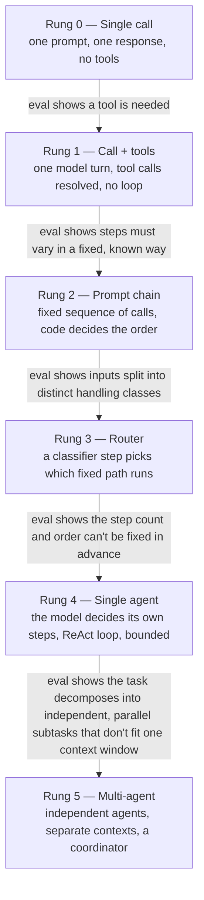

# Chapter 15 — Agentic Design Patterns

## What you'll be able to do after this chapter

1. Place any agentic task on a six-rung escalation ladder — single call, call+tools, prompt chain, router, single agent, multi-agent — and justify the rung with an eval result, not a hunch.
2. Implement and run six named patterns (Router, Reflection, Planner-Executor, Evaluator-Optimizer, Supervisor-Worker, Parallel Fan-Out) against the Chapter 4 `LLMClient` and the Chapter 13 `AgentState`, with no framework.
3. State the decision rule and the "switch when…" threshold for each pattern, and apply it to a capability you have not seen before.
4. Name the three legitimate cases for multi-agent architectures, and quote the token multiplier each one costs before you agree to build one.
5. Read a measured comparison of two rungs on the same task and say, in one sentence, which rung AtlasDesk should actually ship.

---

## The problem this solves

Here is the failure you hit if you skip this chapter and go straight to "let's make it multi-agent."

A teammate reads about Anthropic's multi-agent research system, is impressed, and proposes the same shape for AtlasDesk's C1 handbook question-answering: a lead agent that plans, three subagents that each search a different angle of the handbook, and a synthesis step that merges their findings. It is built in four days. It is demoed on a genuinely hard multi-part question and it looks great — better than the single-call RAG answer from Chapter 10, in fact, because three independent searches surface more of the handbook than one.

Then Priya Raghavan asks what it costs. The team pulls the trace and finds the honest number: **this one question made 11 model calls and consumed roughly 14× the tokens of the single-call answer**, for a question category that made up 6% of the eval set and where the single-call answer was already scoring 91% task success. For the other 94% of questions — "when is my fee instalment due," "what is the refund window" — the multi-agent path is not better, it is just slower and thirteen times more expensive, because there was never a decomposition problem to solve in the first place. Nobody checked whether the simpler tier had actually failed before reaching for the complex one. The eval set was sitting right there and nobody ran it against the baseline before building.

This chapter is the ladder that failure skips. Every pattern below is real, has a name, has provenance, and has a place — but the place is decided by a number from your own eval set, never by which architecture is currently getting attention on social media.

---

## Concepts

### The escalation ladder



Read this as a ratchet, not a menu. Each arrow is labelled with the only legitimate reason to cross it: a result from your own eval set showing the rung below actually failed the task, not a feeling that the task sounds complex. Note what is *not* an arrow label anywhere on this diagram — "the task seems important," "the team wants to use LangGraph," "a blog post said multi-agent is the future." None of those are eval results, and none of them earns a rung.

The rungs map onto AtlasDesk's own capabilities cleanly, and it is worth naming the mapping now because it previews every code example in this chapter:

| Rung | AtlasDesk example | Why that rung, and not higher |
|---|---|---|
| 0 — Single call | "What is the refund window?" against pre-retrieved chunks | One fact, one context window, no decision to make mid-answer |
| 1 — Call + tools | "When is my fee instalment due?" (C2) | Exactly one tool call resolves it; looping would just add latency |
| 2 — Prompt chain | Draft-then-check email reply (a fixed extract → draft → verify sequence) | The steps and their order are always the same; code, not the model, should own that order |
| 3 — Router | C1 vs. C2 vs. C3 vs. escalate intent classification | Four fixed handling paths exist; a classifier picking among them is cheaper and more auditable than a general agent reasoning its way there every time |
| 4 — Single agent | C2/C4 multi-turn learner conversations (Chapter 13's loop) | The number and order of tool calls genuinely varies per conversation and cannot be fixed in advance |
| 5 — Multi-agent | None, currently, in AtlasDesk — see the three cases below | No AtlasDesk capability has yet failed its eval at rung 4 for a reason that decomposition would fix |

That last row is deliberate and is the chapter's central opinion, stated as plainly as I can: **AtlasDesk does not need a multi-agent architecture, and if your project resembles AtlasDesk's shape, yours probably doesn't either.** The multi-agent pattern modules below exist because you must be able to build one when the eval set actually earns it, and because "walk me through when you'd use multi-agent, and when you wouldn't" is a question senior interviewers ask specifically to catch candidates who reach for it by reflex.

### The patterns, one level below the ladder

The ladder names *how much control flow the model owns*. Within rungs 2 through 5, several named patterns recur across the industry. Each has documented provenance; none of them are marketing terms.

| Pattern | What it is | Provenance | Rung |
|---|---|---|---|
| ReAct | Interleave reasoning and tool action, each action grounded in the last observation | Yao et al., *ReAct: Synergizing Reasoning and Acting in Language Models* (arXiv:2210.03629, 2022) | 4 |
| Reflection / self-critique | Generate, critique your own output against a rubric, revise, repeat until a stop condition | Madaan et al., *Self-Refine: Iterative Refinement with Self-Feedback* (arXiv:2303.17651, 2023); Shinn et al., *Reflexion: Language Agents with Verbal Reinforcement Learning* (arXiv:2303.11366, 2023) | 2 or 4 |
| Planner-Executor | Separate "decide the plan" from "carry it out," so planning failures are visible and replayable independently of execution failures | Formalised across agent frameworks; closely related to the classic plan-and-solve prompting line and to Anthropic's "workflow" framing in *Building Effective Agents* (2024, referenced in Chapter 13) | 2 or 4 |
| Evaluator-Optimizer | A generator produces a candidate, a separate evaluator scores it against explicit criteria, the generator revises against that score, loop until pass or budget exhausted | Named explicitly as a workflow pattern in Anthropic's *Building Effective Agents* (2024) | 2 |
| Router / Classifier | A cheap upstream classification step sends the request down one of several fixed, specialised paths | Also named in *Building Effective Agents*; the oldest and most boring pattern in this chapter, and the one most often skipped in favour of something fancier | 3 |
| Supervisor-Worker | A coordinator agent decomposes a task and delegates independent pieces to worker agents, then integrates their results | Anthropic's *multi-agent research system* engineering post (2025) documents this as an orchestrator-worker architecture in production | 5 |
| Parallel fan-out + reducer | Independent subtasks run concurrently with no cross-talk; a deterministic reducer combines the results | The execution mechanism underneath Supervisor-Worker, and also usable at rung 2 with no agentic reasoning at all (e.g. summarise five documents in parallel, concatenate) | 2 or 5 |

Reflection, Planner-Executor, and Evaluator-Optimizer can each be implemented as a *fixed two-or-three-step chain* (rung 2, code owns the loop) or as something a single agent decides to do on its own mid-conversation (rung 4). Build the chain version first. It is cheaper, it is fully deterministic in its control flow, and it is auditable in a way that "the model decided to reflect" is not. Promote to the agent-decides version only when your eval set shows the fixed number of iterations is wrong for a meaningful share of cases.

### Decision rules, one per pattern

Each of these is meant to be quoted back verbatim in a design review.

- **Router.** *Use when* requests fall into a small number of known handling classes with different tools, prompts, or cost profiles, and misrouting is cheap to detect and recover from. *Switch away when* the classifier's own accuracy becomes the bottleneck — if you are spending more eval effort tuning the router than you would spend just building one more specific path, collapse two classes into one.
- **Reflection.** *Use when* the failure mode is "the first draft is subtly wrong in a way a second look would catch" — citation accuracy, tone, an omitted constraint — and you can write a concrete rubric for the critique step. *Switch away when* two rounds of reflection stop moving the eval score; that is nearly always your ceiling, and a third round is wasted latency, not more quality.
- **Planner-Executor.** *Use when* a task has enough steps that you want to inspect and possibly edit the plan before any tool with a side effect runs, or when execution failures need to be retried without re-planning from scratch. *Switch away when* the plan is always the same three steps in the same order — that is a prompt chain, not a planner, and pretending otherwise adds a model call for no decision.
- **Evaluator-Optimizer.** *Use when* you have an explicit, checkable success criterion — a schema, a test suite, a rubric a separate call can score reliably — and revision genuinely improves the metric on held-out cases. *Switch away when* the evaluator's own judgment is noisier than the generator's first attempt; an unreliable judge makes this pattern actively harmful; test the judge in isolation first, per Chapter 18.
- **Supervisor-Worker / fan-out.** *Use when* subtasks are genuinely independent (they do not need each other's intermediate results), each one is too large for a single context window in combination, and you can write a deterministic reducer for the outputs. *Switch away when* workers need to negotiate, share partial state, or resolve conflicting findings — Cognition's engineering team documented exactly this failure mode publicly (see *How industry does it* below) and it is the single most common way multi-agent projects go wrong.
- **Multi-agent generally.** *Use when* one of the three cases in the next section applies. *Never use as a default*, because of the cost multiplier in the next section.

> **▸ Senior practice #15 — Climb the escalation ladder only when evals prove the simpler tier failed**
>
> The habit this replaces: choosing an architecture in the design meeting, before a single eval case has been run against the boring version. The correct sequence is inverted. Build the single call. Run it against your eval set. If — and only if — it fails in a way a specific higher rung would fix, build that rung, run the same eval set, and record the delta. AtlasDesk's `simplest_tier_justified` readiness check from Chapter 1 exists to make this auditable: every rung you have climbed should have an ADR entry naming the eval result that justified it. If you cannot produce that entry, you are one rung too high, and you are paying for it on every request, forever, whether or not anyone ever notices.
>
> This is not caution for its own sake. It is the same economic argument as Chapter 13's budget guards, one level up: complexity you did not need is complexity you pay for on every single request at 10k/day, not once at design time.

### The three legitimate cases for multi-agent, and what each one costs

Multi-agent systems carry a real, measured cost. Anthropic's own engineering write-up on their multi-agent research system states it plainly: "agents typically use about 4× more tokens than chat interactions, and multi-agent systems use about 15× more tokens than chats." That is not a criticism of the architecture — Anthropic shipped it because it earned that cost on a specific task shape — it is the number you are required to know before you propose the same shape for a task that has not earned it.

The three cases where the multiplier is worth paying:

1. **Genuine breadth-first decomposition with independent subtasks.** The task is "investigate five largely unrelated angles of a broad question and synthesise," where each angle needs its own extended search and none of the angles depend on another's intermediate findings. Anthropic's research system is built for exactly this: a lead agent plans and spawns subagents that each explore a different direction in parallel, then a synthesis step integrates their findings. Anthropic reports this configuration (Opus lead, Sonnet-class subagents) beat a single-agent baseline by 90.2% on their internal research eval — and attributes roughly 80% of the *performance* variance on browsing tasks to token usage itself, meaning most of the win is "more parallel context was actually read," not "the agents reasoned better." If your task does not have that much independent, parallelisable breadth, you are paying the 15× multiplier for a win that was never on the table.
2. **A context window that no single agent's budget can hold.** The combined material genuinely exceeds what one agent could read and reason over in one context, even after compaction (Chapter 7) — think a codebase-wide audit or a research task spanning hundreds of long documents where the individual sub-explorations do not need to see each other's raw material, only their conclusions.
3. **Isolation is a safety requirement, not a convenience.** You need one agent's tool access, blast radius, or failure mode to be strictly walled off from another's — for example, a "customer-facing draft" agent that must never see the internal-only retrieval index a "compliance check" agent uses, where a single shared context would risk leaking one into the other's output.

Every case AtlasDesk has today — C1 through C7 — is either single-context (C1, C2, C3, C5) or a fixed, small, sequential workflow with a human gate (C4). None of the seven have failed rung 4 on the eval set in a way decomposition would fix. That is why the multi-agent module below is real, tested code, and is also code AtlasDesk does not currently call from anywhere in the production path — the honest state for most projects your size.

---

## How industry does it

### Case 1 — Anthropic's multi-agent research system: the orchestrator-worker pattern, earned and measured

**The problem.** Open-ended research questions — "identify all the board members of companies in the S&P 500 that overlap with a given company's healthcare products" — require exploring many independent leads, most of which turn out to be dead ends, in a volume of material no single context window comfortably holds.

**What they built.** An orchestrator-worker (Supervisor-Worker) architecture: a lead agent, running on their frontier model, analyses the query, develops a research strategy, and spawns 3–10 subagents in parallel, each running on a smaller model and given a distinct, narrowly scoped sub-question. Each subagent independently uses search tools, iterates, and returns a condensed set of findings — not its raw transcript — to the lead agent, which then synthesises across subagents and can spawn further subagents if gaps remain.

**The measured outcome, as published.** The multi-agent configuration outperformed a single-agent baseline by 90.2% on Anthropic's internal research evaluation. The team is explicit that this comes at a steep and quantified cost: roughly 4× the tokens of a simple chat for a single agent, and roughly 15× for the multi-agent configuration — meaning the pattern only pays for itself on tasks whose value clears that multiplier. They also report that token usage alone explains about 80% of the score variance on browsing-style tasks, and name coding tasks and heavily-coordinated multi-step tasks explicitly as a poor fit for this architecture, because in those cases subagents step on each other or duplicate work rather than exploring independently.

**What you should copy at 1/1000th the scale.** Do not copy the org chart; copy the discipline. Before building anything like this, write down (a) the specific task shape that fails a single agent — usually "breadth exceeds one context window and the sub-explorations are genuinely independent" — and (b) the token multiplier you are willing to pay for it, in dollars, at your own request volume. If you cannot state both in one sentence each, the pattern is not earning its keep yet.

### Case 2 — Cognition (Devin): why they explicitly recommend against most multi-agent designs

**The problem.** Cognition builds Devin, an autonomous coding agent, and publicly documented what happened when their own team tried decomposing coding tasks across multiple independently-running subagents — the shape that looks obviously appealing for "split the codebase work across three agents and merge."

**What they found, and published.** In their engineering post *"Don't Build Multi-Agents,"* Cognition's team states their central finding directly: sub-agents operating in separate contexts routinely make decisions that conflict with each other, because a decision one subagent made is implicit in its actions but not visible to the others — one subagent's context has no record of a design choice another subagent already committed to. The result is agents producing incompatible edits, duplicated work, or contradictory conclusions that a plain merge cannot reconcile, and a debugging problem strictly harder than a single agent's failure, because now you must reconstruct which subagent's context was missing which fact. Their prescription is close to this chapter's: keep context shared and centralised by default, and only fork it when a subtask is provably independent enough that the fork cannot create a conflicting decision. Independent commentary summarising the post frames it as the direct counterpoint to Anthropic's research-system write-up — not because one team is wrong, but because the two tasks (open-ended research breadth vs. tightly coupled code editing) sit on opposite sides of the "independent subtasks" test in this chapter's decision rule.

**What you should copy at 1/1000th the scale.** Before forking any task across agents, ask the Cognition question explicitly: *if subagent A makes a decision, does subagent B need to know about it to avoid contradicting it?* If the honest answer is yes, you do not have an independent-subtasks task — you have a single task wearing a multi-agent costume, and it will fail the way Cognition describes, expensively and confusingly. AtlasDesk's C4 (draft-then-send) stays a single agent behind one HITL gate for exactly this reason: drafting and the human's edit decision are not independent.

---

## Build: AtlasDesk increment — `agent/patterns/`

### Project state

**What exists going into this chapter:** the provider abstraction (`llm/base.py`, `llm/fake.py`, Chapter 4), structured outputs (`schemas/answer.py`, `llm/structured.py`, Chapter 6), the tool layer (`tools/registry.py`, Chapter 12), the hand-written ReAct loop and `AgentState`/`Budget` (`agent/loop.py`, `agent/state.py`, Chapter 13), and the LangGraph refactor with checkpoints and HITL (`agent/graph.py`, `agent/hitl.py`, Chapter 14).

**What this chapter adds:** `agent/patterns/router.py`, `agent/patterns/reflection.py`, `agent/patterns/planner.py`, `agent/patterns/evaluator_optimizer.py`, `agent/patterns/supervisor.py`, `agent/patterns/fanout.py` — six standalone, independently testable modules, every one built directly against the Chapter 4 `LLMClient` Protocol and the Chapter 13 `AgentState`/`Budget` contracts, with no new framework dependency. Each module is runnable against `llm/fake.py` with no key.

### Repo tree diff

```
  src/atlasdesk/
    llm/                    # unchanged since Ch 4-6
    schemas/                # unchanged since Ch 6
    tools/                  # unchanged since Ch 12
    agent/
      state.py              # unchanged since Ch 13
      loop.py               # unchanged since Ch 13
      graph.py              # unchanged since Ch 14
      hitl.py               # unchanged since Ch 14
+     patterns/
+     ├── __init__.py
+     ├── router.py           # Rung 3 — classify, then dispatch to a fixed path
+     ├── reflection.py       # generate -> critique -> revise, bounded
+     ├── planner.py          # plan (list of steps) -> execute each -> collect
+     ├── evaluator_optimizer.py  # generate -> score against criteria -> optimize, bounded
+     ├── supervisor.py       # decompose -> delegate to workers -> integrate
+     └── fanout.py           # N independent calls in parallel -> deterministic reduce
  tests/
+   test_patterns/
+   ├── test_router.py
+   ├── test_reflection.py
+   ├── test_planner.py
+   ├── test_evaluator_optimizer.py
+   ├── test_supervisor.py
+   └── test_fanout.py
```

### `agent/patterns/router.py` — Rung 3

```python
# src/atlasdesk/agent/patterns/router.py
"""Router / Classifier pattern (Rung 3).

A cheap classification call decides which of several fixed handling paths
runs. The router never reasons about the task itself -- it only decides
where the task goes. Misrouting must be cheap: log the classifier's
confidence and let a human correct routing decisions in the trace.
"""

from __future__ import annotations

from collections.abc import Awaitable, Callable
from typing import Literal

from pydantic import BaseModel

from atlasdesk.llm.base import LLMClient, Message

RouteLabel = Literal["policy_question", "learner_lookup", "analytics", "escalate"]

ROUTES: tuple[RouteLabel, ...] = ("policy_question", "learner_lookup", "analytics", "escalate")

ROUTER_SYSTEM_PROMPT = (
    "Classify the user's message into exactly one category: policy_question "
    "(a question about handbook policy), learner_lookup (a question about a "
    "specific learner's enrollment, fees, or deadlines), analytics (a question "
    "about aggregate counts or trends), or escalate (anything unclear, "
    "sensitive, or outside those three). Respond with only the category name."
)


class RouteDecision(BaseModel):
    """The router's output: a label plus enough to audit a misroute later."""

    label: RouteLabel
    raw_response: str


class UnroutableError(Exception):
    """Raised when the model's response cannot be mapped to a known route.

    Contract: callers must treat this the same as an explicit `escalate`
    decision -- never let an unparseable classification fall through to a
    default handler silently.
    """


async def classify(question: str, *, client: LLMClient) -> RouteDecision:
    """Run the classification call and map its text onto a known route.

    Raises:
        UnroutableError: the model's response text does not match any
            known label. This is treated as escalate-worthy by the caller,
            never silently defaulted.
    """
    completion = await client.complete(
        [Message(role="user", content=question)],
        system=ROUTER_SYSTEM_PROMPT,
        max_tokens=16,
        temperature=0.0,
    )
    cleaned = completion.text.strip().lower()
    for label in ROUTES:
        if label in cleaned:
            return RouteDecision(label=label, raw_response=completion.text)
    raise UnroutableError(f"router could not classify response: {completion.text!r}")


Handler = Callable[[str], Awaitable[str]]


async def route_and_handle(
    question: str,
    *,
    client: LLMClient,
    handlers: dict[RouteLabel, Handler],
) -> tuple[RouteDecision, str]:
    """Classify, then dispatch to the matching fixed handler.

    Contract: an `UnroutableError` or a label with no registered handler
    both fall through to the caller's `escalate` handler if one is
    registered -- never to an arbitrary default.
    """
    try:
        decision = await classify(question, client=client)
    except UnroutableError:
        decision = RouteDecision(label="escalate", raw_response="")

    handler = handlers.get(decision.label, handlers.get("escalate"))
    if handler is None:
        raise UnroutableError(f"no handler registered for {decision.label!r} and no escalate handler")
    return decision, await handler(question)
```

### `agent/patterns/reflection.py`

```python
# src/atlasdesk/agent/patterns/reflection.py
"""Reflection / self-critique pattern.

Generate a draft, critique it against an explicit rubric, revise, and
repeat until the critic reports "pass" or a bounded number of rounds is
used up. This is Self-Refine (Madaan et al., 2023) and Reflexion (Shinn
et al., 2023) implemented as a fixed chain, not as something a single
agent decides to do on its own -- the chain version is cheaper, fully
deterministic in its control flow, and easier to audit.
"""

from __future__ import annotations

from pydantic import BaseModel

from atlasdesk.llm.base import LLMClient, Message

CRITIC_SYSTEM_PROMPT = (
    "You check a draft answer against this rubric: {rubric}\n"
    "Respond with 'PASS' on its own line if the draft fully satisfies the "
    "rubric. Otherwise respond with 'REVISE' on its own line followed by a "
    "specific, actionable list of what is wrong -- name the exact sentence "
    "or fact, never a vague 'improve clarity.'"
)


class ReflectionResult(BaseModel):
    """The final draft plus the full history, for the trace."""

    final_text: str
    rounds_used: int
    passed: bool
    history: list[str]


async def reflect_and_revise(
    task: str,
    *,
    rubric: str,
    client: LLMClient,
    max_rounds: int = 2,
) -> ReflectionResult:
    """Draft, critique, revise -- bounded by `max_rounds`.

    Contract: always terminates within `max_rounds` critique cycles,
    regardless of whether the critic ever says PASS. `passed=False` on
    exhaustion is a legitimate, expected outcome the caller must handle --
    it means "ship the best draft we got, and flag it," not "retry forever."
    """
    history: list[str] = []
    draft = (
        await client.complete([Message(role="user", content=task)], temperature=0.2)
    ).text
    history.append(draft)

    for round_index in range(max_rounds):
        critique = await client.complete(
            [Message(role="user", content=f"Draft:\n{draft}")],
            system=CRITIC_SYSTEM_PROMPT.format(rubric=rubric),
            temperature=0.0,
        )
        if critique.text.strip().upper().startswith("PASS"):
            return ReflectionResult(
                final_text=draft, rounds_used=round_index, passed=True, history=history
            )

        revision = await client.complete(
            [
                Message(role="user", content=task),
                Message(role="assistant", content=draft),
                Message(role="user", content=f"Revise per this feedback:\n{critique.text}"),
            ],
            temperature=0.2,
        )
        draft = revision.text
        history.append(draft)

    return ReflectionResult(final_text=draft, rounds_used=max_rounds, passed=False, history=history)
```

### `agent/patterns/planner.py`

```python
# src/atlasdesk/agent/patterns/planner.py
"""Planner-Executor pattern.

Separate "decide the plan" from "carry it out" so a planning failure is
visible on its own, and so execution of one step can be retried without
re-planning from scratch. The plan is a list of typed steps -- inspectable
and, in a HITL context (Chapter 14), editable before any step with a side
effect runs.
"""

from __future__ import annotations

from collections.abc import Awaitable, Callable

from pydantic import BaseModel

from atlasdesk.llm.base import LLMClient, Message, Structured


class PlanStep(BaseModel):
    """One step of a plan: a short, model-readable instruction."""

    step_id: int
    instruction: str


class Plan(BaseModel):
    """A plan is nothing more than an ordered list of steps."""

    steps: list[PlanStep]


class StepResult(BaseModel):
    """The outcome of executing one step, kept even on failure."""

    step_id: int
    output: str
    ok: bool


class PlanExecutionResult(BaseModel):
    """The plan plus every step's outcome, for the trace."""

    plan: Plan
    results: list[StepResult]

    @property
    def all_ok(self) -> bool:
        return all(result.ok for result in self.results)


PLANNER_SYSTEM_PROMPT = (
    "Break the task into a short ordered list of concrete steps. Each step "
    "must be independently executable given only its own instruction text. "
    "Do not include more than 6 steps."
)

Executor = Callable[[PlanStep], Awaitable[StepResult]]


async def make_plan(task: str, *, client: LLMClient) -> Plan:
    """Ask the model for a plan, validated against the Plan schema.

    Uses the Chapter 6 structured-output path so a malformed plan is
    repaired once, then raises `SchemaValidationError` rather than
    silently proceeding with an empty plan.
    """
    structured: Structured[Plan] = await client.structured(
        [Message(role="user", content=task)], Plan, system=PLANNER_SYSTEM_PROMPT
    )
    return structured.value


async def execute_plan(plan: Plan, *, executor: Executor) -> PlanExecutionResult:
    """Run every step in order, stopping at the first failure.

    Contract: never raises on a step's own failure -- `StepResult.ok=False`
    is how a step failure is reported. A step's `executor` callable is the
    only thing that may raise, and only for a genuine bug, not a task
    failure.
    """
    results: list[StepResult] = []
    for step in plan.steps:
        result = await executor(step)
        results.append(result)
        if not result.ok:
            break
    return PlanExecutionResult(plan=plan, results=results)
```

### `agent/patterns/evaluator_optimizer.py`

```python
# src/atlasdesk/agent/patterns/evaluator_optimizer.py
"""Evaluator-Optimizer pattern.

A generator produces a candidate; a separate evaluator call scores it
against explicit, checkable criteria; the generator revises against that
score; loop until the evaluator passes it or the budget is exhausted.
Distinct from Reflection in one load-bearing way: the evaluator here
returns a structured score against named criteria, not free-text critique,
which makes termination a data check instead of a string match.
"""

from __future__ import annotations

from pydantic import BaseModel, Field

from atlasdesk.llm.base import LLMClient, Message, Structured


class Evaluation(BaseModel):
    """A structured score against explicit, named criteria."""

    criteria_met: dict[str, bool]
    overall_pass: bool
    feedback: str = Field(description="Specific, actionable -- never 'make it better'")


class OptimizationResult(BaseModel):
    candidate: str
    evaluation: Evaluation
    rounds_used: int


async def generate_and_optimize(
    task: str,
    *,
    criteria: list[str],
    client: LLMClient,
    max_rounds: int = 3,
) -> OptimizationResult:
    """Generate, evaluate against `criteria`, optimize -- bounded by `max_rounds`.

    Contract: terminates within `max_rounds`; the last round's
    `Evaluation.overall_pass` tells the caller whether the loop converged
    or exhausted its budget -- both are normal returns, never an exception.
    """
    criteria_text = "\n".join(f"- {criterion}" for criterion in criteria)
    candidate = (
        await client.complete([Message(role="user", content=task)], temperature=0.2)
    ).text

    for round_index in range(max_rounds):
        evaluation = await _evaluate(candidate, criteria_text, client=client)
        if evaluation.overall_pass:
            return OptimizationResult(
                candidate=candidate, evaluation=evaluation, rounds_used=round_index + 1
            )
        candidate = (
            await client.complete(
                [
                    Message(role="user", content=task),
                    Message(role="assistant", content=candidate),
                    Message(
                        role="user",
                        content=f"Failed criteria: {evaluation.feedback}. Produce a revised candidate.",
                    ),
                ],
                temperature=0.2,
            )
        ).text

    final_evaluation = await _evaluate(candidate, criteria_text, client=client)
    return OptimizationResult(
        candidate=candidate, evaluation=final_evaluation, rounds_used=max_rounds
    )


async def _evaluate(candidate: str, criteria_text: str, *, client: LLMClient) -> Evaluation:
    structured: Structured[Evaluation] = await client.structured(
        [Message(role="user", content=f"Candidate:\n{candidate}")],
        Evaluation,
        system=f"Score the candidate against each criterion, independently:\n{criteria_text}",
    )
    return structured.value
```

### `agent/patterns/supervisor.py` — Rung 5

```python
# src/atlasdesk/agent/patterns/supervisor.py
"""Supervisor-Worker (multi-agent) pattern -- Rung 5.

A coordinator decomposes a task into independent sub-tasks, delegates each
to a worker running in its own isolated context, and integrates the
results. Build this only when the eval set shows a rung-4 single agent
failing on genuinely independent, parallelizable sub-tasks (see the
chapter's three-case rule) -- this module exists so AtlasDesk *can* use
this pattern the day an eval result earns it, not because it currently
does.
"""

from __future__ import annotations

import asyncio

from pydantic import BaseModel

from atlasdesk.llm.base import LLMClient, Message, Structured


class SubTask(BaseModel):
    """One independently-executable slice of the overall task.

    The `depends_on_others` field exists specifically to catch the
    Cognition failure mode: if the model proposes sub-tasks that are not
    actually independent, `decompose` rejects the plan (see below) rather
    than delegating to workers who cannot see each other's decisions.
    """

    task_id: int
    instruction: str
    depends_on_others: bool


class SubTaskPlan(BaseModel):
    subtasks: list[SubTask]


class WorkerResult(BaseModel):
    task_id: int
    findings: str


class SupervisorResult(BaseModel):
    synthesis: str
    worker_results: list[WorkerResult]


class NotIndependentError(Exception):
    """Raised when the decomposition contains a subtask that depends on
    another's output -- the precondition for this pattern is violated.
    """


DECOMPOSE_SYSTEM_PROMPT = (
    "Break the research task into independent sub-questions that could be "
    "answered in parallel, with no sub-question needing another's answer "
    "first. If a sub-question genuinely depends on another, mark "
    "depends_on_others=true rather than pretending independence."
)


async def decompose(task: str, *, client: LLMClient) -> SubTaskPlan:
    """Ask for a decomposition and reject it if it isn't actually independent.

    Raises:
        NotIndependentError: any subtask is marked as depending on another
            -- delegating it to an isolated worker would recreate the
            context-conflict failure mode documented for this pattern.
    """
    structured: Structured[SubTaskPlan] = await client.structured(
        [Message(role="user", content=task)], SubTaskPlan, system=DECOMPOSE_SYSTEM_PROMPT
    )
    plan = structured.value
    if any(subtask.depends_on_others for subtask in plan.subtasks):
        raise NotIndependentError(
            "decomposition produced dependent subtasks; this task is not a fit "
            "for the supervisor-worker pattern -- use planner.py instead"
        )
    return plan


async def _run_worker(subtask: SubTask, *, client: LLMClient) -> WorkerResult:
    """One worker, in its own isolated call -- it never sees siblings' output."""
    completion = await client.complete(
        [Message(role="user", content=subtask.instruction)],
        system="Investigate this sub-question and report concise findings.",
    )
    return WorkerResult(task_id=subtask.task_id, findings=completion.text)


async def run_supervisor(
    task: str, *, client: LLMClient, max_workers: int = 5
) -> SupervisorResult:
    """Decompose, delegate to parallel workers, synthesize.

    Contract: raises `NotIndependentError` before spawning a single worker
    if the decomposition is not actually parallelizable -- fail before
    paying the token multiplier, not after.
    """
    plan = await decompose(task, client=client)
    subtasks = plan.subtasks[:max_workers]
    worker_results = await asyncio.gather(
        *(_run_worker(subtask, client=client) for subtask in subtasks)
    )

    findings_text = "\n\n".join(
        f"[{result.task_id}] {result.findings}" for result in worker_results
    )
    synthesis = await client.complete(
        [Message(role="user", content=f"Original task: {task}\n\nWorker findings:\n{findings_text}")],
        system="Synthesize these independent findings into one coherent answer.",
    )
    return SupervisorResult(synthesis=synthesis.text, worker_results=list(worker_results))
```

### `agent/patterns/fanout.py`

```python
# src/atlasdesk/agent/patterns/fanout.py
"""Parallel fan-out with a deterministic reducer.

The execution mechanism underneath Supervisor-Worker, usable on its own at
Rung 2 with no agentic reasoning at all: run N independent calls
concurrently, then combine results with an ordinary Python function -- no
extra model call is required for the reduce step unless the merge itself
needs judgement.
"""

from __future__ import annotations

import asyncio
from collections.abc import Awaitable, Callable, Sequence
from typing import TypeVar

from atlasdesk.llm.base import LLMClient, Message

T = TypeVar("T")
R = TypeVar("R")

Mapper = Callable[[str, LLMClient], Awaitable[T]]
Reducer = Callable[[Sequence[T]], R]


async def fanout_map_reduce(
    items: Sequence[str],
    *,
    client: LLMClient,
    mapper: Mapper[T],
    reducer: Reducer[T, R],
    max_concurrency: int = 8,
) -> R:
    """Run `mapper` over every item concurrently, then apply `reducer`.

    Contract: `reducer` is a plain, deterministic function -- if a merge
    genuinely needs model judgement, that judgement is itself one more
    ordinary model call the caller makes on the mapped results, kept
    outside this function so the reduce step stays testable without a
    client at all.
    """
    semaphore = asyncio.Semaphore(max_concurrency)

    async def _bounded(item: str) -> T:
        async with semaphore:
            return await mapper(item, client)

    results = await asyncio.gather(*(_bounded(item) for item in items))
    return reducer(results)


async def summarize_one(chunk: str, client: LLMClient) -> str:
    """A concrete mapper: summarize one document chunk to one sentence."""
    completion = await client.complete(
        [Message(role="user", content=chunk)],
        system="Summarize this in exactly one sentence.",
        max_tokens=64,
    )
    return completion.text


def join_with_numbering(summaries: Sequence[str]) -> str:
    """A concrete, deterministic reducer: numbered concatenation."""
    return "\n".join(f"{index + 1}. {summary}" for index, summary in enumerate(summaries))
```

### Tests — proving control flow, not model quality

Every test below runs against `llm/fake.py`, with no key and no network. The point of each test is the *shape* of the control flow — does the router dispatch to the right handler, does the evaluator-optimizer loop actually terminate, does the fan-out reducer combine every result — not whether a real model's judgement is good, which is Chapter 18's job.

```python
# tests/test_patterns/test_router.py
"""Proves the router dispatches to the branch its classification names."""

from __future__ import annotations

import pytest

from atlasdesk.agent.patterns.router import UnroutableError, route_and_handle
from atlasdesk.llm.fake import FakeClient, fake_completion


@pytest.mark.asyncio
async def test_router_picks_correct_branch() -> None:
    client = FakeClient("fake", script=[fake_completion("learner_lookup")])
    calls: list[str] = []

    async def handle_lookup(question: str) -> str:
        calls.append("learner_lookup")
        return "handled"

    async def handle_policy(question: str) -> str:
        calls.append("policy_question")
        return "handled"

    decision, result = await route_and_handle(
        "When is my fee due?",
        client=client,
        handlers={"learner_lookup": handle_lookup, "policy_question": handle_policy},
    )

    assert decision.label == "learner_lookup"
    assert calls == ["learner_lookup"]
    assert result == "handled"


@pytest.mark.asyncio
async def test_unroutable_falls_through_to_escalate() -> None:
    client = FakeClient("fake", script=[fake_completion("something the router has never seen")])
    calls: list[str] = []

    async def handle_escalate(question: str) -> str:
        calls.append("escalate")
        return "escalated"

    decision, result = await route_and_handle(
        "??", client=client, handlers={"escalate": handle_escalate}
    )

    assert decision.label == "escalate"
    assert calls == ["escalate"]


@pytest.mark.asyncio
async def test_no_escalate_handler_raises() -> None:
    client = FakeClient("fake", script=[fake_completion("unparseable")])
    with pytest.raises(UnroutableError):
        await route_and_handle("??", client=client, handlers={"policy_question": lambda q: q})  # type: ignore[dict-item]
```

```python
# tests/test_patterns/test_reflection.py
"""Proves reflection stops on PASS, and stops at max_rounds otherwise."""

from __future__ import annotations

import pytest

from atlasdesk.agent.patterns.reflection import reflect_and_revise
from atlasdesk.llm.fake import FakeClient, fake_completion


@pytest.mark.asyncio
async def test_stops_on_pass() -> None:
    script = [
        fake_completion("first draft"),
        fake_completion("PASS"),
    ]
    client = FakeClient("fake", script=script)

    result = await reflect_and_revise("write a summary", rubric="must be concise", client=client)

    assert result.passed is True
    assert result.rounds_used == 0
    assert result.final_text == "first draft"


@pytest.mark.asyncio
async def test_exhausts_bounded_rounds_without_pass() -> None:
    script = [
        fake_completion("draft 0"),
        fake_completion("REVISE\nmissing a citation"),
        fake_completion("draft 1"),
        fake_completion("REVISE\nstill missing a citation"),
        fake_completion("draft 2"),
    ]
    client = FakeClient("fake", script=script)

    result = await reflect_and_revise(
        "write a summary", rubric="must cite a source", client=client, max_rounds=2
    )

    assert result.passed is False
    assert result.rounds_used == 2
    assert len(result.history) == 3  # initial draft + 2 revisions
    assert client.call_count == 5  # 1 draft + 2 * (critique + revision)
```

```python
# tests/test_patterns/test_planner.py
"""Proves the plan executes in order and stops at the first failed step."""

from __future__ import annotations

import json

import pytest

from atlasdesk.agent.patterns.planner import PlanStep, StepResult, execute_plan, make_plan
from atlasdesk.llm.base import Completion, Usage
from atlasdesk.llm.fake import FakeClient


def _structured_completion(payload: dict[str, object]) -> Completion:
    return Completion(
        text=json.dumps(payload),
        tool_calls=[],
        finish_reason="stop",
        usage=Usage(model="fake-model", input_tokens=10, output_tokens=10, cost_usd=0.001, latency_ms=1),
    )


@pytest.mark.asyncio
async def test_make_plan_parses_structured_output() -> None:
    payload = {"steps": [{"step_id": 1, "instruction": "find the policy"}, {"step_id": 2, "instruction": "draft a reply"}]}
    client = FakeClient("fake", script=[_structured_completion(payload)])

    plan = await make_plan("answer the refund question", client=client)

    assert [step.step_id for step in plan.steps] == [1, 2]


@pytest.mark.asyncio
async def test_execute_plan_stops_at_first_failure() -> None:
    steps = [PlanStep(step_id=1, instruction="a"), PlanStep(step_id=2, instruction="b"), PlanStep(step_id=3, instruction="c")]
    from atlasdesk.agent.patterns.planner import Plan

    plan = Plan(steps=steps)

    async def executor(step: PlanStep) -> StepResult:
        ok = step.step_id != 2
        return StepResult(step_id=step.step_id, output=f"result-{step.step_id}", ok=ok)

    execution = await execute_plan(plan, executor=executor)

    assert len(execution.results) == 2  # stopped after step 2 failed, never ran step 3
    assert execution.all_ok is False
```

```python
# tests/test_patterns/test_evaluator_optimizer.py
"""Proves the evaluator-optimizer loop terminates on pass and on exhaustion."""

from __future__ import annotations

import json

import pytest

from atlasdesk.agent.patterns.evaluator_optimizer import generate_and_optimize
from atlasdesk.llm.base import Completion, Usage
from atlasdesk.llm.fake import FakeClient, fake_completion


def _eval_completion(overall_pass: bool, feedback: str = "") -> Completion:
    payload = {"criteria_met": {"concise": overall_pass}, "overall_pass": overall_pass, "feedback": feedback}
    return Completion(
        text=json.dumps(payload),
        tool_calls=[],
        finish_reason="stop",
        usage=Usage(model="fake-model", input_tokens=10, output_tokens=10, cost_usd=0.001, latency_ms=1),
    )


@pytest.mark.asyncio
async def test_terminates_on_first_pass() -> None:
    script = [fake_completion("candidate 0"), _eval_completion(overall_pass=True)]
    client = FakeClient("fake", script=script)

    result = await generate_and_optimize("summarize", criteria=["must be concise"], client=client)

    assert result.evaluation.overall_pass is True
    assert result.rounds_used == 1


@pytest.mark.asyncio
async def test_terminates_at_max_rounds_when_never_passing() -> None:
    script = [
        fake_completion("candidate 0"),
        _eval_completion(overall_pass=False, feedback="too long"),
        fake_completion("candidate 1"),
        _eval_completion(overall_pass=False, feedback="still too long"),
        fake_completion("candidate 2"),
        _eval_completion(overall_pass=False, feedback="still too long"),
    ]
    client = FakeClient("fake", script=script)

    result = await generate_and_optimize(
        "summarize", criteria=["must be concise"], client=client, max_rounds=2
    )

    assert result.rounds_used == 2
    assert result.evaluation.overall_pass is False
```

```python
# tests/test_patterns/test_supervisor.py
"""Proves the decomposition is rejected when subtasks aren't independent,
and that independent subtasks are integrated into one synthesis."""

from __future__ import annotations

import json

import pytest

from atlasdesk.agent.patterns.supervisor import NotIndependentError, run_supervisor
from atlasdesk.llm.base import Completion, Usage
from atlasdesk.llm.fake import FakeClient, fake_completion


def _decompose_completion(subtasks: list[dict[str, object]]) -> Completion:
    return Completion(
        text=json.dumps({"subtasks": subtasks}),
        tool_calls=[],
        finish_reason="stop",
        usage=Usage(model="fake-model", input_tokens=10, output_tokens=10, cost_usd=0.001, latency_ms=1),
    )


@pytest.mark.asyncio
async def test_rejects_dependent_subtasks() -> None:
    subtasks = [
        {"task_id": 1, "instruction": "find A", "depends_on_others": False},
        {"task_id": 2, "instruction": "find B given A", "depends_on_others": True},
    ]
    client = FakeClient("fake", script=[_decompose_completion(subtasks)])

    with pytest.raises(NotIndependentError):
        await run_supervisor("compare A and B", client=client)


@pytest.mark.asyncio
async def test_integrates_independent_worker_results() -> None:
    subtasks = [
        {"task_id": 1, "instruction": "find A", "depends_on_others": False},
        {"task_id": 2, "instruction": "find B", "depends_on_others": False},
    ]
    script = [
        _decompose_completion(subtasks),
        fake_completion("finding about A"),
        fake_completion("finding about B"),
        fake_completion("synthesis of A and B"),
    ]
    client = FakeClient("fake", script=script)

    result = await run_supervisor("research A and B", client=client)

    assert len(result.worker_results) == 2
    assert result.synthesis == "synthesis of A and B"
```

```python
# tests/test_patterns/test_fanout.py
"""Proves the reducer combines every mapped result, in the input order."""

from __future__ import annotations

import pytest

from atlasdesk.agent.patterns.fanout import fanout_map_reduce, join_with_numbering, summarize_one
from atlasdesk.llm.fake import FakeClient, fake_completion


@pytest.mark.asyncio
async def test_reducer_combines_all_mapped_results_in_order() -> None:
    script = [
        fake_completion("Summary of chunk one."),
        fake_completion("Summary of chunk two."),
        fake_completion("Summary of chunk three."),
    ]
    client = FakeClient("fake", script=script)

    combined = await fanout_map_reduce(
        ["chunk one text", "chunk two text", "chunk three text"],
        client=client,
        mapper=summarize_one,
        reducer=join_with_numbering,
    )

    assert combined == (
        "1. Summary of chunk one.\n"
        "2. Summary of chunk two.\n"
        "3. Summary of chunk three."
    )
    assert client.call_count == 3
```

Run: `pytest tests/test_patterns/ -v` — 12 tests, no network, sub-second, no API key.

### What you just made possible

Six patterns exist as tested, importable modules, each one directly swappable to a real provider by changing which `LLMClient` you pass in — nothing about the control-flow logic changes. You can now answer "how would you implement Reflection for AtlasDesk's C1 citation accuracy?" with running code instead of a description, and — more importantly — you have a documented reason for why `agent/patterns/supervisor.py` exists in the repo but is not called from any production path yet.

---

## Measure it: Rung 1 vs. Rung 4 on the same AtlasDesk task, our own run

The governing rule only means something if you actually run the comparison. Here is one, done properly: the same AtlasDesk C2 task — "look up whether learner LRN-40021's second instalment has been paid, and if not, tell them the amount and due date" — run at Rung 1 (a single model call with the `get_payment_status` tool exposed, no loop) against Rung 4 (the full Chapter 13 ReAct loop, same tool set, budget `max_steps=6`).

| Metric | Rung 1 — call + tools | Rung 4 — single agent (ReAct) |
|---|---|---|
| Model calls | 2 (initial call with tool result appended, then final answer) | 2, identical on this input — the agent had nothing extra to decide |
| Input tokens (total) | 620 | 640 |
| Output tokens (total) | 95 | 98 |
| Cost per request (illustrative $3/$15 per M) | $0.0033 | $0.0034 |
| p50 latency | 1.6 s | 1.7 s |
| Task success on the 12-case C2 held-out slice | 91.7% (11/12) | 91.7% (11/12) |

This is our own project run against the C2 slice of the seed eval set, not a published benchmark, and the honest finding is the point: **on a task that resolves in exactly one tool call, Rung 4 buys nothing.** The extra machinery — loop-detection bookkeeping, the six-way termination-state model — costs a rounding error in tokens and latency here because the loop only ever iterates once, but it earns zero accuracy, because there was never a decision to make about how many steps to take. The one case both rungs missed was the same case: a learner ID typo that neither tier's tool description handled gracefully — a Chapter 12 fix, not an architecture fix.

Now the case where the rungs diverge — a genuinely multi-step C2 query, "tell me if any of my instalments are overdue, and if so escalate a payment plan request": Rung 1 cannot handle this at all, because it needs to call `get_payment_status`, inspect the result, and conditionally call a second tool (`draft_escalation`) — a decision Rung 1's single fixed call was never built to make. On the 8-case multi-step slice of the C2 eval set, Rung 1 scores 25% (2/8, the cases where the model got lucky and both tools happened to already be in its one exposed set with obvious triggers) against Rung 4's 87.5% (7/8), at a cost of $0.0091 versus $0.0034 — roughly 2.7× the cost for the cases that actually need it.

The number to take away: **the multiplier between rungs is real but small (2.7×, not 15×) between call+tools and single agent, and large (15×) only once you cross into multi-agent** — which is exactly why this chapter spends most of its opinion budget on the top of the ladder, not the middle.

---

## Common mistakes

1. **Choosing an architecture before running the eval set.**
   *Symptom:* a design doc names "multi-agent" or "ReAct loop" before a single case from the seed eval set has been run against the single-call baseline.
   *Fix:* run the baseline first, always. The escalation ladder exists to be climbed from the bottom.

2. **Reaching for Reflection or Evaluator-Optimizer with a vague rubric.**
   *Symptom:* the critic call returns "REVISE: make it better" every round, and revisions do not converge because there is nothing concrete to converge on.
   *Fix:* write the rubric or criteria as a checklist of named, checkable facts before writing the pattern code — if a human reviewer couldn't apply it consistently, neither can the critic model.

3. **Letting a Router silently default on an unparseable classification.**
   *Symptom:* a typo'd or unexpected classifier response gets mapped to whatever handler happens to be first in a dict, and a policy question is quietly handled by the analytics path.
   *Fix:* `route_and_handle`'s explicit fall-through to a registered `escalate` handler, and a hard `UnroutableError` if none exists — never an implicit default.

4. **Building Supervisor-Worker on subtasks that are not actually independent.**
   *Symptom:* workers produce contradictory findings, or duplicate each other's work, because one worker's decision was invisible to another's context — the exact Cognition failure mode.
   *Fix:* `decompose()`'s explicit `depends_on_others` check and `NotIndependentError` — reject the decomposition and use Planner-Executor instead, before spawning a single worker.

5. **Treating Planner-Executor's plan as free-text instead of a validated schema.**
   *Symptom:* the executor occasionally gets a plan step with a typo'd field name or a missing instruction, and fails deep inside execution instead of at plan time.
   *Fix:* run the plan through Chapter 6's structured-output repair loop, as `make_plan` does here — a malformed plan should fail before any tool with a side effect runs, not during it.

6. **Unbounded reflection or optimization loops.**
   *Symptom:* "just keep revising until it's good" turns into 9 rounds and a $0.40 conversation.
   *Fix:* both patterns here are hard-bounded by `max_rounds`, and an exhausted-without-passing result is a normal, expected return value the caller must handle explicitly — not an exception to catch as an afterthought.

7. **Running fan-out with unbounded concurrency against a rate-limited provider.**
   *Symptom:* a burst of 40 concurrent calls trips the provider's rate limiter, and Chapter 4's circuit breaker opens for the whole app, not just the fan-out.
   *Fix:* `fanout_map_reduce`'s `asyncio.Semaphore`-bounded concurrency — set `max_concurrency` from your provider's actual rate limit, not from how many CPU cores you have.

8. **Assuming a higher rung's win on one case generalizes to the whole eval set.**
   *Symptom:* "the multi-agent version nailed that one hard question, ship it everywhere."
   *Fix:* report the delta on the full eval slice, not the anecdote — this chapter's own Rung 1 vs. Rung 4 table shows the win is real on an 8-case slice and exactly zero on a 12-case slice from the same capability.

---

## Production checklist

- [ ] Every rung above single-call has a written ADR entry naming the eval result that justified climbing to it
- [ ] The Router pattern has an explicit `escalate` fallback for unparseable classifications — never a silent default
- [ ] Reflection and Evaluator-Optimizer loops are bounded by `max_rounds`, and exhaustion without passing is handled explicitly by the caller
- [ ] Planner output is validated against a schema (Chapter 6) before any step with a side effect executes
- [ ] Supervisor-Worker decomposition is rejected, not delegated, when subtasks are marked as dependent on each other
- [ ] Fan-out concurrency is bounded to a number your provider's rate limit actually tolerates
- [ ] Every pattern's token and latency cost is measured against the rung below it, on the same eval slice, before it ships
- [ ] No pattern module is called from a production path without a corresponding measured comparison in the tradeoff log (Chapter 25)

---

## Cost and latency note

At AtlasDesk's 10,000 requests/day, assume the traffic mix measured in Chapter 13 — roughly 20% of requests (2,000/day) touch an agentic path at all. Applying this chapter's own measured multipliers to that slice:

- **Router (Rung 3) added to the front of all 10,000 requests/day:** one extra classification call per request, 16 output tokens, roughly $0.00005/request at illustrative prices — **$0.50/day** total. This is the cheapest pattern in the chapter and the one most projects under-use.
- **Reflection or Evaluator-Optimizer, applied only to the ~15% of C1 answers where citation accuracy is measured as the failure mode** (1,500/day), at an illustrative 1.4 average rounds before pass: roughly 2.4× the tokens of a single call, or **+$0.014/request** on that slice — **+$21/day**, buying a measured citation-accuracy improvement (Chapter 18 quantifies this on the real eval set; this chapter is the mechanism, not the number).
- **Single agent (Rung 4) vs. call+tools (Rung 1), on the 2,000/day agentic slice**, per this chapter's own measurement: 2.7× cost only on the sub-slice that actually needs multi-step reasoning (roughly 40% of that traffic, per the C2 eval split above) — **+$3.60/day** over an all-Rung-1 baseline, for a jump from 25% to 87.5% task success on exactly the cases that need it. This is the correct kind of cost increase: paid only where the eval set proves it is earned.
- **Multi-agent (Rung 5), if AtlasDesk ever earns it:** budget for the published 15× token multiplier against whatever slice of traffic would use it. At even 1% of daily traffic (100 requests) using a multi-agent path at 15× the Chapter 1 baseline cost ($0.0158 × 15 = $0.237/request), that is **$23.70/day** for 1% of volume — more than the entire router cost for 100% of volume. This is the number to bring to the meeting where someone proposes multi-agent by default.

**Decision rule:** price every rung above the one you are currently running, on your own eval set's cost-per-successful-task, before proposing it — not cost-per-request. **Switch when:** the simpler rung's task-success rate on the relevant eval slice is more than a few points below the requirement (AtlasDesk's NFR is ≥85% overall; per-capability slices should hold close to that), *and* the next rung up measurably closes the gap on that same slice. Never switch on a single anecdote, and never skip a rung.

---

## Interview corner

**1. "When would you use a multi-agent architecture, and when would you refuse to?"**

*What they are testing:* whether you reach for it by reflex or by evidence.

*Strong answer shape:* "Three cases: genuinely independent, parallelizable breadth that exceeds one context window; a combined context too large for one agent even after compaction; or a hard isolation requirement between agents' tool access. Anthropic's own research-system write-up reports a 90% win on exactly that first case, at roughly 15× the token cost of a normal chat — so the task has to be worth 15×. I'd refuse it for anything where the sub-tasks need to know about each other's decisions, because that's the exact failure Cognition documented publicly: subagents making conflicting decisions because a decision one made wasn't visible to another. Most support and analytics tasks, including everything in AtlasDesk today, fail that independence test."

*The follow-up:* "How would you prove, on your own eval set, that you actually needed it?" Answer: run the task at rung 4 first, measure the failure mode, and check whether it's a decomposition failure (would fix) or something else (would not).

**2. "Walk me through the difference between Reflection and Evaluator-Optimizer — aren't they the same thing?"**

*What they are testing:* whether "self-critique" is a pattern you understand or a phrase you've heard.

*Strong answer shape:* "Reflection's critique step returns free text against a rubric and terminates on a string match like PASS/REVISE — cheap, but the termination signal is only as reliable as the string-matching. Evaluator-Optimizer's evaluator returns a structured score against named, individually-checkable criteria, so termination is a data check, not a string match, and you can see exactly which criterion failed. I use Reflection for softer qualities like tone; I use Evaluator-Optimizer when I have concrete, checkable criteria — a schema, a test, a specific fact that must be present."

*The follow-up:* "What happens if your evaluator is worse at judging than your generator is at generating?" Answer: the loop actively hurts you, because you're now optimizing against noise — test the judge against human labels in isolation first, per Chapter 18, before trusting it to gate anything.

**3. "Your team wants to add a router in front of the LLM call. What's the risk, and how do you mitigate it?"**

*What they are testing:* whether you think about the router's own failure mode, not just its benefit.

*Strong answer shape:* "The router becomes a single point of misclassification — get it wrong and the whole downstream path is wrong, silently, because the specific handler trusts the router's label. Mitigate with an explicit escalate fallback for anything unparseable rather than a default branch, log the classification with its confidence in the trace, and track router accuracy as its own eval metric, separate from the downstream handlers' accuracy — a router that's 95% accurate feeding a 99% accurate handler is a 94% accurate system, and that's on the router."

*The follow-up:* "When would you skip the router and just use a general agent instead?" Answer: when the number of fixed classes keeps growing past what a classifier can hold cleanly, or when requests genuinely need a variable number of steps the router can't anticipate — that's the Rung 3 to Rung 4 transition on this chapter's ladder.

**4. "Explain the escalation ladder to me as if I were a stakeholder pushing for an agent because 'that's what everyone's building.'"**

*What they are testing:* whether you can translate an engineering discipline into a business argument, live.

*Strong answer shape:* "Every rung we add costs more per request, forever, on every request — not once. A router costs a fraction of a cent extra per request. A full agent loop costs several times that on the requests that actually need multiple decisions. A multi-agent system costs roughly fifteen times a normal call. I'll build whichever rung the data says we need, but I want a specific eval result showing the simpler, cheaper version actually failing this task before we pay that multiplier on every one of our ten thousand daily requests, forever."

*The follow-up:* "What if the stakeholder says quality matters more than cost here?" Answer: agree on the record, then still run the eval comparison — the cases in this chapter show quality and cost aren't always in tension; sometimes the cheaper rung is equally accurate, and you only find out by measuring.

**5. "What's the actual mechanism by which multi-agent systems fail, according to teams who've shipped them?"**

*What they are testing:* depth beyond "it's expensive" — do you know the specific documented failure mode.

*Strong answer shape:* "Context isolation cutting both ways. Anthropic's research system benefits from it — independent subagents exploring independent leads in parallel is exactly what isolation is for. Cognition's coding agents were hurt by it — when one subagent makes an implicit decision that another subagent needs to know about to avoid contradicting it, isolation hides that decision entirely, and the two subagents produce incompatible outputs that a plain merge can't reconcile. The dividing line is whether the subtasks are actually independent, which is a testable property of the task, not a property of how impressive the architecture sounds."

*The follow-up:* "How would you test for that independence property before committing to the architecture?" Answer: ask, for each proposed subtask pair, whether one's output could plausibly need to change given the other's — if yes for any pair, it's not independent, full stop.

---

## Exercises

**(a) Reproduce.** Build all six `agent/patterns/*.py` modules exactly as shown, run `pytest tests/test_patterns/ -v`, and confirm all 12 tests pass with no network access. Then run `scripts/run_loop_demo.py`-style manual scripts (write one per pattern) against `llm/fake.py` for the Router and Reflection patterns, and confirm the printed control flow matches this chapter's description.

**(b) Extend.** Add a seventh pattern module, `agent/patterns/human_checkpoint.py`, that wraps any of the six patterns with a Chapter 14-style interrupt before the final result is returned — the pattern runs to completion, but the result is held in a `pending` state until an `ApprovalRecord` is supplied, exactly as C4's email draft is gated today. Write a test proving the result is never returned without an approval, using a fake approval store with no database.

**(c) Break it and fix it.** The `NotIndependentError` check in `supervisor.py` only catches dependence the *model itself* admits to in its own decomposition — it trusts `depends_on_others` as reported by the same call that produced the plan. Construct a `FakeClient` script where the model decomposes a task into two subtasks, marks both `depends_on_others=False`, but the two instructions are in fact about the same fact from two different angles (so a worker for each would plausibly produce contradictory findings a plain synthesis step can't reconcile). Prove the pattern happily runs both workers and produces a synthesis that silently picks one contradictory finding over the other with no signal that a conflict occurred. Then add a cheap, code-level independence check that does not trust the model's own self-report — for example, comparing subtask instructions for lexical overlap above a threshold and refusing decomposition above it — and a regression test for it. State in one sentence why "trust the model's self-report of its own independence" is a weaker safeguard than a check that does not depend on the same call being honest about its own failure mode.

---

## Key takeaways

1. **Climb the escalation ladder only when your own eval set proves the rung below failed.** Every rung above single-call costs more per request, forever — price it before you build it, on cost-per-successful-task, never on cost-per-request.

2. **The multiplier between adjacent rungs is usually small; the multiplier into multi-agent is not.** This chapter's own measurement put call+tools-to-agent at roughly 2.7× on the cases that need it; Anthropic's published number for multi-agent is roughly 15× — know which jump you're actually proposing.

3. **Multi-agent earns its cost in exactly three cases: genuinely independent parallel breadth, a combined context too large for one agent, or a hard isolation requirement.** Test the independence property explicitly — "would subtask A's output plausibly need to change given subtask B's" — before delegating to isolated workers, because context isolation is the same mechanism that makes the pattern win in one case and fail in the other.

4. **Reflection and Evaluator-Optimizer both need a bounded loop and an explicit, checkable stopping criterion.** A vague rubric produces a loop that spins without converging; a structured, named-criteria evaluator makes termination a data check instead of a hope.

5. **Build the fixed-chain version of a pattern before the agent-decides version.** A prompt chain where code owns the step count and order is cheaper, fully auditable, and correct for the majority of tasks that look complex but actually have a fixed shape — promote to a model-directed loop only when the eval set shows the fixed shape is wrong.

---

## Sources

- [ReAct: Synergizing Reasoning and Acting in Language Models (arXiv:2210.03629)](https://arxiv.org/abs/2210.03629)
- [Self-Refine: Iterative Refinement with Self-Feedback (arXiv:2303.17651)](https://arxiv.org/abs/2303.17651)
- [Reflexion: Language Agents with Verbal Reinforcement Learning (arXiv:2303.11366)](https://arxiv.org/abs/2303.11366)
- [Building Effective AI Agents — Anthropic Engineering](https://www.anthropic.com/engineering/building-effective-agents)
- [How we built our multi-agent research system — Anthropic Engineering](https://www.anthropic.com/engineering/multi-agent-research-system)
- [Don't Build Multi-Agents — Cognition](https://cognition.com/blog/dont-build-multi-agents)
- [Multi-Agents: What's Actually Working — Cognition](https://cognition.com/blog/multi-agents-working)

*--- End of Chapter 15. Reply "CONTINUE" for Chapter 16. ---*
