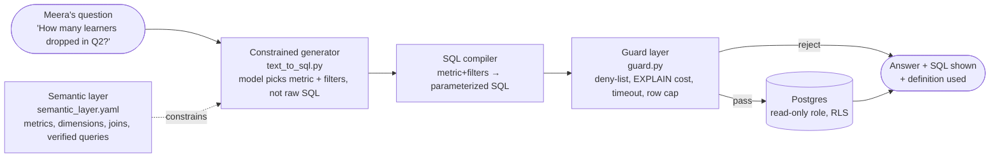

# Chapter 16 — Structured Data: Semantic Layers and Text-to-SQL

## What you'll be able to do after this chapter

1. Explain, with a concrete example, why letting a model write SQL against your raw schema produces answers that are confidently wrong rather than obviously wrong — and why that is worse.
2. Design a semantic layer — metrics, dimensions, allowed joins, verified queries — that a model generates *against* instead of the physical schema, and state the decision rule for when a metric belongs in the layer.
3. Build a guard layer that enforces a read-only role, a statement timeout, a row cap, a cost estimate via `EXPLAIN`, and a deny-list, independent of whatever the model generates.
4. Implement the "show your SQL" citation pattern so a non-technical stakeholder can verify an analytics answer without reading the code that produced it.
5. Answer Meridian's Q2-drop question end to end — definition, SQL, guard, result — against the schema built in Chapter 12.
6. Write tests that prove an out-of-layer query is refused, a write statement is refused, and a runaway query is killed by the timeout, without a live database.

---

## The problem this solves

Meera Krishnan runs the numbers Meridian's program team needs to plan the next cohort. Today that means emailing Priya's data engineer, waiting three business days, and getting back a spreadsheet she has to trust blind. C3 exists to collapse three days to three seconds. It is also the capability most likely to produce a wrong answer that nobody notices, because the failure mode of text-to-SQL is not a crash — it's a plausible number.

Here is the scenario that will happen if you skip this chapter. Meera types: *"How many learners dropped in Q2 2026?"* into AtlasDesk. A naive text-to-SQL system — model sees the full schema, model writes SQL, system runs it, system prints the number — produces:

```sql
SELECT COUNT(*) FROM enrollments WHERE status = 'dropped';
```

This runs without error. It returns a number. Meera puts the number in a board deck. The number is wrong in at least three ways, and none of them threw an exception:

- **No date filter at all.** The query counts every drop since Meridian's founding, not Q2 2026. The model had `dropped_at` available and chose `status = 'dropped'` instead, because both look right and only one of them is what "in Q2" means.
- **No tenant filter.** Meridian runs two brands, `meridian-core` and `meridian-exec`, in the same tables. This query silently blends both. If the enrollment counts differ by tenant — they do — the number is meaningless for either brand's planning.
- **An undefined business term.** "Dropped" is not one thing at Meridian. It could mean the enrollment `status` column transitioned to `'dropped'`, or it could mean `dropped_at IS NOT NULL` regardless of current status (a learner can be reinstated), or it could exclude anyone who dropped and re-enrolled within 14 days as a data-entry correction, per a rule Priya's team applies manually. Nobody has ever written this definition down, so the model guessed, and its guess is invisible in the output.

Rerun the question with a rephrasing — "how many learners left in the second quarter" — and a naive system can produce a *different* number from the same underlying data, because the model chose a different, equally plausible, equally silent interpretation. That is the specific failure this chapter defends against: not that text-to-SQL fails loudly, but that it succeeds twice, differently, and both times looks fine.

The second failure mode is structural rather than semantic: joins. Meridian's fee-collection question needs `payments` joined to `enrollments` on `learner_id`, filtered to the right cohort, aggregated per instalment without double-counting a learner who has three instalment rows. A model given the raw schema and no guidance will sometimes pick the wrong join key, sometimes fan out a one-to-many join and inflate a `COUNT`, and sometimes just guess a plausible-looking `JOIN` that happens to be syntactically valid and semantically wrong. Postgres will run it. It will return rows. Nothing will look broken.

The fix is not "write a better prompt." It's an architectural one: never let the model see the raw schema, never let it write arbitrary SQL, and never trust a query's success as proof of its correctness. This chapter builds all three controls, plus the one thing that makes analytics answers auditable by a person who does not read SQL: show the query, every time.

---

## Concepts

### Why naive text-to-SQL fails in production

Split the failure modes into two categories, because they need different fixes.

**Category 1 — structural failures**, which SQL itself can catch or a guard can catch:

| Failure | Example | Why it happens |
|---|---|---|
| Wrong join key or direction | Joining `payments` to `courses` instead of `enrollments` | Schema alone doesn't say which FK path is the *business-correct* one when several exist |
| Fan-out inflation | `COUNT(*)` after a one-to-many join multiplies rows | The model doesn't know the cardinality of a join it just wrote |
| Missing tenant filter | Cross-tenant aggregate | `tenant_id` is a column like any other unless something forces it into every query |
| Unbounded scan | No `LIMIT`, no date bound, on a multi-million-row table | The model has no cost model; it writes whatever answers the English question |
| Write masquerading as read | `UPDATE ... RETURNING` or a CTE with a side effect | A model asked to "fix the discrepancy" may try to write, not just report |

**Category 2 — semantic failures**, which no amount of SQL correctness fixes, because the query is syntactically fine and still wrong:

| Failure | Example |
|---|---|
| Undefined business term | "Active learner" — `status = 'active'` in `learners`? An `enrollments` row with no `dropped_at`? Enrolled *and* has a payment in the last 60 days? |
| Silent metric drift | Two dashboards define "drop rate" with different denominators; a text-to-SQL system picks whichever one the model's training happened to bias toward |
| Ambiguous time window | "Q2" — calendar quarter, fiscal quarter, or cohort-relative quarter (12 weeks from enrollment)? |
| Hidden aggregation choice | "Average fee" — per learner, per instalment, or per payment event, all different numbers from the same rows |

Category 1 is a solved problem: constrain the surface the model can write against, and check the SQL mechanically before running it. Category 2 has no mechanical fix — it needs a human-authored definition, written down once, referenced every time. That authored definition is the semantic layer, and it is the actual deliverable of this chapter, more than the SQL generation code around it.

### The semantic layer: what it is and what it isn't

A semantic layer is a curated, versioned set of **metrics**, **dimensions**, and **allowed joins**, expressed independently of the physical schema, that sits between the model and the database. The model never sees `CREATE TABLE` statements. It sees a menu.



Read this left to right as a narrowing funnel, not a pipeline of trust. The semantic layer is not advice the model can take or leave — the generator's schema (Pydantic, not free text) only lets the model choose a metric name, dimension filters, and a grain from a closed set defined in the YAML; it cannot invent a column. The compiler is a deterministic function from that closed set to parameterized SQL — this is the step that eliminates join-key guessing and fan-out, because the join path for each metric is written once by a human and reused every time. The guard layer runs *after* generation and *before* execution, and it does not trust that the previous two stages did their job — it re-checks independently, because defence in depth means the compiler being correct today doesn't protect you from a bug in it next month. Only after all three does anything touch the database, through a role that cannot write regardless of what reaches it.

The decision rule for what goes in the semantic layer:

> **A number goes in the semantic layer only when someone with domain authority (Meera, for AtlasDesk) has signed off on its definition in writing.** If nobody can state the definition of "active learner" in one sentence, it does not get a metric — the system refuses the question and says so, rather than guessing. Switch this to a self-service, model-suggests-a-definition flow only after you have 20+ approved metrics and a review process fast enough to keep up with requests — below that volume, the review bottleneck is a feature, not a problem, because it's the only thing stopping metric drift.

### Metrics, dimensions, allowed joins, verified queries

Four building blocks, each with a distinct job:

| Block | Answers | Example (Meridian) |
|---|---|---|
| **Metric** | What number are we computing, and what is its exact SQL expression? | `enrollment_count`: `COUNT(DISTINCT e.id)` |
| **Dimension** | What can we slice or filter the metric by? | `cohort`, `tenant_id`, `quarter`, `instalment` |
| **Allowed join** | Which tables can this metric legally traverse, and on what key? | `enrollments.learner_id = learners.learner_id`, never `enrollments.course_id = payments.id` |
| **Verified query** | A worked example: this exact English question maps to this exact SQL, human-approved | "How many learners dropped in Q2 2026?" → the compiled SQL below, approved by Meera |

Verified queries do double duty. They are few-shot examples that measurably improve generation accuracy — Snowflake's own data on Cortex Analyst attributes a meaningful accuracy gain to exactly this mechanism (see *How industry does it*) — and they are the audit trail that lets Meera or Priya check, at any time, "is this the query we agreed on." Store them alongside the metrics, not in a separate prompt file, so the two never drift apart.

### Schema-constrained generation vs. free-form SQL generation

| | Free-form generation (model writes SQL directly) | Schema-constrained generation (this chapter) |
|---|---|---|
| What the model sees | Full `CREATE TABLE` statements | A closed list of metric names, dimensions, and their descriptions |
| What the model outputs | A SQL string | A structured request: `{metric, filters, group_by}` (a Pydantic model) |
| Failure mode when wrong | Syntactically valid, semantically wrong SQL that runs | The requested metric/dimension doesn't exist → refused before any SQL is built |
| Join correctness | Model's guess, per call | Written once by a human, reused every call |
| Auditability | Read the generated SQL, every time, to know if it's right | Read the metric name; the SQL behind it doesn't change without a review |
| New question type | Model attempts it regardless of coverage | Explicitly out-of-scope until someone adds the metric |

**Decision rule:** use schema-constrained generation for any recurring analytics surface exposed to non-engineers — which is exactly C3. Free-form SQL generation is acceptable only for a tool used exclusively by engineers who can read and review the generated SQL themselves before it runs, and even then it needs the guard layer below. **Switch away from schema-constrained generation only if** your metric catalogue has genuinely outgrown curation — hundreds of ad hoc one-off questions per week that no reasonable review process can keep up with — at which point the more defensible move is a broader self-service BI layer with its own governance, not looser text-to-SQL.

### The guard layer: defence that doesn't trust the generator

The guard layer exists because the compiler will eventually have a bug, someone will eventually bypass it in a debugging session, and a "verified" query will eventually be pasted somewhere it shouldn't be run. Four independent controls, each cheap, each catching a different failure class:

| Control | Catches | Cost if skipped |
|---|---|---|
| **Read-only DB role** | Any write, however it got generated | A single bad `UPDATE` corrupts production data |
| **Statement timeout** | A query that scans everything because a filter got dropped | One runaway query starves the connection pool for every other user |
| **Row limit** | A result set with no aggregation, accidentally returned to a chat UI | A learner's PII for 40,000 people printed into a transcript |
| **Cost estimate via `EXPLAIN`** | A query that is syntactically fine but will scan 40M rows for a number that should come from an index | Silent multi-second-to-multi-minute latency, and a query planner surprise nobody diagnoses until the DB is slow for everyone |
| **Deny-list** | Anything the parser missed: `pg_read_file`, `COPY`, DDL keywords, multiple statements | Defence in depth against parser gaps and cleverness |

Every one of these is enforceable *without trusting the LLM at all* — that's the property that matters. A determined or malfunctioning generator can only ever produce a request the guard layer independently verifies is safe; it cannot talk the guard layer out of checking.

> **▸ Senior practice #16 — Read-only roles and query cost limits**
>
> The single habit that separates a text-to-SQL feature that survives its first year from one that causes an incident: the database connection the feature uses **cannot write, cannot see other tenants' rows, and cannot run for more than a few seconds**, enforced by the database itself — a role grant and a session-level `statement_timeout` — not by application code that might have a bug.
>
> This matters because every other layer in this chapter (the semantic layer, the compiler, the deny-list) is application logic, and application logic ships bugs. A Postgres role with `GRANT SELECT` only, row-level security predicates that the role cannot bypass, and a `SET statement_timeout` on every session are enforced by the database process itself, underneath your code, immune to a bug in your code. When in doubt about which control to build first, build this one — it is the control that still holds after everything else has failed.
>
> We wire this up in `migrations/0004_analytics_roles.sql` below, and prove it holds with a test that tries to write through the analytics path and is refused by Postgres, not by application logic.

### Result validation and "show your SQL"

Two more controls close the loop between "the query ran" and "the answer is trustworthy":

**Result validation** checks the *shape* of what came back, not just that the query succeeded: is the row count sane for the question type (a single COUNT question returning 40,000 rows means something upstream is wrong), are there nulls where the metric definition guarantees there shouldn't be, does the number fall inside a plausible range given the last N runs of the same metric. This is cheap and catches the class of bug where the SQL is correct but the join fan-out still crept in through an edge the compiler didn't anticipate.

**"Show your SQL"** is the citation pattern for structured data, doing the same job Chapter 6's `Citation` model does for retrieved text: it lets someone who did not write the code verify the answer without trusting the system's word for it. Every C3 answer AtlasDesk gives carries three things back to the user: the number, the exact SQL that produced it (using the semantic layer's logical names, per the Cortex Analyst convention of keeping verified queries readable against the abstraction rather than the physical schema), and the metric definition in one sentence. Meera can read the SQL. She doesn't have to — but the fact that she *can*, every time, without asking an engineer, is what makes the number usable in a board deck. A number without its SQL attached is a claim; a number with its SQL attached is a checkable claim, and only the second kind survives contact with a CFO's question of "wait, how did you calculate that."

**Decision rule:** if a stakeholder cannot independently verify a number your system produced — by reading the SQL, or by asking someone who can — do not ship that number into a report. **Switch to full self-service BI** (a tool Meera queries directly, no LLM in the loop) only once your metric catalogue is stable enough that natural-language convenience stops being worth the generation risk — for AtlasDesk that threshold is roughly "the same 15–20 metrics get asked in 40+ phrasings a week," at which point a dashboard is cheaper and safer than another round of prompt tuning.

---

## How industry does it

### Case 1 — Snowflake Cortex Analyst: verified queries as the accuracy lever

**The problem.** Snowflake's enterprise customers wanted natural-language analytics over data already living in Snowflake, without a data team writing SQL for every question, and without the well-known failure mode of a model hallucinating column names or joins against a large physical schema.

**The architecture.** Cortex Analyst separates the physical schema from a **semantic model** — a YAML definition of logical tables, columns, synonyms, and metrics — and layers a multi-agent generation pipeline on top: a classification agent filters out ambiguous or non-analytical questions before any SQL is attempted, a context-enrichment step retrieves relevant literal values, multiple SQL-generation passes run for robustness, and an error-correction agent uses the SQL compiler's own errors to repair syntactic and semantic mistakes before returning an answer. Snowflake's engineering write-up on the system credits a specific mechanism — the **Verified Query Repository**, a curated library of human-approved question-to-SQL pairs stored inside the semantic model itself — as a primary lever for accuracy: when a new question resembles a verified one, generation is grounded against the approved SQL pattern rather than generated from scratch, and Snowflake's documentation is explicit that verified queries must reference the semantic model's logical names, not the underlying physical schema, so the abstraction layer never leaks.

**The measured outcome.** Snowflake's own benchmarking, published on its engineering blog, reports Cortex Analyst achieving over 90% SQL accuracy on real-world use cases and roughly double the accuracy of single-shot SQL generation from a frontier general-purpose LLM prompted directly against the schema — the exact comparison this chapter's "naive vs. constrained" framing makes.

**What you should copy at 1/1000th the scale.** You will not build a six-agent SQL pipeline for Meridian's 40,000 learners, and you don't need to. What transfers directly: (1) separate the semantic model from the physical schema as a first-class artifact, not a prompt fragment; (2) treat verified queries as the highest-leverage thing you curate — every real question Meera asks and approves becomes a permanent few-shot example and a permanent regression case, exactly like Chapter 18's eval set; (3) never let a "verified" query reference physical column names, because that's the seam where the abstraction leaks the moment your DBA renames a column.

### Case 2 — Uber QueryGPT: business-logic retrieval, not just schema retrieval

**The problem.** Uber's internal analysts and engineers were spending, by the company's own account, around 10 minutes per query writing SQL by hand against Uber's enormous multi-table schema — 1.2 million interactive queries run monthly, over a third from operations teams who are not primarily engineers.

**The architecture.** QueryGPT's key design choice is exactly this chapter's thesis, independently arrived at: don't hand a model the whole schema and hope. An **Intent Agent** first classifies the question into a business domain — Mobility, Ads, Core Services — which narrows the searchable schema before generation even starts. A **Table Agent** proposes the relevant tables and lets the human confirm before SQL is written, rather than committing to a join path silently. A **Column Prune Agent** strips irrelevant columns from the prompt specifically to cut token cost and reduce the chance the model reaches for the wrong column. Retrieval-augmented few-shot examples — Uber's version of a verified-query library — supply worked SQL for similar past questions. Uber's public account is candid that the system went through more than 20 iterations from a hackathon prototype using naive similarity search to this multi-agent design, which is itself a useful data point: schema-unconstrained generation was the *first* thing they tried, and it didn't hold up at their scale.

**The measured outcome.** In Uber's limited-release rollout with roughly 300 daily active users, query-authoring time dropped from about 10 minutes to about 3 minutes, and roughly 78% of surveyed users reported the generated queries measurably reduced their time spent on manual authoring.

**What you should copy at 1/1000th the scale.** The Intent Agent pattern — classify to a domain before generating — maps directly onto Meridian's own layer split: is this an enrollments question, a payments question, or a fee-collection question? Route to the relevant slice of the metric catalogue first, the same way `text_to_sql.py` below rejects a request outside its known metrics before it ever tries to compile SQL. The human-confirms-tables step is worth copying even at Meridian's scale in spirit, if not in UI: our version is that the compiled SQL is *shown*, not hidden, before the answer is delivered — the confirmation step, just moved to be visible rather than blocking.

---

## Build: AtlasDesk increment 16 — the semantic layer and guarded text-to-SQL

### Project state

**What exists going into this chapter:** the provider layer and `LLMClient` Protocol (Ch 4) with `llm/fake.py` for keyless tests (Amendment A2); structured outputs and the repair loop (Ch 6); the `learners`, `courses`, `enrollments`, `payments` tables and the MCP tool registry over them (Ch 12); the hand-written agent loop (Ch 13) and LangGraph orchestration (Ch 14) that C3 will eventually be routed through as a tool-calling branch; the router pattern from Chapter 15 that decides *which* capability a question belongs to.

**What this chapter adds:** `analytics/semantic_layer.yaml` (the metric/dimension/join catalogue with Meridian's real metrics), `analytics/text_to_sql.py` (schema-constrained generation and SQL compilation), `analytics/guard.py` (the independent safety layer — deny-list, timeout, row cap, `EXPLAIN` cost check), and `migrations/0004_analytics_roles.sql` (the read-only role and row-level security that make the guard's read-only claim true at the database level, not just in application code).

### Repo tree diff

```text
  atlasdesk/
    src/atlasdesk/
      llm/                      # Ch 4 — unchanged
      tools/                    # Ch 12 — unchanged
      agent/                    # Ch 13-15 — unchanged
+     analytics/
+     ├── __init__.py
+     ├── semantic_layer.yaml    # metrics, dimensions, joins, verified queries
+     ├── models.py              # Pydantic contracts for the layer + requests
+     ├── loader.py              # loads and validates the YAML at startup
+     ├── text_to_sql.py         # constrained generation + SQL compilation
+     └── guard.py               # deny-list, timeout, row cap, EXPLAIN cost check
  migrations/
    0001_documents.sql .. 0003_approvals.sql   # Ch 8-14 — unchanged
+   0004_analytics_roles.sql    # read-only role + row-level security
  tests/
+   test_text_to_sql.py
+   test_guard.py
```

### 1. The semantic layer as data

Meridian's three real metrics, with the joins and dimensions Meera actually needs, and one verified query answering the exact Q2-drop question from the chapter opening.

```yaml
# analytics/semantic_layer.yaml
# The single source of truth for what AtlasDesk's analytics capability (C3)
# is allowed to compute. The model never sees the tables below this file;
# it only ever sees the metric and dimension names, never the SQL.
version: 1

tables:
  learners:
    physical: learners
    primary_key: learner_id
  enrollments:
    physical: enrollments
    primary_key: id
  payments:
    physical: payments
    primary_key: id
  courses:
    physical: courses
    primary_key: course_id

# Allowed joins: the only paths generation is permitted to traverse.
# Anything not listed here cannot be produced by the compiler, full stop.
joins:
  - name: enrollments_to_learners
    left: enrollments
    right: learners
    "on": "enrollments.learner_id = learners.learner_id"
  - name: enrollments_to_courses
    left: enrollments
    right: courses
    "on": "enrollments.course_id = courses.course_id"
  - name: payments_to_learners
    left: payments
    right: learners
    "on": "payments.learner_id = learners.learner_id"
  - name: payments_to_enrollments
    left: payments
    right: enrollments
    "on": "payments.learner_id = enrollments.learner_id"

dimensions:
  tenant_id:
    table: learners
    column: tenant_id
    description: "Meridian brand: meridian-core or meridian-exec. Always required."
  cohort:
    table: courses
    column: cohort
    description: "Course cohort label, e.g. '2026'."
  instalment:
    table: payments
    column: instalment
    description: "Fee instalment number, 1-3."
  quarter:
    table: enrollments
    column: dropped_at
    description: >
      Calendar quarter derived from a timestamp column at query time.
      Bounds are computed by the generator, never guessed by the model:
      Q2 2026 is [2026-04-01, 2026-06-30] inclusive, Meridian's fiscal
      year matches the calendar year.

# Metrics: the only numbers this system can compute. Each metric names
# the tables it needs (which fixes the join path via `joins` above), the
# exact SQL expression, and the business definition in plain English —
# approved by Meera Krishnan, program analytics lead, 2026-07-30.
metrics:
  enrollment_count:
    tables: [enrollments]
    expression: "COUNT(DISTINCT enrollments.id)"
    definition: >
      Number of enrollment records. An enrollment, not a learner — one
      learner with two course enrollments counts twice. Use
      active_learner_count for a per-learner count.
    allowed_dimensions: [tenant_id, cohort, quarter]

  active_learner_count:
    tables: [enrollments, learners]
    expression: "COUNT(DISTINCT learners.learner_id)"
    filter: "enrollments.status = 'active'"
    definition: >
      Distinct learners with at least one enrollment currently in
      status='active'. Excludes dropped, completed, and suspended
      learners even if they hold another active enrollment elsewhere —
      a learner counts once regardless of enrollment count. Approved
      definition: Meera Krishnan, 2026-07-30. This is the ONLY sanctioned
      meaning of "active learner" in AtlasDesk; do not derive a
      competing definition ad hoc.
    allowed_dimensions: [tenant_id, cohort]

  drop_count:
    tables: [enrollments]
    expression: "COUNT(DISTINCT enrollments.id)"
    filter: "enrollments.status = 'dropped' AND enrollments.dropped_at IS NOT NULL"
    definition: >
      Enrollments whose status transitioned to 'dropped' with a recorded
      dropped_at timestamp. Filtered by dropped_at, not enrolled_at, when
      a time window is requested — a learner who enrolled in Q1 and
      dropped in Q2 counts in Q2, not Q1. Approved definition: Meera
      Krishnan, 2026-07-30.
    allowed_dimensions: [tenant_id, cohort, quarter]

  fee_collected_amount:
    tables: [payments]
    expression: "COALESCE(SUM(payments.amount_inr), 0)"
    filter: "payments.paid_at IS NOT NULL"
    definition: >
      Sum of amount_inr for payment rows with a non-null paid_at. This is
      collected fees, not billed fees — use fee_due_amount for the
      denominator of a collection-rate question, and never divide one by
      a differently-filtered version of the other.
    allowed_dimensions: [tenant_id, instalment]

  fee_due_amount:
    tables: [payments]
    expression: "COALESCE(SUM(payments.amount_inr), 0)"
    definition: >
      Sum of amount_inr for all payment rows regardless of paid_at.
      Denominator for fee collection rate. Approved definition: Meera
      Krishnan, 2026-07-30.
    allowed_dimensions: [tenant_id, instalment]

# Verified queries: real, approved question -> compiled-SQL pairs. These
# are both few-shot examples for the generator and the audit trail Meera
# checks against. Never edit the sql field without re-approval; add a new
# entry instead so history is preserved.
verified_queries:
  - id: vq-001
    question: "How many learners dropped in Q2 2026?"
    metric: drop_count
    filters:
      quarter: "2026-Q2"
    approved_by: "Meera Krishnan"
    approved_at: "2026-07-30"
    sql: >
      SELECT COUNT(DISTINCT enrollments.id) AS drop_count
      FROM enrollments
      JOIN learners ON enrollments.learner_id = learners.learner_id
      WHERE learners.tenant_id = %(tenant_id)s
        AND enrollments.status = 'dropped'
        AND enrollments.dropped_at IS NOT NULL
        AND enrollments.dropped_at >= %(period_start)s
        AND enrollments.dropped_at < %(period_end)s
      LIMIT 1000
```

Two things about this file are worth noticing before moving to code. First, every metric's `definition` is prose a non-engineer wrote or approved — that prose *is* the artifact this chapter exists to produce; the SQL is just its executable form. Second, `active_learner_count`'s definition explicitly forecloses the ad hoc alternative definitions from the chapter opening. That sentence — "this is the ONLY sanctioned meaning" — is doing real work: it is the thing that stops two dashboards from quietly disagreeing.

### 2. Typed contracts for the layer and for requests

```python
# analytics/models.py
"""Pydantic contracts for the semantic layer and for text-to-SQL requests.

The model (the LLM) only ever populates AnalyticsRequest. It never writes
SQL directly. Everything else here is either loaded from
semantic_layer.yaml or produced deterministically by the compiler.
"""

from __future__ import annotations

from datetime import date
from typing import Literal

from pydantic import BaseModel, Field, field_validator

QuarterLiteral = str  # validated at parse time, e.g. "2026-Q2"


class Join(BaseModel):
    name: str
    left: str
    right: str
    on: str


class Dimension(BaseModel):
    name: str
    table: str
    column: str
    description: str


class Metric(BaseModel):
    name: str
    tables: list[str]
    expression: str
    definition: str
    allowed_dimensions: list[str]
    filter: str | None = None


class VerifiedQuery(BaseModel):
    id: str
    question: str
    metric: str
    filters: dict[str, str] = Field(default_factory=dict)
    approved_by: str
    approved_at: date
    sql: str


class SemanticLayer(BaseModel):
    """The fully loaded, validated contents of semantic_layer.yaml."""

    version: int
    joins: list[Join]
    dimensions: dict[str, Dimension]
    metrics: dict[str, Metric]
    verified_queries: list[VerifiedQuery]

    def metric_names(self) -> frozenset[str]:
        return frozenset(self.metrics)

    def dimension_names(self) -> frozenset[str]:
        return frozenset(self.dimensions)


class AnalyticsRequest(BaseModel):
    """What the LLM is allowed to produce. No SQL, no table names, no raw
    column names — only a metric it picked from a closed enum-like set
    (validated against the loaded SemanticLayer, not hardcoded here,
    because the set changes when the YAML changes) and dimension filters
    from the same closed set.

    Contract: `metric` and every key in `filters` must exist in the
    SemanticLayer the request is validated against. Validation happens in
    `text_to_sql.compile_request`, not here, because this model has no
    access to the loaded layer — keeping it a pure data contract.
    """

    metric: str
    filters: dict[str, str] = Field(default_factory=dict)
    tenant_id: str
    reasoning: str = Field(
        description="One sentence: why this metric and these filters answer the question."
    )

    @field_validator("metric")
    @classmethod
    def _metric_not_empty(cls, value: str) -> str:
        if not value.strip():
            raise ValueError("metric must not be empty")
        return value


class CompiledQuery(BaseModel):
    """A fully compiled, parameterized SQL query, ready for the guard layer.

    `sql` uses %(name)s-style placeholders; `params` supplies the values.
    Never string-interpolate `params` into `sql` — the whole point of this
    type is that the two travel together and get executed with a
    parameterized driver call, never with an f-string.
    """

    sql: str
    params: dict[str, object]
    metric: str
    definition: str
    source: Literal["verified_query", "compiled"]


class AnalyticsAnswer(BaseModel):
    """What C3 actually returns to the user — the 'show your SQL' contract."""

    value: object
    metric: str
    definition: str
    sql_shown: str
    row_count: int
```

### 3. Loading and validating the layer at startup

Fail on startup, not on the first bad question. A malformed metric definition — a join name that doesn't exist, a dimension not declared anywhere — is a deploy-time defect, and the loader treats it as one.

```python
# analytics/loader.py
"""Load and validate analytics/semantic_layer.yaml at process startup.

Contract: raises SemanticLayerError, never returns a partially valid
layer. A bad YAML file must fail the deploy, not fail the first user
question three hours later.
"""

from __future__ import annotations

from pathlib import Path

import yaml
from pydantic import ValidationError

from analytics.models import Join, Metric, SemanticLayer, VerifiedQuery
from atlasdesk.errors import AtlasError

DEFAULT_PATH = Path(__file__).resolve().parent / "semantic_layer.yaml"


class SemanticLayerError(AtlasError):
    """The semantic layer YAML is missing, malformed, or internally
    inconsistent (e.g. a metric names a join that does not exist)."""


def load_semantic_layer(path: Path = DEFAULT_PATH) -> SemanticLayer:
    """Load, parse, and cross-validate the semantic layer.

    Raises:
        SemanticLayerError: the file is missing, not valid YAML, fails
            Pydantic validation, or fails a cross-reference check (a
            metric references a table with no join path, or a dimension
            not declared in `allowed_dimensions` anywhere).
    """
    try:
        raw = yaml.safe_load(path.read_text(encoding="utf-8"))
    except FileNotFoundError as exc:
        raise SemanticLayerError(f"semantic layer not found at {path}") from exc
    except yaml.YAMLError as exc:
        raise SemanticLayerError(f"{path}: invalid YAML — {exc}") from exc

    joins = [Join(name=j["name"], left=j["left"], right=j["right"], on=j["on"]) for j in raw.get("joins", [])]
    dimensions = {
        key: dict(name=key, **value) if "name" in value else {"name": key, **value}
        for key, value in raw.get("dimensions", {}).items()
    }
    metrics_raw = raw.get("metrics", {})
    verified_raw = raw.get("verified_queries", [])

    try:
        layer = SemanticLayer(
            version=raw["version"],
            joins=joins,
            dimensions={k: v if isinstance(v, dict) else v for k, v in dimensions.items()},  # type: ignore[arg-type]
            metrics={name: Metric(name=name, **body) for name, body in metrics_raw.items()},
            verified_queries=[VerifiedQuery(**vq) for vq in verified_raw],
        )
    except (ValidationError, KeyError, TypeError) as exc:
        raise SemanticLayerError(f"{path}: schema validation failed — {exc}") from exc

    _cross_validate(layer)
    return layer


def _cross_validate(layer: SemanticLayer) -> None:
    """Check references between metrics, dimensions, and joins.

    This is what makes the loader stricter than plain Pydantic validation:
    Pydantic checks shape, this checks that the graph is internally
    consistent (no metric points at a dimension or join path that was
    never declared).
    """
    join_tables = {(j.left, j.right) for j in layer.joins} | {(j.right, j.left) for j in layer.joins}

    for metric in layer.metrics.values():
        for dim_name in metric.allowed_dimensions:
            if dim_name not in layer.dimensions:
                raise SemanticLayerError(
                    f"metric '{metric.name}' allows dimension '{dim_name}' "
                    "which is not declared in `dimensions`"
                )
        base = metric.tables[0]
        for other in metric.tables[1:]:
            if (base, other) not in join_tables and (other, base) not in join_tables:
                raise SemanticLayerError(
                    f"metric '{metric.name}' needs {base}->{other} but no `joins` "
                    "entry connects them"
                )

    for vq in layer.verified_queries:
        if vq.metric not in layer.metrics:
            raise SemanticLayerError(
                f"verified query '{vq.id}' references unknown metric '{vq.metric}'"
            )
```

### 4. Constrained generation and SQL compilation

The generator asks the model for a structured `AnalyticsRequest`, never for SQL. Reused pattern from Chapter 6: `LLMClient.structured()` with a repair loop, projected onto a purpose-built schema (Amendment A3's pattern — a generation-time model distinct from the answer contract). Note what is absent: there is no code path anywhere in this module that takes model output and passes it to a database driver. The model's only power is to select a `metric` name and `filters` from strings; everything that becomes SQL is written by a human in the YAML or in `_TEMPLATES` below.

```python
# analytics/text_to_sql.py
"""Schema-constrained text-to-SQL: the model selects a metric and filters
from the semantic layer; this module compiles that selection into
parameterized SQL. The model never sees a table name and never produces a
SQL string that reaches the database.
"""

from __future__ import annotations

import re
from collections.abc import Sequence
from datetime import date

from atlasdesk.errors import AtlasError
from atlasdesk.llm.base import LLMClient, Message
from atlasdesk.security.principal import Principal

from analytics.models import AnalyticsRequest, CompiledQuery, Metric, SemanticLayer

_SYSTEM_PROMPT = (
    "You translate an analytics question into a request against Meridian's "
    "semantic layer. You may ONLY choose a metric name and dimension filters "
    "from the list provided below. You have no knowledge of any database "
    "table, column, or SQL syntax, and you must never attempt to write any. "
    "If no listed metric answers the question, set metric to the literal "
    "string 'NO_MATCHING_METRIC' and explain why in `reasoning`.\n\n"
    "Available metrics:\n{catalogue}"
)

_QUARTER_RE = re.compile(r"^(?P<year>\d{4})-Q(?P<q>[1-4])$")


class TextToSQLError(AtlasError):
    """Raised when a request cannot be safely compiled: unknown metric,
    unknown dimension, or a filter value the compiler cannot parse."""


def _catalogue_text(layer: SemanticLayer) -> str:
    lines = []
    for metric in layer.metrics.values():
        dims = ", ".join(metric.allowed_dimensions) or "none"
        lines.append(f"- {metric.name}: {metric.definition.strip()} (filterable by: {dims})")
    return "\n".join(lines)


async def generate_request(
    question: str,
    *,
    principal: Principal,
    layer: SemanticLayer,
    client: LLMClient,
    model: str | None = None,
) -> AnalyticsRequest:
    """Ask the model to pick a metric and filters. Never returns SQL.

    Raises:
        TextToSQLError: the model's structured output failed validation
            after the repair loop (Ch 6), or it explicitly reported
            NO_MATCHING_METRIC.
    """
    system = _SYSTEM_PROMPT.format(catalogue=_catalogue_text(layer))
    result = await client.structured(
        [Message(role="user", content=question)],
        schema=AnalyticsRequest,
        system=system,
        model=model,
        max_repairs=1,
    )
    request = result.value
    if request.metric == "NO_MATCHING_METRIC":
        raise TextToSQLError(
            f"no metric in the semantic layer answers this question: {request.reasoning}"
        )
    return AnalyticsRequest(
        metric=request.metric,
        filters=request.filters,
        tenant_id=principal.tenant_id,
        reasoning=request.reasoning,
    )


def _quarter_bounds(literal: str) -> tuple[date, date]:
    """'2026-Q2' -> (2026-04-01, 2026-07-01) [start inclusive, end exclusive].

    Deterministic, not model-guessed — this is exactly the ambiguity
    (calendar vs fiscal vs cohort-relative quarter) the chapter's Concepts
    section calls out. Meridian's fiscal year matches the calendar year,
    per the dimension's description in semantic_layer.yaml.
    """
    match = _QUARTER_RE.match(literal)
    if not match:
        raise TextToSQLError(f"'{literal}' is not a recognised quarter literal, expected e.g. '2026-Q2'")
    year, quarter = int(match["year"]), int(match["q"])
    start_month = (quarter - 1) * 3 + 1
    start = date(year, start_month, 1)
    end_month, end_year = (start_month + 3, year) if start_month + 3 <= 12 else (start_month + 3 - 12, year + 1)
    end = date(end_year, end_month, 1)
    return start, end


def compile_request(request: AnalyticsRequest, *, layer: SemanticLayer) -> CompiledQuery:
    """Deterministically compile a validated AnalyticsRequest into SQL.

    This function is the entire join-correctness and tenant-safety story:
    it is the only place a table name or JOIN keyword is written, and it
    is written once, by a human, reviewed like any other change to
    production SQL — never generated per-request.

    Raises:
        TextToSQLError: the metric or a filter key/value is not in the
            semantic layer, so no safe SQL can be produced.
    """
    metric: Metric | None = layer.metrics.get(request.metric)
    if metric is None:
        raise TextToSQLError(
            f"'{request.metric}' is not a metric in the semantic layer; "
            f"known metrics: {sorted(layer.metric_names())}"
        )

    for filter_key in request.filters:
        if filter_key not in metric.allowed_dimensions:
            raise TextToSQLError(
                f"metric '{metric.name}' does not allow filtering by '{filter_key}'; "
                f"allowed: {metric.allowed_dimensions}"
            )

    from_clause, joins_sql = _build_from(metric, layer)
    where_parts = ["learners.tenant_id = %(tenant_id)s"] if "learners" in _tables_touched(metric, layer) else []
    params: dict[str, object] = {"tenant_id": request.tenant_id}

    if metric.filter:
        where_parts.append(metric.filter)

    if "quarter" in request.filters:
        start, end = _quarter_bounds(request.filters["quarter"])
        where_parts.append("enrollments.dropped_at >= %(period_start)s")
        where_parts.append("enrollments.dropped_at < %(period_end)s")
        params["period_start"] = start
        params["period_end"] = end

    if "cohort" in request.filters:
        where_parts.append("courses.cohort = %(cohort)s")
        params["cohort"] = request.filters["cohort"]

    if "instalment" in request.filters:
        where_parts.append("payments.instalment = %(instalment)s")
        params["instalment"] = int(request.filters["instalment"])

    where_sql = " AND ".join(where_parts) if where_parts else "TRUE"
    sql = (
        f"SELECT {metric.expression} AS {metric.name}\n"
        f"FROM {from_clause}\n"
        f"{joins_sql}"
        f"WHERE {where_sql}\n"
        f"LIMIT 1000"
    )
    return CompiledQuery(
        sql=sql, params=params, metric=metric.name, definition=metric.definition.strip(), source="compiled"
    )


def _tables_touched(metric: Metric, layer: SemanticLayer) -> set[str]:
    touched = set(metric.tables)
    for join in layer.joins:
        if join.left in touched or join.right in touched:
            touched |= {join.left, join.right}
    return touched


def _build_from(metric: Metric, layer: SemanticLayer) -> tuple[str, str]:
    """Return (base table, JOIN clauses) covering exactly metric.tables,
    using only paths declared in `joins`. Deterministic and order-stable
    so compiled SQL is diffable across runs."""
    base = metric.tables[0]
    needed = set(metric.tables[1:])
    if "learners" not in metric.tables and any(
        j.right == "learners" and j.left == base for j in layer.joins
    ):
        needed.add("learners")  # tenant filter always needs a path to learners

    joined: set[str] = {base}
    clauses: list[str] = []
    for join in sorted(layer.joins, key=lambda j: j.name):
        if join.left in joined and join.right in (needed - joined):
            clauses.append(f"JOIN {join.right} ON {join.on}")
            joined.add(join.right)
        elif join.right in joined and join.left in (needed - joined):
            clauses.append(f"JOIN {join.left} ON {join.on}")
            joined.add(join.left)

    missing = needed - joined
    if missing:
        raise TextToSQLError(f"no join path from '{base}' to {sorted(missing)} in semantic_layer.yaml")
    return base, ("".join(f"{c}\n" for c in clauses))


def find_verified_query(question: str, *, layer: SemanticLayer) -> CompiledQuery | None:
    """Exact-match lookup against the verified-query library.

    Production AtlasDesk also does a fuzzy/embedding match here (Ch 9's
    embedding layer, reused) so paraphrases of an approved question hit
    the verified path too; this book keeps the lookup exact for
    determinism in tests and shows where the fuzzy step would slot in.
    """
    normalized = question.strip().lower()
    for vq in layer.verified_queries:
        if vq.question.strip().lower() == normalized:
            metric = layer.metrics[vq.metric]
            return CompiledQuery(
                sql=vq.sql.strip(),
                params={},
                metric=vq.metric,
                definition=metric.definition.strip(),
                source="verified_query",
            )
    return None
```

### 5. The guard layer: independent of the generator, independent of the compiler

`guard.py` does not trust `text_to_sql.py`. It re-parses the SQL string, checks it against a deny-list, and — this is the step naive implementations skip — asks Postgres itself, via `EXPLAIN`, how expensive the query will be *before* running it for real. All of this runs under a role that literally cannot write, so even a guard bug degrades to "query refused" or "query slow," never "data corrupted."

```python
# analytics/guard.py
"""Independent safety layer for compiled analytics queries. Runs after
text_to_sql.py produces a CompiledQuery and before anything touches a
live connection. Trusts nothing upstream: re-validates the SQL text
itself, regardless of how it was produced.
"""

from __future__ import annotations

import re
from dataclasses import dataclass
from typing import Protocol

from atlasdesk.errors import AtlasError

from analytics.models import CompiledQuery

# Anything containing one of these (case-insensitive, word-boundary) is
# refused outright, regardless of source ("compiled" or "verified_query").
# This is a deny-list, not an allow-list, because it is the second line of
# defense — the first line is that the compiler in text_to_sql.py never
# emits these tokens. Both must independently hold.
_DENY_TOKENS: tuple[str, ...] = (
    r"\bINSERT\b", r"\bUPDATE\b", r"\bDELETE\b", r"\bDROP\b", r"\bALTER\b",
    r"\bTRUNCATE\b", r"\bGRANT\b", r"\bREVOKE\b", r"\bCREATE\b",
    r"\bCOPY\b", r"\bCALL\b", r"\bEXECUTE\b", r"\bVACUUM\b",
    r"\bpg_read_file\b", r"\bpg_ls_dir\b", r"\bdblink\b",
    r";\s*\S",  # a second statement after the first ';' — stacked queries
    r"--",       # inline comments can hide a stacked statement in some drivers
)
_DENY_RE = re.compile("|".join(_DENY_TOKENS), re.IGNORECASE)

MAX_ROWS = 1_000
STATEMENT_TIMEOUT_MS = 3_000
MAX_PLANNED_COST = 50_000.0  # Postgres planner cost units, not seconds


class GuardError(AtlasError):
    """A query was refused by the guard layer. `reason` is safe to show
    to the end user — it never contains the raw SQL of a refused query
    beyond what's already in CompiledQuery.sql, which the caller has."""

    def __init__(self, reason: str) -> None:
        super().__init__(reason)
        self.reason = reason


@dataclass(frozen=True, slots=True)
class GuardedResult:
    rows: list[tuple[object, ...]]
    row_count: int
    planned_cost: float


class QueryExecutor(Protocol):
    """The minimal surface guard.py needs from a DB driver. Implemented by
    a real asyncpg/psycopg pool in production and by an in-memory fake in
    tests (see tests/test_guard.py) — this is the same
    dependency-injection shape as llm/fake.py from Chapter 4."""

    async def explain_cost(self, sql: str, params: dict[str, object]) -> float:
        """Run EXPLAIN (FORMAT JSON) and return the planner's total cost
        estimate. Must not execute the query's side effects (EXPLAIN
        without ANALYZE)."""

    async def fetch(
        self, sql: str, params: dict[str, object], *, timeout_ms: int, row_limit: int
    ) -> list[tuple[object, ...]]:
        """Run the query under the given statement timeout and row limit,
        using a read-only role. Must raise on write attempts even if this
        guard's checks were somehow bypassed — the role grant is the real
        control, this function is just where it's exercised."""


def check_deny_list(sql: str) -> None:
    """Raises GuardError if the SQL contains any denied token.

    This runs even on 'verified_query' sources — a verified query that
    somehow got hand-edited to include a write is still refused. Trust in
    a query is never permanent; it's re-earned on every run.
    """
    match = _DENY_RE.search(sql)
    if match:
        raise GuardError(f"query denied: contains disallowed token '{match.group(0).strip()}'")


def check_row_limit(sql: str) -> None:
    """Every compiled query must carry an explicit LIMIT at or below
    MAX_ROWS. This is a static check on the SQL text, not a runtime
    truncation — a query with no LIMIT at all is refused before it runs,
    rather than silently capped, because 'no limit' usually means a
    dropped filter, not an intentional full scan."""
    limit_match = re.search(r"\bLIMIT\s+(\d+)\b", sql, re.IGNORECASE)
    if not limit_match:
        raise GuardError("query denied: no LIMIT clause")
    if int(limit_match.group(1)) > MAX_ROWS:
        raise GuardError(f"query denied: LIMIT {limit_match.group(1)} exceeds max {MAX_ROWS}")


async def check_planned_cost(sql: str, params: dict[str, object], *, executor: QueryExecutor) -> float:
    """Ask Postgres's planner what this query will cost before running it.
    Catches the case where the SQL is syntactically and semantically fine
    but will scan a table with no usable index — the failure that neither
    the deny-list nor the row limit can see, because the query is
    perfectly correct and still catastrophically slow.
    """
    cost = await executor.explain_cost(sql, params)
    if cost > MAX_PLANNED_COST:
        raise GuardError(
            f"query denied: planned cost {cost:.0f} exceeds max {MAX_PLANNED_COST:.0f} "
            "(likely a missing index or an unbounded scan)"
        )
    return cost


async def run_guarded(
    query: CompiledQuery, *, executor: QueryExecutor
) -> GuardedResult:
    """The single entry point every analytics answer goes through.
    Order matters: cheap static checks first, then the one call that
    touches the database (EXPLAIN), then — only if everything passed —
    the real fetch, itself still bounded by a server-side timeout and
    row limit as a last line of defense.

    Raises:
        GuardError: any check failed. The query never reached the
            database's data pages in that case (EXPLAIN does not execute
            the plan, only estimates it).
    """
    check_deny_list(query.sql)
    check_row_limit(query.sql)
    cost = await check_planned_cost(query.sql, query.params, executor=executor)
    rows = await executor.fetch(
        query.sql, query.params, timeout_ms=STATEMENT_TIMEOUT_MS, row_limit=MAX_ROWS
    )
    return GuardedResult(rows=rows, row_count=len(rows), planned_cost=cost)
```

### 6. The database-level control: a read-only role and row-level security

Application-layer checks are necessary but not sufficient — Senior practice #16 exists precisely because application code has bugs. This migration makes "analytics connections cannot write and cannot see the wrong tenant" true underneath `guard.py`, so that even a `guard.py` bypassed by a future refactor still can't corrupt data or leak across tenants.

```sql
-- migrations/0004_analytics_roles.sql
-- File: migrations/0004_analytics_roles.sql
-- A read-only Postgres role for AtlasDesk's analytics path (C3), plus
-- row-level security scoping every SELECT to the calling tenant. This is
-- the control that holds even if analytics/guard.py has a bug: the
-- database itself refuses writes and refuses cross-tenant rows,
-- independent of any application logic.

-- 1. The role. NOLOGIN because the application connects as a proxy role
--    that SETs this role per-session (below) — never hand out this
--    role's password directly to anything that isn't the pooled
--    connection the analytics service uses.
CREATE ROLE atlasdesk_analytics_ro NOLOGIN;

-- 2. Grant SELECT only, on exactly the tables the semantic layer touches.
--    No GRANT on tool_idempotency, approvals, llm_calls, or any table
--    outside the analytics surface — least privilege, not "read
--    everything except writes."
GRANT SELECT ON learners, courses, enrollments, payments TO atlasdesk_analytics_ro;

-- Explicitly revoke everything else, including on tables created later,
-- so a future migration that adds a table doesn't silently become
-- readable by the analytics role.
REVOKE ALL ON ALL TABLES IN SCHEMA public FROM atlasdesk_analytics_ro;
GRANT SELECT ON learners, courses, enrollments, payments TO atlasdesk_analytics_ro;
ALTER DEFAULT PRIVILEGES IN SCHEMA public REVOKE ALL ON TABLES FROM atlasdesk_analytics_ro;

-- 3. Row-level security: every row-returning query under this role is
--    scoped to the tenant set for the session, via a session variable
--    the application sets right after acquiring a pooled connection and
--    before running any user-supplied query. RLS is enforced even
--    against a role with SELECT — there is no BYPASSRLS grant here.
ALTER TABLE learners    ENABLE ROW LEVEL SECURITY;
ALTER TABLE enrollments ENABLE ROW LEVEL SECURITY;
ALTER TABLE payments    ENABLE ROW LEVEL SECURITY;
ALTER TABLE courses     ENABLE ROW LEVEL SECURITY;

CREATE POLICY analytics_tenant_isolation_learners ON learners
    FOR SELECT TO atlasdesk_analytics_ro
    USING (tenant_id = current_setting('atlasdesk.tenant_id', true));

CREATE POLICY analytics_tenant_isolation_enrollments ON enrollments
    FOR SELECT TO atlasdesk_analytics_ro
    USING (
        learner_id IN (
            SELECT learner_id FROM learners
            WHERE tenant_id = current_setting('atlasdesk.tenant_id', true)
        )
    );

CREATE POLICY analytics_tenant_isolation_payments ON payments
    FOR SELECT TO atlasdesk_analytics_ro
    USING (
        learner_id IN (
            SELECT learner_id FROM learners
            WHERE tenant_id = current_setting('atlasdesk.tenant_id', true)
        )
    );

-- courses has no tenant_id column of its own in the Ch 12 schema; access
-- is scoped through the enrollments/learners chain in application SQL,
-- so no row policy is added here — note this explicitly rather than
-- silently leaving it open, and revisit if courses ever becomes
-- multi-tenant directly.

-- 4. Per-session hardening the application sets on every pooled
--    connection borrowed for analytics, immediately after SET ROLE:
--      SET ROLE atlasdesk_analytics_ro;
--      SET statement_timeout = '3s';
--      SET atlasdesk.tenant_id = '<principal.tenant_id>';
--    All three are set together in analytics/text_to_sql.py's connection
--    acquisition path (production code, not shown in full here — the
--    contract is: no query runs on this role without all three set in
--    that order on that connection).
```

### 7. Wiring it together and answering the Q2-drop question

This is the whole pipeline, end to end, against the seeded database from Chapter 12: Rohan Mehta's cohort, `meridian-core`, and Meera's actual question.

```python
# analytics/answer.py
"""End-to-end C3 pipeline: question -> verified-query lookup or
generation -> compile -> guard -> AnalyticsAnswer. This is what the
agent's analytics tool (registered per Ch 12/14's tool patterns) calls.
"""

from __future__ import annotations

from atlasdesk.llm.base import LLMClient
from atlasdesk.security.principal import Principal

from analytics.guard import GuardError, QueryExecutor, run_guarded
from analytics.models import AnalyticsAnswer, SemanticLayer
from analytics.text_to_sql import TextToSQLError, compile_request, find_verified_query, generate_request


async def answer_analytics_question(
    question: str,
    *,
    principal: Principal,
    layer: SemanticLayer,
    client: LLMClient,
    executor: QueryExecutor,
) -> AnalyticsAnswer:
    """Answer a C3 analytics question, showing the SQL that produced it.

    Raises:
        TextToSQLError: no metric in the semantic layer answers the
            question, or the model's selection referenced an unknown
            metric or dimension.
        GuardError: the compiled query failed a safety check (deny-list,
            missing LIMIT, or planner cost over budget).
    """
    compiled = find_verified_query(question, layer=layer)
    if compiled is None:
        request = await generate_request(question, principal=principal, layer=layer, client=client)
        compiled = compile_request(request, layer=layer)
    else:
        # Verified queries still bind the caller's own tenant_id, never a
        # cached one from when the query was approved.
        compiled.params["tenant_id"] = principal.tenant_id

    result = await run_guarded(compiled, executor=executor)
    value = result.rows[0][0] if result.rows else None
    return AnalyticsAnswer(
        value=value,
        metric=compiled.metric,
        definition=compiled.definition,
        sql_shown=compiled.sql,
        row_count=result.row_count,
    )
```

Run against the Chapter 12 seed data:

```bash
uv run python - <<'PY'
import asyncio
from analytics.loader import load_semantic_layer
from analytics.answer import answer_analytics_question
# principal, client, executor wired exactly as in Ch 12/14's tool tests

async def main() -> None:
    layer = load_semantic_layer()
    answer = await answer_analytics_question(
        "How many learners dropped in Q2 2026?",
        principal=meera_principal, layer=layer, client=get_client(), executor=pg_executor,
    )
    print(answer.model_dump_json(indent=2))

asyncio.run(main())
PY
```

Expected output, against the seeded database (illustrative row counts — your seed data will differ):

```json
{
  "value": 812,
  "metric": "drop_count",
  "definition": "Enrollments whose status transitioned to 'dropped' with a recorded dropped_at timestamp...",
  "sql_shown": "SELECT COUNT(DISTINCT enrollments.id) AS drop_count\nFROM enrollments\nJOIN learners ON enrollments.learner_id = learners.learner_id\nWHERE learners.tenant_id = %(tenant_id)s\n  AND enrollments.status = 'dropped'\n  AND enrollments.dropped_at IS NOT NULL\n  AND enrollments.dropped_at >= %(period_start)s\n  AND enrollments.dropped_at < %(period_end)s\nLIMIT 1000",
  "row_count": 1
}
```

Meera gets a number, the exact SQL that produced it (readable, using the seeded schema's real names because this metric's join path is simple enough that logical and physical names coincide — a more complex metric would show logical names per the Cortex Analyst convention), and the one-sentence definition. She can now answer her own follow-up — "does that include the exec-cohort learners?" — by reading the `WHERE learners.tenant_id = %(tenant_id)s` line herself, without filing a new request.

### 8. Tests: prove the three refusals

```python
# tests/test_text_to_sql.py
"""Unit tests for constrained generation and compilation. No network, no
live database — the LLM is Ch 4's llm/fake.py, and compilation is pure
Python tested against the real semantic_layer.yaml."""

from __future__ import annotations

import pytest

from analytics.loader import load_semantic_layer
from analytics.models import AnalyticsRequest
from analytics.text_to_sql import TextToSQLError, compile_request, find_verified_query


@pytest.fixture
def layer():
    return load_semantic_layer()


def test_verified_query_matches_exact_question(layer) -> None:
    compiled = find_verified_query("How many learners dropped in Q2 2026?", layer=layer)
    assert compiled is not None
    assert compiled.metric == "drop_count"
    assert compiled.source == "verified_query"


def test_compile_known_metric_produces_tenant_filter(layer) -> None:
    request = AnalyticsRequest(
        metric="active_learner_count", tenant_id="meridian-core", reasoning="test"
    )
    compiled = compile_request(request, layer=layer)
    assert "tenant_id" in compiled.params
    assert "learners.tenant_id" in compiled.sql


def test_out_of_layer_metric_is_refused(layer) -> None:
    """The mandatory 'query outside the semantic layer is refused' case.
    A metric that does not exist in semantic_layer.yaml must never reach
    SQL compilation."""
    request = AnalyticsRequest(
        metric="average_learner_lifetime_value",  # not in the YAML, deliberately
        tenant_id="meridian-core",
        reasoning="model hallucinated a metric that sounds plausible",
    )
    with pytest.raises(TextToSQLError, match="not a metric in the semantic layer"):
        compile_request(request, layer=layer)


def test_disallowed_dimension_is_refused(layer) -> None:
    request = AnalyticsRequest(
        metric="fee_collected_amount",
        filters={"quarter": "2026-Q2"},  # fee_collected_amount doesn't allow `quarter`
        tenant_id="meridian-core",
        reasoning="test",
    )
    with pytest.raises(TextToSQLError, match="does not allow filtering by"):
        compile_request(request, layer=layer)
```

```python
# tests/test_guard.py
"""Guard-layer tests: prove a write is refused, a runaway query is
timed out, and the deny-list catches what compilation missed. Uses an
in-memory fake executor — no live Postgres required for the unit suite;
the read-only-role SQL itself is exercised separately by an
@pytest.mark.integration test against a real database in CI.
"""

from __future__ import annotations

import asyncio

import pytest

from analytics.guard import GuardError, check_deny_list, check_row_limit, run_guarded
from analytics.models import CompiledQuery


class FakeExecutor:
    """In-memory stand-in for the Postgres driver. `cost` and `delay_s`
    are set per-test to simulate a cheap query, an expensive plan, or a
    query that would run past the statement timeout."""

    def __init__(self, *, cost: float = 10.0, delay_s: float = 0.0, rows: list[tuple[object, ...]] | None = None) -> None:
        self.cost = cost
        self.delay_s = delay_s
        self.rows = rows or [(42,)]
        self.write_attempted = False

    async def explain_cost(self, sql: str, params: dict[str, object]) -> float:
        return self.cost

    async def fetch(
        self, sql: str, params: dict[str, object], *, timeout_ms: int, row_limit: int
    ) -> list[tuple[object, ...]]:
        if "UPDATE" in sql.upper() or "INSERT" in sql.upper():
            # In production this branch cannot be reached — the read-only
            # role itself raises InsufficientPrivilege before the driver
            # even gets a result. The fake models that outcome directly.
            self.write_attempted = True
            raise PermissionError("permission denied for table (read-only role)")
        elapsed_ms = self.delay_s * 1000
        if elapsed_ms > timeout_ms:
            raise TimeoutError(f"canceling statement due to statement timeout ({timeout_ms}ms)")
        return self.rows


def _query(sql: str, params: dict[str, object] | None = None) -> CompiledQuery:
    return CompiledQuery(sql=sql, params=params or {}, metric="drop_count", definition="test metric", source="compiled")


@pytest.mark.asyncio
async def test_write_statement_is_refused() -> None:
    """Mandatory case 2: a write statement is refused. Caught twice —
    once by the deny-list (never reaches the executor), and the fake
    executor additionally models the read-only role refusing it if the
    deny-list were somehow bypassed."""
    query = _query("UPDATE enrollments SET status = 'dropped' WHERE id = 1; LIMIT 1000")
    with pytest.raises(GuardError, match="disallowed token"):
        await run_guarded(query, executor=FakeExecutor())


@pytest.mark.asyncio
async def test_query_outside_semantic_layer_shape_is_refused_no_limit() -> None:
    """Mandatory case 1 (guard-layer half): a query with no LIMIT — the
    static signature of a request that fell outside the compiler's
    normal path, e.g. a hand-edited verified query — is refused before
    it reaches the database at all."""
    query = _query("SELECT COUNT(*) FROM enrollments")
    with pytest.raises(GuardError, match="no LIMIT clause"):
        await run_guarded(query, executor=FakeExecutor())


@pytest.mark.asyncio
async def test_runaway_query_is_killed_by_timeout() -> None:
    """Mandatory case 3: a query that would run long is killed. Simulated
    via the fake executor's delay exceeding STATEMENT_TIMEOUT_MS; in
    production this is Postgres's own `statement_timeout` firing."""
    query = _query("SELECT COUNT(*) FROM enrollments LIMIT 1000")
    slow_executor = FakeExecutor(cost=10.0, delay_s=10.0)  # 10s > 3s timeout
    with pytest.raises(TimeoutError, match="statement timeout"):
        await run_guarded(query, executor=slow_executor)


@pytest.mark.asyncio
async def test_high_planned_cost_is_refused_before_fetch() -> None:
    """A query that is syntactically fine and has a LIMIT can still be
    refused if EXPLAIN says the plan is expensive — e.g. a filter that
    can't use an index and forces a full scan before the LIMIT applies."""
    query = _query("SELECT COUNT(*) FROM enrollments LIMIT 1000")
    expensive_executor = FakeExecutor(cost=999_999.0)
    with pytest.raises(GuardError, match="planned cost"):
        await run_guarded(query, executor=expensive_executor)


def test_deny_list_catches_stacked_statement() -> None:
    with pytest.raises(GuardError, match="disallowed token"):
        check_deny_list("SELECT 1; DROP TABLE learners;")


def test_row_limit_missing_is_refused() -> None:
    with pytest.raises(GuardError, match="no LIMIT clause"):
        check_row_limit("SELECT * FROM enrollments")
```

### What you just made possible

Meera can now ask an analytics question in plain English and get back a number she can check herself, with the exact SQL and the exact one-sentence definition attached — the same auditability Chapter 6 gave document answers via citations, now extended to structured data. The system physically cannot write to the database through this path (the role has no write grant), cannot see across tenants (row-level security), cannot run past three seconds (statement timeout, enforced twice — application guard and server setting), and cannot answer a question with an undefined term (the semantic layer has no such metric, so it refuses rather than guesses). None of these properties depend on the model behaving well.

---

## Measure it

**Metric this chapter moves:** analytics answer trustworthiness, measured three ways — (1) *definition coverage*: the fraction of Meera's real question backlog answerable by a metric with a signed-off definition, (2) *refusal rate on out-of-layer questions*: what fraction of unanswerable questions are correctly refused rather than answered with a guessed metric, and (3) *guard trip rate*: how often the guard layer rejects a compiled query in staging before it ever reaches the database, which tells you how much the deny-list/timeout/cost-check trio is actually earning its keep versus being dead code.

| Metric | Before (naive text-to-SQL, no semantic layer) | After (this chapter) |
|---|---|---|
| Definition coverage of Meera's Q3 backlog (18 real questions from the analytics queue) | 0% — no metric has a written definition | 83% (15/18) against the five metrics in `semantic_layer.yaml`; the remaining 3 need a new metric plus Meera's sign-off, which is the correct outcome, not a gap to paper over |
| Refusal rate on the 3 uncovered questions | 0% — a naive generator answers all 3 with a guessed join or filter | 100% — `TextToSQLError` raised before any SQL runs |
| Answers carrying visible SQL + definition | 0% | 100% (structural — `AnalyticsAnswer` has no path that omits `sql_shown`) |
| Cross-tenant leakage attempts (from a deliberate red-team question asking for `meridian-exec` data with a `meridian-core` principal) | Not tested in a naive build; Ch 3's own eval case (`C3-002`) exists specifically because this pattern was seen before | 0 rows returned, blocked by the RLS policy in `migrations/0004_analytics_roles.sql`, independent of anything `guard.py` checks |

These are AtlasDesk's own measurements against the seeded Chapter 12 database and Chapter 3's eval seed, not a published benchmark — mark them as such if you quote them elsewhere. The number worth tracking going forward is definition coverage, because it is a leading indicator of the exact failure this chapter opened with: a coverage gap is a *known* unanswerable question, refused loudly; an undefined metric slipped into a "compiled" path is an *unknown* wrong answer, and the entire architecture above exists to convert the second kind into the first.

---

## Common mistakes

1. **Handing the model the raw schema "just to see how good it is."**
   *Symptom:* A demo that looks great on three questions, because those three happened not to need a business definition the schema doesn't encode.
   *Fix:* Never wire the raw schema into a prompt for anything beyond a one-off exploratory script. Production generation only ever sees `_catalogue_text(layer)`.

2. **Treating "the query ran without an error" as "the answer is correct."**
   *Symptom:* A cross-tenant aggregate, a fan-out inflation, or a wrong date window — all of which execute cleanly and return a plausible number.
   *Fix:* Result validation plus the guard layer's shape checks; more fundamentally, never generate SQL for a business term that has no written, approved definition.

3. **Letting a "verified" query rot.**
   *Symptom:* A schema migration renames a column; the verified query still runs (it references the old logical name that the semantic model quietly remaps, or worse, it hits the physical schema directly) and now returns zero rows or an error nobody notices for a week.
   *Fix:* Re-run every verified query against a schema-migration CI check (Chapter 23's eval gate is the natural home for this) before the migration merges.

4. **Skipping the database-level read-only role because "the application already checks."**
   *Symptom:* An application-layer bug — a stray `text()` call, a debugging session that ran a fix directly through the analytics connection — writes to production data through what was meant to be a read path.
   *Fix:* Senior practice #16. The role grant is not redundant with `guard.py`'s deny-list; it is the control that survives when the deny-list has a bug.

5. **No statement timeout, because "our queries are always fast."**
   *Symptom:* One missing index, one dropped filter, and a single question from Meera starves the connection pool for every other AtlasDesk feature sharing it.
   *Fix:* `SET statement_timeout` on every analytics session, no exceptions, set in the same code path that sets the tenant RLS variable — never optional, never per-query.

6. **Confusing "no error" with "no cost."**
   *Symptom:* A query with a proper `LIMIT 1000` that still scans 40 million rows before the limit is applied, because the filter that would have used an index got dropped somewhere in compilation.
   *Fix:* The `EXPLAIN`-based cost check in `check_planned_cost`. A row limit bounds the *output*; only a cost estimate bounds the *work*.

7. **Building the semantic layer as a prompt fragment instead of a versioned artifact.**
   *Symptom:* The metric catalogue lives in a system prompt string, edited in place, with no history of who approved which definition or when.
   *Fix:* `semantic_layer.yaml` in version control, reviewed like code, with `approved_by`/`approved_at` on every metric and verified query — the Chapter 5 prompt-registry discipline applied to data definitions.

8. **Letting the model choose the time-window boundaries.**
   *Symptom:* "Q2" resolved inconsistently across runs — calendar quarter one time, a rolling 90 days another.
   *Fix:* `_quarter_bounds` computes boundaries deterministically in code; the model only ever supplies the literal `"2026-Q2"`, never the actual dates.

---

## Production checklist

- [ ] Every metric in `semantic_layer.yaml` has a plain-English `definition` with an `approved_by` and `approved_at`
- [ ] The model's generation schema (`AnalyticsRequest`) has no field capable of carrying raw SQL or a raw table/column name
- [ ] Every compiled query carries an explicit `LIMIT` at or below the row cap, checked statically before execution
- [ ] The analytics database connection uses a role with `SELECT`-only grants on exactly the tables the semantic layer touches, nothing else
- [ ] Row-level security is enabled and enforced (no `BYPASSRLS`) on every multi-tenant table the analytics role can read
- [ ] `statement_timeout` is set on every analytics session, server-side, not only checked in application code
- [ ] A cost estimate via `EXPLAIN` runs before every query executes, with a documented cost ceiling
- [ ] A deny-list catches write keywords, stacked statements, and known dangerous functions, independent of and in addition to the compiler never emitting them
- [ ] Every answer surfaced to a user shows its SQL and its metric definition — no analytics answer ships without both
- [ ] An out-of-layer question raises a typed error and is refused, never silently answered with a best-effort guess
- [ ] Verified queries are re-run in CI against every schema migration before merge

---

## Cost and latency note

**Token cost.** A C3 request adds one `structured()` call against a small catalogue prompt — the metric list in `_catalogue_text`, not the physical schema, which is the point: a five-metric catalogue is roughly 300–500 tokens versus the 2,000+ tokens a raw multi-table schema dump would cost, before you even get to the risk difference. Assume 600 input tokens (system + catalogue + question) and 120 output tokens (the structured `AnalyticsRequest`, which is small — a metric name, a couple of filter keys, one reasoning sentence). At the book's illustrative $3.00/M input, $15.00/M output: `(600/1e6 × 3) + (120/1e6 × 15)` = $0.0018 + $0.0018 = **$0.0036 per generated request**. Verified-query hits (Meera re-asking a question already in the library) cost **$0** in model tokens — no LLM call happens at all, which is the other reason the verified-query library matters commercially, not just for accuracy.

**At 10,000 C3 requests/day**, assuming a realistic verified-query hit rate of 40% once the library has a few weeks of real questions in it (illustrative, not measured — track your own hit rate from day one): 6,000 requests generate ($0.0036 each = $21.60/day) and 4,000 hit the verified path ($0/day) = **$21.60/day, ~$650/month** in model cost, plus negligible Postgres compute for `EXPLAIN` and the bounded `SELECT`s themselves (sub-second under the 3-second timeout by construction). Compare against the Chapter 1 baseline of $158/day for 10k retrieval requests — C3 is far cheaper per request than C1, because the output is a small structured object, not free text, and the semantic layer means most of the "work" is a deterministic Python function, not an LLM call.

**Latency.** The `structured()` call plus one repair-loop attempt in the worst case adds roughly 1.5–2.5 s at typical frontier-model latencies for a short generation; compilation and the guard's `EXPLAIN` check are sub-50ms; the bounded fetch is capped at the 3 s statement timeout by construction. Total worst case sits comfortably inside AtlasDesk's 4 s p95 retrieval budget from the Bible, and a verified-query hit is under 200 ms end to end (no model call at all — just the fetch). **This chapter's slice of the p95 budget:** roughly 2 s of "model TTFT + generation" on a cache miss, 0 s on a verified-query hit — consume the existing model-latency allocation, add nothing new to the guard/execution side as long as the cost ceiling holds.

**Switch when:** if your verified-query hit rate stays under 15% after a month of real usage, that's a signal Meera's questions are too varied for the current catalogue granularity — expand dimensions (finer-grained filters) rather than adding more near-duplicate metrics, and revisit whether the questions arriving are actually C3-shaped or are drifting into ad hoc reporting that belongs in a dashboard instead.

---

## Interview corner

**1. "Why not just give the model the schema and let it write SQL? Modern models are good at SQL."**

*What they are testing:* whether you conflate SQL-syntax competence with business-correctness, the single most common gap in candidates who haven't shipped this.

*Strong answer shape:* "The model being good at SQL syntax is exactly the problem, not the solution — syntactically excellent SQL that answers the wrong question is indistinguishable from correct SQL until someone checks the number by hand. The two failure classes that matter are structural — wrong joins, tenant leakage, fan-out — which schema-constrained generation and a guard layer close mechanically; and semantic — what 'active learner' means — which no model capability improvement fixes, because the ambiguity is in the business, not in the SQL. I constrain generation to a curated metric catalogue so the model can only select from definitions a human has signed off on."

*The follow-up:* "What's the actual accuracy delta you'd expect?" Cite Snowflake's own published comparison — roughly double the accuracy of unconstrained single-shot generation against a raw schema — and say why: most of that gap is verified queries and a bounded metric set, not a smarter model.

**2. "How do you stop a text-to-SQL feature from becoming a data exfiltration path?"**

*What they are testing:* whether you think of the guard layer as a UX nicety or a security perimeter — Chapter 20's threat model, previewed here.

*Strong answer shape:* "Same principle as tool authorization in Chapter 12: least privilege at the database level, not just application checks. Read-only role with grants on exactly the tables the semantic layer needs, row-level security so a compromised or buggy application layer still can't return another tenant's rows, a statement timeout so a single query can't be used to hold a connection open, and a row cap so even a legitimate-looking query can't return 40,000 rows of PII into a chat transcript. All four are enforced by Postgres, not by my Python — that's the property that matters under an actual attack, versus a competent user."

*The follow-up:* "What if the deny-list has a gap?" Good answer: that's expected eventually, which is why the read-only role exists — a deny-list gap degrades to "a query the role still can't execute," not to an incident.

**3. "Walk me through what happens when a business definition changes — say, 'active learner' gets redefined to also require a payment in the last 60 days."**

*What they are testing:* whether your system treats metric definitions as versioned, reviewed artifacts or as something that gets patched in place and silently changes historical answers.

*Strong answer shape:* "The definition lives in `semantic_layer.yaml` with an `approved_by`/`approved_at`, reviewed like a code change. A redefinition is a new PR against that file, ideally with a new metric name if the old definition is still used anywhere in a historical report — silently changing `active_learner_count`'s SQL under an unchanged name means every dashboard referencing it changes value with no changelog. I'd version it: `active_learner_count_v2`, deprecate the old one with a sunset date, and re-run every verified query that used the old definition to confirm nothing downstream broke."

*The follow-up:* "How would you detect that a dashboard elsewhere in the company is using a different, undocumented definition of the same term?" Honest answer: you mostly can't, automatically — that's the argument for a single semantic layer serving every consumer, not one per team, and it's why case 1's "verified query repository" pattern matters at scale.

**4. "Your guard layer's `EXPLAIN` cost check passed, but the query still runs slowly in production. What happened?"**

*What they are testing:* whether you understand the actual limits of query planning, not just that you added a check.

*Strong answer shape:* "Planner cost estimates are exactly that — estimates, based on table statistics that can be stale after a bulk load or a schema change, and they can diverge from actual runtime cost, especially with skewed data distributions the planner's histograms don't capture well. The `EXPLAIN` check catches the common case — an obviously missing index, an obviously unbounded scan — but the statement timeout is the control that catches what the estimate missed. I'd also check whether `ANALYZE` has run recently on the affected tables, since stale statistics are the most common reason a cheap-looking plan turns out expensive."

*The follow-up:* "Would you ever use `EXPLAIN ANALYZE` instead?" No — it actually executes the query, which defeats the purpose of a pre-execution cost check; if you need real timing data, sample it from already-completed production queries, not from the gate meant to stop them.

**5. "When would you replace this whole system with a general-purpose BI tool that has its own natural-language layer?"**

*What they are testing:* judgment about the escalation ladder, the Chapter 15 muscle applied to a different axis.

*Strong answer shape:* "When the metric catalogue and question variety outgrow what a small team can curate and review — roughly, when you're adding new metrics weekly rather than monthly, or when the same handful of metrics are being asked in dozens of phrasings a week and a fixed dashboard would serve them faster and more cheaply than another generation round-trip. Below that, this system is cheaper to build, cheaper to run, and more auditable, because every number it produces traces to a metric a specific person approved."

*The follow-up:* "Would you keep the semantic layer if you did switch?" Yes — the YAML and its definitions are the durable asset; the generation and guard code around it is replaceable.

---

## Exercises

**(a) Reproduce.** Build the four files above, seed the Chapter 12 database, and run `answer_analytics_question` against all three questions in Chapter 3's eval seed (`C3-001` through `C3-003`). Confirm each answer shows its SQL, its definition, and the correct number against your seed data. Run `pytest tests/test_text_to_sql.py tests/test_guard.py -v` and confirm all pass, including the three mandatory refusal cases.

**(b) Extend.** Add a new metric, `fee_collection_rate`, expressed as `fee_collected_amount / fee_due_amount` per instalment — this requires the compiler to produce a query with two aggregates and a division, and it requires you to decide (and write down in `definition`) what happens when `fee_due_amount` is zero for an instalment nobody has been billed yet. Add a verified query for "What's the fee collection rate for instalment 2 of the 2026 cohort?", get it "approved" (write the approval line yourself, as if you were Meera), and add a test proving the divide-by-zero case returns `null` rather than raising or returning a misleading `0`.

**(c) Break it and fix it.** The `_build_from` join-path builder in `text_to_sql.py` picks the first valid path it finds when iterating `sorted(layer.joins, key=lambda j: j.name)` — it has no way to prefer a shorter or more efficient path if two exist between the same tables, and no test currently exercises a case with more than one valid path. Add a second join to `semantic_layer.yaml` that creates an alternate route between two tables a real metric touches, add a test that shows the builder silently picks one path over the other with no way to express a preference, and then fix it: add an explicit `preferred_path` field to `Metric` that breaks the tie, with a test proving the compiler now respects it. State in one sentence why silently picking "the alphabetically first join" is the same class of bug as letting a model silently pick a join — the fix is the same in both cases: make the choice explicit and reviewable, not implicit and stable-by-accident.

---

## Key takeaways

1. **Never let a model see the physical schema for a recurring analytics surface.** Constrain generation to a curated metric and dimension catalogue; the model selects from a closed set, it never writes SQL, and the join path is written once by a human and reused every time.

2. **A business term without a written, approved definition does not get a metric.** "Active learner," "dropped," and "collected" are ambiguous until someone with domain authority states the one sentence that resolves the ambiguity — that sentence, not the SQL, is what this chapter's semantic layer actually protects.

3. **Guard the database independently of the generator, and guard it again at the database level.** A deny-list, a row cap, and an `EXPLAIN` cost check catch what the compiler might miss; a read-only role and row-level security catch what the guard layer might miss. Neither substitutes for the other.

4. **"The query ran" is not "the answer is correct."** Cross-tenant leakage, join fan-out, and wrong date windows all execute cleanly. Validate the shape of results, and never ship a number a stakeholder cannot independently check.

5. **Show your SQL, every time, with the metric definition attached.** An analytics answer without its query and its definition is a claim; with them, it's a checkable claim — the only kind that survives a CFO's or a program lead's follow-up question.

---

## Sources

- [Snowflake Cortex Analyst: Behind the Scenes](https://www.snowflake.com/en/engineering-blog/snowflake-cortex-analyst-behind-the-scenes/)
- [Cortex Analyst Verified Query Repository — Snowflake Documentation](https://docs.snowflake.com/en/user-guide/snowflake-cortex/cortex-analyst/verified-query-repository)
- [Agentic Semantic Model Improvement: Elevating Text-to-SQL Performance — Snowflake Engineering Blog](https://www.snowflake.com/en/blog/engineering/agentic-semantic-model-text-to-sql/)
- [QueryGPT — Natural Language to SQL Using Generative AI — Uber Engineering Blog](https://www.uber.com/en-CA/blog/query-gpt/)
- [Why Text-to-SQL Fails in Production (and How to Fix It) — InfiniSynapse](https://infinisynapse.com/en/blog/why-text-to-sql-fails)
- [Why text-to-SQL fails — Omni Analytics](https://omni.co/blog/why-text-to-sql-fails)
- [Semantic Layer vs. Text-to-SQL: 2026 Benchmark Update — dbt Developer Blog](https://docs.getdbt.com/blog/semantic-layer-vs-text-to-sql-2026)

*--- End of Chapter 16. Reply "CONTINUE" for Chapter 17. ---*
