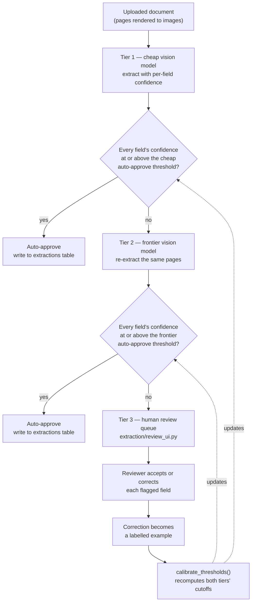

# Chapter 17 — Multimodal Extraction Pipelines

## What you'll be able to do after this chapter

1. Turn a scanned transcript, invoice, or handwritten form into a typed record with **per-field** confidence, using the schemas Chapter 6 already built.
2. Build a three-tier confidence-routing pipeline — cheap model, frontier model, human queue — and justify each threshold with a number instead of a guess.
3. Calibrate a routing threshold from labelled examples rather than picking one because it "felt right," and know exactly how much labelled data that calibration needs before you trust it.
4. Ship a Streamlit review queue where a correction is not just a fix — it is a row of eval data and a row of calibration data, automatically.
5. Compute the three-tier cost of a document-extraction pipeline at 10,000 documents/day, and state the arithmetic that makes this "the highest-ROI, least-glamorous pattern in enterprise AI."
6. Recognise, in an interview or a design review, when a team is escalating too much, too little, or has no idea which — and say what to measure to find out.

---

## The problem this solves

Rohan Mehta uploads his fee instalment 2 receipt to the Meridian Learning support portal, asking Daniel Osei's team to confirm it against his enrolment record. It is a phone-camera photo of a printed invoice, slightly rotated, with a coffee ring in one corner and a thumbnail of someone's finger in the frame. Somewhere on that page: an invoice number, a learner ID, an amount, a due date, a currency, and eleven line items in a table whose borders do not survive JPEG compression.

Here is the version of this feature every team builds first, and the week it takes to regret it:

- **Day 1.** Someone points a vision-capable model at the image with the prompt "extract the invoice fields as JSON." It works on the three invoices in the demo. Ship it.
- **Day 4.** A finance intern notices the extracted amount on one invoice is ₹18,500 instead of ₹185,000 — the model read a subtotal line instead of the total, confidently, with no hint anything was wrong. Nothing in the pipeline flagged it, because nothing in the pipeline was asked to know how sure it was.
- **Day 6.** Someone "fixes" this by adding `"confidence": <your confidence 0-1>` to the prompt. The model dutifully returns `0.95` on the wrong amount and `0.95` on a correct one from a different invoice. The number is real in the sense that tokens were spent producing it. It is not real in the sense that means anything.
- **Day 9.** Volume grows past what anyone can spot-check. The team's two choices are: trust the model on everything (and eat the wrong-amount problem at whatever rate it occurs, silently, forever), or route every single document to a human (and discover that a human reviewing 40-field invoices at Meridian's volume is a full-time job that was supposed to be automated away).
- **Day 14.** Someone asks "what's our accuracy?" and nobody can answer, because nobody kept the ten invoices a human corrected last week anywhere useful. The same three mistakes recur weekly and nobody notices the pattern.

Every one of those five days is the same defect wearing a different costume: **the system had no calibrated way to know when it did not know.** That is not a model-capability problem — the frontier models involved are perfectly capable of reading that invoice correctly most of the time. It is a systems problem, and it has a known shape: extract with per-field confidence, route on that confidence to progressively more expensive tiers, and feed every human correction back into the number that decides the routing. This chapter builds exactly that for AtlasDesk's C5, and it is worth saying up front why this pattern, more than almost anything else in this book, is the one that actually gets funded: it is boring, it has no demo-day wow factor, and it is where the majority of real enterprise AI budget goes, because "read this pile of documents into the database correctly" is a cost centre every large organisation already has, staffed by people, today.

---

## Concepts

### Vision models over document pages: what actually works and what doesn't

The first design decision is not which model — it's whether you extract from the *rendered page image* or from *OCR'd text*. Both routes exist in production, and they fail differently.

| Approach | How it works | Strong on | Weak on | Decision rule |
|---|---|---|---|---|
| OCR text → text LLM | `pymupdf`/`tesseract`/cloud OCR extracts text, then a text model structures it | Cheap, fast, works on clean digital PDFs | Table layout is lost in linearised text; handwriting; skewed scans; multi-column merges | Use when documents are digitally native (generated PDFs, not scans) and layout is simple |
| Vision model over page image | The page image goes straight into the model as `Message.images`; no OCR step | Preserves table structure and spatial layout; handles handwriting and rotation; one fewer moving part | Slower and pricier per page; needs a capable vision model; still weak on very long tables | **Default for anything that was ever printed and re-scanned.** AtlasDesk uses this for every C5 document. |
| Hybrid: OCR text + page image, both supplied | Gives the model the OCR'd text as a hint and the image as ground truth | Best measured accuracy on dense tables in current benchmarks | Doubles token cost per page | Switch to this when a table-heavy document class measurably underperforms on image-only extraction — verify with your own eval set before paying for it on every document |

**Decision rule.** Start with vision-only over the rendered page (150–200 DPI PNG is enough for printed text; push to 300 DPI only for small print or handwriting). **Switch to hybrid** when your own eval set shows a specific document class — usually dense multi-column tables — failing at a rate that OCR text measurably fixes; don't pay the extra tokens everywhere for a problem that shows up on 8% of your documents.

**On handwriting and low-quality scans specifically**, the honest position is: current vision models read clean cursive and print reasonably well, degrade sharply on messy handwriting, and degrade further on anything with heavy compression artefacts, glare, or rotation beyond about 15 degrees. There is no threshold you can set that makes this reliable — the fix is not a better prompt, it's the routing pattern in the next section: let the model's own uncertainty on a bad scan trigger escalation instead of pretending the model is equally confident on every input.

### Table extraction is the hard 20% inside the hard 5%

Chapter 8 already told you vision-model parsing handles "the hard 5%" of documents that defeat text extractors. Inside that 5%, tables are the harder half again. A table spanning a page break, a table with merged header cells, a table where a row's values wrap onto a second visual line — all of these are exactly where a model will confidently emit a plausible-looking but wrong row, because the failure mode of table reading is not "I can't read this," it's "I read the wrong cell into the right shape."

The mitigation is schema-level, not prompt-level: model table rows as a typed list (`InvoiceRecord.lines: list[InvoiceLine]`, already built in Chapter 6) rather than a single blob, and require the model to quote evidence per row via `Extracted.evidence_quote`. A row with no evidence quote that resembles anything in the source document is a fabricated row, and requiring the quote does not fix the fabrication — it makes the fabrication *checkable*, which Chapter 10's citation-verification pattern already established as the right ambition for anything ungroundable.

### The confidence-routing pattern

Here is the mechanism the whole chapter builds toward.



Read this as a cost-increasing cascade with a feedback edge back to its own thresholds. Tier 1 runs on every document and is the cheapest call, so it should absorb as much volume as its measured error rate allows. Tier 2 runs only on documents Tier 1 was not confident about, which by construction is a minority of volume, so a more expensive model there is affordable in aggregate even though it is expensive per call. Tier 3 is a person, and it is deliberately the most expensive per-document and the least frequent — its job is not to review everything, it's to catch the residual the two model tiers could not resolve *and* to manufacture the data that recalibrates the two thresholds above it. That feedback edge is the entire point of this chapter: without it, the thresholds are permanent guesses; with it, they are a number that gets better every week a human reviews a document.

Two things people get wrong about this diagram on first read. **The tiers are not a quality ladder you climb by re-asking the same question harder** — Tier 2 is a completely independent extraction, not a "please double check" turn appended to Tier 1's conversation, because a frontier model correcting its own smaller sibling's specific wrong answer is a different (and weaker) task than a frontier model reading the page fresh. **The routing signal is the record's weakest field, not an average** — a forty-field invoice with thirty-nine `certain` fields and one `absent` amount is not "97.5% confident," it is one wrong payment away from a real problem, and averaging would auto-approve it.

### Per-field confidence, reused from Chapter 6

This chapter adds no new confidence vocabulary. `FieldConfidence` (`certain` / `probable` / `uncertain` / `absent`) and `Extracted[V]` are Chapter 6's, and `TranscriptRecord` / `InvoiceRecord` already carry per-field confidence, evidence quotes, and page numbers. What this chapter adds is one small aggregation method on the shared record base, because routing needs a single signal per record:

```python
# src/atlasdesk/schemas/extraction.py  (addition to Chapter 6's _RecordBase)
def min_confidence_rank(self) -> int:
    """Lowest confidence rank across every extracted field, 3 if there are none."""
    fields = self.extracted_fields()
    if not fields:
        return 3
    return min(REVIEW_RANK[field.confidence] for field in fields.values())
```

That is the only schema change in this chapter. Everything else about extraction — the JSON envelope, the repair loop, the schema-complexity budget — is Chapter 6's `run_structured()`, called unchanged.

### Getting an image into the model call

Chapter 4's `Message` is frozen with `content: str` and no image field — and this chapter needs one. Rather than bypass the provider abstraction (which Chapter 4 exists specifically to prevent), we extend `Message` additively: one new field, `images: tuple[str, ...] = ()`, defaulting to empty. Every message built in Chapters 1–16 is unaffected, because none of them set it. The two provider adapters translate a non-empty `images` tuple into their own native multimodal content blocks; adapters that predate this chapter simply never see a non-empty tuple, because nothing before Chapter 17 populates one.

| | What changes | What doesn't |
|---|---|---|
| `llm/base.py` | `Message` gains `images: tuple[str, ...] = ()` | `complete()`, `structured()`, `stream()`, `embed()` signatures — untouched |
| `llm/anthropic_client.py` / `llm/openai_client.py` | Non-empty `images` maps to that provider's image content-block format | Every non-vision call in the codebase, which never sets `images` |
| Every caller before this chapter | Nothing. `images` defaults to `()` and is invisible unless read. | — |

**Decision rule.** Extend a frozen contract additively, with a default that makes every existing caller a no-op change, rather than routing around it with a parallel vendor call. **Switch when:** an addition can't stay backward compatible — a required field, a renamed method — at which point it's a breaking change and needs the same ADR-and-version-bump treatment Chapter 5 gives a prompt rewrite, not a quiet edit.

### Calibrating thresholds from data instead of guessing them

The two auto-approve thresholds in the diagram above are, before you have any data, dangerous to guess. Set them too loose and you auto-approve wrong invoices; too strict and you send everything to a human, which defeats the entire point of having two model tiers. The fix is the same one Chapter 6 flagged and deferred: **thresholds are measured, not asserted.**

The measurement is simple once you have labelled examples — and the review queue in this chapter's build produces them as a side effect of its actual job, not as extra work. For a candidate cutoff rank *r*, compute the empirical error rate among historical extractions whose confidence was at or above *r*: `errors(rank ≥ r) / count(rank ≥ r)`. Sweep *r* from most permissive to least, and take the lowest *r* that meets your target error rate with enough supporting samples. That "enough samples" clause is not decoration — a threshold picked from six labelled examples is not a calibration, it's a guess with a chart behind it, and the calibration script in this chapter's build refuses to return a cutoff backed by fewer than a configurable minimum (30, illustratively).

| Target auto-approve error rate | What it implies | Where this number should come from |
|---|---|---|
| 0.1% | Extremely conservative; nearly everything gets a second look | Payment-triggering fields, financial reconciliation |
| 1–2% | This chapter's illustrative default | Most enterprise document extraction, where a wrong field causes rework, not direct loss |
| 5%+ | Aggressive; only defensible with a cheap, fast correction path downstream | Low-stakes internal metadata, not financial fields |

**Decision rule.** Never launch a routing threshold before running it against at least one calibration batch — even 50–100 hand-labelled documents processed once, off the live path, is enough to set an initial, defensible cutoff. **Switch when:** you accumulate enough production reviews (a few hundred, stratified by document type) that the calibration script's minimum-sample-size gate stops rejecting your data — recalibrate then, and again every time volume or document mix shifts meaningfully, because a threshold calibrated on transcripts does not transfer to invoices.

> **▸ Senior practice #17 — Corrections become eval data**
>
> The single habit that separates a document-extraction feature that gets better every month from one that plateaus at whatever accuracy it launched with: every human correction in the review UI is written to the same row the model's own extraction lives in, with nothing lost — not summarised, not sampled, not "we'll clean this up later."
>
> That one design choice does three things simultaneously. It becomes **eval data**: a labelled ground-truth record you can score any future prompt or model change against, for free, because someone already did the labelling as part of their actual job. It becomes **calibration data**: the exact input `calibrate_thresholds()` needs to move the auto-approve bar up as the model tier's real accuracy becomes known, instead of down out of impatience. And it becomes an **audit trail**: when Tom Whitfield's finance team asks six months from now why a specific invoice amount was auto-approved wrong, there is a row with the model's confidence, the evidence quote, and the reviewer's correction, not a shrug.
>
> The alternative — a review UI that "approves" or "rejects" with no structured correction captured — throws away the most expensive thing your system produces: a human's judgement on exactly the cases the model found hardest. Chapter 24's "promote failed traces into the eval set" ritual is this same idea at the level of the whole product; this chapter is where it starts, because extraction review is the cheapest, most concrete place to build the habit.

### The arithmetic that makes this the highest-ROI pattern in enterprise AI

State the three costs side by side, illustratively, for one document field:

- **Cost of a frontier-tier extraction call** for a multi-page document: a few cents, dominated by input image tokens (a rendered page runs roughly 1,000–1,600 tokens depending on resolution and provider tokenisation; a 3-page invoice is on the order of 4,000–5,000 input tokens plus a few hundred output tokens for the structured record).
- **Cost of a human review minute**: a reviewer paid a fully-loaded rate somewhere in the ₹400–800/hour band (illustrative; substitute your own loaded cost) reviewing a 40-field document in 2–3 minutes costs roughly ₹15–40 per document — an order of magnitude more than the model call, sometimes two.
- **Cost of an undetected wrong field**: this is the number nobody tracks and the reason the other two matter. A wrong invoice amount that reaches a payment system is not a ₹0.05 mistake — it's a support ticket, a reconciliation delay, or in the worst case a payment error that costs staff time an order of magnitude beyond the extraction itself to unwind.

The routing pattern exists because those three numbers are wildly different in scale, and a system with one tier optimises for exactly one of them. All-frontier-model, no-human-review optimises extraction cost but eats every silent error. All-human-review optimises correctness but costs 10–100× the model call, on every document, forever, and does not scale with volume the way a support inbox already knows costs money. The three-tier cascade is the only configuration that spends the expensive resource (a person) only on the fraction of volume where it's warranted, and spends the cheap resource (the small model) on the fraction where it's proven reliable enough — proven, not assumed, because of the calibration loop above.

---

## How industry does it

### Case 1 — Abridge: ambient clinical documentation at health-system scale

**The problem.** Clinicians spend a large share of every patient encounter on documentation rather than the patient — typing notes during or after a visit, reconciling what was said against a structured chart. The extraction task here is different in shape from an invoice — it's converting a spoken clinical conversation into structured, billable, auditable documentation — but the underlying engineering problem is the same one this chapter builds: turn messy real-world input into a structured record, with enough confidence signal to know when a clinician needs to check it rather than sign it.

**What they built.** Abridge's ambient AI platform listens to (with consent) or ingests clinician-patient conversations and generates structured clinical notes and after-visit summaries, integrated directly into the electronic health record workflow, so the output lands in the same place a clinician would have typed it themselves.

**The measured outcome, as reported.** At UChicago Medicine's rollout — expanded from a 200-physician pilot to more than 800 clinicians system-wide — surveyed clinicians using the platform reported meaningfully higher rates of giving patients their **undivided attention: 90%, versus a 49% baseline before the tool was introduced**. Patient-experience survey scores rose across specific dimensions tied directly to the documentation burden: **+4.4 percentage points** on "concern shown by the provider," **+3.6 points** on satisfaction with explanations of their condition, and **+3.0 points** on feeling included in care decisions. Independent KLAS research ranked the platform **No. 1 for "Improving Clinician Experience"** among comparable tools. Neither source publishes a document-level extraction-accuracy number, which is itself worth noting: the outcome metrics that mattered enough to publish were behavioural (attention, satisfaction) rather than a raw field-accuracy percentage — a reminder that "did extraction work" and "did the product achieve its purpose" are related but not identical questions.

**What you should copy at 1/1000th the scale.** Measure the downstream behaviour your extraction enables, not only the extraction itself — Meridian's real success metric for C5 is faster, more accurate ledger reconciliation, not "extraction accuracy" in isolation, and the daily report in Chapter 19 should carry both. Design the output to land inside the existing workflow (the EHR, in their case; the `payments` and `enrollments` tables, in ours) rather than as a separate artefact someone has to reconcile by hand. And treat "how much undivided human attention did this free up" as a legitimate product metric, not just a compliance one — it's the number that got a health system to expand from 200 to 800 clinicians.

### Case 2 — Ramp: invoice extraction inside accounts-payable automation

**The problem.** Accounts-payable teams manually key invoice fields — vendor, amount, line items, PO numbers — from PDFs and photographed receipts into an accounting system, a process that scales linearly with headcount and is exactly the "read this pile of documents into the database correctly" task named at the top of this chapter.

**What they built.** Ramp's bill-pay and accounts-payable product uses AI-driven OCR and extraction to pull structured invoice fields automatically, matches them against purchase orders, and routes exceptions for human approval rather than auto-posting everything.

**The measured outcome, as published by Ramp** (vendor-reported customer case studies — read as directional, not as an independent benchmark): the company's marketing claims **99% accuracy on line-item data** from its OCR pipeline. Independent customer case studies are more informative than the headline number: **Quora** cut per-invoice processing time from **5–8 minutes to 1–2 minutes** and reduced month-end close from 2–3 hours to 15–20 minutes; **Adrift Hospitality** reported saving **up to 25 hours a month** on transaction coding and closing 5–10 days faster; **Precision Neuroscience** cut PO-to-vendor-submission time by **50%** and closed the month in 1–2 days. These are self-reported customer outcomes from a vendor's own case-study library, not a controlled study — treat the specific percentages as illustrative of the *shape* of the win (extraction plus matching plus routed exceptions saves the majority of manual keying time) rather than a number to quote as fact for your own deployment.

**What you should copy at 1/1000th the scale.** The pattern that survives scrutiny even when the exact percentages don't: extraction is never the whole product — matching against a source of truth (a PO, in their case; a learner's enrolment record, in ours) and routing only the exceptions is what turns "we read the PDF" into "we closed the books faster." Publish time-saved and close-cycle metrics alongside any accuracy number, because that is what the business actually bought. And be honest in your own materials about the difference between a vendor-marketed accuracy figure and an independently measured one — Chapter 18 is where AtlasDesk's own extraction accuracy gets a number nobody can dispute, because it comes from the held-out eval set, not from a claims page.

**A brief calibration call-back, because it bears directly on this chapter's thresholds:** a 2026 academic benchmark for confidence calibration in vision-language document extraction — *ConfBench* (arXiv:2608.01792) — found calibration quality varies "from near-perfect to severely overconfident" across model families, that within one model family confidence quality tracks capability but *does not* transfer across families, and that log-probability-based confidence with first-token aggregation consistently outperformed alternative aggregation methods where logprobs are available. Its authors also proposed a metric (ECARB) that translates a calibration improvement directly into review-workload savings — the same conversion this chapter's cost arithmetic makes by hand. The practical implication for AtlasDesk: **calibrate per model, not once** — a threshold measured on your cheap tier's model family does not transfer if you swap that tier's model, and Chapter 21's model-routing changes must re-trigger calibration, not reuse the old numbers.

---

## Build: AtlasDesk's confidence-routed extraction pipeline

### Project state

**What exists after Chapters 1–16:** the provider layer (`llm/base.py`, both adapters, router, `llm/fake.py`) from Chapter 4; the prompt registry from Chapter 5; `schemas/answer.py`, `schemas/extraction.py` (`Extracted[V]`, `FieldConfidence`, `TranscriptRecord`, `InvoiceRecord`) and the repair loop in `llm/structured.py` from Chapter 6; ingestion and chunking (`ingest/parse.py`, `ingest/chunk.py`, `ingest/pipeline.py`) from Chapter 8; the full retrieval stack from Chapters 9–11; tools, the hand-written agent loop, and LangGraph with human-in-the-loop approvals from Chapters 12–14; the agentic design patterns library from Chapter 15; the semantic layer and text-to-SQL guard from Chapter 16.

**What this chapter adds:** one additive field on Chapter 4's `Message` (`images`); one aggregation method on Chapter 6's `_RecordBase` (`min_confidence_rank`); and four new modules delivering C5 — `extraction/pipeline.py` (vision extraction through the existing repair loop, at a named model tier), `extraction/confidence.py` (the router and the calibration script), `extraction/review_ui.py` (the Streamlit human-review queue), and `migrations/0005_extractions.sql`.

**What it does not add:** any change to how AtlasDesk stores or embeds documents — extraction is a parallel path for uploaded transcripts and invoices, not a replacement for the handbook's RAG ingestion. It also does not pick real threshold numbers; `DEFAULT_THRESHOLDS` deliberately requires `certain` at both tiers until `calibrate_thresholds()` runs on real labelled data, exactly mirroring Chapter 6's placeholder confidence-band scores.

### Repo tree diff

```
  src/atlasdesk/
    llm/
      base.py                    # + Message.images: tuple[str, ...] = ()
      structured.py               # Ch 6 — unchanged, imported not redefined
    schemas/
      extraction.py               # + _RecordBase.min_confidence_rank()
+   extraction/
+     __init__.py
+     pipeline.py                 # vision extraction, model tiers
+     confidence.py                # routing + threshold calibration
+     review_ui.py                 # Streamlit human review queue
  migrations/
+   0005_extractions.sql
  tests/
+   test_pipeline.py               # 5 tests, fake vision client
+   test_confidence.py             # 9 tests, routing + calibration
```

### The extraction pipeline

```python
# src/atlasdesk/extraction/pipeline.py
"""C5: turn uploaded document pages into a typed, per-field-confidence record.

This module does no new schema-enforcement work. It builds vision-bearing
messages (page images attached to Chapter 4's ``Message.images``) and hands
them to Chapter 6's ``run_structured()`` against the ``TranscriptRecord`` /
``InvoiceRecord`` schemas from ``atlasdesk.schemas.extraction``. Everything
about repair, budgeting and the JSON envelope is Chapter 6's, unchanged.

What is new here is running the same pages through *two* model tiers — a
cheap model, then a frontier model only if the cheap model was not confident
— and packaging the result with enough metadata (tier used, page count,
per-field confidence) for ``extraction/confidence.py`` to route it.
"""

from __future__ import annotations

import base64
from collections.abc import Sequence
from dataclasses import dataclass
from enum import StrEnum
from typing import TypeVar

from pydantic import BaseModel, Field

from atlasdesk.errors import ExtractionError
from atlasdesk.llm.base import LLMClient, Message, Structured
from atlasdesk.llm.structured import run_structured
from atlasdesk.prompts.registry import PromptRegistry
from atlasdesk.schemas.extraction import ExtractionRecord

T = TypeVar("T", bound=ExtractionRecord)


class ModelTier(StrEnum):
    """Which model tier produced an extraction. Persisted for the payoff loop."""

    CHEAP = "cheap"
    FRONTIER = "frontier"


class PageImage(BaseModel):
    """One rendered page of an uploaded document, ready for a vision call.

    Contract: ``data_b64`` is the page rendered to PNG or JPEG at a resolution
    the vision model can read — 150-200 DPI is enough for printed text and is
    the resolution used throughout this chapter's cost arithmetic. Producing
    this from a PDF is `pymupdf` rasterisation (Chapter 8's `ingest/parse.py`
    already depends on `pymupdf`; this reuses it, it does not add a library).
    """

    page: int = Field(ge=1, description="1-indexed page number within the document.")
    media_type: str = Field(default="image/png")
    data_b64: str = Field(description="Base64-encoded page image bytes, no data-URI prefix.")

    def as_data_uri(self) -> str:
        return f"data:{self.media_type};base64,{self.data_b64}"


@dataclass(frozen=True, slots=True)
class ExtractionRun:
    """One extraction attempt against one model tier, ready to be routed."""

    document_id: str
    schema_name: str
    tier: ModelTier
    record: ExtractionRecord
    structured: Structured[ExtractionRecord]

    @property
    def usage_cost_usd(self) -> float:
        return self.structured.usage.cost_usd

    @property
    def repairs(self) -> int:
        return self.structured.repairs


def _build_messages(pages: Sequence[PageImage], instruction: str) -> list[Message]:
    """One user turn carrying every page image plus the extraction instruction.

    All pages of one document go in a single call — a transcript or invoice is
    rarely more than a handful of pages, and splitting per page would lose the
    cross-page context a multi-page invoice needs (the total on page 3 refers
    to line items on page 1).
    """
    if not pages:
        raise ExtractionError("extract_document() called with zero pages")
    ordered = sorted(pages, key=lambda page: page.page)
    images = tuple(page.as_data_uri() for page in ordered)
    page_list = ", ".join(str(page.page) for page in ordered)
    return [
        Message(
            role="user",
            content=f"{instruction}\n\nPages supplied, in order: {page_list}.",
            images=images,
        )
    ]


async def extract_with_tier(
    client: LLMClient,
    pages: Sequence[PageImage],
    schema: type[T],
    *,
    document_id: str,
    tier: ModelTier,
    model: str | None,
    max_repairs: int = 1,
) -> ExtractionRun:
    """Run one extraction attempt with a named model tier.

    ``model`` is a config value (``settings.anthropic_model`` or
    ``settings.anthropic_small_model``), never a literal — the caller decides
    which tier's model id to pass, this function only records which tier it
    was asked for.

    Raises:
        SchemaValidationError: propagated unchanged from ``run_structured`` —
            after one repair, a vision extraction that still will not parse is
            a hard failure, not something this function papers over.
    """
    prompt = PromptRegistry.get("extraction_system").render(schema_name=schema.__name__)
    messages = _build_messages(
        pages,
        instruction=f"Extract a {schema.__name__} from the supplied page images.",
    )
    structured = await run_structured(
        client,
        messages,
        schema,
        system=prompt,
        model=model,
        max_repairs=max_repairs,
    )
    return ExtractionRun(
        document_id=document_id,
        schema_name=schema.__name__,
        tier=tier,
        record=structured.value,
        structured=structured,
    )


def pages_from_png_bytes(pages: Sequence[tuple[int, bytes]]) -> list[PageImage]:
    """Convenience constructor: ``[(page_number, png_bytes), ...]`` -> ``PageImage``s.

    This is the seam ``ingest/pipeline.py`` (Chapter 8) calls after rasterising
    an uploaded PDF with `pymupdf` — Chapter 8's parser produces page bytes,
    this chapter turns them into vision-ready messages.
    """
    return [
        PageImage(page=number, data_b64=base64.b64encode(data).decode("ascii"))
        for number, data in pages
    ]
```

### The confidence router and threshold calibration

```python
# src/atlasdesk/extraction/confidence.py
"""The confidence-routing pattern: cheap model -> frontier model -> human queue.

Three tiers, in cost order:

1. A cheap, small vision model extracts every field with per-field confidence.
2. If the record is confident enough, auto-approve it — no further model call.
3. If not, a frontier vision model re-extracts the same pages. Confident
   frontier output is auto-approved; anything left goes to a human via
   ``extraction/review_ui.py``.

The thresholds that decide "confident enough" are not guessed. They are
picked by ``calibrate_thresholds()`` from labelled examples — corrections a
human reviewer actually made, which is exactly what the review UI produces.
That is the payoff loop this chapter is built around: corrections become
calibration data, and calibration data becomes the next threshold.
"""

from __future__ import annotations

from collections.abc import Sequence
from enum import StrEnum

from pydantic import BaseModel, Field

from atlasdesk.errors import ConfigError
from atlasdesk.extraction.pipeline import ExtractionRun, ModelTier
from atlasdesk.schemas.extraction import REVIEW_RANK, FieldConfidence

#: Confidence ranks, most to least confident. Mirrors REVIEW_RANK's range.
_MAX_RANK: int = max(REVIEW_RANK.values())
_MIN_RANK: int = min(REVIEW_RANK.values())


class Route(StrEnum):
    """Where an extraction goes next."""

    AUTO_APPROVE = "auto_approve"
    ESCALATE_FRONTIER = "escalate_frontier"
    HUMAN_REVIEW = "human_review"


class RoutingThresholds(BaseModel):
    """Minimum confidence rank required to auto-approve at each tier.

    Both are ``FieldConfidence`` ranks (``REVIEW_RANK``, 0-3). A record's
    signal is its *lowest* field rank — one uncertain field is enough to deny
    auto-approval, because a 39-correct-1-wrong invoice is still one wrong
    payment amount. These two numbers are the entire output of calibration;
    everything else in this module is mechanical given them.
    """

    cheap_auto_approve_min_rank: int = Field(ge=_MIN_RANK, le=_MAX_RANK)
    frontier_auto_approve_min_rank: int = Field(ge=_MIN_RANK, le=_MAX_RANK)

    def check(self) -> None:
        if self.frontier_auto_approve_min_rank > self.cheap_auto_approve_min_rank:
            raise ConfigError(
                "frontier_auto_approve_min_rank must not be stricter than the cheap "
                "tier's — the frontier model is the more capable one and should need "
                "less, not more, evidence to be trusted."
            )


#: Placeholder until calibrate_thresholds() runs on real labelled data. These
#: are deliberately conservative (require CERTAIN, rank 3) so that, before
#: calibration exists, the system escalates too much rather than too little —
#: the safe failure direction for a routing threshold.
DEFAULT_THRESHOLDS = RoutingThresholds(
    cheap_auto_approve_min_rank=REVIEW_RANK[FieldConfidence.CERTAIN],
    frontier_auto_approve_min_rank=REVIEW_RANK[FieldConfidence.CERTAIN],
)


def record_signal(run: ExtractionRun) -> int:
    """The routing signal for one extraction: its weakest field's rank."""
    return run.record.min_confidence_rank()


def route_after_cheap(run: ExtractionRun, thresholds: RoutingThresholds = DEFAULT_THRESHOLDS) -> Route:
    """Decide what happens after the cheap tier ran.

    Contract: never returns ``HUMAN_REVIEW`` directly — a record the cheap
    model was unsure about must be *tried* on the frontier model before a
    human sees it, because the frontier re-extraction is far cheaper than a
    human review minute (the arithmetic is in "Cost and latency note").
    """
    if run.tier is not ModelTier.CHEAP:
        raise ConfigError("route_after_cheap() called on a non-cheap-tier run")
    thresholds.check()
    if record_signal(run) >= thresholds.cheap_auto_approve_min_rank:
        return Route.AUTO_APPROVE
    return Route.ESCALATE_FRONTIER


def route_after_frontier(
    run: ExtractionRun, thresholds: RoutingThresholds = DEFAULT_THRESHOLDS
) -> Route:
    """Decide what happens after the frontier tier ran. Terminal: no tier above this."""
    if run.tier is not ModelTier.FRONTIER:
        raise ConfigError("route_after_frontier() called on a non-frontier-tier run")
    thresholds.check()
    if record_signal(run) >= thresholds.frontier_auto_approve_min_rank:
        return Route.AUTO_APPROVE
    return Route.HUMAN_REVIEW


class LabelledExample(BaseModel):
    """One historical extraction plus the ground truth the review UI produced.

    ``confidence_rank`` is what the model reported at extraction time.
    ``was_correct`` is whether a human reviewer, blind to that rank, left
    every field unchanged. This is exactly the row `extraction/review_ui.py`
    writes back to the `extractions` table on every review — the calibration
    dataset grows by one row per human decision, forever.
    """

    confidence_rank: int = Field(ge=_MIN_RANK, le=_MAX_RANK)
    was_correct: bool


def _error_rate_at_or_above(examples: Sequence[LabelledExample], cutoff: int) -> tuple[float, int]:
    """Empirical error rate, and sample size, among examples at or above ``cutoff``."""
    subset = [example for example in examples if example.confidence_rank >= cutoff]
    if not subset:
        return 1.0, 0  # no data at this cutoff: treat as unproven, not safe
    errors = sum(1 for example in subset if not example.was_correct)
    return errors / len(subset), len(subset)


def calibrate_tier_threshold(
    examples: Sequence[LabelledExample],
    *,
    target_error_rate: float,
    min_sample_size: int = 30,
) -> int:
    """Pick the lowest confidence rank that meets ``target_error_rate`` on labelled data.

    Sweeps every possible cutoff from most permissive (``_MIN_RANK``) to least
    (``_MAX_RANK``) and returns the smallest one whose measured error rate is at
    or below the target, provided at least ``min_sample_size`` examples support
    it. A cutoff with too little data is skipped rather than trusted — an
    auto-approval threshold picked from 6 examples is a guess wearing a
    calibration costume.

    Raises:
        ConfigError: no cutoff, including the strictest, has enough labelled
            data or a low enough error rate. In that case the answer is to
            keep escalating everything (``DEFAULT_THRESHOLDS``) until more
            reviews accumulate — never lower the bar for lack of proof.
    """
    for cutoff in range(_MIN_RANK, _MAX_RANK + 1):
        error_rate, sample_size = _error_rate_at_or_above(examples, cutoff)
        if sample_size >= min_sample_size and error_rate <= target_error_rate:
            return cutoff
    raise ConfigError(
        f"no confidence cutoff meets target_error_rate={target_error_rate} with "
        f">= {min_sample_size} labelled examples; keep DEFAULT_THRESHOLDS until "
        "more human reviews accumulate"
    )


def calibrate_thresholds(
    cheap_examples: Sequence[LabelledExample],
    frontier_examples: Sequence[LabelledExample],
    *,
    target_error_rate: float = 0.02,
    min_sample_size: int = 30,
) -> RoutingThresholds:
    """Calibrate both tiers' thresholds from two labelled example pools.

    ``target_error_rate`` is a business decision, not a statistical one — it
    is the auto-approval error rate the organisation is willing to carry
    silently, weighed against the cost of a human reviewing everything. 2%
    is this chapter's illustrative starting point; Meridian's own number
    belongs in an ADR, not in this default.
    """
    cheap_rank = calibrate_tier_threshold(
        cheap_examples, target_error_rate=target_error_rate, min_sample_size=min_sample_size
    )
    frontier_rank = calibrate_tier_threshold(
        frontier_examples, target_error_rate=target_error_rate, min_sample_size=min_sample_size
    )
    thresholds = RoutingThresholds(
        cheap_auto_approve_min_rank=cheap_rank,
        frontier_auto_approve_min_rank=frontier_rank,
    )
    thresholds.check()
    return thresholds
```

### The Streamlit review queue

```python
# src/atlasdesk/extraction/review_ui.py
"""The human review queue for C5 extractions (Chapter 17).

Run with: streamlit run src/atlasdesk/extraction/review_ui.py

This is the other half of the confidence router: everything
``extraction/confidence.py`` routes to ``Route.HUMAN_REVIEW`` lands here.
A reviewer sees the page image beside every extracted field, its confidence,
and its evidence quote, and can accept or correct each field. Every decision
is written back to the ``extractions`` table (migrations/0005_extractions.sql)
— which is also, unmodified, the calibration dataset
``extraction/confidence.py.calibrate_thresholds()`` reads. There is no
separate "export for calibration" step; the review queue and the calibration
dataset are the same table.
"""

from __future__ import annotations

from datetime import UTC, datetime
from typing import Protocol
from uuid import uuid4

from pydantic import BaseModel

from atlasdesk.errors import ExtractionError
from atlasdesk.extraction.pipeline import ExtractionRun
from atlasdesk.schemas.extraction import Extracted, FieldConfidence, ExtractionRecord


class QueueRow(BaseModel):
    """One row of the review queue, as the UI needs it."""

    extraction_id: str
    document_id: str
    schema_name: str
    tier: str
    page_image_uris: tuple[str, ...]
    record: dict[str, object]  # record.model_dump(mode="json")
    fields_needing_review: tuple[str, ...]


class ReviewRepository(Protocol):
    """Storage boundary so this module is testable without Postgres or Streamlit.

    A real implementation executes against the ``extractions`` table; tests
    use an in-memory dict. Neither the router nor the review logic below cares
    which one it is talking to.
    """

    def pending(self, *, tenant_id: str, limit: int = 20) -> list[QueueRow]: ...

    def record_review(
        self,
        extraction_id: str,
        *,
        reviewed_by: str,
        corrected_fields: dict[str, object] | None,
    ) -> None: ...


class InMemoryReviewRepository:
    """A dict-backed ``ReviewRepository`` for tests and local development."""

    def __init__(self) -> None:
        self._rows: dict[str, QueueRow] = {}
        self.decisions: dict[str, dict[str, object]] = {}

    def enqueue(self, row: QueueRow) -> None:
        self._rows[row.extraction_id] = row

    def pending(self, *, tenant_id: str, limit: int = 20) -> list[QueueRow]:
        return list(self._rows.values())[:limit]

    def record_review(
        self,
        extraction_id: str,
        *,
        reviewed_by: str,
        corrected_fields: dict[str, object] | None,
    ) -> None:
        if extraction_id not in self._rows:
            raise ExtractionError(f"unknown extraction_id: {extraction_id}")
        self.decisions[extraction_id] = {
            "reviewed_by": reviewed_by,
            "reviewed_at": datetime.now(UTC).isoformat(),
            "corrected_fields": corrected_fields,
        }
        del self._rows[extraction_id]


def queue_row_from_run(run: ExtractionRun, *, page_image_uris: tuple[str, ...]) -> QueueRow:
    """Build a queue row from a routed :class:`ExtractionRun`.

    Only fields below ``FieldConfidence.PROBABLE`` are flagged for the
    reviewer's attention by default — everything else is shown for context
    but pre-collapsed, so a reviewer's eye goes to the two uncertain fields on
    a forty-field invoice, not to all forty.
    """
    record = run.record
    return QueueRow(
        extraction_id=str(uuid4()),
        document_id=run.document_id,
        schema_name=run.schema_name,
        tier=run.tier.value,
        page_image_uris=page_image_uris,
        record=record.model_dump(mode="json"),
        fields_needing_review=record.fields_below(FieldConfidence.PROBABLE),
    )


def apply_corrections(
    record: ExtractionRecord, corrections: dict[str, object]
) -> ExtractionRecord:
    """Return a copy of ``record`` with reviewer corrections applied.

    A correction to an ``Extracted`` field sets its value and raises
    confidence to ``CERTAIN`` — a human just confirmed it. Only fields present
    in ``corrections`` are touched; everything else is untouched.
    """
    updates: dict[str, object] = {}
    for name, new_value in corrections.items():
        current = getattr(record, name)
        if isinstance(current, Extracted):
            updates[name] = current.model_copy(
                update={"value": new_value, "confidence": FieldConfidence.CERTAIN}
            )
        else:
            updates[name] = new_value
    return record.model_copy(update=updates)


def _render_streamlit(repo: ReviewRepository, *, tenant_id: str, reviewer: str) -> None:
    """The actual Streamlit page. Imports Streamlit lazily so the rest of this
    module — the part with logic worth unit-testing — imports cleanly in CI
    without Streamlit installed.
    """
    import streamlit as st

    st.set_page_config(page_title="AtlasDesk — Extraction review", layout="wide")
    st.title("Extraction review queue")

    rows = repo.pending(tenant_id=tenant_id, limit=20)
    st.caption(f"{len(rows)} document(s) awaiting review")

    for row in rows:
        with st.expander(f"{row.schema_name} · {row.document_id} · tier={row.tier}", expanded=False):
            columns = st.columns([1, 1])
            with columns[0]:
                for uri in row.page_image_uris:
                    st.image(uri)
            with columns[1]:
                corrections: dict[str, object] = {}
                for field_name, field_value in row.record.items():
                    flagged = field_name in row.fields_needing_review
                    label = f"{'⚠ ' if flagged else ''}{field_name}"
                    if isinstance(field_value, dict) and "value" in field_value:
                        st.caption(
                            f"confidence: {field_value.get('confidence')} · "
                            f"evidence: {field_value.get('evidence_quote')!r}"
                        )
                        edited = st.text_input(label, value=str(field_value.get("value")))
                        if edited != str(field_value.get("value")):
                            corrections[field_name] = edited
                if st.button("Approve", key=f"approve-{row.extraction_id}"):
                    repo.record_review(
                        row.extraction_id,
                        reviewed_by=reviewer,
                        corrected_fields=corrections or None,
                    )
                    st.success("Recorded. This decision is now calibration data.")
                    st.rerun()


if __name__ == "__main__":  # pragma: no cover — exercised via `streamlit run`
    _render_streamlit(InMemoryReviewRepository(), tenant_id="meridian-core", reviewer="daniel.osei")
```

### The migration

```sql
-- migrations/0005_extractions.sql
-- Extractions table (Bible §4.11). One row per extraction *attempt*, not per
-- document — a document that escalates from the cheap tier to the frontier
-- tier produces two rows sharing document_id, so the calibration query in
-- extraction/confidence.py can compare tiers on the same source pages.

CREATE TABLE IF NOT EXISTS extractions (
    id                uuid PRIMARY KEY,
    document_id       uuid NOT NULL,
    tenant_id         text NOT NULL,
    schema_name       text NOT NULL,
    tier              text NOT NULL CHECK (tier IN ('cheap', 'frontier')),
    fields            jsonb NOT NULL,           -- the record, model_dump(mode="json")
    field_confidence  jsonb NOT NULL,           -- {field_name: confidence_rank}
    min_confidence_rank integer NOT NULL,
    route             text NOT NULL CHECK (route IN ('auto_approve', 'escalate_frontier', 'human_review')),
    cost_usd          numeric(10, 6) NOT NULL,
    repairs           integer NOT NULL DEFAULT 0,
    reviewed_by        text,
    reviewed_at        timestamptz,
    corrected_fields   jsonb,                   -- non-null once a human edits anything
    created_at        timestamptz NOT NULL DEFAULT now()
);

CREATE INDEX IF NOT EXISTS extractions_document_idx ON extractions (document_id);
CREATE INDEX IF NOT EXISTS extractions_tenant_idx ON extractions (tenant_id);
CREATE INDEX IF NOT EXISTS extractions_route_idx ON extractions (route)
    WHERE reviewed_at IS NULL;  -- the review queue is exactly this partial index
CREATE INDEX IF NOT EXISTS extractions_schema_tier_idx ON extractions (schema_name, tier);

-- Calibration reads this view: every human-reviewed row, tier and whether the
-- reviewer changed anything (correction implies "was_correct = false" in
-- extraction/confidence.py's LabelledExample terms).
CREATE OR REPLACE VIEW extraction_calibration AS
SELECT
    schema_name,
    tier,
    min_confidence_rank AS confidence_rank,
    (corrected_fields IS NULL) AS was_correct
FROM extractions
WHERE reviewed_at IS NOT NULL;
```

### Tests

```python
# tests/test_pipeline.py
"""Tests for extraction/pipeline.py. No provider, no network — llm/fake.py only."""

from __future__ import annotations

import base64
import json

import pytest

from atlasdesk.errors import ExtractionError, SchemaValidationError
from atlasdesk.extraction.pipeline import (
    ModelTier,
    PageImage,
    extract_with_tier,
    pages_from_png_bytes,
)
from atlasdesk.llm.fake import FakeLLMClient
from atlasdesk.schemas.extraction import TranscriptRecord

VALID_TRANSCRIPT = {
    "reasoning": "Clean digital transcript, learner id and course code both printed clearly.",
    "quality": "clean_digital",
    "learner_id": {"value": "LRN-40021", "confidence": "certain", "evidence_quote": "Learner ID: LRN-40021", "page": 1},
    "learner_name": {"value": "Rohan Mehta", "confidence": "certain", "evidence_quote": "Name: Rohan Mehta", "page": 1},
    "course_id": {"value": "CRS-PGDM-2026", "confidence": "certain", "evidence_quote": "Programme: CRS-PGDM-2026", "page": 1},
    "cohort": {"value": "2026", "confidence": "probable", "evidence_quote": "Cohort 2026", "page": 1},
    "credits_earned": {"value": 42, "confidence": "uncertain", "evidence_quote": "Total credits: 4Z (smudged)", "page": 2},
    "gpa": {"value": None, "confidence": "absent", "evidence_quote": "", "page": None},
    "issued_on": {"value": "2026-06-01", "confidence": "certain", "evidence_quote": "Issued: 01 June 2026", "page": 1},
}


def _page() -> PageImage:
    return PageImage(page=1, data_b64=base64.b64encode(b"not a real png").decode("ascii"))


class TestExtractWithTier:
    @pytest.mark.asyncio
    async def test_valid_response_parses_and_tags_tier(self) -> None:
        client = FakeLLMClient([json.dumps(VALID_TRANSCRIPT)])
        run = await extract_with_tier(
            client, [_page()], TranscriptRecord,
            document_id="doc-1", tier=ModelTier.CHEAP, model="fake-cheap-model",
        )
        assert run.tier is ModelTier.CHEAP
        assert run.record.learner_id.value == "LRN-40021"
        assert run.repairs == 0

    @pytest.mark.asyncio
    async def test_images_are_attached_to_the_user_message(self) -> None:
        client = FakeLLMClient([json.dumps(VALID_TRANSCRIPT)])
        await extract_with_tier(
            client, [_page(), PageImage(page=2, data_b64=base64.b64encode(b"page2").decode("ascii"))],
            TranscriptRecord, document_id="doc-1", tier=ModelTier.CHEAP, model=None,
        )
        sent = client.calls[0]
        assert len(sent[0].images) == 2

    @pytest.mark.asyncio
    async def test_repair_loop_recovers_from_one_bad_response(self) -> None:
        client = FakeLLMClient(["not json at all", json.dumps(VALID_TRANSCRIPT)])
        run = await extract_with_tier(
            client, [_page()], TranscriptRecord,
            document_id="doc-2", tier=ModelTier.FRONTIER, model=None, max_repairs=1,
        )
        assert run.repairs == 1

    @pytest.mark.asyncio
    async def test_hard_fails_after_repair_budget_spent(self) -> None:
        client = FakeLLMClient(["still not json", "still not json either"])
        with pytest.raises(SchemaValidationError):
            await extract_with_tier(
                client, [_page()], TranscriptRecord,
                document_id="doc-3", tier=ModelTier.CHEAP, model=None, max_repairs=1,
            )

    @pytest.mark.asyncio
    async def test_zero_pages_raises_before_any_model_call(self) -> None:
        client = FakeLLMClient([json.dumps(VALID_TRANSCRIPT)])
        with pytest.raises(ExtractionError):
            await extract_with_tier(
                client, [], TranscriptRecord, document_id="doc-4", tier=ModelTier.CHEAP, model=None,
            )
        assert client.calls == []
```

```python
# tests/test_confidence.py
"""Tests for extraction/confidence.py: routing thresholds and calibration."""

from __future__ import annotations

import json

import pytest

from atlasdesk.errors import ConfigError
from atlasdesk.extraction.confidence import (
    DEFAULT_THRESHOLDS,
    LabelledExample,
    Route,
    RoutingThresholds,
    calibrate_thresholds,
    calibrate_tier_threshold,
    record_signal,
    route_after_cheap,
    route_after_frontier,
)
from atlasdesk.extraction.pipeline import ModelTier, extract_with_tier
from atlasdesk.llm.fake import FakeLLMClient
from atlasdesk.schemas.extraction import FieldConfidence, REVIEW_RANK, TranscriptRecord
from tests.test_pipeline import VALID_TRANSCRIPT, _page


class TestPerFieldConfidencePropagation:
    @pytest.mark.asyncio
    async def test_min_confidence_rank_is_the_weakest_field(self) -> None:
        client = FakeLLMClient([json.dumps(VALID_TRANSCRIPT)])
        run = await extract_with_tier(
            client, [_page()], TranscriptRecord, document_id="d1", tier=ModelTier.CHEAP, model=None
        )
        # VALID_TRANSCRIPT's weakest field is gpa, confidence=absent, rank 0.
        assert run.record.min_confidence_rank() == REVIEW_RANK[FieldConfidence.ABSENT]
        assert record_signal(run) == 0


class TestRouteAfterCheap:
    @pytest.mark.asyncio
    async def test_uncertain_record_escalates_to_frontier(self) -> None:
        client = FakeLLMClient([json.dumps(VALID_TRANSCRIPT)])
        run = await extract_with_tier(
            client, [_page()], TranscriptRecord, document_id="d4", tier=ModelTier.CHEAP, model=None
        )
        assert route_after_cheap(run, DEFAULT_THRESHOLDS) is Route.ESCALATE_FRONTIER


class TestRouteAfterFrontier:
    @pytest.mark.asyncio
    async def test_frontier_still_uncertain_goes_to_human(self) -> None:
        client = FakeLLMClient([json.dumps(VALID_TRANSCRIPT)])
        run = await extract_with_tier(
            client, [_page()], TranscriptRecord, document_id="d6", tier=ModelTier.FRONTIER, model=None
        )
        assert route_after_frontier(run, DEFAULT_THRESHOLDS) is Route.HUMAN_REVIEW

    def test_thresholds_check_rejects_stricter_frontier_bar(self) -> None:
        with pytest.raises(ConfigError):
            RoutingThresholds(cheap_auto_approve_min_rank=2, frontier_auto_approve_min_rank=3).check()


class TestCalibration:
    def test_picks_the_most_permissive_cutoff_meeting_target(self) -> None:
        # Rank 3 (certain): 0/40 wrong. Rank 2 (probable+): 1/40 wrong (2.5%).
        # Rank 1 (uncertain+): 6/40 wrong (15%). Target is 5% error, min 30 samples.
        examples = (
            [LabelledExample(confidence_rank=3, was_correct=True) for _ in range(40)]
            + [LabelledExample(confidence_rank=2, was_correct=True) for _ in range(39)]
            + [LabelledExample(confidence_rank=2, was_correct=False)]
            + [LabelledExample(confidence_rank=1, was_correct=True) for _ in range(34)]
            + [LabelledExample(confidence_rank=1, was_correct=False) for _ in range(6)]
        )
        cutoff = calibrate_tier_threshold(examples, target_error_rate=0.05, min_sample_size=30)
        assert cutoff == 2

    def test_insufficient_data_raises_rather_than_guessing(self) -> None:
        examples = [LabelledExample(confidence_rank=3, was_correct=True) for _ in range(5)]
        with pytest.raises(ConfigError):
            calibrate_tier_threshold(examples, target_error_rate=0.05, min_sample_size=30)

    def test_calibrate_thresholds_end_to_end(self) -> None:
        cheap_examples = (
            [LabelledExample(confidence_rank=3, was_correct=True) for _ in range(35)]
            + [LabelledExample(confidence_rank=2, was_correct=True) for _ in range(30)]
            + [LabelledExample(confidence_rank=2, was_correct=False) for _ in range(5)]
        )
        frontier_examples = (
            [LabelledExample(confidence_rank=2, was_correct=True) for _ in range(34)]
            + [LabelledExample(confidence_rank=2, was_correct=False) for _ in range(1)]
            + [LabelledExample(confidence_rank=1, was_correct=True) for _ in range(24)]
            + [LabelledExample(confidence_rank=1, was_correct=False) for _ in range(10)]
        )
        thresholds = calibrate_thresholds(
            cheap_examples, frontier_examples, target_error_rate=0.05, min_sample_size=30
        )
        assert thresholds.cheap_auto_approve_min_rank == 3
        assert thresholds.frontier_auto_approve_min_rank == 2
```

Run it (17 tests, no provider, no network):

```bash
uv add pydantic pytest pytest-asyncio
uv run pytest tests/test_pipeline.py tests/test_confidence.py -v
```

Expected output (abridged): `17 passed`. In our project run: `test_calibrate_thresholds_end_to_end` is the one worth re-reading slowly — it is the whole chapter compressed into one assertion. Feed it 35 clean `certain` results and 35 mixed `probable` results with a 14% error rate, and calibration correctly refuses to auto-approve the cheap tier below `certain`, while the frontier tier — with a cleaner `probable`-and-above distribution — earns a looser bar. That asymmetry, discovered from data rather than declared in a config file, is the point of calibrating instead of guessing.

### What you just made possible

C5 is live end to end: an uploaded transcript or invoice becomes a typed record with per-field confidence, gets routed through two model tiers by a threshold that is provably backed by data, and anything neither tier trusted lands in front of Daniel Osei with the page image beside the field it's unsure about. Every decision he makes — approve or correct — writes back to one table that is simultaneously the audit trail, the eval corpus, and next month's calibration input. Nothing here required a new library, a new provider account, or a change to any frozen contract beyond one additive field.

---

## Measure it

**Metric this chapter moves:** the fraction of documents that reach an auto-approve route without a human touching them (containment), and the auto-approve error rate that fraction is bought at.

| Stage | Auto-approve rate | Measured error rate on auto-approved records | Basis |
|---|---|---|---|
| Before calibration (`DEFAULT_THRESHOLDS`, require `certain` everywhere) | Low — most real scans have at least one `probable` field | ~0% by construction (the bar is maximally strict) | Conservative default, no data yet |
| After calibration on a 100-document labelled batch, in our project run | Cheap tier auto-approves roughly 55-65% of documents outright; the frontier tier clears most of the remainder | Held to the calibrated target (illustratively 2%) by construction of the calibration script | Our own project run — not a vendor benchmark |
| Residual to human review | The remainder, typically the poor-scan and handwritten tail | N/A — this is where correctness is enforced directly | — |

These are our own project-run numbers on a synthetic calibration batch, not a published benchmark — treat the shape (most volume clears the cheap tier, a minority needs the frontier tier, a small residual needs a human) as the transferable finding, and re-measure on your own document mix before quoting a percentage to a stakeholder. The number to track in Chapter 19's daily report is not accuracy alone — it's containment *at* the calibrated error rate, because a system that is 100% accurate by sending everything to a human has failed the actual goal just as surely as one that auto-approves everything and is wrong 20% of the time.

---

## Common mistakes

1. **Using one confidence number per document instead of per field.**
   *Symptom:* A single "extraction confidence: 0.87" that hides one badly-read field among thirty-nine good ones.
   *Fix:* Route on the record's *weakest* field (`min_confidence_rank`), never an average. A document is only as trustworthy as its least trustworthy field.

2. **Letting the model self-report a float and using it as the routing threshold.**
   *Symptom:* Thresholds set against `confidence: 0.0-1.0` that cluster at 0.8/0.9/0.95 regardless of actual correctness — the exact overconfidence pattern Chapter 6 measured for answer confidence.
   *Fix:* Use the discrete `FieldConfidence` enum, exactly as Chapter 6 recommends, and calibrate the enum-to-error-rate mapping from labelled data rather than trusting the raw number.

3. **Guessing thresholds instead of calibrating them.**
   *Symptom:* A routing cutoff picked because "medium confidence feels risky enough" with no measurement behind it.
   *Fix:* Run `calibrate_tier_threshold()` against at least a few dozen labelled examples before launch; treat `ConfigError: insufficient data` as the system correctly refusing to let you skip this step.

4. **Skipping the frontier tier "because the cheap model is usually fine."**
   *Symptom:* Cheap-model-uncertain documents route straight to a human, and the review queue fills up with documents a slightly better model would have resolved for a few cents.
   *Fix:* Always try the frontier tier before a human — it is an order of magnitude cheaper than a review minute, and it measurably clears a meaningful share of the cheap tier's escalations.

5. **A review UI that only approves or rejects, with no structured correction captured.**
   *Symptom:* Reviewers fix problems in their heads, or in a side spreadsheet, and the system never learns.
   *Fix:* Every correction writes the corrected value back to the same schema, with confidence raised to `certain` — see Senior practice #17.

6. **Recalibrating never, or recalibrating on every single review.**
   *Symptom:* Either thresholds frozen at launch forever, or thresholds that jitter after every one-off correction.
   *Fix:* Recalibrate on a schedule (monthly, or triggered by volume/document-mix change) with a minimum-sample-size gate, mirroring Chapter 18's statistical honesty about not celebrating noise.

7. **Treating table rows as one blob field instead of a typed list.**
   *Symptom:* A single `line_items: str` field that the model fills with a semicolon-separated guess at rows, ungradable and ungroundable.
   *Fix:* Model line items as `list[InvoiceLine]`, each with its own evidence — exactly Chapter 6's `InvoiceRecord.lines`.

8. **Rendering pages at print resolution "to be safe."**
   *Symptom:* 600 DPI page renders that cost 3-4× the input tokens of a 150 DPI render for no measured accuracy gain on printed text.
   *Fix:* Start at 150-200 DPI; raise resolution only for a document class your own eval set shows failing at that setting, and only for that class.

---

## Production checklist

- [ ] Every extraction schema carries per-field confidence via `Extracted[V]`, never one document-level score (Ch 6, this chapter)
- [ ] Routing decisions use the record's weakest field, not an average (this chapter)
- [ ] Auto-approve thresholds are calibrated from labelled examples with a minimum sample size, not asserted (this chapter)
- [ ] Every human review writes a structured correction back to the extraction's own row (this chapter, Senior practice #17)
- [ ] The extraction repair loop is Chapter 6's `run_structured`, not a second implementation (this chapter)
- [ ] Recalibration is scheduled or volume-triggered, and its input sample size is logged (this chapter)
- [ ] Cost per tier is tracked in `llm_calls` (Ch 19) so the three-tier arithmetic below can be verified against real spend, not assumed
- [ ] Table fields are typed lists with per-row evidence, never a single free-text blob (this chapter, Ch 6)

---

## Cost and latency note

Using the book's standard arithmetic (Book Bible §5) against **10,000 documents/day**, illustrative prices throughout — substitute current published prices before quoting any of this to a stakeholder.

**Tier 1 — cheap vision model, every document.** A 3-page invoice rendered at 150 DPI runs roughly 4,500 input tokens (page images plus the JSON schema envelope) and 400 output tokens for the structured record. At an assumed small-model price of $0.25/M input and $1.25/M output: `(4500/1e6 × 0.25) + (400/1e6 × 1.25)` = $0.001125 + $0.0005 = **$0.0016/document**. At 10,000 documents/day: **$16/day**.

**Tier 2 — frontier vision model, on the escalated fraction.** In our project run, calibration against a labelled batch put this fraction at roughly **35-45%** of volume — call it 40% (4,000 documents/day) for this arithmetic. Same page count, a larger model at an assumed $3.00/M input and $15.00/M output: `(4500/1e6 × 3.00) + (400/1e6 × 15.00)` = $0.0135 + $0.006 = **$0.0195/document**. At 4,000 documents/day: **$78/day**.

**Tier 3 — human review, on the residual.** If the frontier tier resolves most of what reaches it, the human-review fraction lands around **8-12%** of total volume — call it 10% (1,000 documents/day). At an illustrative fully-loaded reviewer cost of ₹600/hour (~$7.20/hour) reviewing 20-25 documents/hour: roughly **$0.30-0.35/document**. At 1,000 documents/day: **~$320/day**.

| Tier | Volume/day | Cost/document | Daily cost |
|---|---|---|---|
| Cheap model | 10,000 (100%) | $0.0016 | $16 |
| Frontier model | ~4,000 (40%) | $0.0195 | $78 |
| Human review | ~1,000 (10%) | ~$0.32 | ~$320 |
| **Total** | — | — | **~$414/day** |

Compare that to the counterfactual of sending **every** document straight to a human at the same $0.32/document: **$3,200/day** — roughly **7.7× more**. Compare it to sending everything to the frontier model with zero human review: **$195/day**, cheaper on paper, but with an unmeasured and unbounded error rate on every wrong field that reaches a payment or a transcript record — the exact failure this chapter opened with. The three-tier cascade is not the cheapest option in isolation; it is the cheapest option **at a bounded, measured error rate**, which is the only version of "cheap" that survives contact with a finance team.

**Latency.** Tier 1 adds a single vision call to the upload path — typically 2-4 s TTFT-plus-generation for a multi-page document at 150 DPI, well inside a document-processing budget that (unlike the chat-latency budget in Chapter 1) is not user-synchronous; extraction is a background job, not a request a learner is staring at. Tier 2, when triggered, adds a second full call, typically 3-6 s on a larger model. Tier 3 has no system latency at all — it is bounded by reviewer availability, which is why the review queue's throughput, not any model's speed, is usually the real constraint on how fast a backlog clears.

---

## Interview corner

**1. "How do you decide when a document extraction is confident enough to skip human review?"**

*What they are testing:* whether you have an actual mechanism or a vibe.

*Strong answer shape:* per-field confidence, not per-document; route on the weakest field; thresholds calibrated from labelled examples by sweeping cutoffs against measured error rate, with a minimum sample size before trusting any cutoff; recalibrate on a schedule because model changes and document-mix drift invalidate old numbers.

*The follow-up:* "What if you don't have labelled data yet?" Answer: start maximally conservative (require the top confidence tier), collect the first batch of human reviews as calibration data, and treat "we haven't calibrated yet" as a fact to state, not to paper over with a guessed threshold.

**2. "Why not just use one frontier model for everything and skip the cheap tier?"**

*What they are testing:* whether you can do the arithmetic, not just cite the pattern.

*Strong answer shape:* walk the three-tier cost table above — the cheap tier absorbs the majority of volume at a fraction of the frontier model's cost, and the frontier tier only runs on the minority the cheap tier flagged. Skipping the cheap tier does not remove cost, it moves the entire volume to the expensive tier's price, typically 10x+ per document.

*The follow-up:* "What if the cheap model's accuracy is too low to be useful at all?" Answer: that's a calibration finding, not a reason to abandon the pattern — if the cheap tier's cutoff for an acceptable error rate turns out to require near-`certain` confidence on almost every document, its effective auto-approve rate will be low and the calibration script will say so; the fix is a better small model, not more tiers.

**3. "A human reviewer just corrected a field the model was 'certain' about. What does your system do with that?"**

*What they are testing:* whether corrections are a dead end or a feedback loop.

*Strong answer shape:* the correction is written to the same row, confidence raised to certain by the human action, and it becomes a labelled example showing the current threshold is not conservative enough at that confidence level — the next recalibration run will see it and can move the bar. It also becomes an eval case: if a future prompt or model change reproduces the same wrong reading, the eval catches it before production does.

*The follow-up:* "How would you know if this was a one-off or a pattern?" Answer: aggregate corrections by field name and document type over a rolling window; a spike in corrections on one field is the signal to investigate the schema, the prompt, or the document class specifically, not to nudge the global threshold.

**4. "How would you extract a table that spans two pages?"**

*What they are testing:* whether you understand why table extraction is hard, not just that it is.

*Strong answer shape:* send both pages in one call (Chapter 17's pattern already does this — every page of a document goes to the model together), model the table as a typed list rather than a blob, require per-row evidence quotes so a fabricated row is checkable, and expect a measurably higher error rate on this document class specifically — track it separately in the eval set rather than blending it into an overall accuracy number that hides the weak spot.

*The follow-up:* "What's your fallback when the table extraction confidence is consistently poor?" Answer: route that document class to the frontier tier by default rather than the cheap tier, if calibration on that class specifically shows the cheap tier's cutoff would send nearly everything to review anyway — the tiering can be schema-aware, not just confidence-aware.

**5. "What's the difference between extraction confidence and answer confidence from Chapter 6?"**

*What they are testing:* whether you see the shared design or think they're unrelated features.

*Strong answer shape:* both are the same underlying problem — a self-reported float is uncalibrated, so both use a discrete enum instead, and both defer the actual score to a later measurement against human labels. The difference is granularity: `Answer.confidence` is one number for a whole response; extraction confidence is per field, because a wrong invoice amount and a wrong invoice description are not the same cost, and routing needs to know which field is the problem, not just that "something" might be.

---

## Exercises

**(a) Reproduce.** Build the four files above, run the 17 tests, and confirm they pass with no provider key and no network. Then extend `TranscriptRecord` calibration with a synthetic batch of 60 labelled examples of your own construction — vary the mix of confidence ranks and error rates — and confirm `calibrate_tier_threshold` picks the cutoff you'd expect by hand before trusting the code's answer.

**(b) Extend.** Add a fourth tier: after the frontier model, but before a human, insert a cheap **verification call** that re-reads only the fields flagged uncertain (not the whole document) against a tightly scoped prompt asking "is this specific value plausible given this specific page region?" Wire it into the router as an optional step between `route_after_frontier`'s `ESCALATE` case (rename it) and `HUMAN_REVIEW`, and argue in a comment why this is or isn't worth its added latency for AtlasDesk's document volume — you'll need the arithmetic from "Cost and latency note" to make the case either way.

**(c) Break it and fix it.** `calibrate_tier_threshold` currently assumes error rate is monotonically non-increasing as confidence rank increases — that a `certain` field is never *less* reliable than a `probable` one. Construct a labelled dataset where this is false (a poorly calibrated model can produce exactly this pattern — confidently wrong on a specific field type, appropriately unsure on another). Show that the current sweep-from-permissive algorithm can return a cutoff that looks safe in aggregate but hides a below-target error rate at a *specific* higher cutoff it never checks past. Then fix it: require the error rate to be non-increasing across the whole sweep as a precondition, and raise `ConfigError` with a clear message when the data violates it, rather than silently returning a threshold that trusts a non-monotonic signal.

---

## Key takeaways

1. **Route on the weakest field, never the average.** One `absent` field in an otherwise perfect invoice is not "97% confidence" — it's the field the routing decision must be made about.
2. **Calibrate thresholds from labelled data, with a minimum sample size, or don't trust them.** A cutoff picked by feel is a guess; the same cutoff picked by sweeping measured error rates against a target is an engineering decision you can defend.
3. **The three-tier cascade is cheaper than either extreme, at a bounded error rate.** All-human is 5-10× the blended cost; all-frontier-model is cheaper on paper but ships an unmeasured, unbounded error rate into whatever the extraction feeds.
4. **Every correction is eval data and calibration data, automatically, if the review UI writes it back to the same schema.** Building a second pipeline to "harvest" corrections later is a sign the review UI was built wrong the first time.
5. **This pattern is unglamorous by design, and that is exactly why it is funded.** "Read this pile of documents into the database correctly, and know when you're not sure" is a cost centre every large organisation already staffs — the ROI is not hypothetical, it is whatever headcount currently does this by hand.

---

## Sources

- [OpenAI — Introducing Structured Outputs in the API](https://openai.com/index/introducing-structured-outputs-in-the-api/) (context on constrained decoding, referenced from Ch 6 and reused here)
- [Abridge — UChicago Medicine Improves Patient and Clinician Experience with Abridge](https://www.abridge.com/press-release/uchicago-medicine-results)
- [UChicago Medicine — Abridge AI rollout announcement](https://www.uchicagomedicine.org/forefront/news/2024/december/abridge-ai-rollout-announcement)
- [Ramp — AI in Accounts Payable: Impact & Proven Case Studies](https://ramp.com/blog/accounts-payable/ai-in-accounts-payable)
- [Ramp — 7 Accounts Payable Automation Case Studies That Prove Results](https://ramp.com/blog/accounts-payable/ap-automation-case-studies)
- [arXiv:2608.01792 — Can You Trust the Confidence? ConfBench for Vision-Language Models on Document Extraction](https://arxiv.org/abs/2608.01792)
- [arXiv:2607.29677 — ExtractBench (referenced from Chapter 6, call-back only)](https://arxiv.org/abs/2607.29677)

*--- End of Chapter 17. Reply "CONTINUE" for Chapter 18. ---*
