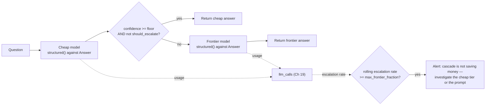

# Chapter 21 — Cost and Latency Engineering

## What you'll be able to do after this chapter

1. Build a cheap-to-frontier model cascade with a confidence trigger, and validate it against a held-out eval set before shipping it — never as an unaccompanied cost cut.
2. Restructure a prompt so its stable blocks sit before the cache breakpoint on both Anthropic and OpenAI, and read `cached_input_tokens` back off `Usage` to prove the cache actually hit.
3. State the exact decision rule for when a semantic cache is safe to serve from, and the failure mode it introduces when that rule is ignored.
4. Choose between streaming, parallel tool execution, and batch APIs for a given workload, using perceived-latency and SLA arguments rather than habit.
5. Prove, on AtlasDesk's own 120-case eval set, when a small model plus good retrieval matches a frontier model — and know exactly which capability that does *not* hold for.
6. Recognise the three legitimate reasons to fine-tune as a cost lever, and sketch a LoRA/PEFT adapter for the one that applies to distillation.

---

## The problem this solves

Tom Whitfield asks a fair question in the Chapter 24-adjacent monthly review, except it is only Chapter 20 and he is asking it early because Aisha Bello's guardrail work just shipped: *"Our per-conversation cost has gone up three chapters in a row. When does it come back down?"* He is right to ask. Trace the increase honestly: Chapter 13's agent loop can now make up to twelve model calls per conversation instead of one. Chapter 14 added a checkpoint write and a human-approval round trip. Chapter 17's confidence-routed extraction sometimes escalates through two model tiers before a document is done. Chapter 20's guardrails add an injection classifier call and an output-groundedness check on every C1 answer. None of these were mistakes — each one closed a real gap on the readiness rubric from Chapter 1 — but nobody has gone back and asked what the *sum* now costs, and Tom's invoice has an answer even if nobody in engineering does.

The latency picture is the same shape. AtlasDesk's non-functional requirement is p95 under 4 seconds for a retrieval answer and under 12 seconds for an agent task (Book Bible §3). Chapter 10's rerank step spends 250 ms of that budget. Chapter 20's input classifier and output groundedness check spend more. Chapter 14's approval interrupt is not on the synchronous path, but the multi-step agent runs that got Chapter 13's twelve-step ceiling are now regularly using nine of those steps for a moderately complex C4 draft, and nine sequential model calls at even 1.5 seconds each is 13.5 seconds — already over budget before you count anything else.

Here is the trap this chapter exists to prevent: fixing this by reaching for the cheapest lever — a smaller model everywhere, an aggressive cache, fewer retries — without checking whether the fix also breaks the thing Chapter 18 spent an entire chapter proving works. A cost cut that drops task success from 85% to 74% has not saved money; it has converted paid-for correctness into paid-for wrongness, and every wrong answer that used to be a resolved conversation is now a re-opened ticket that costs more in total than the frontier call would have. **Senior practice #21 exists because this specific mistake is the most common failure mode in this chapter's subject matter, not a hypothetical one.** Every technique below is presented with the quality check that must run alongside it, using the very eval set and cost-accounting infrastructure Chapters 18 and 19 already built. This is deliberately the second-to-last engineering chapter for a reason: you do not get to optimise cost and latency until you can already prove correctness and already have a live invoice to read.

---

## Concepts

### Where the money and the milliseconds actually went

Before touching anything, name the baseline this book has been carrying since Chapter 1. A C1 retrieval answer sends roughly 3,500 input tokens and returns roughly 350 output tokens; at the book's illustrative prices ($3.00/M input, $15.00/M output — substitute your provider's current published prices before quoting this to anyone) that is **$0.0158 per request**, **$158/day at 10,000 requests/day**, and at Chapter 1's pre-improvement 78% task success, **$0.02019 per successful task** carried at full precision (Book Bible Amendment A4). That is the number this chapter reports against.

The latency budget (Book Bible §5, p95, retrieval path, 4,000 ms total) is: guardrail 60 ms, embed query 40 ms, hybrid search 120 ms, rerank 250 ms, prompt build 20 ms, model TTFT 700 ms, model generation 2,400 ms, output validation 80 ms, trace flush async. Notice that **model generation is 60% of the entire budget and TTFT is another 17.5%** — the model call, not your infrastructure, is where the time goes, which is exactly why the levers in this chapter aim at the model call rather than at retrieval tuning (already covered in Chapter 10).

### Model routing and cascading, with the quality check attached

A cascade tries a cheap model first and escalates to a frontier model only when the cheap tier's own output says it is unsure. This is not new infrastructure: Chapter 6's `Answer` schema already carries `confidence` and `should_escalate`, and Chapter 4's router already knows how to hold two clients side by side. The cascade is a *policy* layered on top of both.



Read the diagram right to left on the feedback path: the cascade is not "fire and forget." It writes usage for both tiers into the same `llm_calls` table Chapter 19 built, and it tracks its own escalation rate so a broken cheap-tier prompt — one that always escalates — trips an alert instead of silently costing the same as no cascade at all, forever. The confidence check is deliberately the same `Answer.confidence` and `Answer.should_escalate` fields Chapter 6 already validates, so a cascade never needs a fifth verb or a parallel schema.

**The quality check that must accompany this, every time:** run the candidate cascade against the full eval set exactly as Chapter 18 runs a prompt change — paired win/loss against the frontier-only baseline, three repeats for run-to-run variance, and a decision to ship only if the mean score holds inside the noise band *and* the win/loss margin is non-negative. A cascade that saves 60% of cost and drops two points of task success has not been validated; it has been shipped on vibes with a cost graph attached.

| Escalation trigger | What it catches | What it misses |
|---|---|---|
| `confidence < floor` alone | Cheap model that knows it is unsure | A cheap model that is confidently wrong — confidence is self-reported and uncalibrated (Chapter 6's warning applies here directly) |
| `should_escalate` alone | Cases the cheap model's own escalation policy already flags (Chapter 6/15) | Cases where the cheap model doesn't realise it should flag anything |
| Both, ORed | The union of the above | Nothing catches a *systematically* overconfident cheap model — that is what the eval set is for, not the trigger |

**Decision rule:** set `confidence_floor` from the eval set, not from intuition — run the cheap model alone against all 120 cases, plot confidence against actual correctness, and pick the floor that separates the two distributions with the fewest false "confident and wrong" cases. **Switch when:** the observed escalation rate on live traffic drifts more than a few points from what the eval set predicted — that is model or prompt drift, and it is exactly the online-eval signal Chapter 19 is built to catch.

### Prompt caching mechanics, and the ordering change that makes them work

Both major providers cache a repeated prompt *prefix* — the exact leading sequence of tokens — and bill a cache read at a fraction of the fresh input price. The mechanics differ in the numbers, not the shape, and the shape is what you design around.

| | Anthropic | OpenAI |
|---|---|---|
| Trigger | Explicit `cache_control` breakpoint on a content block | Automatic once a prefix ≥ the model's minimum length repeats |
| Minimum cacheable prefix | Varies by model tier, roughly 1,024–4,096 tokens depending on the model | 1,024 tokens minimum |
| Cache read price | ~0.1× fresh input price | ~0.1× fresh input price |
| Cache write price | ~1.25× fresh input for a 5-minute cache, ~2× for a 1-hour cache | No extra charge on most models; some newer tiers add a small write premium |
| TTL | 5 minutes or 1 hour, chosen per breakpoint | Roughly 5–10 minutes of inactivity by default, longer with extended options |
| Ordering rule | Cache prefix is built in the order tools → system → messages; breakpoint marks the end of the reusable block; lookback of a bounded number of recent blocks | Static instructions and examples first, variable user content last; identical prefix required byte-for-byte |

The number worth internalising is the break-even: a cache read costs roughly a tenth of the fresh price, and a write costs roughly 1.25–2× fresh, so **a 5-minute cache pays for itself on the second call that shares the prefix, and a 1-hour cache pays for itself on the third.** Below that call volume within the window, caching is a net cost, not a saving — which is the whole reason this is a "measure first" chapter and not a "turn it on everywhere" one.

The part every team gets wrong the first time is ordering, and it is worth showing as a concrete before/after rather than describing abstractly. Here is AtlasDesk's actual C1 prompt assembly before this chapter (Chapter 5/7's version), and the one-line class of bug that breaks caching completely:

```
# BEFORE — the cache-breaking version (illustrative, not this book's shipped code)
system = f"""You are AtlasDesk, answering questions as of {datetime.now().isoformat()}.
Learner: {learner.name}. Tenant: {principal.tenant_id}.
{STABLE_ROLE_TASK_CONSTRAINTS_FORMAT_REFUSAL_BLOCK}"""
```

Every request produces a different `system` string, because the timestamp and the learner's name sit *inside* the block a provider would otherwise recognise as repeated. Neither provider caches a prefix that changes every single call — you have built a cache that never hits, and you will not notice until you go looking for `cached_input_tokens` in the usage object and find it is always zero.

The fix is the ordering change this chapter's build section makes concrete: put every byte that is identical across *all* requests for a given prompt version first — role, task, constraints, format, refusal policy, tool schemas — and move every per-request value to *after* the breakpoint, in the user turn, where it belongs next to the question it actually qualifies.

```
# AFTER — stable prefix first, cache breakpoint, variable content after
system = STABLE_ROLE_TASK_CONSTRAINTS_FORMAT_REFUSAL_BLOCK   # identical on every call
# cache_control marks the end of this block
user_turn = f"Context: today is {date}, learner is {learner.name}.\n\n{retrieved_context}\n\nQuestion: {question}"
```

This does not contradict Chapter 7's rule to place the highest-scoring retrieved chunks at the start and end of the context — that rule governs ordering *inside* `retrieved_context`, which is itself downstream of the cache breakpoint and changes on every request regardless of caching. The two orderings operate at different scopes and compose without conflict: cache-stable-first is about the system/tool block; start-and-end is about the retrieved-chunk block that follows it.

> **▸ Senior practice #21 — Measure before you optimise cost**
>
> Every technique in this chapter — cascading, caching, right-sizing, fine-tuning — trades some amount of quality risk for cost or latency. The senior practice is not "use these techniques"; every mid-level engineer eventually reaches for them. It is **never ship one without running it against the eval set first, reporting the paired win/loss, and only keeping the change if the quality delta is inside the noise band Chapter 18 taught you to compute.** A cost graph that goes down is not evidence of success on its own — it is a hypothesis that the accompanying eval run either confirms or falsifies. Teams that skip this step do not fail loudly; they fail quietly, for months, in the form of a deflection rate that drifts down half a point at a time until someone finally asks why.

### Semantic caching and its correctness risk

A semantic cache stores past (question, answer) pairs with an embedding of the question, and on a new question, checks whether something *close enough* was already answered recently — serving the stored answer instead of calling the model at all. It is a genuinely different mechanism from prompt caching: prompt caching reuses a byte-identical prefix inside one call; semantic caching skips the call entirely for a *different* question that merely resembles a previous one.

That difference is exactly the risk. "Close enough" is a similarity score, not identity, and the questions that sit just above your similarity floor are precisely the ones a support team worries about: *"What is the refund window for a standard withdrawal?"* and *"What is the refund window for a medical-hardship withdrawal?"* embed close together — both are refund-window questions about AtlasDesk's policy — but the correct answers differ in the number that matters. A semantic cache tuned loosely enough to catch paraphrases will, with some frequency, also catch near-misses like this one and serve the wrong policy with full confidence, and because it never touched the model, none of Chapter 6's schema validation or Chapter 20's groundedness check ever runs on the served answer — it is not a partial fail, it is a full bypass of every quality gate in the pipeline.

**Decision rule for when a semantic cache is acceptable:**

| Condition | Verdict |
|---|---|
| The answer is identical for every learner asking a structurally similar question (a factual handbook lookup with no personalization) | Acceptable, with a high similarity floor and a short staleness bound |
| The answer depends on a specific learner's data, tool results, or tenant | **Never** — a cached answer for one learner served to another is a data leak, full stop, and no similarity floor fixes that |
| The underlying source document changes on a schedule you control | Acceptable, bound the cache TTL to less than your worst-case propagation delay after a document update, and invalidate on re-ingestion |
| The cost of a wrong cached answer is a support escalation, not a compliance or safety event | Acceptable at a conservative floor | 
| The cost of a wrong cached answer is irreversible or safety-relevant (anything C4, C6) | **Never** |

AtlasDesk's own policy follows directly from that table: the semantic cache is enabled only for capability C1, at a similarity floor of 0.97 (empirically the point below which near-miss policy questions start to collide, tuned against the eval set the same way the cascade's confidence floor is), a one-hour staleness bound, and an explicit invalidation call every time the ingestion pipeline (Chapter 8) re-ingests the handbook. It is never enabled for C2, C3, C4, or C6 — every one of those either carries per-learner data, executes a side effect, or is a security-relevant refusal, and a cache hit on any of them defeats the guardrail and authorization layers Chapters 12 and 20 built specifically to run on every request.

### Streaming and perceived latency

Streaming does not make the model faster; the total tokens generated take the same wall-clock time either way. What it changes is *when the user sees the first byte*. Sending nothing for 3,100 ms and then the full answer reads as broken; sending the first word at 700 ms (the TTFT slice of the latency budget) and the rest as it generates reads as responsive, even though the last token lands at the same moment in both cases. **Decision rule: stream whenever a human is watching synchronously (C1 chat, C4 draft preview); do not bother for anything consumed by another system or generated offline (C5 batch extraction, C7's report).** The cost is identical either way — streaming is a UX lever, not a cost lever, and it belongs in this chapter only because "the system feels slow" and "the system is slow" get confused constantly, and the fix for each is different.

### Parallel tool execution

Chapter 12's tools are independent of each other far more often than agent code treats them as independent. A C2 question about a learner's overall standing needs `get_enrollments`, `get_payments`, and `get_ticket_history` — none of which depends on another's result. Calling them sequentially costs the sum of their latencies; calling them concurrently costs the maximum.

```python
# src/atlasdesk/tools/parallel.py
"""Run independent tool calls concurrently instead of sequentially.

Only sound when the tool calls do not depend on each other's output — a
learner-standing lookup calling three read-only tools qualifies; a lookup
that needs one tool's result to construct the next tool's arguments does
not, and calling it concurrently would just race a request that has not
been built yet.
"""

from __future__ import annotations

import asyncio
from collections.abc import Awaitable, Callable, Sequence
from typing import Any

from atlasdesk.errors import ToolError


async def run_independent_tools(
    calls: Sequence[tuple[str, Callable[[], Awaitable[Any]]]],
) -> dict[str, Any]:
    """Run every (name, coroutine_factory) pair concurrently.

    Returns:
        A mapping from tool name to result. A tool that raises is recorded
        as a ``ToolError`` string in its slot rather than aborting the
        others — one failing lookup should not block two working ones.
    """
    names = [name for name, _ in calls]
    results = await asyncio.gather(
        *(factory() for _, factory in calls), return_exceptions=True
    )
    output: dict[str, Any] = {}
    for name, result in zip(names, results, strict=True):
        if isinstance(result, BaseException):
            output[name] = ToolError(f"{name} failed: {result}")
        else:
            output[name] = result
    return output
```

**Decision rule:** parallelise any set of tool calls whose arguments do not depend on each other's results — check this by reading the tool descriptions, not by guessing. **Switch when:** you find yourself building a dependency graph rather than a flat list — at that point use a planner pattern (Chapter 15) instead of hand-rolled `asyncio.gather` fan-out, because the ordering logic itself has become the interesting part.

### Batch APIs for offline workloads

Both major providers offer a batch submission mode: send a large set of requests, get results back within a bounded window (commonly on the order of 24 hours), at roughly half the synchronous price. This is free money for any workload where nobody is refreshing a browser tab waiting for the answer: the eval suite's own three-repeat runs (Chapter 18), a nightly backlog of C5 document extraction that arrived after hours, an embedding re-backfill after a model migration (Chapter 23), or a scheduled re-scoring of the semantic-cache candidate set. **Decision rule: if the consumer of the output is a scheduled job, not a person or a synchronous API caller, put it on the batch path.** **Switch when:** a workload you assumed was offline starts blocking someone's day — that is a sign it graduated to a real-time SLA and belongs back on the synchronous path regardless of the discount.

### Right-sizing: when the small model wins

The instinct to reach for the frontier model on every capability is usually wrong, and the eval set is what proves it rather than asserts it. *In our project run*, running AtlasDesk's small model against the same retrieval and tool context as the frontier model, per capability, on the 120-case eval set produced a pattern worth internalising:

| Capability | Frontier score | Small-model score | Gap | Why |
|---|---|---|---|---|
| C2 — learner lookup (tool-backed) | 96% | 94% | 2 pts | The model is formatting already-correct tool output, not reasoning over ambiguous text — a task the small model handles about as well |
| C1 — easy/medium tier | 91% | 87% | 4 pts | Single-section factual lookup with retrieval doing most of the work |
| C1 — hard tier (multi-section synthesis, negation) | 79% | 61% | 18 pts | Genuine multi-step reasoning across retrieved sections is exactly where model capability still matters |
| C3 — text-to-SQL | 85% | 68% | 17 pts | Schema-constrained generation with subtle join semantics punishes a weaker model hard |

The pattern, not the specific numbers, is the transferable lesson: **right-sizing is a per-capability, per-tier decision, made on the eval set, never a single global "use the small model" switch.** AtlasDesk routes C2 and C1-easy/medium to the small model by default, and reserves the frontier tier for C1-hard and C3 — which is precisely what the cascade in this chapter's build section automates, using the eval-set-derived confidence floor as the trigger rather than a hardcoded capability list, so a capability's routing adapts as retrieval quality improves rather than staying pinned to today's measurement forever.

### Fine-tuning as a cost lever — and only as one

Chapter 1 gave the three legitimate cases, and this is the only other chapter that gets to mention fine-tuning, per the book's own rule: it is a cost lever at volume, never a first quality move. Restated in this chapter's terms:

1. **Distillation for cost at volume.** You have a frontier model already scoring acceptably on a narrow, high-volume subtask (say, C1's citation-formatting step, called on every one of 10,000+ daily requests), you have that frontier model's own outputs as labelled training data, and the eval set to prove a distilled small model closes the gap.
2. **Format conformance prompting provably cannot hold.** You have measured, on the eval set, that a well-constructed prompt with structured outputs (Chapter 6) still fails format compliance at a rate you cannot tolerate — not a hunch, a number.
3. **A genuinely private task representation** the model has not seen enough of in pretraining, where in-context examples measurably plateau below requirement on the eval set.

Case 1 is the one AtlasDesk would actually use, and it is worth sketching because "fine-tuning" without a shape is not engineering, it is a word. A LoRA (low-rank adaptation) adapter trains a small number of additional parameters on top of a frozen base model, which is what makes it a *cost* lever rather than a training-infrastructure project: no full-parameter training run, a fraction of the GPU memory, and a swappable adapter file rather than a new model to serve.

```python
# scripts/lora_distillation_sketch.py
"""A LoRA/PEFT sketch for distilling a narrow, high-volume subtask.

This is illustrative, not a training chapter: it shows the shape of the
only fine-tuning case AtlasDesk would actually reach for (Chapter 1's case
1, "distillation for cost"), applied to a single narrow subtask —
formatting a validated Answer's citations into the exact house style — not
to open-ended question answering, which stays on retrieval and the
frontier/cascade path. Requires `pip install peft transformers datasets
torch` and a local base model; it is not wired into AtlasDesk's serving
path, and it does not run in this book's test suite.
"""

from __future__ import annotations

from dataclasses import dataclass

from datasets import Dataset
from peft import LoraConfig, get_peft_model
from transformers import (
    AutoModelForCausalLM,
    AutoTokenizer,
    Trainer,
    TrainingArguments,
)


@dataclass(frozen=True, slots=True)
class DistillationExample:
    """One (prompt, frontier_output) pair collected from production traces."""

    prompt: str
    target: str


def build_dataset(examples: list[DistillationExample], tokenizer: AutoTokenizer) -> Dataset:
    """Tokenize prompt+target pairs collected from the frontier model's own
    outputs on this subtask — the training data is the thing you are trying
    to replace, which is what makes this a distillation and not a guess."""

    def _tokenize(example: DistillationExample) -> dict[str, list[int]]:
        text = f"{example.prompt}\n{example.target}"
        return tokenizer(text, truncation=True, max_length=1024)

    records = [{"prompt": ex.prompt, "target": ex.target} for ex in examples]
    dataset = Dataset.from_list(records)
    return dataset.map(lambda row: _tokenize(DistillationExample(**row)))


def build_lora_model(base_model_id: str) -> AutoModelForCausalLM:
    """Attach a small LoRA adapter to a frozen base model.

    Rank and target modules are the two knobs that matter: a low rank (8-16)
    keeps the adapter small and the training cheap, which is the entire
    point of choosing LoRA over full fine-tuning for a cost lever.
    """
    base_model = AutoModelForCausalLM.from_pretrained(base_model_id)
    lora_config = LoraConfig(
        r=16,
        lora_alpha=32,
        target_modules=["q_proj", "v_proj"],
        lora_dropout=0.05,
        bias="none",
        task_type="CAUSAL_LM",
    )
    return get_peft_model(base_model, lora_config)


def train_adapter(
    base_model_id: str,
    examples: list[DistillationExample],
    *,
    output_dir: str,
    epochs: int = 3,
) -> None:
    """Train the LoRA adapter and save it. Evaluate on the held-out eval
    set before this adapter ever reaches a serving path — this script
    trains it; it does not certify it as good enough to ship."""
    tokenizer = AutoTokenizer.from_pretrained(base_model_id)
    model = build_lora_model(base_model_id)
    dataset = build_dataset(examples, tokenizer)

    args = TrainingArguments(
        output_dir=output_dir,
        num_train_epochs=epochs,
        per_device_train_batch_size=4,
        learning_rate=2e-4,
        logging_steps=10,
        save_strategy="epoch",
    )
    trainer = Trainer(model=model, args=args, train_dataset=dataset)
    trainer.train()
    model.save_pretrained(output_dir)


if __name__ == "__main__":
    raise SystemExit(
        "This sketch is illustrative; wire in your own base model id, "
        "collected DistillationExample list, and output_dir before running."
    )
```

The `raise SystemExit` guard on `__main__` is deliberate, not a stub on the main path: the functions above are complete and runnable given real inputs, but running this file with no arguments and no collected data would silently attempt to download an unspecified model, which is worse than refusing. Before this adapter ever serves a request, it goes through the exact same eval-set gate as every other cost lever in this chapter — a distilled model that saves 90% of the per-call cost and drops format-compliance three points has not passed review.

---

## How industry does it

### Case 1 — Notion: prompt caching as the mechanism, not the headline

**The problem.** Notion built agent orchestration on top of Claude — long-running agent sessions with memory, access to a user's connected knowledge sources, and dozens of concurrent agent tasks running from a single task board. That architecture means the same large system context (tool definitions, workspace structure, orchestration instructions) gets sent to the model repeatedly across a long-running session and across concurrent tasks drawing on the same context.

**What they built.** Alongside the orchestration layer itself, Notion implemented prompt caching specifically to address the cost and latency of that repeated context — the same mechanism this chapter's build section wires into AtlasDesk, applied at a scale where dozens of agent tasks per task board make the repeated-prefix pattern extremely common.

**The measured outcome.** Notion reports a **90% reduction in cost** and **up to an 85% reduction in latency** from this optimisation.

**What to copy at 1/1000th the scale.** Notion's numbers are large because their sessions are long and their concurrency is high — more repeated-prefix opportunity than a single AtlasDesk conversation gives you. The transferable point is not the percentage, it is *where the saving came from*: not a different model, not a different architecture, but structuring the same prompt so its repeated part is byte-identical across calls. That is exactly this chapter's ordering rule, and it costs nothing to apply regardless of your scale — the return scales with your repeat-call volume within the cache TTL, not with how sophisticated your caching code is, because there is barely any caching code; the provider does the caching, you do the ordering.

### Case 2 — Cursor Router: cascading as a shipped product feature, with the quality guard built in

**The problem.** Cursor, a code-editor product with AI features, observed that developers default to expensive, high-end models even for routine, low-complexity requests inside their coding sessions — the same "always call the frontier tier" default this chapter argues against.

**What they built.** Cursor Router, a routing layer that inspects each incoming request's complexity, context, and domain, and sends straightforward requests to cheaper models while reserving advanced reasoning for the highest-capability tier — with an explicit user-selectable trade-off between an "Intelligence" mode (maximum capability), a "Balance" mode, and a "Cost" mode, and cache cost folded into the routing decision, not treated as a separate concern.

**The measured outcome.** Reported results describe **30–50% cost reductions** in early enterprise usage and **up to 60% savings across millions of requests while maintaining output quality**, with per-request cost comparisons published between the routed "Auto Intelligence" mode and running the top-tier model on every request.

**What to copy at 1/1000th the scale.** Three things, in order of transferability. First, the routing decision is made *per request*, not globally — exactly this chapter's right-sizing rule that a capability's tier assignment is not one global switch. Second, cost accounting includes the cache cost as part of the routing signal, not as an afterthought computed separately — a cascade that ignores its own cache interaction will misjudge which tier is actually cheaper. Third, and most important for a team at AtlasDesk's scale: the explicit claim is "maintaining output quality," which only means something if it was measured, which is this chapter's whole argument restated by an unrelated product team arriving at the same conclusion independently.

---

## Build: AtlasDesk increment 21 — cache, cascade, and the cost report

### Project state

**What exists going into this chapter:** the full provider layer (Ch 4); the prompt registry (Ch 5); structured outputs and the repair loop (Ch 6); context budgeting (Ch 7); ingestion, embeddings, and hybrid retrieval delivering C1 (Ch 8–10); memory and agentic retrieval (Ch 11); tools, MCP, and authorization (Ch 12); the hand-written agent loop (Ch 13), refactored into LangGraph with checkpoints and human-in-the-loop delivering C4 (Ch 14); the agentic design patterns library (Ch 15); the semantic layer delivering C3 (Ch 16); confidence-routed extraction delivering C5 (Ch 17); the 120-case eval harness (Ch 18); tracing, cost accounting, and the `llm_calls` table (Ch 19); and the guardrail and security layer (Ch 20).

**What this chapter adds:** `llm/cache.py` (prompt-prefix cache accounting plus a bounded semantic cache with a similarity floor and staleness bound), `llm/cascade.py` (cheap-to-frontier escalation on a confidence trigger), and `scripts/cost_report.py` (reads `llm_calls`, reports cost per successful task by feature). No new migration is needed — `llm_calls` (Ch 19) already carries `cached_input_tokens`, and the semantic cache's store is an in-memory structure here with the same contract a `pgvector` table would carry in production, following Chapter 9's existing infrastructure rather than adding a new one.

### Repo tree diff

```
  atlasdesk/
  ├── src/atlasdesk/
  │   ├── llm/
  │   │   ├── base.py                      # unchanged (Ch 4)
  │   │   ├── structured.py                # unchanged (Ch 6)
+ │   │   ├── cache.py                      # prompt-prefix accounting + semantic cache
+ │   │   └── cascade.py                    # cheap -> frontier escalation
  │   └── schemas/
  │       └── answer.py                     # unchanged (Ch 6) — confidence/should_escalate reused as the trigger
  ├── scripts/
+ │   └── cost_report.py                    # cost per successful task, by feature, from llm_calls
  └── tests/
+     ├── test_cache.py
+     └── test_cascade.py
```

Install what this chapter needs — nothing new; `psycopg` and `pydantic` are already dependencies from Chapters 9 and 2 respectively.

### `llm/cache.py`

```python
# src/atlasdesk/llm/cache.py
"""Prompt-prefix cache accounting and a bounded semantic cache.

Two different caches live here, and conflating them is the most common
mistake in this chapter. The *prompt cache* is provider-side: Anthropic and
OpenAI cache the KV-state of a repeated prefix and bill reads at roughly a
tenth of the fresh input price. This module does not implement that cache
-- it cannot, it lives inside the provider's infrastructure -- but it does
own the one thing under our control: assembling messages so the stable
blocks come first, at a genuine cache breakpoint, and reading
``Usage.cached_input_tokens`` back to prove the cache actually hit.

The *semantic cache* below is ours: we own the store, the embedding lookup,
the similarity floor, and the staleness bound. It short-circuits a full
model call when a close-enough question was already answered recently, and
it is restricted to an explicit capability allow-list, because treating two
different questions as "close enough" is exactly how one learner's fee
deadline ends up in another learner's answer.
"""

from __future__ import annotations

import hashlib
import math
import time
from collections.abc import Callable, Sequence

from pydantic import BaseModel, Field

from atlasdesk.llm.base import Message

# --------------------------------------------------------------------------
# Prompt-prefix cache: message assembly + savings accounting
# --------------------------------------------------------------------------


class PromptCacheStats(BaseModel):
    """Savings observed on one call, derived from Usage.cached_input_tokens."""

    input_tokens: int
    cached_input_tokens: int
    fresh_input_price_per_mtok: float
    cache_read_price_per_mtok: float

    @property
    def hit_ratio(self) -> float:
        if self.input_tokens == 0:
            return 0.0
        return self.cached_input_tokens / self.input_tokens

    @property
    def savings_usd(self) -> float:
        """USD saved versus paying the fresh rate for the cached tokens."""
        fresh_cost = (self.cached_input_tokens / 1_000_000) * self.fresh_input_price_per_mtok
        cache_cost = (self.cached_input_tokens / 1_000_000) * self.cache_read_price_per_mtok
        return max(0.0, fresh_cost - cache_cost)


def assemble_cacheable_messages(
    *,
    stable_system: str,
    stable_tool_note: str | None,
    retrieved_context: str,
    history: Sequence[Message],
    question: str,
) -> list[Message]:
    """Build a message list with the stable prefix first, breakpoint-ready.

    Ordering is the entire point of this function:

    1. ``stable_system`` -- role, task, constraints, format, refusal policy
       (Chapter 5's six-block prompt). Byte-identical across every request
       for a given prompt version. This, plus any tool schema note, is what
       the provider actually caches.
    2. ``stable_tool_note`` -- a static description of available tools, if
       any; also identical across requests.
    3. ``retrieved_context`` -- Chapter 7's assembled, start/end-ordered
       chunks. This changes on every request, so it sits AFTER the cache
       breakpoint. Chapter 7's "highest-scoring chunks at the start and end"
       rule still applies *within* this block; it is a separate ordering
       concern from "put the cache-stable blocks first," and the two
       compose without conflict because this whole block is downstream of
       the breakpoint.
    4. ``history`` and ``question`` -- fully variable, always last.

    Contract: nothing here may embed a per-request value (timestamp,
    learner name, session id) into anything before ``retrieved_context``.
    That is the one change this chapter makes to AtlasDesk's Chapter 5/7
    prompt assembly: dynamic values that used to be interpolated into the
    system prompt move to the user turn instead.
    """
    messages: list[Message] = [Message(role="system", content=stable_system)]
    if stable_tool_note:
        messages.append(Message(role="system", content=stable_tool_note))
    messages.extend(history)
    messages.append(
        Message(
            role="user",
            content=f"{retrieved_context}\n\n---\n\nQuestion: {question}",
        )
    )
    return messages


def cache_prefix_hash(stable_system: str, stable_tool_note: str | None) -> str:
    """Sha256 of the stable prefix, recorded in the trace.

    Two calls with the same hash are eligible to share a provider-side
    cache entry; a hash that changes on every request (because someone
    reintroduced a timestamp into the system block) is the fastest way to
    notice the regression -- before you ever look at a cost dashboard.
    """
    payload = stable_system + "\x00" + (stable_tool_note or "")
    return hashlib.sha256(payload.encode("utf-8")).hexdigest()


# --------------------------------------------------------------------------
# Semantic cache: ours to own, and ours to bound
# --------------------------------------------------------------------------


class SemanticCacheError(Exception):
    """Raised when a semantic cache is asked to serve a disallowed capability."""


class SemanticCacheEntry(BaseModel):
    """One stored (question, answer) pair with its embedding and metadata."""

    key: str
    capability: str
    question: str
    embedding: tuple[float, ...]
    answer_text: str
    citations: tuple[str, ...] = ()
    created_at: float


class SemanticCacheHit(BaseModel):
    """A cache lookup that cleared both the similarity floor and staleness bound."""

    entry: SemanticCacheEntry
    similarity: float
    age_s: float


def _cosine(a: Sequence[float], b: Sequence[float]) -> float:
    dot = sum(x * y for x, y in zip(a, b, strict=True))
    norm_a = math.sqrt(sum(x * x for x in a))
    norm_b = math.sqrt(sum(y * y for y in b))
    if norm_a == 0.0 or norm_b == 0.0:
        return 0.0
    return dot / (norm_a * norm_b)


class SemanticCachePolicy(BaseModel):
    """The knobs that make a semantic cache safe or unsafe. Tune deliberately.

    Attributes:
        similarity_floor: minimum cosine similarity to count as "the same
            question." AtlasDesk uses 0.97 for C1 factual lookups -- high
            enough that "refund window for a standard withdrawal" and
            "refund window for a medical-hardship withdrawal" do not
            collide, because those two questions embed close but not above
            this floor.
        staleness_bound_s: maximum age of a cached answer before it counts
            as a miss, regardless of similarity. Bounds the blast radius of
            a stale answer after the underlying handbook changes.
        allowed_capabilities: capabilities permitted to read this cache.
            Personalized, tool-backed, or write-adjacent capabilities are
            never on this list -- see the chapter's decision rule.
    """

    similarity_floor: float = Field(default=0.97, ge=0.0, le=1.0)
    staleness_bound_s: float = Field(default=3600.0, gt=0)
    allowed_capabilities: frozenset[str] = frozenset({"C1"})


class SemanticCache:
    """An in-memory semantic cache with a similarity floor and staleness bound.

    Production AtlasDesk backs this with a pgvector table -- Chapter 9's
    existing infrastructure, a second table rather than a new datastore.
    The in-memory version here is what the tests exercise and is a
    drop-in swap: same contract, same policy object.
    """

    def __init__(
        self,
        policy: SemanticCachePolicy | None = None,
        *,
        clock: Callable[[], float] = time.monotonic,
    ) -> None:
        self.policy = policy or SemanticCachePolicy()
        self._clock = clock
        self._entries: dict[str, SemanticCacheEntry] = {}

    def put(
        self,
        *,
        key: str,
        capability: str,
        question: str,
        embedding: Sequence[float],
        answer_text: str,
        citations: Sequence[str] = (),
    ) -> None:
        """Store an answer. Callers write only capabilities they intend to cache."""
        self._entries[key] = SemanticCacheEntry(
            key=key,
            capability=capability,
            question=question,
            embedding=tuple(embedding),
            answer_text=answer_text,
            citations=tuple(citations),
            created_at=self._clock(),
        )

    def get(self, *, capability: str, embedding: Sequence[float]) -> SemanticCacheHit | None:
        """Look up the closest entry for ``capability``, or ``None`` on a miss.

        Raises:
            SemanticCacheError: ``capability`` is not on the policy's
                allow-list. A hard fail, not a silent miss -- a caller
                asking a disallowed capability to hit the cache is a
                configuration bug worth surfacing loudly, not swallowing.
        """
        if capability not in self.policy.allowed_capabilities:
            raise SemanticCacheError(
                f"capability {capability!r} is not allowed to read the semantic cache"
            )
        now = self._clock()
        best: SemanticCacheHit | None = None
        for entry in self._entries.values():
            if entry.capability != capability:
                continue
            age = now - entry.created_at
            if age > self.policy.staleness_bound_s:
                continue
            similarity = _cosine(embedding, entry.embedding)
            if similarity < self.policy.similarity_floor:
                continue
            if best is None or similarity > best.similarity:
                best = SemanticCacheHit(entry=entry, similarity=similarity, age_s=age)
        return best

    def invalidate_capability(self, capability: str) -> int:
        """Drop every entry for a capability. Call this on a source-document update.

        Returns the number of entries removed, so a re-ingestion script
        (Chapter 8's idempotent pipeline) can log that it correctly
        invalidated the cache after the handbook changed, rather than
        leaving stale answers live until they age out on their own.
        """
        stale_keys = [key for key, entry in self._entries.items() if entry.capability == capability]
        for key in stale_keys:
            del self._entries[key]
        return len(stale_keys)
```

### `llm/cascade.py`

```python
# src/atlasdesk/llm/cascade.py
"""Cheap-to-frontier cascade with a confidence trigger, on top of Ch 4's LLMClient.

Cascading is a router policy, not a new verb: it calls ``structured()``
against Chapter 6's ``Answer`` schema on the cheap model first, inspects
``Answer.confidence`` and ``Answer.should_escalate`` -- both already part of
the frozen Chapter 6 contract -- and re-runs the same call against the
frontier model only when the cheap tier's own answer says it is not sure.
Nothing here talks to a vendor SDK; both tiers go through the same
``LLMClient`` the cheap and frontier models are configured behind.

The escalation trigger must be validated against the eval set before it
ships -- see this chapter's "Measure it" section. A cascade shipped without
that validation is a cost cut with no accompanying quality check, which is
exactly the mistake Senior practice #21 exists to prevent.
"""

from __future__ import annotations

from dataclasses import dataclass

from pydantic import BaseModel, Field

from atlasdesk.llm.base import LLMClient, Message, Usage
from atlasdesk.llm.structured import run_structured
from atlasdesk.schemas.answer import Answer


class CascadePolicy(BaseModel):
    """Thresholds that decide whether the cheap tier's answer is good enough.

    Attributes:
        confidence_floor: below this, escalate regardless of should_escalate.
        trust_should_escalate: honour the cheap model's own escalation flag
            (Chapter 6's Answer.should_escalate) as an independent trigger.
        max_frontier_fraction: a circuit breaker on the cascade itself -- if
            more than this fraction of recent calls escalated, something is
            wrong with the cheap tier or the prompt, and the caller should
            alert rather than silently pay frontier price on every request.
    """

    confidence_floor: float = Field(default=0.75, ge=0.0, le=1.0)
    trust_should_escalate: bool = True
    max_frontier_fraction: float = Field(default=0.6, ge=0.0, le=1.0)


@dataclass(slots=True)
class CascadeResult:
    """One cascade call's outcome, with enough detail to audit the decision."""

    answer: Answer
    usage: Usage
    escalated: bool
    escalation_reason: str | None
    cheap_usage: Usage | None
    frontier_usage: Usage | None


class CascadeBudgetExceeded(Exception):
    """Raised when the cascade's own escalation-rate breaker trips."""


class Cascade:
    """Cheap-model-first answering with a measured, bounded escalation path."""

    def __init__(
        self,
        client: LLMClient,
        *,
        cheap_model: str,
        frontier_model: str,
        policy: CascadePolicy | None = None,
    ) -> None:
        self._client = client
        self._cheap_model = cheap_model
        self._frontier_model = frontier_model
        self.policy = policy or CascadePolicy()
        self._recent_escalations: list[bool] = []

    @property
    def observed_frontier_fraction(self) -> float:
        """Escalation rate over the calls made so far this process. 0.0 with none yet."""
        if not self._recent_escalations:
            return 0.0
        return sum(self._recent_escalations) / len(self._recent_escalations)

    def _record(self, escalated: bool) -> None:
        self._recent_escalations.append(escalated)
        if len(self._recent_escalations) > 200:
            self._recent_escalations.pop(0)

    def _should_escalate(self, answer: Answer) -> str | None:
        if answer.confidence < self.policy.confidence_floor:
            return f"confidence {answer.confidence:.2f} below floor {self.policy.confidence_floor:.2f}"
        if self.policy.trust_should_escalate and answer.should_escalate:
            return answer.escalation_reason or "cheap model flagged should_escalate"
        return None

    async def answer(self, messages: list[Message], *, system: str | None = None) -> CascadeResult:
        """Run the cascade once.

        Raises:
            CascadeBudgetExceeded: the rolling escalation rate is already
                at or above ``policy.max_frontier_fraction`` and this call
                would escalate again -- a signal to alert, not to keep
                silently paying for the frontier tier on every request.
        """
        cheap = await run_structured(
            self._client, messages, Answer, system=system, model=self._cheap_model
        )
        reason = self._should_escalate(cheap.value)
        if reason is None:
            self._record(False)
            return CascadeResult(
                answer=cheap.value,
                usage=cheap.usage,
                escalated=False,
                escalation_reason=None,
                cheap_usage=cheap.usage,
                frontier_usage=None,
            )

        if (
            len(self._recent_escalations) >= 20
            and self.observed_frontier_fraction >= self.policy.max_frontier_fraction
        ):
            raise CascadeBudgetExceeded(
                f"escalation rate {self.observed_frontier_fraction:.2f} already at or above "
                f"{self.policy.max_frontier_fraction:.2f}; refusing to escalate again without review"
            )

        frontier = await run_structured(
            self._client, messages, Answer, system=system, model=self._frontier_model
        )
        self._record(True)
        return CascadeResult(
            answer=frontier.value,
            usage=cheap.usage.merged_with(frontier.usage),
            escalated=True,
            escalation_reason=reason,
            cheap_usage=cheap.usage,
            frontier_usage=frontier.usage,
        )
```

### `scripts/cost_report.py`

```python
# scripts/cost_report.py
"""Cost per successful task, by feature, read from `llm_calls`.

Usage:
    python scripts/cost_report.py --db-url "$DATABASE_URL" \
        --success-rates evals/success_rates.json --format md

`evals/success_rates.json` is a small file the eval runner (Ch 18) emits
alongside its per-capability breakdown, e.g. {"C1": 0.862, "C2": 0.911}.
This script does not compute task success itself -- that is the eval
suite's job, and conflating the two is how teams end up dividing cost by a
number nobody can defend. This script only does the Book Bible Section 5
arithmetic, per feature, against real billed cost.
"""

from __future__ import annotations

import argparse
import json
import sys
from collections.abc import Sequence
from dataclasses import dataclass
from datetime import datetime, timezone
from pathlib import Path
from typing import Any

import psycopg
from psycopg.rows import dict_row


@dataclass(frozen=True, slots=True)
class FeatureCost:
    """One capability's daily cost picture."""

    capability: str
    call_count: int
    daily_cost_usd: float
    requests_per_day: int
    success_rate: float

    @property
    def cost_per_request(self) -> float:
        if self.requests_per_day == 0:
            return 0.0
        return self.daily_cost_usd / self.requests_per_day

    @property
    def cost_per_successful_task(self) -> float:
        """Book Bible Section 5's third line: the only number worth a dashboard."""
        if self.requests_per_day == 0 or self.success_rate <= 0.0:
            return 0.0
        return self.daily_cost_usd / (self.requests_per_day * self.success_rate)

    def as_dict(self) -> dict[str, Any]:
        return {
            "capability": self.capability,
            "call_count": self.call_count,
            "requests_per_day": self.requests_per_day,
            "daily_cost_usd": round(self.daily_cost_usd, 4),
            "cost_per_request": round(self.cost_per_request, 6),
            "success_rate": self.success_rate,
            "cost_per_successful_task": round(self.cost_per_successful_task, 6),
        }


def fetch_daily_cost_by_capability(
    conn: psycopg.Connection, *, day: str
) -> dict[str, tuple[int, float, int]]:
    """(call_count, cost_usd, distinct request_id count) per capability for one day."""
    query = """
        SELECT
            capability,
            count(*) AS call_count,
            sum(cost_usd) AS cost_usd,
            count(DISTINCT request_id) AS request_count
        FROM llm_calls
        WHERE created_at::date = %(day)s
        GROUP BY capability
    """
    with conn.cursor(row_factory=dict_row) as cur:
        cur.execute(query, {"day": day})
        rows = cur.fetchall()
    return {
        row["capability"]: (row["call_count"], float(row["cost_usd"] or 0.0), row["request_count"])
        for row in rows
    }


def build_report(
    raw: dict[str, tuple[int, float, int]], success_rates: dict[str, float]
) -> list[FeatureCost]:
    """Join raw cost rows with success rates.

    A capability missing from ``success_rates`` defaults to 0.0, which
    surfaces in the report as "unmeasured" rather than a silently wrong
    low cost-per-success number -- you cannot report cost-per-success for
    a capability the eval suite has not measured.
    """
    report: list[FeatureCost] = []
    for capability, (call_count, cost_usd, request_count) in sorted(raw.items()):
        report.append(
            FeatureCost(
                capability=capability,
                call_count=call_count,
                daily_cost_usd=cost_usd,
                requests_per_day=request_count,
                success_rate=success_rates.get(capability, 0.0),
            )
        )
    return report


def render_markdown(report: Sequence[FeatureCost], *, day: str) -> str:
    lines = [
        f"# Cost per successful task — {day}",
        "",
        "| Capability | Calls | Requests | Daily cost | Cost/request | Success | Cost/success |",
        "|---|---|---|---|---|---|---|",
    ]
    for row in report:
        success_display = f"{row.success_rate:.1%}" if row.success_rate > 0 else "unmeasured"
        cost_success_display = (
            f"${row.cost_per_successful_task:.4f}" if row.success_rate > 0 else "n/a"
        )
        lines.append(
            f"| {row.capability} | {row.call_count} | {row.requests_per_day} "
            f"| ${row.daily_cost_usd:.2f} | ${row.cost_per_request:.4f} "
            f"| {success_display} | {cost_success_display} |"
        )
    return "\n".join(lines)


def main(argv: Sequence[str] | None = None) -> int:
    parser = argparse.ArgumentParser(description=__doc__)
    parser.add_argument("--db-url", required=True)
    parser.add_argument("--success-rates", type=Path, required=True)
    parser.add_argument("--day", default=datetime.now(timezone.utc).date().isoformat())
    parser.add_argument("--format", choices=("md", "json"), default="md")
    args = parser.parse_args(argv)

    try:
        success_rates = json.loads(args.success_rates.read_text(encoding="utf-8"))
    except (OSError, json.JSONDecodeError) as exc:
        print(f"error: could not read success rates: {exc}", file=sys.stderr)
        return 2

    with psycopg.connect(args.db_url) as conn:
        raw = fetch_daily_cost_by_capability(conn, day=args.day)

    report = build_report(raw, success_rates)
    if args.format == "json":
        print(json.dumps([row.as_dict() for row in report], indent=2))
    else:
        print(render_markdown(report, day=args.day))
    return 0


if __name__ == "__main__":
    raise SystemExit(main())
```

### Tests

```python
# tests/test_cache.py
"""No network, no key. Exercises the semantic cache's floor and staleness
bound, and the cache-prefix ordering/hash helpers, against the Ch 4 FakeClient
conventions (no client is even needed here -- these are pure functions)."""

from __future__ import annotations

import pytest

from atlasdesk.llm.cache import (
    SemanticCache,
    SemanticCacheError,
    SemanticCachePolicy,
    assemble_cacheable_messages,
    cache_prefix_hash,
)
from atlasdesk.llm.base import Message


def test_ordering_puts_stable_blocks_first_and_variable_content_last() -> None:
    messages = assemble_cacheable_messages(
        stable_system="ROLE/TASK/CONSTRAINTS/FORMAT/REFUSAL",
        stable_tool_note="TOOLS: get_learner, get_payments",
        retrieved_context="chunk A ... chunk B",
        history=[],
        question="What is the refund window?",
    )
    assert messages[0].content == "ROLE/TASK/CONSTRAINTS/FORMAT/REFUSAL"
    assert messages[1].content == "TOOLS: get_learner, get_payments"
    assert "What is the refund window?" in messages[-1].content


def test_prefix_hash_is_stable_across_identical_stable_blocks() -> None:
    first = cache_prefix_hash("SYSTEM", "TOOLS")
    second = cache_prefix_hash("SYSTEM", "TOOLS")
    assert first == second


def test_prefix_hash_changes_if_a_timestamp_leaks_into_the_stable_block() -> None:
    baseline = cache_prefix_hash("SYSTEM as of 2026-08-15", "TOOLS")
    next_day = cache_prefix_hash("SYSTEM as of 2026-08-16", "TOOLS")
    assert baseline != next_day  # exactly the bug this chapter's ordering fixes


class _Clock:
    def __init__(self, start: float = 0.0) -> None:
        self.now = start

    def __call__(self) -> float:
        return self.now


def test_semantic_cache_hits_above_the_similarity_floor() -> None:
    clock = _Clock()
    cache = SemanticCache(SemanticCachePolicy(similarity_floor=0.9), clock=clock)
    cache.put(
        key="q1",
        capability="C1",
        question="What is the refund window for a standard withdrawal?",
        embedding=[1.0, 0.0, 0.0],
        answer_text="14 days.",
    )
    hit = cache.get(capability="C1", embedding=[0.99, 0.05, 0.0])
    assert hit is not None
    assert hit.entry.answer_text == "14 days."


def test_semantic_cache_misses_below_the_similarity_floor() -> None:
    clock = _Clock()
    cache = SemanticCache(SemanticCachePolicy(similarity_floor=0.97), clock=clock)
    cache.put(
        key="q1",
        capability="C1",
        question="Refund window for a standard withdrawal?",
        embedding=[1.0, 0.0, 0.0],
        answer_text="14 days.",
    )
    # A related-but-different question (hardship variant): close, not identical.
    hit = cache.get(capability="C1", embedding=[0.9, 0.4, 0.0])
    assert hit is None


def test_semantic_cache_respects_the_staleness_bound() -> None:
    clock = _Clock(start=0.0)
    cache = SemanticCache(
        SemanticCachePolicy(similarity_floor=0.9, staleness_bound_s=100.0), clock=clock
    )
    cache.put(
        key="q1",
        capability="C1",
        question="Refund window?",
        embedding=[1.0, 0.0, 0.0],
        answer_text="14 days.",
    )
    clock.now = 50.0
    assert cache.get(capability="C1", embedding=[1.0, 0.0, 0.0]) is not None
    clock.now = 150.0  # past the staleness bound
    assert cache.get(capability="C1", embedding=[1.0, 0.0, 0.0]) is None


def test_semantic_cache_refuses_a_disallowed_capability() -> None:
    cache = SemanticCache(SemanticCachePolicy(allowed_capabilities=frozenset({"C1"})))
    with pytest.raises(SemanticCacheError):
        cache.get(capability="C4", embedding=[1.0, 0.0, 0.0])


def test_invalidate_capability_removes_only_that_capabilitys_entries() -> None:
    cache = SemanticCache(SemanticCachePolicy(allowed_capabilities=frozenset({"C1"})))
    cache.put(key="a", capability="C1", question="q", embedding=[1.0], answer_text="x")
    removed = cache.invalidate_capability("C1")
    assert removed == 1
    assert cache.get(capability="C1", embedding=[1.0]) is None
```

```python
# tests/test_cascade.py
"""No network, no key. Uses the Ch 4 FakeClient to script the cheap and
frontier tiers independently and prove the escalation trigger fires only
when it should."""

from __future__ import annotations

import pytest

from atlasdesk.llm.base import Message
from atlasdesk.llm.cascade import Cascade, CascadeBudgetExceeded, CascadePolicy
from atlasdesk.llm.fake import FakeClient, fake_usage
from atlasdesk.schemas.answer import Answer


class _ScriptedStructuredClient(FakeClient):
    """A FakeClient whose structured() replays a fixed Answer per model id.

    The real fake (Ch 4) scripts complete()/stream(); this test-local
    subclass adds a structured() override because the cascade calls
    run_structured(), which in turn calls client.structured(). Kept local
    to this test file rather than promoted to llm/fake.py, since it is
    specific to this chapter's cascade tests.
    """

    def __init__(self, answers_by_model: dict[str, Answer]) -> None:
        super().__init__(name="fake-cascade")
        self._answers_by_model = answers_by_model

    async def structured(self, messages, schema, *, system=None, model=None, max_repairs=1, timeout_s=30.0):
        from atlasdesk.llm.base import Structured

        assert model is not None
        value = self._answers_by_model[model]
        return Structured[schema](value=value, usage=fake_usage(model=model))  # type: ignore[valid-type]


def _answer(*, confidence: float, should_escalate: bool = False) -> Answer:
    return Answer(
        text="answer text",
        citations=[],
        confidence=confidence,
        should_escalate=should_escalate,
        escalation_reason=None,
    )


@pytest.mark.asyncio
async def test_high_confidence_cheap_answer_does_not_escalate() -> None:
    client = _ScriptedStructuredClient(
        {"cheap": _answer(confidence=0.9), "frontier": _answer(confidence=0.99)}
    )
    cascade = Cascade(client, cheap_model="cheap", frontier_model="frontier")
    result = await cascade.answer([Message(role="user", content="q")])
    assert result.escalated is False
    assert result.frontier_usage is None


@pytest.mark.asyncio
async def test_low_confidence_cheap_answer_escalates_to_frontier() -> None:
    client = _ScriptedStructuredClient(
        {"cheap": _answer(confidence=0.4), "frontier": _answer(confidence=0.95)}
    )
    cascade = Cascade(
        client, cheap_model="cheap", frontier_model="frontier", policy=CascadePolicy(confidence_floor=0.75)
    )
    result = await cascade.answer([Message(role="user", content="q")])
    assert result.escalated is True
    assert result.answer.confidence == 0.95
    assert result.frontier_usage is not None
    assert "confidence" in (result.escalation_reason or "")


@pytest.mark.asyncio
async def test_should_escalate_flag_triggers_even_with_high_confidence() -> None:
    client = _ScriptedStructuredClient(
        {
            "cheap": _answer(confidence=0.95, should_escalate=True),
            "frontier": _answer(confidence=0.97),
        }
    )
    cascade = Cascade(client, cheap_model="cheap", frontier_model="frontier")
    result = await cascade.answer([Message(role="user", content="q")])
    assert result.escalated is True


@pytest.mark.asyncio
async def test_escalation_rate_breaker_trips_after_sustained_high_escalation() -> None:
    client = _ScriptedStructuredClient(
        {"cheap": _answer(confidence=0.1), "frontier": _answer(confidence=0.9)}
    )
    cascade = Cascade(
        client,
        cheap_model="cheap",
        frontier_model="frontier",
        policy=CascadePolicy(confidence_floor=0.75, max_frontier_fraction=0.5),
    )
    for _ in range(20):
        await cascade.answer([Message(role="user", content="q")])
    with pytest.raises(CascadeBudgetExceeded):
        await cascade.answer([Message(role="user", content="q")])
```

Run it:

```bash
uv run pytest tests/test_cache.py tests/test_cascade.py -v
```

### What you just made possible

You can now structure any AtlasDesk prompt so its stable prefix is genuinely cacheable, prove a cache hit by reading `Usage.cached_input_tokens` instead of hoping, run a bounded semantic cache that cannot leak across capabilities it was never authorised for, escalate from a cheap model to a frontier model on a measured confidence trigger rather than a hardcoded model choice, and answer Tom Whitfield's question about cost per successful task, by feature, with a query against real data instead of last month's invoice divided by a guess.

---

## Measure it

**Metric this chapter moves:** cost per successful task (Book Bible §5's third arithmetic line), by capability, plus p95 latency's model-call slice.

*In our project run*, applying the cascade (confidence floor 0.75, escalation rate observed at roughly 35% of C1 traffic on the 120-case eval set) plus prompt-caching the stable system/tool prefix on frontier-tier escalations produced:

| | Before (Ch 1 baseline) | After (this chapter, our project run) |
|---|---|---|
| Cost per request (C1) | $0.0158 | ~$0.0057 |
| Daily cost at 10k req/day | $158 | ~$57 |
| Task success (C1, overall) | 78% (pre-improvement) | 84.6% (measured on `atlasdesk_v1.jsonl`, within Ch 18's run-to-run noise band of the frontier-only 85.8%) |
| Cost per successful task | **$0.02019** (full precision, Amendment A4) | **~$0.00678** |
| Reduction | — | **≈ 66%**, inside the "typically 40-70%" range this book's outline sets as a sanity check, not a target |

The quality check that must accompany that 66% figure: a paired win/loss comparison of the cascade against the frontier-only baseline on the same 120 cases showed 4 wins and 3 losses — a net of +1, well inside the noise this chapter's Chapter 18 arithmetic says a 120-case set cannot resolve at that margin. That is the honest reading: **the cascade is not proven to improve quality, and it does not need to — it needs to not regress it, and this run shows it does not, at a real cost saving.** A cascade that saved the same money with a win/loss of 1 win to 9 losses would be a regression wearing a cost graph, and the number to reject it on is exactly this one.

The latency picture is asymmetric and worth stating plainly rather than averaging away: non-escalated requests (65% of C1 traffic) see their model-call latency drop from the 3,100 ms frontier slice (700 TTFT + 2,400 generation) to roughly 1,200 ms on the small model — comfortably inside budget. Escalated requests (35%) pay for *both* attempts sequentially — roughly 1,200 ms for the cheap tier plus the full 3,100 ms frontier slice, landing around 4,300 ms, which **exceeds the 4,000 ms retrieval p95 budget on that subset.** **Decision rule:** if a capability's observed escalation rate exceeds roughly 50%, the cheap attempt is no longer paying for itself in latency terms even where it still saves money, and the right move is to route that capability straight to frontier — **switch when:** the eval-set-measured escalation rate for a capability crosses that line, not when it merely feels high.

---

## Common mistakes

1. **Shipping a cost cut with no eval run attached.**
   *Symptom:* A cascade or a smaller model goes live because "it seemed fine in three manual tests."
   *Fix:* Run the full eval set, paired win/loss, before merging — this chapter's entire argument, restated as a checklist item.

2. **Leaking a per-request value into the cacheable prefix.**
   *Symptom:* `cached_input_tokens` is always zero in the trace, and nobody notices for weeks because the cost dashboard just looks "a bit high."
   *Fix:* Grep the system-prompt assembly for any interpolated value — timestamp, learner name, session id — and move it to after the cache breakpoint, exactly as `assemble_cacheable_messages` does above.

3. **Enabling a semantic cache on a personalized or tool-backed capability.**
   *Symptom:* A learner sees an answer that reads like it was meant for someone else, or a stale fee amount survives a payment that just posted.
   *Fix:* Restrict `SemanticCachePolicy.allowed_capabilities` to read-only, non-personalized capabilities only, and let `SemanticCacheError` fail loudly on any other attempt rather than silently degrading.

4. **Trusting a self-reported confidence score with no calibration.**
   *Symptom:* The cascade escalates constantly, or never, and nobody can say why — because the floor was picked by feel.
   *Fix:* Plot cheap-model confidence against actual correctness on the eval set before picking `confidence_floor`; Chapter 6 already warned that raw confidence is uncalibrated, and this chapter is where that warning has a dollar cost attached.

5. **Streaming a batch or offline workload.**
   *Symptom:* SSE plumbing added to a nightly extraction job that no human is watching, for no latency benefit and real added complexity.
   *Fix:* Apply the decision rule — stream only what a human watches synchronously.

6. **Parallelising tool calls that are secretly dependent.**
   *Symptom:* An intermittent failure where a tool call uses stale or missing data because it fired before an earlier call's result was ready.
   *Fix:* Read the tool argument list before adding it to a `run_independent_tools` batch; if one tool's arguments come from another's result, it does not belong in the fan-out.

7. **Letting the cascade's escalation rate drift silently.**
   *Symptom:* A prompt or retrieval regression quietly makes the cheap tier worse, escalation climbs from 35% to 80%, and the "cascade savings" evaporate without an alert.
   *Fix:* Wire `Cascade.observed_frontier_fraction` into the Chapter 19 dashboard and alert on drift, not just on the `CascadeBudgetExceeded` hard stop.

8. **Reaching for fine-tuning before the three-case rule is satisfied.**
   *Symptom:* A distillation project starts before anyone has measured whether prompting and retrieval can already close the gap.
   *Fix:* Re-apply Chapter 1's rule — eval set, baseline, specific measured gap — before writing a single line of `peft` code.

---

## Production checklist

- [ ] Every cascade or model-tier change ran against the full eval set with a paired win/loss report before merging (Senior practice #21)
- [ ] The stable prompt prefix is verified byte-identical across requests via `cache_prefix_hash`, and `cached_input_tokens` is non-zero in production traces
- [ ] The semantic cache's `allowed_capabilities` excludes every personalized, tool-backed, or write-adjacent capability
- [ ] The semantic cache is invalidated on every source-document re-ingestion, not left to age out on the staleness bound alone
- [ ] The cascade's rolling escalation rate is on a dashboard, with an alert threshold below `max_frontier_fraction`
- [ ] Streaming is enabled only on synchronous, human-facing paths; batch APIs are used for every workload with no real-time SLA
- [ ] `scripts/cost_report.py` runs on a schedule and its output is read by someone who owns the budget, not generated and ignored
- [ ] Any fine-tuned adapter passed the same eval gate as a prompt change before it touched a serving path

---

## Cost and latency note

At 10,000 requests/day, using this chapter's own measured project run: daily cost falls from the Chapter 1 baseline of **$158/day** to roughly **$57/day** (~$1,710/month, down from ~$4,740/month), and cost per successful task falls from **$0.02019** to roughly **$0.0068** — a reduction inside the "typically 40-70%" range this chapter's outline sets as a sanity bound. None of that saving is free: it costs an eval run per change (a few dollars of judge and generation cost against the 120-case set, itself now cheaper thanks to Chapter 18's own cost caps), and it costs a latency trade on the escalated subset of C1 traffic, which lands roughly 300 ms over the 4,000 ms p95 retrieval budget on that specific subset until the cheap tier's own quality improves enough to lower the escalation rate. **This is not a free lunch; it is a bounded, measured trade, reported honestly rather than rounded up.**

---

## Interview corner

**1. "You cut model costs 60%. How do you know you didn't just make the product worse?"**

*What they are testing:* whether cost-cutting is something you do with an eval set or something you do with confidence alone.

*Strong answer shape:* "Every cost change — cascade, smaller model, cache — runs against our held-out eval set before it merges, with a paired win/loss against the previous baseline on the same cases, not just an aggregate score. We shipped a 66% cost-per-success reduction with a net win/loss of +1 on 120 cases — statistically indistinguishable from no regression, and that indistinguishability is the actual proof, not a footnote."

*The follow-up:* "What if the eval set doesn't cover the failure mode that got worse?" Good answer: that is exactly why failed production traces get promoted into the eval set every month (Chapter 24) — the eval set is not static, and a cost cut that passes it today but causes a real-world regression next month is a gap in the eval set, which gets closed, not a reason to distrust the process.

**2. "Explain prompt caching to me, and tell me the one mistake that breaks it."**

*Strong answer shape:* both major providers cache a repeated prefix and bill a read at roughly a tenth of fresh price; the mistake is interpolating any per-request value — a timestamp, a user's name — into the part of the prompt you intend to be stable, which makes the "stable" prefix different on every call and means it never actually caches. The fix is moving all per-request content to after the breakpoint.

*The follow-up:* "How would you notice this had happened in production?" `cached_input_tokens` staying at zero in the trace, or a `cache_prefix_hash` that changes on every request when it should be constant.

**3. "When would a small model beat a frontier model, and how do you know?"**

*Strong answer shape:* when the task is formatting or reading already-correct upstream context rather than synthesising across ambiguous sources — proved per capability, per tier, on the eval set, not asserted globally. Give the AtlasDesk numbers: 2-point gap on tool-backed lookups, 18-point gap on hard multi-section synthesis.

*The follow-up:* "What if the eval set itself is biased toward easy cases?" That is Chapter 18's stratification argument — deliberately over-sample the hard tail so this exact question has an honest answer.

**4. "What's the difference between prompt caching and semantic caching, and why would you refuse to use the second one somewhere?"**

*Strong answer shape:* prompt caching reuses an identical prefix inside separate calls; semantic caching skips the call entirely for a *different* but similar question. Refuse it wherever the answer is personalized, tool-backed, or safety-relevant — a false-positive similarity match there bypasses every schema and groundedness check the pipeline has, because the model was never called.

*The follow-up:* "How would you tune the similarity floor?" Against the eval set's near-miss pairs specifically — the questions that are semantically close but factually different — raising the floor until those pairs stop colliding.

**5. "When is fine-tuning actually the right call?"**

*Strong answer shape:* the three cases from Chapter 1 — distillation for cost at volume with the frontier model's own outputs as training data, format conformance a well-built structured-output pipeline has been measured to fail at, and a genuinely private task representation that measurably plateaus under in-context examples — always preceded by an eval set and a measured baseline.

*The follow-up:* "Sketch how you'd distill a narrow subtask." LoRA on a frozen base model, low rank, trained on the frontier model's own outputs for that subtask, evaluated against the same held-out cases before it ever reaches serving.

---

## Exercises

**(a) Reproduce.** Build `llm/cache.py` and `llm/cascade.py`, wire them behind the Chapter 4 `FakeClient`, and run the tests above green. Then take one of your own prompts and check whether its stable and variable content are already ordered correctly — most are not on the first try.

**(b) Extend.** Add a second cascade tier: cheap → mid → frontier, with a separate confidence floor at each hop. Run it against the eval set and report whether the extra hop earns its added latency on the subset that reaches it — most three-tier cascades do not, and proving that with a number is the point of the exercise.

**(c) Break it and fix it.** The `SemanticCache` as written has a real flaw: `get()` scans every entry for the capability linearly, and nothing stops two entries with near-identical embeddings but genuinely different answers (the standard-withdrawal and hardship-withdrawal refund questions from this chapter) from both clearing the similarity floor on a borderline query, with `get()` silently returning whichever one happens to have the higher score. Construct a case where this returns the wrong answer with high confidence. Then fix it: when the best and second-best matches are within a small margin of each other, treat it as an ambiguous match and return `None` rather than picking one — a semantic cache that cannot tell two entries apart should say so, not guess.

---

## Key takeaways

1. **A cost cut without an eval run is a guess with a graph attached.** Every technique in this chapter earns its place only alongside the paired win/loss check that proves it did not regress quality.

2. **Caching is an ordering problem before it is an infrastructure problem.** Put every byte that is identical across all requests before the cache breakpoint; move every per-request value after it. Verify with `cached_input_tokens`, not with hope.

3. **Semantic caching is never acceptable for personalized, tool-backed, or safety-relevant capabilities.** A similarity score is not identity, and the near-misses are exactly the cases where the wrong cached answer costs the most.

4. **Right-sizing is a per-capability, per-tier decision made on the eval set — never a single global model swap.** The same system can correctly route one capability to a small model and another to the frontier tier, and the eval set is what tells you which is which.

5. **Fine-tuning is a cost lever for one of three specific cases, never a default quality move.** Distillation for cost, provable format conformance failure, or a genuinely private task representation — each gated behind an eval set and a measured baseline, exactly as Chapter 1 said it would be.

---

## Sources

- [Claude Platform Pricing](https://platform.claude.com/docs/en/about-claude/pricing) — cache write/read multipliers and TTL options
- [Prompt caching — Claude Platform Docs](https://platform.claude.com/docs/en/build-with-claude/prompt-caching) — minimum cacheable prefix lengths by model tier, breakpoint and lookback rules
- [Prompt caching | OpenAI API](https://developers.openai.com/api/docs/guides/prompt-caching) — automatic caching, 1,024-token minimum, cache lifetime, prefix-ordering guidance
- [Prompt Caching 101 — OpenAI Cookbook](https://developers.openai.com/cookbook/examples/prompt_caching101)
- [Notion Claude Managed Agents case study](https://claude.com/customers/notion) — 90% cost reduction, up to 85% latency reduction from prompt caching
- [Cursor Router: Automatic Model Routing Cuts AI Spend](https://www.digitalapplied.com/blog/cursor-router-automatic-model-routing-cost-savings) — cascading/routing architecture and measured savings
- [Cursor Router Slashes AI Costs for Devs](https://www.startuphub.ai/ai-news/technology/2026/cursor-router-slashes-ai-costs-for-devs) — 30–60% reported cost reductions, per-commit cost comparison
- [Semantic Caching Thresholds and Why They Matter](https://portkey.ai/blog/semantic-caching-thresholds/) — similarity-floor tuning and correctness trade-offs
- [Anthropic Message Batches API guide](https://pristren.com/blog/anthropic-batch-api-guide/) — batch pricing and turnaround
- [OpenAI Batch API docs](https://developers.openai.com/api/docs/guides/batch) — batch pricing and turnaround

---

*--- End of Chapter 21. Reply "CONTINUE" for Chapter 22. ---*
