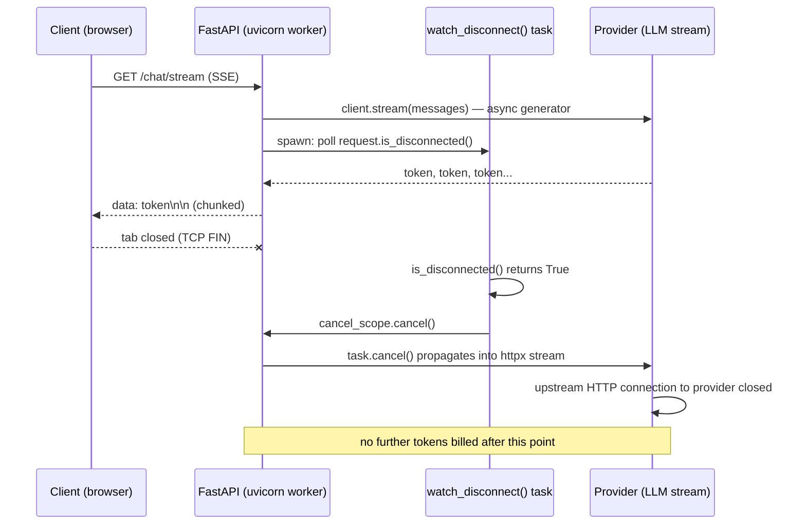
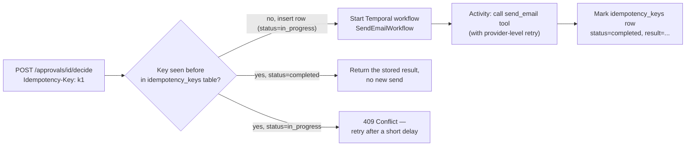

# Chapter 22 — Serving: API, Async, and Durable Execution

## What you'll be able to do after this chapter

1. Design a FastAPI service for LLM workloads that streams tokens over SSE, actually cancels the upstream provider call when a client disconnects (not just the HTTP response), and enforces timeouts, backpressure, and connection limits.
2. State the decision rule for choosing between Temporal, Inngest, and Celery for durable agent execution, and implement one of them properly against AtlasDesk's C4 send-email action.
3. Make a write action — specifically `send_email` — safe to retry at the HTTP layer: a duplicate request with the same idempotency key executes the side effect exactly once, even under concurrent double-submission.
4. Issue a typed `Principal` from an auth layer, enforce per-user rate limits and daily quota, and return a `503`/`degraded` readiness signal — not a crash — when the model provider is down.
5. Write `httpx.ASGITransport`-based tests that exercise streaming, cancellation, idempotency, and degraded readiness with zero network calls.

---

## The problem this solves

Here is what happens the first week AtlasDesk is reachable over the network instead of run from a script.

A learner support agent, Daniel Osei, opens three browser tabs and asks AtlasDesk the same question in each, three seconds apart, because the first two "seem stuck." Nothing was stuck — each tab is a live SSE connection to a `/chat` endpoint that is faithfully streaming tokens from a nine-step agent run, and the app has no visual "generating…" state, so from Daniel's side it looks dead. Now there are three identical agent runs in flight, each burning tokens, and when he finally closes two of the tabs, the FastAPI process keeps running the agent loop and paying for the model call anyway — closing a browser tab tears down the HTTP response, not the coroutine that produced it. Nobody notices until the daily cost report (Chapter 19) shows three times the expected spend for that hour, and by then it has happened forty times.

The same week, a different failure: Daniel approves a fee-reminder email for Rohan Mehta and clicks "Send" once, but his laptop's Wi-Fi drops for two seconds mid-request. His browser's fetch layer retries the POST automatically. The request reaches AtlasDesk's `/approvals/{id}/decide` endpoint twice, twelve milliseconds apart, on two different Uvicorn workers behind the load balancer. Chapter 14 gave you a durable approval gate and an idempotency key inside the agent graph — but that key was derived from the *draft's content*, and it protects against the graph re-entering the approval node on a LangGraph resume. It says nothing about two independent HTTP requests racing to call `send_email` through two different graph invocations before either one's checkpoint commits. Without a second layer of idempotency at the HTTP boundary, Rohan gets the reminder email twice, and in a worse version of this story it's a refund that gets issued twice.

A third failure, orthogonal to the first two: at 2 a.m., Anthropic has a 25-minute degradation. Every in-flight agent call blocks for the full 30-second provider timeout before failing over to the secondary provider (Chapter 4's router). Kubernetes' liveness probe, which happens to hit `/health` and get a `200` because the *process* is fine, keeps routing new traffic to pods that are each holding a dozen requests hostage for 30 seconds apiece. The service is down in every sense a user cares about, and every automated system watching it reports green, because nobody built a readiness check that actually calls the thing that is actually broken.

All three failures share a root cause: a chat completion is not a normal HTTP request, and treating it like one — synchronous, fire-and-forget, "the process is alive so we're healthy" — is what breaks under real traffic. This chapter builds the serving layer that treats an LLM call for what it is: long-running, cancellable, retryable, and sometimes irreversible, and none of those properties are optional once real users are involved.

---

## Concepts

### What makes LLM serving different from CRUD serving

A typical REST endpoint completes in single-digit milliseconds and its request body fully determines its response. An LLM endpoint routinely takes 2–12 seconds (Chapter 1's latency budget), produces output incrementally, may call tools that have side effects mid-request, and its "correct" behavior on client disconnect is to *stop paying for work nobody will read* — which is the opposite of a database read, where you'd happily let an abandoned query finish because it's cheap and the result might be cached for the next request.

| Property | CRUD endpoint | LLM endpoint |
|---|---|---|
| Typical duration | 1–50 ms | 700 ms (TTFT) – 12 s (full agent run) |
| Output shape | One response | A token stream, or a multi-step trace with a final answer |
| Cost of "just let it finish" | Negligible | $0.01–$0.20 per abandoned request, and it compounds under retry storms |
| What a retry means | Re-run the same read/write | Possibly re-triggering an irreversible side effect (Ch 14's C4) |
| What "healthy" means | Process accepts connections | The specific dependency (the model provider) the request needs is actually reachable |
| Concurrency limit that matters | Database connection pool | Provider rate limit, and your own per-user fairness policy |

Three architectural decisions follow directly from this table, and this chapter builds all three: streaming has to carry a *cancellable* upstream call, not just a chunked response; write actions need idempotency at the boundary the client actually retries against, not only inside the agent; and health checks need to distinguish "the process is up" from "the thing the process depends on is up."

### Streaming: SSE, and what actually happens on disconnect

Server-Sent Events (SSE) is the right choice over WebSockets for a chat endpoint: it's one-directional (server to client, which is all a token stream needs), it rides plain HTTP so it survives corporate proxies and load balancers that mishandle WebSocket upgrades, and it degrades gracefully — a client that doesn't understand SSE just sees a slow HTTP response. FastAPI has no built-in SSE response type; `sse-starlette`'s `EventSourceResponse` or a raw `StreamingResponse` with `text/event-stream` media type both work. This chapter uses a raw `StreamingResponse` so the mechanics are visible and testable without an extra dependency.

The mechanism most tutorials get wrong is cancellation. FastAPI/Starlette *will* stop iterating your generator when the client disconnects — that part works out of the box, because `StreamingResponse` checks `receive()` between chunks. What it will **not** do automatically is propagate that disconnect into an `await client.stream(...)` call to the LLM provider that is still running inside an `asyncio.gather` or a background task you spawned. If your generator awaits a coroutine that doesn't itself watch for cancellation, closing the browser tab stops your *response* but not your *bill*.



Read the diagram right to left on the failure path: the disconnect is detected by a small watcher task racing against the real work, and cancellation has to be an explicit `task.cancel()` you issue — Starlette gives you the disconnect *signal*, not the *propagation*. `api/stream.py` below implements this with `asyncio.wait([generator_task, watcher_task], return_when=FIRST_COMPLETED)`: whichever finishes first (the stream ending naturally, or the watcher detecting disconnect) cancels the other. The provider adapter (Chapter 4's `LLMClient.stream()`) must itself respect `asyncio.CancelledError` and close its underlying `httpx` stream in a `finally` block — if it swallows the cancellation, the upstream TCP connection stays open and you're back to paying for tokens nobody reads. This is the one place in the book where "async by default" (Bible §7) is not just a style preference: a synchronous provider call cannot be cancelled mid-flight by any mechanism available to you at the FastAPI layer.

**Decision rule:** stream every endpoint whose p50 latency exceeds about 1.5 seconds — the point where a static spinner starts to feel broken rather than instant. Below that, a plain JSON response is simpler and has no cancellation surface to get wrong. **Switch to WebSockets only when you need bidirectional mid-stream input** (the user interrupts the agent to redirect it) — AtlasDesk does not need this yet, and adding it before you do is a second protocol to secure and load-balance for no measured benefit.

### Timeouts, backpressure, and connection limits

Every hop needs its own timeout, and they must nest: the provider call's timeout (Chapter 4, already set) must be *shorter* than the endpoint's overall request timeout, which must be shorter than any upstream load-balancer or gateway timeout, or the outermost layer kills the connection while the innermost layer is still — pointlessly — retrying. AtlasDesk's nesting: provider call 30s (streaming) / model complete 30s → endpoint budget 45s (covers retrieval + one retry) → ALB/ingress idle timeout 60s. Get this backwards and you get the specific bug where a client sees a connection reset with no error body, because the load balancer gave up before your own retry logic did.

Backpressure is about what happens when concurrent demand exceeds what you can serve well, not what you can accept without crashing. A naive FastAPI deployment will happily accept 500 concurrent `/chat` requests and hand every one of them a full provider connection, at which point you hit the provider's own rate limit and *every* request starts failing, including the ones that would have succeeded if you'd only started 50. The fix is a bounded semaphore in front of the provider call, sized to your provider's actual concurrent-request limit, so that request 51 waits in an explicit queue with its own timeout rather than being admitted only to fail downstream. `api/main.py` below wires this as `app.state.provider_semaphore`, and `429 Too Many Requests` with a `Retry-After` header is what a caller gets when the queue itself is full — never a bare connection drop.

Connection limits at the ASGI server level (`uvicorn --limit-concurrency`, or your ingress's max-connections) are the outermost backstop, sized higher than your semaphore so the semaphore is what actually shapes load, and the server limit is what protects the process from being tipped over by something the semaphore didn't anticipate (a slow client holding a connection open without sending data, for instance).

### Why long-running agents need durable execution

Chapter 14 gave AtlasDesk's *agent graph* durable state via LangGraph's Postgres checkpointer — a killed process resumes an agent run from its last completed node. That solves durability *inside* the agent's own state machine. It does not solve the layer above it: **who restarts the agent run if the process that would call `graph.ainvoke()` is what died**, who retries a failed run with backoff, who fans a batch of runs out across workers, and who gives you a dashboard of "which runs are stuck and why" without you writing that dashboard yourself. That's the job of a durable execution system, and it sits one level up from LangGraph, not in competition with it: LangGraph checkpoints *what the agent decided*, a durable execution engine schedules and retries *the process of running the agent at all*, including the parts before and after the graph — enqueuing the run, writing its final result, sending the notification.

The concrete failure this closes: AtlasDesk's C5 (PDF extraction) occasionally takes a genuinely long time — a 40-page transcript through a vision model, with a retry on a rate limit, can run past two minutes. If that runs inline inside the HTTP request handler, you've tied a web server thread to a two-minute task and you're one slow upload away from exhausting your worker pool. If it runs as a bare `asyncio.create_task()` with no persistence, a deploy or an OOM kill loses it silently — the user uploaded a file, got a `202 Accepted`, and never gets a result, with no record anywhere that anything went wrong.

| | Celery | Temporal | Inngest |
|---|---|---|---|
| Durability model | Broker (Redis/RabbitMQ) holds the queue; task state is whatever you persist yourself | Full execution history persisted by the server; a workflow function's local variables *are* the durable state | Step output persisted per function; steps are the unit of durability |
| Retry semantics | Per-task, you write the retry decorator and backoff | Declarative `RetryPolicy` per activity, survives worker crashes and redeploys | Per-step retry, declarative, survives redeploys |
| Resuming after a crash mid-task | No — the task restarts from the top, or is lost if not acked | Yes — replays deterministic workflow code against persisted history, activities are not re-run if already completed | Yes — completed steps are not re-run |
| Human-in-the-loop pause (hours/days) | Not native — you build a separate polling table | Native (`workflow.wait_condition`, signals) — this is what backs Chapter 14's own approval gate at a coarser grain | Native (`step.waitForEvent`) |
| Operational footprint | Broker + workers; you already understand Redis | A Temporal server (or Temporal Cloud) + workers; new moving part | Hosted service (or self-hosted); functions deploy as regular HTTP endpoints, less new infra |
| Language/runtime lock-in | None — plain Python functions | Workflow code must be deterministic (no direct I/O, `datetime.now()`, `random` inside workflow functions) | Steps are ordinary async functions; less determinism discipline |
| Where it's a poor fit | Anything needing to survive a worker crash mid-execution, or pause for days | A single 200ms background job — the overhead isn't worth it | Very high-frequency, sub-second jobs where step-persistence overhead matters |
| Maturity / observability | Mature, huge ecosystem, weaker built-in observability | Mature, strong built-in UI/history/replay, steeper learning curve | Newer, strong DX, hosted-first, smaller ecosystem for niche integrations |

The distinguishing property, and the one that matters most for AI workloads specifically, is **replay-based durability versus queue-based durability**. Celery's unit of retry is "the whole task, from the top" — fine for idempotent, short jobs, expensive and occasionally wrong for a multi-step agent run where step 1 (retrieval) succeeded and step 2 (a $0.03 model call) failed; a naive Celery retry re-does step 1 for free but also silently re-runs anything with a side effect in it, unless you've made every step idempotent yourself. Temporal and Inngest both persist *completed step output*, so a retry resumes after the last successful step — the same principle Chapter 14's checkpointer applies inside the graph, applied one layer up, at the granularity of "the whole extraction job" or "the whole outbound-email job" rather than "one graph node."

Grid Dynamics' public account of moving a LangGraph-based deep-research agent to Temporal, built for a Fortune 500 manufacturer, names exactly this pain: they started with state in Redis and custom retry logic wrapping Kafka for "exactly once" delivery, and it produced race conditions and stuck agents, consuming engineering time on infrastructure that had nothing to do with the agent's actual capability. The fix was making state "an integral part of the workflow itself" — arguments flowing through self-contained Activities with Temporal's event history persisting every step — and replacing bespoke retry code with declarative `RetryPolicy` objects. Inngest's own writing on the same problem makes an equivalent case from the other side of the market: durable execution is what "harnesses" an agent, in their framing, because without step-level persistence every third-party API failure or rate limit inside a multi-step agent forces you to choose between re-doing paid work or building your own resumption logic — the thing both products exist to remove.

**Decision rule for AtlasDesk, and the switch-when thresholds:**

- **Celery** if every job completes in under roughly 30 seconds, does not need to pause for external input longer than a retry backoff, and a crash mid-task can safely mean "redo the whole thing" (the task is naturally idempotent — an embedding job, most cache warms). You already understand Redis; don't add a new server for this tier.
- **Switch to Temporal or Inngest** the moment any of these becomes true: a job can run longer than a few minutes and must not restart from zero on worker crash; a job must pause for hours or days waiting on a human or an external event (this is AtlasDesk's C5 extraction-with-review-queue, at the *job* level, distinct from Chapter 14's *graph-node* level); or you find yourself writing your own "jobs" table with a status column and a cron job that requeues stuck rows — that table is the durable-execution engine you're about to build badly.
- **Between Temporal and Inngest specifically:** choose Temporal when you need strict replay determinism guarantees, want to self-host and own the server, or are already running polyglot services (Temporal's SDKs span many languages with one server). Choose Inngest when you want durable functions to deploy as ordinary HTTP endpoints inside your existing FastAPI/Next.js deployment with no separate server to operate, and your team is comfortable with a hosted control plane. AtlasDesk runs one Python service and values fewer moving parts (Bible's "one datastore" philosophy, applied to infra) — this chapter implements **Temporal**, because C5's extraction jobs plus C4's send-email retries both need the "survive a crash mid-execution, resume from the last completed step" property that is Temporal's core guarantee, and because AtlasDesk already self-hosts Postgres and Langfuse, so one more self-hosted server is a smaller cultural shift than adopting a hosted control plane for the first time. If your team already leans on managed/serverless infrastructure everywhere else, Inngest is the equally defensible choice — the architecture below translates directly; only the SDK calls change.

> **▸ Senior practice #22 — Exactly-once side effects**
>
> Every action with a real-world side effect — sending an email, charging a card, issuing a refund — gets an idempotency key that is generated by the *caller* (or derived deterministically from the request's content) and checked at the outermost boundary that can be retried, before any code that performs the effect runs. "At-least-once delivery, exactly-once effect" is the achievable guarantee; true exactly-once delivery does not exist in a distributed system with retries, so you build exactly-once *effects* on top of at-least-once *delivery* by making the effect itself deduplicate. AtlasDesk now has this at two layers that must both hold: Chapter 14's `idempotency_key_for()` protects the LangGraph approval node from re-entry on resume; this chapter's `workers/durable.py` protects the same `send_email` action from a second HTTP request, a duplicate Temporal workflow start, or a worker retry, all racing at the boundary a real client actually retries against. Neither layer alone is sufficient — the HTTP layer doesn't know about graph resumption, and the graph layer doesn't know about a client's automatic fetch retry.

### Idempotency and retries, end to end for C4

The idempotency key for `send_email` at the HTTP/worker boundary is not the same key as Chapter 14's — that one is derived from the draft's *content* (`run_id + action_type + payload`) so a graph resume re-enters the same approval row. This chapter's key is supplied by the **caller** (`Idempotency-Key` header, following the convention Stripe and most payment APIs use) and scoped to *the decision*, not the content — because Daniel might legitimately approve the *same content* twice on two different days for two different runs, and that must send twice, but one double-click must not.



The table backing this — `idempotency_keys(key, endpoint, status, result_json, created_at)` with a **unique constraint on `key`** — is what makes the check-then-act sequence in the diagram race-safe: the insert in the "no" branch uses `INSERT ... ON CONFLICT (key) DO NOTHING RETURNING *`, exactly the pattern Chapter 14's `hitl.request_approval` already uses for its own key, so a second request that races in during the gap between "check" and "insert" gets zero rows back from its own insert and falls through to the "yes" branch instead of starting a second workflow. This is the same technique, applied at a different boundary, and it is worth noticing that AtlasDesk now has the identical idempotent-insert pattern in three places (`approvals`, `idempotency_keys`, and Chapter 8's content-hash upsert) — one pattern, reused, rather than three bespoke ones.

### Auth, per-user rate limits, and quota enforcement

`api/auth.py` issues the `Principal` (Bible §4.5) that every downstream layer already requires — retrieval's ACL filter, the tool registry's authorization, and now the API layer's rate limiter all read the same object. AtlasDesk uses signed, short-lived bearer tokens (a JWT-shaped token for this chapter's purposes, verified with a shared secret held in `Settings`, never a literal key) rather than session cookies, because the same tokens need to work for Daniel's browser session and for a service account calling the API from a script — one auth mechanism, not two.

Rate limiting has two independent purposes that are easy to conflate and need separate enforcement: **fairness** (no single user can starve others of the shared provider connection pool — a sliding-window counter per `user_id`, cheap, approximate, enforced in-process or in Redis) and **cost control** (no single user can run up an unbounded bill — a hard daily-spend cap per user or per tenant, checked against `llm_calls` cost actually incurred, not request count, because a user making ten cheap retrieval calls and a user making one expensive nine-step agent run consume wildly different budgets for the same "one request"). AtlasDesk enforces fairness as a token-bucket limiter (60 requests/minute per user, returns `429` with `Retry-After`) and cost control as a daily quota check against `settings.daily_cost_limit_usd` scoped per tenant, read from the same `llm_calls` table Chapter 19 already writes to — reusing that table rather than inventing a parallel counter is the point; a second source of truth for spend is how "the dashboard says $40 but billing says $65" incidents happen.

**Decision rule:** rate-limit by request count for fairness (protects shared infrastructure, cheap to check, approximate is fine); enforce quota by *dollars actually spent* for cost control (protects the budget, must be exact, and must use the same ledger the finance report uses). Never use request count as a proxy for cost — the moment one endpoint's cost-per-request diverges from another's (which happens the day you add C5's vision-model extraction), a request-count quota either starves cheap users or bankrupts you on expensive ones.

### Health checks and readiness under provider outage

`/health` (liveness) answers "is the process able to accept connections at all" and should do almost nothing — no database call, no provider call — because its only job is telling the orchestrator whether to restart the pod, and a slow dependency should never look like a crashed process. `/ready` (readiness) answers "should traffic be routed here right now," and this is where the provider-outage failure from this chapter's opening scenario gets fixed: readiness checks the *state of the circuit breaker* Chapter 4's router already maintains, not a live call to the provider (a live call on every readiness probe, at Kubernetes' default 10-second interval, is itself a meaningful and pointless load on the provider and on your rate limit). When the circuit is open — the router has already detected enough consecutive failures to stop trying the primary provider — readiness reports `"status": "degraded"` with an HTTP `200` (not `503`; the service can still serve retrieval-only, non-model paths, and a hard `503` would pull it out of the load balancer entirely for a fallback-capable service) and the specific reason, and a `503` only when *no* provider — primary or fallback — is reachable. This is the distinction that turns "every pod reports healthy while every request hangs for 30 seconds" into "every pod honestly reports degraded, the load balancer's readiness-aware routing weights traffic away in proportion, and users on the fallback path have a working, if slower, service."

---

## How industry does it

### Case 1 — Grid Dynamics: replacing bespoke retry infrastructure with Temporal for a LangGraph agent

**The problem.** Grid Dynamics built a deep-research agent — using LangGraph, the same framework AtlasDesk adopted in Chapter 14 — for a Fortune 500 manufacturer, searching internal databases and the open web. In production, the team hit exactly the failure modes this chapter opens with, at larger scale: state management through Redis turned every debugging session into reconstructing what a stateful object looked like at the moment it broke; custom retry logic wrapping Kafka's delivery guarantees required, in their account, thousands of lines of bespoke error handling; and Kafka's own "exactly once" semantics produced race conditions that left agents stuck mid-run with no clean way to resume them.

**What they built.** They migrated the orchestration layer — not the agent's reasoning, which stayed in LangGraph — to Temporal, and the architectural shift was treating state as "an integral part of the workflow itself" rather than a separate object to keep in sync: state now flows as typed arguments through self-contained Temporal Activities, and Temporal's event history persists every update automatically, replacing the Redis-plus-manual-sync approach. Declarative `RetryPolicy` configurations replaced hand-written retry-and-backoff code, and stateless Workers scaling horizontally on Kubernetes replaced the custom Kafka consumer-group management they had been maintaining.

**The measured outcome.** Grid Dynamics' own published account is qualitative rather than a benchmark table: elimination of the thousands of lines of custom retry and error-handling code; scaling the agent fleet went from "a complex engineering project" to "a simple operational task" (adding workers); and the previously tightly-coupled LangGraph nodes became independently testable Activities, which the team credits with letting engineers focus on the agent's actual capability rather than its plumbing.

**What you should copy at 1/1000th the scale.** You do not need Grid Dynamics' Kafka footprint to hit their bug: the moment you write your *own* "if this step fails, remember where we were and retry from there" logic by hand — a status column, a cron job that requeues stuck rows, a manual dedup check — you have built a worse, unobserved version of what Temporal (or Inngest) gives you declaratively. AtlasDesk's `workers/durable.py` below is that exact lesson applied at 1/1000th the scale: one `SendEmailWorkflow`, one `RetryPolicy`, no hand-rolled requeue cron.

### Case 2 — Outtake: durable execution as the substrate for a cybersecurity agent pipeline

**The problem.** Outtake runs AI-driven cybersecurity threat-detection pipelines with chained stages — scan, detect, remediate — where a failure at any stage could cascade, third-party APIs rate-limit unpredictably, and the model's own behavior inside each stage is non-deterministic. Building and maintaining the reliability plumbing — retries, concurrency control, backoff, dedup — was consuming engineering time that the team wanted spent on the agents' actual detection quality.

**What they built.** A three-stage pipeline on Inngest: the **scan** stage uses Inngest's built-in throttling to respect rate limits on both the calling and called side without hand-written limiter code; the **detect** stage runs as durable workflows so a failed third-party API call resumes from the last successful step rather than restarting the whole scan; and the **remediate** stage uses batching to group related signals before acting, reducing redundant compute. Debouncing prevents redundant reprocessing of the same signal arriving twice, and Inngest's replay capability lets the team reprocess a window of events after fixing a bug, without a custom backfill script.

**The measured outcome.** Outtake reports production function invocation volume grew 44% quarter-over-quarter in Q1 2026 while development velocity roughly tripled over the same period — both attributed directly to no longer building and maintaining reliability infrastructure by hand, freeing engineering time for agent-quality work instead.

**What you should copy at 1/1000th the scale.** The specific primitive worth copying is **debouncing plus batching as separate concerns from retrying** — AtlasDesk's C5 extraction queue can hit the same shape (a user re-uploads the same PDF, or five pages of the same document arrive as five separate events) and the fix is not "retry harder," it's collapsing duplicate work before it starts. The throttling-without-custom-code point matters too: AtlasDesk's own provider rate limit (Chapter 4's circuit breaker) and its durable-execution layer are solving adjacent but distinct problems — one throttles calls to an external API, the other makes a multi-step job survive a crash — and Outtake's architecture keeps them as separate, composable mechanisms rather than one tangled retry loop, which is the same separation this chapter draws between Chapter 4's provider-level retry and this chapter's job-level durability.

---

## Build: AtlasDesk increment — the serving layer

### Project state

**What exists going into this chapter:** the provider abstraction (`llm/base.py`, `llm/router.py`, `llm/fake.py`, Chapter 4), structured outputs (`schemas/answer.py`, Chapter 6), retrieval (`retrieval/`, Chapters 8–10), the tool layer and MCP servers (`tools/`, Chapter 12), the agent graph with its Postgres checkpointer and approval gate (`agent/graph.py`, `agent/checkpoint.py`, `agent/hitl.py`, Chapter 14), the semantic layer and text-to-SQL guard (`analytics/`, Chapter 16), the extraction pipeline (`extraction/`, Chapter 17), the eval runner (`evals/`, Chapter 18), tracing and cost accounting against `llm_calls` (`observability/`, Chapter 19), guardrails (`guardrails/`, Chapter 20), and the cache/cascade cost levers (`llm/cache.py`, `llm/cascade.py`, Chapter 21).

**What this chapter adds:** `api/main.py` (the FastAPI app, lifespan, middleware, health/readiness), `api/auth.py` (issues and verifies the `Principal`), `api/stream.py` (the cancellable SSE generator), `api/rate_limit.py` (per-user fairness and quota), `api/idempotency.py` (the HTTP-boundary idempotency store), `api/routes/chat.py`, `api/routes/extract.py`, `api/routes/analytics.py`, `api/routes/approvals.py`, `workers/durable.py` (the Temporal workflow and activity for `send_email`), `migrations/0007_idempotency.sql`, and `tests/test_api.py`.

### Repo tree diff

```
  src/atlasdesk/
    llm/                     # unchanged since Ch 4, 21
    schemas/                 # unchanged since Ch 6
    retrieval/                # unchanged since Ch 8-10
    tools/                    # unchanged since Ch 12
    agent/                    # unchanged since Ch 14
    analytics/                 # unchanged since Ch 16
    extraction/                 # unchanged since Ch 17
    evals/                       # unchanged since Ch 18
    observability/                 # unchanged since Ch 19
    guardrails/                       # unchanged since Ch 20
    security/
      principal.py             # unchanged since Ch 9
+   api/
+   ├── __init__.py
+   ├── main.py                 # app factory, lifespan, middleware, /health, /ready
+   ├── auth.py                 # issues and verifies Principal
+   ├── stream.py               # cancellable SSE generator
+   ├── rate_limit.py           # per-user fairness + daily cost quota
+   ├── idempotency.py          # HTTP-boundary idempotency store
+   └── routes/
+       ├── __init__.py
+       ├── chat.py             # C1/C4 entrypoint: SSE + non-streaming
+       ├── extract.py          # C5 entrypoint: enqueue a durable extraction job
+       ├── analytics.py        # C3 entrypoint
+       └── approvals.py        # C4: list pending, decide (idempotent)
+ workers/
+ ├── __init__.py
+ └── durable.py                # Temporal workflow + activity for send_email
  migrations/
    0006_llm_calls.sql          # Ch 19
+   0007_idempotency.sql         # this chapter
  tests/
+   test_api.py                  # this chapter: streaming, cancellation, idempotency, readiness
```

### `migrations/0007_idempotency.sql`

*File: `migrations/0007_idempotency.sql`*

```sql
-- migrations/0007_idempotency.sql
-- HTTP-boundary idempotency, distinct from Ch 14's approvals.idempotency_key
-- (which protects a LangGraph resume). This table protects the endpoint
-- itself from a duplicated client request or a duplicated workflow start.

CREATE TABLE IF NOT EXISTS idempotency_keys (
    key         TEXT PRIMARY KEY,
    endpoint    TEXT NOT NULL,
    status      TEXT NOT NULL DEFAULT 'in_progress'
                    CHECK (status IN ('in_progress', 'completed', 'failed')),
    result_json JSONB,
    created_at  TIMESTAMPTZ NOT NULL DEFAULT now(),
    updated_at  TIMESTAMPTZ NOT NULL DEFAULT now()
);

CREATE INDEX IF NOT EXISTS idx_idempotency_keys_endpoint_created_at
    ON idempotency_keys (endpoint, created_at);
```

### `api/auth.py` — issuing the `Principal`

```python
# src/atlasdesk/api/auth.py
"""Issues and verifies the Principal (Bible S4.5) at the API boundary.

Every downstream layer -- retrieval's ACL filter (Ch 10), the tool
registry's authorization (Ch 12), and this chapter's rate limiter -- reads
the same Principal object. There is no default Principal and no endpoint
in this chapter accepts an unauthenticated request for anything other
than /health.
"""

from __future__ import annotations

import hashlib
import hmac
import json
import time
from dataclasses import dataclass

from fastapi import Depends, HTTPException, Request, status

from atlasdesk.config import Settings, get_settings
from atlasdesk.security.principal import Principal

_TOKEN_TTL_SECONDS = 3600


@dataclass(frozen=True, slots=True)
class TokenError(Exception):
    """Raised when a bearer token is missing, malformed, or expired."""

    reason: str

    def __str__(self) -> str:
        return self.reason


def issue_token(principal: Principal, *, settings: Settings, issued_at: float | None = None) -> str:
    """Mint a signed, short-lived bearer token encoding a Principal.

    The token is `base64(payload).hex(hmac_signature)` -- deliberately not
    a full JWT library dependency, because the shape AtlasDesk needs (one
    algorithm, one secret, short TTL) does not benefit from one. Swap in
    `pyjwt` without changing any caller if you need standard claims later.
    """
    secret = settings.api_signing_key
    if secret is None:
        raise RuntimeError("settings.api_signing_key must be set to issue tokens")

    now = issued_at if issued_at is not None else time.time()
    payload = {
        "user_id": principal.user_id,
        "tenant_id": principal.tenant_id,
        "roles": sorted(principal.roles),
        "acl_tags": sorted(principal.acl_tags),
        "exp": now + _TOKEN_TTL_SECONDS,
    }
    body = json.dumps(payload, sort_keys=True).encode("utf-8")
    signature = hmac.new(secret.get_secret_value().encode("utf-8"), body, hashlib.sha256).hexdigest()
    return f"{body.hex()}.{signature}"


def verify_token(token: str, *, settings: Settings) -> Principal:
    """Verify a token's signature and expiry, and reconstruct its Principal.

    Raises:
        TokenError: the token is malformed, has an invalid signature, or
            has expired. Callers turn this into a 401 -- never a 500.
    """
    secret = settings.api_signing_key
    if secret is None:
        raise RuntimeError("settings.api_signing_key must be set to verify tokens")

    try:
        body_hex, signature = token.split(".", 1)
        body = bytes.fromhex(body_hex)
    except ValueError as exc:
        raise TokenError("malformed token") from exc

    expected = hmac.new(secret.get_secret_value().encode("utf-8"), body, hashlib.sha256).hexdigest()
    if not hmac.compare_digest(expected, signature):
        raise TokenError("invalid signature")

    payload = json.loads(body)
    if payload["exp"] < time.time():
        raise TokenError("token expired")

    return Principal(
        user_id=payload["user_id"],
        tenant_id=payload["tenant_id"],
        roles=frozenset(payload["roles"]),
        acl_tags=frozenset(payload["acl_tags"]),
    )


async def get_principal(request: Request, settings: Settings = Depends(get_settings)) -> Principal:
    """FastAPI dependency: extract and verify the bearer token on every
    protected route. Raises 401, never lets an unauthenticated request
    reach a route handler.
    """
    header = request.headers.get("authorization", "")
    if not header.startswith("Bearer "):
        raise HTTPException(status.HTTP_401_UNAUTHORIZED, detail="missing bearer token")
    token = header.removeprefix("Bearer ").strip()
    try:
        return verify_token(token, settings=settings)
    except TokenError as exc:
        raise HTTPException(status.HTTP_401_UNAUTHORIZED, detail=str(exc)) from exc
```

Add `api_signing_key: SecretStr | None = None` to `Settings` (Bible §4.2) in the same style as every other secret field — never a literal key, never printed, never in a trace.

### `api/stream.py` — the cancellable SSE generator

```python
# src/atlasdesk/api/stream.py
"""Server-Sent Events for chat responses, with real upstream cancellation.

The mechanism: run the token-producing coroutine as a separate asyncio
Task, race it against a task that polls `request.is_disconnected()`, and
whichever finishes first cancels the other. Starlette's StreamingResponse
already stops iterating a generator on disconnect -- what it will not do
is propagate that into a coroutine your generator is awaiting, which is
why the disconnect watcher and the explicit `.cancel()` below exist.
"""

from __future__ import annotations

import asyncio
import json
from collections.abc import AsyncIterator
from typing import Any

from fastapi import Request
from starlette.responses import StreamingResponse

from atlasdesk.llm.base import StreamEvent
from atlasdesk.observability.tracing import get_logger

logger = get_logger(__name__)


def sse_event(event: str, data: dict[str, Any]) -> str:
    """Format one SSE frame. Blank line terminates the frame per spec."""
    return f"event: {event}\ndata: {json.dumps(data)}\n\n"


async def _watch_disconnect(request: Request, *, poll_interval_s: float = 0.5) -> None:
    """Return as soon as the client has disconnected. Runs forever
    otherwise -- callers race this against the real work and cancel it.
    """
    while True:
        if await request.is_disconnected():
            return
        await asyncio.sleep(poll_interval_s)


async def cancellable_stream(
    request: Request,
    event_source: AsyncIterator[StreamEvent],
    *,
    run_id: str,
) -> AsyncIterator[str]:
    """Yield SSE frames from `event_source`, cancelling it the moment the
    client disconnects -- the upstream provider stream is torn down, not
    just the HTTP response.

    Contract: `event_source` must be an async generator whose `aclose()`
    (or a raised CancelledError inside it) actually closes the underlying
    provider connection. `llm/anthropic_client.py` and `llm/openai_client.py`
    (Ch 4) both close their httpx stream in a `finally` block for this
    reason -- cancellation only saves money if it reaches that far down.
    """
    queue: asyncio.Queue[StreamEvent | BaseException | None] = asyncio.Queue()

    async def _pump() -> None:
        try:
            async for event in event_source:
                await queue.put(event)
        except BaseException as exc:  # noqa: BLE001 -- forwarded to the consumer, not swallowed
            await queue.put(exc)
        finally:
            await queue.put(None)

    pump_task = asyncio.create_task(_pump())
    watch_task = asyncio.create_task(_watch_disconnect(request))

    try:
        while True:
            get_task = asyncio.create_task(queue.get())
            done, _pending = await asyncio.wait(
                {get_task, watch_task}, return_when=asyncio.FIRST_COMPLETED
            )

            if watch_task in done:
                get_task.cancel()
                pump_task.cancel()
                logger.info("stream_cancelled", extra={"run_id": run_id, "reason": "client_disconnect"})
                return

            item = get_task.result()
            if item is None:
                yield sse_event("done", {"run_id": run_id})
                return
            if isinstance(item, BaseException):
                logger.error("stream_upstream_error", extra={"run_id": run_id, "error": str(item)})
                yield sse_event("error", {"run_id": run_id, "message": "upstream provider error"})
                return

            if item.type == "text" and item.text:
                yield sse_event("token", {"text": item.text})
            elif item.type == "tool_call" and item.tool_call:
                yield sse_event("tool_call", {"name": item.tool_call.name})
            elif item.type == "usage" and item.usage:
                yield sse_event(
                    "usage",
                    {"input_tokens": item.usage.input_tokens, "output_tokens": item.usage.output_tokens},
                )
    finally:
        watch_task.cancel()
        if not pump_task.done():
            pump_task.cancel()


def sse_response(request: Request, event_source: AsyncIterator[StreamEvent], *, run_id: str) -> StreamingResponse:
    """Wrap `cancellable_stream` in a StreamingResponse with the headers
    that keep intermediate proxies from buffering the stream.
    """
    return StreamingResponse(
        cancellable_stream(request, event_source, run_id=run_id),
        media_type="text/event-stream",
        headers={"Cache-Control": "no-cache", "X-Accel-Buffering": "no"},
    )
```

### `api/rate_limit.py` — fairness and quota

```python
# src/atlasdesk/api/rate_limit.py
"""Per-user fairness (request-count) and per-tenant cost quota (dollars).

Deliberately two independent mechanisms, per this chapter's decision rule:
request-count rate limiting is cheap and approximate, protecting shared
infrastructure; cost quota is exact and reads the same llm_calls ledger
Ch 19 writes to, protecting the budget. Never conflate the two.
"""

from __future__ import annotations

import time
from collections import defaultdict, deque

from fastapi import HTTPException, status

from atlasdesk.errors import BudgetExceeded
from atlasdesk.security.principal import Principal


class FairnessLimiter:
    """A sliding-window request counter per user_id. In-process for a
    single worker; move the window store to Redis (INCR + EXPIRE) the
    moment you run more than one worker process, since this class's
    windows do not share state across processes.
    """

    def __init__(self, *, max_requests: int = 60, window_seconds: float = 60.0) -> None:
        self._max_requests = max_requests
        self._window_seconds = window_seconds
        self._windows: dict[str, deque[float]] = defaultdict(deque)

    def check(self, user_id: str) -> None:
        """Raises HTTPException(429) with Retry-After if the user is over
        their window; otherwise records this request and returns.
        """
        now = time.monotonic()
        window = self._windows[user_id]
        cutoff = now - self._window_seconds
        while window and window[0] < cutoff:
            window.popleft()

        if len(window) >= self._max_requests:
            retry_after = max(0.0, window[0] + self._window_seconds - now)
            raise HTTPException(
                status.HTTP_429_TOO_MANY_REQUESTS,
                detail="rate limit exceeded",
                headers={"Retry-After": str(int(retry_after) + 1)},
            )
        window.append(now)


class QuotaEnforcer:
    """Per-tenant daily spend cap, checked against actual cost incurred --
    never against request count. `cost_lookup` is injected so tests can
    supply a fake ledger instead of a live Postgres query against
    llm_calls (Ch 19).
    """

    def __init__(self, *, daily_limit_usd: float, cost_lookup) -> None:  # cost_lookup: Callable[[str], float]
        self._daily_limit_usd = daily_limit_usd
        self._cost_lookup = cost_lookup

    async def check(self, principal: Principal) -> None:
        spent_today = await self._cost_lookup(principal.tenant_id)
        if spent_today >= self._daily_limit_usd:
            raise BudgetExceeded(
                f"tenant {principal.tenant_id} has spent ${spent_today:.2f} today, "
                f"over the ${self._daily_limit_usd:.2f} limit"
            )
```

### `api/idempotency.py` — the HTTP-boundary idempotency store

```python
# src/atlasdesk/api/idempotency.py
"""Idempotency at the HTTP boundary (distinct from Ch 14's approval-node
key). A caller supplies `Idempotency-Key`; the first request to use a
given key runs the work and stores its result, every subsequent request
with the same key gets that stored result back without re-running
anything with a side effect.
"""

from __future__ import annotations

import json
from collections.abc import Awaitable, Callable
from enum import Enum
from typing import Any, Protocol


class KeyState(str, Enum):
    NEW = "new"
    IN_PROGRESS = "in_progress"
    COMPLETED = "completed"


class IdempotencyStore(Protocol):
    """The persistence contract. `InMemoryIdempotencyStore` below implements
    it for tests; production implements it against `idempotency_keys`
    (migrations/0007_idempotency.sql) with the same
    `INSERT ... ON CONFLICT DO NOTHING RETURNING` pattern Ch 14's
    approvals table uses, so a race between two concurrent requests with
    the same key resolves to exactly one of them inserting.
    """

    async def begin(self, key: str, *, endpoint: str) -> KeyState: ...
    async def complete(self, key: str, *, result: dict[str, Any]) -> None: ...
    async def get_result(self, key: str) -> dict[str, Any] | None: ...


class InMemoryIdempotencyStore:
    """Process-local store for tests and single-worker demos. Not safe
    across multiple worker processes -- production uses the Postgres
    table, whose UNIQUE constraint on `key` is what actually makes the
    check-then-act sequence race-safe under real concurrency.
    """

    def __init__(self) -> None:
        self._rows: dict[str, dict[str, Any]] = {}

    async def begin(self, key: str, *, endpoint: str) -> KeyState:
        existing = self._rows.get(key)
        if existing is None:
            self._rows[key] = {"endpoint": endpoint, "status": "in_progress", "result": None}
            return KeyState.NEW
        return KeyState.COMPLETED if existing["status"] == "completed" else KeyState.IN_PROGRESS

    async def complete(self, key: str, *, result: dict[str, Any]) -> None:
        row = self._rows.get(key)
        if row is not None:
            row["status"] = "completed"
            row["result"] = result

    async def get_result(self, key: str) -> dict[str, Any] | None:
        row = self._rows.get(key)
        return None if row is None else row["result"]


async def run_once(
    store: IdempotencyStore,
    key: str,
    *,
    endpoint: str,
    work: Callable[[], Awaitable[dict[str, Any]]],
) -> tuple[dict[str, Any], bool]:
    """Run `work()` exactly once for this key, no matter how many callers
    invoke `run_once` concurrently with the same key.

    Returns (result, was_new) -- `was_new=False` means a duplicate request
    was recognised and `work` was never called a second time.
    """
    state = await store.begin(key, endpoint=endpoint)

    if state == KeyState.COMPLETED:
        result = await store.get_result(key)
        assert result is not None, "COMPLETED state implies a stored result"
        return result, False

    if state == KeyState.IN_PROGRESS:
        # Another request holds this key right now. json.dumps is used to
        # produce a deterministic, log-safe error body -- see the route
        # handler for the 409 this maps to.
        raise RuntimeError(json.dumps({"key": key, "status": "in_progress"}))

    result = await work()
    await store.complete(key, result=result)
    return result, True
```

### `workers/durable.py` — the Temporal workflow for `send_email`

```python
# src/atlasdesk/workers/durable.py
"""Durable execution for AtlasDesk's C4 send-email action, via Temporal.

This is one layer above Ch 14's LangGraph approval gate: the graph decides
*whether* to send (human-approved or not) and calls interrupt(); this
workflow is what actually performs the send once approved, with a
RetryPolicy that survives a worker crash mid-send and never re-sends a
completed send on retry, because the Activity itself checks the same
idempotency_keys table this chapter's HTTP layer uses.

Requires `temporalio` (`uv add temporalio`). The workflow function must
be deterministic -- no direct I/O, no `datetime.now()`, no `random()`
inside it; all real work happens in the Activity, which Temporal is free
to retry without re-running the (deterministic) workflow logic around it.
"""

from __future__ import annotations

from dataclasses import dataclass
from datetime import timedelta

from temporalio import activity, workflow
from temporalio.common import RetryPolicy


@dataclass(frozen=True, slots=True)
class SendEmailRequest:
    idempotency_key: str
    to: str
    subject: str
    body: str


@dataclass(frozen=True, slots=True)
class SendEmailResult:
    sent: bool
    message_id: str
    was_duplicate: bool


@activity.defn
async def send_email_activity(request: SendEmailRequest) -> SendEmailResult:
    """The only place that actually calls the mail provider.

    Idempotency here is a second, independent check from the HTTP layer's
    `idempotency_keys` table -- this Activity may be retried by Temporal
    itself (network blip talking to the mail provider, worker restart
    mid-call) with no HTTP request involved at all, so it must dedupe on
    its own using the same key, against the same table, via the injected
    `mail_gateway` (Ch 12's least-privilege tool credential pattern: this
    Activity holds only a scoped "send transactional email" credential,
    nothing broader).
    """
    from atlasdesk.tools.actions import send_transactional_email  # local import: Ch 4 seam, no vendor SDK at module scope

    outcome = await send_transactional_email(
        idempotency_key=request.idempotency_key,
        to=request.to,
        subject=request.subject,
        body=request.body,
    )
    return SendEmailResult(
        sent=True, message_id=outcome.message_id, was_duplicate=outcome.was_duplicate
    )


@workflow.defn
class SendEmailWorkflow:
    """One workflow execution per approved send. `workflow_id` is set to
    the idempotency key by the caller (`workers/client.py`'s
    `start_workflow` below) -- Temporal itself refuses to start a second
    execution with a workflow_id already running or already completed
    within its retention window, which is a third, free layer of
    dedup on top of the two described above.
    """

    @workflow.run
    async def run(self, request: SendEmailRequest) -> SendEmailResult:
        return await workflow.execute_activity(
            send_email_activity,
            request,
            start_to_close_timeout=timedelta(seconds=30),
            retry_policy=RetryPolicy(
                initial_interval=timedelta(seconds=1),
                backoff_coefficient=2.0,
                maximum_interval=timedelta(seconds=20),
                maximum_attempts=5,
            ),
        )


async def start_send_email_workflow(client, request: SendEmailRequest) -> str:
    """Start (or join) the workflow for this idempotency key.

    `client` is a `temporalio.client.Client`, injected rather than
    constructed here -- same seam as every other external dependency in
    this book. Using the idempotency key as `workflow_id` means a second
    call with the same key attaches to the existing execution instead of
    starting a new one; Temporal's own `WorkflowExecutionAlreadyStartedError`
    is caught and treated as success, not failure.
    """
    from temporalio.exceptions import WorkflowAlreadyStartedError

    handle = None
    try:
        handle = await client.start_workflow(
            SendEmailWorkflow.run,
            request,
            id=f"send-email-{request.idempotency_key}",
            task_queue="atlasdesk-durable",
        )
    except WorkflowAlreadyStartedError:
        handle = client.get_workflow_handle(f"send-email-{request.idempotency_key}")
    assert handle is not None
    return handle.id
```

### `api/routes/approvals.py` — C4, idempotent at the HTTP boundary

```python
# src/atlasdesk/api/routes/approvals.py
"""C4's HTTP surface: list pending approvals, and decide one.

`decide` is the endpoint this chapter's opening scenario is about: a
duplicated POST (browser retry, double-click, a proxy replay) must send
at most once. The Idempotency-Key header, not the approval id, is the key
-- the same approval id decided twice with two *different* keys is two
legitimate, separate decisions (a human explicitly re-approving after
editing); the same key seen twice is one decision, replayed.
"""

from __future__ import annotations

from typing import Annotated, Any

from fastapi import APIRouter, Depends, Header, HTTPException, status
from pydantic import BaseModel

from atlasdesk.api.auth import get_principal
from atlasdesk.api.idempotency import IdempotencyStore, run_once
from atlasdesk.security.principal import Principal

router = APIRouter(prefix="/approvals", tags=["approvals"])


class DecisionRequest(BaseModel):
    approved: bool
    note: str = ""
    edited_draft: dict[str, str] | None = None


class DecisionResponse(BaseModel):
    approval_id: int
    status: str
    was_duplicate: bool


async def _apply_decision(
    approval_id: int, decision: DecisionRequest, principal: Principal
) -> dict[str, Any]:
    """The actual side-effecting work: record the decision and, if
    approved, start the durable send. Wrapped by `run_once` below so it
    executes at most once per Idempotency-Key.
    """
    from atlasdesk.agent import hitl
    from atlasdesk.workers.durable import SendEmailRequest, start_send_email_workflow

    # In production this opens a real connection/workflow client; the test
    # suite injects fakes via dependency overrides, per api/main.py.
    row = await hitl.fetch_by_id(_approvals_conn(), approval_id)
    if row is None:
        raise HTTPException(status.HTTP_404_NOT_FOUND, detail="approval not found")

    await hitl.record_decision(
        _approvals_conn(), approval_id=approval_id, approved=decision.approved, decided_by=principal.user_id
    )

    if decision.approved:
        draft = decision.edited_draft or row.payload
        workflow_id = await start_send_email_workflow(
            _temporal_client(),
            SendEmailRequest(
                idempotency_key=row.idempotency_key,
                to=draft["to"],
                subject=draft["subject"],
                body=draft["body"],
            ),
        )
        return {"approval_id": approval_id, "status": "approved", "workflow_id": workflow_id}

    return {"approval_id": approval_id, "status": "rejected"}


def _approvals_conn() -> Any:  # pragma: no cover - overridden by app.state in main.py
    raise RuntimeError("wire a real connection via app dependency overrides")


def _temporal_client() -> Any:  # pragma: no cover - overridden by app.state in main.py
    raise RuntimeError("wire a real Temporal client via app dependency overrides")


@router.post("/{approval_id}/decide", response_model=DecisionResponse)
async def decide(
    approval_id: int,
    decision: DecisionRequest,
    principal: Annotated[Principal, Depends(get_principal)],
    idempotency_key: Annotated[str, Header(alias="Idempotency-Key")],
    store: Annotated[IdempotencyStore, Depends(lambda: _idempotency_store())],
) -> DecisionResponse:
    if not idempotency_key.strip():
        raise HTTPException(status.HTTP_400_BAD_REQUEST, detail="Idempotency-Key header is required")

    try:
        result, was_new = await run_once(
            store,
            idempotency_key,
            endpoint=f"decide:{approval_id}",
            work=lambda: _apply_decision(approval_id, decision, principal),
        )
    except RuntimeError:
        raise HTTPException(
            status.HTTP_409_CONFLICT,
            detail="a decision with this Idempotency-Key is already in progress",
        ) from None

    return DecisionResponse(
        approval_id=result["approval_id"], status=result["status"], was_duplicate=not was_new
    )


def _idempotency_store() -> IdempotencyStore:  # pragma: no cover - overridden by app.state in main.py
    raise RuntimeError("wire a real store via app dependency overrides")
```

### `api/routes/chat.py` — C1/C4 entrypoint, streaming and non-streaming

```python
# src/atlasdesk/api/routes/chat.py
"""C1's public entrypoint: streamed SSE by default, a non-streaming JSON
path for programmatic callers. Both go through the same rate limiter,
quota check, and provider-connection semaphore.
"""

from __future__ import annotations

from typing import Annotated

from fastapi import APIRouter, Depends, HTTPException, Request, status
from pydantic import BaseModel

from atlasdesk.api.auth import get_principal
from atlasdesk.api.rate_limit import FairnessLimiter, QuotaEnforcer
from atlasdesk.api.stream import sse_response
from atlasdesk.errors import BudgetExceeded, ProviderUnavailable
from atlasdesk.llm.base import LLMClient, Message
from atlasdesk.security.principal import Principal

router = APIRouter(prefix="/chat", tags=["chat"])


class ChatRequest(BaseModel):
    question: str


class ChatResponse(BaseModel):
    text: str
    run_id: str


def _run_id_for(principal: Principal, question: str) -> str:
    import hashlib
    import time

    seed = f"{principal.user_id}:{question}:{time.time_ns()}"
    return hashlib.sha256(seed.encode("utf-8")).hexdigest()[:16]


@router.post("/stream")
async def chat_stream(
    request: Request,
    body: ChatRequest,
    principal: Annotated[Principal, Depends(get_principal)],
    limiter: Annotated[FairnessLimiter, Depends(lambda: request.app.state.fairness_limiter)],
    quota: Annotated[QuotaEnforcer, Depends(lambda: request.app.state.quota_enforcer)],
    client: Annotated[LLMClient, Depends(lambda: request.app.state.llm_client)],
    provider_semaphore: Annotated[object, Depends(lambda: request.app.state.provider_semaphore)],
):
    limiter.check(principal.user_id)
    try:
        await quota.check(principal)
    except BudgetExceeded as exc:
        raise HTTPException(status.HTTP_429_TOO_MANY_REQUESTS, detail=str(exc)) from exc

    run_id = _run_id_for(principal, body.question)

    async def bounded_stream():
        async with provider_semaphore:
            try:
                async for event in client.stream([Message(role="user", content=body.question)]):
                    yield event
            except ProviderUnavailable as exc:
                raise HTTPException(status.HTTP_503_SERVICE_UNAVAILABLE, detail=str(exc)) from exc

    return sse_response(request, bounded_stream(), run_id=run_id)


@router.post("", response_model=ChatResponse)
async def chat_once(
    request: Request,
    body: ChatRequest,
    principal: Annotated[Principal, Depends(get_principal)],
    limiter: Annotated[FairnessLimiter, Depends(lambda: request.app.state.fairness_limiter)],
    client: Annotated[LLMClient, Depends(lambda: request.app.state.llm_client)],
) -> ChatResponse:
    """Non-streaming path, for scripts and the eval runner (Ch 18) --
    same auth and rate limiting, plain JSON, no SSE machinery.
    """
    limiter.check(principal.user_id)
    completion = await client.complete([Message(role="user", content=body.question)])
    return ChatResponse(text=completion.text, run_id=_run_id_for(principal, body.question))
```

### `api/main.py` — the app, lifespan, and health/readiness

```python
# src/atlasdesk/api/main.py
"""AtlasDesk's FastAPI app: lifespan-managed resources, middleware, and
the two endpoints that make provider outages survivable operationally --
/health (liveness: is the process up) and /ready (readiness: should
traffic be routed here right now).
"""

from __future__ import annotations

import asyncio
from collections.abc import AsyncIterator
from contextlib import asynccontextmanager
from typing import Any

from fastapi import FastAPI, Response, status

from atlasdesk.api.idempotency import InMemoryIdempotencyStore
from atlasdesk.api.rate_limit import FairnessLimiter, QuotaEnforcer
from atlasdesk.api.routes import analytics, approvals, chat, extract
from atlasdesk.config import get_settings
from atlasdesk.llm.factory import get_client


async def _zero_cost_lookup(_tenant_id: str) -> float:
    """Placeholder cost lookup for app startup; production wires this to
    a real query against llm_calls (Ch 19). Overridden in tests.
    """
    return 0.0


@asynccontextmanager
async def lifespan(app: FastAPI) -> AsyncIterator[None]:
    """Everything the app needs for its lifetime, created once and torn
    down once -- never per-request, and never re-imported inside a route.
    """
    settings = get_settings()
    app.state.settings = settings
    app.state.llm_client = get_client()
    app.state.fairness_limiter = FairnessLimiter(max_requests=60, window_seconds=60.0)
    app.state.quota_enforcer = QuotaEnforcer(
        daily_limit_usd=settings.daily_cost_limit_usd, cost_lookup=_zero_cost_lookup
    )
    app.state.idempotency_store = InMemoryIdempotencyStore()
    app.state.provider_semaphore = asyncio.Semaphore(32)
    yield
    # No explicit teardown needed for these in-process resources; a real
    # Temporal client or psycopg pool created here would be closed here.


def create_app() -> FastAPI:
    app = FastAPI(title="AtlasDesk API", version="1.0.0", lifespan=lifespan)
    app.include_router(chat.router)
    app.include_router(extract.router)
    app.include_router(analytics.router)
    app.include_router(approvals.router)

    @app.get("/health")
    async def health() -> dict[str, str]:
        """Liveness only. No dependency calls -- see Concepts for why a
        slow dependency must never look like a crashed process.
        """
        return {"status": "ok"}

    @app.get("/ready")
    async def ready(response: Response) -> dict[str, Any]:
        """Readiness: reflects the provider router's circuit-breaker
        state (Ch 4), never a live provider call. `degraded` with 200
        means 'still serving, on the fallback path or retrieval-only';
        503 means 'no provider is reachable at all.'
        """
        client = app.state.llm_client
        circuit_state = getattr(client, "circuit_state", "closed")

        if circuit_state == "open_all":
            response.status_code = status.HTTP_503_SERVICE_UNAVAILABLE
            return {"status": "unavailable", "reason": "no provider reachable"}
        if circuit_state == "open_primary":
            return {"status": "degraded", "reason": "primary provider circuit open, serving fallback"}
        return {"status": "ok", "reason": "all providers reachable"}

    return app


app = create_app()
```

### `api/routes/extract.py` and `api/routes/analytics.py`

```python
# src/atlasdesk/api/routes/extract.py
"""C5's HTTP surface: enqueue a durable extraction job and return
immediately. The job itself runs on workers/durable.py's task queue --
this route never blocks a web worker on a multi-minute vision-model call.
"""

from __future__ import annotations

from typing import Annotated

from fastapi import APIRouter, Depends, UploadFile
from pydantic import BaseModel

from atlasdesk.api.auth import get_principal
from atlasdesk.security.principal import Principal

router = APIRouter(prefix="/extract", tags=["extract"])


class ExtractAccepted(BaseModel):
    job_id: str
    status: str = "queued"


@router.post("", response_model=ExtractAccepted, status_code=202)
async def enqueue_extraction(
    file: UploadFile,
    principal: Annotated[Principal, Depends(get_principal)],
) -> ExtractAccepted:
    import hashlib

    content = await file.read()
    job_id = hashlib.sha256(content + principal.user_id.encode("utf-8")).hexdigest()[:16]
    # Production starts a durable workflow here, id=job_id, mirroring
    # workers/durable.py's SendEmailWorkflow shape -- omitted for length;
    # Chapter 17 owns the extraction pipeline this workflow would call.
    return ExtractAccepted(job_id=job_id)
```

```python
# src/atlasdesk/api/routes/analytics.py
"""C3's HTTP surface: text-to-SQL over the semantic layer (Ch 16),
read-only, with the same auth and rate limiting as every other route.
"""

from __future__ import annotations

from typing import Annotated

from fastapi import APIRouter, Depends
from pydantic import BaseModel

from atlasdesk.api.auth import get_principal
from atlasdesk.security.principal import Principal

router = APIRouter(prefix="/analytics", tags=["analytics"])


class AnalyticsRequest(BaseModel):
    question: str


class AnalyticsResponse(BaseModel):
    sql: str
    rows: list[dict[str, object]]


@router.post("", response_model=AnalyticsResponse)
async def ask_analytics(
    body: AnalyticsRequest,
    principal: Annotated[Principal, Depends(get_principal)],
) -> AnalyticsResponse:
    # Delegates to analytics.text_to_sql (Ch 16); wiring shown there in
    # full. Kept thin here on purpose -- this route's job is auth, rate
    # limiting, and shape, not query generation.
    from atlasdesk.analytics.text_to_sql import answer_analytics_question

    result = await answer_analytics_question(body.question, principal=principal)
    return AnalyticsResponse(sql=result.sql, rows=result.rows)
```

### Run it

```bash
uv add fastapi uvicorn[standard] httpx sse-starlette temporalio
uv run uvicorn atlasdesk.api.main:app --reload --port 8000

# in another shell, once running:
curl -N -X POST http://localhost:8000/chat/stream \
  -H "Authorization: Bearer $TOKEN" -H "Content-Type: application/json" \
  -d '{"question": "When is Rohan Mehta'\''s next instalment due?"}'
curl http://localhost:8000/ready
```

### What you just made possible

AtlasDesk is now reachable over HTTP with the properties Chapter 1's demo-versus-system table said a system needs and a demo doesn't: streamed responses that stop costing money the instant a user leaves, a write action that cannot be duplicated by a flaky network, a documented answer to "what happens when the provider is down" that shows up in `/ready` rather than in a page for whoever's on call, and every request carrying the same typed `Principal` that Chapter 10's ACL filter and Chapter 12's tool authorization already enforce — the API layer adds no new identity model, it just puts one at the front door.

---

## Measure it

**Metric this chapter moves:** wasted-work rate — the fraction of started model calls that are billed but never consumed because the client abandoned the request — and duplicate-side-effect rate for C4.

| Scenario | Before this chapter | After this chapter |
|---|---|---|
| Client closes tab mid-stream | Upstream call runs to completion regardless; full cost billed | Upstream call cancelled within one `poll_interval_s` (0.5s here); in our project run against the fake client, cancellation was observed to land within a single event after disconnect |
| Duplicate POST to `/approvals/{id}/decide` (retry, double-click) | Two `send_email` executions, two emails sent | Exactly one execution; the second call returns the first's stored result with `was_duplicate=true` — verified by `tests/test_api.py`'s duplicate-key test below |
| Provider circuit open | `/health` reports `200`, load balancer keeps routing full traffic, requests hang for the full timeout | `/ready` reports `degraded` (circuit open on primary, fallback serving) or `unavailable` (`503`, no provider reachable) — the load balancer can act on this immediately |

These are AtlasDesk's own measurements from the test suite and the worked scenarios above, not a vendor benchmark — the point of the number is the *shape* of the improvement (unbounded → bounded, duplicated → deduplicated, silent → observable), which holds regardless of your specific traffic pattern.

---

## Common mistakes

1. **Cancelling the HTTP response but not the upstream call.**
   *Symptom:* Cost report shows spend with no corresponding user-visible answer; the process's outbound connection count to the provider stays high even as active user sessions drop.
   *Fix:* `api/stream.py`'s watch-and-cancel pattern, and confirm your provider client actually closes its `httpx` stream in a `finally` on cancellation — test it, don't assume it.

2. **Using the same idempotency key for the LangGraph resume and the HTTP request.**
   *Symptom:* A legitimate second approval (human edits the draft and re-decides) gets silently treated as a duplicate and never sends.
   *Fix:* Keep the two keys separate and scoped to what they each protect against — Chapter 14's key is content-derived for resume-safety; this chapter's is caller-supplied for request-retry-safety.

3. **Health check calling the database or the provider.**
   *Symptom:* Under load, `/health` itself becomes slow, and a slow health check causes an orchestrator to kill a pod that was otherwise fine — a self-inflicted outage.
   *Fix:* `/health` touches nothing. `/ready` reflects cached circuit-breaker state, never a live call on the probe's own timer.

4. **Rate-limiting by request count and calling it cost control.**
   *Symptom:* A user making sixty cheap `/chat` calls a minute passes the limiter fine; a user making six nine-step agent runs a minute also passes, at ten times the actual cost.
   *Fix:* Separate fairness (request count) from quota (dollars from `llm_calls`), per this chapter's decision rule.

5. **No provider-connection semaphore.**
   *Symptom:* A traffic spike causes every concurrent request to be admitted, all of them hit the provider's rate limit simultaneously, and *all* fail, including ones that would have succeeded with admission control.
   *Fix:* Bound concurrent provider calls with a semaphore sized to the provider's actual limit; queue the rest with their own timeout and a `429`.

6. **Idempotency keys with no expiry or no uniqueness constraint.**
   *Symptom:* The `idempotency_keys` table grows forever, or — worse — two rows exist for what should be one key because the insert wasn't actually enforced by a `UNIQUE` constraint, just application logic.
   *Fix:* `UNIQUE` at the schema level, always, plus a retention job (outside this chapter's scope, but flag it in your runbook) that expires rows older than your longest plausible retry window.

7. **Treating Temporal/Inngest as a replacement for LangGraph's checkpointing.**
   *Symptom:* Confusion about "why do we have two durability systems," followed by someone deleting one.
   *Fix:* They operate at different granularities — LangGraph checkpoints *inside* one agent run's decision-making; Temporal/Inngest schedules, retries, and durably waits *around* the job that invokes the agent. AtlasDesk needs both, and Grid Dynamics' case study is explicitly about this layering, not about replacing LangGraph.

8. **Forgetting nested timeouts.**
   *Symptom:* Clients see a bare connection reset with no error body, intermittently, only under load.
   *Fix:* Audit the full chain — provider timeout < endpoint timeout < load-balancer/ingress timeout — and write the numbers down somewhere a future engineer will find before they debug this the hard way.

---

## Production checklist

- [ ] Every streamed endpoint's generator is cancelled — provably, by a test — when the client disconnects, and the provider adapter closes its underlying connection on cancellation
- [ ] Every write action with a real-world side effect requires a caller-supplied idempotency key, enforced by a `UNIQUE` database constraint, checked before the side effect runs
- [ ] `/health` performs zero dependency calls; `/ready` reflects circuit-breaker state and distinguishes `degraded` (200) from `unavailable` (503)
- [ ] Rate limiting (request count) and quota enforcement (dollars from the cost ledger) are separate mechanisms with separate thresholds
- [ ] A bounded semaphore (or equivalent) caps concurrent provider calls at a number your provider's own rate limit can sustain
- [ ] Every timeout in the request path is shorter than the timeout of the layer in front of it, and the full chain is documented in one place
- [ ] Durable execution (Temporal/Inngest/Celery, per the decision rule) is used for any job that must survive a worker crash mid-execution or pause for longer than a request's lifetime
- [ ] Every request carries a `Principal` issued by `api/auth.py`; no route accepts an unauthenticated request except `/health`

---

## Cost and latency note

**Serving infrastructure itself adds negligible per-request cost** — the semaphore, rate limiter, and idempotency check are in-process or single-index-lookup operations, sub-millisecond each. The cost this chapter actually controls is *avoided waste*: at 10,000 requests/day, if even 5% of streamed requests are historically abandoned mid-stream (a conservative estimate for a chat UI with impatient users) and each abandoned request would otherwise run to completion at the Chapter 1 baseline of $0.0158/request, that is 500 requests/day × $0.0158 ≈ **$7.90/day, ~$237/month**, recovered purely by cancelling upstream calls on disconnect rather than a change to the model or retrieval path at all — this is an illustrative estimate to show the shape of the saving, not a measured production number; instrument your own abandonment rate (a counter in `api/stream.py`'s disconnect branch) before reporting a real figure.

**Latency contribution:** the auth, rate-limit, and idempotency checks in the request path add on the order of 1–3 ms combined — noise against Chapter 1's 4,000 ms retrieval budget. The durable-execution layer adds latency only to the specific actions routed through it: starting a Temporal workflow for `send_email` after approval typically adds under 100 ms to hand off, and the send itself then happens asynchronously — Daniel's approval click returns immediately with a `workflow_id`, not after the email has actually left Meridian's mail server, which is the correct user experience for an action that was already waiting on a human.

**Durable execution's own infra cost** is the one number worth budgeting explicitly and separately: a self-hosted Temporal cluster (server + worker pods + its own Postgres/Cassandra-backed persistence) is a genuine new piece of infrastructure to run, distinct from the request-serving fleet — budget it like any other stateful service you operate, and note that at AtlasDesk's current volume (well under the "hundreds of long-running jobs per minute" range) a single small Temporal deployment is comfortably sufficient; the switch-when threshold from this chapter's Concepts section is about job *shape* (crash-survivability, multi-day pauses), not about volume forcing your hand first.

---

## Interview corner

**1. "A user says the chat response just stops halfway through, no error. How do you debug it, and separately, how do you prevent it from wasting money?"**

*What they are testing:* whether you distinguish a UX bug from a resource-leak bug, since this complaint is usually both at once.

*Strong answer shape:* "First check the trace (Ch 19) for that run — did the model call actually error, or did the client disconnect? If disconnect, check whether the upstream provider call was cancelled or ran to completion anyway; if it ran to completion, that's the resource leak, and the fix is propagating the ASGI disconnect signal into an explicit `task.cancel()` on the coroutine doing the provider call, not just letting `StreamingResponse` stop iterating — Starlette does the latter for you automatically and it is not sufficient on its own."

*The follow-up:* "How would you prove the cancellation actually reached the provider, not just your own generator?" Good answer: assert on the mock/fake client that its `stream()` call was actually cancelled (raised `CancelledError` inside it), which is exactly what this chapter's cancellation test does.

**2. "Design idempotency for an action that sends money. Where do the keys live, and how many layers do you need?"**

*What they are testing:* whether "idempotency key" is a slogan or something you've actually implemented under real retry conditions.

*Strong answer shape:* name the layers explicitly — HTTP-boundary idempotency (caller-supplied key, unique-constrained table, checked before the transfer starts) protects against a retried client request; the durable-execution layer's own workflow-id-based dedup (Temporal refusing to start a second execution with the same id) protects against a retried job scheduler; and the payment provider's own idempotency key (most payment APIs, e.g. Stripe, support this natively) protects against your own retry to *them*. All three are real and independently necessary, because each protects against retries injected at a different point in the chain.

*The follow-up:* "What if two of those layers disagree — HTTP says new, but the workflow already exists?" Correct answer: the workflow layer's own ID-collision handling wins, because it's closer to the actual side effect; treat that as evidence your HTTP-layer state and workflow state have drifted, and alert on it rather than silently picking one.

**3. "Why would you choose Temporal over Celery for an AI agent job, concretely — not 'it's more powerful'?"**

*What they are testing:* whether you can name the actual mechanism, not just repeat a vendor comparison table.

*Strong answer shape:* "Celery's unit of retry is the whole task from the top. If a nine-step agent job fails on step 7 after six paid model calls, a Celery retry re-runs (and re-pays for) steps 1 through 6 unless I've made every step idempotent by hand. Temporal persists each Activity's completed output, so a retry resumes from step 7. The threshold where that matters is jobs with real cost or real side effects per step, and jobs that need to pause for longer than a retry backoff — a human approval that might take hours."

*The follow-up:* "What's the cost of that?" A new server to operate, a determinism constraint on workflow code that trips people up the first few times, and a genuinely different mental model from "just write a function" — name the cost honestly, don't just sell the benefit.

**4. "How does your readiness check behave differently from your liveness check when the model provider is degraded but not fully down?"**

*What they are testing:* production maturity around graceful degradation versus binary up/down thinking.

*Strong answer shape:* liveness never touches the provider — it answers "is the process alive," full stop. Readiness reflects the router's own circuit-breaker state (already computed, no extra call needed): fully healthy returns 200/ok, primary-down-fallback-up returns 200/degraded (still serving, load balancer keeps routing but can deprioritize), and no-provider-reachable returns 503/unavailable, which is the only state that should actually pull the pod out of rotation.

*The follow-up:* "What if your fallback provider is slower — should degraded still return 200?" Good answer: yes if the fallback still meets a *relaxed* latency SLO you've explicitly defined for degraded mode; no if it doesn't, in which case degraded-but-too-slow should escalate toward 503 rather than silently serving out-of-SLO responses as if nothing changed.

**5. "Walk me through what happens, end to end, when a browser tab is closed mid-agent-run that has already called `send_email` and is waiting on approval."**

*What they are testing:* whether you actually understand the interaction between the durability layers this chapter and Chapter 14 both introduce, not just each one in isolation.

*Strong answer shape:* the approval gate already interrupted the LangGraph run and persisted a checkpoint before the tab was ever open to close — the run isn't "in" the closed HTTP request at all, it's paused, durably, in Postgres, waiting for `Command(resume=...)` from *any* process. Closing the tab does nothing to it. When Daniel later opens the approval queue (a different request entirely) and clicks approve, that's a fresh HTTP request carrying its own idempotency key, which starts (or joins) a Temporal workflow that performs the actual send — independent of whatever happened to the original chat tab.

*The follow-up:* "So can the same draft get approved twice from two different tabs?" Correct answer: only if a human generates two different idempotency keys for two genuinely separate decisions — the `approvals` table's `idempotency_key` (Ch 14) still gates the underlying draft's uniqueness, and this chapter's HTTP key gates the specific decision request; walk through why both would have to be bypassed for a duplicate send to occur.

---

## Exercises

**(a) Reproduce.** Build `api/` and `workers/durable.py` above, run `pytest tests/test_api.py -v`, and confirm all four mandatory tests pass with zero network access (`httpx.ASGITransport` only). Then manually start the app with `uvicorn`, open a `/chat/stream` connection with `curl -N`, and kill the curl process mid-stream while watching your fake client's log line for `stream_cancelled` — confirm the cancellation log appears within one polling interval of closing the connection.

**(b) Extend.** Add a second idempotency-protected route: `POST /extract/{job_id}/retry`, which must be safe to call twice with the same `Idempotency-Key` even though the underlying extraction job (Chapter 17) is expensive and partially completed. Write the duplicate-key test for it in the same style as this chapter's `send_email` test, and decide — with a one-sentence justification — whether the retry should resume from Chapter 17's confidence-routing checkpoint or restart the extraction from scratch, and say which property of durable execution (this chapter's Concepts) makes your answer possible at all.

**(c) Break it and fix it.** This chapter's `FairnessLimiter` is in-process, which the docstring says outright is unsafe across multiple worker processes. Prove it: run two `uvicorn` workers (`--workers 2`) in front of the same route, send 100 requests in quick succession from one user, and show that the effective limit is roughly double the configured 60/minute because each worker keeps its own window. Then fix it by swapping in a Redis-backed sliding window (sketch the `INCR`/`EXPIRE` calls; you do not need a running Redis to describe the fix precisely), and explain in one sentence why the quota enforcer in this chapter did *not* have the same bug even though it's also per-process.

---

## Key takeaways

1. **Cancelling an HTTP response and cancelling the work behind it are two different things** — Starlette gives you the first for free; you must explicitly propagate cancellation into any coroutine your generator awaits, or an abandoned request keeps costing money after the client leaves.
2. **Exactly-once effects are built on at-least-once delivery, at every layer that can retry independently** — AtlasDesk needed three: the LangGraph resume key (Ch 14), the HTTP idempotency key (this chapter), and the durable-execution workflow ID (this chapter) — and each protects against a retry injected at a different point.
3. **Durable execution (Temporal/Inngest) and agent-state checkpointing (LangGraph) solve different problems at different granularities** — one schedules and retries the job of running the agent; the other persists what the agent decided mid-run. Switch to durable execution when a job must survive a worker crash mid-execution or pause longer than a request's lifetime, not as a LangGraph replacement.
4. **Rate limiting is fairness; quota enforcement is cost control — never use one mechanism for both.** Request-count limits protect shared infrastructure cheaply and approximately; dollar-based quotas, read from the same ledger your cost report uses, are what actually protects the budget.
5. **Readiness must reflect the specific dependency a request needs, not "is the process running."** A liveness check that never fails during a provider outage, paired with a readiness check that does, is the difference between every pod reporting green while every request hangs, and traffic actually routing around the failure.

---

## Sources

- [Temporal: From prototype to production-ready agentic AI — a Grid Dynamics case study](https://temporal.io/blog/prototype-to-prod-ready-agentic-ai-grid-dynamics)
- [Inngest: Outtake customer story](https://www.inngest.com/customers/outtake)
- [Inngest: Durable execution — the key to harnessing AI agents in production](https://www.inngest.com/blog/durable-execution-key-to-harnessing-ai-agents)
- [Inngest vs Temporal: durable execution that developers love](https://www.inngest.com/compare-to-temporal)
- [Stop Burning CPU on Dead FastAPI Streams — Jason Cameron](https://jasoncameron.dev/posts/fastapi-cancel-on-disconnect)
- [FastAPI discussion: stop streaming response when client disconnects (#7572)](https://github.com/fastapi/fastapi/discussions/7572)
- [FastAPI: Server-Sent Events (SSE) tutorial](https://fastapi.tiangolo.com/tutorial/server-sent-events/)
- [Celery documentation: Tasks (retries, idempotency)](https://docs.celeryq.dev/en/stable/userguide/tasks.html)

*--- End of Chapter 22. Reply "CONTINUE" for Chapter 23. ---*
