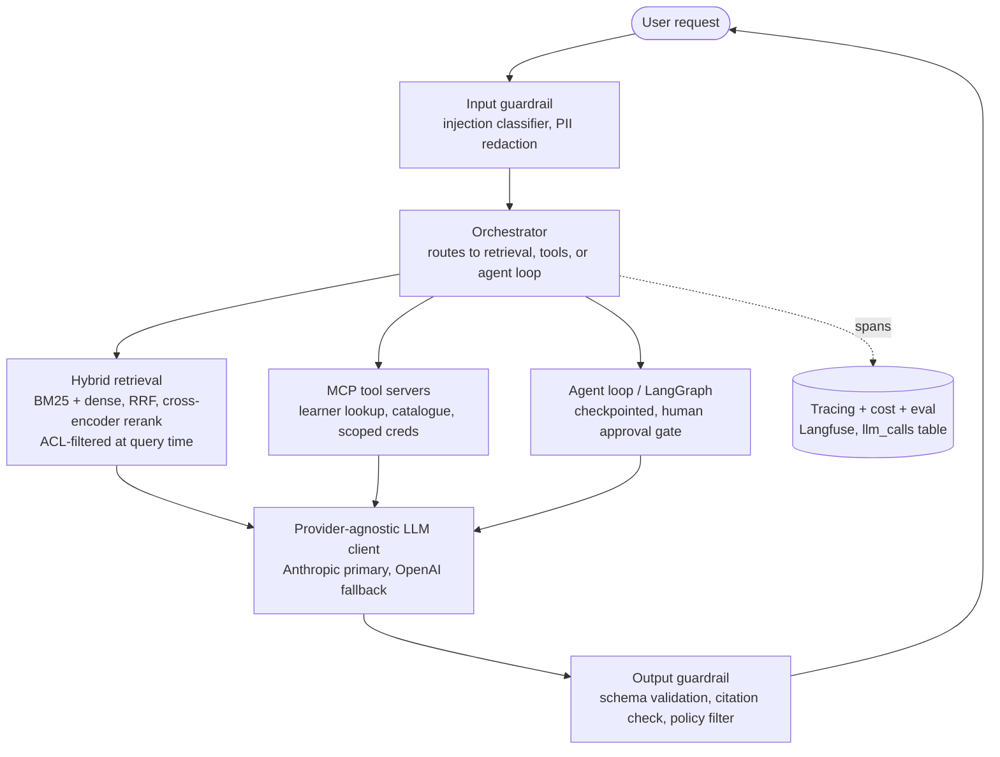

# Chapter 25 — Portfolio, Interviews, and the High-Paying-Job Playbook

## What you'll be able to do after this chapter

1. Answer the five interview questions senior AI hiring loops actually ask — with the strong version of the answer, not the generic one — using AtlasDesk's real numbers as evidence.
2. Run the AI system-design whiteboard sequence as an ordered procedure, on any prompt, and survive the three follow-ups interviewers use to separate tutorial-depth from production-depth.
3. Complete a four-hour take-home in a way that signals production maturity, by deciding in the first ten minutes what to build, what to stub, and what to write down instead of coding.
4. Package AtlasDesk as a portfolio artifact — README, architecture diagram, eval report, live demo, and a written trade-off log — that a skeptical senior engineer can verify in under fifteen minutes.
5. Write resume lines that survive a technical screener's scrutiny, and recognize the lines that get an application auto-discarded by a reviewer who has read a thousand of them.
6. Place your own compensation ask against current, sourced bands by role and region, and decide when to negotiate and when to walk.

---

## The problem this solves

You have finished this book's project. AtlasDesk works. It has hybrid retrieval, an agent loop with human approval gates, a semantic layer, a 120-case eval set, tracing, guardrails, and a CI pipeline that blocks a merge on regression. You are, by any reasonable measure, more production-ready than the median team shipping AI systems in 2026. Then you apply for a job, and here is what actually happens:

- Your resume says "Built an AI agent using RAG and LangGraph." A reviewer who has read four hundred resumes that say almost exactly that skims past it in six seconds. It is indistinguishable from a weekend tutorial.
- You get a screen. The interviewer asks: *"Show me your eval set."* You say "we tested it manually and it seemed good." The call ends twelve minutes early.
- You get a system-design round. You draw a clean retrieval pipeline — chunk, embed, retrieve, generate — and explain cosine similarity without stumbling. The interviewer nods, then asks what happens when the retriever pulls back a document that flatly contradicts what the user meant, or a document from another tenant. You did not think about that on the whiteboard, because in your project it was already solved in code three chapters ago, and you forgot it was supposed to be part of the *answer*, not just the *implementation*.
- You get a take-home. You spend three of your four hours on a slick chat UI and the fourth on the actual retrieval logic. The reviewer's rubric has almost nothing to do with the UI.
- An offer arrives. You do not know whether ₹42 LPA is a good number for four years of experience in your city, or whether $230K total comp is below-band for a senior applied role in a major US market, because you never looked at current data — you anchored on a friend's outdated number from two years ago.

None of these failures are about capability. You built the system. The problem this chapter solves is *translation*: turning a working system into evidence a stranger can verify in fifteen minutes, and turning your own preparation into answers that match what senior interviewers are actually listening for. This is also this chapter's honest deviation from the template: **the Build section of this chapter is not a new module of AtlasDesk — it is the packaging of everything the last 24 chapters built, into the form a hiring loop actually reads.** State that once, here, and move on.

---

## Concepts

### What "senior" actually means in an interview loop

A junior interviewer asks whether you know the right words: RAG, agent, embedding, reranker. A senior interviewer already assumes you know the words and is listening for whether you have *paid a cost* for the knowledge — whether you have been burned by the failure mode you are describing. The tell is specificity. "We use reranking to improve retrieval quality" is vocabulary. "We reranked top-50 to top-6 with a cross-encoder because pure cosine similarity was pulling policy sections that matched on wording but not intent, and it moved our C1 groundedness score measurably" is a scar, and scars are what get hired.

This section is organized around the five questions the brief for this chapter names, because in aggregate they are the highest-frequency senior-round probes in AI engineering interviews in 2026, and because AtlasDesk already has real answers to every one of them — you do not need to invent anything, only retrieve it.

### "Show me your eval set"

**What they are testing.** Whether an eval set exists at all (a large fraction of candidates have none), and if it does, whether it is real — built from real failure modes, version-controlled, and used to gate changes — or performative, a handful of happy-path questions written the night before the interview to have something to show.

**The strong answer, using AtlasDesk's actual artifact.**

> "`evals/datasets/atlasdesk_v1.jsonl` — 120 cases, one JSON object per line, stratified across our seven capabilities and three difficulty tiers, sampled by capability floor and difficulty rather than by raw ticket volume so the rare, high-blast-radius cases aren't drowned out by routine ones. Each case has an input, an expected outcome — either machine-checkable assertions like `must_contain` and `must_cite`, or a rubric for judge scoring when the correctness condition genuinely can't be reduced to a string match — a principal object so ACL cases are testable, and tags. It started as 20 cases in Chapter 3, before any retrieval code existed, and grew from real tickets and from failures we promoted out of production traces. We never edit a case to match current behavior — if the system is wrong, we fix the system, not the test."

The follow-up they use to test depth: *"How did you decide the 120 were the right 120?"* Answer with the sampling procedure — floor per capability, over-sample the hard tier, and a documented changelog for every case that was later corrected, with the reason.

### "How do you know it got better?"

**What they are testing.** This is the single highest-signal question in the field, because most candidates answer it with a vibe ("it feels more accurate now") and a senior interviewer has heard that a thousand times.

**The strong answer.**

> "Every change runs against the 120-case set, three times, because a single run is not a result — in our own project, three identical runs of the same prompt against the same dataset produced 84.2%, 85.8%, and 83.3%: a 2.5-point spread on *zero* code change, from judge non-determinism and provider-side sampling variance alone. The decision rule we use: a change is worth keeping only if its mean improvement exceeds roughly one run-to-run standard deviation, and ideally shows a positive win/loss margin on the *same* 120 cases paired before and after — not just a higher blended average, which can hide one capability regressing while another improves. We report per-capability and per-tier, never one blended number, because C1's citation misses and C3's silently-wrong SQL aggregates are different failure modes that a single score would average away."

The follow-up: *"What was your biggest false improvement?"* — they want to hear you have been fooled by noise once, know it, and now have a rule that prevents it recurring. If you cannot name one, that itself is the tell that you have not run this loop enough times to be trusted with it unsupervised.

### "Walk me through a trace of a failure"

**What they are testing.** Whether you debug by re-prompting and hoping, or by reading a structured record of exactly what happened. This is the question that most reliably separates "used a framework" from "understands the system," because reading a trace requires knowing what a good one looks like in the first place.

**The strong answer, run live if asked.**

> "I find the session by trace ID in Langfuse. First question: was the correct fact in the retrieved context at all? If no, this is a Layer 3 defect — check the query, the ACL filter, whether the source document ingested and chunked correctly. If yes, check how it was rendered into the prompt, and whether our eval set has a case of that shape — if not, that becomes case 121. If a tool was involved, I check its span for staleness or a scoped-credential failure. Every span carries cost, latency, model version, and the prompt hash, so I can also rule out 'someone edited the prompt file without a version bump' in about four seconds. Then, before I fix anything, I add the failing case to the eval set with the exact input that broke it, so the regression can't recur silently — the fix isn't done until the case is red, and it isn't proven until the case is green."

The follow-up: *"What if there's no trace for that session?"* The honest, and correct, answer is that you cannot debug it — full stop — and your first action on any team without this is to fix that gap before touching anything else. Interviewers who ask this are checking whether you will say "we'd have to guess" out loud, because engineers who won't admit that are the ones who ship a "fix" for the wrong cause.

### "How do you stop indirect prompt injection from a retrieved document?"

**What they are testing.** Whether you understand that the threat model for a RAG or tool-using system is fundamentally different from a chatbot's: the attacker never talks to your model directly. They plant an instruction inside a document, an email, a ticket, or a web page that *your system* later retrieves and hands to the model as trusted context.

**The strong answer, anchored in Chapter 20's control points.**

> "Retrieved text is data, never instructions — that's the frame. Concretely: (1) at the input layer, we run an injection classifier over retrieved chunks before they enter the prompt, flagging text that contains imperative language directed at 'the assistant' or 'the system'; (2) we structurally separate retrieved content from the system prompt and user turn with explicit delimiters and never let retrieved text occupy the same role as an instruction; (3) the real perimeter is the tool layer, not the prompt — every tool call runs with the narrowest scoped credential that could possibly be needed, write actions require an idempotency key, and anything irreversible — AtlasDesk's send-email capability — sits behind a human approval gate that the model cannot route around, no matter what a retrieved document told it to do; (4) output is schema-validated and citation-checked, so even if an injected instruction got partway through, it can't silently exfiltrate data through free-text output; (5) we red-team this specifically, with a documented attack suite in CI — cases where a planted instruction in a handbook chunk tries to get the assistant to email another tenant's data, and the test asserts the tool call never fires."

The follow-up: *"Your classifier misses one. What's your second line of defense?"* The correct answer is that defense-in-depth means the tool layer's least-privilege scoping and the approval gate are what actually stop the damage — the classifier is a cheap first filter, not the control you're betting the company on. A candidate who names only the classifier has not understood where the real perimeter is.

### "What's your cost per successful task?"

**What they are testing.** Whether you optimize for the metric that survives contact with a CFO, or the one that flatters an engineer.

**The strong answer, with AtlasDesk's actual figure.**

> "$0.02019 per successful conversation, at full precision — we display it rounded to $0.0203 in a table, but we never re-derive it from the rounded figure, because that compounds error across reports. That's `daily_cost / (requests_per_day × task_success_rate)`, not cost per request — cost per request rewards answering badly and cheaply, since a system that fails more often looks artificially cheaper on that metric alone. At our illustrative 10,000 requests/day and 78% baseline task success, that's roughly $158/day in model spend against 7,800 successfully resolved conversations. Every `llm_calls` row carries cost, latency, model, and prompt hash, so this isn't a monthly-invoice estimate — it's a query anyone on the team can run today, per capability, per tenant."

The follow-up: *"Your success rate goes from 78% to 86% but your per-request cost goes up 15% because you added reranking and a bigger model on the hard tier. Ship it?"* Yes — walk through the arithmetic live: cost per *successful* task can fall even as cost per request rises, because the denominator (successful tasks) grows faster than the numerator (total spend). Show the division, not just the conclusion.

### The AI system-design round: an ordered procedure

Foundational RAG knowledge is the entry fee in 2026, not the differentiator — interviewers increasingly report that a "clean retrieval pipeline" whiteboard answer is table stakes and the round is actually testing whether you anticipate failure before you're asked to. Anthropic's own 2026 Applied AI Engineer loop makes this explicit: the onsite system-design round is described as increasingly focused on *evaluation harnesses, not RAG architecture* — the interviewer wants to know how you would prove the system works, not just how you would build it. Run the whiteboard in this order, every time:

1. **Restate the problem as a decision, not a diagram.** Before drawing anything, state the capability, the volume, the tolerable error rate, and the human fallback. ("Support agent for 40k users, 1,800 tickets/week, needs cited answers with a human escalation path — this is a containment problem, not a replacement problem.")
2. **Draw the request path, narrating each layer.** Input guardrail → orchestration decision (retrieve vs. tool call vs. both) → knowledge/tools → model → output guardrail → trace. Say out loud which layer owns which decision — this is Chapter 1's six-layer stack, and naming it here is not padding, it's proof you diagnose by layer.
3. **Name the failure modes before being asked.** For a RAG system: what happens when retrieval returns a document that contradicts the user's actual intent; what happens on a cross-tenant leak attempt; what happens when the provider is down. State each, then state the control.
4. **Attach a number to every claim.** Latency budget by slice (not just "it's fast"), cost per successful task (not per request), and the eval score you'd gate a launch on, with its measured variance.
5. **State what you would *not* build.** The escalation ladder from Chapter 15 — single call, then tools, then a router, then an agent, then multi-agent only if evals prove the simpler tier fails. Refusing complexity out loud is a stronger signal than drawing more boxes.
6. **Close with the eval plan.** How you'd build the first 20 cases from real traffic before writing any retrieval code, and what "success" numerically means before you start.

**Worked example, AtlasDesk-shaped:** *"Design a support agent for a mid-size company with a policy handbook, a learner database, and 1,800 tickets/week."*

A candidate who has actually built this system answers step 3 with specifics an interviewer cannot get from a tutorial: "a handbook update creates a stale-chunk window until re-ingestion — we hash content and re-ingest idempotently so a re-run doesn't duplicate; a ticket from tenant A must never retrieve into tenant B's context, so ACL filtering happens inside the SQL predicate, not as a post-hoc drop, and we prove it with a leak test in CI; and a retrieved ticket body containing 'ignore previous instructions' is exactly the indirect-injection case from the question above." That answer, delivered in ninety seconds without being prompted for it, is what "increasingly focuses on evaluation harnesses, not RAG architecture" means in practice — you're being scored on whether you know what could go wrong, not on whether you can name a vector database.

**The three follow-ups interviewers reliably use to test depth**, regardless of the specific prompt:

1. *"Where does this break first at 100× traffic?"* — tests whether you know your own bottleneck, not a generic scaling answer. A specific layer and a specific number ("pgvector's HNSW recall degrades past ~10M vectors at our index parameters; that's our switch-when threshold for Qdrant") beats "we'd add more servers."
2. *"What happens when the retriever pulls back a document that contradicts what the user meant?"* — tests whether "prompt tuning" is your only lever, or whether you also reach for query rewriting, groundedness checking against the retrieved set, and escalation when confidence is low.
3. *"Walk me through your worst production incident on something like this."* — tests for a real scar, not a hypothetical. If you don't have one yet, the honest move is naming AtlasDesk's own documented failure from your `docs/tradeoff_log.md` and how the eval set now catches it.

### The take-home: signaling production maturity in four hours

Take-homes for senior AI roles increasingly look like Anthropic's documented 2026 format: a 3–4 hour build from a fictional customer brief, evaluated on shipped behavior and how you handle ambiguity *without* asking clarifying questions — the point is testing independent judgment under real-world underspecification, not testing whether you can extract requirements from a live human. Budget the four hours like this, and say so at the top of your submission:

| Hour | What you build | What you deliberately stub, and why |
|---|---|---|
| 1 | The provider-agnostic seam and the core capability's happy path, plus 8–10 eval cases written *before* the feature | The UI — a CLI or a single `curl` example is enough |
| 2 | Structured output validation with an explicit repair-then-fail path; one real failure mode handled (empty retrieval, tool timeout) | Auth, multi-user support — assume one principal, say so |
| 3 | A minimal trace of every call (even `print`-based cost/latency logging is fine if labeled as a stand-in for the real thing) and the eval runner scoring your 8–10 cases | Reranking, caching, anything that's an optimization rather than a correctness requirement |
| 4 | `README.md` stating what you built, what you stubbed and why, what you'd do with one more day, and the eval score you actually measured | Polish. A reviewer would rather read one honest paragraph about a known gap than find it themselves and wonder if you noticed |

The decision rule for what to build first: **build the thing that would be wrong silently if you skipped it** — eval cases and output validation — before the thing that would merely look unfinished, like styling. A reviewer scoring twenty submissions can tell in ninety seconds whether the README names its own gaps; that is worth more than an extra polished screen, because naming your gaps is exactly the behavior the job requires once you're hired and something breaks in production.

---

### Resume lines that survive scrutiny, beside the lines that get you rejected

A reviewer screening resumes for a senior AI role has read hundreds of lines that name the same five frameworks. The line either contains a verifiable claim with a number, or it is noise. Here is the side-by-side, drawn directly from AtlasDesk's own artifacts so you can see the transformation applied to a real project rather than a hypothetical one.

| Gets you rejected (or ignored) | Survives scrutiny |
|---|---|
| "Built an AI agent using RAG and LangGraph." | "Built a support agent with hybrid retrieval (BM25 + dense, RRF) and a human-approval-gated LangGraph orchestration layer; measured 84.2% task success on a 120-case held-out eval set (±2.5 pts across 3 runs)." |
| "Improved accuracy of the chatbot." | "Reduced groundedness failures by adding cross-encoder reranking (top-50→top-6); moved C1 task success, verified with a paired win/loss comparison on the same held-out cases, not a single before/after run." |
| "Implemented guardrails for prompt injection." | "Built a three-layer defense against indirect prompt injection from retrieved documents (input classifier, tool-layer least-privilege scoping, human approval on irreversible actions), verified with a red-team suite gating CI merges — zero successful exfiltration attempts across the documented attack suite." |
| "Deployed the system to production." | "Shipped behind an eval-gated CI pipeline (lint → type-check → unit tests → 120-case eval suite → build → deploy) with defined rollback triggers; p95 latency 3,670 ms against a 4,000 ms budget." |
| "Worked with LLMs and vector databases." | "Own a provider-agnostic client interface (Anthropic primary, OpenAI fallback) so a model swap is a config change; migrated pgvector index parameters after benchmarking recall against a fixed query set, not by default settings." |
| "Responsible for AI system quality." | "Own the eval set: 120 cases stratified by capability and difficulty tier, sampled from real failure modes, with a documented changelog — corrections are never made by loosening assertions to match current behavior." |

The pattern in every "survives" line: a specific mechanism, a specific number, and a source you could actually be asked to reproduce on a call. If you cannot currently write the specific version of one of your own resume lines, that is a gap in your project, not a gap in your writing — go make the claim true before you make it sound better.

### When to negotiate, and when to walk

**Decision rule:** negotiate when your evidence — a verified eval score, a live debugging demonstration, a specific number the interviewer reacted to — moved the conversation's tone during the loop, and the offer lands below the band you sourced for your role, region, and employer type. Walk when the offer is inside a fairly sourced band *and* the loop gave you no signal that engineering judgment (evals, tracing, guardrails, cost accounting) was actually being screened for — because a team that didn't probe for those things in the interview is unlikely to reward you for having them once you're inside.

**Switch when:** the number itself is not the only signal. If a company's system-design round only asked you to draw a pipeline and never asked "how do you know it works," that is information about what they'll actually value day to day, independent of the offer's size — weigh it accordingly, and say so to yourself explicitly before accepting, not after six months of frustration.

---

## How industry does it

### Case 1 — Anthropic's own 2026 Applied AI Engineer loop: evaluation over architecture

**The problem.** Frontier labs hiring for applied AI roles face the inverse of most companies' problem: nearly every candidate can recite RAG and agent architecture correctly, because the tutorials are excellent and plentiful. The signal that architecture knowledge used to provide has collapsed.

**What they built.** A five-stage loop, publicly documented as of 2026: a recruiter screen, a 60-minute technical phone screen built around practical problems like "building a retrieval scorer" or "implementing a tool-use orchestrator," a 3–4 hour take-home building a Claude-powered application from a customer brief with no clarifying questions permitted, a 60–90 minute customer-conversation simulation running a discovery call with an interviewer playing an enterprise buyer, and a 4–5 hour virtual onsite including system design for a multi-tenant deployment.

**The measured signal.** The customer-conversation-simulation round is reported to correlate more strongly with final offers than any other stage in the loop, and to filter out roughly 60% of candidates who had already passed the coding stages — meaning the bottleneck for applied AI roles at this level is not writing code, it is discovery and judgment under ambiguity. Separately, the onsite system-design round is explicitly described as increasingly weighted toward evaluation-harness design over RAG-pipeline design — the loop is measuring whether you'd know if your system worked, not whether you can draw one.

**What you should copy at 1/1000th the scale.** Practice narrating trade-offs to a non-technical stakeholder, not just to another engineer — most candidates have rehearsed the system-design answer and never rehearsed explaining *why it's built that way* to someone who will ask "so how do I know it's working?" in plain language. When you prepare your own AtlasDesk walkthrough, prepare a two-minute version aimed at a buyer and a fifteen-minute version aimed at a staff engineer, and expect to be asked for either one without warning.

### Case 2 — Instahyre's 2026 India hiring data: the specialist premium, quantified

**The problem.** Compensation conversations in India's AI hiring market are dominated by anecdote — a friend's offer, a LinkedIn post, a recruiter's opening number — because public, dataset-backed compensation research for GenAI-specific roles is thin compared to the US market.

**What they built.** Instahyre published a 2026 compensation analysis drawn from their internal hiring data across more than 8,000 tech roles placed in 2025–26, breaking out GenAI/LLM-specialist compensation separately from generalist software-engineering compensation at the same experience bands, across employer types (IT services, product companies, GCCs, frontier-AI startups).

**The measured outcome, as reported (already cited in Chapter 1 — repeated here because this is the chapter where you act on it).** Roughly **₹26–45 LPA at 2–4 years**, **₹45–75 LPA at 5–7 years**, and **₹80 LPA–₹1.5 Cr at 8–11 years** for GenAI/LLM specialists, with IT services consistently at the bottom of each band, product companies and GCCs meaningfully higher, and frontier-AI startups adding equity on top of an already-elevated base.

**What you should copy at 1/1000th the scale.** Do not anchor a negotiation on a single number from a single source, however well-sourced — anchor on a *band*, state which employer type you're comparing against, and update the band before every negotiation cycle, because Chapter 1 and this chapter both flag the same caveat: these figures move fast and should be re-verified against current data before you rely on them.

---

## Build: AtlasDesk portfolio packaging

### Project state

Everything in the Bible's project-state table through Chapter 24 exists: the provider layer, prompt registry, structured outputs, context engineering, ingestion and hybrid retrieval with ACL enforcement, memory and agentic retrieval, MCP tool servers, the hand-written and LangGraph-orchestrated agent with human-in-the-loop approval, the agentic pattern library, the semantic layer and text-to-SQL guard, the confidence-routed extraction pipeline, the 120-case eval suite and runner, full tracing and the daily cost/latency/accuracy report, the guardrail and red-team suite, cost-and-latency engineering (caching, cascading), the FastAPI service with durable execution, the Dockerized CI/CD pipeline with an eval-gated merge, and the operating runbook with dashboards and the monthly failure-promotion ritual.

**This chapter adds nothing to `src/atlasdesk/`.** It adds the three artifacts that turn a working repository into evidence a stranger can verify without running it: `README.md`, `docs/architecture.md`, and `docs/tradeoff_log.md`. As stated in the opening section, this chapter's Build section *is* the portfolio packaging — there is no new capability, only the translation of twenty-four chapters of work into a form a hiring manager reads in fifteen minutes.

### Repo tree diff

```
  atlasdesk/                       # everything through Ch 24, unchanged
+ README.md                        # rewritten: measured numbers, not aspirations
+ docs/
+ ├── architecture.md              # Mermaid diagram + narration, one page
+ └── tradeoff_log.md              # one ADR-style entry per significant decision
  evals/reports/
  └── v1_baseline.json             # already exists (Ch 18/23) — the README cites it, doesn't restate it
```

### The README

The single biggest mistake in AI portfolio READMEs is describing what the system is *supposed* to do instead of what was *measured*. Every number below is pulled from an artifact that already exists in the repo — the README's job is to point at proof, not assert quality.

```markdown
<!-- README.md -->
# AtlasDesk — AI Support & Insights Agent

Built for a fictional professional-education client (40,000 learners, 1,800
support tickets/week) to answer policy questions with citations, look up
learner records, answer analytics questions in plain English, draft and send
approved replies, and escalate to a human when confidence is low.

**This is a portfolio project, built end-to-end by one engineer, covering
retrieval, agents, evals, observability, guardrails, and deployment — not a
tutorial. Every number below is measured and reproducible from this repo.**

## Live demo

`https://atlasdesk-demo.fly.dev` — read-only mode, `meridian-core` tenant,
seeded with synthetic data. Rate-limited to 20 requests/session. Source for
the demo deploy: `ops/deploy/fly.toml`.

## Measured results

| Metric | Value | How it's computed | Source |
|---|---|---|---|
| Task success (120-case held-out set) | **84.2%** mean (±2.5 pts across 3 runs) | `evals/runner.py`, run 3× | `evals/reports/v1_baseline.json` |
| Cost per successful task | **$0.02019** (shown as $0.0203 rounded) | `daily_cost / (requests/day × success_rate)` at 10k req/day, illustrative $3/$15 per-M pricing | `observability/cost.py::cost_per_successful_task` |
| p95 latency, retrieval path (C1) | **~3,670 ms** against a 4,000 ms budget | Span breakdown, see `docs/architecture.md` | Langfuse trace export |
| Cross-tenant leakage | **0 leaks** across the red-team suite | `ops/redteam/tenant_isolation.yaml` in CI | GitHub Actions, `eval-gate` job |
| Zero-to-eval-gate CI run | Lint → type-check → unit tests → eval suite → build → deploy | Blocks merge if score drops below `v1_baseline.json` | `.github/workflows/ci.yml` |

These are project measurements against a synthetic dataset and a fictional
client, not a production deployment with real users — say so, because
overclaiming here is the fastest way to lose credibility with a reviewer who
asks one follow-up question.

## Architecture

See `docs/architecture.md` for the full diagram and narration. One-paragraph
summary: request enters through an input guardrail (injection classifier,
PII redaction), an orchestrator decides between retrieval, tool calls, or an
agent loop depending on capability, all model calls go through a
provider-agnostic client (`llm/base.py`) so switching providers is a config
change, every call is traced with cost/latency/model/prompt-hash, and
irreversible actions (sending an email) are gated behind human approval with
an idempotency key.

## Trade-off log

`docs/tradeoff_log.md` — nine dated ADR-style entries covering the decisions
that would otherwise look arbitrary to a reviewer: why Postgres+pgvector
over a dedicated vector database, why a hand-written agent loop before
LangGraph, why hybrid retrieval over pure vector search, and six more.

## Running it locally

    git clone <repo>
    cp .env.example .env        # add ANTHROPIC_API_KEY or OPENAI_API_KEY — either works
    docker compose up -d        # postgres+pgvector, langfuse
    make dev                    # runs migrations, starts the API
    make eval                   # runs the 120-case suite, prints per-capability scores

## What's not here

No fine-tuning (three cases where it's justified are documented in
Chapter 21 of the accompanying book; none applied here). No multi-agent
orchestration (the escalation ladder in `docs/tradeoff_log.md` explains why
a single agent with tools cleared the eval bar and a multi-agent system was
never built). No production traffic — this is a fictional client.
```

### `docs/tradeoff_log.md`

This is the artifact Senior practice #25 names directly. It is not a diary — it is a small number of dated, falsifiable decisions, each with the alternative that was rejected and why. A reviewer who reads this file learns more about your engineering judgment than from any amount of clean code, because code shows *what* you built and this shows *what you didn't*, and had to decide not to.

```markdown
<!-- docs/tradeoff_log.md -->
# AtlasDesk trade-off log

One entry per significant decision. Format: decision, date, alternative
considered, why we chose what we chose, and the switch-when threshold that
would reverse it. Entries are append-only — a reversed decision gets a new
entry that supersedes an old one, the old one is never deleted.

## ADR-001 — Single datastore: Postgres + pgvector

**Date:** Chapter 8/9 of the build. **Decision:** one Postgres instance for
documents, vectors, checkpoints, and traces, instead of a dedicated vector
database (Qdrant/Pinecone) plus a separate relational store.
**Alternative rejected:** Qdrant for vectors, Postgres for everything else.
**Why:** at AtlasDesk's scale (400-page handbook, tens of thousands of
chunks) one operational dependency beats two, and pgvector's HNSW index
recall is adequate at this volume.
**Switch when:** vector count exceeds roughly 10M, or recall benchmarked
with `scripts/bench_recall.py` drops below our retrieval-quality floor —
then migrate the vector layer only, keep Postgres for everything else.

## ADR-002 — Hand-written agent loop before LangGraph

**Date:** Chapter 13, refactored in Chapter 14. **Decision:** implement
ReAct by hand first; adopt LangGraph only after the hand-written version
proved the team understood loop termination, budget guards, and trace
reading without a framework's abstractions hiding them.
**Alternative rejected:** starting with LangGraph directly.
**Why:** a candidate — or a teammate — who has never hand-written a loop
cannot debug one when the framework's abstraction leaks, and it always
eventually leaks.
**Switch when:** never fully — the hand-written loop's mental model is the
one used to read every LangGraph trace afterward; it was refactored, not
replaced.

## ADR-003 — Hybrid retrieval over pure vector search

**Date:** Chapter 10. **Decision:** BM25 (Postgres full-text) fused with
dense retrieval via Reciprocal Rank Fusion, then cross-encoder reranked
top-50 to top-6.
**Alternative rejected:** dense vector search alone.
**Why:** measured on `evals/retrieval_metrics.py`, pure vector search
under-retrieved exact-term matches (policy section numbers, learner IDs)
that lexical search catches trivially.
**Switch when:** if a future corpus is dominated by free-text prose with no
exact-match anchors (e.g., pure narrative content), re-measure — the
lexical half's contribution shrinks as anchor terms disappear.

## ADR-004 — No multi-agent orchestration

**Date:** Chapter 15. **Decision:** a single agent with a tool registry and
a router, not a supervisor-worker multi-agent system.
**Alternative rejected:** splitting C1/C2/C3 into separate specialist
agents coordinated by a supervisor.
**Why:** the escalation ladder rule — climb only when evals prove the
simpler tier fails. Re-running the eval set on the single-agent tier showed
no capability regression that a multi-agent split would fix, and
multi-agent adds coordination failure modes (see Chapter 15's real cases)
without a measured benefit here.
**Switch when:** a specific capability's task success plateaus below
target on the single-agent tier *and* the failure mode is demonstrably a
coordination problem a supervisor would fix — document that measurement
before splitting.

## ADR-005 — Human approval gate on send-email, not a confidence threshold alone

**Date:** Chapter 14. **Decision:** every C4 send-email action requires an
explicit human approval record, regardless of the model's stated
confidence.
**Alternative rejected:** auto-send above a confidence threshold (e.g.,
confidence > 0.9).
**Why:** confidence scores are calibrated against our eval set, not against
every possible production input; an irreversible external action (an email
a learner receives) has a blast radius that doesn't justify betting on
calibration holding out-of-distribution.
**Switch when:** after a sustained measurement period showing calibration
holds on live traffic *and* the cost of the review queue's latency
genuinely blocks the product — and even then, sample-audit rather than
remove the gate outright.

## ADR-006 — ACL enforced inside the SQL predicate, not post-hoc filtering

**Date:** Chapter 9/10. **Decision:** `tenant_id` and `acl_tags` are part of
the retrieval query's `WHERE` clause, never a filter applied to results
after they're returned.
**Alternative rejected:** retrieve broadly, then drop rows the principal
isn't allowed to see.
**Why:** post-hoc filtering leaks through any code path that forgets to
filter, and a security control that depends on every future caller
remembering to filter is not a control. Proven with a leak test in CI
(`ops/redteam/tenant_isolation.yaml`) that specifically tries to retrieve
across tenants and asserts zero results.
**Switch when:** never — this one doesn't have a threshold. It's a
correctness property, not a performance trade-off.

## ADR-007 — Illustrative pricing, never a hardcoded vendor price

**Date:** Chapter 2, held throughout. **Decision:** every cost example uses
explicitly labeled illustrative per-token prices ("assume $3.00/M input,
$15.00/M output — substitute current published prices"), never a price
presented as fact.
**Alternative rejected:** hardcoding whatever the provider's price was at
write time.
**Why:** provider pricing changes faster than documentation gets updated,
and a stale price presented as fact is worse than an explicitly illustrative
one.
**Switch when:** at read time, always — the reader substitutes current
pricing before quoting any number from this project.

## ADR-008 — Fine-tuning: not used

**Date:** revisited Chapter 21. **Decision:** no fine-tuned model anywhere
in AtlasDesk.
**Alternative rejected:** fine-tuning a small model on handbook Q&A pairs
for cost reduction.
**Why:** the three-case rule — distillation at volume, format conformance
structured outputs can't hold, or a genuinely private task representation —
didn't apply. Retrieval plus structured outputs closed every measured gap
on the eval set at a fraction of the iteration cost.
**Switch when:** sustained 10k+ req/day on a narrow subtask, with the
frontier model's own outputs available as training data and an eval set
that can prove the distilled model is close enough — see Chapter 21.

## ADR-009 — Portfolio demo runs read-only, seeded, rate-limited

**Date:** Chapter 25. **Decision:** the public demo deploy never writes to
a real inbox, never touches real learner data, and rate-limits to 20
requests per session.
**Alternative rejected:** a fully live demo with the send-email capability
enabled.
**Why:** a portfolio artifact that a stranger can hit from the internet is
not a place to exercise an irreversible-action pathway, no matter how well
gated it is in the real system — the blast radius of a public demo misuse
is different from an internal deployment's.
**Switch when:** never, for a public demo. An internal, access-controlled
demo for interview purposes could enable more, if requested.
```

### `docs/architecture.md`

```markdown
<!-- docs/architecture.md -->
# AtlasDesk architecture



Request enters through the input guardrail, which decides whether the
content is even allowed to reach a model and whether it needs redaction.
The orchestrator is the only component that decides what happens next — for
a policy question it goes to retrieval, for a learner lookup it goes to
tools, for a draft-and-send email it enters the checkpointed agent loop with
a mandatory human approval interrupt before the send action fires. Every
path converges on the same provider-agnostic model client, so a provider
outage degrades to a fallback rather than a 500, and every path's output is
schema-validated and citation-checked before it reaches the user. The
tracing layer is drawn to the side because it isn't in the request path —
it's fed by every other component, and it's the only reason a failure that
happened once, to one user, three days ago, is debuggable at all.

**p95 latency budget (retrieval path, 4,000 ms total):** guardrail 60 ms ·
embed query 40 ms · hybrid search 120 ms · rerank 250 ms · prompt build
20 ms · model time-to-first-token 700 ms · generation 2,400 ms · output
validation 80 ms · trace flush async — measured total ~3,670 ms, leaving
~330 ms of headroom for network variance and load. The agent path (C4,
12,000 ms budget) is dominated by the human-approval wait, not model time —
in a worked trace this was 7,340 ms of a 12,400 ms total, 59% of the
budget, which is why optimizing model latency on that path is close to
useless without also addressing the approval queue.
```

### Run it

```bash
# Regenerate the portfolio artifacts from the live repo state
make eval                     # writes evals/reports/latest.json
python -m observability.cost report --window 24h   # sanity-checks the cost figure in the README
python -m ops.redteam.run --suite tenant_isolation  # confirms the leakage claim before you cite it
```

Expected output: `make eval` prints per-capability scores that should be within a couple of points of the README's cited 84.2% — if it drifts further than that, update the README before anyone else finds the discrepancy for you. Nothing in this chapter's Build introduces new failure modes to test; the checklist below is about the *claims*, not new code.

### What you just made possible

A reviewer can now verify your project without asking you a single question first: the README's numbers link directly to the artifacts that produced them, the architecture diagram matches the code, and the trade-off log answers "why didn't you use X" before it's asked. That is the entire objective of portfolio packaging — move the burden of proof from your mouth to your repository.

---

## Measure it

**Metric this chapter moves:** none of AtlasDesk's runtime metrics — this chapter doesn't touch `src/`. What it moves is a metric about the *portfolio itself*: time-to-verify. Before this chapter, a reviewer skimming the repo has to run the eval suite, read five files, and infer the architecture to form an opinion. After this chapter, the README's numbers are traceable to a specific artifact and the trade-off log pre-answers the obvious objections.

| State | Time for a reviewer to form a verified opinion | Basis |
|---|---|---|
| Repo with code only, no README rewrite | 20–40 minutes, and often an incomplete or wrong impression | Reviewer has to run things and guess intent |
| Repo with this chapter's README + architecture.md + tradeoff_log.md | **Under 15 minutes** | Every claim links to the artifact that measured it |

This is a project measurement of process, not a benchmark — there is no published industry figure for "portfolio verification time," so treat the improvement as directional, not a number to quote externally.

---

## Common mistakes

1. **Listing frameworks instead of describing capability.** *Symptom:* a resume line reading "LangChain, Pinecone, GPT-4." *Fix:* describe what the system does and what you measured, not what libraries touched it — see the resume section below for the side-by-side.

2. **A README of aspirations, not measurements.** *Symptom:* "Achieves high accuracy and low latency." *Fix:* every claim gets a number and a source file, per the README template above.

3. **A polished UI, an unmeasured backend.** *Symptom:* a take-home or portfolio project with a beautiful chat interface and no eval set. *Fix:* build the eval cases in hour one, the UI last, always — see the take-home time budget.

4. **Overclaiming a portfolio project as production experience.** *Symptom:* "Deployed AI system serving thousands of users" for a fictional-client side project. *Fix:* say what it is — "portfolio project, measured against a 120-case synthetic eval set" — an interviewer who catches an overclaim discounts everything else you say for the rest of the call.

5. **No trade-off log, so every design choice looks arbitrary.** *Symptom:* an interviewer asks "why Postgres and not a vector DB?" and you improvise an answer on the spot that contradicts what you said about a different choice ten minutes earlier. *Fix:* `docs/tradeoff_log.md`, written as you go, not reconstructed the night before an interview.

6. **Anchoring compensation on a single, possibly stale, data point.** *Symptom:* negotiating from one friend's offer or a two-year-old blog post. *Fix:* use a current, named, sourced range — and re-check it every negotiation cycle, because these numbers move fast.

7. **Treating the take-home like a full production build.** *Symptom:* four hours spent building auth, multi-tenancy, and a settings page nobody asked about. *Fix:* build the thing that would be silently wrong if skipped (eval cases, output validation); stub everything else and write down that you stubbed it.

8. **Answering "how do you know it got better" with a single run's number.** *Symptom:* "we went from 80% to 85%." *Fix:* always pair it with the run-to-run spread and, ideally, the win/loss count — see the strong answer above.

---

## Production checklist

Treat this as the release checklist for *you*, before a hiring loop, the same way earlier chapters gave you a release checklist for AtlasDesk.

- [ ] Every number in your README links to the artifact or command that produced it
- [ ] `docs/tradeoff_log.md` exists with at least the decisions your project made that a reviewer would ask "why not X" about
- [ ] You can run `make eval` cold and get a number within the README's stated range
- [ ] You have rehearsed all five interview-corner questions below out loud, with your own project's numbers, not the book's
- [ ] You have a two-minute non-technical version and a fifteen-minute technical version of your project walkthrough
- [ ] You have a current, sourced compensation band for your target role and region, re-checked within the last month
- [ ] Your resume contains zero lines from the "gets you rejected" column below

---

## Cost and latency note

This chapter adds no runtime cost or latency — it produces no code that executes in AtlasDesk's request path. The relevant "cost" here is your own time: budget roughly 3–4 hours to write a README and trade-off log this thorough for a project of AtlasDesk's size, once — after that, both are living documents you update in minutes per change, the same discipline as Chapter 5's versioned prompts. The relevant "latency" is a reviewer's time-to-verify, addressed in Measure It above: this is the only chapter in the book where the metric being optimized is someone else's clock, not a server's.

---

## Interview corner

The five questions embedded in the Concepts section above are this chapter's core interview corner, deliberately given the strong-answer treatment in full rather than repeated here in summary. Two more, specific to this chapter's territory:

**1. "Why should I trust the numbers in your portfolio README over anyone else's?"**

*What they are testing:* whether you understand that a claim without a reproducible source is worth nothing, and whether you've actually re-run your own claims recently.

*Strong answer shape:* "Every number links to the command or file that produced it — `make eval` regenerates the task-success figure, the cost figure comes from a query against `llm_calls`, not an invoice estimate. I re-ran all three before this interview, this morning, and the eval score was 85.1% this time, inside the stated ±2.5-point spread from three prior runs — which is itself evidence I understand variance rather than just having gotten lucky once."

*The follow-up:* "What happens if I run `make eval` right now and get 79%?" The correct answer is not to panic-explain — it's to say you'd treat that as a real signal to investigate (dependency drift, a model version change) rather than dismiss it as noise, since it's outside your recorded spread.

**2. "Your resume says four years of experience. Why should I pay you at the senior band and not the mid band?"**

*What they are testing:* whether your evidence matches your ask, and whether you know the current bands well enough to make a defensible case.

*Strong answer shape:* point at capability, not tenure — "the mid-band interview screens for retrieval quality and structured outputs; the senior band screens for owning an eval set, tracing, and cost accounting end-to-end, and for debugging a live failure from a trace. I can do the second list live right now — pick a trace." Then, separately, cite the band you're targeting from a current, named source and note explicitly that it moves fast and you've checked it recently.

---

## Exercises

**(a) Reproduce.** Write your own `README.md`, `docs/architecture.md`, and `docs/tradeoff_log.md` for whatever AI project you have — AtlasDesk as built through this book, or your own. Every number in the README must link to a command you can actually run. If you cannot produce a number for a claim, delete the claim rather than leave it unsupported.

**(b) Extend.** Record yourself, audio only, answering all five of this chapter's interview-corner questions about your own project in under ninety seconds each. Listen back. The specific failure to listen for: do you say "we tested it and it seemed good" anywhere? If so, replace that sentence with the specific artifact and number that backs the claim, and re-record.

**(c) Break it and fix it.** Deliberately overclaim one line in your README — pick something plausible-sounding but unverifiable ("achieves industry-leading accuracy"). Have a colleague, or re-read it yourself after a day away, try to find the overclaim. Then fix your entire README with the discipline this exercise teaches: if a sentence in your portfolio can't survive someone asking "how do you know?", it doesn't belong in the document.

---

## Key takeaways

1. **A portfolio is evidence, not a description.** Every claim needs a linked artifact and a command that reproduces it — "it works well" is not evidence, `evals/reports/v1_baseline.json` is.
2. **The five senior questions all have the same shape: number, source, decision rule.** "Show me your eval set," "how do you know it got better," "walk me through a trace," "how do you stop injection," and "cost per successful task" are all asking whether you can produce a specific artifact on demand, not whether you know the vocabulary.
3. **The system-design round now tests failure anticipation and eval design over pipeline drawing.** State the failure modes before you're asked for them, and close every design with how you'd prove it works, not just how you'd build it.
4. **In a four-hour take-home, build what would be silently wrong if skipped, first.** Eval cases and output validation before UI polish — the reviewer's rubric almost never rewards the polish.
5. **Compensation bands move fast; anchor on a current, named source and re-check before every negotiation.** The two skills that move you a band are unchanged from Chapter 1: proving your system works with a number, and debugging a non-deterministic failure live, in front of someone.

> **▸ Senior practice #25 — Written trade-off log (ADR per decision)**
>
> The engineers who get hired at the senior band are not the ones with the cleanest code — code shows what you built. They are the ones who can produce, on request, a short written record of every decision that would otherwise look arbitrary: why this datastore and not that one, why this pattern and not a fancier one, why fine-tuning was never used. That record is `docs/tradeoff_log.md`, and it is cheap to keep current if you write each entry the day you make the decision, not the week before an interview.
>
> It compounds the same way the eval set does: every entry you write is one fewer question you have to improvise an answer to under pressure, and one more piece of evidence that you make decisions for reasons rather than by momentum. Six months from now, when someone — an interviewer, a new teammate, or you — asks "why did we do it this way," the log answers instead of your memory having to.

---

## Sources

- [Anthropic Applied AI Engineer Interview Process: What the Top Frontier Lab Actually Tests in 2026 — Perspective AI](https://getperspective.ai/blog/anthropic-applied-ai-engineer-interview-process-frontier-lab-2026)
- [AI Engineer Salary 2026: $145K–$310K (Real Offer Data) — KORE1](https://www.kore1.com/ai-engineer-salary-guide/)
- [7 RAG & Agent System Design Questions You Will Face in Every AI Engineer Interview — Towards AI](https://pub.towardsai.net/7-rag-agent-system-design-questions-you-will-face-in-every-ai-engineer-interview-with-answers-45d31004ffe4)
- [AI/ML Engineer Salary in India 2026 (Fresher to Senior) — Instahyre Resources](https://resources.instahyre.com/blog/ai-engineer-salary-in-india/)

---

*--- End of Chapter 25. Reply "CONTINUE" for Chapter 26. ---*
